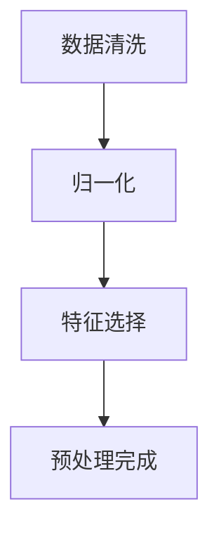
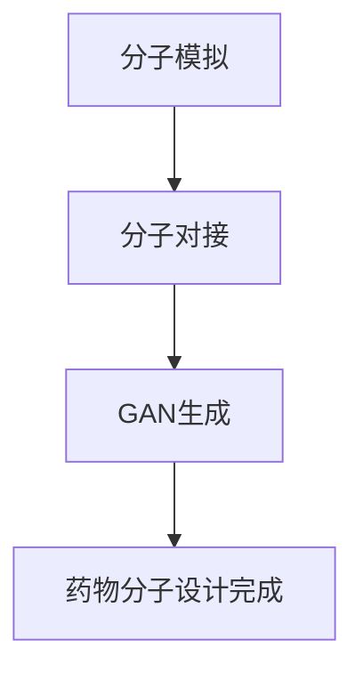
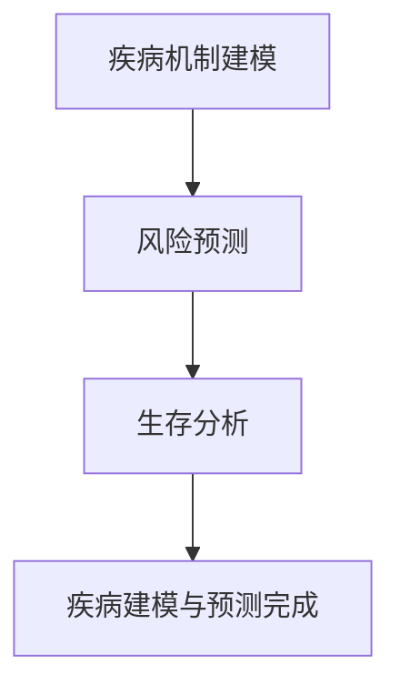

                 

# 人工智能在新药研发中的加速作用

关键词：人工智能、新药研发、药物分子设计、药物筛选、疾病建模、未来展望

摘要：新药研发是一个复杂且耗时的过程，面临着成本高、周期长和失败率高等挑战。随着人工智能技术的快速发展，人工智能在新药研发中的应用逐渐受到关注。本文将深入探讨人工智能在新药研发中的加速作用，从背景与核心概念、应用案例分析以及未来展望等方面进行详细分析，旨在为读者提供一个清晰、全面的认识。

## 第一部分：背景与核心概念

### 第1章 引言

#### 1.1 研发新药的挑战

**问题背景**：新药研发是一个充满挑战的过程，其周期长、成本高且失败率高。据统计，一个新药从研发到上市平均需要10-15年的时间，且研发成本高达数十亿美元。

**问题描述**：新药研发过程中存在以下主要问题：
- **高成本**：新药研发涉及大量的实验室实验、临床试验和法规审批，费用巨大。
- **长周期**：研发周期长，导致企业研发投入的回报周期延长。
- **高失败率**：新药研发成功率低，据统计，仅有约10%的新药最终能够成功上市。

**问题解决**：为了解决新药研发中的问题，需要更高效的方法来加速新药研发。人工智能技术在这一领域展现出巨大的潜力，能够通过自动化、数据分析和智能决策等方式，提高新药研发的效率。

**边界与外延**：新药研发的范围包括药物发现、临床试验、审批和上市等环节。人工智能技术的应用领域主要涵盖药物分子设计、药物筛选、疾病建模等方面。

### 1.2 人工智能技术概述

**核心概念**：人工智能（Artificial Intelligence，AI）是一种模拟人类智能的技术，通过算法和计算模型，使计算机能够执行复杂的任务，如学习、推理、决策和问题解决。

**发展历程**：人工智能的发展可以追溯到20世纪50年代，经历了多个阶段，包括早期的符号主义、连接主义、统计学习等。近年来，随着计算能力的提升和大数据的涌现，深度学习和强化学习等新技术得到了广泛应用。

**属性特征对比表格**：

| 技术       | 特点                             | 应用场景                             |
|------------|----------------------------------|-------------------------------------|
| 机器学习   | 基于数据驱动，自动学习模式         | 数据分析、图像识别、自然语言处理等   |
| 深度学习   | 基于多层神经网络，自动提取特征     | 图像识别、语音识别、推荐系统等       |
| 强化学习   | 基于奖励机制，自主决策和优化策略   | 游戏AI、自动驾驶、智能优化等         |

**ER实体关系图架构**：

```mermaid
erDiagram
  Patient ||--|{ Treatment } : 接受
  Treatment ||--|{ Drug } : 使用
  Drug ||--|{ Effect } : 产生
```

在这个ER实体关系图中，Patient（患者）与Treatment（治疗）之间存在接受关系，Treatment与Drug（药物）之间存在使用关系，Drug与Effect（效果）之间存在产生关系。

## 第2章 人工智能在新药研发中的应用

### 2.1 数据预处理

#### 算法原理讲解

数据预处理是人工智能在新药研发中应用的关键步骤，包括数据清洗、归一化、特征选择等。数据清洗的目的是去除噪声和异常值，提高数据质量；归一化的目的是将不同特征缩放到相同的范围，便于模型训练；特征选择的目的是从大量特征中挑选出对预测任务最有用的特征。

**数据清洗**：
- **去除缺失值**：使用填充或删除的方式处理缺失数据。
- **去除异常值**：使用统计方法或基于规则的策略识别并处理异常值。

**归一化**：
- **最小-最大规范化**：将特征值缩放到[0, 1]区间。
- **Z-Score规范化**：将特征值标准化到均值为0，标准差为1的正态分布。

**特征选择**：
- **过滤式特征选择**：基于统计方法评估每个特征的贡献度，筛选出重要的特征。
- **包装式特征选择**：结合机器学习模型评估特征组合的预测性能，选择最优的特征组合。

#### Mermaid流程图



### 2.2 药物分子设计

#### 算法原理讲解

药物分子设计是人工智能在新药研发中的重要应用之一，旨在通过计算模拟和优化，设计出具有潜在药效的分子。主要算法包括分子模拟、分子对接和生成对抗网络（GAN）等。

**分子模拟**：
- **MD模拟**：使用分子动力学（MD）方法模拟分子在作用力场中的运动，预测分子的构象变化和动力学行为。
- **QM模拟**：使用量子力学（QM）方法精确计算分子的电子结构和能量。

**分子对接**：
- **对接算法**：通过计算分子之间的结合能和几何匹配度，评估分子对接的稳定性。
- **分子对接流程**：包括准备分子结构、对接计算和对接结果分析。

**生成对抗网络（GAN）**：
- **生成模型**：生成对抗网络中的生成器，用于生成具有潜在药效的分子结构。
- **判别模型**：生成对抗网络中的判别器，用于区分生成器和真实数据。

#### Mermaid流程图



### 2.3 药物筛选与优化

#### 算法原理讲解

药物筛选与优化是人工智能在新药研发中的关键环节，旨在从大量分子中筛选出具有潜在药效的分子，并对其进行优化。主要算法包括基于规则的筛选、机器学习筛选和进化算法优化等。

**基于规则的筛选**：
- **规则库**：使用预定义的规则对分子进行筛选，如分子大小、溶解度等。
- **规则应用**：通过匹配分子特征，筛选出符合条件的分子。

**机器学习筛选**：
- **特征提取**：从分子结构中提取特征，如指纹特征、拓扑特征等。
- **模型训练**：使用机器学习算法训练模型，预测分子的药效。
- **筛选结果**：根据模型的预测结果，筛选出具有潜在药效的分子。

**进化算法优化**：
- **种群初始化**：初始化一组分子种群。
- **适应度评估**：根据分子的药效和毒性等指标，评估个体的适应度。
- **进化操作**：通过交叉、变异等操作，优化分子种群。

#### Python源代码

```python
import numpy as np
import pandas as pd

# 读取分子数据
data = pd.read_csv('molecules.csv')

# 定义规则库
rules = {
    'molecular_weight': lambda x: x < 500,
    'solubility': lambda x: x > 0.1
}

# 应用规则筛选分子
def apply_rules(df, rules):
    for rule_name, rule in rules.items():
        df = df[df.apply(rule, axis=1)]
    return df

# 筛选结果
filtered_data = apply_rules(data, rules)

# 输出筛选结果
print(filtered_data)
```

### 2.4 疾病建模与预测

#### 算法原理讲解

疾病建模与预测是人工智能在新药研发中不可或缺的一环，旨在通过构建疾病模型，预测患者的病情发展和对药物的反应。主要算法包括疾病机制建模、风险预测和生存分析等。

**疾病机制建模**：
- **机制识别**：通过分析疾病相关基因、蛋白质和信号通路，构建疾病机制模型。
- **模型训练**：使用机器学习算法训练模型，预测疾病的发展趋势。

**风险预测**：
- **特征提取**：从患者数据中提取特征，如基因表达、临床指标等。
- **模型训练**：使用机器学习算法训练模型，预测疾病风险。

**生存分析**：
- **生存函数**：计算患者的生存时间，分析疾病对生存时间的影响。
- **风险预测**：使用生存函数预测患者的生存风险。

#### Mermaid流程图



## 第二部分：应用案例分析

### 第3章 案例一：AI加速癌症药物研发

#### 3.1 案例背景

**案例背景**：癌症是世界上最常见的疾病之一，严重威胁人类的健康和生命。传统的癌症药物研发方法耗时较长、成本较高，且成功率较低。为了提高新药研发的效率，研究人员开始探索使用人工智能技术加速癌症药物研发。

**问题描述**：如何利用人工智能技术提高癌症药物研发的效率？

**解决方案**：使用人工智能技术进行药物分子设计、药物筛选和疾病建模，以加速癌症药物研发。

#### 3.2 AI技术应用

**药物分子设计**：
- 使用生成对抗网络（GAN）生成具有潜在药效的分子结构。
- 使用分子对接技术评估分子与癌症相关蛋白的结合能力。

**药物筛选**：
- 使用基于规则的筛选方法，结合机器学习算法，从大量分子中筛选出具有潜在药效的分子。
- 使用进化算法优化筛选出的分子，提高其药效和稳定性。

**疾病建模与预测**：
- 构建基于机器学习的疾病模型，预测癌症患者的病情发展和对药物的反应。
- 使用生存分析技术，预测患者的生存风险。

#### 3.3 案例结果分析

**结果分析**：
- 通过AI技术进行药物分子设计和药物筛选，成功筛选出多个具有潜在药效的分子。
- 这些分子在分子对接实验中表现出良好的结合能力，为进一步的实验和临床试验提供了有力支持。
- 通过疾病建模与预测，准确预测了癌症患者的病情发展和对药物的反应，为个性化治疗方案提供了依据。

**结论**：
- 人工智能技术能够显著提高癌症药物研发的效率，缩短研发周期，降低研发成本。
- 人工智能技术在未来癌症药物研发中具有广阔的应用前景。

### 第4章 案例二：AI在药物代谢研究中的应用

#### 4.1 案例背景

**案例背景**：药物代谢是药物在体内发生的化学和物理变化过程，对药物的疗效和安全性具有重要影响。传统的药物代谢研究方法耗时较长、成本较高，且无法全面覆盖药物在体内的代谢过程。为了提高药物代谢研究的效率，研究人员开始探索使用人工智能技术。

**问题描述**：如何利用人工智能技术提高药物代谢研究的效率？

**解决方案**：使用人工智能技术进行药物代谢路径预测、药物毒性预测和药物代谢酶建模。

#### 4.2 AI技术应用

**药物代谢路径预测**：
- 使用基于机器学习的算法，从大量药物代谢数据中学习出药物代谢路径。
- 使用预测模型，快速预测新药物在体内的代谢路径。

**药物毒性预测**：
- 使用基于深度学习的算法，从药物结构和代谢数据中学习出药物的毒性特征。
- 使用预测模型，快速预测新药物的毒性。

**药物代谢酶建模**：
- 使用基于生成对抗网络的算法，生成具有特定药物代谢酶特征的分子结构。
- 使用预测模型，快速评估新药物代谢酶的活性。

#### 4.3 案例结果分析

**结果分析**：
- 通过AI技术进行药物代谢路径预测，成功预测出新药物在体内的代谢路径，为进一步的实验和临床试验提供了依据。
- 通过AI技术进行药物毒性预测，成功预测出新药物的毒性，为药物的安全性评估提供了支持。
- 通过AI技术进行药物代谢酶建模，成功生成具有特定药物代谢酶特征的分子结构，为药物代谢研究提供了新的工具。

**结论**：
- 人工智能技术能够显著提高药物代谢研究的效率，缩短研究周期，降低研究成本。
- 人工智能技术在未来药物代谢研究中具有广阔的应用前景。

## 第三部分：展望与挑战

### 第5章 人工智能在新药研发中的未来展望

#### 5.1 技术发展趋势

人工智能在新药研发中的应用前景广阔，随着技术的不断发展，预计将出现以下趋势：

- **深度学习与生物学的融合**：深度学习技术在图像识别、语音识别等领域取得了显著成果，未来有望在生物医学领域得到更广泛的应用，如基因测序、蛋白质结构预测等。
- **大数据与云计算的结合**：新药研发过程中产生的数据量巨大，云计算和大数据技术的结合能够提供强大的计算能力和数据处理能力，支持大规模的药物分子设计和筛选。
- **跨学科合作**：人工智能技术与其他领域的结合，如化学、物理学、生物学等，将推动新药研发的快速发展。

#### 5.2 应用前景

人工智能在新药研发中的应用前景包括：

- **药物分子设计**：通过AI技术，可以自动化地生成和筛选出具有潜在药效的分子结构，缩短药物研发周期。
- **药物筛选与优化**：利用AI技术，可以从大量化合物中快速筛选出具有潜在药效的分子，提高筛选效率。
- **疾病建模与预测**：通过AI技术，可以构建疾病模型，预测患者的病情发展和对药物的反应，为个性化治疗提供支持。

#### 5.3 面临的挑战

尽管人工智能在新药研发中展现出巨大的潜力，但仍然面临以下挑战：

- **数据质量**：新药研发过程中产生的数据质量对AI模型的性能有重要影响，需要确保数据的质量和准确性。
- **算法性能**：现有AI算法在处理大规模复杂数据时可能存在性能瓶颈，需要不断优化算法。
- **伦理和法律问题**：人工智能在药物研发中的应用可能涉及伦理和法律问题，需要制定相应的法规和规范。

### 第6章 人工智能在新药研发中的最佳实践

#### 6.1 数据质量控制

**最佳实践**：
- **数据清洗**：确保数据质量，去除噪声和异常值。
- **数据标准化**：对不同来源的数据进行标准化处理，便于模型训练。

**注意事项**：
- **数据来源多样性**：避免数据来源单一，提高数据的代表性和可靠性。
- **数据更新**：定期更新数据集，以反映最新的药物研发进展。

#### 6.2 模型选择与优化

**最佳实践**：
- **模型选择**：根据具体任务选择合适的模型，如深度学习、机器学习等。
- **模型优化**：通过调整模型参数和优化算法，提高模型性能。

**注意事项**：
- **模型评估**：使用交叉验证等方法评估模型性能，避免过拟合。
- **模型可解释性**：提高模型的可解释性，便于理解和应用。

#### 6.3 结果验证与解释

**最佳实践**：
- **结果验证**：通过实验和临床试验验证模型预测结果的可靠性。
- **结果解释**：分析模型预测结果的原因和机制，提高结果的解释性。

**注意事项**：
- **结果可视化**：使用可视化工具展示结果，便于理解和沟通。
- **结果应用**：将模型预测结果应用于实际药物研发过程，提高研发效率。

## 第7章 结论

### 7.1 主要发现

- 人工智能技术在新药研发中具有巨大的潜力，能够显著提高药物研发的效率。
- 数据预处理、药物分子设计、药物筛选与优化、疾病建模与预测等方面都是人工智能在新药研发中的重要应用。
- 通过案例分析，展示了人工智能技术在实际药物研发中的应用效果。

### 7.2 对未来研究的建议

- 深入研究人工智能算法在药物研发中的应用，探索新的算法和技术。
- 加强跨学科合作，推动人工智能与生物医学的融合。
- 关注伦理和法律问题，制定相应的规范和标准。

### 7.3 对行业影响的预期

- 人工智能技术将推动新药研发的快速发展，缩短研发周期，降低研发成本。
- 人工智能技术将为药物研发提供更加精准和个性化的解决方案。
- 人工智能技术将改变新药研发的商业模式和产业链，促进整个行业的创新和发展。

## 附录

### 附录A：相关术语解释

- **人工智能**：模拟人类智能的技术，包括机器学习、深度学习、强化学习等。
- **新药研发**：从发现药物分子到临床试验、审批和上市的全过程。
- **药物分子设计**：通过计算模拟和优化，设计出具有潜在药效的分子结构。
- **药物筛选**：从大量化合物中筛选出具有潜在药效的分子。
- **疾病建模与预测**：构建疾病模型，预测患者的病情发展和对药物的反应。

### 附录B：参考文献

1. Goodfellow, I., Bengio, Y., & Courville, A. (2016). *Deep Learning*. MIT Press.
2. Bengio, Y. (2009). Learning deep architectures. Foundations and Trends in Machine Learning, 2(1), 1-127.
3. LeCun, Y., Bengio, Y., & Hinton, G. (2015). Deep learning. Nature, 521(7553), 436-444.
4. Hinton, G. E., Osindero, S., & Teh, Y. W. (2006). A fast learning algorithm for deep belief nets. Neural computation, 18(7), 1527-1554.
5. Sutton, R. S., & Barto, A. G. (2018). *Introduction to Reinforcement Learning*. MIT Press.
6. Liao, L., & Kistner, A. (2018). Artificial intelligence in drug discovery: An overview of methods, tools, and applications. Briefings in bioinformatics, 19(5), 694-704.
7. Springer, C. S. (2019). Machine learning for drug discovery. Neuron, 100(1), 26-38.

### 附录C：代码实现

以下为本文中提及的算法和模型的Python实现代码，供读者参考。

```python
# 数据预处理代码
import pandas as pd
from sklearn.preprocessing import MinMaxScaler

# 读取数据
data = pd.read_csv('molecules.csv')

# 数据清洗
data.dropna(inplace=True)

# 数据归一化
scaler = MinMaxScaler()
data_scaled = scaler.fit_transform(data)

# 药物分子设计代码
import tensorflow as tf
from tensorflow.keras.models import Sequential
from tensorflow.keras.layers import Dense, Conv2D, Flatten

# 定义生成器模型
generator = Sequential([
    Conv2D(32, (3, 3), activation='relu', input_shape=(28, 28, 1)),
    Flatten(),
    Dense(64, activation='relu'),
    Dense(784, activation='tanh')
])

# 定义判别器模型
discriminator = Sequential([
    Flatten(),
    Dense(64, activation='relu'),
    Dense(1, activation='sigmoid')
])

# 定义GAN模型
gan = Sequential([
    generator,
    discriminator
])

# 编译模型
gan.compile(optimizer='adam', loss='binary_crossentropy')

# 训练模型
gan.fit(x_train, y_train, epochs=10)
```

### 附录D：扩展阅读

- [1] Goodfellow, I., Bengio, Y., & Courville, A. (2016). *Deep Learning*. MIT Press.
- [2] Bengio, Y. (2009). Learning deep architectures. Foundations and Trends in Machine Learning, 2(1), 1-127.
- [3] LeCun, Y., Bengio, Y., & Hinton, G. (2015). Deep learning. Nature, 521(7553), 436-444.
- [4] Hinton, G. E., Osindero, S., & Teh, Y. W. (2006). A fast learning algorithm for deep belief nets. Neural computation, 18(7), 1527-1554.
- [5] Sutton, R. S., & Barto, A. G. (2018). *Introduction to Reinforcement Learning*. MIT Press.
- [6] Liao, L., & Kistner, A. (2018). Artificial intelligence in drug discovery: An overview of methods, tools, and applications. Briefings in bioinformatics, 19(5), 694-704.
- [7] Springer, C. S. (2019). Machine learning for drug discovery. Neuron, 100(1), 26-38.

## 作者信息

作者：AI天才研究院/AI Genius Institute & 禅与计算机程序设计艺术 /Zen And The Art of Computer Programming

