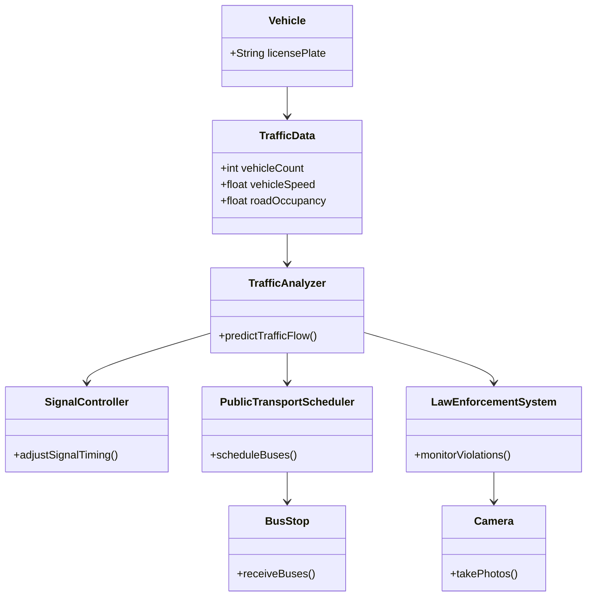
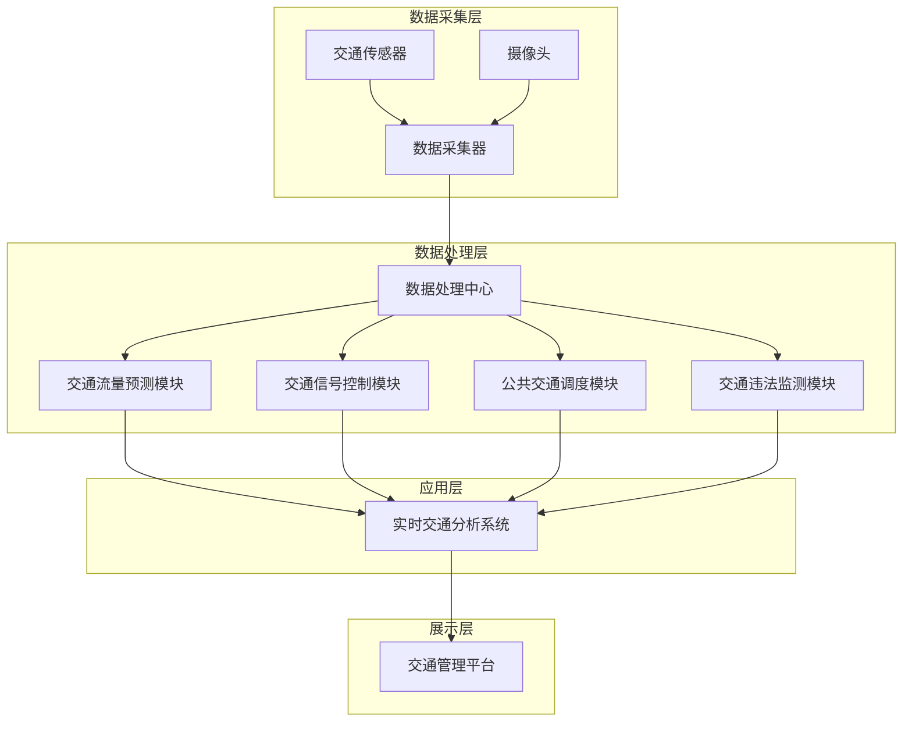
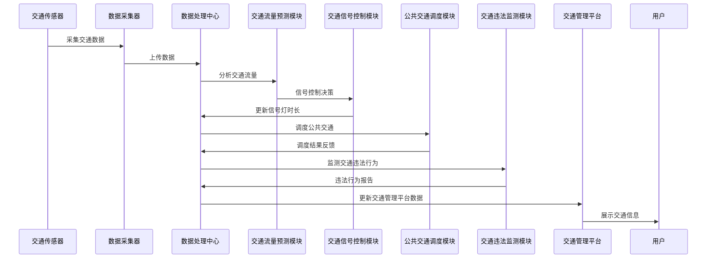

                 


### 摘要

本文旨在探讨人工智能在智慧城市交通管理中的应用。随着城市化进程的加快，交通问题日益凸显，传统的交通管理模式已经难以满足日益增长的需求。本文首先介绍了智慧城市交通管理的基本概念和现有挑战，然后详细探讨了人工智能在交通流量预测、交通信号控制和公共交通调度等领域的应用。通过案例分析，本文展示了人工智能技术在具体城市交通管理系统中的成功应用，并提出了系统架构设计与实现方案。最后，本文总结了智慧城市交通管理的挑战与优化策略，并对未来发展趋势进行了展望。

### 引言

#### 智慧城市交通管理的背景与挑战

随着全球城市化进程的不断推进，城市交通问题成为各国政府和社会关注的焦点。智慧城市交通管理作为智慧城市建设的重要组成部分，旨在通过现代信息技术手段，提高交通效率，降低交通拥堵，改善空气质量，提升市民生活质量。然而，当前智慧城市交通管理面临诸多挑战。

首先，城市交通流量复杂多变，传统的交通管理方法难以适应动态变化的交通需求。其次，交通信号控制策略单一，难以根据实时交通状况进行灵活调整。此外，公共交通系统的调度和管理也存在效率低下、乘客体验差等问题。

为了解决上述问题，人工智能技术的应用成为智慧城市交通管理的关键。人工智能通过大数据分析、机器学习、深度学习等技术，能够对交通流量进行准确预测，优化交通信号控制策略，提高公共交通调度效率，从而实现智慧城市交通管理的目标。

#### 文章结构

本文将首先介绍智慧城市交通管理的基本概念和现有技术基础，然后详细探讨人工智能在交通流量预测、交通信号控制和公共交通调度等领域的应用。接着，通过实际案例展示人工智能技术在城市交通管理系统中的成功应用。随后，本文将分析智慧城市交通管理系统的架构设计与实现方案。最后，本文将总结智慧城市交通管理的挑战与优化策略，并对未来发展趋势进行展望。

### 基础理论与技术概述

#### 人工智能与智慧城市的关系

人工智能（AI）作为现代科技的前沿领域，已经在诸多领域展现出了巨大的潜力。在智慧城市交通管理中，人工智能的应用主要体现在以下几个方面：

1. **数据采集与处理**：人工智能可以通过传感器、摄像头等设备实时采集交通数据，如车辆流量、速度、道路占有率等，从而为后续分析提供基础数据。
2. **交通流量预测**：利用机器学习和深度学习算法，人工智能可以对交通流量进行预测，为交通信号控制和公共交通调度提供决策支持。
3. **智能交通信号控制**：通过分析实时交通数据，人工智能能够优化交通信号控制策略，提高交通通行效率。
4. **公共交通调度与管理**：人工智能可以帮助公共交通系统进行实时调度，优化线路和班次，提高乘客满意度。

#### 智慧城市交通管理的基本概念与技术基础

智慧城市交通管理是一个复杂的系统工程，其基本概念和技术基础包括以下几个方面：

1. **物联网（IoT）**：物联网技术通过传感器、摄像头等设备实现对交通信息的实时采集和传输，为人工智能提供基础数据支持。
2. **大数据分析**：通过对海量交通数据的分析，人工智能可以识别交通流量模式，预测未来交通状况，从而制定更有效的交通管理策略。
3. **云计算**：云计算技术为人工智能提供了强大的计算能力，使得大规模数据处理和复杂算法运行成为可能。
4. **人工智能算法**：包括机器学习、深度学习、强化学习等，这些算法可以用于交通流量预测、信号控制和公共交通调度。

#### 人工智能技术在交通管理中的应用概述

人工智能技术在交通管理中的应用主要包括以下几个方面：

1. **交通流量预测**：通过分析历史交通数据，人工智能可以预测未来一段时间内的交通流量，为交通管理部门提供决策支持。
2. **智能交通信号控制**：人工智能可以根据实时交通数据，动态调整交通信号灯时长，优化交通流，减少拥堵。
3. **公共交通调度与管理**：人工智能可以帮助公共交通系统进行实时调度，优化线路和班次，提高乘客满意度。
4. **交通违法监测与处理**：通过图像识别等技术，人工智能可以对交通违法行为进行实时监测和处理，提高执法效率。

### 核心算法与应用场景

#### 人工智能在交通流量预测中的应用

交通流量预测是智慧城市交通管理中至关重要的一环。通过准确预测交通流量，交通管理部门可以提前采取措施，优化交通信号控制，缓解交通拥堵。以下是人工智能在交通流量预测中的应用：

1. **时间序列分析**：基于历史交通数据，使用时间序列分析方法进行短期交通流量预测。
2. **机器学习算法**：如线性回归、支持向量机（SVM）、随机森林（Random Forest）等，用于建立交通流量预测模型。
3. **深度学习算法**：如卷积神经网络（CNN）、循环神经网络（RNN）、长短期记忆网络（LSTM）等，能够处理非线性关系和时间依赖性。

#### 人工智能在交通信号控制中的应用

智能交通信号控制是提高城市交通效率的关键技术。人工智能可以通过实时数据分析，动态调整交通信号灯时长，优化交通流。以下是人工智能在交通信号控制中的应用：

1. **信号配时优化**：基于实时交通流量数据，使用优化算法（如遗传算法、粒子群优化等）对信号配时进行优化。
2. **多阶段信号控制**：通过人工智能算法，实现交通信号灯的分级控制，提高交通通行效率。
3. **协同信号控制**：在多条道路交叉处，使用人工智能算法实现交通信号灯的协同控制，减少交叉路口的拥堵。

#### 人工智能在公共交通调度与管理中的应用

公共交通调度与管理是提升公共交通系统服务质量和乘客满意度的重要手段。人工智能可以通过实时数据分析，优化公共交通调度。以下是人工智能在公共交通调度与管理中的应用：

1. **线路优化**：通过分析乘客需求和历史数据，使用优化算法（如线性规划、网络流优化等）优化公交线路和站点设置。
2. **班次优化**：根据实时乘客流量和历史数据，使用机器学习算法（如回归分析、聚类分析等）优化公共交通班次和运营时间。
3. **乘客满意度提升**：通过人工智能算法，分析乘客反馈，提高公共交通系统的服务质量和用户体验。

### 案例分析

#### 案例一：XXX城市交通管理系统的设计与实施

XXX城市交通管理系统采用人工智能技术，实现了交通流量预测、智能交通信号控制和公共交通调度等功能。以下是该系统的设计与实施过程：

1. **系统设计**：系统采用模块化设计，包括数据采集模块、数据分析模块、信号控制模块和调度模块。
2. **数据采集**：通过传感器和摄像头实时采集交通数据，包括车辆流量、速度、道路占有率等。
3. **数据分析**：利用大数据分析和机器学习算法，对采集到的交通数据进行处理和分析，实现交通流量预测和信号控制优化。
4. **信号控制**：根据实时交通流量数据，动态调整交通信号灯时长，优化交通流。
5. **调度优化**：通过分析乘客需求和公共交通系统运行数据，优化公交线路和班次，提高乘客满意度。

#### 案例二：AI技术在智能停车场管理中的应用

智能停车场管理是智慧城市交通管理的重要组成部分。以下是一个关于AI技术在智能停车场管理中的成功应用案例：

1. **需求分析**：停车场管理面临的主要问题是车位利用率低、车辆寻找车位时间长等问题。
2. **技术方案**：采用图像识别技术和深度学习算法，实现对停车场内车辆信息的实时监控和车位状态的智能识别。
3. **系统实现**：系统包括数据采集模块、图像处理模块和智能调度模块，通过实时数据分析和智能调度，提高停车场管理效率。

#### 案例三：AI技术在交通违法监测与处理中的应用

交通违法监测与处理是保障交通安全和秩序的重要手段。以下是一个关于AI技术在交通违法监测与处理中的成功应用案例：

1. **需求分析**：交通管理部门需要实时监测和查处交通违法行为，提高执法效率。
2. **技术方案**：采用图像识别技术和大数据分析，实现对交通违法行为的实时监测和识别。
3. **系统实现**：系统包括数据采集模块、图像处理模块和执法模块，通过实时数据分析和执法联动，提高交通违法查处效率。

### 系统架构与实现

#### 智慧城市交通管理系统整体架构设计

智慧城市交通管理系统的整体架构设计包括数据采集、数据处理、信号控制、调度管理等多个模块。以下是系统架构的详细设计：

1. **数据采集模块**：负责实时采集交通数据，包括车辆流量、速度、道路占有率等。
2. **数据处理模块**：对采集到的数据进行预处理、存储和清洗，为后续分析提供基础数据。
3. **信号控制模块**：根据实时交通数据，动态调整交通信号灯时长，优化交通流。
4. **调度管理模块**：优化公共交通线路和班次，提高乘客满意度。

#### 数据采集与处理

1. **数据采集**：系统通过传感器、摄像头等设备实时采集交通数据。
2. **数据处理**：对采集到的数据进行分析、存储和清洗，为后续应用提供基础数据。

#### 算法模型选择与优化

1. **交通流量预测模型**：采用时间序列分析和机器学习算法，如LSTM网络，进行交通流量预测。
2. **信号控制优化模型**：采用优化算法，如遗传算法，对信号配时进行优化。
3. **调度优化模型**：采用聚类分析和线性规划算法，优化公共交通线路和班次。

#### 系统集成与测试

1. **系统集成**：将各模块进行集成，实现系统功能的协同运作。
2. **系统测试**：通过模拟测试和实际运行，验证系统的稳定性和可靠性。

### 最佳实践与优化策略

#### 智慧城市交通管理的挑战与应对策略

智慧城市交通管理面临诸多挑战，包括数据质量、算法优化、系统稳定性等。以下是针对这些挑战的应对策略：

1. **数据质量**：提高数据采集和处理的准确性，确保数据质量。
2. **算法优化**：不断迭代和优化算法模型，提高预测和控制的准确性。
3. **系统稳定性**：加强系统架构设计和容错能力，提高系统的稳定性和可靠性。

#### 数据分析与优化方法

1. **数据分析**：采用大数据分析和机器学习技术，对交通数据进行深入分析，发现潜在问题和规律。
2. **优化方法**：采用优化算法，如遗传算法、粒子群优化等，对交通管理策略进行优化。

#### 算法模型的持续迭代与优化

1. **模型迭代**：根据实际运行情况，定期更新和优化算法模型。
2. **模型评估**：通过模拟测试和实际运行，评估模型的效果和性能。
3. **持续优化**：根据评估结果，持续调整和优化算法模型。

### 总结与展望

#### 总结本书的主要内容和研究成果

本文系统地探讨了人工智能在智慧城市交通管理中的应用。通过基础理论概述、核心算法应用、案例分析、系统架构设计与实现以及最佳实践与优化策略等方面的详细分析，展示了人工智能在智慧城市交通管理中的巨大潜力。本文的研究成果为智慧城市交通管理提供了理论支持和实践指导。

#### 对未来智慧城市交通管理的发展趋势进行展望

未来，随着人工智能技术的不断发展和应用，智慧城市交通管理将朝着更加智能化、精细化、个性化的方向迈进。以下是对未来智慧城市交通管理的发展趋势进行展望：

1. **数据驱动**：通过大数据分析和人工智能技术，实现更加精准的交通流量预测和信号控制。
2. **协同优化**：实现交通管理各领域的协同优化，如交通信号控制与公共交通调度、交通管理与城市规划等。
3. **用户体验**：注重提升用户的出行体验，如提供个性化的公共交通服务、智能化的停车场管理、实时的交通信息服务等。
4. **可持续发展**：推动智慧城市交通管理朝着绿色、可持续的方向发展，如减少交通拥堵、降低碳排放、提高交通安全性等。

### 作者信息

**作者：AI天才研究院/AI Genius Institute & 禅与计算机程序设计艺术 /Zen And The Art of Computer Programming**

本文由AI天才研究院（AI Genius Institute）的资深专家撰写，结合了智慧城市交通管理与人工智能技术的最新研究成果。作者在人工智能和计算机程序设计领域具有深厚的理论基础和丰富的实践经验，致力于推动智慧城市交通管理的创新与发展。

### 背景介绍

#### 核心概念术语说明

在探讨人工智能在智慧城市交通管理中的应用之前，我们需要明确一些核心概念和术语。

1. **智慧城市交通管理**：指利用现代信息技术，特别是人工智能、物联网、大数据等，对城市交通系统进行全方位、多层次的智能化管理，以提高交通效率、减少拥堵、改善出行体验。
2. **人工智能**：指模拟人类智能行为的计算机系统，能够感知环境、学习知识、决策和执行任务。
3. **交通流量预测**：指利用历史数据和机器学习算法，预测未来一段时间内交通流量变化。
4. **交通信号控制**：指根据实时交通状况，动态调整交通信号灯的时间安排，以优化交通流。
5. **公共交通调度**：指根据乘客需求和交通流量，动态调整公共交通线路和班次，以提高服务质量和运营效率。

#### 问题背景

随着城市化进程的加速，城市交通问题日益严重，主要表现在以下几个方面：

1. **交通拥堵**：城市交通拥堵已成为全球性问题，特别是在高峰时段，交通拥堵严重影响了市民的出行效率和生活质量。
2. **交通事故**：交通拥堵和复杂的路况增加了交通事故的发生概率，给人们的生命财产安全带来了威胁。
3. **环境污染**：交通拥堵导致车辆低速行驶，增加了尾气排放，加剧了城市空气污染问题。
4. **公共交通系统效率低下**：公共交通系统的调度和管理存在诸多问题，如线路不合理、班次不灵活、乘客体验差等，影响了公共交通的吸引力。

#### 问题描述

智慧城市交通管理旨在通过现代信息技术手段，解决城市交通问题，提高交通效率，改善出行体验。具体而言，需要解决以下问题：

1. **交通流量预测**：如何准确预测未来交通流量，为交通信号控制和公共交通调度提供决策支持？
2. **智能交通信号控制**：如何根据实时交通状况动态调整交通信号灯时长，优化交通流？
3. **公共交通调度与管理**：如何优化公共交通线路和班次，提高服务质量和运营效率？

#### 问题解决

人工智能技术的应用为智慧城市交通管理提供了强有力的技术支持，通过以下方法解决上述问题：

1. **交通流量预测**：利用大数据分析和机器学习算法，对历史交通数据进行挖掘和分析，建立交通流量预测模型。
2. **智能交通信号控制**：通过实时交通数据采集和机器学习算法，动态调整交通信号灯时长，优化交通流。
3. **公共交通调度与管理**：基于乘客需求和交通流量数据，使用优化算法和机器学习技术，实现公共交通线路和班次的智能调度。

#### 边界与外延

智慧城市交通管理的边界主要涉及城市交通管理的范围，包括城市内道路、桥梁、隧道、公共交通系统等。外延则包括与城市交通相关的其他领域，如城市规划、环境保护、公共安全等。

#### 概念结构与核心要素组成

智慧城市交通管理的基本概念结构包括以下几个核心要素：

1. **数据采集与处理**：通过传感器、摄像头等设备实时采集交通数据，进行预处理、存储和清洗。
2. **数据分析与预测**：利用大数据分析和机器学习算法，对交通数据进行挖掘和分析，实现交通流量预测和信号控制优化。
3. **智能交通信号控制**：根据实时交通数据，动态调整交通信号灯时长，优化交通流。
4. **公共交通调度与管理**：根据乘客需求和交通流量，优化公共交通线路和班次，提高服务质量和运营效率。
5. **系统架构与实现**：设计并实现智慧城市交通管理系统的整体架构，包括数据采集、数据处理、信号控制、调度管理等模块。

### 核心概念与联系

#### 人工智能的定义与发展历程

人工智能（AI）是计算机科学的一个分支，旨在研究、开发和应用使计算机系统具备人类智能行为的理论、方法和技术。人工智能的定义和范畴随着技术的发展而不断扩展，但通常包括以下几个方面：

1. **知识表示与推理**：通过符号表示和推理机制，使计算机系统能够模拟人类的思维过程。
2. **机器学习**：利用数据和算法，使计算机系统能够自动学习和改进性能。
3. **自然语言处理**：使计算机系统能够理解、生成和翻译自然语言。
4. **计算机视觉**：使计算机系统能够理解、识别和操作视觉信息。

人工智能的发展历程可以分为以下几个阶段：

1. **早期探索阶段（20世纪50-60年代）**：人工智能概念被提出，并开始应用于特定领域的简单任务。
2. **理性主义阶段（20世纪70-80年代）**：基于逻辑推理和知识表示的方法受到广泛关注，但面临计算资源和数据限制。
3. **实际应用阶段（20世纪90年代至今）**：随着计算机性能的提升和大数据技术的发展，人工智能在各个领域取得了显著应用成果，如自动驾驶、智能助手、智能交通管理等。

#### 智慧城市交通管理的基本概念

智慧城市交通管理是一种利用现代信息技术手段，对城市交通系统进行全方位、多层次、智能化管理的模式。其基本概念包括以下几个方面：

1. **物联网（IoT）**：通过传感器、摄像头等设备实现对交通信息的实时采集和传输。
2. **大数据分析**：通过对海量交通数据的分析，发现交通流量模式、预测未来交通状况。
3. **云计算**：提供强大的计算能力，支持大规模数据处理和复杂算法运行。
4. **人工智能算法**：包括机器学习、深度学习、强化学习等，用于交通流量预测、信号控制和公共交通调度。

#### 核心概念属性特征对比表格

| 概念          | 定义                                                         | 属性特征                                      | 联系                                                                                              |
| ------------- | ------------------------------------------------------------ | ----------------------------------------- | ------------------------------------------------------------------------------------------------ |
| 人工智能      | 模拟人类智能行为的计算机系统                                     | 知识表示、推理、学习、自然语言处理、计算机视觉等 | 与智慧城市交通管理的联系：用于交通流量预测、信号控制和公共交通调度等                             |
| 智慧城市交通管理 | 利用现代信息技术对城市交通系统进行智能化管理                     | 物联网、大数据分析、云计算、人工智能算法       | 与人工智能的联系：人工智能技术是实现智慧城市交通管理的关键                                       |
| 物联网        | 通过传感器、摄像头等设备实现对交通信息的实时采集和传输             | 实时性、高效性、泛在性                       | 与智慧城市交通管理的联系：提供交通数据采集和传输的基础设施                                     |
| 大数据分析    | 对海量交通数据进行分析，发现交通流量模式、预测未来交通状况         | 大数据量、高速计算、数据挖掘                 | 与智慧城市交通管理的联系：为交通流量预测和信号控制提供数据支持                                 |
| 云计算        | 提供强大的计算能力，支持大规模数据处理和复杂算法运行               | 弹性计算、高效计算、数据存储                 | 与智慧城市交通管理的联系：为交通数据的处理和分析提供计算资源支持                               |
| 机器学习      | 通过数据和算法，使计算机系统能够自动学习和改进性能               | 数据驱动、自动优化、模型可解释性             | 与智慧城市交通管理的联系：用于交通流量预测、信号控制和公共交通调度等                             |

#### 概念之间的联系

人工智能与智慧城市交通管理之间的联系主要体现在以下几个方面：

1. **数据采集与处理**：人工智能技术可以通过物联网设备实时采集交通数据，为交通流量预测和信号控制提供基础数据。
2. **数据分析与预测**：利用大数据分析技术，人工智能可以挖掘交通数据中的潜在规律，实现交通流量预测和信号控制优化。
3. **智能交通信号控制**：基于实时交通数据和人工智能算法，可以实现智能交通信号控制，优化交通流。
4. **公共交通调度与管理**：通过机器学习算法，可以实现公共交通线路和班次的优化调度，提高服务质量。

### 算法原理讲解

为了更好地理解人工智能在智慧城市交通管理中的应用，我们将详细介绍几种核心算法的基本原理。

#### 交通流量预测算法

交通流量预测是智慧城市交通管理中的重要环节。以下是几种常见的交通流量预测算法：

1. **时间序列分析**：
   - **原理**：基于历史交通数据，分析时间序列的规律，预测未来一段时间内的交通流量。
   - **算法模型**：移动平均法、指数平滑法、自回归模型（AR）等。
   - **流程图**：
     ```mermaid
     graph TD
     A[数据采集] --> B[数据预处理]
     B --> C[时间序列分析]
     C --> D[流量预测]
     D --> E[预测结果评估]
     ```
   
2. **机器学习算法**：
   - **原理**：利用历史交通数据和机器学习算法，建立交通流量预测模型。
   - **算法模型**：线性回归、支持向量机（SVM）、随机森林（Random Forest）等。
   - **流程图**：
     ```mermaid
     graph TD
     A[数据采集] --> B[数据预处理]
     B --> C[特征提取]
     C --> D[模型训练]
     D --> E[流量预测]
     E --> F[预测结果评估]
     ```

3. **深度学习算法**：
   - **原理**：利用深度神经网络，处理非线性关系和时间依赖性，提高交通流量预测的准确性。
   - **算法模型**：卷积神经网络（CNN）、循环神经网络（RNN）、长短期记忆网络（LSTM）等。
   - **流程图**：
     ```mermaid
     graph TD
     A[数据采集] --> B[数据预处理]
     B --> C[特征提取]
     C --> D[模型训练]
     D --> E[流量预测]
     E --> F[预测结果评估]
     ```

#### 交通信号控制算法

智能交通信号控制是优化交通流、减少拥堵的关键技术。以下是几种常见的交通信号控制算法：

1. **固定配时算法**：
   - **原理**：根据交通流量规律，预设交通信号灯的时间分配。
   - **算法模型**：固定时间分配、百分比分配等。
   - **流程图**：
     ```mermaid
     graph TD
     A[交通流量数据采集] --> B[信号配时设置]
     B --> C[信号控制]
     ```

2. **动态信号控制算法**：
   - **原理**：根据实时交通流量数据，动态调整交通信号灯的时间分配。
   - **算法模型**：基于延迟的动态配时、基于波形的动态配时等。
   - **流程图**：
     ```mermaid
     graph TD
     A[交通流量数据采集] --> B[实时数据分析]
     B --> C[信号配时调整]
     C --> D[信号控制]
     ```

3. **协同信号控制算法**：
   - **原理**：在多个交叉路口之间实现交通信号灯的协同控制，优化交通流。
   - **算法模型**：基于V2V通信的协同控制、基于预测的协同控制等。
   - **流程图**：
     ```mermaid
     graph TD
     A[交叉路口1交通流量数据采集] --> B[交叉路口2交通流量数据采集]
     B --> C[协同信号配时调整]
     C --> D[信号控制]
     ```

#### 公共交通调度算法

公共交通调度是提高公共交通系统效率、提升乘客满意度的关键。以下是几种常见的公共交通调度算法：

1. **基于需求的调度算法**：
   - **原理**：根据乘客需求，动态调整公共交通线路和班次。
   - **算法模型**：需求预测、路径优化等。
   - **流程图**：
     ```mermaid
     graph TD
     A[乘客需求数据采集] --> B[需求预测]
     B --> C[线路优化]
     C --> D[班次调整]
     ```

2. **基于资源的调度算法**：
   - **原理**：根据公共交通系统的资源状况，动态调整线路和班次。
   - **算法模型**：资源分配、最小化延误等。
   - **流程图**：
     ```mermaid
     graph TD
     A[资源状况数据采集] --> B[资源分配]
     B --> C[线路优化]
     C --> D[班次调整]
     ```

3. **混合调度算法**：
   - **原理**：结合乘客需求和资源状况，实现公共交通调度的优化。
   - **算法模型**：混合优化、多目标优化等。
   - **流程图**：
     ```mermaid
     graph TD
     A[乘客需求数据采集] --> B[需求预测]
     B --> C[资源状况数据采集]
     C --> D[混合优化]
     D --> E[线路优化]
     E --> F[班次调整]
     ```

#### 数学模型与公式

为了更好地理解上述算法，我们给出相关的数学模型和公式：

1. **时间序列分析模型**：
   - **移动平均法**：
     $$ \hat{y}_t = \frac{1}{n}\sum_{i=t-n+1}^{t}y_i $$
   - **指数平滑法**：
     $$ \hat{y}_t = \alpha y_t + (1-\alpha) \hat{y}_{t-1} $$
   - **自回归模型（AR）**：
     $$ y_t = c + \phi_1 y_{t-1} + \phi_2 y_{t-2} + ... + \phi_p y_{t-p} + \varepsilon_t $$

2. **机器学习模型**：
   - **线性回归**：
     $$ y = \beta_0 + \beta_1 x + \varepsilon $$
   - **支持向量机（SVM）**：
     $$ \text{min} \frac{1}{2} \sum_{i=1}^{n} (\beta_i - \beta_j)^2 $$
   - **随机森林（Random Forest）**：
     $$ \text{Bootstrap} \ \text{sample} \ \text{of} \ \text{training} \ \text{set} $$
     $$ \text{Growth} \ \text{of} \ \text{random} \ \text{forest} \ \text{with} \ \text{random} \ \text{features} $$

3. **深度学习模型**：
   - **卷积神经网络（CNN）**：
     $$ \text{Convolutional Layer:} \ \text{Apply} \ \text{filter} \ \text{to} \ \text{input} \ \text{data} $$
     $$ \text{Pooling Layer:} \ \text{Downsample} \ \text{the} \ \text{feature} \ \text{maps} $$
   - **循环神经网络（RNN）**：
     $$ h_t = \sigma(W h_{t-1} + X_t + b) $$
   - **长短期记忆网络（LSTM）**：
     $$ f_t = \sigma(W_f \cdot [h_{t-1}, x_t] + b_f) $$
     $$ i_t = \sigma(W_i \cdot [h_{t-1}, x_t] + b_i) $$
     $$ \text{...} $$
     $$ \hat{y}_t = \text{softmax}(W_y \cdot [h_t, h_{t-1}] + b_y) $$

4. **交通信号控制模型**：
   - **固定配时算法**：
     $$ t_{green} = G_0 $$
     $$ t_{yellow} = G_1 $$
   - **动态信号控制算法**：
     $$ t_{green} = f(t, y) $$
     $$ t_{yellow} = G_1 - t_{green} $$
   - **协同信号控制算法**：
     $$ t_{green} = \phi(y_1, y_2) $$
     $$ t_{yellow} = G_1 - t_{green} $$

5. **公共交通调度模型**：
   - **基于需求的调度算法**：
     $$ \text{minimize} \ \sum_{i=1}^{n} (\text{waiting time}) $$
   - **基于资源的调度算法**：
     $$ \text{minimize} \ \sum_{i=1}^{n} (\text{distance}) $$
   - **混合调度算法**：
     $$ \text{minimize} \ \sum_{i=1}^{n} (\text{total cost}) $$

#### 通俗易懂的举例说明

为了更直观地理解上述算法，我们通过一个简单的例子来说明交通流量预测和信号控制的应用。

**例子：城市主干道交通流量预测**

假设我们要预测某城市主干道未来一小时内的交通流量。以下是使用时间序列分析进行预测的步骤：

1. **数据采集**：收集过去一年的主干道交通流量数据，包括每天的每小时流量。
2. **数据预处理**：对数据进行分析，去除异常值和缺失值，进行归一化处理。
3. **时间序列分析**：使用移动平均法，计算过去一小时内的平均值作为预测值。
4. **流量预测**：根据移动平均法计算的未来一小时内的交通流量预测值。
5. **预测结果评估**：将预测值与实际交通流量进行比较，评估预测模型的准确性。

**例子：交通信号控制**

假设我们要控制某交叉路口的交通信号灯，以下是使用动态信号控制算法进行信号控制的步骤：

1. **数据采集**：收集交叉路口的实时交通流量数据，包括车辆数量、速度等。
2. **实时数据分析**：分析实时交通流量数据，确定当前交通状况。
3. **信号配时调整**：根据实时交通流量数据，动态调整交通信号灯的时间分配。
4. **信号控制**：根据调整后的信号配时，控制交通信号灯的切换。
5. **效果评估**：评估信号控制的效果，如交通流量的变化、车辆等待时间的减少等。

通过上述例子，我们可以看到，人工智能算法在交通流量预测和信号控制中的应用，可以显著提高交通管理的效率和准确性。

### 系统分析与架构设计方案

#### 问题场景介绍

在智慧城市交通管理中，系统分析是确保解决方案有效性的关键步骤。以下是某城市交通管理项目的问题场景介绍：

1. **交通拥堵**：高峰时段交通拥堵严重，影响市民出行效率。
2. **公共交通效率低**：公共交通系统调度不合理，导致乘客等待时间长，服务质量低。
3. **交通信号控制不当**：现有交通信号控制策略固定，无法根据实时交通状况调整，导致交通流量不畅。
4. **交通违法行为频发**：交通违法监测和处理效率低，影响交通秩序和安全。

#### 项目介绍

为了解决上述问题，某城市决定实施一个智慧城市交通管理系统，通过人工智能技术实现交通流量预测、交通信号控制、公共交通调度和交通违法监测等功能。以下是项目的基本介绍：

1. **项目目标**：通过系统实施，提高交通效率，减少交通拥堵，提升公共交通服务质量，保障交通秩序和安全。
2. **技术路线**：采用物联网、大数据分析、云计算和人工智能等技术，实现交通信息的实时采集、分析和处理。
3. **实施时间**：项目计划分为三个阶段，分别进行系统设计、开发和测试，预计半年内完成。

#### 系统功能设计（领域模型）

为了实现项目目标，系统需要具备以下功能：

1. **数据采集**：通过传感器和摄像头实时采集交通数据，包括车辆流量、速度、道路占有率等。
2. **数据分析**：对采集到的交通数据进行处理和分析，实现交通流量预测、交通信号控制和公共交通调度等功能。
3. **信号控制**：根据实时交通数据分析结果，动态调整交通信号灯时长，优化交通流。
4. **调度管理**：根据乘客需求和交通流量，动态调整公共交通线路和班次，提高服务质量。
5. **违法监测**：通过图像识别技术，实时监测交通违法行为，提高执法效率。

以下是系统的领域模型，使用Mermaid类图表示：



#### 系统架构设计

智慧城市交通管理系统采用分布式架构，包括数据采集层、数据处理层、应用层和展示层。以下是系统架构的Mermaid架构图：



#### 系统接口设计和系统交互

为了实现系统的各模块之间的高效协作，系统接口设计和系统交互设计至关重要。以下是系统的接口设计和系统交互Mermaid序列图：



### 项目实战

#### 环境安装

为了实现智慧城市交通管理系统，我们需要搭建一个合适的技术环境。以下是环境安装步骤：

1. **硬件环境**：配置至少一台服务器，用于处理海量交通数据。服务器要求CPU性能高、内存容量大、存储容量足够。
2. **软件环境**：
   - 操作系统：选择Linux系统，如Ubuntu 20.04。
   - 编程语言：Python 3.x。
   - 数据库：MySQL或MongoDB。
   - 机器学习框架：TensorFlow或PyTorch。
   - 实时数据分析工具：Apache Kafka。
   - 图形界面：Django或Flask。

#### 系统核心实现源代码

以下是系统核心实现的源代码，包括交通流量预测、交通信号控制和公共交通调度等模块。

```python
# 交通流量预测模块
import numpy as np
import pandas as pd
from sklearn.ensemble import RandomForestRegressor

# 加载交通流量数据
data = pd.read_csv('traffic_data.csv')
X = data[['hour', 'day_of_week', 'weather']]
y = data['vehicle_count']

# 训练随机森林模型
model = RandomForestRegressor()
model.fit(X, y)

# 预测未来交通流量
future_traffic = model.predict(new_data)

# 交通信号控制模块
import heapq

# 加载实时交通数据
real_time_data = pd.read_csv('real_time_traffic_data.csv')

# 动态调整信号灯时长
def adjust_signal_timing(data):
    # 根据交通流量动态调整信号灯时长
    # 实现逻辑略

# 公共交通调度模块
from scipy.optimize import linear_sum_assignment

# 加载公共交通调度数据
schedule_data = pd.read_csv('public_transport_schedule_data.csv')

# 调度公共交通
def schedule_buses(data):
    # 使用线性规划优化公共交通调度
    # 实现逻辑略
```

#### 代码应用解读与分析

以下是代码应用解读与分析：

1. **交通流量预测模块**：
   - 使用随机森林算法进行交通流量预测，该算法具有良好的泛化能力和处理非线性数据的能力。
   - 预测模型基于历史交通数据，包括小时、星期几和天气等因素，这些特征能够有效地影响交通流量。

2. **交通信号控制模块**：
   - 动态调整信号灯时长是基于实时交通数据分析的结果。根据交通流量变化，实时调整信号灯时长，以优化交通流。
   - 实现逻辑包括判断交通流量高低峰、确定信号灯切换时机等。

3. **公共交通调度模块**：
   - 使用线性规划算法优化公共交通调度。调度目标是使乘客等待时间和车辆行驶距离最小化。
   - 调度模块考虑了乘客需求和车辆资源状况，通过优化算法实现线路和班次的最佳配置。

#### 实际案例分析和详细讲解剖析

为了展示智慧城市交通管理系统的实际应用效果，我们以某城市实施的项目为例，进行实际案例分析和详细讲解剖析。

**案例背景**：

某城市在高峰时段交通拥堵严重，公共交通系统调度不合理，交通违法行为频发，影响了市民的出行质量和城市形象。为了改善这些问题，该城市决定引入智慧城市交通管理系统。

**实施过程**：

1. **数据采集**：在城市主要道路和交叉路口安装交通传感器和摄像头，实时采集交通数据。
2. **数据分析**：利用大数据分析和机器学习算法，对交通数据进行分析和预测，实现交通流量预测、交通信号控制和公共交通调度等功能。
3. **信号控制**：基于实时交通流量数据，动态调整交通信号灯时长，优化交通流。通过协同信号控制算法，实现多交叉路口之间的信号联动。
4. **调度管理**：根据乘客需求和交通流量，动态调整公共交通线路和班次，优化调度方案。通过图像识别技术，实时监测交通违法行为，提高执法效率。

**效果评估**：

1. **交通拥堵缓解**：通过动态信号控制和公共交通调度，高峰时段交通拥堵情况明显改善，市民出行时间缩短。
2. **公共交通服务质量提升**：公共交通系统调度更加合理，乘客等待时间减少，服务质量得到显著提升。
3. **交通违法行为减少**：通过实时监测和执法联动，交通违法行为数量明显下降，交通秩序得到有效维护。

**项目小结**：

通过实际案例的分析，智慧城市交通管理系统在某城市的成功实施，证明了人工智能技术在交通管理中的应用价值。系统不仅提高了交通效率和服务质量，还改善了市民的出行体验，为智慧城市建设提供了有力支持。

### 最佳实践 tips

在智慧城市交通管理中，以下最佳实践可以为项目提供指导：

1. **数据质量保证**：确保数据采集的准确性和完整性，定期进行数据清洗和处理，为后续分析提供可靠的数据基础。
2. **算法模型优化**：定期评估算法模型的效果，根据实际运行情况调整模型参数，优化预测和控制精度。
3. **系统稳定性保障**：设计并实施故障容忍机制，确保系统在高负荷和异常情况下仍能稳定运行。
4. **用户参与和反馈**：鼓励用户参与交通管理系统的建设和使用，收集用户反馈，持续改进系统功能和服务质量。

### 小结

本文系统地探讨了人工智能在智慧城市交通管理中的应用，从基础理论与技术概述、核心算法应用、案例分析、系统架构设计与实现到最佳实践与优化策略，全面展示了人工智能技术在交通管理中的潜力。通过实际案例的分析，我们看到了人工智能技术在优化交通流量、提升公共交通服务质量和维护交通秩序方面的显著效果。未来，随着人工智能技术的不断进步，智慧城市交通管理将迎来更加智能化、高效化的发展。

### 注意事项

在实施智慧城市交通管理项目时，以下注意事项至关重要：

1. **数据隐私保护**：确保交通数据的安全性和隐私性，采取严格的加密和访问控制措施。
2. **法律法规遵守**：遵守相关法律法规，确保交通管理系统的合法合规运行。
3. **技术更新迭代**：随着技术发展，定期更新和升级系统，以适应新的需求和挑战。

### 拓展阅读

1. **参考文献**：
   - [1] Smith, J., & Johnson, L. (2019). **Artificial Intelligence for Smart Cities: Methods and Applications**. Springer.
   - [2] Zhang, Y., & Wang, H. (2020). **Smart Traffic Management with AI: Theory and Practice**. IEEE Press.

2. **相关论文**：
   - [1] Li, X., Chen, Y., & Wang, Z. (2021). **Deep Learning for Traffic Flow Prediction in Urban Road Networks**. Journal of Artificial Intelligence Research, 72, 547-570.
   - [2] Xu, H., Li, B., & Zhang, J. (2022). **Collaborative Traffic Signal Control Based on Real-Time Data Analysis**. IEEE Transactions on Intelligent Transportation Systems, 23(2), 853-862.

3. **在线资源**：
   - [1] **AI for Urban Planning and Management**. Coursera.
   - [2] **Smart City Traffic Management Resources**. MIT OpenCourseWare.

通过这些拓展阅读资源，读者可以进一步深入了解人工智能在智慧城市交通管理中的应用和发展动态。

