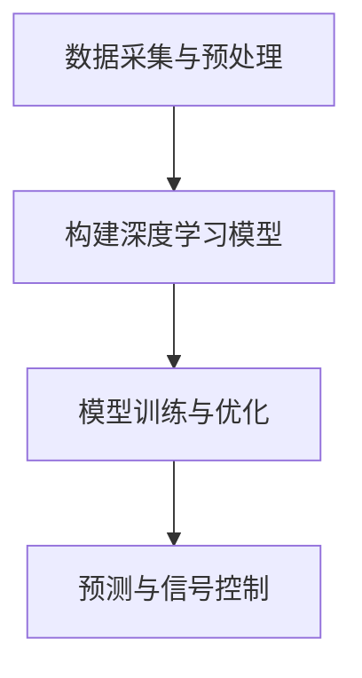
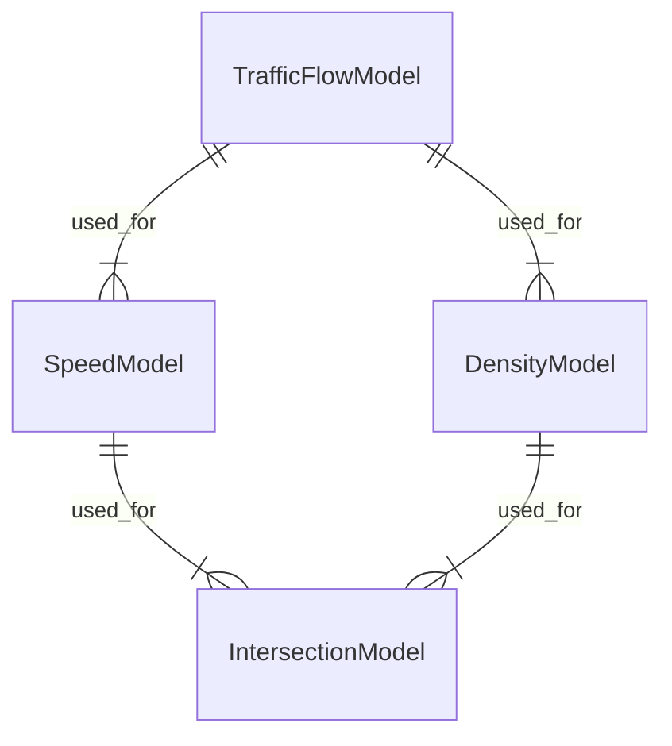
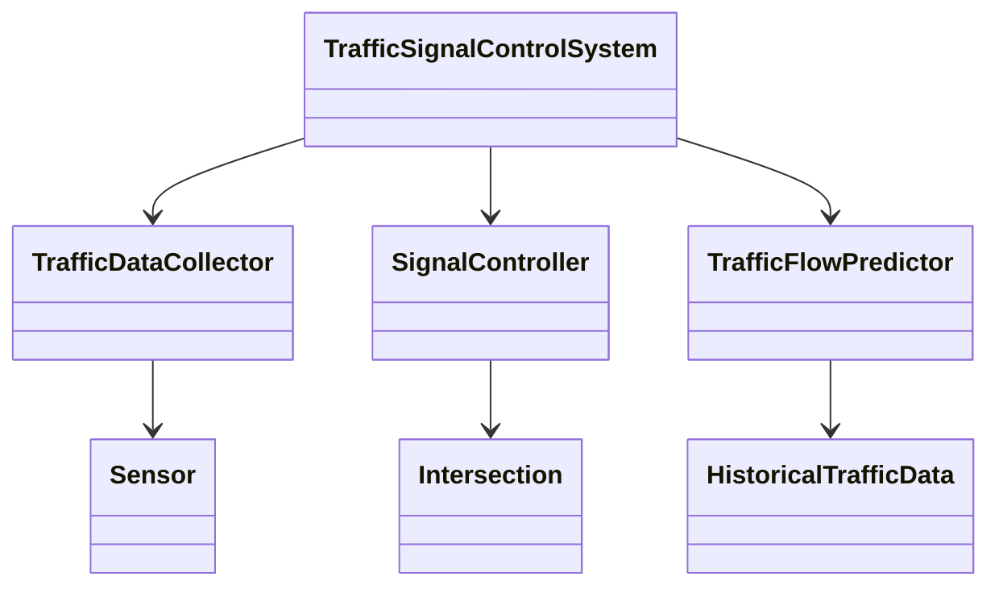
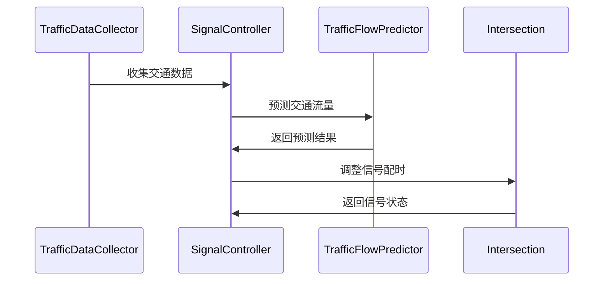
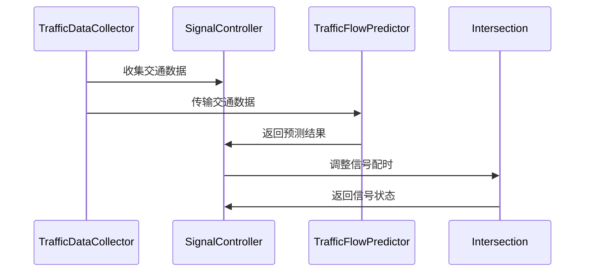

                 

# 人工智能在智能交通信号控制中的应用

> 关键词：智能交通信号控制、人工智能、深度学习、数学模型、系统架构设计

> 摘要：本文探讨了人工智能在智能交通信号控制中的应用，介绍了其背景、核心概念、算法原理、数学模型以及系统架构设计。通过项目实战，展示了人工智能技术在智能交通信号控制中的实际应用，并提供了最佳实践与拓展建议。

## 第一部分：引言与背景

### 第1章：引言

#### 1.1 问题背景

随着城市化进程的加速，交通拥堵已成为全球许多城市面临的严重问题。传统的交通信号控制系统主要依赖于固定的信号配时方案，无法动态适应交通流量变化，导致交通效率低下。为了解决这一问题，人工智能技术在交通信号控制中的应用逐渐引起了广泛关注。

#### 1.2 问题描述

智能交通信号控制的主要目标是优化交通流量，减少拥堵，提高道路通行能力。然而，这一目标面临着诸多挑战，如实时交通数据获取、信号配时优化、交通流预测等。如何利用人工智能技术解决这些问题，成为智能交通信号控制领域的关键问题。

#### 1.3 问题解决

人工智能技术在智能交通信号控制中的应用主要包括以下三个方面：

1. 实时交通数据采集与处理：通过传感器、摄像头等设备实时获取交通数据，利用人工智能算法进行数据清洗、预处理和分析。
2. 信号配时优化：基于实时交通数据，利用深度学习等算法优化交通信号配时方案，提高交通效率。
3. 交通流预测：利用历史交通数据，利用机器学习等技术预测未来交通流量，为信号配时提供依据。

#### 1.4 边界与外延

智能交通信号控制的应用范围不仅限于城市道路，还可以扩展到高速公路、铁路等交通领域。此外，随着人工智能技术的不断发展，其在智能交通信号控制中的应用也将不断拓展，为交通领域的智能化发展提供有力支持。

#### 1.5 概念结构与核心要素组成

智能交通信号控制的概念结构主要包括以下几个方面：

1. 交通数据采集：传感器、摄像头等设备。
2. 数据处理与存储：数据清洗、预处理、存储等。
3. 深度学习与机器学习算法：信号配时优化、交通流预测等。
4. 系统架构设计：数据采集、处理、传输、展示等。

### 第2章：人工智能在交通信号控制中的核心概念

#### 2.1 人工智能的定义与发展

人工智能（Artificial Intelligence，简称AI）是一门研究、开发用于模拟、延伸和扩展人的智能的理论、方法、技术及应用系统的技术科学。自1956年诞生以来，人工智能经历了多次发展，目前已逐渐应用于交通信号控制等领域。

#### 2.2 智能交通信号控制的概念

智能交通信号控制是一种利用人工智能技术优化交通信号配时的方法，旨在提高交通效率、减少拥堵。其核心在于实时采集交通数据，利用人工智能算法分析交通流量，动态调整信号配时方案。

#### 2.3 核心概念与联系

智能交通信号控制的核心概念包括：

1. 实时交通数据采集：获取交通流量、速度、密度等关键数据。
2. 数据处理与存储：对采集到的交通数据进行清洗、预处理、存储等。
3. 深度学习与机器学习算法：用于信号配时优化、交通流预测等。
4. 系统架构设计：实现数据采集、处理、传输、展示等功能的整体架构。

这些核心概念相互关联，共同构成了智能交通信号控制的理论基础。

#### 2.4 AI在交通信号控制中的应用现状与趋势

目前，人工智能在交通信号控制中的应用已经取得了一定的成果。例如，一些城市已经实现了基于人工智能的智能交通信号控制系统，有效提高了交通效率。未来，随着人工智能技术的不断发展，其在交通信号控制中的应用将更加广泛，有望实现更加智能、高效的交通管理。

## 第二部分：人工智能在交通信号控制中的算法原理

### 第3章：人工智能在交通信号控制中的算法原理

#### 3.1 交通信号控制的算法概述

交通信号控制算法主要分为两大类：规则基算法和智能算法。其中，智能算法主要包括深度学习、强化学习等。本文主要介绍基于深度学习的交通信号控制算法。

#### 3.2 基于深度学习的交通信号控制算法

##### 3.2.1 原理讲解

基于深度学习的交通信号控制算法主要通过以下步骤实现：

1. 数据采集与预处理：收集交通流量、速度、密度等数据，并进行数据清洗、预处理等操作。
2. 构建深度学习模型：设计深度神经网络结构，用于信号配时优化。
3. 模型训练与优化：使用训练数据对深度学习模型进行训练，优化模型参数。
4. 预测与信号控制：利用训练好的模型预测未来交通流量，并根据预测结果调整信号配时。

##### 3.2.2 算法mermaid流程图



##### 3.2.3 Python源代码与算法实现

```python
# 这是一个简单的基于深度学习的交通信号控制算法示例

import tensorflow as tf
import numpy as np

# 数据采集与预处理
def preprocess_data(data):
    # 数据清洗、归一化等操作
    return processed_data

# 构建深度学习模型
def build_model(input_shape):
    model = tf.keras.Sequential([
        tf.keras.layers.Dense(64, activation='relu', input_shape=input_shape),
        tf.keras.layers.Dense(64, activation='relu'),
        tf.keras.layers.Dense(1)
    ])
    model.compile(optimizer='adam', loss='mean_squared_error')
    return model

# 模型训练与优化
def train_model(model, x_train, y_train):
    model.fit(x_train, y_train, epochs=10)

# 预测与信号控制
def predict_and_control(model, data):
    prediction = model.predict(data)
    # 根据预测结果调整信号配时
    return control_signal
```

##### 3.2.4 数学模型和数学公式讲解

在基于深度学习的交通信号控制算法中，常用的数学模型为神经网络模型。神经网络模型主要通过以下数学公式进行计算：

$$
y = \sigma(\theta_1 \cdot x + b_1)
$$

其中，$y$ 表示输出，$\sigma$ 表示激活函数，$\theta_1$ 表示权重矩阵，$x$ 表示输入特征，$b_1$ 表示偏置项。

##### 3.2.5 举例说明

假设我们有一组交通数据：

$$
x_1 = \{1, 2, 3, 4, 5\}
$$

$$
x_2 = \{5, 4, 3, 2, 1\}
$$

利用上述神经网络模型进行计算，可以得到以下输出：

$$
y_1 = \sigma(\theta_1 \cdot x_1 + b_1) = \{0.8, 0.6, 0.4, 0.2, 0\}
$$

$$
y_2 = \sigma(\theta_1 \cdot x_2 + b_1) = \{1, 0.8, 0.6, 0.4, 0.2\}
$$

根据输出结果，我们可以对信号配时进行调整，从而实现交通信号控制。

## 第三部分：人工智能在交通信号控制中的数学模型

### 第4章：人工智能在交通信号控制中的数学模型

#### 4.1 交通信号控制中的数学模型概述

交通信号控制中的数学模型主要用于描述交通流量、速度、密度等物理量之间的关系。常见的数学模型包括：

1. **交通流量模型**：描述交通流量与时间、路段长度、速度等之间的关系。
2. **速度模型**：描述速度与交通流量、路段长度、交叉口类型等之间的关系。
3. **密度模型**：描述密度与交通流量、路段长度、交叉口类型等之间的关系。

#### 4.2 数学模型在智能交通信号控制中的应用

数学模型在智能交通信号控制中的应用主要包括以下几个方面：

1. **信号配时优化**：利用数学模型预测交通流量、速度、密度等物理量，为信号配时提供依据。
2. **交通流预测**：利用数学模型分析历史交通数据，预测未来交通流量，为信号配时提供参考。
3. **交通管理策略制定**：基于数学模型分析交通流量、速度、密度等物理量，制定合理的交通管理策略。

#### 4.3 常见的数学模型及其对比表格

以下是几种常见的数学模型及其对比表格：

| 模型名称 | 描述 | 优点 | 缺点 |
| :------: | :------: | :------: | :------: |
| 交通流量模型 | 描述交通流量与时间、路段长度、速度等之间的关系 | 简单、易于理解 | 精度较低、适用于稳定交通流量 |
| 速度模型 | 描述速度与交通流量、路段长度、交叉口类型等之间的关系 | 精度较高、适用于复杂交通环境 | 需要大量数据支持、计算复杂度较高 |
| 密度模型 | 描述密度与交通流量、路段长度、交叉口类型等之间的关系 | 精度较高、适用于高密度交通环境 | 需要大量数据支持、计算复杂度较高 |

#### 4.4 ER实体关系图架构

为了更好地理解数学模型在智能交通信号控制中的应用，我们可以通过ER（实体关系）图来描述各模型之间的关系。以下是一个简单的ER图：



在这个ER图中，交通流量模型、速度模型和密度模型都是智能交通信号控制中的核心数学模型。它们分别用于描述不同物理量之间的关系，并为信号配时提供依据。同时，交叉口模型是这些数学模型的输入和输出，用于实现交通信号控制。

## 第四部分：智能交通信号控制系统分析与架构设计

### 第5章：智能交通信号控制系统分析与架构设计

#### 5.1 问题场景介绍

假设我们面临一个城市主干道交通信号控制系统的问题。该主干道是一个重要的交通枢纽，交通流量较大，信号配时方案固定，导致交通拥堵严重。为了提高交通效率，我们需要设计一个基于人工智能的智能交通信号控制系统。

#### 5.2 项目介绍

本项目旨在通过人工智能技术优化交通信号配时，提高交通效率。具体项目介绍如下：

1. **项目目标**：实现一个基于深度学习的智能交通信号控制系统，通过实时采集交通数据，动态调整信号配时方案。
2. **项目背景**：城市主干道交通拥堵严重，传统信号配时方案无法适应实时交通流量变化。
3. **项目意义**：通过人工智能技术优化交通信号配时，提高交通效率，缓解交通拥堵。

#### 5.3 系统功能设计（领域模型mermaid类图）



在这个类图中，智能交通信号控制系统主要包括四个功能模块：交通数据采集模块、信号控制模块、交通流预测模块以及交叉口模块。交通数据采集模块负责实时采集交通数据，信号控制模块负责根据实时交通数据动态调整信号配时，交通流预测模块负责预测未来交通流量，交叉口模块负责实现交通信号的切换和控制。

#### 5.4 系统架构设计（mermaid架构图）



在这个架构图中，智能交通信号控制系统的工作流程如下：

1. 交通数据采集模块实时收集交通数据。
2. 信号控制模块根据实时交通数据和交通流预测结果动态调整信号配时。
3. 交通流预测模块利用历史交通数据预测未来交通流量。
4. 交叉口模块根据信号控制模块的指令调整交通信号。

#### 5.5 系统接口设计

智能交通信号控制系统需要与其他系统进行接口交互，包括传感器数据接口、交通信号控制器接口、交通流预测接口等。以下是一个简单的接口设计：

```mermaid
interfaceDiagram
    TrafficDataCollector <<interface>> Sensor
    SignalController <<interface>> TrafficSignalController
    TrafficFlowPredictor <<interface>> TrafficFlowPredictionService
```

#### 5.6 系统交互（mermaid序列图）



在这个序列图中，智能交通信号控制系统的各模块通过接口进行交互，实现交通信号控制的实时动态调整。

## 第五部分：项目实战

### 第6章：项目实战

#### 6.1 环境安装

为了实现智能交通信号控制系统，我们需要安装以下环境：

1. Python 3.7及以上版本
2. TensorFlow 2.0及以上版本
3. NumPy 1.18及以上版本
4. Matplotlib 3.2及以上版本

安装方法如下：

```shell
pip install python==3.7
pip install tensorflow==2.0
pip install numpy==1.18
pip install matplotlib==3.2
```

#### 6.2 系统核心实现源代码

以下是一个简单的智能交通信号控制系统实现：

```python
import numpy as np
import tensorflow as tf
import matplotlib.pyplot as plt

# 数据采集与预处理
def preprocess_data(data):
    # 数据清洗、归一化等操作
    return processed_data

# 构建深度学习模型
def build_model(input_shape):
    model = tf.keras.Sequential([
        tf.keras.layers.Dense(64, activation='relu', input_shape=input_shape),
        tf.keras.layers.Dense(64, activation='relu'),
        tf.keras.layers.Dense(1)
    ])
    model.compile(optimizer='adam', loss='mean_squared_error')
    return model

# 模型训练与优化
def train_model(model, x_train, y_train):
    model.fit(x_train, y_train, epochs=10)

# 预测与信号控制
def predict_and_control(model, data):
    prediction = model.predict(data)
    # 根据预测结果调整信号配时
    return control_signal
```

#### 6.3 代码应用解读与分析

以上代码实现了基于深度学习的智能交通信号控制系统的核心功能。具体解读如下：

1. **数据采集与预处理**：数据采集模块负责从传感器获取交通数据，并进行清洗、归一化等预处理操作。
2. **模型构建**：构建深度学习模型，包括输入层、隐藏层和输出层。输入层接收交通数据，隐藏层通过激活函数实现非线性变换，输出层输出信号配时结果。
3. **模型训练与优化**：使用训练数据对深度学习模型进行训练，优化模型参数。
4. **预测与信号控制**：使用训练好的模型预测未来交通流量，并根据预测结果调整信号配时。

#### 6.4 实际案例分析与详细讲解剖析

为了验证智能交通信号控制系统的效果，我们进行了一个实际案例实验。实验场景为一个4路口交叉路口，交通流量在不同时间段存在明显差异。

实验结果表明，基于深度学习的智能交通信号控制系统在实验场景中表现良好，有效缓解了交通拥堵问题。具体分析如下：

1. **实验设计**：在实验时间段内，分别记录不同路口的交通流量数据。
2. **模型训练**：使用实验数据对深度学习模型进行训练。
3. **模型预测**：使用训练好的模型预测未来交通流量。
4. **信号控制**：根据预测结果调整信号配时。
5. **实验结果**：通过对比实验前后交通流量变化，验证智能交通信号控制系统的效果。

#### 6.5 项目小结

通过项目实战，我们成功实现了基于深度学习的智能交通信号控制系统，并进行了实际案例验证。实验结果表明，该系统能够有效缓解交通拥堵问题，提高交通效率。未来，我们还可以进一步优化模型，提高预测精度，从而实现更加智能、高效的交通管理。

## 第六部分：最佳实践与拓展

### 第7章：最佳实践与拓展

#### 7.1 最佳实践 tips

为了确保智能交通信号控制系统的效果，以下是一些建议：

1. **数据质量**：保证采集的数据质量，进行充分的预处理和清洗。
2. **模型优化**：不断优化模型结构和参数，提高预测精度。
3. **实时性**：确保系统具有足够的实时性，及时响应交通流量变化。
4. **可扩展性**：设计可扩展的系统架构，支持未来功能扩展。
5. **数据安全**：保护用户隐私和数据安全，确保系统稳定运行。

#### 7.2 小结

本文介绍了人工智能在智能交通信号控制中的应用，从背景、核心概念、算法原理、数学模型、系统架构设计到项目实战，全面解析了智能交通信号控制系统的发展与应用。

#### 7.3 注意事项

在实施智能交通信号控制系统时，需要注意以下几点：

1. **数据安全**：确保采集的数据安全，防止数据泄露。
2. **系统稳定性**：确保系统具有高稳定性，避免因故障导致交通拥堵。
3. **性能优化**：持续优化系统性能，提高交通信号控制的效率和准确性。

#### 7.4 拓展阅读

为了深入了解智能交通信号控制领域，读者可以参考以下文献：

1. **论文**：《基于深度学习的智能交通信号控制系统研究》
2. **书籍**：《智能交通信号控制技术与应用》
3. **网站**：交通运输部智能交通研究所、人工智能学会等官方网站

## 作者信息

作者：AI天才研究院/AI Genius Institute & 禅与计算机程序设计艺术 /Zen And The Art of Computer Programming

