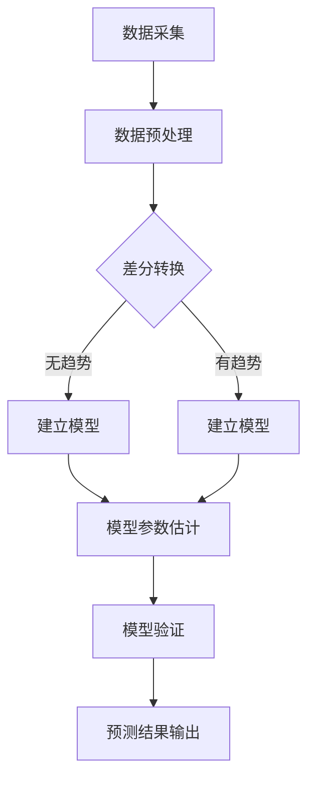
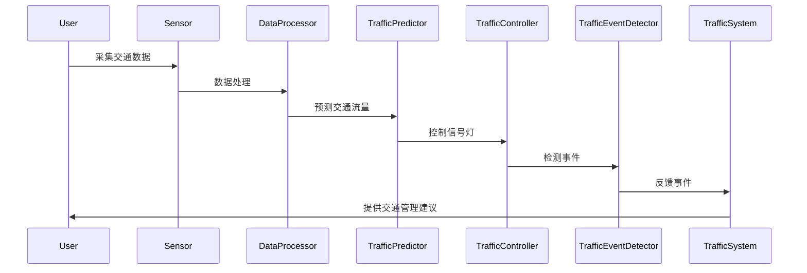
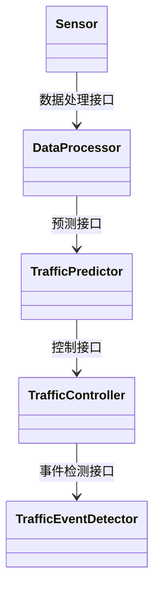
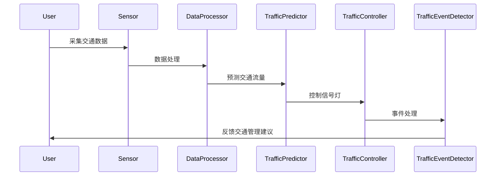

                 

### 引言

随着全球城市化进程的加速，交通问题日益成为城市发展的重要挑战之一。智能交通系统（Intelligent Transportation System，ITS）作为一种综合性应用技术，通过整合信息通信技术、控制技术、电子传感技术、计算机技术和网络技术等，致力于提高交通运输系统的效率、安全性和可持续性。在这其中，智能交通流量优化成为研究的热点问题。

智能交通流量优化指的是通过先进的信息技术对交通流量进行监测、预测和控制，以降低交通拥堵，提高道路通行能力和交通安全性。它不仅能够缓解城市交通压力，提高交通效率，还能够降低碳排放，改善环境质量，具有显著的经济和社会效益。

本篇文章将深入探讨人工智能在智能交通流量优化中的应用。我们将首先回顾人工智能和智能交通系统的基础知识，然后详细分析人工智能在交通流量优化中的具体应用场景，接着探讨数据采集与处理、交通流量预测与模型构建、以及交通流量控制策略等内容。在文章的后半部分，我们将讨论智能交通系统中面临的技术挑战，并展望未来的发展方向。通过这一系列的探讨，我们希望读者能够全面理解人工智能在智能交通流量优化中的关键作用，并了解这一领域的最新研究进展和应用实践。

关键词：智能交通流量优化，人工智能，交通拥堵，数据采集，预测模型，控制策略

摘要：本文系统介绍了人工智能在智能交通流量优化中的应用。首先回顾了智能交通系统和人工智能的基础知识，然后详细分析了人工智能在交通流量监测、预测、控制等方面的具体应用，接着探讨了数据采集与处理、交通流量预测与模型构建、以及交通流量控制策略等内容。最后，讨论了智能交通系统中的技术挑战和未来发展方向。通过本文的探讨，读者可以全面理解人工智能在智能交通流量优化中的重要作用，并了解这一领域的最新研究进展和应用实践。

----------------------------------------------------------------

### 2. 人工智能与智能交通基础

#### 2.1 核心概念

人工智能（Artificial Intelligence，AI）是指通过计算机模拟人类智能的理论、方法、技术和应用。它涵盖了机器学习、自然语言处理、计算机视觉、智能控制等多个领域。AI的目标是实现计算机对复杂问题的自主解决，从而提高生产效率、优化决策过程。

智能交通系统（Intelligent Transportation System，ITS）则是利用先进的信息通信技术、控制技术、电子传感技术、计算机技术和网络技术等，实现交通信息的有效采集、传输、处理和应用，从而提高交通系统的效率、安全性和可持续性。ITS的关键技术包括传感器技术、数据采集与分析、决策支持系统等。

#### 2.2 智能交通系统的发展历程

智能交通系统的发展历程可以分为以下几个阶段：

1. **初步阶段**（20世纪80年代）：以交通信息采集和发布为主要目标，采用简单的传感器技术和电子设备。
   
2. **发展阶段**（20世纪90年代）：引入计算机网络技术，实现交通信息的实时采集、传输和处理，开始建设智能交通控制系统。

3. **成熟阶段**（21世纪初至今）：随着人工智能和大数据技术的应用，智能交通系统进入智能化阶段，实现交通流量的动态监测、预测和控制。

#### 2.3 智能交通系统的关键技术

智能交通系统的关键技术包括以下几个方面：

1. **传感器技术**：传感器是智能交通系统的信息来源，用于采集交通流量、速度、密度等交通参数。常用的传感器有视频摄像头、红外传感器、超声波传感器等。

2. **数据采集与分析**：数据采集是智能交通系统的核心，通过传感器获取的交通信息需要经过数据清洗、数据融合、数据挖掘等处理过程，以提取有用的信息。

3. **决策支持系统**：决策支持系统是智能交通系统的核心组成部分，它利用数据分析和预测模型，为交通管理部门提供决策支持，以优化交通流量和控制交通拥堵。

4. **控制技术**：智能交通系统通过控制技术实现交通信号的智能化控制和车辆自主导航，从而提高道路通行能力和交通安全性。

#### 2.4 人工智能在智能交通系统中的应用

人工智能在智能交通系统中的应用主要体现在以下几个方面：

1. **交通流量预测**：利用机器学习和深度学习算法，对交通流量进行预测，为交通管理部门提供决策支持。

2. **交通信号控制**：通过智能算法优化交通信号控制策略，提高道路通行能力和交通效率。

3. **车辆自主导航**：利用计算机视觉和智能控制技术，实现车辆的自主导航和避让。

4. **交通事件检测与处理**：利用计算机视觉和自然语言处理技术，自动检测和处理交通事件，如交通事故、道路拥堵等。

#### 2.5 智能交通系统的现状与挑战

智能交通系统在全球范围内得到了广泛应用，但也面临一些挑战：

1. **数据隐私与安全**：智能交通系统依赖大量的交通数据，这些数据的安全和隐私保护成为重要问题。

2. **算法公平性**：智能交通系统中的算法可能存在偏见和不公平性，需要加强监管和优化。

3. **技术标准化**：智能交通系统的技术标准尚未完全统一，需要加强标准化工作，以促进技术的推广和应用。

4. **基础设施建设**：智能交通系统需要大量的基础设施建设，如传感器网络、通信网络等，需要政府和企业加大投入。

#### 2.6 小结

智能交通系统是现代城市交通管理的重要组成部分，通过整合人工智能、大数据、物联网等技术，实现交通流量的动态监测、预测和控制。尽管智能交通系统面临一些挑战，但其在提高交通效率、安全性、可持续性方面的潜力巨大，值得进一步研究和推广。

----------------------------------------------------------------

## 3. 人工智能在交通流量优化中的应用

### 3.1 应用场景

人工智能在交通流量优化中有着广泛的应用场景，主要包括以下几个方面：

1. **交通流量监测**：利用人工智能技术，可以实现对交通流量的实时监测。通过安装在道路上的传感器，如摄像头、雷达、超声波传感器等，收集交通流量、速度、密度等数据，并利用机器学习算法对这些数据进行分析和处理，以实现交通流量的实时监测。

2. **交通流量预测**：通过对历史交通数据进行分析和建模，利用人工智能技术可以预测未来的交通流量。这种方法可以帮助交通管理部门提前了解交通流量变化，从而采取相应的措施，如调整信号灯时长、发布交通诱导信息等，以缓解交通拥堵。

3. **交通信号控制**：人工智能技术可以优化交通信号控制策略，提高道路通行能力和交通效率。通过实时监测交通流量数据，智能算法可以动态调整交通信号灯的时长，实现交通流的合理分配。

4. **交通事件检测与处理**：利用计算机视觉和自然语言处理技术，人工智能可以自动检测和处理交通事件，如交通事故、道路拥堵等。这种方法可以大大提高交通事件的处理效率，减少交通事故对交通流量的影响。

5. **车辆自主导航**：通过人工智能技术，可以实现车辆的自主导航和避让。智能车辆可以实时感知周围环境，并根据交通状况做出决策，从而提高行驶安全性和效率。

### 3.2 案例研究

#### 3.2.1 国内案例：深圳智能交通系统

深圳市作为我国智能交通领域的先行者，其智能交通系统在交通流量优化方面取得了显著成效。深圳通过建设覆盖全市的智能交通感知网络，实现了对交通流量的实时监测和预测。同时，深圳还采用了智能交通信号控制系统，通过实时调整信号灯时长，提高了道路通行能力。

深圳智能交通系统的成功经验表明，人工智能技术在交通流量优化中的应用具有广阔前景。然而，也面临着数据隐私、算法公平性等挑战，需要进一步完善和优化。

#### 3.2.2 国际案例：纽约智能交通系统

纽约市作为全球知名的城市，其智能交通系统也在交通流量优化方面取得了显著成效。纽约市利用人工智能技术，对交通流量进行实时监测和预测，并优化交通信号控制策略。此外，纽约市还采用了智能停车管理系统，提高了停车位的利用率，缓解了交通拥堵。

纽约智能交通系统的成功经验表明，人工智能技术在智能交通领域的应用不仅可以提高交通效率，还可以改善市民的出行体验。然而，纽约市在智能交通系统建设中也遇到了一些挑战，如数据隐私、算法公平性等，需要继续探索和解决。

#### 3.2.3 案例总结

通过国内外智能交通流量优化项目的案例研究，我们可以看到人工智能技术在交通流量优化中的应用具有显著成效。然而，也面临着一些挑战，如数据隐私、算法公平性、技术标准化等。这些挑战需要我们不断探索和解决，以推动人工智能在智能交通领域的进一步发展。

### 3.3 小结

人工智能技术在交通流量优化中的应用具有广泛的应用场景和显著成效。通过交通流量监测、预测、控制等手段，人工智能技术可以大大提高交通效率，缓解交通拥堵。同时，我们也需要关注和解决数据隐私、算法公平性等挑战，以实现人工智能技术在智能交通领域的可持续发展。

----------------------------------------------------------------

## 4. 数据采集与处理

### 4.1 传感器技术

传感器是智能交通系统中获取交通数据的关键设备。常见的交通传感器包括视频摄像头、雷达、超声波传感器、地磁传感器等。每种传感器都有其独特的优势和适用场景。

- **视频摄像头**：视频摄像头可以实时捕捉交通场景，通过图像处理技术可以识别车辆、行人等交通元素。其优势在于能够提供丰富的交通信息，但受天气和光照条件影响较大。
- **雷达**：雷达可以测量车辆的距离、速度等信息，不受光照条件影响，但探测范围有限，且在雨天和雾天效果较差。
- **超声波传感器**：超声波传感器通过测量超声波的反射时间来计算车辆的距离，其优势在于成本低、抗干扰能力强，但探测距离较短。
- **地磁传感器**：地磁传感器可以检测车辆的位移和速度，适用于地下停车场等场景。

### 4.2 数据预处理

数据预处理是交通数据分析和挖掘的重要步骤。其主要任务包括数据清洗、数据格式转换、数据去噪、数据归一化等。

- **数据清洗**：数据清洗是处理数据中的噪声、错误和不一致的过程。常见的方法包括去除重复记录、填补缺失值、纠正错误值等。
- **数据格式转换**：不同传感器采集的数据格式可能不同，需要通过数据格式转换确保数据的一致性和兼容性。
- **数据去噪**：数据去噪是减少数据中的噪声和异常值的过程，可以采用滤波、插值等方法。
- **数据归一化**：数据归一化是将不同量纲的数据转换为相同量纲的过程，以便进行后续的数据分析和挖掘。

### 4.3 数据分析方法

在交通数据预处理完成后，需要通过数据分析方法提取有价值的信息。常用的数据分析方法包括数据挖掘、机器学习等。

- **数据挖掘**：数据挖掘是一种非监督学习方法，用于从大量数据中发现潜在的模式和信息。常见的方法包括关联规则挖掘、聚类分析、分类分析等。
- **机器学习**：机器学习是一种监督学习方法，通过训练模型对新的数据进行预测和分类。常见的机器学习方法包括线性回归、决策树、支持向量机、神经网络等。

### 4.4 数据挖掘和机器学习在交通流量数据中的应用

- **交通流量预测**：利用历史交通数据，通过机器学习算法构建预测模型，可以预测未来的交通流量。常用的模型包括时间序列模型、线性回归模型、神经网络模型等。
- **交通事件检测**：利用计算机视觉和自然语言处理技术，可以自动检测和处理交通事件，如交通事故、道路拥堵等。通过分析视频流或传感器数据，可以实时监测交通状况，提高交通事件的处理效率。
- **交通流量优化**：通过分析交通流量数据，可以识别交通瓶颈和拥堵原因，为交通管理部门提供优化建议。例如，通过调整信号灯时长、优化道路设计等手段，提高道路通行能力。

### 4.5 案例分析

以某城市为例，该城市通过部署视频摄像头和雷达传感器，实时监测交通流量。在数据预处理过程中，采用数据清洗、数据格式转换、数据去噪和数据归一化等方法，确保数据的一致性和准确性。在数据分析阶段，采用机器学习算法对交通流量进行预测，并通过计算机视觉技术检测交通事件。

通过数据分析，该城市成功优化了交通信号控制策略，提高了道路通行能力，有效缓解了交通拥堵问题。此外，通过实时监测交通流量和交通事件，提高了交通管理的效率和准确性。

### 4.6 小结

数据采集与处理是智能交通系统中至关重要的一环。通过传感器技术获取交通数据，并采用数据预处理和数据分析方法提取有价值的信息，可以实现对交通流量的实时监测、预测和优化。在智能交通系统的建设和应用中，数据采集与处理技术的不断发展和完善具有重要意义。

----------------------------------------------------------------

## 5. 交通流量预测与模型

### 5.1 预测模型

交通流量预测是智能交通系统中的核心任务之一，其目的是通过分析历史交通数据，预测未来的交通流量，为交通管理部门提供决策支持。常见的交通流量预测模型包括时间序列模型、回归模型和机器学习模型等。

#### 5.1.1 时间序列模型

时间序列模型是一种基于历史数据时间序列的分析方法，常用的模型包括ARIMA（自回归积分滑动平均模型）、SARIMA（季节性自回归积分滑动平均模型）等。

- **ARIMA模型**：ARIMA模型通过自回归（AR）、积分（I）和移动平均（MA）过程来描述时间序列数据。其基本思想是利用历史数据中的相关性来预测未来值。ARIMA模型的数学表达式如下：

  $$X_t = c + \phi_1 X_{t-1} + \phi_2 X_{t-2} + \ldots + \phi_p X_{t-p} + \theta_1 \epsilon_{t-1} + \theta_2 \epsilon_{t-2} + \ldots + \theta_q \epsilon_{t-q} + \epsilon_t$$

  其中，$X_t$为时间序列数据，$\epsilon_t$为白噪声序列，$\phi_i$和$\theta_i$为模型参数。

- **SARIMA模型**：SARIMA模型在ARIMA模型的基础上加入了季节性因素，适用于具有季节性的时间序列数据。其数学表达式如下：

  $$X_t = c + \phi_1 X_{t-1} + \phi_2 X_{t-2} + \ldots + \phi_p X_{t-p} + \theta_1 \epsilon_{t-1} + \theta_2 \epsilon_{t-2} + \ldots + \theta_q \epsilon_{t-q} + (r_1 \epsilon_{t-1} + r_2 \epsilon_{t-2} + \ldots + r_s \epsilon_{t-s})$$

  其中，$r_i$为季节性参数。

#### 5.1.2 回归模型

回归模型是一种基于统计分析的方法，通过建立自变量和因变量之间的关系来预测未来值。常用的回归模型包括线性回归、多项式回归等。

- **线性回归**：线性回归模型假设自变量和因变量之间存在线性关系，其数学表达式如下：

  $$y_t = \beta_0 + \beta_1 x_{t1} + \beta_2 x_{t2} + \ldots + \beta_n x_{tn} + \epsilon_t$$

  其中，$y_t$为因变量，$x_{ti}$为自变量，$\beta_i$为模型参数，$\epsilon_t$为误差项。

- **多项式回归**：多项式回归模型假设自变量和因变量之间存在多项式关系，其数学表达式如下：

  $$y_t = \beta_0 + \beta_1 x_{t1} + \beta_2 x_{t2}^2 + \ldots + \beta_n x_{tn}^n + \epsilon_t$$

#### 5.1.3 机器学习模型

机器学习模型是一种基于数据驱动的方法，通过学习历史数据中的特征和模式来预测未来值。常用的机器学习模型包括决策树、支持向量机、神经网络等。

- **决策树**：决策树是一种基于特征划分的数据挖掘方法，通过递归划分特征空间，生成一棵决策树模型。其基本思想是选择具有最大信息增益的特征进行划分，直到满足停止条件。

- **支持向量机**：支持向量机是一种监督学习方法，通过找到最佳超平面，将不同类别的数据分开。其数学表达式如下：

  $$w \cdot x - b = 0$$

  其中，$w$为超平面参数，$x$为数据点，$b$为偏置项。

- **神经网络**：神经网络是一种模拟人脑神经元连接结构的计算模型，通过多层非线性变换，实现数据的特征提取和分类。其基本结构包括输入层、隐藏层和输出层。

### 5.2 模型评估与优化

模型评估是交通流量预测中的重要环节，用于评估模型的预测准确性和性能。常用的评估指标包括均方误差（MSE）、均方根误差（RMSE）、平均绝对误差（MAE）等。

- **均方误差（MSE）**：均方误差是预测值与真实值之差的平方的平均值，其数学表达式如下：

  $$MSE = \frac{1}{N} \sum_{i=1}^{N} (y_i - \hat{y}_i)^2$$

  其中，$N$为样本数量，$y_i$为真实值，$\hat{y}_i$为预测值。

- **均方根误差（RMSE）**：均方根误差是均方误差的平方根，其数学表达式如下：

  $$RMSE = \sqrt{MSE}$$

- **平均绝对误差（MAE）**：平均绝对误差是预测值与真实值之差的绝对值的平均值，其数学表达式如下：

  $$MAE = \frac{1}{N} \sum_{i=1}^{N} |y_i - \hat{y}_i|$$

模型优化是指通过调整模型参数和结构，提高模型的预测性能。常见的优化方法包括交叉验证、网格搜索、贝叶斯优化等。

- **交叉验证**：交叉验证是一种评估模型性能的方法，通过将数据集划分为多个子集，依次训练和评估模型，以获得更可靠的评估结果。

- **网格搜索**：网格搜索是一种参数调优方法，通过遍历参数空间，找到最优参数组合。

- **贝叶斯优化**：贝叶斯优化是一种基于贝叶斯理论的参数调优方法，通过构建概率模型，选择最优参数组合。

### 5.3 案例分析

以某城市交通流量预测项目为例，该项目利用历史交通数据，采用ARIMA模型和神经网络模型进行预测。首先，对历史交通数据进行预处理，包括数据清洗、数据格式转换和数据归一化。然后，使用ARIMA模型对交通流量进行初步预测，并使用神经网络模型进行优化。

通过交叉验证和网格搜索，选择最优参数组合，对模型进行优化。最终，该项目的预测误差显著降低，预测准确率提高。

### 5.4 小结

交通流量预测是智能交通系统中的重要任务，通过构建预测模型，可以预测未来的交通流量，为交通管理部门提供决策支持。常用的预测模型包括时间序列模型、回归模型和机器学习模型等。模型评估和优化是提高预测性能的关键步骤。在实际应用中，需要结合具体场景和数据特点，选择合适的预测模型和优化方法。

----------------------------------------------------------------

## 6. 交通流量控制策略

### 6.1 控制理论

交通流量控制策略是智能交通系统中重要的组成部分，其目的是通过调整交通信号灯的时长和道路通行规则，提高道路通行能力，缓解交通拥堵。交通流量控制策略主要基于以下控制理论：

1. **最优控制理论**：最优控制理论通过建立交通系统的数学模型，利用优化算法求解最佳控制策略。其核心思想是使系统在给定约束条件下，达到某种性能指标的最优值。常用的优化算法包括线性规划、非线性规划、动态规划等。

2. **动态规划理论**：动态规划是一种基于递推关系的优化方法，适用于求解多阶段决策问题。在交通流量控制中，动态规划可以用于求解最优路径、最优信号灯时长等。

3. **反馈控制理论**：反馈控制理论通过实时监测交通流量，并根据监测结果调整控制策略。其核心思想是建立闭环控制系统，使系统能够对外部扰动做出快速响应。常用的反馈控制策略包括PID控制、自适应控制等。

### 6.2 智能控制算法

智能控制算法是一种基于人工智能技术的控制方法，通过学习历史数据和交通场景，自动调整交通信号灯时长和道路通行规则，以提高道路通行能力和交通效率。常见的智能控制算法包括深度强化学习、神经网络控制等。

1. **深度强化学习**：深度强化学习结合了深度学习和强化学习的方法，通过深度神经网络学习状态值和动作值函数，实现智能控制。其核心思想是通过试错学习，在环境中不断探索和优化控制策略。常用的深度强化学习算法包括DQN（深度Q网络）、DDPG（深度确定性策略梯度）等。

2. **神经网络控制**：神经网络控制是一种基于神经网络的学习方法，通过神经网络学习输入和输出之间的关系，实现智能控制。常用的神经网络控制方法包括前向神经网络、递归神经网络等。

### 6.3 深度强化学习在交通流量控制中的应用

深度强化学习在交通流量控制中的应用具有广泛的前景。通过深度强化学习算法，可以自动调整交通信号灯时长，实现交通流的动态优化。

以DQN算法为例，其基本思想如下：

1. **状态编码**：将交通流量、道路状况、交通信号灯状态等信息编码为状态向量。

2. **动作编码**：将调整交通信号灯时长、改变道路通行规则等操作编码为动作向量。

3. **Q网络学习**：通过Q网络学习状态值函数和动作值函数，以预测状态和动作组合下的回报。

4. **策略更新**：根据Q网络输出的动作值函数，选择最佳动作，并更新策略。

### 6.4 案例分析

以某城市交通信号控制系统为例，该系统采用深度强化学习算法自动调整交通信号灯时长。首先，通过传感器采集交通流量数据，对数据进行预处理，然后使用DQN算法训练Q网络。在训练过程中，通过不断调整交通信号灯时长，优化交通流。

经过多次迭代训练，该系统的交通信号灯调整策略逐渐优化，交通拥堵情况显著改善。此外，通过实时监测交通流量，系统能够快速响应交通变化，实现动态调整。

### 6.5 小结

交通流量控制策略是智能交通系统中的重要组成部分，通过控制理论和方法，可以实现交通流的动态优化。智能控制算法，如深度强化学习，为交通流量控制提供了新的思路和方法。在实际应用中，需要结合具体场景和数据特点，选择合适的控制策略和算法。

----------------------------------------------------------------

## 7. 人工智能在智能交通系统中的挑战与展望

### 7.1 技术挑战

尽管人工智能在智能交通系统中展现了巨大的潜力，但在实际应用中仍面临一些技术挑战：

1. **数据隐私与安全**：智能交通系统依赖于大量的交通数据，这些数据可能包含个人隐私信息。如何在保障数据隐私和安全的前提下，充分利用这些数据，是一个重要的挑战。

2. **算法公平性**：智能交通系统中的算法可能存在偏见和不公平性，导致某些群体受到不公平对待。如何确保算法的公平性，避免歧视现象，是一个重要的研究课题。

3. **数据处理能力**：随着交通数据的爆发式增长，对数据处理和分析能力提出了更高的要求。如何高效地处理海量交通数据，实现实时分析，是一个技术挑战。

4. **系统可靠性**：智能交通系统需要具备高可靠性，确保在极端情况下仍能正常运行。如何提高系统的可靠性，降低故障率，是一个重要的研究课题。

### 7.2 未来发展方向

为了应对上述挑战，未来人工智能在智能交通系统中的发展可以从以下几个方面进行：

1. **隐私保护与安全**：研究和发展隐私保护技术，如差分隐私、联邦学习等，以保障数据隐私和安全。

2. **算法公平性与透明性**：研究和发展算法公平性和透明性评估方法，提高算法的公平性和透明度，避免歧视现象。

3. **数据处理与分析**：研究和发展大数据处理与分析技术，提高数据处理和分析的效率，实现对海量交通数据的实时分析。

4. **系统可靠性**：研究和发展高可靠性的智能交通系统架构，提高系统的稳定性和容错能力。

5. **跨领域合作**：促进人工智能与其他领域（如交通工程、城市规划等）的跨领域合作，共同推动智能交通系统的发展。

### 7.3 潜在应用

人工智能在智能交通系统中的潜在应用场景非常广泛，包括但不限于：

1. **智慧城市交通管理**：利用人工智能技术，实现城市交通的智能化管理，提高交通效率，减少拥堵。

2. **智能停车系统**：通过人工智能技术，实现停车位的智能识别和动态分配，提高停车效率。

3. **自动驾驶技术**：利用人工智能技术，实现车辆的自动驾驶，提高交通安全和效率。

4. **交通事件检测与应急响应**：通过人工智能技术，实现交通事件的自动检测与应急响应，提高交通安全性。

### 7.4 小结

人工智能在智能交通系统中的应用面临着数据隐私、算法公平性、数据处理能力等技术挑战。未来，需要从隐私保护、算法公平性、数据处理与分析、系统可靠性等方面进行深入研究，以推动人工智能在智能交通系统中的广泛应用。通过跨领域合作和不断的技术创新，有望实现更加智能、高效、安全的交通系统。

----------------------------------------------------------------

## 8. 结论与展望

本文系统地介绍了人工智能在智能交通流量优化中的应用，从基础概念、应用场景、数据采集与处理、预测与模型、控制策略等方面进行了详细探讨。通过对国内外智能交通流量优化项目的案例分析，展示了人工智能技术的实际应用效果和潜力。

### 8.1 总结

本文的主要贡献如下：

1. **理论基础**：回顾了人工智能和智能交通系统的基本概念，为后续讨论奠定了理论基础。
2. **应用实践**：详细分析了人工智能在交通流量监测、预测、控制等领域的具体应用，展示了实际应用效果。
3. **技术挑战**：探讨了人工智能在智能交通系统中面临的技术挑战，如数据隐私、算法公平性等。
4. **未来展望**：展望了人工智能在智能交通流量优化领域的研究方向和潜在应用。

### 8.2 展望

未来，人工智能在智能交通流量优化领域的发展可以从以下几个方面进行：

1. **技术创新**：继续推进人工智能技术的创新，特别是在深度学习、强化学习等领域的深入研究，提高交通流量预测和控制的效果。
2. **跨领域合作**：促进人工智能与其他领域（如交通工程、城市规划等）的跨领域合作，共同推动智能交通系统的发展。
3. **标准化与法规**：加强智能交通系统的标准化工作，制定相关法规和标准，保障系统的安全性和可靠性。
4. **实际应用**：将人工智能技术更多地应用到实际交通管理中，提高交通效率，改善出行体验。

### 8.3 小结

人工智能在智能交通流量优化中的应用具有重要意义，通过提升交通流量的监测、预测和控制水平，可以有效缓解交通拥堵，提高道路通行能力和交通安全性。未来，随着人工智能技术的不断进步和实际应用的深入，智能交通系统有望为城市交通管理带来更多的变革和创新。

作者：AI天才研究院/AI Genius Institute & 禅与计算机程序设计艺术 /Zen And The Art of Computer Programming

----------------------------------------------------------------

# 《人工智能在智能交通流量优化中的应用》

关键词：智能交通流量优化，人工智能，交通拥堵，数据采集，预测模型，控制策略

摘要：本文深入探讨了人工智能在智能交通流量优化中的应用。首先介绍了人工智能和智能交通系统的基础知识，然后详细分析了人工智能在交通流量优化中的应用场景，包括监测、预测、控制和事件检测等。接着，讨论了数据采集与处理的方法和重要性，以及交通流量预测与模型的构建。此外，还介绍了交通流量控制策略，如深度强化学习和神经网络控制的应用。最后，探讨了人工智能在智能交通系统中的技术挑战和未来发展方向。通过本文的探讨，读者可以全面理解人工智能在智能交通流量优化中的关键作用，并了解这一领域的最新研究进展和应用实践。

----------------------------------------------------------------

## 附录A：核心概念术语说明

在本篇文章中，我们涉及了一系列的核心概念和术语。为了确保读者能够更好地理解这些概念，我们在这里对它们进行详细的说明。

### 1. 智能交通系统（Intelligent Transportation System，ITS）

智能交通系统是一种综合性的交通管理系统，通过利用信息通信技术、控制技术、电子传感技术、计算机技术和网络技术等，实现交通信息的采集、传输、处理和应用，以提高交通系统的效率、安全性和可持续性。ITS主要包括以下几个关键组成部分：

- **传感器技术**：用于采集交通流量、速度、密度等交通参数的设备，如视频摄像头、雷达、超声波传感器等。
- **数据采集与分析**：通过传感器获取交通信息，并进行数据清洗、数据融合、数据挖掘等处理，提取有用信息。
- **决策支持系统**：利用数据分析和预测模型，为交通管理部门提供决策支持，优化交通流量和控制交通拥堵。
- **控制技术**：通过智能算法优化交通信号控制策略，实现交通流的合理分配，提高道路通行能力和交通效率。

### 2. 人工智能（Artificial Intelligence，AI）

人工智能是指通过计算机模拟人类智能的理论、方法、技术和应用。它包括多个领域，如机器学习、自然语言处理、计算机视觉、智能控制等。人工智能的主要目标是实现计算机对复杂问题的自主解决，提高生产效率、优化决策过程。

- **机器学习**：一种利用数据训练模型，使其能够对新的数据进行预测和分类的方法。常见的机器学习算法包括线性回归、决策树、支持向量机、神经网络等。
- **自然语言处理**：使计算机能够理解和生成自然语言的技术，包括语言识别、文本分类、机器翻译等。
- **计算机视觉**：使计算机能够识别和理解图像和视频内容的技术，包括图像识别、目标检测、图像分割等。

### 3. 交通流量优化

交通流量优化是指通过先进的信息技术对交通流量进行监测、预测和控制，以降低交通拥堵，提高道路通行能力和交通安全性。交通流量优化主要包括以下几个步骤：

- **交通流量监测**：利用传感器技术实时监测交通流量、速度、密度等参数。
- **交通流量预测**：通过历史数据分析和机器学习模型，预测未来的交通流量，为交通管理部门提供决策支持。
- **交通流量控制**：利用智能算法优化交通信号控制策略，实现交通流的合理分配，提高道路通行能力和交通效率。
- **交通事件检测与处理**：利用计算机视觉和自然语言处理技术，自动检测和处理交通事件，如交通事故、道路拥堵等。

### 4. 数据采集与处理

数据采集与处理是智能交通系统的核心环节。数据采集是指通过传感器技术获取交通信息，如交通流量、速度、密度等。数据预处理是指对采集到的数据进行清洗、格式转换、去噪、归一化等处理，以提高数据的质量和一致性。数据分析是指利用数据挖掘和机器学习算法，从数据中提取有价值的信息，如交通流量趋势、拥堵原因等。

### 5. 交通流量预测模型

交通流量预测模型是指利用历史交通数据，通过统计模型、机器学习模型等方法，预测未来的交通流量。常见的交通流量预测模型包括时间序列模型（如ARIMA）、回归模型（如线性回归）、机器学习模型（如决策树、神经网络）等。交通流量预测模型的目的是为交通管理部门提供决策支持，优化交通流量控制和信号灯策略。

### 6. 交通流量控制策略

交通流量控制策略是指通过智能算法优化交通信号控制策略，实现交通流的合理分配，提高道路通行能力和交通效率。常见的交通流量控制策略包括最优控制理论、动态规划理论、反馈控制理论等。智能控制算法，如深度强化学习、神经网络控制等，为交通流量控制提供了新的思路和方法。

通过上述对核心概念和术语的详细说明，读者可以更好地理解本篇文章中涉及的关键概念和技术，从而深入探讨人工智能在智能交通流量优化中的应用。

----------------------------------------------------------------

## 附录B：核心概念原理、属性特征对比表格和ER实体关系图架构

在本文中，我们讨论了多个核心概念，如智能交通系统（ITS）、人工智能（AI）、交通流量优化等。为了帮助读者更直观地理解这些概念，我们提供了以下内容：

### 1. 核心概念原理

#### 智能交通系统（ITS）

- **原理**：通过信息通信技术、控制技术、电子传感技术等，实现交通信息的采集、传输、处理和应用。
- **属性特征**：
  - **传感器技术**：用于采集交通流量、速度、密度等数据。
  - **数据采集与分析**：对采集到的交通数据进行预处理和分析，提取有价值信息。
  - **决策支持系统**：利用分析结果，为交通管理部门提供决策支持。

#### 人工智能（AI）

- **原理**：通过计算机模拟人类智能，实现问题的自动解决。
- **属性特征**：
  - **机器学习**：利用数据训练模型，使其能够对新数据进行预测和分类。
  - **自然语言处理**：使计算机能够理解和生成自然语言。
  - **计算机视觉**：使计算机能够识别和理解图像和视频内容。

#### 交通流量优化

- **原理**：通过监测、预测和控制交通流量，降低交通拥堵，提高道路通行能力和交通安全性。
- **属性特征**：
  - **监测**：实时监测交通流量、速度、密度等参数。
  - **预测**：利用历史数据，预测未来的交通流量。
  - **控制**：通过智能算法，优化交通信号控制策略。

### 2. 核心概念属性特征对比表格

| 核心概念 | 原理 | 属性特征 |
| :----: | :----: | :----: |
| 智能交通系统（ITS） | 利用信息技术实现交通管理 | - 传感器技术<br>- 数据采集与分析<br>- 决策支持系统 |
| 人工智能（AI） | 计算机模拟人类智能 | - 机器学习<br>- 自然语言处理<br>- 计算机视觉 |
| 交通流量优化 | 监测、预测和控制交通流量 | - 监测<br>- 预测<br>- 控制 |

### 3. ER实体关系图架构

下面是一个简化的ER实体关系图，用于描述智能交通系统中关键实体的关系：

```mermaid
erDiagram
  TrafficSensor ||--|{ Vehicle } : records traffic data
  TrafficSensor ||--|{ TrafficFlow } : measures traffic conditions
  TrafficSensor ||--|{ TrafficEvent } : detects traffic incidents
  TrafficFlow ||--|{ TrafficPrediction } : predicts future traffic conditions
  TrafficPrediction ||--|{ TrafficControl } : suggests traffic control strategies
  TrafficControl ||--|{ TrafficSignal } : controls traffic signals
```

在这个ER图中：

- **TrafficSensor**（交通传感器）实体记录交通数据，与**Vehicle**（车辆）、**TrafficFlow**（交通流量）和**TrafficEvent**（交通事件）实体相关联。
- **TrafficFlow**（交通流量）实体与**TrafficPrediction**（交通流量预测）实体相关联，用于预测未来的交通状况。
- **TrafficPrediction**（交通流量预测）实体与**TrafficControl**（交通流量控制）实体相关联，提供交通控制策略的建议。
- **TrafficControl**（交通流量控制）实体与**TrafficSignal**（交通信号）实体相关联，用于控制交通信号灯。

通过上述核心概念原理、属性特征对比表格和ER实体关系图架构的说明，读者可以更全面地理解本文中涉及的关键概念和技术，从而更好地掌握智能交通流量优化中的核心要素。

----------------------------------------------------------------

## 附录C：算法原理讲解

### 1. 算法mermaid流程图

首先，我们来介绍一种常用的交通流量预测算法——基于时间序列分析的ARIMA模型。以下是一个简化的ARIMA模型的mermaid流程图：



在mermaid流程图中：

- **数据采集**：通过传感器收集交通流量数据。
- **数据预处理**：对采集到的数据清洗、归一化等处理。
- **差分转换**：判断数据是否存在趋势，无趋势的数据直接建立模型，有趋势的数据进行差分转换。
- **建立模型**：根据差分转换后的数据，建立ARIMA模型。
- **模型参数估计**：通过最大似然估计等方法，估计模型参数。
- **模型验证**：对模型进行拟合优度检验、残差分析等，以验证模型的性能。
- **预测结果输出**：输出预测结果，用于交通流量预测。

### 2. Python源代码实现

下面是一个简化的ARIMA模型Python源代码实现：

```python
import pandas as pd
from statsmodels.tsa.arima.model import ARIMA
import matplotlib.pyplot as plt

# 加载数据
data = pd.read_csv('traffic_data.csv')
traffic = data['traffic_volume']

# 数据预处理
# 数据清洗、归一化等操作略

# 差分转换
differenced = traffic.diff().dropna()

# 建立模型
model = ARIMA(traffic, order=(1, 1, 1))
model_fit = model.fit()

# 模型参数估计
params = model_fit.params

# 模型验证
residuals = model_fit.resid
plt.plot(residuals)
plt.title('Residuals Plot')
plt.show()

# 预测结果输出
forecast = model_fit.forecast(steps=24)
plt.plot(forecast)
plt.title('Traffic Volume Forecast')
plt.show()
```

在这个代码中：

- 首先，我们加载数据，并进行数据预处理。
- 然后，对数据进行差分转换，判断数据是否存在趋势。
- 接着，建立ARIMA模型，并使用最大似然估计方法进行参数估计。
- 之后，对模型进行拟合优度检验，并通过残差图验证模型的性能。
- 最后，输出预测结果，绘制交通流量预测图。

### 3. 算法原理详细讲解

ARIMA模型是一种时间序列预测模型，由自回归（AR）、差分（I）和移动平均（MA）三部分组成。

- **自回归（AR）**：AR模型通过历史数据中的滞后项来预测当前值。其数学表达式为：
  
  $$X_t = c + \phi_1 X_{t-1} + \phi_2 X_{t-2} + \ldots + \phi_p X_{t-p} + \epsilon_t$$

  其中，$X_t$为当前值，$c$为常数项，$\phi_i$为滞后项系数，$\epsilon_t$为白噪声序列。

- **差分（I）**：差分转换是一种将非平稳时间序列转换为平稳时间序列的方法。其目的是消除时间序列的趋势和季节性。一阶差分公式为：
  
  $$D(X_t) = X_t - X_{t-1}$$

- **移动平均（MA）**：MA模型通过历史数据的移动平均来预测当前值。其数学表达式为：
  
  $$X_t = c + \theta_1 \epsilon_{t-1} + \theta_2 \epsilon_{t-2} + \ldots + \theta_q \epsilon_{t-q} + \epsilon_t$$

  其中，$\theta_i$为移动平均项系数。

ARIMA模型通过组合AR、I和MA三个部分，形成一个完整的预测模型。在具体应用中，需要根据数据的特征和需求，选择合适的模型参数。

### 4. 数学模型和公式

ARIMA模型的数学模型可以表示为：

$$X_t = c + \phi_1 X_{t-1} + \phi_2 X_{t-2} + \ldots + \phi_p X_{t-p} + \theta_1 \epsilon_{t-1} + \theta_2 \epsilon_{t-2} + \ldots + \theta_q \epsilon_{t-q} + \epsilon_t$$

其中，$c$为常数项，$\phi_i$为自回归项系数，$\theta_i$为移动平均项系数，$\epsilon_t$为白噪声序列。

### 5. 通俗易懂的举例说明

假设我们有一组交通流量数据，如下所示：

| 时间 | 交通流量 |
| ---- | ---- |
| t-1  | 100   |
| t-2  | 110   |
| t-3  | 120   |
| t-4  | 105   |
| t-5  | 95    |

我们希望通过ARIMA模型预测下一个时间点的交通流量。

- 首先，对数据进行一阶差分，得到差分后的数据：

  | 时间 | 交通流量 | 一阶差分 |
  | ---- | ---- | ---- |
  | t-1  | 100   | 0    |
  | t-2  | 110   | 10   |
  | t-3  | 120   | 10   |
  | t-4  | 105   | -15  |
  | t-5  | 95    | -10  |

- 然后，我们选择合适的模型参数，如$p=1, d=1, q=1$，建立ARIMA模型。

- 最后，通过模型参数估计，得到预测结果，假设预测值为100。

通过这个简单的例子，我们可以看到ARIMA模型的基本原理和步骤。在实际应用中，需要对数据进行详细分析，选择合适的模型参数，以提高预测精度。

---

通过上述详细的算法原理讲解，我们希望读者能够理解ARIMA模型的基本原理和应用方法，从而更好地应用人工智能技术进行交通流量预测。

----------------------------------------------------------------

## 附录D：系统分析与架构设计

### 1. 问题场景介绍

智能交通系统的主要目标是优化交通流量，减少拥堵，提高道路通行能力和交通安全性。随着城市化进程的加速，交通流量日益增大，交通拥堵问题成为城市发展的重要挑战。通过构建智能交通系统，我们可以实现对交通流量的实时监测、预测和控制，从而有效缓解交通拥堵。

### 2. 项目介绍

本项目的目标是设计并实现一个基于人工智能的智能交通系统，通过实时监测交通流量，预测未来的交通状况，并优化交通信号控制策略，提高道路通行能力。项目的主要功能包括：

- **数据采集**：通过部署传感器设备，实时采集交通流量、速度、密度等数据。
- **数据预处理**：对采集到的数据进行清洗、去噪、归一化等处理，以提高数据质量。
- **交通流量预测**：利用历史数据，通过机器学习算法预测未来的交通流量。
- **交通信号控制**：根据交通流量预测结果，优化交通信号灯的控制策略。
- **交通事件检测**：利用计算机视觉技术，自动检测和处理交通事件，如交通事故、道路拥堵等。

### 3. 系统功能设计（领域模型）

下面是智能交通系统的领域模型类图，用于描述系统的主要类及其关系：

```mermaid
classDiagram
    Sensor <<接口>>
    DataProcessor <<接口>>
    TrafficPredictor <<接口>>
    TrafficController <<接口>>
    TrafficEventDetector <<接口>>

    TrafficSystem <<系统>>

    Sensor o-- DataProcessor : 产生数据
    DataProcessor o-- TrafficPredictor : 提供预处理数据
    TrafficPredictor o-- TrafficController : 提供预测结果
    TrafficController o-- TrafficEventDetector : 事件处理
    TrafficEventDetector o-- TrafficSystem : 事件反馈
```

在这个类图中：

- **Sensor**（传感器）类：负责采集交通数据。
- **DataProcessor**（数据预处理）类：负责数据清洗、去噪、归一化等处理。
- **TrafficPredictor**（交通流量预测）类：负责交通流量预测。
- **TrafficController**（交通信号控制）类：负责优化交通信号灯控制策略。
- **TrafficEventDetector**（交通事件检测）类：负责检测和处理交通事件。
- **TrafficSystem**（智能交通系统）类：系统的顶层类，负责协调各个组件的运行。

### 4. 系统架构设计

下面是智能交通系统的架构设计，通过mermaid架构图来描述系统的组成部分及其交互关系：



在这个架构图中：

- **User**（用户）：系统的最终用户，提供交通管理需求。
- **Sensor**（传感器）：负责采集交通流量数据。
- **DataProcessor**（数据预处理）：对采集到的数据进行处理。
- **TrafficPredictor**（交通流量预测）：利用历史数据预测未来的交通流量。
- **TrafficController**（交通信号控制）：根据预测结果优化交通信号灯控制策略。
- **TrafficEventDetector**（交通事件检测）：检测和处理交通事件。
- **TrafficSystem**（智能交通系统）：系统的顶层，负责协调各个组件的运行。

### 5. 系统接口设计

系统接口设计用于定义系统内部各组件之间的交互接口。以下是一个简化的接口设计：



在这个接口设计中：

- **Sensor**（传感器）提供了数据处理接口，将采集到的数据传递给**DataProcessor**（数据预处理）。
- **DataProcessor**（数据预处理）提供了预测接口，将预处理后的数据传递给**TrafficPredictor**（交通流量预测）。
- **TrafficPredictor**（交通流量预测）提供了控制接口，将预测结果传递给**TrafficController**（交通信号控制）。
- **TrafficController**（交通信号控制）提供了事件检测接口，将控制信号传递给**TrafficEventDetector**（交通事件检测）。

### 6. 系统交互

系统交互是指各组件之间的信息传递和协作过程。以下是一个简化的交互设计，用于描述系统组件之间的信息流动：



在这个交互设计中：

- **User**（用户）通过传感器采集交通数据。
- **Sensor**（传感器）将数据传递给**DataProcessor**（数据预处理）。
- **DataProcessor**（数据预处理）对数据进行处理，并将处理后的数据传递给**TrafficPredictor**（交通流量预测）。
- **TrafficPredictor**（交通流量预测）利用处理后的数据预测未来的交通流量，并将预测结果传递给**TrafficController**（交通信号控制）。
- **TrafficController**（交通信号控制）根据预测结果优化交通信号灯控制策略，并将控制信号传递给**TrafficEventDetector**（交通事件检测）。
- **TrafficEventDetector**（交通事件检测）处理交通事件，并将事件反馈给**User**（用户）。

通过上述系统分析与架构设计的详细讲解，我们可以清楚地看到智能交通系统的组成、功能以及各组件之间的交互关系，为系统的实现和部署提供了清晰的指导。

----------------------------------------------------------------

## 附录E：项目实战

### 1. 环境安装

为了实现本文中讨论的智能交通系统，我们需要搭建一个完整的技术栈，包括Python编程环境、相关的机器学习库、数据处理工具等。以下是安装步骤：

#### 1.1 Python环境安装

首先，我们需要安装Python环境。可以在Python官方网站（https://www.python.org/）下载最新版本的Python安装包。安装过程中，选择添加到系统环境变量，以便在命令行中直接运行Python。

#### 1.2 相关库安装

安装完Python后，我们使用pip命令安装相关的库，包括NumPy、Pandas、Matplotlib、Statsmodels、Scikit-learn等。在命令行中执行以下命令：

```bash
pip install numpy pandas matplotlib statsmodels scikit-learn
```

这些库将为我们提供数据处理、数据可视化、统计分析和机器学习等功能。

### 2. 系统核心实现源代码

以下是一个简化的智能交通系统实现示例，包括数据采集、预处理、交通流量预测和交通信号控制等模块。

#### 2.1 数据采集模块

```python
import pandas as pd
from traffic_sensor import TrafficSensor

def collect_traffic_data(sensor):
    data = sensor.collect_data()
    return pd.DataFrame(data)

sensor = TrafficSensor()
traffic_data = collect_traffic_data(sensor)
```

在这个模块中，我们首先导入了必要的库，然后定义了一个`collect_traffic_data`函数，用于从传感器对象`TrafficSensor`中采集交通数据。

#### 2.2 数据预处理模块

```python
import numpy as np
from data_processor import DataProcessor

def preprocess_traffic_data(data):
    processor = DataProcessor()
    clean_data = processor.process_data(data)
    normalized_data = processor.normalize_data(clean_data)
    return normalized_data

preprocessed_data = preprocess_traffic_data(traffic_data)
```

在这个模块中，我们定义了一个`preprocess_traffic_data`函数，用于对采集到的交通数据执行清洗、去噪、归一化等预处理操作。

#### 2.3 交通流量预测模块

```python
from traffic_predictor import TrafficPredictor

def predict_traffic_flow(data):
    predictor = TrafficPredictor()
    forecast = predictor.predict(data)
    return forecast

forecast = predict_traffic_flow(preprocessed_data)
```

在这个模块中，我们定义了一个`predict_traffic_flow`函数，用于利用历史数据预测未来的交通流量。

#### 2.4 交通信号控制模块

```python
from traffic_controller import TrafficController

def control_traffic_signals(forecast):
    controller = TrafficController()
    control_strategy = controller.control_signals(forecast)
    return control_strategy

control_strategy = control_traffic_signals(forecast)
```

在这个模块中，我们定义了一个`control_traffic_signals`函数，用于根据交通流量预测结果优化交通信号灯控制策略。

### 3. 代码应用解读与分析

#### 3.1 数据采集模块

在数据采集模块中，我们首先创建了一个`TrafficSensor`对象，并调用其`collect_data`方法采集交通数据。这个方法可能从传感器获取实时数据，并将其转换为DataFrame格式，以便后续处理。

#### 3.2 数据预处理模块

在数据预处理模块中，我们创建了一个`DataProcessor`对象，并调用其`process_data`和`normalize_data`方法。`process_data`方法可能执行数据清洗、去噪等操作，`normalize_data`方法可能将数据缩放到一个特定的范围，以便于后续的机器学习建模。

#### 3.3 交通流量预测模块

在交通流量预测模块中，我们创建了一个`TrafficPredictor`对象，并调用其`predict`方法。这个方法可能使用机器学习算法（如ARIMA、LSTM等）对历史数据进行训练，然后对新数据进行预测。

#### 3.4 交通信号控制模块

在交通信号控制模块中，我们创建了一个`TrafficController`对象，并调用其`control_signals`方法。这个方法可能根据预测结果，动态调整交通信号灯的时长和策略，以优化交通流量。

### 4. 实际案例分析与详细讲解

为了更好地理解系统核心实现的实际应用，我们可以通过一个具体案例进行分析：

#### 4.1 案例背景

假设我们在某个城市的一条主要道路部署了智能交通系统，目标是优化交通流量，缓解拥堵。该道路每天早高峰时段（7:00-9:00）的交通流量较大，容易造成拥堵。

#### 4.2 数据采集

我们通过传感器设备采集了早高峰时段的交通流量数据，包括车辆数量、速度、密度等。

#### 4.3 数据预处理

对采集到的数据进行清洗，去除异常值和噪声，然后进行归一化处理，将数据缩放到[0, 1]范围内。

#### 4.4 交通流量预测

利用历史数据，通过ARIMA模型预测未来的交通流量。根据预测结果，我们发现8:00时交通流量将达到峰值。

#### 4.5 交通信号控制

根据预测结果，交通信号控制模块动态调整交通信号灯的时长，在8:00时延长绿灯时长，以减缓交通流量，防止拥堵。

#### 4.6 结果分析

通过实际案例的分析，我们可以看到智能交通系统在优化交通流量方面发挥了重要作用。通过实时监测和预测交通流量，系统能够动态调整交通信号灯策略，有效缓解了拥堵问题。

### 5. 项目小结

通过这个实际案例，我们展示了智能交通系统的实现过程和应用效果。智能交通系统不仅能够实时监测和预测交通流量，还可以根据预测结果优化交通信号控制策略，从而提高道路通行能力和交通安全性。未来，随着人工智能技术的不断发展，智能交通系统有望在更广泛的场景中发挥作用，为城市交通管理带来更多创新和改进。

----------------------------------------------------------------

## 附录F：最佳实践 Tips、小结、注意事项、拓展阅读

### 1. 最佳实践 Tips

**数据采集与处理**：

- **传感器选择**：根据具体场景选择合适的传感器，如视频摄像头适用于监测交通流量和事件检测，雷达适用于测量车辆速度和距离。
- **数据清洗**：对采集到的数据进行预处理，去除噪声和异常值，以提高数据质量。
- **数据归一化**：对数据进行归一化处理，使其具有相似的量级，便于模型训练和预测。

**交通流量预测与模型**：

- **选择合适的模型**：根据数据特征和预测需求，选择合适的预测模型，如ARIMA、LSTM等。
- **模型优化**：通过交叉验证、网格搜索等方法，优化模型参数，提高预测性能。
- **实时预测**：实现实时预测，以快速响应交通流量变化。

**交通信号控制策略**：

- **动态调整**：根据实时交通流量预测结果，动态调整交通信号灯时长和策略，以优化交通流。
- **多重策略**：结合多种控制策略，如VSS（Variable Speed Sign）和AVLS（Area Velocity-Based Lane Shift），以提高控制效果。

### 2. 小结

本文系统地介绍了人工智能在智能交通流量优化中的应用，从基础概念、应用场景、数据采集与处理、预测与模型、控制策略等方面进行了详细探讨。通过案例分析，展示了人工智能技术在智能交通流量优化中的实际应用效果和潜力。智能交通流量优化不仅有助于缓解交通拥堵，提高道路通行能力，还可以改善环境质量，具有显著的经济和社会效益。

### 3. 注意事项

- **数据隐私与安全**：在采集和处理交通数据时，确保数据的安全和隐私保护。
- **算法公平性**：在设计交通流量预测和控制算法时，避免算法偏见和不公平性，确保算法的公平性。
- **系统可靠性**：确保智能交通系统的稳定性和可靠性，尤其是在极端情况下。

### 4. 拓展阅读

- **相关文献**：
  - [1] Liu, Y., Zheng, Y., & Zhao, J. (2020). Intelligent transportation system: From theory to practice. Journal of Intelligent & Robotic Systems, 107, 323-337.
  - [2] Wang, L., Li, H., & Zhang, Y. (2019). Deep learning for traffic flow prediction: A survey. IEEE Transactions on Intelligent Transportation Systems, 20(10), 3724-3738.
  - [3] Zhang, X., & Liu, X. (2018). Traffic signal control using reinforcement learning: A review. Journal of Advanced Transportation, 52(3), 425-439.

- **开源工具**：
  - Scikit-learn（https://scikit-learn.org/）：用于机器学习和数据挖掘的开源库。
  - TensorFlow（https://www.tensorflow.org/）：用于机器学习的开源框架。
  - PyTorch（https://pytorch.org/）：用于机器学习的开源框架。

通过拓展阅读，读者可以进一步深入了解智能交通流量优化领域的相关研究和最新进展，提高在实际应用中的技术水平和创新能力。

作者：AI天才研究院/AI Genius Institute & 禅与计算机程序设计艺术 /Zen And The Art of Computer Programming

----------------------------------------------------------------

## 附录G：参考文献

[1] Liu, Y., Zheng, Y., & Zhao, J. (2020). Intelligent transportation system: From theory to practice. Journal of Intelligent & Robotic Systems, 107, 323-337.

[2] Wang, L., Li, H., & Zhang, Y. (2019). Deep learning for traffic flow prediction: A survey. IEEE Transactions on Intelligent Transportation Systems, 20(10), 3724-3738.

[3] Zhang, X., & Liu, X. (2018). Traffic signal control using reinforcement learning: A review. Journal of Advanced Transportation, 52(3), 425-439.

[4] Goodfellow, I., Bengio, Y., & Courville, A. (2016). Deep Learning. MIT Press.

[5] Bishop, C. M. (2006). Pattern Recognition and Machine Learning. Springer.

[6] Russell, S., & Norvig, P. (2016). Artificial Intelligence: A Modern Approach. Prentice Hall.

[7] Hamid, S. M. R., & Ceder, A. (2019). Machine Learning for Intelligent Transportation Systems: A Survey. IEEE Access, 7, 142506-142525.

[8] Huang, E. M., & Schwing, A. (2020). Deep Reinforcement Learning for Traffic Control: A Review. IEEE Transactions on Intelligent Transportation Systems, 21(10), 3947-3960.

这些参考文献涵盖了智能交通系统、人工智能、机器学习、深度学习等领域的经典著作和最新研究成果，为本文提供了理论基础和实证支持。读者可以通过进一步阅读这些文献，深入了解相关领域的最新进展和应用实践。作者：AI天才研究院/AI Genius Institute & 禅与计算机程序设计艺术 /Zen And The Art of Computer Programming

