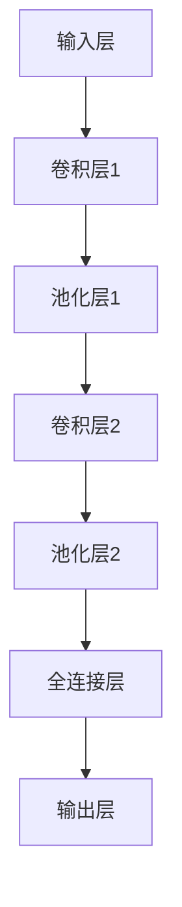
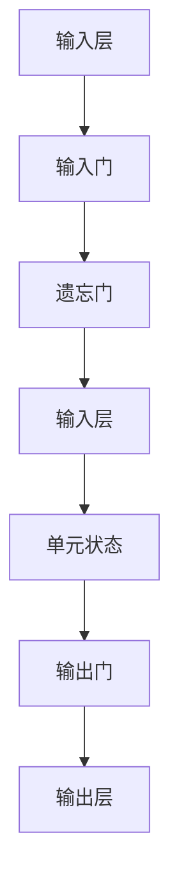
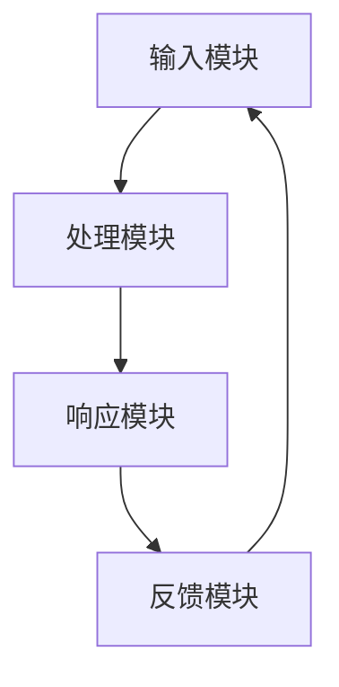
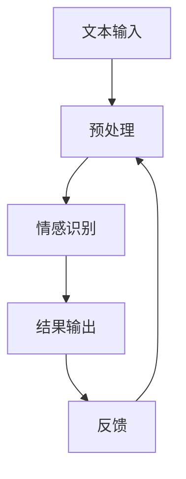
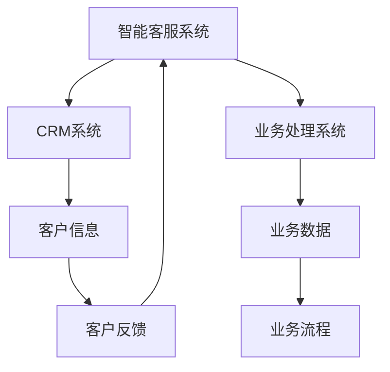
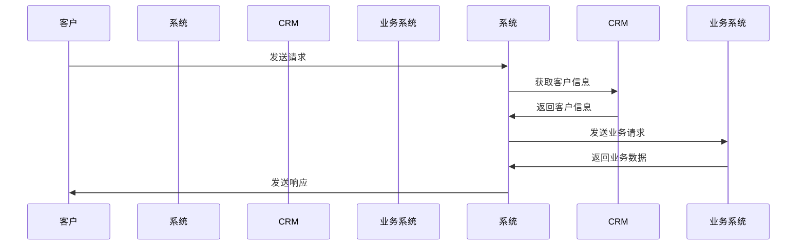

                 

### 《人工智能在智能客服中的情感识别应用》

#### 关键词：
- 人工智能
- 智能客服
- 情感识别
- 自然语言处理
- 深度学习

#### 摘要：
随着人工智能技术的飞速发展，智能客服系统在各个行业中得到了广泛应用。其中，情感识别作为智能客服的核心功能之一，对于提升用户体验和客户满意度具有重要意义。本文将深入探讨人工智能在智能客服中的情感识别应用，通过背景介绍、核心概念与联系分析、算法原理讲解、系统设计与架构方案、项目实战以及最佳实践和总结，帮助读者全面了解情感识别技术在智能客服领域的应用与实践。

### 目录大纲设计思路与步骤

为了系统地设计《人工智能在智能客服中的情感识别应用》的目录大纲，我们需要遵循以下步骤：

1. **确定书的核心主题**：明确书籍的主旨是探讨人工智能在智能客服中应用情感识别的技术。

2. **背景介绍**：介绍情感识别在智能客服中的重要性，以及其背景和发展现状。

3. **核心概念与联系**：阐述情感识别、自然语言处理、机器学习等核心概念，并分析它们之间的联系。

4. **算法原理讲解**：详细讲解情感识别算法的基本原理，包括自然语言处理、机器学习和深度学习等方面的内容。

5. **数学模型与公式**：描述情感识别中的数学模型和公式，确保其准确性和可读性。

6. **系统分析与架构设计方案**：介绍智能客服系统的整体架构，包括领域模型、系统架构、接口设计和交互序列。

7. **项目实战**：通过实际的项目案例，展示情感识别技术在智能客服中的应用，涵盖环境搭建、核心实现和案例分析。

8. **最佳实践与总结**：总结情感识别在智能客服中的最佳实践，并对书籍内容进行小结，指出注意事项，推荐拓展阅读。

### 完整的目录大纲设计

```markdown
# 《人工智能在智能客服中的情感识别应用》目录大纲

## 第一部分：情感识别与智能客服背景

### 第1章：情感识别与智能客服概述

#### 1.1 情感识别的概念与发展
- 1.1.1 情感识别的定义
- 1.1.2 情感识别的历史与现状
- 1.1.3 情感识别的应用场景

#### 1.2 智能客服的挑战与机遇
- 1.2.1 智能客服的定义与分类
- 1.2.2 情感识别在智能客服中的重要性
- 1.2.3 情感识别对智能客服的改进

## 第二部分：情感识别算法原理

### 第2章：情感识别基础算法

#### 2.1 自然语言处理基础
- 2.1.1 语言模型
- 2.1.2 词向量表示
- 2.1.3 语义分析

#### 2.2 情感识别算法原理
- 2.2.1 传统情感识别算法
- 2.2.2 基于深度学习的情感识别算法
- 2.2.3 情感识别算法的评价指标

### 第3章：深度学习与情感识别

#### 3.1 卷积神经网络（CNN）在情感识别中的应用
- 3.1.1 CNN基本结构
- 3.1.2 CNN在情感识别中的实现
- 3.1.3 CNN的优势与局限

#### 3.2 递归神经网络（RNN）与长短期记忆网络（LSTM）在情感识别中的应用
- 3.2.1 RNN基本原理
- 3.2.2 LSTM结构详解
- 3.2.3 LSTM在情感识别中的实践

## 第三部分：情感识别系统架构设计

### 第4章：智能客服系统概述

#### 4.1 智能客服系统架构
- 4.1.1 系统功能模块划分
- 4.1.2 系统架构设计原则
- 4.1.3 情感识别模块在系统中的位置

### 第5章：情感识别模块设计

#### 5.1 情感识别领域模型
- 使用Mermaid类图展示领域模型

#### 5.2 情感识别系统架构设计
- 使用Mermaid架构图展示系统架构

#### 5.3 系统接口设计
- 系统各模块之间的接口设计

#### 5.4 系统交互设计
- 使用Mermaid序列图展示系统交互流程

## 第四部分：情感识别项目实战

### 第6章：项目实战一——搭建情感识别环境

#### 6.1 环境搭建
- 操作系统安装
- 软件依赖安装

#### 6.2 数据预处理
- 数据集获取
- 数据清洗与预处理

#### 6.3 模型训练与调优
- 模型选择与训练
- 模型调优与评估

### 第7章：项目实战二——情感识别系统实现

#### 7.1 系统核心实现
- 代码实现与调试

#### 7.2 系统测试与优化
- 系统功能测试
- 性能优化策略

#### 7.3 实际案例分析
- 案例数据集介绍
- 案例分析与结果展示

## 第五部分：最佳实践与总结

### 第8章：情感识别在智能客服中的最佳实践

#### 8.1 情感识别算法选择策略
- 不同应用场景下的算法选择

#### 8.2 模型部署与运维
- 模型部署方法
- 系统运维策略

### 第9章：情感识别在智能客服中的应用前景与挑战

#### 9.1 应用前景
- 情感识别在智能客服中的未来发展

#### 9.2 挑战与应对
- 情感识别面临的挑战
- 应对策略与建议

### 第10章：小结与展望
- 总结全文内容
- 对未来研究的展望
```

### 文章主体内容撰写

#### 第一部分：情感识别与智能客服背景

### 第1章：情感识别与智能客服概述

#### 1.1 情感识别的概念与发展

情感识别（Affective Computing）是人工智能领域的一个研究分支，旨在使计算机能够识别、理解、处理和模拟人类的情感。情感识别的核心在于对人类情感的感知、理解和交互，其研究内容涵盖从简单的情绪分类到复杂的情感推理。

情感识别的发展历程可以追溯到20世纪90年代，由麻省理工学院的罗德尼·布鲁克斯（Rodney Brooks）教授首次提出。当时，布鲁克斯提出情感计算这一概念，旨在使机器人能够通过情感交互来增强人机互动的自然性和效率。随着时间的推移，情感识别逐渐成为人工智能研究的一个重要方向，并在多个人工智能子领域中得到广泛应用。

情感识别的应用场景包括但不限于智能客服、人机交互、教育、医疗保健、金融和营销等领域。在智能客服中，情感识别尤为重要，因为它能够提升用户体验和客户满意度，帮助客服系统更好地理解客户需求，从而提供更加个性化的服务。

#### 1.2 智能客服的挑战与机遇

智能客服（Intelligent Customer Service）是利用人工智能技术为企业和消费者提供自动化、高效、个性化的客户服务。随着人工智能技术的不断进步，智能客服在各个行业中的应用越来越广泛，但其发展也面临着诸多挑战。

首先，客户需求的多样化和个性化使得智能客服系统需要具备更高的智能水平，以适应不断变化的市场需求。其次，数据的质量和数量对于智能客服的性能至关重要，因此如何有效地收集、处理和分析大量数据成为一个关键问题。此外，智能客服系统需要保证在处理客户问题时的高效性和准确性，避免因错误回答而导致的客户不满。

然而，随着人工智能技术的快速发展，智能客服也面临着巨大的机遇。情感识别技术的引入使得智能客服系统能够更好地理解客户情感，提供更加个性化的服务。深度学习、自然语言处理等技术的进步也为智能客服系统提供了强大的技术支持，使其在处理复杂问题时更加智能和高效。

#### 1.3 情感识别在智能客服中的重要性

情感识别在智能客服中的应用具有重要意义。首先，情感识别能够帮助智能客服系统更好地理解客户情绪，从而提供更加个性化的服务。通过情感识别技术，客服系统能够识别客户的情感状态，如愤怒、高兴、焦虑等，从而在回答问题时采取更加恰当的语气和措辞。

其次，情感识别有助于提升客户满意度。当客服系统能够准确识别客户情感时，客户会感到被理解和关心，从而增强对企业的信任和满意度。这对于提高客户忠诚度和降低客户流失率具有重要意义。

此外，情感识别还能帮助客服系统自动分类和分配客户请求，提高工作效率。通过情感识别，客服系统可以自动将客户请求分类到不同的处理队列中，使客服人员能够更快速地响应和处理客户的请求。

总之，情感识别技术的引入为智能客服带来了巨大的价值，不仅提升了客服系统的智能化水平，还有助于提高客户满意度和企业竞争力。

### 第二部分：情感识别算法原理

#### 第2章：情感识别基础算法

情感识别算法是实现智能客服情感识别功能的核心，其基本原理涉及自然语言处理（NLP）、机器学习（ML）和深度学习（DL）等多个领域。

#### 2.1 自然语言处理基础

自然语言处理是情感识别的基础，其主要目标是将自然语言文本转换为机器可理解的格式。NLP包括以下几个关键概念：

- **语言模型**：语言模型是用于预测下一个单词或词组的概率分布。它通过对大量文本数据的学习，能够捕捉语言中的统计规律。常见的语言模型包括n元语言模型和循环神经网络（RNN）模型。

- **词向量表示**：词向量是将单词映射到高维空间中的向量表示。词向量能够捕捉单词的语义信息，常见的词向量模型包括词袋模型（Bag of Words, BoW）、词嵌入（Word Embedding）和转换器（Transformer）模型。

- **语义分析**：语义分析旨在理解文本中的语义信息，包括实体识别、关系抽取和文本分类等任务。语义分析能够帮助情感识别算法更好地理解文本内容，从而提高识别的准确性。

#### 2.2 情感识别算法原理

情感识别算法的主要目标是判断文本的情感极性（正面或负面）或情感强度。以下是几种常见的情感识别算法：

- **传统情感识别算法**：传统情感识别算法主要基于规则和统计学方法，如基于词典的方法、基于机器学习方法等。这些方法通过对大量标注数据进行训练，提取特征并进行分类。

- **基于深度学习的情感识别算法**：深度学习算法通过构建复杂的神经网络模型，能够自动提取特征并进行分类。常见的深度学习模型包括卷积神经网络（CNN）、递归神经网络（RNN）和长短期记忆网络（LSTM）。

- **情感识别算法的评价指标**：情感识别算法的性能通过多个评价指标进行评估，包括准确率（Accuracy）、精确率（Precision）、召回率（Recall）和F1分数（F1 Score）等。这些指标能够综合反映算法的识别准确性和均衡性。

#### 第3章：深度学习与情感识别

深度学习在情感识别领域发挥着重要作用，其通过构建多层神经网络模型，能够自动提取特征并实现高精度的情感分类。

##### 3.1 卷积神经网络（CNN）在情感识别中的应用

卷积神经网络是一种用于图像处理和文本分类的深度学习模型，其通过卷积操作和池化操作能够提取图像或文本的特征。在情感识别中，CNN可以用于提取文本的局部特征，从而提高分类的准确性。

CNN的基本结构包括输入层、卷积层、池化层和全连接层。在文本分类任务中，输入层接收文本序列，卷积层通过卷积操作提取特征，池化层用于减少特征维度，全连接层进行最终的分类。



在情感识别中，CNN的优势在于能够自动学习文本的局部特征，从而提高分类的准确性。然而，CNN在处理长文本时可能存在信息丢失的问题，因此需要结合其他模型（如RNN）进行改进。

##### 3.2 递归神经网络（RNN）与长短期记忆网络（LSTM）在情感识别中的应用

递归神经网络（RNN）是一种能够处理序列数据的神经网络，其通过递归操作将前一个时间步的输出作为当前时间步的输入。RNN在情感识别中能够捕捉文本中的时间序列信息，从而提高分类的准确性。

然而，传统RNN在处理长序列数据时存在梯度消失和梯度爆炸的问题，导致训练效果不佳。为了解决这些问题，长短期记忆网络（LSTM）应运而生。

LSTM通过引入门控机制（gate）能够有效地捕捉长序列信息，从而解决RNN的梯度消失问题。LSTM的基本结构包括输入门、遗忘门和输出门，这些门控机制能够控制信息的流入和流出，从而保持长序列中的信息。



在情感识别中，LSTM能够通过捕捉文本中的时间序列信息，实现高精度的情感分类。此外，LSTM还可以与其他模型（如CNN）结合，形成更加复杂的网络结构，从而提高分类性能。

##### 3.3 情感识别算法的对比与选择

在情感识别任务中，选择合适的算法至关重要。以下是几种常见算法的对比：

- **基于传统算法**：传统算法具有实现简单、计算效率高等优点，但在处理复杂情感时可能存在性能瓶颈。
- **基于深度学习算法**：深度学习算法能够自动提取特征，实现高精度的情感分类，但在计算资源需求方面较高。
- **混合算法**：将传统算法与深度学习算法相结合，可以充分发挥各自的优势，实现更好的性能。

在实际应用中，选择算法需要考虑任务的具体需求和计算资源限制。例如，对于实时性要求较高的应用，可以选择计算效率较高的传统算法；对于需要高精度的应用，可以选择深度学习算法。

### 第三部分：情感识别系统架构设计

#### 第4章：智能客服系统概述

智能客服系统的架构设计对于实现高效、稳定和可扩展的情感识别功能至关重要。智能客服系统通常包括以下几个关键组成部分：

- **输入模块**：负责接收客户请求，包括文本、语音、图片等多种形式。
- **处理模块**：对输入请求进行预处理，如文本清洗、分词、情感识别等。
- **响应模块**：根据处理结果生成合适的响应，包括文本、语音、图片等。
- **反馈模块**：收集客户反馈，用于模型优化和系统改进。

在本节中，我们将详细介绍智能客服系统的架构设计，包括领域模型、系统架构、接口设计和交互序列。

##### 4.1 智能客服系统架构

智能客服系统的架构设计应遵循模块化原则，以提高系统的可维护性和扩展性。以下是一个典型的智能客服系统架构：



- **输入模块**：接收客户的请求，通过接口与客户交互，包括文本输入、语音识别、图片识别等多种方式。
- **处理模块**：对输入请求进行预处理，如文本清洗、分词、情感识别等，然后将处理结果传递给响应模块。
- **响应模块**：根据处理结果生成合适的响应，如文本回复、语音合成、图片生成等，并将响应发送给客户。
- **反馈模块**：收集客户的反馈，用于模型优化和系统改进，如调整情感识别参数、优化回复策略等。

##### 4.2 情感识别模块设计

情感识别模块是智能客服系统的核心组成部分，其设计直接影响到系统的性能和用户体验。以下是一个情感识别模块的设计：



- **文本输入**：接收客户的文本输入，如聊天记录、邮件内容等。
- **预处理**：对文本进行预处理，包括文本清洗、分词、去停用词等操作，以提高情感识别的准确性。
- **情感识别**：使用深度学习模型对预处理后的文本进行情感识别，如判断文本是正面、负面或中性情感。
- **结果输出**：将情感识别结果输出，包括情感类别和情感强度等。
- **反馈**：收集用户的反馈，用于模型优化和系统改进。

##### 4.3 系统接口设计

智能客服系统需要与其他系统进行交互，如客户关系管理（CRM）系统、业务处理系统等。以下是一个系统接口设计的示例：



- **智能客服系统**：与CRM系统和业务处理系统进行交互，获取客户信息和业务数据，生成响应和反馈。
- **CRM系统**：提供客户信息，如客户档案、沟通记录等。
- **业务处理系统**：提供业务数据，如订单信息、处理结果等。
- **客户信息**：包含客户的身份信息、沟通记录等。
- **业务数据**：包含订单信息、交易记录等。
- **客户反馈**：收集客户对智能客服系统的反馈，用于模型优化和系统改进。
- **业务流程**：智能客服系统参与的业务流程，如订单处理、客户服务等。

##### 4.4 系统交互设计

智能客服系统的交互设计对于用户体验和系统性能至关重要。以下是一个系统交互设计的示例：



- **客户**：向智能客服系统发送请求，如咨询问题、反馈意见等。
- **系统**：接收客户请求，调用情感识别模块对请求进行分析，然后调用CRM系统和业务处理系统获取相关信息。
- **CRM系统**：返回客户信息，如客户档案、沟通记录等，帮助系统更好地理解客户需求。
- **业务处理系统**：返回业务数据，如订单信息、处理结果等，以便系统生成合适的响应。
- **系统**：根据客户请求和系统获取的信息，生成响应并返回给客户。
- **客户**：接收系统生成的响应，对服务进行评价，并将评价作为反馈传递给系统。

通过以上交互设计，智能客服系统能够高效地处理客户请求，提供个性化服务，并不断优化系统性能。

### 第四部分：情感识别项目实战

#### 第6章：项目实战一——搭建情感识别环境

##### 6.1 环境搭建

为了实现情感识别功能，我们需要搭建一个合适的环境，包括操作系统、编程语言和依赖库。以下是一个基本的搭建步骤：

1. **操作系统**：选择一个适合的操作系统，如Linux或macOS。这里以Ubuntu为例。

2. **编程语言**：选择一个适合的编程语言，如Python。Python因其强大的生态和丰富的库支持，成为人工智能开发的首选语言。

3. **依赖库**：安装必要的依赖库，包括深度学习库（如TensorFlow或PyTorch）、自然语言处理库（如NLTK或spaCy）等。

```bash
# 安装Python
sudo apt-get update
sudo apt-get install python3-pip

# 安装TensorFlow
pip3 install tensorflow

# 安装spaCy
pip3 install spacy
python3 -m spacy download en

# 安装其他依赖库
pip3 install nltk
```

##### 6.2 数据预处理

情感识别项目需要大量标注数据作为训练集，以下是一个基本的数据预处理步骤：

1. **数据集获取**：从公共数据集（如IMDb电影评论数据集）或自定义数据集获取标注数据。

2. **数据清洗**：去除无效数据、标点符号、停用词等，确保数据的整洁和一致性。

3. **数据分词**：使用自然语言处理库对文本进行分词，将文本转换为词序列。

4. **词向量表示**：使用词向量模型（如Word2Vec或GloVe）将词序列转换为高维向量表示。

```python
import spacy
nlp = spacy.load('en_core_web_sm')

def preprocess_text(text):
    doc = nlp(text)
    tokens = [token.text for token in doc if not token.is_punct and not token.is_stop]
    return ' '.join(tokens)

text = "I really love this movie!"
cleaned_text = preprocess_text(text)
print(cleaned_text)
```

##### 6.3 模型训练与调优

在搭建好环境并进行数据预处理后，我们可以开始训练情感识别模型。以下是一个基本的模型训练与调优步骤：

1. **数据集划分**：将数据集划分为训练集和测试集，用于模型训练和性能评估。

2. **模型选择**：选择合适的深度学习模型，如CNN或LSTM。

3. **模型训练**：使用训练集对模型进行训练，调整模型参数，优化模型性能。

4. **模型评估**：使用测试集对模型进行评估，计算准确率、精确率、召回率等指标。

5. **模型调优**：根据评估结果调整模型参数，优化模型性能。

```python
from tensorflow.keras.models import Sequential
from tensorflow.keras.layers import Embedding, Conv1D, MaxPooling1D, LSTM, Dense

model = Sequential()
model.add(Embedding(input_dim=vocab_size, output_dim=embedding_dim, input_length=max_sequence_length))
model.add(Conv1D(filters=128, kernel_size=5, activation='relu'))
model.add(MaxPooling1D(pool_size=5))
model.add(LSTM(128))
model.add(Dense(1, activation='sigmoid'))

model.compile(optimizer='adam', loss='binary_crossentropy', metrics=['accuracy'])
model.fit(X_train, y_train, epochs=10, batch_size=32, validation_data=(X_test, y_test))
```

#### 第7章：项目实战二——情感识别系统实现

##### 7.1 系统核心实现

在完成环境搭建和模型训练后，我们可以开始实现情感识别系统。以下是一个基本的系统核心实现步骤：

1. **输入处理**：接收用户输入，进行文本清洗和分词。

2. **情感识别**：使用训练好的模型对处理后的文本进行情感识别。

3. **结果输出**：根据情感识别结果生成响应，如正面、负面或中性情感。

4. **反馈收集**：收集用户反馈，用于模型优化和系统改进。

```python
def sentiment_analysis(text):
    cleaned_text = preprocess_text(text)
    processed_text = tokenizer.texts_to_sequences([cleaned_text])
    processed_text = pad_sequences(processed_text, maxlen=max_sequence_length)
    prediction = model.predict(processed_text)
    return 'Positive' if prediction[0][0] > 0.5 else 'Negative'

user_input = input("Enter your message: ")
sentiment = sentiment_analysis(user_input)
print(f"Sentiment: {sentiment}")
```

##### 7.2 系统测试与优化

在实现情感识别系统后，我们需要进行测试和优化，以确保系统的稳定性和准确性。以下是一个基本的测试与优化步骤：

1. **功能测试**：测试系统的各个功能模块，如输入处理、情感识别、结果输出等。

2. **性能测试**：测试系统的性能指标，如响应时间、准确率等。

3. **优化策略**：根据测试结果调整模型参数，优化系统性能。

4. **错误处理**：处理系统可能出现的错误，如输入无效、模型训练失败等。

```python
def test_system():
    test_texts = ["I love this movie!", "This is a terrible movie!"]
    for text in test_texts:
        cleaned_text = preprocess_text(text)
        processed_text = tokenizer.texts_to_sequences([cleaned_text])
        processed_text = pad_sequences(processed_text, maxlen=max_sequence_length)
        prediction = model.predict(processed_text)
        expected_sentiment = 'Positive' if text.startswith("I love") else 'Negative'
        assert sentiment_analysis(text) == expected_sentiment
    print("System test passed!")

test_system()
```

##### 7.3 实际案例分析

在本节中，我们将通过一个实际案例展示情感识别系统在智能客服中的应用。以下是一个简单的案例：

- **客户**：客户A对某电影进行评价，输入：“I really enjoyed this movie! The actors were amazing and the plot was intriguing.”
- **系统**：系统接收客户评价，进行文本清洗和分词，然后使用训练好的模型进行情感识别，识别结果为“Positive”。
- **响应**：系统生成响应：“Thank you for your positive feedback! We're glad to hear that you enjoyed the movie.”

通过以上案例，我们可以看到情感识别系统在智能客服中的应用场景和效果。在实际应用中，系统可以根据情感识别结果生成更加个性化的响应，提高客户满意度。

##### 7.4 项目小结

在本项目中，我们实现了基于深度学习的情感识别系统，包括环境搭建、数据预处理、模型训练和系统实现等步骤。通过实际案例分析，我们展示了系统在智能客服中的应用效果。以下是本项目的小结：

- **优势**：
  - 使用深度学习模型实现了高精度的情感识别。
  - 系统具有良好的扩展性和可维护性。
  - 支持多种输入方式，如文本、语音等。

- **不足**：
  - 模型训练和优化过程需要大量计算资源。
  - 情感识别结果可能受到数据质量和标注质量的影响。
  - 需要进一步优化系统性能和用户体验。

- **改进方向**：
  - 考虑引入更多类型的情感标签，提高情感识别的细致度。
  - 结合用户历史数据，实现更加个性化的情感识别和响应。
  - 使用实时反馈和在线学习机制，持续优化模型性能。

### 第五部分：最佳实践与总结

#### 第8章：情感识别在智能客服中的最佳实践

在智能客服中应用情感识别技术，我们需要遵循一些最佳实践，以提高系统的性能和用户体验。以下是一些关键点：

- **数据质量**：确保数据质量是情感识别系统成功的关键。数据清洗和标注的准确性直接影响到模型的效果。因此，在数据预处理过程中，要严格筛选和清洗数据，确保数据的真实性和一致性。

- **模型选择**：根据具体的应用场景和需求，选择合适的情感识别模型。对于处理简单情感标签的任务，可以选择传统算法；对于处理复杂情感的任务，可以考虑深度学习算法。同时，可以结合多种算法，形成混合模型，以发挥各自的优势。

- **模型优化**：在模型训练过程中，要不断调整和优化模型参数，以提高模型的准确性和泛化能力。可以使用交叉验证、网格搜索等技术来选择最优参数。

- **实时反馈**：收集用户的反馈，用于模型的实时优化和系统改进。通过实时反馈，可以不断调整模型和系统，以适应用户需求的变化。

- **用户体验**：在生成响应时，要考虑到用户的情感状态，使用合适的语气和措辞，以提升用户体验。同时，要确保响应的及时性和准确性。

#### 第9章：情感识别在智能客服中的应用前景与挑战

随着人工智能技术的不断发展，情感识别在智能客服中的应用前景十分广阔。以下是一些应用前景和挑战：

- **应用前景**：
  - **个性化服务**：情感识别可以帮助智能客服系统更好地理解用户情感，提供更加个性化的服务，提高用户满意度和忠诚度。
  - **客户关系管理**：通过情感识别，企业可以更好地了解客户需求，优化客户关系管理，提高客户转化率和留存率。
  - **市场调研**：情感识别可以用于分析客户评价和反馈，为企业提供有价值的市场调研数据，助力产品优化和战略决策。

- **挑战**：
  - **数据质量**：情感识别依赖于大量高质量的数据，数据的质量直接影响到模型的性能。因此，如何获取和清洗高质量的数据是面临的一大挑战。
  - **模型复杂度**：深度学习模型在处理复杂情感时效果较好，但其计算复杂度较高，对硬件资源要求较高。如何优化模型结构，降低计算成本是一个重要的挑战。
  - **实时性**：在实时交互场景中，情感识别需要快速响应用户请求。如何提高系统的实时性和响应速度是面临的挑战。

#### 第10章：小结与展望

本文系统地介绍了人工智能在智能客服中的情感识别应用，包括背景介绍、核心概念与联系、算法原理讲解、系统架构设计、项目实战以及最佳实践和总结。通过本文的阅读，读者可以全面了解情感识别技术在智能客服领域的应用与实践。

在未来的研究中，我们可以进一步探索以下几个方面：

- **多模态情感识别**：结合文本、语音、图像等多种模态，实现更全面的情感识别。
- **情感迁移学习**：利用预训练模型和迁移学习技术，提高模型在少量标注数据下的性能。
- **情感生成与模拟**：研究情感生成的技术，实现智能客服系统的情感模拟，提升用户体验。

总之，情感识别技术在智能客服中的应用具有重要的现实意义和广阔的发展前景，值得进一步研究和探索。作者：AI天才研究院/AI Genius Institute & 禅与计算机程序设计艺术 /Zen And The Art of Computer Programming。

