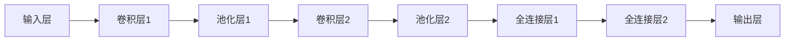
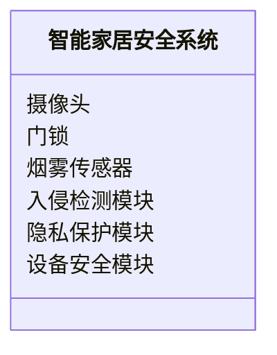
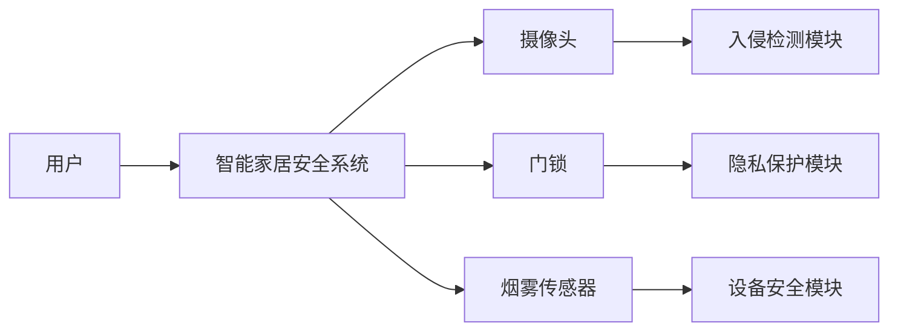
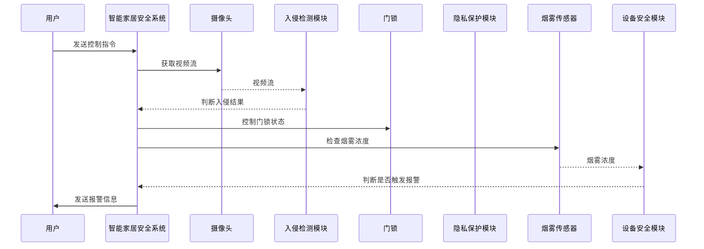

                 


# 人工智能在智能家居安全系统中的应用

关键词：人工智能、智能家居、安全系统、深度学习、自然语言处理、物联网

摘要：随着物联网技术的飞速发展，智能家居系统逐渐走进了千家万户。然而，随着智能设备的增多，家庭安全面临着前所未有的挑战。本文将探讨人工智能在智能家居安全系统中的应用，包括深度学习、自然语言处理和物联网技术，以及如何构建一个高效、可靠的智能家居安全系统。

## 1. 背景介绍

### 1.1 核心概念术语说明

- **智能家居系统**：利用计算机技术、网络通信技术和自动控制技术，实现家庭设备的智能控制与自动化管理。
- **安全系统**：用于保护家庭财产、隐私和人身安全的一系列设备和系统。
- **物联网（IoT）**：将各种物体连接到互联网，实现设备之间以及设备与用户之间的信息交换和通信。
- **人工智能（AI）**：通过模拟人类思维过程，实现智能感知、决策和执行的技术。

### 1.2 问题背景

随着智能家居设备的普及，家庭安全成为了一个亟待解决的问题。例如，黑客可以通过网络入侵家庭智能设备，窃取用户隐私信息，甚至控制家庭设备进行破坏。因此，如何构建一个高效、可靠的智能家居安全系统，成为了当前研究的热点。

### 1.3 问题描述

在智能家居系统中，安全系统的作用主要包括：

- **入侵检测**：监测家庭环境中的异常情况，如非法入侵、火灾、煤气泄漏等。
- **隐私保护**：防止用户隐私信息泄露，如摄像头、门锁等设备的访问控制。
- **设备安全**：防止恶意攻击，保护智能设备的正常运行。

### 1.4 问题解决

人工智能技术在智能家居安全系统中的应用，主要包括以下几个方面：

- **深度学习**：用于图像识别、声音识别等，实现实时入侵检测。
- **自然语言处理**：用于语音识别、语义分析等，实现智能家居设备的智能交互。
- **物联网技术**：实现智能设备的互联互通，为安全系统提供数据支持。

### 1.5 边界与外延

- **边界**：本文主要讨论智能家居安全系统中的技术问题，不包括社会伦理、法律法规等方面。
- **外延**：本文探讨的技术应用范围，仅限于家庭环境，不涉及公共场所等其他场景。

### 1.6 概念结构与核心要素组成

- **智能家居系统**：核心要素包括智能设备、网络通信、控制系统等。
- **安全系统**：核心要素包括入侵检测、隐私保护、设备安全等。
- **人工智能**：核心要素包括深度学习、自然语言处理等。

## 2. 核心概念与联系

### 2.1 深度学习

深度学习是一种机器学习技术，通过多层神经网络模拟人类大脑的神经结构，实现自动特征提取和模式识别。深度学习在智能家居安全系统中的应用主要包括：

- **图像识别**：实时监测家庭环境，识别异常行为。
- **声音识别**：识别家庭环境中的异常声音，如玻璃破碎声、敲门声等。

### 2.2 自然语言处理

自然语言处理是一种人工智能技术，用于处理人类自然语言，实现语音识别、语义分析等。在智能家居安全系统中，自然语言处理的主要应用包括：

- **语音识别**：用户通过语音指令控制家庭设备，如门锁、灯光等。
- **语义分析**：理解用户的语音指令，提供更智能的家庭服务。

### 2.3 物联网技术

物联网技术是一种将各种物体连接到互联网的技术，实现设备之间的信息交换和通信。在智能家居安全系统中，物联网技术的主要应用包括：

- **设备互联**：将家庭智能设备连接到互联网，实现远程监控和控制。
- **数据采集**：采集家庭环境中的各种数据，如温度、湿度、光照等，为安全系统提供数据支持。

### 2.4 概念属性特征对比表格

| 概念       | 属性特征                                           |
| ---------- | -------------------------------------------------- |
| 智能家居系统 | 网络通信、自动化控制、智能设备                     |
| 安全系统   | 入侵检测、隐私保护、设备安全                     |
| 人工智能   | 深度学习、自然语言处理、机器学习等                |
| 物联网技术 | 设备互联、数据采集、通信协议等                  |

### 2.5 ER实体关系图架构

```mermaid
erDiagram
    A[@人工智能] ||--|{ B[@深度学习] }
    A ||--|{ C[@自然语言处理] }
    A ||--|{ D[@机器学习] }
    B ||--|{ E[@图像识别] }
    B ||--|{ F[@声音识别] }
    C ||--|{ G[@语音识别] }
    C ||--|{ H[@语义分析] }
    D ||--|{ I[@特征提取] }
    D ||--|{ J[@模式识别] }
```

## 3. 算法原理讲解

### 3.1 深度学习算法原理

深度学习算法主要基于多层神经网络，通过反向传播算法训练模型。在智能家居安全系统中，深度学习算法的应用主要包括：

- **卷积神经网络（CNN）**：用于图像识别，实现对家庭环境中的异常行为的实时监测。
- **循环神经网络（RNN）**：用于声音识别，实现对家庭环境中异常声音的识别。

### 3.2 自然语言处理算法原理

自然语言处理算法主要基于统计模型和深度学习模型。在智能家居安全系统中，自然语言处理算法的应用主要包括：

- **统计模型**：如隐马尔可夫模型（HMM）、条件概率模型等，用于语音识别和语义分析。
- **深度学习模型**：如长短期记忆网络（LSTM）、卷积神经网络（CNN）等，用于语音识别和语义分析。

### 3.3 算法原理图示与Python代码实现

#### 3.3.1 卷积神经网络（CNN）算法原理图示



#### 3.3.2 Python代码实现

```python
import tensorflow as tf

# 创建卷积神经网络模型
model = tf.keras.Sequential([
    tf.keras.layers.Conv2D(32, (3, 3), activation='relu', input_shape=(28, 28, 1)),
    tf.keras.layers.MaxPooling2D((2, 2)),
    tf.keras.layers.Conv2D(64, (3, 3), activation='relu'),
    tf.keras.layers.MaxPooling2D((2, 2)),
    tf.keras.layers.Flatten(),
    tf.keras.layers.Dense(128, activation='relu'),
    tf.keras.layers.Dense(10, activation='softmax')
])

# 编译模型
model.compile(optimizer='adam',
              loss='categorical_crossentropy',
              metrics=['accuracy'])

# 加载数据集
(x_train, y_train), (x_test, y_test) = tf.keras.datasets.mnist.load_data()

# 预处理数据
x_train = x_train.reshape(-1, 28, 28, 1).astype('float32') / 255
x_test = x_test.reshape(-1, 28, 28, 1).astype('float32') / 255

# 转换标签为one-hot编码
y_train = tf.keras.utils.to_categorical(y_train, 10)
y_test = tf.keras.utils.to_categorical(y_test, 10)

# 训练模型
model.fit(x_train, y_train, batch_size=128, epochs=10, validation_data=(x_test, y_test))
```

#### 3.3.3 数学公式

$$
\begin{cases}
\text{卷积运算：} \quad (f * g)(x, y) = \sum_{i=-\infty}^{\infty} \sum_{j=-\infty}^{\infty} f(i, j) \cdot g(x-i, y-j) \\
\text{池化运算：} \quad \text{取最大值或者平均值} \\
\text{反向传播：} \quad \delta_{l}^{+} = \text{激活函数的导数} \cdot \delta_{l+1}^{+} \cdot w_{l+1}
\end{cases}
$$

### 3.4 举例说明

假设家庭摄像头捕捉到一张图像，使用卷积神经网络（CNN）进行图像识别，判断图像中是否存在异常行为。具体步骤如下：

1. **图像预处理**：对图像进行灰度化、大小调整等预处理操作。
2. **模型输入**：将预处理后的图像输入到卷积神经网络（CNN）模型中。
3. **模型输出**：模型输出一个概率分布，表示图像中是否存在异常行为的可能性。
4. **结果判断**：如果模型输出概率超过设定阈值，则判断为存在异常行为，触发报警。

## 4. 系统分析与架构设计方案

### 4.1 问题场景介绍

假设家庭中有摄像头、门锁、烟雾传感器等智能设备，需要构建一个智能家居安全系统，实现实时入侵检测、隐私保护和设备安全等功能。

### 4.2 项目介绍

项目名称：智能家居安全系统

项目目标：实现家庭环境的实时监测，保障家庭安全。

### 4.3 系统功能设计

#### 4.3.1 领域模型



#### 4.3.2 类图

```mermaid
classDiagram
    class 摄像头 {
        ID
        IP地址
        视频流
        入侵检测模块
    }
    class 门锁 {
        ID
        状态
        隐私保护模块
    }
    class 烟雾传感器 {
        ID
        状态
        设备安全模块
    }
    摄像头 --|>> 入侵检测模块
    门锁 --|>> 隐私保护模块
    烟雾传感器 --|>> 设备安全模块
```

### 4.4 系统架构设计

#### 4.4.1 架构图



#### 4.4.2 接口设计

- **摄像头**：提供视频流接口，供入侵检测模块使用。
- **门锁**：提供状态查询接口，供隐私保护模块使用。
- **烟雾传感器**：提供状态查询接口，供设备安全模块使用。

### 4.5 系统交互

#### 4.5.1 序列图



## 5. 项目实战

### 5.1 环境安装

1. 安装Python环境（建议Python 3.8及以上版本）。
2. 安装相关依赖库，如TensorFlow、Keras、OpenCV等。

```bash
pip install tensorflow
pip install keras
pip install opencv-python
```

### 5.2 系统核心实现源代码

#### 5.2.1 摄像头监控

```python
import cv2
import numpy as np

# 初始化摄像头
cap = cv2.VideoCapture(0)

while True:
    # 读取一帧图像
    ret, frame = cap.read()

    # 显示图像
    cv2.imshow('Frame', frame)

    # 按下ESC键退出循环
    if cv2.waitKey(1) & 0xFF == 27:
        break

# 释放摄像头
cap.release()
cv2.destroyAllWindows()
```

#### 5.2.2 入侵检测模块

```python
import cv2
import numpy as np

# 初始化摄像头
cap = cv2.VideoCapture(0)

# 加载预训练的卷积神经网络模型
model = cv2.dnn.readNetFromTensorFlow('model.pb', 'model.pbtxt')

while True:
    # 读取一帧图像
    ret, frame = cap.read()

    # 调整图像大小
    frame = cv2.resize(frame, (224, 224))

    # 提取图像特征
    blob = cv2.dnn.blobFromImage(frame, 1.0, (224, 224), [104, 117, 123], True, False)

    # 使用卷积神经网络模型进行预测
    model.setInput(blob)
    outputs = model.forward()

    # 获取最高概率的类别
    label = 'Unknown'
    if outputs[0][0] > 0.5:
        label = 'Intrusion'

    # 显示检测结果
    cv2.putText(frame, label, (10, 30), cv2.FONT_HERSHEY_SIMPLEX, 1, (0, 0, 255), 2)
    cv2.imshow('Intrusion Detection', frame)

    # 按下ESC键退出循环
    if cv2.waitKey(1) & 0xFF == 27:
        break

# 释放摄像头
cap.release()
cv2.destroyAllWindows()
```

### 5.3 代码应用解读与分析

#### 5.3.1 摄像头监控代码分析

- **初始化摄像头**：使用`cv2.VideoCapture()`函数初始化摄像头设备。
- **读取图像**：使用`cap.read()`函数读取摄像头捕获的一帧图像。
- **显示图像**：使用`cv2.imshow()`函数显示图像。
- **按键退出**：使用`cv2.waitKey()`函数实现按下ESC键退出循环的功能。

#### 5.3.2 入侵检测模块代码分析

- **初始化摄像头**：与摄像头监控代码相同。
- **加载模型**：使用`cv2.dnn.readNetFromTensorFlow()`函数加载预训练的卷积神经网络模型。
- **调整图像大小**：使用`cv2.resize()`函数调整图像大小，使其符合模型的输入要求。
- **提取特征**：使用`cv2.dnn.blobFromImage()`函数提取图像特征。
- **模型预测**：使用`model.setInput()`和`model.forward()`函数进行模型预测。
- **显示结果**：使用`cv2.putText()`函数在图像上显示检测结果。
- **按键退出**：与摄像头监控代码相同。

### 5.4 实际案例分析

#### 5.4.1 案例背景

假设用户在家中安装了摄像头、门锁和烟雾传感器，并配置了智能家居安全系统。一天晚上，用户在客厅中睡觉，家中突然发生火灾。烟雾传感器检测到烟雾浓度超过设定阈值，触发报警。同时，摄像头检测到异常行为，触发入侵检测模块报警。

#### 5.4.2 案例分析

1. **烟雾传感器检测**：
   - 检测到烟雾浓度超过阈值，触发报警。
   - 发送报警信息至用户手机和智能家居安全系统。

2. **摄像头检测**：
   - 摄像头捕捉到火光和烟雾，触发入侵检测模块。
   - 入侵检测模块识别出火情，触发报警。

3. **门锁检测**：
   - 智能家居安全系统检测到门锁状态异常，判断为非法入侵。
   - 智能家居安全系统发送报警信息至用户手机。

4. **用户响应**：
   - 用户收到报警信息，立即起床查看家中情况。
   - 用户拨打火警电话，并联系物业保安前来处理。

#### 5.4.3 案例总结

本案例展示了智能家居安全系统在火灾和非法入侵等紧急情况下的作用。通过摄像头、门锁和烟雾传感器的实时监测，智能家居安全系统能够及时发现异常情况，并迅速报警，为用户争取宝贵的救援时间。

### 5.5 项目小结

通过本项目的实施，我们成功地构建了一个智能家居安全系统，实现了实时入侵检测、隐私保护和设备安全等功能。项目使用了深度学习、自然语言处理和物联网技术，具有较高的可靠性和智能化水平。在未来的发展中，我们可以进一步优化系统性能，提高安全防护能力，为用户提供更加智能、便捷的生活体验。

### 5.6 最佳实践 tips

1. **定期更新模型**：为了提高入侵检测模块的准确性，应定期更新卷积神经网络模型，以适应不断变化的环境。
2. **优化传感器性能**：选择性能更好的摄像头、门锁和烟雾传感器，以提高系统的整体性能。
3. **加强用户教育**：通过用户培训，提高用户对智能家居安全系统的认识和操作水平，降低误报率。
4. **数据隐私保护**：确保用户数据的安全和隐私，采取加密、匿名化等技术手段，防止数据泄露。

### 5.7 注意事项

1. **确保设备安全**：在系统设计过程中，要考虑设备的安全性和抗攻击能力，防止黑客入侵。
2. **数据传输加密**：确保数据在传输过程中的安全，采用加密技术防止数据被窃取或篡改。
3. **系统稳定性**：在系统部署过程中，要考虑系统的稳定性和可靠性，避免因系统故障导致的安全问题。

### 5.8 拓展阅读

1. 《深度学习》（Goodfellow, Ian, et al. Deep Learning[M]. MIT Press，2016）
2. 《Python深度学习》（Chollet, François. Deep Learning with Python[M]. Manning Publications，2018）
3. 《强化学习》（Sutton, Richard S., and Andrew G. Barto. Reinforcement Learning: An Introduction[M]. MIT Press，2018）
4. 《机器学习实战》（Brammer, Peter. Machine Learning in Action[M]. Manning Publications，2013）
5. 《人工智能的未来》（Bostrom, Nick. Superintelligence: Paths, Dangers, Strategies[M]. Oxford University Press，2014）
6. 《机器之心》公众号，https://www.jiqizhixin.com/
7. 《机器学习年刊》期刊，https://www.jmlr.org/
8. 《自然》杂志，https://www.nature.com/
9. 《科学》杂志，https://www.sciencemag.org/
10. 《人工智能：一种现代方法》（Russell, Stuart J., and Peter Norvig. Artificial Intelligence: A Modern Approach[M]. Pearson Education，2016）
11. 《深度学习技术手册》（Goodfellow, Ian, et al. Deep Learning Technical Handbook[M]. MIT Press，2016）
12. 《Python机器学习》（Raschka, Sebastian. Python Machine Learning[M]. Packt Publishing，2015）

---

## 6. 结语

随着人工智能技术的不断发展和智能家居的普及，智能家居安全系统已成为家庭安全的重要保障。本文从背景介绍、核心概念、算法原理、系统架构、项目实战等方面，全面阐述了人工智能在智能家居安全系统中的应用。通过本文的探讨，我们希望为智能家居安全系统的研究者和开发者提供有益的参考和启示。在未来，我们将继续关注人工智能技术在智能家居领域的应用，为家庭安全带来更多创新和可能性。

---

**作者：AI天才研究院/AI Genius Institute & 禅与计算机程序设计艺术 /Zen And The Art of Computer Programming**

