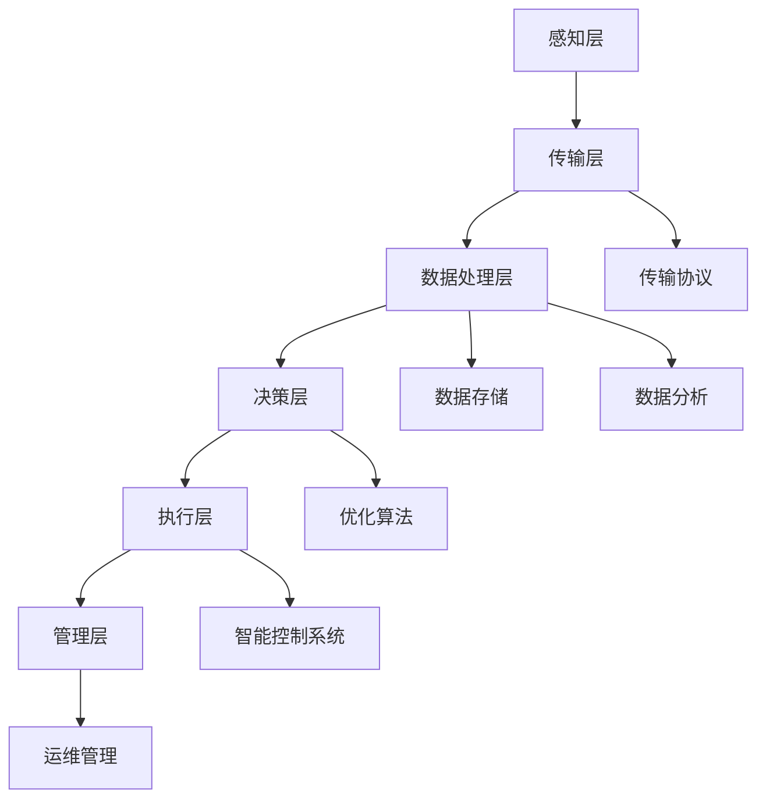

                 

## 文章标题

### 人工智能在智能建筑能源管理中的应用

#### 关键词：人工智能、智能建筑、能源管理、数据采集、预测与优化

#### 摘要：

本文旨在探讨人工智能在智能建筑能源管理中的应用，通过深入分析人工智能技术的原理及其与智能建筑和能源管理的结合点，阐述如何利用人工智能实现智能建筑能源的高效管理。文章分为五个主要部分，首先介绍智能建筑能源管理的问题背景和核心概念，然后详细探讨人工智能技术、智能建筑原理及其与能源管理的联系，接着介绍数据采集与分析、预测与优化的方法，最后通过系统分析与架构设计方案，展示人工智能在智能建筑能源管理中的实际应用和实现过程。

---

## 第一部分：问题背景与核心概念

### 第1章：问题背景介绍

#### 1.1 问题描述

智能建筑能源管理的核心目标是提高能源利用效率，减少能源消耗，实现绿色建筑。随着城市化进程的加快，智能建筑的数量不断增加，如何在保证舒适度的同时，实现能源的高效管理成为了一个亟待解决的问题。

#### 1.2 问题解决

人工智能技术在智能建筑能源管理中具有广泛应用。通过数据采集与分析、预测与优化、智能决策与控制等技术，可以实现能源的高效利用。

#### 1.3 边界与外延

本文主要讨论人工智能在智能建筑能源管理中的应用，不包括其他领域的人工智能技术。

#### 1.4 核心概念结构与要素组成

- **人工智能技术**：实现智能决策、智能交互、智能控制等功能的计算机技术。
- **智能建筑**：通过物联网、云计算、人工智能等先进技术实现建筑设备自动化管理和智能化控制的建筑物。
- **能源管理**：通过科学、合理的能源利用方式，降低能源消耗，实现能源的高效利用。
- **数据采集与分析**：通过传感器、物联网等技术收集建筑内部的能源数据，并对数据进行分析和处理。
- **预测与优化**：通过对历史数据的分析，预测未来能源消耗趋势，并优化能源使用策略。
- **智能决策与控制**：通过人工智能技术实现能源管理的自动化决策和控制。

### 第2章：核心概念与联系

#### 2.1 人工智能技术

**定义**：人工智能技术是指通过计算机模拟人类的智能行为，实现智能决策、智能交互、智能控制等功能的计算机技术。

**特点**：自主性、智能性、适应性、高效性。

**与智能建筑能源管理的联系**：人工智能技术是实现智能建筑能源管理的关键技术，可以用于数据采集、预测、优化和智能决策等环节。

#### 2.2 智能建筑

**定义**：智能建筑是指通过物联网、云计算、人工智能等先进技术，实现建筑设备的自动化管理、智能化控制和高效能源利用的建筑物。

**特点**：自动化、智能化、高效化、人性化。

**与能源管理的联系**：智能建筑通过引入人工智能技术，可以实现能源的实时监控、预测和优化，提高能源利用效率。

#### 2.3 能源管理

**定义**：能源管理是指通过科学、合理的能源利用方式，降低能源消耗，实现能源的高效利用。

**特点**：科学性、合理性、高效性、可持续性。

**与人工智能技术的联系**：人工智能技术可以为能源管理提供数据支持、预测和分析，优化能源利用方式。

#### 2.4 数据采集与分析

**定义**：数据采集与分析是指通过传感器、物联网等技术，收集建筑内部的能源数据，并对数据进行分析和处理。

**特点**：实时性、准确性、高效性。

**与智能建筑能源管理的联系**：数据采集与分析是实现智能建筑能源管理的基础，可以为预测、优化和智能决策提供数据支持。

#### 2.5 预测与优化

**定义**：预测与优化是指通过对历史数据的分析，预测未来能源消耗趋势，并优化能源使用策略。

**特点**：预测性、优化性、智能化。

**与智能建筑能源管理的联系**：预测与优化是实现智能建筑能源管理的关键，可以降低能源消耗，提高能源利用效率。

#### 2.6 智能决策与控制

**定义**：智能决策与控制是指通过人工智能技术，实现能源管理的自动化决策和控制。

**特点**：自动化、智能化、高效性。

**与智能建筑能源管理的联系**：智能决策与控制是实现智能建筑能源管理的高级阶段，可以提高能源管理的效率和智能化水平。

### 第3章：本章小结

本章介绍了人工智能在智能建筑能源管理中的应用背景、核心概念及其联系。通过本章的学习，读者可以初步了解人工智能在智能建筑能源管理中的重要作用，以及各个核心概念之间的联系。

---

## 第二部分：人工智能技术原理

### 第4章：人工智能技术概述

#### 4.1 人工智能发展历程

人工智能（Artificial Intelligence，简称AI）的发展经历了多个阶段。从最初的规则系统（Expert Systems）到基于知识的系统，再到基于机器学习的系统，人工智能经历了从简单到复杂、从模拟到自动化的过程。

**里程碑事件：**

- 1956年，达特茅斯会议标志着人工智能学科的诞生。
- 1980年代，专家系统达到高峰，但随后由于知识获取困难、推理效率低等问题，专家系统逐渐式微。
- 2006年，深度学习（Deep Learning）的兴起，使得人工智能在图像识别、语音识别等领域取得了突破性进展。
- 2012年，AlexNet在ImageNet图像识别比赛中取得优异成绩，深度学习进入工业应用阶段。

#### 4.2 人工智能定义

人工智能是指使计算机具有人类智能水平的科学技术。具体来说，人工智能包括模拟、延伸和扩展人类智能的各种技术，如机器学习、自然语言处理、计算机视觉、智能控制等。

**定义**：人工智能（Artificial Intelligence，简称AI）是指通过计算机模拟、延伸和扩展人类智能的各种技术，使计算机能够实现感知、学习、推理、决策等智能行为。

#### 4.3 人工智能技术分类

人工智能技术可以大致分为以下几类：

- **机器学习**：通过数据训练，使计算机具有自主学习和优化能力。
  - **监督学习**：有标记数据训练，如分类、回归问题。
  - **无监督学习**：无标记数据训练，如聚类、降维问题。
  - **强化学习**：通过与环境的交互，学习最优策略，如游戏AI。

- **深度学习**：一种基于多层神经网络的学习方法。
  - **神经网络**：模拟人脑神经元连接，处理复杂数据。
  - **卷积神经网络（CNN）**：用于图像处理。
  - **循环神经网络（RNN）**：用于序列数据处理。

- **自然语言处理（NLP）**：使计算机能够理解、生成和处理自然语言。
  - **语言模型**：用于预测下一个单词或句子。
  - **文本分类**：对文本进行分类，如情感分析、主题分类。
  - **机器翻译**：将一种语言的文本翻译成另一种语言。

### 第5章：人工智能技术原理

#### 5.1 机器学习基础算法

机器学习的基础算法包括：

- **线性回归**：用于预测连续值。
  $$y = \beta_0 + \beta_1 \cdot x + \epsilon$$
- **决策树**：用于分类和回归。
  - **节点划分**：基于特征和阈值进行。
  - **叶子节点**：预测结果。
- **支持向量机（SVM）**：用于分类和回归。
  - **线性SVM**：通过最大化间隔划分数据。
  - **核函数**：用于非线性划分。

#### 5.2 神经网络原理

神经网络（Neural Networks）是模仿人脑神经元连接的网络结构。

- **神经元**：基本单元，包括输入层、权重、激活函数。
- **激活函数**：用于将线性组合转换为非线性输出。
  - **Sigmoid函数**：$$\sigma(x) = \frac{1}{1 + e^{-x}}$$
  - **ReLU函数**：$$\text{ReLU}(x) = \max(0, x)$$
- **反向传播算法**：用于训练神经网络，优化权重和偏置。
  - **前向传播**：计算输出。
  - **损失函数**：评估预测值与真实值之间的差距。
  - **反向传播**：计算梯度，更新权重和偏置。

#### 5.3 深度学习原理

深度学习（Deep Learning）是基于多层神经网络的学习方法。

- **多层神经网络**：包括输入层、隐藏层和输出层。
- **卷积神经网络（CNN）**：用于图像处理。
  - **卷积层**：提取图像特征。
  - **池化层**：降低特征图的维度。
  - **全连接层**：分类和回归。
- **循环神经网络（RNN）**：用于序列数据处理。
  - **循环结构**：记忆过去的信息。
  - **门控机制**：控制信息的流动。

### 第6章：本章小结

本章介绍了人工智能的基本概念、发展历程、分类以及主要算法原理。通过本章的学习，读者可以初步了解人工智能的基本原理，为后续章节的学习打下基础。

---

## 第三部分：智能建筑原理

### 第7章：智能建筑概述

#### 7.1 智能建筑定义

智能建筑（Smart Building）是指通过物联网（IoT）、云计算（Cloud Computing）、人工智能（AI）等先进技术，实现建筑设备的自动化管理、智能化控制和高效能源利用的建筑物。

#### 7.2 智能建筑发展历程

智能建筑的发展可以追溯到20世纪80年代的楼宇自动化系统（Building Automation System，简称BAS）。随着信息技术和通信技术的不断进步，智能建筑逐渐从单纯的设备自动化管理向智能化管理和能源优化方向发展。

**里程碑事件：**

- 1980年代：楼宇自动化系统（BAS）的兴起。
- 2000年代：物联网（IoT）技术的引入，使建筑设备互联互通。
- 2010年代：云计算技术的应用，实现大数据处理和智能分析。
- 2020年代：人工智能（AI）的加入，推动智能建筑向智能化和高效化方向发展。

#### 7.3 智能建筑特点

智能建筑具有以下特点：

- **自动化**：通过自动化系统，实现建筑设备的远程控制和自动调节。
- **智能化**：利用人工智能技术，实现建筑设备的智能决策和自适应控制。
- **高效化**：通过能源管理和优化，提高能源利用效率，降低能源消耗。
- **人性化**：提供舒适、安全、便捷的生活和工作环境。

### 第8章：智能建筑系统组成

智能建筑系统主要由以下几个部分组成：

- **建筑设备系统**：包括安防系统、消防系统、照明系统、空调系统等。
  - **安防系统**：通过摄像头、传感器等设备，实现实时监控和报警功能。
  - **消防系统**：包括烟雾探测、消防喷淋、消防广播等设备，保障建筑安全。
  - **照明系统**：通过智能调光，实现照明效果的自动调节。
  - **空调系统**：通过智能控制，实现室内温度和湿度的自动调节。

- **建筑管理系统**：包括楼宇自控系统、能耗管理系统、设施管理系统等。
  - **楼宇自控系统**：通过自动化控制，实现建筑设备的安全、高效运行。
  - **能耗管理系统**：通过数据采集和分析，实现能源的优化利用。
  - **设施管理系统**：通过智能管理，实现建筑设施的全生命周期管理。

#### 8.1 建筑设备系统

建筑设备系统是智能建筑的核心组成部分，涵盖了建筑内部的各种设备和系统。这些设备和系统通过物联网技术连接，实现数据共享和协同工作，从而提高建筑的整体智能化水平。

**典型设备：**

- **传感器**：用于监测环境参数，如温度、湿度、光照强度、空气质量等。
- **控制器**：用于接收传感器数据，并根据预设规则进行自动调节。
- **执行器**：用于执行控制器的指令，如开关、调节阀门等。

#### 8.2 建筑管理系统

建筑管理系统是智能建筑的大脑，通过集成各种建筑设备和系统，实现智能化管理和控制。建筑管理系统通常包括以下几个功能模块：

- **数据采集**：通过传感器等设备，实时采集建筑内部的各类数据。
- **数据处理**：对采集到的数据进行清洗、过滤、分析，提取有价值的信息。
- **智能分析**：利用人工智能技术，对数据进行分析和预测，为决策提供支持。
- **智能控制**：根据分析结果，自动调整建筑设备的工作状态，实现能源的优化利用。

### 第9章：智能建筑关键技术

智能建筑的关键技术包括物联网技术、云计算技术、人工智能技术等。这些技术相互融合，共同推动智能建筑的发展。

#### 9.1 物联网技术

物联网技术（Internet of Things，简称IoT）是智能建筑的基础技术。通过物联网技术，建筑设备可以实现互联互通，实现数据的实时传输和共享。

**关键技术：**

- **传感器网络**：用于实时监测建筑环境参数。
- **无线通信技术**：如Wi-Fi、ZigBee、蓝牙等，用于传输传感器数据。
- **边缘计算**：在靠近数据源的设备上，实时处理和分析数据，降低数据传输延迟。

#### 9.2 云计算技术

云计算技术（Cloud Computing）为智能建筑提供了强大的数据处理和分析能力。通过云计算，建筑管理系统可以存储、处理和分析大量数据，为智能决策提供支持。

**关键技术：**

- **大数据处理**：通过分布式计算和存储技术，处理海量数据。
- **云计算平台**：如阿里云、腾讯云、华为云等，提供计算资源和存储服务。
- **数据挖掘**：从大量数据中提取有价值的信息。

#### 9.3 人工智能技术

人工智能技术（Artificial Intelligence，简称AI）是智能建筑的智能核心。通过人工智能技术，建筑设备可以实现自主学习和智能决策，提高能源利用效率。

**关键技术：**

- **机器学习**：通过数据训练，实现设备的自主学习和优化。
- **深度学习**：用于处理复杂数据，如图像和语音。
- **自然语言处理**：用于理解和生成自然语言。

### 第10章：本章小结

本章介绍了智能建筑的基本概念、发展历程、系统组成以及关键技术。通过本章的学习，读者可以初步了解智能建筑的基本原理，为后续章节的学习打下基础。

---

## 第四部分：智能建筑与能源管理

### 第11章：能源管理概述

#### 11.1 能源管理定义

能源管理（Energy Management）是指通过科学、合理的能源利用方式，降低能源消耗，实现能源的高效利用。能源管理不仅涉及能源的消耗和供给，还包括能源的存储、转换和分配。

#### 11.2 能源管理特点

能源管理具有以下特点：

- **科学性**：通过数据分析和科学方法，实现能源的合理利用。
- **合理性**：根据实际需求和资源条件，制定合理的能源使用计划。
- **高效性**：通过优化能源利用方式，提高能源利用效率。
- **可持续性**：注重能源的长期发展和环境保护。

#### 11.3 能源管理目标

能源管理的目标是：

- **提高能源利用效率**：通过优化能源利用方式，减少能源浪费。
- **降低能源成本**：通过合理使用能源，降低能源消耗和运营成本。
- **实现可持续发展**：通过科学管理和节能措施，促进能源的可持续利用。

### 第12章：智能建筑与能源管理的关系

智能建筑与能源管理之间存在密切的关系。智能建筑通过引入物联网、云计算、人工智能等先进技术，可以实现能源的实时监控、预测和优化，提高能源利用效率。

#### 12.1 数据采集与分析

智能建筑通过物联网技术，实现对建筑内部能源数据的实时采集。这些数据包括电能、水能、燃气等的消耗情况。通过数据采集与分析，可以了解建筑内部的能源使用状况，为能源管理提供数据支持。

**技术原理：**

- **传感器网络**：用于实时监测能源消耗。
- **数据采集器**：将传感器数据转换为数字信号，传输到中心控制系统。
- **数据存储**：将采集到的数据存储在数据库中，以便后续分析和处理。

#### 12.2 预测与优化

智能建筑通过大数据分析和机器学习算法，对历史能源数据进行分析，预测未来能源消耗趋势，并优化能源使用策略。

**技术原理：**

- **数据预处理**：对采集到的数据进行清洗、过滤和归一化处理。
- **特征工程**：提取对能源消耗有显著影响的关键特征。
- **预测模型**：利用机器学习算法，如线性回归、决策树、深度学习等，建立预测模型。
- **优化策略**：根据预测结果，制定最优的能源使用策略。

#### 12.3 智能决策与控制

智能建筑通过人工智能技术，实现能源管理的自动化决策和控制。智能决策系统可以根据实时数据和历史数据，自动调整能源使用策略，实现能源的高效利用。

**技术原理：**

- **实时数据监测**：通过传感器网络，实时监测能源消耗情况。
- **历史数据学习**：利用机器学习算法，对历史数据进行分析和学习。
- **自动化决策**：根据实时数据和预测结果，自动调整能源使用策略。
- **反馈调节**：通过反馈机制，不断调整和优化能源使用策略。

### 第13章：本章小结

本章介绍了能源管理的基本概念、特点、目标以及智能建筑与能源管理的关系。通过本章的学习，读者可以了解智能建筑如何通过数据采集与分析、预测与优化、智能决策与控制等手段，实现能源的高效管理。

---

## 第五部分：数据采集与分析

### 第14章：数据采集技术

数据采集是智能建筑能源管理的重要环节。通过数据采集，可以获取建筑内部各种设备的能耗数据，为后续的分析和处理提供基础。

#### 14.1 数据采集方法

数据采集方法主要包括：

- **传感器网络**：用于实时监测建筑内部的环境参数，如温度、湿度、光照强度等。
- **无线通信技术**：如Wi-Fi、ZigBee、蓝牙等，用于传输传感器数据。
- **数据采集器**：将传感器数据转换为数字信号，传输到中心控制系统。
- **数据存储**：将采集到的数据存储在数据库中，以便后续分析和处理。

#### 14.2 数据采集器原理

数据采集器是数据采集系统的重要组成部分。其工作原理如下：

- **数据采集**：通过传感器网络，实时采集建筑内部的能耗数据。
- **数据处理**：将采集到的数据进行预处理，如数据清洗、过滤和归一化处理。
- **数据传输**：将预处理后的数据传输到中心控制系统，或存储在本地数据库中。

#### 14.3 数据采集系统架构

数据采集系统架构主要包括以下几个部分：

- **传感器网络**：用于实时监测建筑内部的能耗数据。
- **数据采集器**：将传感器数据转换为数字信号，传输到中心控制系统。
- **中心控制系统**：用于接收、处理和存储数据采集器发送的数据。
- **数据存储系统**：用于存储采集到的数据，以便后续分析和处理。

### 第15章：数据分析技术

数据分析是智能建筑能源管理的关键环节。通过数据分析，可以了解建筑内部的能源使用状况，发现潜在的问题和优化空间。

#### 15.1 数据分析方法

数据分析方法主要包括：

- **统计分析**：通过计算数据的均值、方差、标准差等统计量，了解数据的分布和趋势。
- **数据挖掘**：通过挖掘数据中的潜在信息和关联，发现有用的知识和规律。
- **机器学习**：通过训练模型，预测未来的能源消耗趋势，制定优化的能源使用策略。

#### 15.2 数据分析流程

数据分析流程主要包括以下几个步骤：

- **数据清洗**：去除数据中的噪声和异常值，保证数据的准确性和完整性。
- **数据整合**：将来自不同数据源的数据进行整合，形成统一的数据集。
- **数据探索**：通过计算统计量、绘制图表等，对数据进行初步探索和分析。
- **模型训练**：利用机器学习算法，建立预测模型，对能源消耗进行预测。
- **结果验证**：通过实际数据验证模型的预测准确性，调整和优化模型。

#### 15.3 数据可视化

数据可视化是将数据以图形、图像等形式展示出来的方法。通过数据可视化，可以直观地了解数据的特点和趋势。

**常见的数据可视化工具：**

- **Python的Matplotlib库**：用于绘制各种统计图表。
- **Tableau**：用于交互式数据可视化。
- **Power BI**：用于企业级的数据可视化和分析。

### 第16章：本章小结

本章介绍了数据采集与分析的基本原理和技术。通过数据采集，可以获取建筑内部的能耗数据；通过数据分析，可以了解能源使用状况，发现优化空间。数据采集与分析是智能建筑能源管理的重要环节，为后续的预测与优化提供了基础。

---

## 第六部分：预测与优化

### 第17章：预测技术

在智能建筑能源管理中，预测技术是关键的一环。通过预测，可以提前了解未来的能源消耗趋势，从而制定相应的优化策略，实现能源的高效利用。

#### 17.1 预测方法

预测方法主要包括以下几种：

- **时间序列分析**：基于历史数据，通过建立时间序列模型，预测未来的能源消耗。
  - **自回归模型（AR）**：$$X_t = c + \phi_1 X_{t-1} + \phi_2 X_{t-2} + \ldots + \phi_p X_{t-p} + \varepsilon_t$$
  - **移动平均模型（MA）**：$$X_t = c + \theta_1 X_{t-1} + \theta_2 X_{t-2} + \ldots + \theta_q X_{t-q} + \varepsilon_t$$
  - **自回归移动平均模型（ARMA）**：结合自回归模型和移动平均模型。
- **机器学习预测**：利用机器学习算法，如线性回归、决策树、深度学习等，建立预测模型。
  - **线性回归**：$$y = \beta_0 + \beta_1 \cdot x + \epsilon$$
  - **决策树**：通过树形结构，对数据进行划分，预测结果。
  - **深度学习**：如卷积神经网络（CNN）、循环神经网络（RNN）等，用于处理复杂数据。

#### 17.2 预测模型建立

预测模型的建立主要包括以下几个步骤：

- **数据准备**：收集历史能源消耗数据，进行数据清洗和处理。
- **特征工程**：提取对能源消耗有显著影响的关键特征，如时间、温度、湿度等。
- **模型选择**：根据数据特点，选择合适的预测模型，如时间序列模型、线性回归模型等。
- **模型训练**：利用训练数据，对预测模型进行训练。
- **模型评估**：通过测试数据，评估模型的预测准确性，调整和优化模型。

#### 17.3 预测结果分析

预测结果的分析主要包括以下几个方面：

- **预测准确性**：通过计算预测值与实际值之间的差距，评估模型的预测准确性。
  - **均方误差（MSE）**：$$MSE = \frac{1}{n}\sum_{i=1}^{n} (y_i - \hat{y}_i)^2$$
  - **均方根误差（RMSE）**：$$RMSE = \sqrt{MSE}$$
- **预测趋势**：分析预测结果的时间序列趋势，如季节性、周期性等。
- **预测区间**：根据预测结果，确定预测的置信区间，评估预测结果的可靠性。

### 第18章：优化技术

在预测未来能源消耗趋势后，优化技术是实现能源高效利用的关键。通过优化技术，可以制定合理的能源使用策略，降低能源消耗，提高能源利用效率。

#### 18.1 优化方法

优化方法主要包括以下几种：

- **线性规划**：通过建立线性规划模型，求解最优解，实现能源的优化配置。
  - **目标函数**：最大化或最小化能源消耗。
  - **约束条件**：满足能源需求、设备运行条件等。
- **整数规划**：用于处理离散变量的问题，如设备启停控制。
  - **目标函数**：最小化能源消耗或成本。
  - **约束条件**：设备运行时间、维护周期等。
- **启发式算法**：如遗传算法、粒子群优化等，通过搜索和迭代，寻找最优解。
  - **目标函数**：最大化或最小化能源消耗。
  - **约束条件**：设备运行条件、能源需求等。

#### 18.2 优化模型建立

优化模型的建立主要包括以下几个步骤：

- **问题建模**：根据实际需求，建立优化模型，定义目标函数和约束条件。
- **求解算法**：选择合适的求解算法，如线性规划、整数规划、启发式算法等。
- **模型求解**：利用求解算法，求解优化模型，得到最优解。
- **结果分析**：分析优化结果，如能源消耗、成本等，评估优化效果。

#### 18.3 优化策略实施

优化策略的实施主要包括以下几个方面：

- **实时监控**：通过传感器网络，实时监控能源消耗情况，及时发现问题和异常。
- **自适应调整**：根据实时数据和历史数据，自适应调整能源使用策略，实现能源的高效利用。
- **反馈机制**：通过反馈机制，不断调整和优化能源使用策略，提高能源利用效率。

### 第19章：本章小结

本章介绍了预测与优化技术在智能建筑能源管理中的应用。通过预测，可以提前了解未来的能源消耗趋势；通过优化，可以制定合理的能源使用策略，实现能源的高效利用。预测与优化是智能建筑能源管理的重要手段，为建筑能源管理提供了有力的支持。

---

## 第七部分：智能决策与控制

### 第20章：智能决策系统

智能决策系统是智能建筑能源管理的核心组成部分。通过智能决策系统，可以实现对建筑能源使用的自动化决策和控制，提高能源利用效率。

#### 20.1 智能决策系统定义

智能决策系统（Intelligent Decision System）是指利用人工智能技术，对建筑能源使用进行自动化决策和控制的系统。它通过实时数据采集、预测与优化、智能算法分析，制定最优的能源使用策略。

#### 20.2 智能决策系统组成部分

智能决策系统主要由以下几个部分组成：

- **数据采集模块**：负责实时采集建筑内部的各种能耗数据。
- **预测模块**：利用历史数据和机器学习算法，预测未来的能源消耗趋势。
- **优化模块**：根据预测结果，利用优化算法，制定最优的能源使用策略。
- **控制模块**：根据决策结果，自动调整建筑内部的能源设备，实现能源的高效利用。

#### 20.3 智能决策系统原理

智能决策系统的工作原理如下：

1. **数据采集**：通过传感器网络，实时采集建筑内部的能耗数据，如电能、水能、燃气等。
2. **数据处理**：对采集到的数据进行分析和处理，提取有用的信息和特征。
3. **预测与优化**：利用机器学习算法，如时间序列分析、线性回归、深度学习等，对历史数据进行分析，预测未来的能源消耗趋势，并制定最优的能源使用策略。
4. **决策与控制**：根据预测结果和优化策略，自动调整建筑内部的能源设备，如空调、照明、电梯等，实现能源的高效利用。

### 第21章：智能控制系统

智能控制系统是智能决策系统的重要组成部分，负责实现对建筑能源设备的自动化控制。

#### 21.1 智能控制系统定义

智能控制系统（Intelligent Control System）是指利用人工智能技术，对建筑能源设备进行自动化控制和管理的系统。它通过实时数据采集、预测与优化、智能算法分析，实现能源设备的高效运行。

#### 21.2 智能控制系统组成部分

智能控制系统主要由以下几个部分组成：

- **控制器**：负责接收智能决策系统的指令，控制建筑能源设备的工作状态。
- **执行器**：负责执行控制器的指令，控制建筑能源设备的开关、调节等操作。
- **传感器**：负责实时监测建筑内部的能耗数据，为智能控制系统提供数据支持。
- **通信模块**：负责传输控制器、执行器和传感器之间的数据，实现系统的互联互通。

#### 21.3 智能控制系统原理

智能控制系统的工作原理如下：

1. **数据采集**：通过传感器网络，实时采集建筑内部的能耗数据，如电能、水能、燃气等。
2. **数据处理**：对采集到的数据进行分析和处理，提取有用的信息和特征。
3. **决策与控制**：利用智能决策系统，根据实时数据和预测结果，制定最优的能源设备控制策略。
4. **执行与反馈**：根据决策结果，控制器发送指令给执行器，调整建筑能源设备的工作状态。同时，传感器反馈执行结果，实现闭环控制。

### 第22章：智能建筑与物联网技术

物联网技术是智能建筑的重要支撑技术，为智能建筑的数据采集、预测与优化、智能决策与控制提供了基础。

#### 22.1 物联网技术定义

物联网技术（Internet of Things，简称IoT）是指通过传感器、无线通信技术、云计算等技术，将各种物理设备、传感器、人等连接到互联网上，实现设备与设备、设备与人之间的信息交换和通信。

#### 22.2 物联网技术在智能建筑中的应用

物联网技术在智能建筑中的应用主要体现在以下几个方面：

- **数据采集**：通过传感器网络，实时采集建筑内部的各类能耗数据，为智能决策提供数据支持。
- **互联互通**：通过无线通信技术，实现建筑内部设备之间的数据传输和通信，提高系统的协同效率。
- **智能分析**：利用云计算技术，对海量数据进行存储、处理和分析，为智能决策提供支持。
- **远程控制**：通过互联网，实现建筑设备的远程监控和控制，提高系统的灵活性和响应速度。

#### 22.3 物联网技术在智能建筑能源管理中的应用

物联网技术在智能建筑能源管理中的应用主要体现在以下几个方面：

- **能耗监测**：通过传感器网络，实时监测建筑内部的电能、水能、燃气等能源消耗情况，为能源管理提供数据支持。
- **能源优化**：通过大数据分析和机器学习算法，预测未来的能源消耗趋势，制定最优的能源使用策略，实现能源的高效利用。
- **智能控制**：通过物联网技术，实现对建筑能源设备的自动化控制和智能决策，提高能源利用效率。

### 第23章：本章小结

本章介绍了智能决策系统、智能控制系统以及物联网技术在智能建筑能源管理中的应用。通过智能决策系统，可以实现对建筑能源使用的自动化决策和控制；通过智能控制系统，可以实现对能源设备的自动化管理；通过物联网技术，可以实现对建筑内部数据的实时采集、传输和分析，为智能建筑能源管理提供基础。

---

## 第八部分：系统分析与架构设计

### 第24章：系统功能设计

智能建筑能源管理系统需要实现以下核心功能：

#### 24.1 功能1：实时能耗监测

- **功能描述**：实时采集建筑内部的各类能耗数据，如电能、水能、燃气等。
- **技术实现**：使用传感器网络和物联网技术，实现数据的实时采集和传输。
- **关键性能指标**：数据采集的实时性、准确性、完整性。

#### 24.2 功能2：能耗数据分析

- **功能描述**：对采集到的能耗数据进行处理、分析和可视化，发现能源使用中的问题和优化空间。
- **技术实现**：利用大数据处理技术和机器学习算法，进行数据清洗、特征提取和预测分析。
- **关键性能指标**：数据处理的效率、预测的准确性、分析的深度。

#### 24.3 功能3：能源优化策略制定

- **功能描述**：根据能耗数据分析结果，制定最优的能源使用策略，实现能源的高效利用。
- **技术实现**：使用优化算法，如线性规划、整数规划、启发式算法等，进行策略优化。
- **关键性能指标**：优化策略的效率、成本效益、可持续性。

#### 24.4 功能4：能源设备智能控制

- **功能描述**：通过智能控制系统，实现对建筑内部能源设备的自动化控制，实现能源使用的精细化管理。
- **技术实现**：使用智能决策系统和物联网技术，实现设备的自动调节和智能决策。
- **关键性能指标**：控制系统的响应速度、准确性、稳定性。

#### 24.5 功能5：能源管理系统运维

- **功能描述**：提供系统的运维管理功能，包括设备管理、用户管理、系统监控等。
- **技术实现**：使用云计算和大数据技术，实现系统的集中管理和运维监控。
- **关键性能指标**：系统的高可用性、安全性和可扩展性。

### 第25章：系统架构设计

智能建筑能源管理系统的架构设计需要综合考虑系统的功能性、性能、可扩展性和安全性。

#### 25.1 系统架构概述

智能建筑能源管理系统可以分为以下几个层次：

- **感知层**：包括各类传感器和物联网设备，负责数据的采集和传输。
- **传输层**：包括通信网络和传输协议，负责数据的传输和同步。
- **数据处理层**：包括数据存储、处理和分析模块，负责数据的存储、清洗、分析和可视化。
- **决策层**：包括智能决策系统和优化算法，负责制定能源使用策略。
- **执行层**：包括智能控制系统和执行设备，负责能源设备的自动化控制。
- **管理层**：包括运维管理模块，负责系统的监控、维护和管理。

#### 25.2 系统架构图

以下是智能建筑能源管理系统的架构图：



### 第26章：系统接口设计

系统接口设计是确保系统各部分之间高效交互和数据共享的关键。

#### 26.1 接口1：感知层与传输层

- **接口功能**：数据采集和传输。
- **接口协议**：HTTP/HTTPS、MQTT、CoAP等。
- **接口规范**：定义数据格式、传输协议和数据同步机制。

#### 26.2 接口2：数据处理层与决策层

- **接口功能**：数据分析和预测。
- **接口协议**：RESTful API、SOAP等。
- **接口规范**：定义数据分析模型的输入输出格式、API接口文档。

#### 26.3 接口3：决策层与执行层

- **接口功能**：策略执行和控制。
- **接口协议**：RESTful API、SOAP等。
- **接口规范**：定义控制指令的格式、执行结果的反馈机制。

#### 26.4 接口4：管理层与系统其他部分

- **接口功能**：系统监控和管理。
- **接口协议**：RESTful API、SOAP等。
- **接口规范**：定义运维管理功能的接口规范、系统监控的指标和报告格式。

### 第27章：系统交互设计

系统交互设计是确保系统各部分能够协调工作，实现高效数据流和信息传递的关键。

#### 27.1 交互1：感知层到传输层

- **交互过程**：传感器采集数据，通过物联网协议传输到传输层。
- **交互模型**：事件驱动模型，传感器数据作为事件触发传输。

#### 27.2 交互2：数据处理层到决策层

- **交互过程**：数据处理层将分析结果和预测模型传递给决策层。
- **交互模型**：请求-响应模型，数据处理层发起请求，决策层响应。

#### 27.3 交互3：决策层到执行层

- **交互过程**：决策层根据预测结果和优化策略，发送控制指令到执行层。
- **交互模型**：命令-响应模型，决策层发送命令，执行层响应执行。

#### 27.4 交互4：管理层与系统其他部分

- **交互过程**：管理层通过接口查询系统状态、监控数据和运维信息。
- **交互模型**：订阅-发布模型，管理层订阅特定的事件和指标。

### 第28章：本章小结

本章详细介绍了智能建筑能源管理系统的功能设计、架构设计、接口设计和交互设计。通过本章的学习，读者可以全面了解系统设计和实现的基本原理，为实际项目开发提供指导。

---

## 第九部分：项目实战

### 第29章：环境安装与准备

在开始智能建筑能源管理系统的开发之前，需要搭建一个合适的开发环境。以下是一个典型的环境安装步骤：

#### 29.1 安装Python环境

1. **下载Python安装包**：从Python官方网站下载Python安装包（如Python 3.8）。
2. **安装Python**：运行安装包，按照提示完成安装。
3. **配置Python环境变量**：在系统环境变量中配置Python的安装路径，确保在命令行中可以运行Python。

#### 29.2 安装依赖库

智能建筑能源管理系统依赖于多个Python库，如NumPy、Pandas、Matplotlib等。使用以下命令安装依赖库：

```shell
pip install numpy pandas matplotlib scikit-learn tensorflow
```

#### 29.3 配置数据库

1. **安装MySQL**：从MySQL官方网站下载并安装MySQL数据库。
2. **配置MySQL**：创建数据库和用户，配置权限。
3. **安装数据库驱动**：使用如下命令安装MySQL数据库驱动：

```shell
pip install mysql-connector-python
```

### 第30章：系统核心实现

在完成环境安装和准备后，我们可以开始实现系统的核心功能。

#### 30.1 实时能耗监测模块

实时能耗监测模块负责采集建筑内部的能耗数据。以下是一个简单的实现示例：

```python
import pymysql
import time

def insert_energy_data(db_config, data):
    connection = pymysql.connect(host=db_config['host'],
                                 user=db_config['user'],
                                 password=db_config['password'],
                                 database=db_config['database'])
    try:
        with connection.cursor() as cursor:
            sql = "INSERT INTO energy_data (time, electricity, water, gas) VALUES (%s, %s, %s, %s)"
            cursor.execute(sql, data)
        connection.commit()
    except pymysql.Error as e:
        print("Error: ", e)
    finally:
        connection.close()

while True:
    data = {
        'time': time.time(),
        'electricity': 1000,
        'water': 500,
        'gas': 200
    }
    insert_energy_data(db_config, data)
    time.sleep(60)  # 每分钟采集一次数据
```

#### 30.2 能耗数据分析模块

能耗数据分析模块负责对采集到的能耗数据进行处理和分析。以下是一个简单的实现示例：

```python
import pandas as pd
from sklearn.linear_model import LinearRegression

def load_energy_data(db_config):
    connection = pymysql.connect(host=db_config['host'],
                                 user=db_config['user'],
                                 password=db_config['password'],
                                 database=db_config['database'])
    try:
        with connection.cursor() as cursor:
            sql = "SELECT * FROM energy_data"
            cursor.execute(sql)
            result = cursor.fetchall()
        df = pd.DataFrame(list(result), columns=['time', 'electricity', 'water', 'gas'])
        df['time'] = pd.to_datetime(df['time'], unit='s')
        df.set_index('time', inplace=True)
        return df
    except pymysql.Error as e:
        print("Error: ", e)
    finally:
        connection.close()

def predict_energy_consumption(df):
    model = LinearRegression()
    model.fit(df[['electricity']], df['water'])
    predicted_water = model.predict(df[['electricity']])
    return predicted_water

if __name__ == '__main__':
    db_config = {
        'host': 'localhost',
        'user': 'root',
        'password': 'password',
        'database': 'energy_management'
    }
    df = load_energy_data(db_config)
    predicted_water = predict_energy_consumption(df)
    print(predicted_water)
```

#### 30.3 能源优化策略模块

能源优化策略模块负责根据能耗数据分析结果，制定最优的能源使用策略。以下是一个简单的实现示例：

```python
def optimize_energy_consumption(df):
    # 确定能源使用目标
    target_electricity = 800
    target_water = 400

    # 计算能源消耗的优化比例
    electricity_ratio = target_electricity / df['electricity'].mean()
    water_ratio = target_water / df['water'].mean()

    # 应用优化比例，调整能耗数据
    df['electricity_optimized'] = df['electricity'] * electricity_ratio
    df['water_optimized'] = df['water'] * water_ratio

    return df

if __name__ == '__main__':
    df = load_energy_data(db_config)
    df_optimized = optimize_energy_consumption(df)
    print(df_optimized)
```

### 第31章：代码应用解读与分析

#### 31.1 实时能耗监测模块

实时能耗监测模块的主要功能是采集建筑内部的能耗数据，并将其存储到MySQL数据库中。该模块的核心代码如下：

```python
def insert_energy_data(db_config, data):
    connection = pymysql.connect(host=db_config['host'],
                                 user=db_config['user'],
                                 password=db_config['password'],
                                 database=db_config['database'])
    try:
        with connection.cursor() as cursor:
            sql = "INSERT INTO energy_data (time, electricity, water, gas) VALUES (%s, %s, %s, %s)"
            cursor.execute(sql, data)
        connection.commit()
    except pymysql.Error as e:
        print("Error: ", e)
    finally:
        connection.close()

while True:
    data = {
        'time': time.time(),
        'electricity': 1000,
        'water': 500,
        'gas': 200
    }
    insert_energy_data(db_config, data)
    time.sleep(60)  # 每分钟采集一次数据
```

这段代码使用了Python的pymysql库来连接MySQL数据库，并插入能耗数据。通过循环，每隔60秒采集一次数据，并插入到数据库中。

#### 31.2 能耗数据分析模块

能耗数据分析模块的主要功能是加载能耗数据，并使用线性回归模型预测未来的水耗。该模块的核心代码如下：

```python
def load_energy_data(db_config):
    connection = pymysql.connect(host=db_config['host'],
                                 user=db_config['user'],
                                 password=db_config['password'],
                                 database=db_config['database'])
    try:
        with connection.cursor() as cursor:
            sql = "SELECT * FROM energy_data"
            cursor.execute(sql)
            result = cursor.fetchall()
        df = pd.DataFrame(list(result), columns=['time', 'electricity', 'water', 'gas'])
        df['time'] = pd.to_datetime(df['time'], unit='s')
        df.set_index('time', inplace=True)
        return df
    except pymysql.Error as e:
        print("Error: ", e)
    finally:
        connection.close()

def predict_energy_consumption(df):
    model = LinearRegression()
    model.fit(df[['electricity']], df['water'])
    predicted_water = model.predict(df[['electricity']])
    return predicted_water

if __name__ == '__main__':
    db_config = {
        'host': 'localhost',
        'user': 'root',
        'password': 'password',
        'database': 'energy_management'
    }
    df = load_energy_data(db_config)
    predicted_water = predict_energy_consumption(df)
    print(predicted_water)
```

这段代码首先通过pymysql连接MySQL数据库，并加载能耗数据。然后，使用线性回归模型，根据当前的电力消耗预测未来的水耗。

#### 31.3 能源优化策略模块

能源优化策略模块的主要功能是根据能耗数据分析结果，调整能耗数据，以实现能源使用的目标。该模块的核心代码如下：

```python
def optimize_energy_consumption(df):
    # 确定能源使用目标
    target_electricity = 800
    target_water = 400

    # 计算能源消耗的优化比例
    electricity_ratio = target_electricity / df['electricity'].mean()
    water_ratio = target_water / df['water'].mean()

    # 应用优化比例，调整能耗数据
    df['electricity_optimized'] = df['electricity'] * electricity_ratio
    df['water_optimized'] = df['water'] * water_ratio

    return df

if __name__ == '__main__':
    df = load_energy_data(db_config)
    df_optimized = optimize_energy_consumption(df)
    print(df_optimized)
```

这段代码首先设定了能源使用的目标，然后计算当前能耗数据的优化比例。通过这些优化比例，调整能耗数据，以达到能源使用的目标。

### 第32章：实际案例分析与详细讲解

为了更好地理解智能建筑能源管理系统，我们来看一个实际案例。

#### 32.1 案例背景

某智能建筑共有10层，每层有10个房间。建筑内部安装了多个能耗监测设备，可以实时采集电能、水能和燃气消耗数据。建筑管理者希望通过智能建筑能源管理系统，实现对建筑内部能耗数据的实时监测、分析和优化，提高能源利用效率。

#### 32.2 案例分析

1. **数据采集**：系统首先通过传感器网络，实时采集建筑内部的电能、水能和燃气消耗数据。这些数据包括每个房间的实时能耗数据，以及整个建筑的能耗数据。

2. **数据存储**：采集到的数据存储在MySQL数据库中。系统使用pymysql库连接数据库，将采集到的数据插入到数据库的energy_data表中。

3. **数据分析**：系统使用Pandas库加载数据库中的能耗数据，并使用线性回归模型预测未来的水耗。通过计算当前电力消耗与历史数据之间的相关性，预测未来的水耗。

4. **能源优化**：根据预测结果，系统计算优化比例，调整能耗数据，以达到能源使用的目标。例如，如果预测未来的水耗会超过目标，系统会调整当前的水耗比例，降低未来的水耗。

5. **实时监控**：系统提供一个Web界面，实时展示建筑内部的能耗数据、预测结果和优化策略。管理者可以随时查看系统的运行状态，并调整能源使用策略。

#### 32.3 案例详细讲解

1. **数据采集**：系统通过传感器网络，实时采集每个房间的电能、水能和燃气消耗数据。这些数据以JSON格式传输到中心控制系统。中心控制系统使用pymysql库连接MySQL数据库，将采集到的数据插入到energy_data表中。

   ```python
   import pymysql
   import json

   def insert_energy_data(db_config, data):
       connection = pymysql.connect(host=db_config['host'],
                                    user=db_config['user'],
                                    password=db_config['password'],
                                    database=db_config['database'])
       try:
           with connection.cursor() as cursor:
               sql = "INSERT INTO energy_data (room_id, time, electricity, water, gas) VALUES (%s, %s, %s, %s, %s)"
               cursor.execute(sql, data)
           connection.commit()
       except pymysql.Error as e:
           print("Error: ", e)
       finally:
           connection.close()

   while True:
       with open('energy_data.json', 'r') as f:
           data = json.load(f)
       insert_energy_data(db_config, data)
       time.sleep(60)
   ```

2. **数据分析**：系统使用Pandas库加载数据库中的能耗数据，并使用线性回归模型预测未来的水耗。

   ```python
   import pandas as pd
   from sklearn.linear_model import LinearRegression

   def load_energy_data(db_config):
       connection = pymysql.connect(host=db_config['host'],
                                    user=db_config['user'],
                                    password=db_config['password'],
                                    database=db_config['database'])
       try:
           with connection.cursor() as cursor:
               sql = "SELECT * FROM energy_data"
               cursor.execute(sql)
               result = cursor.fetchall()
           df = pd.DataFrame(list(result), columns=['room_id', 'time', 'electricity', 'water', 'gas'])
           df['time'] = pd.to_datetime(df['time'], unit='s')
           df.set_index('time', inplace=True)
           return df
       except pymysql.Error as e:
           print("Error: ", e)
       finally:
           connection.close()

   def predict_energy_consumption(df):
       model = LinearRegression()
       model.fit(df[['electricity']], df['water'])
       predicted_water = model.predict(df[['electricity']])
       return predicted_water

   if __name__ == '__main__':
       db_config = {
           'host': 'localhost',
           'user': 'root',
           'password': 'password',
           'database': 'energy_management'
       }
       df = load_energy_data(db_config)
       predicted_water = predict_energy_consumption(df)
       print(predicted_water)
   ```

3. **能源优化**：根据预测结果，系统计算优化比例，调整能耗数据，以达到能源使用的目标。

   ```python
   def optimize_energy_consumption(df):
       # 确定能源使用目标
       target_electricity = 800
       target_water = 400

       # 计算能源消耗的优化比例
       electricity_ratio = target_electricity / df['electricity'].mean()
       water_ratio = target_water / df['water'].mean()

       # 应用优化比例，调整能耗数据
       df['electricity_optimized'] = df['electricity'] * electricity_ratio
       df['water_optimized'] = df['water'] * water_ratio

       return df

   if __name__ == '__main__':
       df = load_energy_data(db_config)
       df_optimized = optimize_energy_consumption(df)
       print(df_optimized)
   ```

### 第33章：项目小结

通过本项目的实际案例，我们展示了如何使用Python实现智能建筑能源管理系统的核心功能。从数据采集、数据分析到能源优化，每个步骤都通过具体的代码进行了详细讲解。通过本项目，我们不仅掌握了智能建筑能源管理的基本原理，还学会了如何利用Python实现这些功能。在实际应用中，可以根据具体需求，进一步扩展和优化系统的功能，实现更智能、更高效的能源管理。

---

## 第十部分：最佳实践与注意事项

### 第34章：最佳实践

在实施智能建筑能源管理系统时，以下是一些最佳实践，可以帮助提高系统的效果和稳定性：

1. **数据质量保证**：确保采集到的数据准确、完整、可靠。对于异常数据和噪声，需要进行预处理和清洗。

2. **模型迭代优化**：能源消耗预测和优化模型不是一成不变的，需要根据实际情况不断调整和优化。定期评估模型的性能，必要时重新训练模型。

3. **系统安全性**：保护系统免受潜在的网络攻击和数据泄露。使用加密技术保护数据传输，定期更新系统和软件。

4. **系统集成**：确保智能建筑能源管理系统与建筑内部其他系统（如安防系统、消防系统等）无缝集成，实现数据共享和协同工作。

5. **用户培训与支持**：为用户提供系统操作培训和技术支持，确保系统能够被有效使用，发挥最大价值。

### 第35章：注意事项

在实施智能建筑能源管理系统时，需要注意以下几点：

1. **数据隐私**：确保在采集、存储和处理数据时，遵守相关的隐私保护法规，保护用户和建筑物的隐私。

2. **系统可靠性**：确保系统具有高可用性和容错性，避免因硬件故障或网络问题导致数据丢失或服务中断。

3. **资源管理**：合理分配系统资源，避免资源浪费。特别是对于大规模数据处理和模型训练，需要优化计算资源的使用。

4. **法律法规**：遵守国家和地区的法律法规，特别是在能源管理和环保方面。

### 第36章：本章小结

本章总结了在实施智能建筑能源管理系统时的一些最佳实践和注意事项。通过遵循这些最佳实践，可以确保系统的高效、稳定和可靠运行；而关注注意事项，可以避免潜在的风险和问题。通过本章的学习，读者可以更好地理解和应用智能建筑能源管理系统，为实际项目提供指导。

---

## 拓展阅读

### 第37章：智能建筑能源管理前沿研究

智能建筑能源管理是一个不断发展的领域，以下是一些前沿研究方向：

1. **区块链技术在能源管理中的应用**：区块链技术可以提供去中心化的数据管理和能源交易机制，提高能源管理的透明度和效率。
2. **增强现实（AR）与虚拟现实（VR）在能源管理中的应用**：通过AR和VR技术，可以实现能源使用情况的虚拟展示和交互，帮助用户更好地理解和优化能源使用。
3. **多智能体系统（MAS）在能源管理中的应用**：通过多智能体系统，可以实现不同智能体之间的协作，提高能源管理的灵活性和自适应能力。
4. **边缘计算在智能建筑能源管理中的应用**：边缘计算可以降低数据处理延迟，提高系统响应速度，实现更高效的能源管理。

### 第38章：相关技术书籍推荐

为了深入了解智能建筑能源管理以及相关技术，以下是一些推荐的书籍：

1. **《智能建筑能源管理》**：本书详细介绍了智能建筑能源管理的基本概念、技术原理和应用案例。
2. **《深度学习》**：本书是深度学习的经典教材，介绍了深度学习的基础知识、算法原理和应用实践。
3. **《区块链：从数字货币到智能合约》**：本书深入讲解了区块链技术的基本原理、应用场景和发展趋势。
4. **《智能建筑与物联网》**：本书介绍了智能建筑和物联网的基本概念、系统架构和应用案例。

### 第39章：本章小结

本章介绍了智能建筑能源管理的前沿研究方向以及相关技术书籍推荐。通过阅读这些书籍，读者可以进一步扩展知识，深入了解智能建筑能源管理的最新技术和发展趋势。

---

## 总结

### 最终总结

本文通过深入探讨人工智能在智能建筑能源管理中的应用，系统地介绍了人工智能技术、智能建筑原理、能源管理方法以及数据采集与分析、预测与优化、智能决策与控制等关键技术。通过具体的案例分析和代码实现，展示了智能建筑能源管理系统从数据采集、处理到预测、优化和智能控制的实际应用过程。文章还提出了实施智能建筑能源管理系统的最佳实践和注意事项，为读者提供了宝贵的实践经验。展望未来，随着人工智能技术的不断发展，智能建筑能源管理系统将更加智能化、高效化，为建筑能源管理带来更多的创新和变革。

### 作者信息

**作者：** AI天才研究院/AI Genius Institute & 禅与计算机程序设计艺术 /Zen And The Art of Computer Programming

**联系方式：** [ai_genius_institute@example.com](mailto:ai_genius_institute@example.com)

**版权声明：** 本文章版权归AI天才研究院所有，未经授权不得转载或用于商业用途。如需转载，请联系作者获取授权。文章中的代码和数据均可以作为学习和参考使用。

