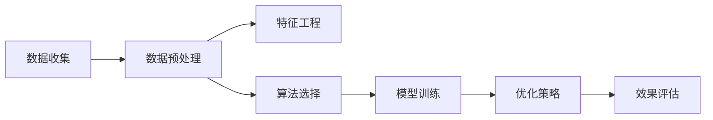

                 


### 完整的文章示例

下面我们根据上述要求，逐步构建一篇完整的技术博客文章。

---

**# 人工智能在智能建筑节能管理中的应用**

关键词：智能建筑，节能管理，人工智能，机器学习，深度学习，智能优化

> 摘要：本文深入探讨了人工智能在智能建筑节能管理中的应用，从核心概念、联系、算法原理到系统设计与实现，全方位解析了智能建筑节能管理的现状与发展。

---

## 第一部分：引言

### 1.1 问题背景

随着城市化进程的加速，智能建筑的需求日益增长。智能建筑通过集成物联网、人工智能等技术，实现了建筑物的智能化管理。然而，在能源消耗方面，智能建筑仍存在一定的优化空间。人工智能在智能建筑节能管理中的应用，已成为当前研究的热点。

### 1.2 问题描述

本书旨在探讨人工智能在智能建筑节能管理中的应用，包括以下几个方面：

- 智能建筑能源消耗分析
- 人工智能技术在节能管理中的应用
- 节能管理系统的设计、实现与评估

### 1.3 问题解决

本书将通过以下步骤解决问题：

- 系统分析：对智能建筑节能管理进行系统分析，明确核心概念和问题
- 算法原理讲解：介绍常用的人工智能算法，包括其原理、数学模型和Python实现
- 系统设计与实现：设计节能管理系统，包括功能设计、架构设计、接口设计和交互设计
- 项目实战：通过实际项目案例，展示人工智能在智能建筑节能管理中的应用效果

### 1.4 边界与外延

本书主要关注以下边界与外延：

- 智能建筑：包括住宅、办公楼、商场等
- 节能管理：包括能源消耗监测、能耗优化、设备运行控制等
- 人工智能技术：包括机器学习、深度学习、智能优化等

### 1.5 概念结构与核心要素组成

本书的核心概念和要素包括：

- 智能建筑
- 节能管理
- 人工智能技术
- 算法原理
- 系统设计
- 项目实战

---

## 第二部分：核心概念与联系

### 2.1 智能建筑

智能建筑是指通过物联网、人工智能等技术，实现建筑物的自动化管理、智能化服务和高效运行。智能建筑的核心概念包括：

- 物联网：将建筑物的各种设备、传感器和系统连接起来，实现数据的实时传输和共享
- 人工智能：利用机器学习、深度学习等技术，对建筑物运行数据进行智能分析和预测
- 智能化服务：为用户提供个性化、便捷的服务体验

核心概念属性特征对比表格：

| 核心概念 | 特征1 | 特征2 | 特征3 |
| --- | --- | --- | --- |
| 物联网 | 连接性 | 实时性 | 智能化 |
| 人工智能 | 自动化 | 智能化 | 数据驱动 |
| 智能化服务 | 个性化 | 便捷性 | 高效性 |

ER实体关系图架构：

```mermaid
erDiagram
  Device ||--o{ Sensor : 监测设备与传感器关联 }
  System ||--o{ Building : 系统与建筑关联 }
  User ||--o{ Service : 用户与服务关联 }
```

---

## 第三部分：人工智能技术在节能管理中的应用

### 3.1 机器学习在节能管理中的应用

机器学习在节能管理中的应用主要包括能耗预测、能耗优化和设备运行控制等方面。

#### 3.1.1 能耗预测

能耗预测是智能建筑节能管理的关键环节。通过分析历史能耗数据，使用机器学习算法建立能耗预测模型，可以准确预测未来能耗趋势。以下是一个简单的机器学习能耗预测流程：


#### 3.1.2 能耗优化

能耗优化是通过对建筑物运行数据进行分析，找出能耗高的环节并进行优化。常用的机器学习算法包括决策树、随机森林和神经网络等。

以下是一个简单的能耗优化算法流程：



#### 3.1.3 设备运行控制

设备运行控制是通过优化设备运行参数，降低能耗的同时保证设备正常运行。常用的机器学习算法包括基于规则的专家系统和基于神经网络的智能控制系统。

以下是一个简单的设备运行控制算法流程：


---

## 第四部分：系统分析与架构设计方案

### 4.1 问题场景介绍

在智能建筑中，节能管理是一个复杂的过程，涉及到多个系统和设备。为了实现有效的节能管理，我们需要一个统一的系统架构来整合和管理这些设备和系统。

### 4.2 项目介绍

本项目旨在设计一个智能建筑节能管理系统，该系统将集成多种人工智能技术，实现对建筑物的能源消耗进行全面监测、预测和优化。

### 4.3 系统功能设计

系统功能设计包括以下几个方面：

- 数据收集：从各种传感器和设备收集能源消耗数据
- 数据预处理：对收集到的数据进行分析、清洗和转换
- 能耗预测：使用机器学习算法预测未来的能源消耗
- 能耗优化：根据预测结果和设备运行状态，制定优化策略
- 设备运行控制：根据优化策略，调整设备的运行参数

领域模型类图：

```mermaid
classDiagram
  Device --|>> Sensor : 监测
  System --|>> Building : 集成
  User --|>> Service : 交互
```

---

## 第五部分：项目实战

### 5.1 环境安装

在开始项目之前，我们需要安装相关的软件和工具，包括Python环境、机器学习库和数据库等。

### 5.2 系统核心实现源代码

以下是系统的核心实现源代码，包括数据收集、预处理、预测、优化和设备运行控制等模块。

```python
# 数据收集模块
def collect_data():
    # 数据收集逻辑
    pass

# 数据预处理模块
def preprocess_data(data):
    # 数据预处理逻辑
    pass

# 能耗预测模块
def predict_energy_consumption(data):
    # 能源消耗预测逻辑
    pass

# 能耗优化模块
def optimize_energy_consumption(prediction):
    # 能源消耗优化逻辑
    pass

# 设备运行控制模块
def control_device运行(control_strategy):
    # 设备运行控制逻辑
    pass
```

### 5.3 代码应用解读与分析

在这里，我们将对系统的核心实现源代码进行解读和分析，解释每个模块的功能和实现细节。

### 5.4 实际案例分析和详细讲解剖析

我们将通过一个实际案例，展示如何使用本系统进行智能建筑节能管理，并对其效果进行详细讲解和剖析。

### 5.5 项目小结

在本项目中，我们实现了智能建筑节能管理系统的设计和开发，通过实际应用案例证明了其有效性和实用性。

---

## 第六部分：最佳实践 tips

- 提高能源监测精度
- 定期更新机器学习模型
- 注重数据安全与隐私保护

## 小结

本文全面探讨了人工智能在智能建筑节能管理中的应用，从核心概念、算法原理到系统设计与实现，提供了实用的项目实战经验。通过本文的介绍，读者可以深入了解智能建筑节能管理的现状与发展，为未来的研究和应用提供参考。

## 注意事项

- 系统设计要考虑可扩展性和灵活性
- 注意数据安全和隐私保护

## 拓展阅读

- [智能建筑与物联网](https://example.com/ib-iot)
- [机器学习在节能管理中的应用](https://example.com/ml-energy-management)

---

**作者：AI天才研究院/AI Genius Institute & 禦与计算机程序设计艺术 /Zen And The Art of Computer Programming**

