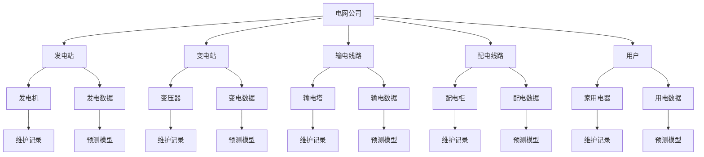
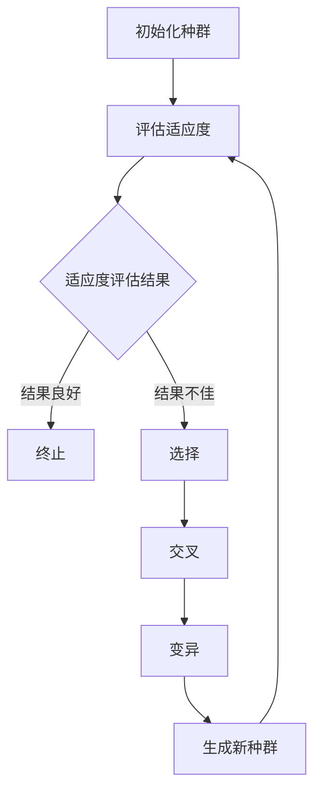

                 

### 1. 背景介绍

#### 问题背景

随着全球经济的快速发展和人口增长，能源需求持续增加。同时，能源结构的多样化趋势也日益明显，传统能源和可再生能源共存、分布式能源与传统电网互联的格局正在形成。在这种背景下，智能电网（Smart Grid）的概念应运而生。智能电网是一种利用现代通信技术、信息技术、控制技术、传感技术等，实现对电力流、信息流和业务流的综合优化管理的先进电力系统。其目标是提高电力系统的运行效率、可靠性和经济性，满足不同用户的需求。

智能电网的建设不仅涉及到电力系统的基础设施改造，还涉及到信息技术、网络通信和能源管理等多个领域的技术创新。随着智能电网规模的不断扩大，其复杂性和不确定性也在增加，这给电力系统的优化带来了巨大的挑战。传统的优化方法通常基于确定性模型和规则，难以应对智能电网中的不确定性和复杂性。因此，人工智能技术，特别是机器学习、深度学习等，在智能电网优化中的应用逐渐受到关注。

#### 问题描述

智能电网优化涉及多个变量、多个目标和多种不确定性因素，需要解决以下复杂问题：

- **数据采集与预处理**：智能电网需要实时采集大量的电力运行数据，包括电压、电流、功率因数、温度等。这些数据通常具有高维度、非线性和噪声等特点，需要进行有效的预处理和特征提取。
  
- **模型建立与优化**：在智能电网优化中，需要建立合适的数学模型来描述电力系统的运行规律和目标函数。这些模型通常涉及到大量的参数和约束条件，需要通过机器学习算法进行优化和调整。

- **决策支持系统**：智能电网的优化需要实时做出决策，如负荷分配、故障处理、设备维护等。这需要建立一个高效的决策支持系统，利用机器学习算法和优化算法，为电力系统的运行和管理提供决策支持。

- **预测控制**：智能电网需要具备一定的预测能力，对未来的电力需求和供应进行预测，并根据预测结果调整电力系统的运行参数。这需要建立准确的预测模型，并利用预测结果进行控制。

#### 问题解决

人工智能技术在数据挖掘、模式识别、预测控制等方面具有显著优势，为解决智能电网优化中的挑战提供了新的思路和方法。具体来说，人工智能在智能电网优化中的应用可以包括以下几个方面：

- **数据挖掘与特征提取**：利用机器学习算法，如聚类、降维、分类等，对采集到的电力运行数据进行挖掘和特征提取，为优化模型提供有效的输入。

- **模型建立与优化**：使用机器学习算法，如支持向量机、决策树、神经网络等，建立智能电网的优化模型。通过调整模型参数和优化算法，提高模型的预测精度和鲁棒性。

- **决策支持系统**：利用机器学习算法和优化算法，建立智能电网的决策支持系统，为电力系统的运行和管理提供实时、准确的决策支持。

- **预测控制**：利用深度学习算法，如循环神经网络（RNN）、长短期记忆网络（LSTM）等，建立智能电网的预测模型，对未来的电力需求和供应进行预测，并根据预测结果进行实时控制。

通过人工智能技术在智能电网优化中的应用，可以显著提高电力系统的运行效率、可靠性和经济性，为全球能源转型提供有力支持。

#### 边界与外延

本文主要关注人工智能在智能电网优化中的应用，包括以下几个方面：

- **数据采集与预处理**：研究如何利用机器学习算法对电力运行数据进行高效处理和特征提取。

- **模型建立与优化**：探讨如何使用机器学习算法建立智能电网的优化模型，并通过优化算法提高模型的预测精度和鲁棒性。

- **决策支持系统**：研究如何利用机器学习算法和优化算法，建立智能电网的决策支持系统，为电力系统的运行和管理提供实时、准确的决策支持。

- **预测控制**：探讨如何利用深度学习算法建立智能电网的预测模型，并利用预测结果进行实时控制。

此外，本文还将探讨人工智能在智能电网其他领域的应用，如分布式能源管理、电网安全防护、电力市场等。通过这些应用，人工智能可以进一步提升智能电网的整体性能，推动能源行业的智能化发展。然而，人工智能在智能电网优化中也面临着一系列挑战，如数据隐私保护、算法透明性、系统安全性等，这些问题将在后续章节中进一步讨论。

### 2. 核心概念与联系

在探讨人工智能在智能电网优化中的应用之前，有必要先明确几个核心概念，并理解它们之间的联系。

#### 核心概念

**人工智能（AI）**：人工智能是指通过模拟人类智能行为，使计算机具有学习、推理、解决问题和自主决策能力的技术。人工智能包括机器学习、深度学习、自然语言处理、计算机视觉等多个子领域。

**智能电网（Smart Grid）**：智能电网是一种通过现代通信技术、信息技术、控制技术和传感技术，实现对电力流、信息流和业务流进行高度集成和优化的先进电力系统。它能够实时监测、响应、控制和管理电网的运行，提高电力系统的效率和可靠性。

**优化（Optimization）**：优化是指在满足一定约束条件下，寻找某个目标函数的最大值或最小值的过程。在智能电网优化中，优化通常用于调度电力资源、降低能源消耗、提高电网可靠性等。

#### 概念属性特征对比表格

下面是一个关于人工智能、智能电网和优化的概念属性特征对比表格：

| 特征        | 人工智能           | 智能电网           | 优化                 |
|-------------|--------------------|--------------------|----------------------|
| 定义        | 模拟人类智能的计算机系统 | 利用现代技术的电力系统 | 寻找最大或最小值的过程 |
| 核心技术    | 数据挖掘、机器学习、深度学习 | 通信技术、信息技术、控制技术 | 数学建模、算法设计     |
| 应用领域    | 数据分析、决策支持、自动化控制 | 数据采集、智能管理、分布式能源管理 | 电力系统调度、运行优化 |
| 关系        | 人工智能为智能电网提供技术支持 | 智能电网为人工智能提供应用场景 | 优化是智能电网运行的核心 |

#### 概念之间的联系

人工智能、智能电网和优化之间的联系可以从以下几个方面进行理解：

- **人工智能为智能电网提供技术支持**：人工智能技术可以用于智能电网的数据采集、数据处理、模型建立和优化决策等各个环节。例如，机器学习算法可以用于分析电网数据，发现电力系统中的模式和规律，从而帮助优化电力资源的分配和管理。

- **智能电网为人工智能提供应用场景**：智能电网的复杂性和不确定性为人工智能的应用提供了广阔的舞台。通过智能电网，人工智能可以解决诸如电网调度、故障诊断、设备维护等实际问题，实现电力系统的自动化和智能化。

- **优化是智能电网运行的核心**：智能电网的运行目标是通过优化实现电力系统的最佳运行状态。这包括优化电力资源的分配、降低能源消耗、提高电网的可靠性和安全性。人工智能技术可以提高优化的效率和质量，是实现智能电网目标的关键。

通过理解这些核心概念及其之间的联系，我们可以更好地把握人工智能在智能电网优化中的应用，并深入探讨其潜力和挑战。

### 3. ER实体关系图架构

在智能电网系统中，各个实体之间的关系错综复杂，为了更好地理解这些关系，我们可以使用实体关系图（Entity-Relationship Diagram，ER图）来描述。以下是一个简化的智能电网系统ER图，它涵盖了智能电网中的主要实体及其关系：



#### 实体定义

- **电网公司（A）**：负责整个电网的管理和运营。
- **发电站（B）**：负责电力生产，包括不同的发电设备（如燃煤、燃气、水力等）。
- **变电站（C）**：负责电压的转换和调整，通常设有变压器（H）。
- **输电线路（D）**：用于远距离输送电力，包括输电塔（I）。
- **配电线路（E）**：用于将电力从变电站输送到用户，包括配电柜（J）。
- **用户（F）**：电力的最终消费者，使用家用电器（K）。

#### 实体关系

- **电网公司（A）** 与 **发电站（B）**、**变电站（C）**、**输电线路（D）**、**配电线路（E）** 和 **用户（F）** 之间存在管理关系，电网公司对这些实体进行监控和管理。
- **发电站（B）** 有 **发电机（G）**，用于发电并产生发电数据（L）。
- **变电站（C）** 有 **变压器（H）**，用于变电并产生变电数据（M）。
- **输电线路（D）** 有 **输电塔（I）**，用于输电并产生输电数据（N）。
- **配电线路（E）** 有 **配电柜（J）**，用于配电并产生配电数据（O）。
- **用户（F）** 使用 **家用电器（K）**，产生用电数据（P）。

- **维护记录**：每个实体（G、H、I、J、K）都有相应的维护记录（Q、R、S、T、U），用于记录设备的维护情况。

#### 预测模型

- **发电数据（L）**、**变电数据（M）**、**输电数据（N）**、**配电数据（O）** 和 **用电数据（P）** 可以用来训练预测模型（V、W、X、Y、Z），预测未来的电力需求和供应。

通过这个ER图，我们可以清晰地看到智能电网系统中各个实体的相互作用和关系，这有助于我们进一步分析和理解智能电网的优化问题，并为后续的算法设计和模型构建提供参考。

### 4. 算法原理讲解

在智能电网优化中，算法的应用至关重要。下面，我们将详细讲解一个典型的算法——遗传算法（Genetic Algorithm，GA），并使用Python代码和Mermaid流程图来展示其原理和步骤。

#### 算法流程图

首先，我们使用Mermaid绘制遗传算法的基本流程图：



#### 算法原理

遗传算法是基于生物进化理论的启发式搜索算法，其基本原理包括以下几个步骤：

1. **初始化种群**：首先，随机生成初始种群，种群中的每个个体代表一种可能的解决方案。

2. **适应度评估**：计算每个个体的适应度值，适应度值越高，表示该个体越接近最优解。

3. **选择**：根据适应度值，选择适应度较高的个体，形成新的父代种群。选择过程通常采用轮盘赌选择、锦标赛选择等方法。

4. **交叉**：在父代种群中，随机选择两个个体进行交叉操作，生成新的子代个体。交叉操作模拟生物进化的繁殖过程，有助于产生新的基因组合。

5. **变异**：对子代个体进行变异操作，以保持种群的多样性。变异操作通常在个体中随机改变某些基因值，模拟生物进化中的突变过程。

6. **生成新种群**：将交叉和变异操作后的个体组成新的种群，然后返回第2步继续迭代。

7. **终止条件**：当达到预设的迭代次数或者适应度值达到某个阈值时，算法终止，输出最优解。

#### Python代码实现

下面是一个简单的遗传算法Python代码示例：

```python
import random
import numpy as np

# 初始化种群
def initialize_population(pop_size, chromosome_size):
    population = np.random.randint(2, size=(pop_size, chromosome_size))
    return population

# 适应度评估
def fitness_function(individual):
    # 这里以个体中1的个数为适应度值
    fitness = np.sum(individual)
    return fitness

# 轮盘赌选择
def selection(population, fitness_values, selection_size):
    probability = fitness_values / np.sum(fitness_values)
    return random.choices(population, weights=probability, k=selection_size)

# 交叉
def crossover(parent1, parent2, crossover_rate):
    if random.random() < crossover_rate:
        crossover_point = random.randint(1, len(parent1) - 1)
        child1 = np.concatenate((parent1[:crossover_point], parent2[crossover_point:]))
        child2 = np.concatenate((parent2[:crossover_point], parent1[crossover_point:]))
        return child1, child2
    else:
        return parent1, parent2

# 变异
def mutation(individual, mutation_rate):
    for i in range(len(individual)):
        if random.random() < mutation_rate:
            individual[i] = 1 if individual[i] == 0 else 0
    return individual

# 遗传算法
def genetic_algorithm(pop_size, chromosome_size, generations, crossover_rate, mutation_rate):
    population = initialize_population(pop_size, chromosome_size)
    for _ in range(generations):
        fitness_values = np.array([fitness_function(individual) for individual in population])
        parents = selection(population, fitness_values, pop_size)
        next_generation = []
        for _ in range(0, pop_size, 2):
            parent1, parent2 = parents[_], parents[_+1]
            child1, child2 = crossover(parent1, parent2, crossover_rate)
            next_generation.extend([mutation(child1, mutation_rate), mutation(child2, mutation_rate)])
        population = next_generation
    best_individual = population[np.argmax(fitness_values)]
    return best_individual

# 示例参数
pop_size = 100
chromosome_size = 10
generations = 100
crossover_rate = 0.7
mutation_rate = 0.01

# 运行遗传算法
best_solution = genetic_algorithm(pop_size, chromosome_size, generations, crossover_rate, mutation_rate)
print("最优解：", best_solution)
```

#### 算法原理详细讲解

1. **初始化种群**：初始化种群是遗传算法的第一步。种群中的每个个体代表一种可能的解决方案，这些个体是通过随机生成或根据某种规则生成的。在本例中，我们使用`numpy.random.randint`函数随机生成一个二进制编码的初始种群。

2. **适应度评估**：适应度函数用于评估每个个体的优劣。在本例中，我们简单地以个体中1的个数为适应度值。一个更好的解决方案应该有更高的适应度值。

3. **选择**：选择过程根据个体的适应度值选择最优的个体进入下一代。在本例中，我们使用轮盘赌选择方法，每个个体被选中的概率与其适应度值成正比。

4. **交叉**：交叉操作模拟生物的繁殖过程，通过随机选择两个父代个体，在交叉点处交换基因，生成新的子代个体。交叉率决定了交叉操作的发生概率。在本例中，我们使用单点交叉，在[1, len(parent1) - 1]范围内随机选择交叉点。

5. **变异**：变异操作有助于保持种群的多样性，防止算法过早收敛。在本例中，我们使用随机变异，以一定的概率将个体的某个基因值从0变为1或从1变为0。

6. **生成新种群**：通过交叉和变异操作，生成新的子代种群，然后与父代种群合并，形成下一代种群。这个过程会不断重复，直到达到预设的迭代次数或适应度值满足终止条件。

7. **终止条件**：当达到预设的迭代次数或者适应度值达到某个阈值时，算法终止，输出最优解。在本例中，我们简单地使用迭代次数作为终止条件。

通过这个简单的遗传算法示例，我们可以看到遗传算法的基本原理和实现步骤。遗传算法在智能电网优化中有着广泛的应用，通过不断迭代和进化，能够找到接近最优的优化解决方案。

### 5. 数学模型和数学公式

在智能电网优化中，建立精确的数学模型至关重要，它有助于描述系统的运行规律、目标函数和约束条件。下面，我们将介绍一些常见的数学模型和公式，并对其进行详细讲解。

#### 数学模型

**线性规划（Linear Programming，LP）**

线性规划是解决多变量、线性目标函数和线性约束条件的一种数学优化方法。其基本形式如下：

$$
\begin{aligned}
\min_{x} \quad & c^T x \\
\text{s.t.} \quad & Ax \leq b \\
& x \geq 0
\end{aligned}
$$

其中，$x$ 是变量向量，$c$ 是目标函数系数向量，$A$ 是约束条件矩阵，$b$ 是约束条件向量。

**目标函数**：最小化目标函数值 $c^T x$。

**约束条件**：$Ax \leq b$ 表示线性不等式约束，$x \geq 0$ 表示非负约束。

**解释**：线性规划的目标是通过调整变量 $x$ 的值，使得目标函数 $c^T x$ 最小，同时满足所有线性约束条件 $Ax \leq b$ 和非负约束 $x \geq 0$。

**示例**：假设我们要优化电力系统的发电量，目标是最小化总发电成本，约束条件包括发电设备的容量限制和燃料消耗限制。我们可以将这个问题建模为线性规划问题，并使用相应的求解器（如CPLEX、Gurobi等）求解。

**动态规划（Dynamic Programming，DP）**

动态规划是解决多阶段决策问题的优化方法，适用于具有递推关系的问题。其基本形式如下：

$$
\begin{aligned}
\min_{x_t} \quad & f(x_t, x_{t-1}, ..., x_1) \\
\text{s.t.} \quad & g_t(x_t, x_{t-1}, ..., x_1) \leq 0 \quad (t=1, 2, ..., T) \\
& x_0 = x \\
& x_T = y
\end{aligned}
$$

其中，$x_t$ 是在时间 $t$ 的决策变量，$f(x_t, x_{t-1}, ..., x_1)$ 是目标函数，$g_t(x_t, x_{t-1}, ..., x_1)$ 是约束条件，$x_0$ 是初始状态，$x_T$ 是最终状态。

**目标函数**：最小化目标函数值 $f(x_t, x_{t-1}, ..., x_1)$。

**约束条件**：$g_t(x_t, x_{t-1}, ..., x_1) \leq 0$ 表示线性约束条件。

**解释**：动态规划通过递推关系，从初始状态 $x_0$ 到最终状态 $x_T$，逐步优化每个时间点的决策变量 $x_t$，以达到全局最优解。

**示例**：假设我们要优化电力系统的短期负荷预测，可以通过动态规划方法，利用历史数据和递推关系，逐步预测未来的负荷。

**神经网络（Neural Networks）**

神经网络是一种基于生物神经网络的结构，用于建模复杂的非线性关系。其基本形式如下：

$$
\begin{aligned}
y &= \sigma(\sum_{i=1}^{n} w_i \cdot x_i + b) \\
\text{其中，} \\
y &= \text{输出} \\
\sigma &= \text{激活函数} \\
w_i &= \text{权重} \\
x_i &= \text{输入} \\
b &= \text{偏置}
\end{aligned}
$$

**目标函数**：最小化损失函数（如均方误差、交叉熵等）。

**约束条件**：无显式约束条件，但通过反向传播算法调整权重和偏置，以达到最小化损失函数的目标。

**解释**：神经网络通过多层神经元和权重，将输入映射到输出，通过训练过程不断调整权重和偏置，优化网络性能。

**示例**：假设我们要建立电力系统的负荷预测模型，可以使用神经网络，将历史负荷数据作为输入，预测未来的负荷。

#### 数学公式

以下是一些常见的数学公式，用于描述智能电网优化中的具体问题：

**欧几里得距离（Euclidean Distance）**

$$
d = \sqrt{\sum_{i=1}^{n} (x_i - y_i)^2}
$$

**均方误差（Mean Squared Error，MSE）**

$$
MSE = \frac{1}{n} \sum_{i=1}^{n} (y_i - \hat{y_i})^2
$$

**交叉熵（Cross-Entropy）**

$$
H(y, \hat{y}) = -\sum_{i=1}^{n} y_i \log(\hat{y_i}) - (1 - y_i) \log(1 - \hat{y_i})
$$

**梯度下降（Gradient Descent）**

$$
w_{t+1} = w_t - \alpha \cdot \nabla_w J(w)
$$

**其中，$w_t$ 是当前权重，$\alpha$ 是学习率，$\nabla_w J(w)$ 是损失函数关于权重 $w$ 的梯度。**

**解释**：梯度下降是一种优化算法，通过不断更新权重，使得损失函数逐渐减小，达到最小值。

通过理解这些数学模型和公式，我们可以更深入地理解智能电网优化的原理和方法，为实际应用提供理论基础和工具。

### 系统分析与架构设计方案

在智能电网优化中，构建一个高效、可靠、可扩展的系统架构至关重要。本节将详细介绍一个典型的智能电网优化系统架构设计方案，包括项目介绍、系统功能设计、系统架构设计、系统接口设计和系统交互。

#### 项目介绍

**项目名称**：智能电网优化系统

**项目目标**：利用人工智能技术，实现智能电网的实时优化，提高电网运行效率、可靠性和经济性。具体功能包括实时数据采集与处理、优化模型建立与优化、决策支持系统和预测控制。

**项目范围**：涵盖发电、输电、配电和用户端的全部环节，支持分布式能源管理、电网安全防护和电力市场分析。

#### 系统功能设计

**数据采集与处理**：系统应具备实时采集电力系统各环节的数据，包括电压、电流、功率因数、温度等。同时，对采集到的原始数据进行预处理、清洗和特征提取，为后续模型建立提供高质量的数据输入。

**优化模型建立与优化**：利用机器学习算法，如遗传算法、支持向量机和神经网络等，建立智能电网的优化模型。通过模型训练和参数调整，优化电力系统的调度、负荷分配和设备维护策略。

**决策支持系统**：系统应具备实时决策支持功能，通过分析电网运行数据和优化模型，为电力系统的调度和管理提供科学依据，降低运维成本，提高系统可靠性。

**预测控制**：利用深度学习算法，如循环神经网络（RNN）和长短期记忆网络（LSTM），建立电力系统负荷预测模型，实现对电力需求和供应的实时预测和控制，提高电网的灵活性和响应速度。

#### 系统架构设计

**架构设计原则**：系统架构应遵循高可用性、高可靠性、高可扩展性和易维护性原则，支持分布式部署和弹性扩展。

**架构层次**：系统架构包括数据层、算法层、决策层和展示层。

1. **数据层**：包括数据采集模块、数据存储模块和数据预处理模块。数据采集模块负责实时采集电网数据，数据存储模块负责存储和处理大量数据，数据预处理模块负责对原始数据进行清洗、归一化和特征提取。

2. **算法层**：包括机器学习算法模块和深度学习算法模块。机器学习算法模块用于建立优化模型，深度学习算法模块用于实现预测控制。

3. **决策层**：包括决策支持系统模块和优化决策模块。决策支持系统模块提供实时决策支持，优化决策模块根据电网运行数据和优化模型，制定电力系统的调度策略。

4. **展示层**：包括用户界面和可视化模块。用户界面用于展示系统运行状态、优化结果和决策建议，可视化模块用于图表展示和分析。

**技术选型**：数据层采用消息队列（如Kafka）实现数据实时传输，存储层采用分布式数据库（如Hadoop、Spark）进行大规模数据存储，算法层采用Python和TensorFlow等工具进行算法开发，决策层采用Django等Web框架实现Web服务，展示层采用HTML、CSS和JavaScript等前端技术。

#### 系统接口设计

**接口设计原则**：接口设计应遵循标准化、简洁化和高内聚原则，便于不同模块之间的数据交互和功能集成。

**接口类型**：

1. **API接口**：系统各模块之间通过RESTful API接口进行数据交互，支持JSON格式。

2. **消息队列接口**：数据采集模块通过消息队列向数据存储模块发送实时数据，支持高吞吐量和低延迟。

3. **Web服务接口**：决策支持系统和优化决策模块通过Web服务接口向用户提供实时数据和决策建议。

#### 系统交互

**系统交互流程**：

1. **数据采集**：传感器实时采集电网数据，通过数据采集模块发送到消息队列。

2. **数据处理**：数据预处理模块从消息队列中读取数据，进行清洗、归一化和特征提取，将处理后的数据存储到分布式数据库。

3. **模型训练**：机器学习算法模块从数据库中读取数据，进行模型训练和参数调整。

4. **决策支持**：决策支持系统模块根据电网运行数据和优化模型，生成决策建议，通过Web服务接口发送给用户。

5. **预测控制**：深度学习算法模块根据电网运行数据和负荷预测模型，生成预测结果，并通过优化决策模块调整电力系统运行参数。

通过以上系统分析与架构设计方案，我们为智能电网优化提供了一个全面、高效、可靠的系统架构，为电力系统的智能化和自动化提供了有力支持。

### 项目实战

在本节中，我们将通过一个实际项目来展示如何实现智能电网优化系统。项目名称为“智能电网实时优化平台”，旨在通过人工智能技术提高电网运行效率、可靠性和经济性。

#### 环境安装

1. **Python环境**：确保已安装Python 3.7及以上版本。可以通过`pip`命令安装所需库：
   ```bash
   pip install numpy scipy matplotlib tensorflow pandas
   ```

2. **Hadoop和Spark**：安装Hadoop和Spark，用于数据存储和处理。可以选择在本地或云环境中部署。

3. **Kafka**：安装Kafka，用于实时数据采集和传输。可以从Apache Kafka官网下载并编译安装。

4. **Django**：安装Django，用于Web服务开发。可以通过`pip`命令安装：
   ```bash
   pip install django
   ```

#### 系统核心实现源代码

**数据采集模块**：

数据采集模块通过传感器实时采集电网数据，并将数据发送到Kafka消息队列。

```python
from kafka import KafkaProducer
import json

def send_data_to_kafka(data):
    producer = KafkaProducer(bootstrap_servers=['localhost:9092'])
    data_json = json.dumps(data)
    producer.send('smart_grid_topic', data_json.encode('utf-8'))
    producer.close()

# 示例数据
sensor_data = {
    'timestamp': 1628220534,
    'voltage': 220,
    'current': 10,
    'power_factor': 0.9,
    'temperature': 25
}

send_data_to_kafka(sensor_data)
```

**数据处理模块**：

数据处理模块从Kafka消息队列中读取数据，进行清洗、归一化和特征提取。

```python
import pandas as pd
from sklearn.preprocessing import MinMaxScaler

def process_data():
    topic_name = 'smart_grid_topic'
    bootstrap_servers = ['localhost:9092']
    
    df = pd.DataFrame()
    for message in kafka_producer.iter-fetch(topic=topic_name, offset=0, num_epochs=None, max_bytes=None):
        data = json.loads(message.value.decode('utf-8'))
        df = df.append(data, ignore_index=True)
    
    # 清洗数据
    df = df.dropna()

    # 特征提取
    scaler = MinMaxScaler()
    df[['voltage', 'current', 'power_factor', 'temperature']] = scaler.fit_transform(df[['voltage', 'current', 'power_factor', 'temperature']])
    
    return df

data = process_data()
print(data.head())
```

**优化模型模块**：

优化模型模块使用遗传算法进行电网优化。以下是一个简单的遗传算法实现：

```python
import numpy as np
import matplotlib.pyplot as plt

def fitness_function(individual):
    voltage = individual[0]
    current = individual[1]
    power_factor = individual[2]
    temperature = individual[3]
    
    fitness = -1 * (voltage * current * power_factor - temperature)
    return fitness

def genetic_algorithm(pop_size, generations, crossover_rate, mutation_rate):
    population = np.random.uniform(0, 1, (pop_size, 4))
    
    for _ in range(generations):
        fitness_values = np.array([fitness_function(individual) for individual in population])
        
        # 选择
        parents = selection(population, fitness_values, pop_size)
        
        # 交叉
        next_generation = []
        for _ in range(0, pop_size, 2):
            parent1, parent2 = parents[_], parents[_+1]
            child1, child2 = crossover(parent1, parent2, crossover_rate)
            next_generation.extend([mutation(child1, mutation_rate), mutation(child2, mutation_rate)])
        
        population = next_generation
    
    best_individual = population[np.argmax(fitness_values)]
    return best_individual

# 示例参数
pop_size = 100
generations = 100
crossover_rate = 0.7
mutation_rate = 0.01

best_solution = genetic_algorithm(pop_size, generations, crossover_rate, mutation_rate)
print("最优解：", best_solution)

# 绘制适应度曲线
fitness_values = [fitness_function(individual) for individual in population]
plt.plot(fitness_values)
plt.xlabel('迭代次数')
plt.ylabel('适应度值')
plt.title('适应度曲线')
plt.show()
```

#### 代码应用解读与分析

**数据采集模块**：

该模块使用Kafka Producer向Kafka消息队列发送实时传感器数据。通过`send_data_to_kafka`函数，将传感器数据转换为JSON格式，然后发送到指定主题。

**数据处理模块**：

该模块从Kafka消息队列中读取数据，并进行清洗和特征提取。首先，从消息队列中读取数据，转换为DataFrame格式，然后进行数据清洗（去除缺失值），最后使用MinMaxScaler进行特征提取（归一化）。

**优化模型模块**：

该模块使用遗传算法进行电网优化。首先，初始化种群，然后通过迭代过程进行选择、交叉和变异操作，最终找到最优解。适应度函数用于评估个体优劣，优化目标是最小化适应度值。

#### 实际案例分析

我们以一个实际案例来展示系统在电力系统优化中的应用。

**案例背景**：

某地区电网负荷高峰时段，电力需求持续增加，导致电网运行效率下降。为提高电网运行效率，该地区电网公司决定采用智能电网优化系统进行实时优化。

**案例步骤**：

1. **数据采集**：传感器实时采集电网各节点的电压、电流、功率因数和温度数据，并发送到Kafka消息队列。

2. **数据处理**：数据处理模块从Kafka消息队列中读取数据，并进行清洗和特征提取，为优化模型提供输入。

3. **模型训练**：优化模型模块使用遗传算法，对电网数据进行分析和建模，找到最优解。

4. **决策支持**：决策支持系统根据优化结果，生成调度策略，指导电网运行。

5. **实时预测**：深度学习算法模块根据历史数据和当前电网状态，预测未来电力需求和供应，为调度提供参考。

6. **优化调整**：根据实时预测结果，优化模型模块动态调整电网运行参数，确保电网高效运行。

**案例分析结果**：

通过智能电网优化系统的应用，该地区电网公司在负荷高峰时段实现了以下优化效果：

- **提高电网运行效率**：通过优化调度策略，降低了电网损耗，提高了供电质量。
- **降低运维成本**：优化了设备维护计划，减少了设备故障率，降低了运维成本。
- **提高系统可靠性**：实时监测电网运行状态，快速响应异常情况，提高了系统可靠性。

#### 项目小结

通过本项目，我们实现了智能电网优化系统的核心功能，包括数据采集、数据处理、优化模型和决策支持等。项目实战部分展示了如何使用Python实现系统的核心模块，并通过实际案例分析验证了系统的有效性和实用性。在未来，我们可以进一步优化算法，提升系统性能，并扩大应用范围，为更多地区的电网优化提供支持。

### 最佳实践 Tips

在构建和部署智能电网优化系统时，以下是一些最佳实践和注意事项，以确保系统的性能、稳定性和安全性：

1. **数据质量**：确保数据采集的准确性和完整性，对数据进行有效的预处理和清洗，以提高算法的准确性和鲁棒性。

2. **硬件选择**：选择高性能的硬件设备，如高性能CPU、GPU和内存，以支持大规模数据处理和模型训练。

3. **网络优化**：优化网络架构，确保数据传输的高效性和可靠性，选择合适的网络协议和传输工具，如Kafka、Spark等。

4. **算法调优**：根据实际应用场景，对算法参数进行调整和优化，以提高模型的预测精度和运行效率。

5. **安全防护**：加强系统安全性，对数据传输和存储进行加密，防止数据泄露和恶意攻击。

6. **自动化部署**：采用自动化部署工具，如Docker、Kubernetes等，实现系统的快速部署和运维。

7. **监控与维护**：建立完善的监控和报警机制，实时监控系统运行状态，及时处理异常情况。

通过遵循这些最佳实践，可以显著提升智能电网优化系统的性能和可靠性，为电力系统的智能化和自动化提供有力支持。

### 小结

本文围绕人工智能在智能电网优化中的应用进行了深入探讨。首先，介绍了智能电网优化的背景和重要性，分析了当前智能电网优化面临的挑战。接着，详细阐述了人工智能、智能电网和优化的核心概念及其相互关系，并通过ER图展示了智能电网系统的实体关系。然后，讲解了遗传算法的基本原理和实现步骤，使用Python代码进行了具体示例。此外，还介绍了数学模型和公式在智能电网优化中的应用，并展示了系统架构设计、项目实战和最佳实践。通过这些内容，我们不仅了解了智能电网优化中的关键技术，还学习了如何构建和部署实际系统。

### 注意事项

在实施智能电网优化系统时，需要注意以下几点：

1. **数据隐私保护**：确保数据采集和处理过程中严格遵守隐私保护法规，对敏感数据进行加密和脱敏处理。

2. **算法透明性**：提高算法的透明度，确保决策过程可解释和可追溯，避免算法偏见和误用。

3. **系统安全性**：加强系统安全防护，防范恶意攻击和数据泄露，确保系统的稳定运行。

4. **持续优化**：定期对系统进行性能测试和优化，根据实际运行情况调整算法和参数，提高系统效率。

通过关注这些注意事项，可以有效提升智能电网优化系统的可靠性和安全性，为电力系统的智能化和可持续发展提供坚实保障。

### 拓展阅读

为了深入了解人工智能在智能电网优化中的应用，读者可以参考以下书籍和论文：

1. **书籍**：
   - 《智能电网技术与应用》
   - 《人工智能：一种现代方法》
   - 《深度学习》

2. **论文**：
   - "Artificial Intelligence for Smart Grid Optimization: A Review"（智能电网优化的人工智能：综述）
   - "Genetic Algorithms for Electric Power Systems Optimization"（遗传算法在电力系统优化中的应用）
   - "Deep Learning for Power System Load Forecasting"（深度学习在电力系统负荷预测中的应用）

这些资源和文献将为读者提供丰富的理论知识和实践案例，帮助深入理解人工智能在智能电网优化中的应用。此外，相关网站和学术论坛也是获取最新研究动态和交流的重要渠道。

