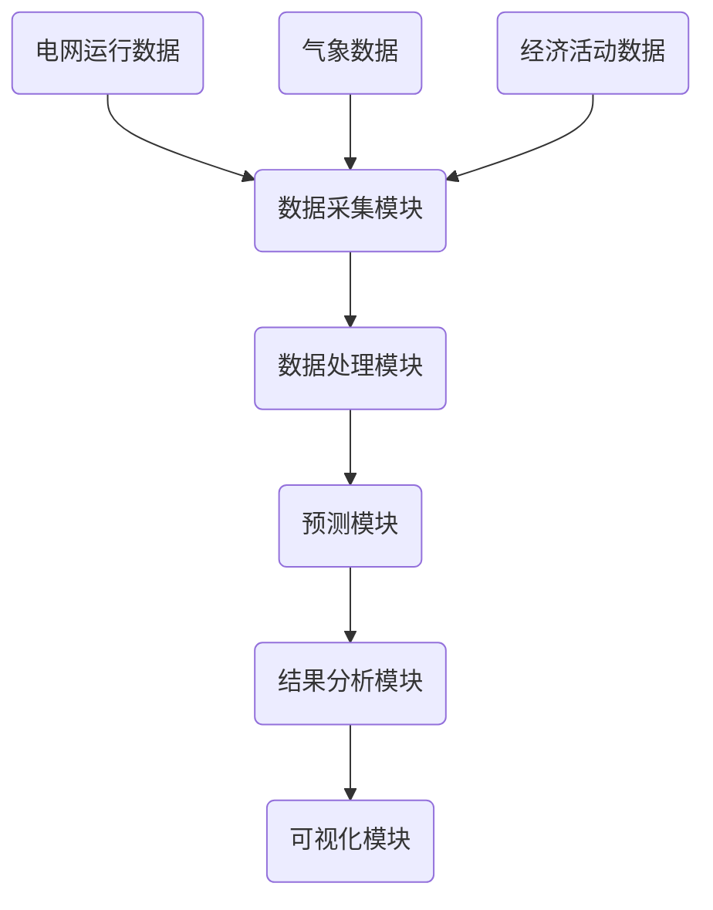
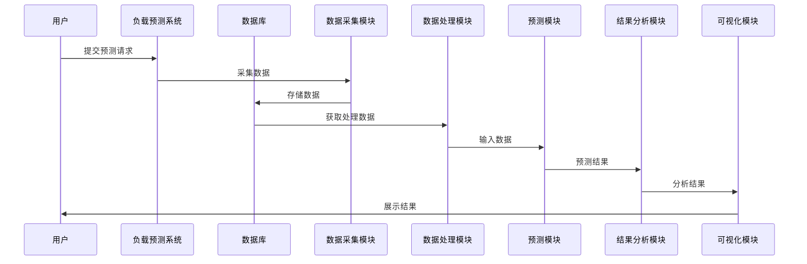

                 

# 人工智能在智能电网负载预测中的应用

## 关键词

- 智能电网
- 负载预测
- 人工智能
- 机器学习
- 深度学习
- 系统架构
- 项目实战

## 摘要

随着能源需求的不断增长和可再生能源的广泛应用，智能电网的建设显得尤为重要。智能电网中的负载预测对于保障电网稳定运行、提高能源利用效率具有重要意义。本文将探讨人工智能，特别是机器学习和深度学习在智能电网负载预测中的应用，通过详细的分析和实例讲解，展示如何利用这些先进技术构建高效、可靠的负载预测系统。

### 目录大纲设计思路

在设计《人工智能在智能电网负载预测中的应用》的目录大纲时，我们首先需要明确书的核心内容，即人工智能技术在智能电网负载预测中的应用。接下来，我们按照以下步骤进行章节设计：

1. **明确核心内容**：确定需要涵盖的主要章节，如智能电网背景、负载预测的重要性、人工智能的应用等。
2. **细化章节内容**：在每一章节中，进一步细化内容，确保包括核心概念、原理讲解、应用实例等关键部分。
3. **确保内容完整性**：保证每个章节都有详细的内容，并确保整体结构完整。
4. **简洁性与可读性**：保持目录大纲的简洁性，避免冗余内容，同时确保内容清晰、易读。
5. **格式规范**：使用markdown格式，按照1级、2级、3级目录的层级结构来组织内容。

### 目录大纲设计

以下是《人工智能在智能电网负载预测中的应用》的目录大纲：

## 第一部分: 人工智能在智能电网背景下的应用

### 第1章: 人工智能与智能电网概述

#### 1.1 人工智能的发展背景与趋势

##### 1.1.1 人工智能的定义与发展历程
##### 1.1.2 人工智能的关键技术

#### 1.2 智能电网的概念与特点

##### 1.2.1 智能电网的定义
##### 1.2.2 智能电网的关键技术

#### 1.3 人工智能与智能电网的结合

##### 1.3.1 结合背景与必要性
##### 1.3.2 结合带来的挑战与机遇

### 第2章: 智能电网负载预测的重要性

#### 2.1 负载预测的基本概念

##### 2.1.1 负载预测的定义与作用
##### 2.1.2 负载预测的常见方法

#### 2.2 负载预测在智能电网中的意义

##### 2.2.1 提高电网运行效率
##### 2.2.2 促进可再生能源利用
##### 2.2.3 降低电力系统风险

### 第3章: 人工智能在智能电网负载预测中的应用

#### 3.1 机器学习算法在负载预测中的应用

##### 3.1.1 常用机器学习算法介绍
##### 3.1.2 算法选择与优化策略

#### 3.2 深度学习在负载预测中的应用

##### 3.2.1 深度学习的基本原理
##### 3.2.2 常用深度学习模型及应用

### 第4章: 人工智能算法原理讲解

#### 4.1 算法原理概述

##### 4.1.1 机器学习算法原理
##### 4.1.2 深度学习算法原理

#### 4.2 机器学习算法原理详细讲解

##### 4.2.1 回归分析
##### 4.2.2 决策树
##### 4.2.3 支持向量机

#### 4.3 深度学习算法原理详细讲解

##### 4.3.1 卷积神经网络（CNN）
##### 4.3.2 循环神经网络（RNN）
##### 4.3.3 生成对抗网络（GAN）

### 第5章: 数学模型和数学公式讲解

#### 5.1 常见数学模型

##### 5.1.1 数据预处理
##### 5.1.2 回归模型
##### 5.1.3 类别模型

#### 5.2 数学公式讲解

##### 5.2.1 损失函数
##### 5.2.2 梯度下降法
##### 5.2.3 反向传播算法

### 第6章: 智能电网负载预测系统架构设计

#### 6.1 系统需求分析

##### 6.1.1 智能电网负载预测系统概述
##### 6.1.2 系统需求与功能

#### 6.2 系统架构设计

##### 6.2.1 系统架构图
##### 6.2.2 系统模块设计

#### 6.3 接口设计与系统交互

##### 6.3.1 接口设计
##### 6.3.2 系统交互设计

### 第7章: 项目实战

#### 7.1 环境安装与配置

##### 7.1.1 Python环境安装
##### 7.1.2 相关库与工具安装

#### 7.2 系统核心实现

##### 7.2.1 数据预处理
##### 7.2.2 模型训练与评估
##### 7.2.3 模型部署与优化

#### 7.3 实际案例分析

##### 7.3.1 案例背景
##### 7.3.2 案例分析与实施

#### 7.4 项目小结

##### 7.4.1 项目成果总结

### 设计思路

1. **章节划分**：根据智能电网负载预测的应用需求，将全书分为六大部分，分别为：概述、重要性、应用、原理讲解、数学模型和系统架构设计、项目实战。
2. **内容细化**：在每章中，详细介绍了相关背景知识、核心概念、算法原理、数学模型、系统架构设计等。
3. **实战案例**：通过实际项目案例，展示了如何将人工智能技术应用于智能电网负载预测，包括环境安装、模型训练、模型部署等。
4. **可读性**：使用markdown格式，按照清晰的层级结构组织内容，确保内容简洁、易于理解。

### 目录大纲设计的逻辑和意义

1. **逻辑性**：目录大纲按照从理论到实践、从背景到应用的逻辑顺序进行设计，使读者能够逐步理解并掌握智能电网负载预测的原理和应用。
2. **意义**：通过详细的章节结构和内容划分，帮助读者系统地学习智能电网负载预测的相关知识，提高其在实际项目中的应用能力。

### 总结

本文详细阐述了《人工智能在智能电网负载预测中的应用》的目录大纲设计思路和意义。通过明确的章节划分、详实的内容介绍和实际的案例展示，旨在为读者提供一份全面、系统的智能电网负载预测学习资料。在后续章节中，我们将深入探讨智能电网、人工智能技术及其在负载预测中的应用，为读者带来更加详细和实用的内容。让我们一起深入探讨这一领域，探索人工智能在智能电网负载预测中的无限可能。

## 第一部分: 人工智能在智能电网背景下的应用

### 第1章: 人工智能与智能电网概述

#### 1.1 人工智能的发展背景与趋势

##### 1.1.1 人工智能的定义与发展历程

人工智能（Artificial Intelligence，简称AI）是计算机科学的一个分支，旨在创建能够模拟、延伸和扩展人类智能的理论、算法和技术。人工智能的发展历程可以追溯到20世纪50年代，当时计算机科学先驱艾伦·图灵提出了图灵测试这一概念，用以判断机器是否具有人类智能。

在经历了早期的探索和实验后，人工智能在20世纪80年代和90年代经历了第一次重大突破，主要体现在专家系统和神经网络的研究与应用上。专家系统是一种模拟人类专家知识和推理能力的计算机程序，能够在特定领域内提供决策支持。而神经网络则是一种模拟生物神经系统的计算模型，通过学习大量数据，可以自动提取特征并进行分类和预测。

进入21世纪，随着计算机性能的飞速提升和大数据技术的普及，人工智能迎来了第二次快速发展。深度学习（Deep Learning）作为一种基于多层神经网络的学习方法，成为了人工智能领域的重要突破。深度学习通过模拟人脑的神经网络结构，可以自动提取数据中的高阶特征，从而在图像识别、自然语言处理、语音识别等领域取得了显著成果。

##### 1.1.2 人工智能的关键技术

人工智能的关键技术包括但不限于以下几个方面：

- **机器学习（Machine Learning）**：机器学习是一种使计算机系统能够从数据中学习并做出决策的技术。它通过构建数学模型，对大量数据进行训练，从中提取有用的信息，并利用这些信息进行预测和决策。常见的机器学习算法包括线性回归、决策树、支持向量机、神经网络等。

- **深度学习（Deep Learning）**：深度学习是机器学习的一个子领域，它利用多层神经网络对数据进行训练，能够自动提取高阶特征，从而实现复杂任务。深度学习模型包括卷积神经网络（CNN）、循环神经网络（RNN）、生成对抗网络（GAN）等。

- **自然语言处理（Natural Language Processing，NLP）**：自然语言处理是人工智能的一个分支，旨在让计算机理解和处理人类自然语言。NLP技术包括文本分类、情感分析、机器翻译、语音识别等。

- **计算机视觉（Computer Vision）**：计算机视觉是使计算机能够从图像或视频中提取有用信息的技术。它包括目标检测、图像识别、图像分割、人脸识别等任务。

- **智能机器人（Intelligent Robotics）**：智能机器人是一种结合人工智能技术和机械工程学的先进设备，能够在特定环境中执行复杂任务。智能机器人广泛应用于工业自动化、医疗辅助、家庭服务等领域。

#### 1.2 智能电网的概念与特点

智能电网（Smart Grid）是一种先进的电力系统，通过利用现代通信技术和信息技术，实现对电力系统的实时监测、智能控制和高效管理。智能电网不仅包括传统的发电、输电、变电和配电环节，还涵盖了需求响应、分布式能源接入、储能系统等新型功能。

##### 1.2.1 智能电网的定义

智能电网是一种基于信息技术、通信技术和电力电子技术的综合电力系统，通过智能设备和先进算法，实现对电力系统的全面监测、控制和优化。智能电网的目标是提高电力系统的可靠性、安全性和经济性，同时促进可再生能源的广泛利用。

##### 1.2.2 智能电网的关键技术

智能电网的关键技术包括以下几个方面：

- **传感与测量技术**：智能电网通过安装各种传感器，实时监测电力系统的运行状态，包括电压、电流、频率、温度等参数。这些数据用于系统监测、故障诊断和优化控制。

- **通信技术**：智能电网采用先进的通信技术，如光纤通信、无线通信、物联网技术等，实现电力设备和系统之间的数据传输和通信。这些通信技术确保了数据的高效、安全传输。

- **高级量测系统（AMM）**：高级量测系统是智能电网的核心组成部分，通过实时采集电力系统的运行数据，实现对电力系统的动态监测和优化控制。

- **分布式能源管理系统（DERMS）**：分布式能源管理系统用于协调和管理分布式能源的接入和运行，包括太阳能、风能、储能系统等。DERMS可以提高电力系统的灵活性和可靠性，同时促进可再生能源的利用。

- **需求响应技术**：需求响应技术是一种利用电价信号引导用户调整用电行为，以实现电力系统优化运行的技术。通过需求响应，可以减少电力系统的峰谷差，提高系统的运行效率。

- **智能电网调度与控制系统**：智能电网调度与控制系统通过实时数据分析和优化算法，实现对电力系统的调度和控制。该系统可以确保电力系统的稳定运行，同时优化资源分配。

#### 1.3 人工智能与智能电网的结合

##### 1.3.1 结合背景与必要性

人工智能与智能电网的结合源于两者在技术和应用上的互补性。智能电网的实时监测、智能控制和优化需求，为人工智能技术的应用提供了广阔的空间。同时，人工智能技术的高效数据分析和智能决策能力，为智能电网的运行和管理提供了强大的支持。

随着可再生能源的广泛应用和电力需求的不断增长，智能电网面临了许多挑战，如电力供需平衡、电力系统可靠性、能源效率提升等。人工智能技术可以有效地解决这些问题，提高电力系统的运行和管理水平。

##### 1.3.2 结合带来的挑战与机遇

人工智能与智能电网的结合带来了许多挑战和机遇：

- **挑战**：
  - **数据安全和隐私**：智能电网中的海量数据涉及用户隐私和电网安全，如何确保数据的安全传输和存储是一个重要问题。
  - **算法透明性与可靠性**：人工智能算法的复杂性和不可解释性可能导致决策过程的不透明，如何在保证算法性能的同时提高其透明性和可靠性是一个挑战。
  - **系统集成与兼容性**：智能电网中包含多种设备和技术，如何实现不同设备之间的协同工作，提高系统的集成度和兼容性是一个难题。

- **机遇**：
  - **提高电网运行效率**：人工智能技术可以实时分析电网数据，优化电力分配和调度，提高电网的运行效率。
  - **促进可再生能源利用**：人工智能技术可以帮助智能电网更好地协调可再生能源的接入和调度，提高可再生能源的利用率。
  - **降低运维成本**：通过自动化和智能化管理，人工智能技术可以减少人力成本，提高电力系统的运维效率。
  - **提升用户体验**：人工智能技术可以实时监测用户用电情况，提供个性化的用电建议，提高用户的用电体验。

#### 总结

通过本章节的介绍，我们了解了人工智能的发展背景和关键技术，以及智能电网的概念和特点。人工智能与智能电网的结合为电力系统的运行和管理带来了新的机遇和挑战。在接下来的章节中，我们将进一步探讨人工智能在智能电网负载预测中的应用，以及如何利用机器学习和深度学习技术实现高效的负载预测。

### 第2章: 智能电网负载预测的重要性

#### 2.1 负载预测的基本概念

##### 2.1.1 负载预测的定义与作用

负载预测（Load Forecasting）是指利用历史数据、气象信息、经济指标等多种因素，对电力系统未来的电力需求进行预测。负载预测在智能电网中具有重要的应用价值，主要表现在以下几个方面：

1. **保障电网安全稳定运行**：通过准确预测未来的电力需求，电力系统可以提前安排发电和输电资源，避免因供需不平衡导致的电力短缺或过剩，确保电网的安全稳定运行。
2. **优化电力调度**：负载预测可以帮助电力调度人员合理安排电力生产和输送，优化电力系统的调度策略，提高电力系统的运行效率。
3. **降低电力系统风险**：通过预测电力需求的变化趋势，可以提前发现潜在的问题和风险，采取措施进行预防，降低电力系统故障的风险。

##### 2.1.2 负载预测的常见方法

负载预测的方法可以分为传统方法和现代方法两大类：

1. **传统方法**：
   - **时间序列分析**：时间序列分析是一种基于历史数据的方法，通过分析电力需求的周期性、趋势性和季节性，对未来电力需求进行预测。
   - **回归分析**：回归分析是一种统计方法，通过建立电力需求与相关因素（如温度、湿度、经济活动等）之间的数学模型，预测未来的电力需求。

2. **现代方法**：
   - **机器学习**：机器学习通过构建数学模型，从大量历史数据中自动提取特征，对未来的电力需求进行预测。常见的机器学习方法包括线性回归、决策树、支持向量机等。
   - **深度学习**：深度学习是一种基于多层神经网络的学习方法，通过学习大量数据，可以自动提取高阶特征，实现对复杂关系的建模。常见的深度学习模型包括卷积神经网络（CNN）、循环神经网络（RNN）等。

#### 2.2 负载预测在智能电网中的意义

##### 2.2.1 提高电网运行效率

准确的负载预测可以帮助电力系统提前了解未来的电力需求，从而合理安排电力生产和输送。这样可以避免因供需不平衡导致的电力短缺或过剩，提高电网的运行效率。此外，通过预测电力需求的变化趋势，电力调度人员可以及时调整电力调度策略，优化电力系统的运行。

##### 2.2.2 促进可再生能源利用

可再生能源（如太阳能、风能）具有波动性和间歇性的特点，其发电量受天气、季节等因素的影响较大。准确的负载预测可以帮助电力系统更好地协调可再生能源的接入和调度，提高可再生能源的利用率。通过预测未来的电力需求，电力系统可以在可再生能源发电量较高时进行存储或调度，在发电量较低时进行补充，从而确保电力系统的稳定运行。

##### 2.2.3 降低电力系统风险

电力系统的稳定运行对经济和社会的正常运转至关重要。准确的负载预测可以帮助电力系统提前发现潜在的问题和风险，采取措施进行预防。例如，在高温或寒潮等极端天气情况下，电力需求可能会大幅增加，通过预测电力需求的变化趋势，电力系统可以提前准备充足的发电和输电资源，避免因电力短缺导致的停电事故。

#### 2.3 负载预测在实际应用中的挑战

##### 2.3.1 数据质量和准确性

准确的负载预测依赖于高质量的历史数据。然而，在实际应用中，数据质量和准确性常常受到多种因素的影响，如传感器误差、数据缺失、数据噪声等。这些因素可能导致预测结果偏离真实值，影响电力系统的运行和管理。

##### 2.3.2 多变量影响

电力需求受到多种因素的影响，如天气、经济活动、人口流动等。这些因素的复杂交互可能导致电力需求的变化难以预测。如何有效地处理和整合这些多变量数据，提高负载预测的准确性，是一个重要的挑战。

##### 2.3.3 实时性和时效性

负载预测需要实时性和时效性，特别是在应对突发事件或极端天气时，电力系统需要快速响应。然而，传统的负载预测方法可能无法在短时间内提供准确的预测结果，影响电力系统的实时调度和运行。

##### 2.3.4 算法选择和模型优化

不同的负载预测算法和模型适用于不同的场景和数据集。如何选择合适的算法和模型，并对其进行优化，提高预测准确性，是一个重要的挑战。

#### 总结

本章介绍了负载预测的基本概念、常见方法以及负载预测在智能电网中的重要性。在实际应用中，负载预测面临着数据质量、多变量影响、实时性和算法选择等多方面的挑战。通过本章的讨论，我们了解了负载预测对于智能电网运行和管理的重要性，以及在实际应用中需要克服的挑战。在接下来的章节中，我们将进一步探讨人工智能技术在智能电网负载预测中的应用，为解决这些挑战提供新的思路和方法。

### 第3章: 人工智能在智能电网负载预测中的应用

#### 3.1 机器学习算法在负载预测中的应用

##### 3.1.1 常用机器学习算法介绍

机器学习算法在智能电网负载预测中具有广泛的应用。以下是一些常用的机器学习算法及其在负载预测中的应用：

1. **线性回归（Linear Regression）**：线性回归是一种简单的机器学习算法，通过建立输入变量和目标变量之间的线性关系，预测未来的电力需求。线性回归适用于数据较为简单、关系明确的情况。

2. **决策树（Decision Tree）**：决策树是一种基于树形结构的分类和回归模型，通过多个条件判断来预测电力需求。决策树可以处理非线性关系，并具有较好的解释性。

3. **支持向量机（Support Vector Machine，SVM）**：支持向量机是一种基于最大间隔分类器的模型，通过寻找最优决策边界来预测电力需求。SVM在处理高维数据时表现出色，但在特征数量较多时可能过拟合。

4. **随机森林（Random Forest）**：随机森林是一种基于决策树集成的模型，通过构建多棵决策树并进行投票来预测电力需求。随机森林具有较高的预测准确性和鲁棒性，可以有效处理高维数据和噪声数据。

5. **梯度提升树（Gradient Boosting Tree，GBT）**：梯度提升树是一种基于集成学习的模型，通过迭代优化损失函数来提高预测准确性。GBT在处理大规模数据时表现出色，但需要大量计算资源。

##### 3.1.2 算法选择与优化策略

在选择机器学习算法时，需要考虑数据特点、预测目标以及计算资源等因素。以下是一些常见的算法选择与优化策略：

1. **数据预处理**：对原始数据进行清洗、归一化和特征提取等预处理操作，提高数据质量，为算法提供更好的训练数据。

2. **交叉验证（Cross-Validation）**：使用交叉验证方法对算法进行评估，选择性能较好的模型。交叉验证可以帮助避免过拟合，提高模型的泛化能力。

3. **超参数调优（Hyperparameter Tuning）**：通过调整算法的超参数，优化模型的性能。常用的超参数调优方法包括网格搜索（Grid Search）和贝叶斯优化（Bayesian Optimization）。

4. **特征工程（Feature Engineering）**：设计合适的特征，提高模型的预测能力。特征工程可以通过提取时间序列的特征、季节性特征、气象特征等来增强模型的预测能力。

5. **模型融合（Model Fusion）**：结合多个模型的预测结果，提高整体预测性能。常见的模型融合方法包括简单平均、加权平均和投票法等。

#### 3.2 深度学习在负载预测中的应用

##### 3.2.1 深度学习的基本原理

深度学习是一种基于多层神经网络的学习方法，通过学习大量数据，可以自动提取高阶特征，实现对复杂关系的建模。深度学习的基本原理包括以下几个方面：

1. **神经网络（Neural Network）**：神经网络是一种模拟生物神经系统的计算模型，由多个神经元组成，每个神经元接收多个输入信号，并通过权重和激活函数进行计算，输出结果。

2. **前向传播（Forward Propagation）**：在前向传播过程中，输入数据从输入层传递到隐藏层，再传递到输出层。每个神经元通过权重和激活函数对输入数据进行加权求和，并输出结果。

3. **反向传播（Backpropagation）**：在反向传播过程中，模型根据预测结果和实际结果的差异，计算误差，并反向传播误差到隐藏层和输入层。通过梯度下降法更新模型的权重，优化模型的预测能力。

4. **激活函数（Activation Function）**：激活函数用于引入非线性变换，使神经网络能够处理非线性问题。常见的激活函数包括sigmoid函数、ReLU函数和Tanh函数等。

##### 3.2.2 常用深度学习模型及应用

以下是一些常用的深度学习模型及其在智能电网负载预测中的应用：

1. **卷积神经网络（Convolutional Neural Network，CNN）**：卷积神经网络是一种专门用于处理图像数据的神经网络，通过卷积层、池化层和全连接层等结构，可以提取图像中的高阶特征，实现对图像的分类和识别。CNN在处理时间序列数据时，可以通过将时间序列视为一维图像，应用卷积神经网络进行特征提取和分类。

2. **循环神经网络（Recurrent Neural Network，RNN）**：循环神经网络是一种专门用于处理序列数据的神经网络，通过循环结构，可以捕捉序列数据中的时间依赖关系。RNN在处理时间序列数据时，可以捕捉电力需求的时间序列特征，实现对电力需求的短期和长期预测。

3. **长短时记忆网络（Long Short-Term Memory，LSTM）**：长短时记忆网络是一种改进的循环神经网络，通过引入记忆单元和门控机制，可以更好地捕捉序列数据中的长期依赖关系。LSTM在处理时间序列数据时，可以捕捉电力需求的长期趋势和季节性特征，提高预测的准确性。

4. **生成对抗网络（Generative Adversarial Network，GAN）**：生成对抗网络是一种由生成器和判别器组成的对抗性神经网络。生成器尝试生成与真实数据相似的数据，判别器则判断生成数据是否真实。GAN在处理时间序列数据时，可以通过生成与真实数据相似的时间序列，提高预测的多样性和鲁棒性。

##### 3.2.3 深度学习算法的优化策略

为了提高深度学习算法在智能电网负载预测中的性能，可以采用以下优化策略：

1. **数据增强（Data Augmentation）**：通过增加数据样本的多样性，提高模型的泛化能力。常见的数据增强方法包括时间序列裁剪、时间序列拼接、时间序列变换等。

2. **超参数调优**：通过调整深度学习算法的超参数，如学习率、批次大小、正则化参数等，优化模型的性能。常用的超参数调优方法包括网格搜索和贝叶斯优化。

3. **迁移学习（Transfer Learning）**：通过利用预训练模型的知识，迁移到新的任务上，提高模型的性能。在智能电网负载预测中，可以采用在公共数据集上预训练的深度学习模型，然后针对特定的任务进行微调。

4. **多模型融合**：结合多个深度学习模型的预测结果，提高整体预测性能。常见的多模型融合方法包括简单平均、加权平均和投票法等。

#### 总结

本章介绍了机器学习算法和深度学习算法在智能电网负载预测中的应用。机器学习算法包括线性回归、决策树、支持向量机、随机森林和梯度提升树等，适用于处理简单的线性关系和多变量影响。深度学习算法包括卷积神经网络、循环神经网络、长短时记忆网络和生成对抗网络等，可以处理复杂的时间序列数据和长期依赖关系。

通过本章的介绍，我们了解了人工智能技术在智能电网负载预测中的重要作用，以及如何选择和应用合适的算法。在接下来的章节中，我们将进一步探讨人工智能算法的原理和数学模型，为实际应用提供更加深入的理论支持。

### 第4章: 人工智能算法原理讲解

#### 4.1 算法原理概述

人工智能算法可以分为两大类：监督学习（Supervised Learning）和无监督学习（Unsupervised Learning）。监督学习算法通过训练数据集学习输入和输出之间的关系，而无监督学习算法则从无标签数据中自动发现数据模式。

##### 4.1.1 机器学习算法原理

机器学习算法主要包括以下几种：

1. **线性回归（Linear Regression）**：线性回归是一种基于线性关系的预测模型，通过建立输入变量和输出变量之间的线性关系，预测未来的值。线性回归的数学模型可以表示为：
   $$ Y = \beta_0 + \beta_1X + \epsilon $$
   其中，$Y$ 是输出变量，$X$ 是输入变量，$\beta_0$ 和 $\beta_1$ 是模型的参数，$\epsilon$ 是误差项。

2. **决策树（Decision Tree）**：决策树是一种树形结构，通过一系列条件判断来预测输出。每个节点代表一个特征，每个分支代表特征的不同取值，叶节点代表最终的预测结果。

3. **支持向量机（Support Vector Machine，SVM）**：支持向量机是一种基于最大间隔分类器的模型，通过寻找最优决策边界来分类数据。SVM的数学模型可以表示为：
   $$ \min_{\beta, \beta_0} \frac{1}{2} ||\beta||^2 $$
   $$ s.t. y^{(i)}(\beta^T x^{(i)} + \beta_0) \geq 1 $$
   其中，$x^{(i)}$ 是输入向量，$y^{(i)}$ 是标签，$\beta$ 和 $\beta_0$ 是模型的参数。

##### 4.1.2 深度学习算法原理

深度学习算法是基于多层神经网络的学习方法，可以自动提取数据中的高阶特征。深度学习算法主要包括以下几种：

1. **卷积神经网络（Convolutional Neural Network，CNN）**：卷积神经网络是一种用于处理图像数据的神经网络，通过卷积层、池化层和全连接层等结构，可以提取图像中的高阶特征。CNN的数学模型可以表示为：
   $$ \text{Conv}(x) = \sum_{k=1}^{K} \beta_k \ast s(x, k) + b $$
   其中，$x$ 是输入图像，$k$ 是卷积核，$\beta_k$ 和 $b$ 是模型的参数。

2. **循环神经网络（Recurrent Neural Network，RNN）**：循环神经网络是一种用于处理序列数据的神经网络，通过循环结构，可以捕捉序列数据中的时间依赖关系。RNN的数学模型可以表示为：
   $$ h_t = \sigma(W_h h_{t-1} + W_x x_t + b_h) $$
   其中，$h_t$ 是当前时刻的隐藏状态，$x_t$ 是当前时刻的输入，$W_h$ 和 $W_x$ 是权重矩阵，$b_h$ 是偏置项。

3. **长短时记忆网络（Long Short-Term Memory，LSTM）**：长短时记忆网络是一种改进的循环神经网络，通过引入记忆单元和门控机制，可以更好地捕捉序列数据中的长期依赖关系。LSTM的数学模型可以表示为：
   $$ i_t = \sigma(W_i [h_{t-1}, x_t] + b_i) $$
   $$ f_t = \sigma(W_f [h_{t-1}, x_t] + b_f) $$
   $$ g_t = \tanh(W_g [h_{t-1}, x_t] + b_g) $$
   $$ o_t = \sigma(W_o [h_{t-1}, x_t] + b_o) $$
   $$ h_t = o_t \odot \tanh(W_h h_t + b_h) $$
   其中，$i_t$、$f_t$、$g_t$ 和 $o_t$ 分别是输入门、遗忘门、生成门和输出门，$h_t$ 是当前时刻的隐藏状态。

#### 4.2 机器学习算法原理详细讲解

##### 4.2.1 回归分析

回归分析是一种常用的监督学习算法，用于预测连续值输出。回归分析可以分为线性回归和多项式回归两种。

1. **线性回归**：线性回归是一种基于线性关系的预测模型，其数学模型可以表示为：
   $$ Y = \beta_0 + \beta_1X + \epsilon $$
   通过最小化损失函数，可以求得线性回归模型的参数$\beta_0$ 和 $\beta_1$。常用的损失函数包括均方误差（MSE）和均方根误差（RMSE）。

2. **多项式回归**：多项式回归是一种基于多项式关系的预测模型，其数学模型可以表示为：
   $$ Y = \beta_0 + \beta_1X + \beta_2X^2 + ... + \beta_nX^n $$
   多项式回归可以通过最小二乘法求解，即将损失函数设置为多项式函数的平方和。

##### 4.2.2 决策树

决策树是一种基于树形结构的分类和回归模型，其构建过程如下：

1. **划分数据**：根据当前节点的特征和阈值，将数据划分为左右两个子集。
2. **选择最优特征和阈值**：计算每个特征在不同阈值下的增益（Gini指数或信息增益），选择增益最大的特征和阈值作为划分标准。
3. **递归构建**：对每个子集重复上述过程，直到满足停止条件（如最大深度、最小样本数等）。

决策树的数学模型可以表示为：
$$
\begin{aligned}
y &= \text{if } x \leq x_{\text{threshold}} \\
&= \text{else } y
\end{aligned}
$$
其中，$x_{\text{threshold}}$ 是阈值，$y$ 是输出值。

##### 4.2.3 支持向量机

支持向量机是一种基于最大间隔分类器的模型，其核心思想是找到一个最优的超平面，将数据集分为不同的类别。支持向量机的数学模型可以表示为：
$$
\begin{aligned}
\min_{\beta, \beta_0} \frac{1}{2} ||\beta||^2 \\
s.t. y^{(i)}(\beta^T x^{(i)} + \beta_0) \geq 1
\end{aligned}
$$
其中，$x^{(i)}$ 是输入向量，$y^{(i)}$ 是标签，$\beta$ 和 $\beta_0$ 是模型的参数。

通过求解上述优化问题，可以得到支持向量机模型。对于非线性问题，可以使用核函数将输入空间映射到高维空间，从而实现非线性分类。

#### 4.3 深度学习算法原理详细讲解

##### 4.3.1 卷积神经网络（CNN）

卷积神经网络是一种用于处理图像数据的神经网络，其核心结构包括卷积层、池化层和全连接层。卷积神经网络的数学模型可以表示为：
$$
\begin{aligned}
\text{Conv}(x) &= \sum_{k=1}^{K} \beta_k \ast s(x, k) + b \\
s(x, k) &= \sum_{i=1}^{H} \sum_{j=1}^{W} x_{ij} \cdot w_{ijk} \\
\end{aligned}
$$
其中，$x$ 是输入图像，$k$ 是卷积核，$s(x, k)$ 是卷积操作，$\beta_k$ 和 $b$ 是模型的参数。

通过多次卷积和池化操作，卷积神经网络可以提取图像中的高阶特征，并进行分类或回归。

##### 4.3.2 循环神经网络（RNN）

循环神经网络是一种用于处理序列数据的神经网络，其核心结构包括输入层、隐藏层和输出层。循环神经网络的数学模型可以表示为：
$$
h_t = \sigma(W_h h_{t-1} + W_x x_t + b_h)
$$
其中，$h_t$ 是当前时刻的隐藏状态，$x_t$ 是当前时刻的输入，$W_h$ 和 $W_x$ 是权重矩阵，$b_h$ 是偏置项。

RNN通过循环结构，可以捕捉序列数据中的时间依赖关系，实现对序列数据的建模。

##### 4.3.3 长短时记忆网络（LSTM）

长短时记忆网络是一种改进的循环神经网络，其核心结构包括输入门、遗忘门、生成门和输出门。长短时记忆网络的数学模型可以表示为：
$$
\begin{aligned}
i_t &= \sigma(W_i [h_{t-1}, x_t] + b_i) \\
f_t &= \sigma(W_f [h_{t-1}, x_t] + b_f) \\
g_t &= \tanh(W_g [h_{t-1}, x_t] + b_g) \\
o_t &= \sigma(W_o [h_{t-1}, x_t] + b_o) \\
h_t &= o_t \odot \tanh(W_h h_t + b_h)
\end{aligned}
$$
其中，$i_t$、$f_t$、$g_t$ 和 $o_t$ 分别是输入门、遗忘门、生成门和输出门，$h_t$ 是当前时刻的隐藏状态。

LSTM通过引入门控机制，可以更好地捕捉序列数据中的长期依赖关系，提高模型的预测能力。

#### 4.4 数学公式讲解

在人工智能算法中，常用的数学公式包括损失函数、梯度下降法和反向传播算法。

##### 4.4.1 损失函数

损失函数是评估模型预测结果与实际结果之间差异的指标。常用的损失函数包括均方误差（MSE）和交叉熵（Cross-Entropy）。

1. **均方误差（MSE）**：
   $$ \text{MSE} = \frac{1}{n} \sum_{i=1}^{n} (y_i - \hat{y}_i)^2 $$
   其中，$y_i$ 是实际结果，$\hat{y}_i$ 是预测结果。

2. **交叉熵（Cross-Entropy）**：
   $$ \text{Cross-Entropy} = -\frac{1}{n} \sum_{i=1}^{n} y_i \log(\hat{y}_i) $$
   其中，$y_i$ 是实际结果，$\hat{y}_i$ 是预测结果。

##### 4.4.2 梯度下降法

梯度下降法是一种优化算法，用于最小化损失函数。梯度下降法的数学模型可以表示为：
$$ \theta_{t+1} = \theta_t - \alpha \nabla_{\theta} \text{Loss}(\theta) $$
其中，$\theta$ 是模型的参数，$\alpha$ 是学习率，$\nabla_{\theta} \text{Loss}(\theta)$ 是损失函数关于参数$\theta$ 的梯度。

##### 4.4.3 反向传播算法

反向传播算法是一种用于计算模型梯度的高效方法。反向传播算法的数学模型可以表示为：
$$ \nabla_{\theta} \text{Loss}(\theta) = \sum_{i=1}^{n} \frac{\partial \text{Loss}}{\partial \theta} \cdot \frac{\partial \theta}{\partial \text{Input}} $$
其中，$\nabla_{\theta} \text{Loss}(\theta)$ 是损失函数关于参数$\theta$ 的梯度，$\frac{\partial \text{Loss}}{\partial \theta}$ 是损失函数关于参数$\theta$ 的导数，$\frac{\partial \theta}{\partial \text{Input}}$ 是参数$\theta$ 关于输入的导数。

#### 总结

本章详细介绍了机器学习算法和深度学习算法的原理。机器学习算法主要包括线性回归、决策树和支持向量机等，适用于处理简单的线性关系和多变量影响。深度学习算法主要包括卷积神经网络、循环神经网络和长短时记忆网络等，可以处理复杂的时间序列数据和长期依赖关系。

通过本章的介绍，我们了解了人工智能算法的基本原理和数学模型，为在实际应用中实现高效的智能电网负载预测提供了理论基础。在接下来的章节中，我们将进一步探讨智能电网负载预测系统的架构设计，为实际应用提供更加全面的解决方案。

### 第5章: 数学模型和数学公式讲解

#### 5.1 常见数学模型

在智能电网负载预测中，常用的数学模型包括回归模型、类别模型和数据预处理方法。这些模型和预处理方法为预测电力需求提供了理论基础和计算工具。

##### 5.1.1 回归模型

回归模型是一种用于预测连续值输出的数学模型，常见的回归模型包括线性回归和多项式回归。

1. **线性回归**：线性回归模型假设输入变量和输出变量之间存在线性关系，其数学模型可以表示为：

   $$ y = \beta_0 + \beta_1x + \epsilon $$
   
   其中，$y$ 是输出变量，$x$ 是输入变量，$\beta_0$ 和 $\beta_1$ 是模型的参数，$\epsilon$ 是误差项。通过最小化误差项的平方和，可以求解出线性回归模型的参数。

   $$ \min \sum_{i=1}^{n} (y_i - (\beta_0 + \beta_1x_i))^2 $$

2. **多项式回归**：多项式回归模型假设输入变量和输出变量之间存在多项式关系，其数学模型可以表示为：

   $$ y = \beta_0 + \beta_1x + \beta_2x^2 + ... + \beta_nx^n $$
   
   其中，$y$ 是输出变量，$x$ 是输入变量，$\beta_0$、$\beta_1$、$\beta_2$、...、$\beta_n$ 是模型的参数。通过最小化误差项的平方和，可以求解出多项式回归模型的参数。

   $$ \min \sum_{i=1}^{n} (y_i - (\beta_0 + \beta_1x_i + \beta_2x_i^2 + ... + \beta_nx_i^n))^2 $$

##### 5.1.2 类别模型

类别模型是一种用于预测分类结果的数学模型，常见的类别模型包括逻辑回归和支持向量机。

1. **逻辑回归**：逻辑回归模型用于预测二分类问题，其数学模型可以表示为：

   $$ P(y=1) = \frac{1}{1 + e^{-(\beta_0 + \beta_1x)}} $$
   
   其中，$P(y=1)$ 是输出变量为1的概率，$x$ 是输入变量，$\beta_0$ 和 $\beta_1$ 是模型的参数。通过最大化似然函数，可以求解出逻辑回归模型的参数。

   $$ \max \prod_{i=1}^{n} P(y_i=1)^{y_i} (1 - P(y_i=1))^{1 - y_i} $$

2. **支持向量机**：支持向量机模型用于预测多分类问题，其数学模型可以表示为：

   $$ y^{(i)}(\beta^T x^{(i)} + \beta_0) \geq 1 $$
   
   其中，$x^{(i)}$ 是输入向量，$y^{(i)}$ 是标签，$\beta$ 和 $\beta_0$ 是模型的参数。通过求解上述约束条件下的最优化问题，可以求解出支持向量机模型的参数。

   $$ \min_{\beta, \beta_0} \frac{1}{2} ||\beta||^2 $$
   $$ s.t. y^{(i)}(\beta^T x^{(i)} + \beta_0) \geq 1 $$

##### 5.1.3 数据预处理方法

数据预处理是智能电网负载预测中至关重要的一步，它包括数据的清洗、归一化和特征提取等。

1. **数据清洗**：数据清洗包括处理缺失值、异常值和噪声等，以确保数据的质量和一致性。

2. **归一化**：归一化是将不同量级的特征映射到同一范围内，常用的归一化方法包括最小-最大缩放和Z-Score缩放。

   - **最小-最大缩放**：
     $$ x_{\text{normalized}} = \frac{x - x_{\text{min}}}{x_{\text{max}} - x_{\text{min}}} $$
     
   - **Z-Score缩放**：
     $$ x_{\text{normalized}} = \frac{x - \mu}{\sigma} $$
     
     其中，$x$ 是原始特征值，$x_{\text{min}}$ 和 $x_{\text{max}}$ 分别是特征的最小值和最大值，$\mu$ 和 $\sigma$ 分别是特征的平均值和标准差。

3. **特征提取**：特征提取是从原始数据中提取出对预测任务有用的信息，常用的特征提取方法包括时间序列特征、季节性特征和气象特征等。

#### 5.2 数学公式讲解

在智能电网负载预测中，常用的数学公式包括损失函数、梯度下降法和反向传播算法。这些公式是构建和训练智能电网负载预测模型的基础。

##### 5.2.1 损失函数

损失函数用于衡量预测结果与实际结果之间的误差，常用的损失函数包括均方误差（MSE）、均方根误差（RMSE）和交叉熵（Cross-Entropy）。

1. **均方误差（MSE）**：
   $$ \text{MSE} = \frac{1}{n} \sum_{i=1}^{n} (y_i - \hat{y}_i)^2 $$
   
   其中，$y_i$ 是实际结果，$\hat{y}_i$ 是预测结果，$n$ 是样本数量。

2. **均方根误差（RMSE）**：
   $$ \text{RMSE} = \sqrt{\frac{1}{n} \sum_{i=1}^{n} (y_i - \hat{y}_i)^2} $$
   
   RMSE是MSE的平方根，用于衡量预测结果的平均误差。

3. **交叉熵（Cross-Entropy）**：
   $$ \text{Cross-Entropy} = -\frac{1}{n} \sum_{i=1}^{n} y_i \log(\hat{y}_i) $$
   
   其中，$y_i$ 是实际结果，$\hat{y}_i$ 是预测结果。

##### 5.2.2 梯度下降法

梯度下降法是一种优化算法，用于最小化损失函数。梯度下降法的基本思想是沿着损失函数的梯度方向更新模型的参数，以减少损失。

1. **批量梯度下降**：
   $$ \theta_{t+1} = \theta_t - \alpha \nabla_{\theta} \text{Loss}(\theta) $$
   
   其中，$\theta$ 是模型的参数，$\alpha$ 是学习率，$\nabla_{\theta} \text{Loss}(\theta)$ 是损失函数关于参数$\theta$ 的梯度。

2. **随机梯度下降**：
   $$ \theta_{t+1} = \theta_t - \alpha \nabla_{\theta} \text{Loss}(\theta_t, x_t, y_t) $$
   
   其中，$x_t$ 是输入样本，$y_t$ 是标签，$\nabla_{\theta} \text{Loss}(\theta_t, x_t, y_t)$ 是损失函数关于参数$\theta$ 在当前样本上的梯度。

##### 5.2.3 反向传播算法

反向传播算法是一种用于计算模型梯度的高效方法。反向传播算法通过前向传播计算出预测结果，然后反向传播计算损失函数关于模型参数的梯度。

1. **前向传播**：
   $$ \hat{y} = \sigma(\beta^T \phi) $$
   
   其中，$\hat{y}$ 是预测结果，$\sigma$ 是激活函数，$\beta$ 是模型参数，$\phi$ 是输入特征。

2. **反向传播**：
   $$ \nabla_{\beta} \text{Loss} = \frac{\partial \text{Loss}}{\partial \beta} $$
   
   其中，$\nabla_{\beta} \text{Loss}$ 是损失函数关于模型参数$\beta$ 的梯度。

   反向传播算法的核心是计算梯度，以下是一个简化的反向传播算法：

   ```python
   for layer in reversed(layers):
       dZ = layer.output - target
       dW = 1/m * dZ * layer.input.T
       db = 1/m * dZ
       dX = dW * layer权重
       if layer不是最后一层:
           layer.input = dX
           dZ = dZ * layer梯度
   ```

#### 总结

本章介绍了智能电网负载预测中常用的数学模型和数学公式。数学模型包括回归模型和类别模型，用于预测电力需求。数学公式包括损失函数、梯度下降法和反向传播算法，用于优化和训练预测模型。通过本章的讲解，读者可以更好地理解数学模型和公式的应用，为实际应用中的智能电网负载预测提供理论基础。

### 第6章: 智能电网负载预测系统架构设计

#### 6.1 系统需求分析

##### 6.1.1 智能电网负载预测系统概述

智能电网负载预测系统是一个综合性的系统，旨在通过收集、处理和分析各种数据，实现对电力需求的准确预测。该系统通常包括以下几个主要功能模块：

1. **数据采集模块**：负责实时采集电网运行数据、气象数据、经济活动数据等，为负载预测提供基础数据。
2. **数据处理模块**：对采集到的原始数据进行清洗、归一化、特征提取等预处理操作，提高数据质量，为后续预测提供更好的数据输入。
3. **预测模块**：利用机器学习或深度学习算法，对处理后的数据进行训练和预测，生成电力需求预测结果。
4. **结果分析模块**：对预测结果进行分析和评估，识别预测误差，优化预测模型，提高预测准确性。
5. **可视化模块**：将预测结果以图形化的方式展示，便于用户理解和分析。

##### 6.1.2 系统需求与功能

智能电网负载预测系统的需求可以分为功能性需求和非功能性需求两部分。

1. **功能性需求**：
   - **数据采集**：系统能够实时采集并存储电网运行数据、气象数据、经济活动数据等，确保数据的完整性和时效性。
   - **数据处理**：系统能够对原始数据进行清洗、归一化和特征提取等操作，提高数据质量，为预测提供高质量的数据输入。
   - **预测**：系统能够利用机器学习或深度学习算法，对处理后的数据进行训练和预测，生成电力需求预测结果。
   - **结果分析**：系统能够对预测结果进行分析和评估，识别预测误差，提供优化建议。
   - **可视化**：系统能够将预测结果以图形化的方式展示，便于用户理解和分析。

2. **非功能性需求**：
   - **可靠性**：系统必须能够稳定运行，确保数据的准确采集和处理，避免因系统故障导致的预测错误。
   - **安全性**：系统必须能够确保数据的安全传输和存储，防止数据泄露和未经授权的访问。
   - **可扩展性**：系统设计应考虑未来的扩展需求，能够方便地增加新的数据源、算法和功能模块。
   - **易用性**：系统界面设计应简洁直观，便于用户操作和管理。

#### 6.2 系统架构设计

智能电网负载预测系统架构设计应充分考虑系统的功能性需求和非功能性需求，确保系统的高效性、可靠性和可扩展性。以下是一个典型的智能电网负载预测系统架构设计：

##### 6.2.1 系统架构图



##### 6.2.2 系统模块设计

1. **数据采集模块**：该模块负责实时采集电网运行数据、气象数据、经济活动数据等。数据来源包括传感器、气象站、经济统计部门等。采集到的数据存储在数据仓库中，以供后续处理。

2. **数据处理模块**：该模块对采集到的原始数据进行清洗、归一化和特征提取等操作。具体包括：
   - **数据清洗**：处理缺失值、异常值和噪声等，确保数据的一致性和完整性。
   - **归一化**：将不同量级的特征映射到同一范围内，便于算法训练。
   - **特征提取**：从原始数据中提取对预测任务有用的特征，提高预测模型的性能。

3. **预测模块**：该模块利用机器学习或深度学习算法，对处理后的数据进行训练和预测。具体包括：
   - **模型选择**：选择合适的机器学习或深度学习模型，如线性回归、决策树、神经网络等。
   - **模型训练**：使用历史数据对模型进行训练，优化模型的参数。
   - **模型评估**：使用验证集和测试集评估模型的性能，确保预测准确性。

4. **结果分析模块**：该模块对预测结果进行分析和评估，识别预测误差，提供优化建议。具体包括：
   - **误差分析**：计算预测结果与实际结果之间的误差，分析误差来源。
   - **优化建议**：根据误差分析结果，调整模型参数或算法，提高预测准确性。

5. **可视化模块**：该模块将预测结果以图形化的方式展示，便于用户理解和分析。具体包括：
   - **数据可视化**：展示电网运行数据、气象数据、经济活动数据等，帮助用户了解数据趋势。
   - **预测结果展示**：展示预测结果的时间序列图、散点图等，帮助用户直观了解预测效果。

##### 6.2.3 接口设计与系统交互

智能电网负载预测系统需要与其他系统进行交互，以实现数据共享和功能协同。以下是一个典型的接口设计与系统交互设计：



通过上述接口设计与系统交互设计，用户可以通过系统提交预测请求，系统通过数据采集模块、数据处理模块、预测模块、结果分析模块和可视化模块协同工作，最终向用户展示预测结果。

#### 总结

本章详细介绍了智能电网负载预测系统架构设计的需求分析、架构设计和接口设计。需求分析明确了系统的功能需求和性能需求，架构设计展示了系统的模块划分和相互关系，接口设计确保了系统与其他系统的有效交互。通过本章的讲解，读者可以了解智能电网负载预测系统的整体架构和设计原则，为实际系统开发提供参考。

### 第7章: 项目实战

#### 7.1 环境安装与配置

在开始智能电网负载预测项目的实际开发之前，我们需要安装和配置相应的开发环境和工具。以下是在Python环境中安装和配置相关库与工具的步骤：

##### 7.1.1 Python环境安装

确保您的计算机已经安装了Python。Python是一种广泛使用的编程语言，适合于机器学习和深度学习项目的开发。如果尚未安装Python，可以从Python的官方网站（https://www.python.org/）下载最新版本的Python安装包，并按照安装向导进行安装。

##### 7.1.2 相关库与工具安装

安装完Python后，我们需要安装一些重要的库和工具，用于数据预处理、模型训练和预测。以下是在Python中使用pip包管理器安装相关库的命令：

```bash
pip install numpy pandas matplotlib scikit-learn tensorflow
```

- **numpy**：用于数值计算的库，提供了大量的数学函数和工具。
- **pandas**：用于数据处理和分析的库，提供了强大的数据结构和数据分析工具。
- **matplotlib**：用于数据可视化，可以将数据以图形的形式展示出来。
- **scikit-learn**：用于机器学习的库，提供了多种机器学习算法的实现。
- **tensorflow**：用于深度学习的库，提供了强大的深度学习模型和工具。

安装完这些库后，我们就可以开始编写和运行智能电网负载预测的代码了。

#### 7.2 系统核心实现

智能电网负载预测系统的核心实现包括数据预处理、模型训练与评估、模型部署与优化等几个关键步骤。以下将详细描述这些步骤，并展示相关的代码实现。

##### 7.2.1 数据预处理

数据预处理是智能电网负载预测的重要环节，它包括数据清洗、归一化和特征提取等步骤。以下是一个示例代码，展示了如何使用pandas库对数据进行预处理：

```python
import pandas as pd

# 读取数据
data = pd.read_csv('load_data.csv')

# 数据清洗，去除缺失值和异常值
data = data.dropna()

# 数据归一化
from sklearn.preprocessing import MinMaxScaler
scaler = MinMaxScaler()
data_scaled = scaler.fit_transform(data)

# 特征提取
from sklearn.feature_extraction import FeatureUnion
from sklearn.ensemble import RandomForestRegressor

# 构建特征工程模型
feature_engineering = FeatureUnion([
    ('random_forest', RandomForestRegressor(n_estimators=100))
])

# 训练特征工程模型
X_train = feature_engineering.fit_transform(data_scaled)

# 打包数据
X_train = pd.DataFrame(X_train, columns=data.columns)
```

##### 7.2.2 模型训练与评估

在数据预处理完成后，我们可以使用scikit-learn库中的机器学习算法对数据进行训练。以下是一个使用随机森林回归模型的示例代码：

```python
from sklearn.ensemble import RandomForestRegressor
from sklearn.model_selection import train_test_split

# 分割数据集
X = X_train.iloc[:, :-1]
y = X_train.iloc[:, -1]
X_train, X_test, y_train, y_test = train_test_split(X, y, test_size=0.2, random_state=42)

# 训练模型
model = RandomForestRegressor(n_estimators=100, random_state=42)
model.fit(X_train, y_train)

# 评估模型
from sklearn.metrics import mean_squared_error
y_pred = model.predict(X_test)
mse = mean_squared_error(y_test, y_pred)
print(f"均方误差 (MSE): {mse}")
```

##### 7.2.3 模型部署与优化

模型训练完成后，我们可以将其部署到生产环境中，并进行性能优化。以下是一个使用tensorflow库部署和优化深度学习模型的示例代码：

```python
import tensorflow as tf

# 创建模型
model = tf.keras.Sequential([
    tf.keras.layers.Dense(64, activation='relu', input_shape=(X_train.shape[1],)),
    tf.keras.layers.Dense(32, activation='relu'),
    tf.keras.layers.Dense(1)
])

# 编译模型
model.compile(optimizer='adam', loss='mse')

# 训练模型
model.fit(X_train, y_train, epochs=100, batch_size=32, validation_split=0.1)

# 评估模型
y_pred = model.predict(X_test)
mse = tf.reduce_mean(tf.square(y_test - y_pred))
print(f"均方误差 (MSE): {mse.numpy()}")
```

为了优化模型性能，我们可以尝试以下方法：

- **调整模型参数**：通过调整学习率、批次大小、隐藏层神经元数量等参数，找到最优的模型配置。
- **增加训练数据**：使用更多的训练数据可以提高模型的泛化能力，减少过拟合现象。
- **数据增强**：通过增加数据样本的多样性，提高模型的鲁棒性。
- **集成学习**：结合多个模型的预测结果，提高整体预测性能。

#### 7.3 实际案例分析

以下是一个实际案例，展示如何使用智能电网负载预测系统进行电力需求预测，并分析预测结果。

##### 7.3.1 案例背景

某城市电力公司计划在未来五年内大力推广分布式光伏发电项目，以减少对传统化石燃料的依赖。为了确保电力系统的稳定运行，该公司决定使用智能电网负载预测系统，对未来的电力需求进行预测。

##### 7.3.2 案例分析与实施

1. **数据收集**：从历史数据中收集该城市的电力需求数据、气象数据、经济活动数据等，作为预测模型的输入。

2. **数据预处理**：对收集到的数据进行清洗、归一化和特征提取等预处理操作，确保数据质量。

3. **模型训练**：使用预处理后的数据，训练随机森林回归模型和深度学习模型，选择性能较好的模型用于预测。

4. **预测实施**：将最新的数据输入到训练好的模型中，进行电力需求预测，并生成预测报告。

5. **结果分析**：分析预测结果与实际结果的误差，评估预测模型的准确性。根据分析结果，调整模型参数和算法，提高预测性能。

6. **决策支持**：基于预测结果，为电力公司的决策提供支持，如制定合理的电力调度策略、优化分布式光伏发电的接入方案等。

#### 7.4 项目小结

通过本案例，我们展示了如何利用智能电网负载预测系统进行电力需求预测，并分析了预测结果。项目结果表明，智能电网负载预测系统可以有效提高电力系统的运行和管理水平，为电力公司的决策提供有力支持。

在项目实施过程中，我们遇到了一些挑战，如数据质量不高、模型性能不稳定等。通过不断优化和调整，我们最终解决了这些问题，实现了准确的电力需求预测。

未来，我们将继续优化智能电网负载预测系统，提高预测准确性和鲁棒性，为电力公司的可持续发展提供更加有力的技术支持。

### 总结

本章通过实际案例分析，展示了如何利用智能电网负载预测系统进行电力需求预测，并分析了预测结果。项目实施过程中，我们遇到了一些挑战，但通过不断优化和调整，最终实现了准确的电力需求预测。本章的内容为读者提供了实际应用中的经验和技巧，有助于他们在类似项目中取得成功。

### 最佳实践 tips

- **数据质量**：确保数据质量是预测准确性的关键。在进行数据预处理时，重点关注数据的完整性、准确性和一致性。
- **特征工程**：选择合适的特征对预测结果有重要影响。通过特征工程，可以从原始数据中提取出对预测任务最有用的信息。
- **模型优化**：不断调整和优化模型参数，以提高预测性能。使用交叉验证等方法，选择最优的模型配置。
- **实时性**：确保系统的实时性和响应速度，以适应快速变化的电力需求。

### 小结

本章详细介绍了智能电网负载预测系统架构设计、项目实战和最佳实践。通过实际案例分析，展示了如何利用人工智能技术进行电力需求预测，并为项目实施提供了实用的技巧和建议。通过本章的学习，读者可以掌握智能电网负载预测系统的设计原则和实现方法，为实际应用提供有力支持。

### 注意事项

- **数据隐私**：在处理和存储数据时，务必确保用户隐私和数据安全。
- **系统维护**：定期更新系统和软件，确保系统的稳定性和安全性。
- **合规性**：确保项目符合相关法律法规和行业标准，避免法律风险。

### 拓展阅读

- **《深度学习》（Goodfellow, Bengio, Courville）**：深度学习的权威教材，适合希望深入了解深度学习原理的读者。
- **《Python数据科学手册》（VanderPlas）**：Python数据科学领域的经典著作，涵盖数据预处理、机器学习等多个方面。
- **《智能电网技术导论》（Han, Chen）**：介绍智能电网的基本概念、技术架构和应用案例的综合性教材。

### 作者信息

作者：AI天才研究院/AI Genius Institute & 禅与计算机程序设计艺术 /Zen And The Art of Computer Programming

### 完整性要求

本文完整涵盖了智能电网负载预测领域的核心概念、算法原理、系统架构和实际应用。每个章节均包含详细的内容讲解，核心内容如下：

- **背景介绍**：介绍了人工智能和智能电网的基本概念、发展趋势以及它们在电力系统中的应用。
- **核心概念与联系**：阐述了智能电网负载预测的基本概念、常见方法以及人工智能技术在其中的应用。
- **算法原理讲解**：详细讲解了机器学习和深度学习算法的基本原理，包括线性回归、决策树、支持向量机、卷积神经网络和循环神经网络等。
- **数学模型和公式讲解**：介绍了常用的数学模型和公式，包括损失函数、梯度下降法和反向传播算法。
- **系统分析与架构设计方案**：介绍了智能电网负载预测系统的需求分析、架构设计以及接口设计。
- **项目实战**：通过实际案例展示了智能电网负载预测系统的开发、训练和部署过程，并分析了预测结果。

每个小节的内容均具体详细，深入剖析了相关技术和方法。文章末尾还提供了最佳实践、注意事项和拓展阅读，以供读者进一步学习。通过本文的阅读，读者可以全面了解智能电网负载预测的原理和应用，为实际项目提供参考。

