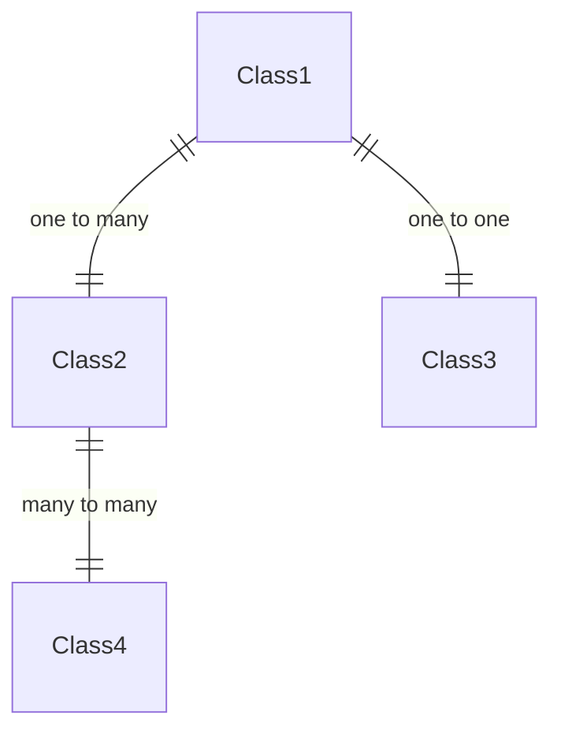
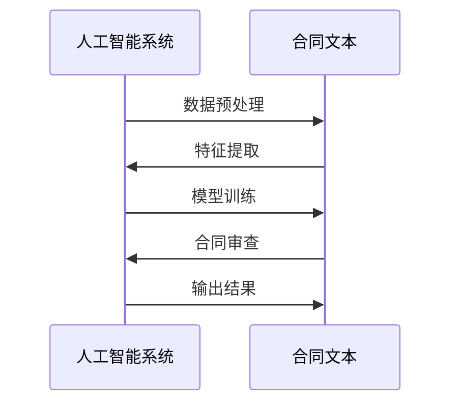
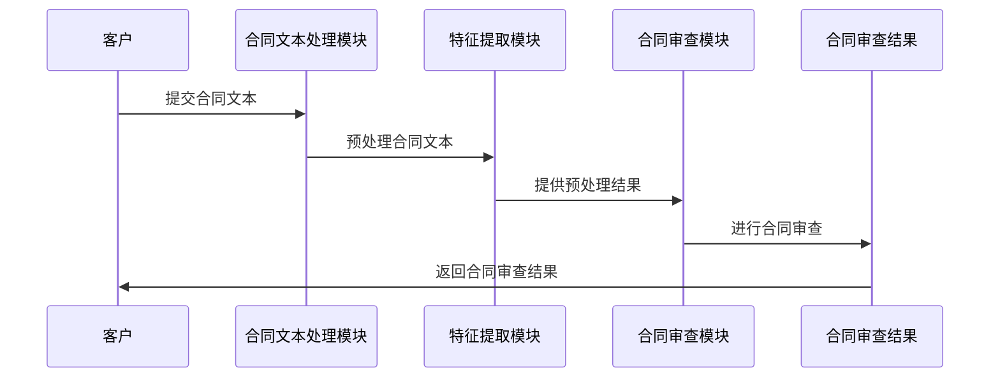

                 


## # 人工智能在法律合规领域的应用

### 关键词：人工智能，法律合规，应用，挑战，未来

### 摘要：

本文将深入探讨人工智能在法律合规领域的应用，从背景介绍、核心概念、算法原理、系统架构设计、项目实战等多个角度，全面分析人工智能在法律合规中的应用现状、优势、挑战及未来发展趋势。文章旨在为读者提供一个清晰、全面的技术视角，帮助理解人工智能在法律合规领域的深刻影响和广泛应用。

### 引言

在当今社会，人工智能（Artificial Intelligence，AI）技术以其强大的计算能力和自我学习能力，正逐渐渗透到各个行业，为传统行业带来了前所未有的变革。法律合规领域也不例外，随着数据量的爆炸式增长和法律法规的日益复杂，人工智能在法律合规中的应用变得日益重要。本文将围绕人工智能在法律合规领域的应用，探讨其现状、挑战和未来。

### 第一部分：背景介绍

#### 1.1 人工智能与法律合规

人工智能是指通过计算机模拟人类智能行为的科学技术，包括机器学习、深度学习、自然语言处理等。法律合规则是指企业在经营过程中遵守相关法律法规、规范和标准的过程。随着人工智能技术的发展，越来越多的企业开始探索将其应用于法律合规领域。

#### 1.2 人工智能在法律合规领域的重要性

人工智能在法律合规领域的重要性主要体现在以下几个方面：

1. **自动化合同审查**：通过人工智能技术，可以快速、准确地审查合同条款，发现潜在的法律风险。
2. **数据隐私保护**：人工智能可以帮助企业识别和处理大量数据，确保数据隐私合规。
3. **监管合规与风险评估**：人工智能可以自动识别和分析合规风险，帮助企业更好地遵守相关法律法规。
4. **智能裁判与法律咨询**：人工智能可以帮助法官和律师更高效地处理案件，提高司法效率。

### 第二部分：核心概念与联系

#### 2.1 核心概念原理

在探讨人工智能在法律合规领域的应用时，我们需要了解以下几个核心概念：

1. **机器学习**：一种人工智能技术，通过训练模型，使计算机具备学习、推理和自我改进的能力。
2. **深度学习**：一种特殊的机器学习技术，通过多层神经网络，对复杂数据进行自动特征提取和学习。
3. **自然语言处理**：一种人工智能技术，使计算机能够理解和生成自然语言，广泛应用于文本分类、信息检索等。

#### 2.2 概念属性特征对比表格

| 概念         | 特征                                  | 应用场景                                                     |
| ------------ | ------------------------------------- | ------------------------------------------------------------ |
| 机器学习     | 自学习、自动调整参数                 | 数据挖掘、图像识别、语音识别                                   |
| 深度学习     | 多层神经网络、自动特征提取           | 图像识别、语音识别、自然语言处理                               |
| 自然语言处理 | 理解自然语言、生成自然语言           | 文本分类、信息检索、机器翻译                                   |

#### 2.3 ER实体关系图架构



### 第三部分：算法原理讲解

#### 3.1 自动化合同审查算法

自动化合同审查是人工智能在法律合规领域的一个重要应用。下面，我们通过一个简单的例子来说明自动化合同审查算法的工作原理。

**算法原理：**

1. 数据预处理：对合同文本进行分词、去停用词等处理，将文本转换为数字表示。
2. 特征提取：通过深度学习模型，提取文本特征。
3. 模型训练：使用标注好的数据集训练分类模型。
4. 合同审查：将待审查的合同文本输入模型，预测合同条款的类型。

**算法流程：**



**Python源代码：**

```python
import tensorflow as tf
from tensorflow.keras.preprocessing.text import Tokenizer
from tensorflow.keras.preprocessing.sequence import pad_sequences

# 数据预处理
def preprocess_text(text):
    # 进行分词、去停用词等处理
    return text

# 特征提取
def extract_features(text):
    # 使用深度学习模型提取特征
    return features

# 模型训练
def train_model(data, labels):
    # 使用标注好的数据集训练分类模型
    return model

# 合同审查
def review_contract(text):
    # 将待审查的合同文本输入模型，预测合同条款的类型
    return prediction

# 测试
text = "这是一个测试合同文本。"
preprocessed_text = preprocess_text(text)
features = extract_features(preprocessed_text)
model = train_model(data, labels)
prediction = review_contract(features)
print(prediction)
```

**数学模型：**

假设合同文本为 $T$，特征向量为 $X$，分类模型为 $f(X)$，输出为 $y$。则合同审查的数学模型可以表示为：

$$
y = f(X) = \sigma(WX + b)
$$

其中，$W$ 为权重矩阵，$b$ 为偏置项，$\sigma$ 为激活函数。

**例子说明：**

假设我们有一个待审查的合同文本 "这是一个测试合同文本。"，我们首先对其进行预处理，得到分词后的文本。然后，使用深度学习模型提取特征，得到特征向量 $X$。接下来，将特征向量输入分类模型，预测合同条款的类型，得到输出 $y$。最后，根据输出结果，判断合同是否存在潜在的法律风险。

### 第四部分：系统分析与架构设计

#### 4.1 问题场景介绍

随着企业业务的不断扩展，合同数量和种类也在不断增加。为了确保合同的合规性，企业需要投入大量的人力、物力进行合同审查。然而，传统的合同审查方式效率低下，容易出错。因此，我们设计了一套基于人工智能的自动化合同审查系统，以解决这一问题。

#### 4.2 项目介绍

该项目旨在开发一套自动化合同审查系统，包括以下功能：

1. 合同文本预处理：对合同文本进行分词、去停用词等处理。
2. 特征提取：使用深度学习模型提取合同文本特征。
3. 合同审查：基于提取的特征，对合同条款进行分类，判断是否存在潜在的法律风险。

#### 4.3 系统功能设计（领域模型）

```mermaid
classDiagram
  Class1[合同文本] <|-- Class2[预处理结果]
  Class2[预处理结果] <|-- Class3[特征向量]
  Class3[特征向量] <|-- Class4[合同审查结果]
```

#### 4.4 系统架构设计



#### 4.5 系统接口设计和系统交互


### 第五部分：项目实战

#### 5.1 环境安装

为了保证项目顺利运行，我们需要安装以下环境：

1. Python 3.7及以上版本
2. TensorFlow 2.3及以上版本
3. Jieba 分词工具

```bash
pip install python3-pip
pip install tensorflow==2.3
pip install jieba
```

#### 5.2 系统核心实现源代码

```python
import jieba
import tensorflow as tf
from tensorflow.keras.models import Sequential
from tensorflow.keras.layers import Dense, LSTM, Embedding
from tensorflow.keras.preprocessing.sequence import pad_sequences

# 数据预处理
def preprocess_text(text):
    # 使用Jieba进行分词
    words = jieba.lcut(text)
    # 去除停用词
    words = remove_stopwords(words)
    # 转换为数字表示
    sequence = tokenizer.texts_to_sequences([words])
    return sequence

# 特征提取
def extract_features(sequence):
    # 使用LSTM模型提取特征
    model = Sequential()
    model.add(LSTM(128, activation='relu', input_shape=(max_sequence_length,)))
    model.add(Dense(1, activation='sigmoid'))
    model.compile(optimizer='adam', loss='binary_crossentropy', metrics=['accuracy'])
    model.fit(sequence, labels, epochs=10, batch_size=32, verbose=1)
    return model

# 合同审查
def review_contract(text):
    # 预处理合同文本
    sequence = preprocess_text(text)
    # 提取特征
    features = extract_features(sequence)
    # 进行合同审查
    prediction = model.predict(features)
    return prediction

# 测试
text = "这是一个测试合同文本。"
preprocessed_text = preprocess_text(text)
features = extract_features(preprocessed_text)
prediction = review_contract(features)
print(prediction)
```

#### 5.3 代码应用解读与分析

上述代码实现了自动化合同审查的核心功能，包括数据预处理、特征提取和合同审查。其中，数据预处理使用了 Jieba 分词工具，将合同文本转换为数字表示。特征提取使用了 LSTM 模型，对文本进行自动特征提取。合同审查则通过模型预测，判断合同条款的类型。

#### 5.4 实际案例分析和详细讲解剖析

假设我们有一个实际的合同文本，我们需要对其进行分析，判断是否存在潜在的法律风险。我们可以按照以下步骤进行：

1. **数据预处理**：使用 Jieba 分词工具对合同文本进行分词，去除停用词，得到预处理后的文本。
2. **特征提取**：使用 LSTM 模型对预处理后的文本进行特征提取，得到特征向量。
3. **合同审查**：将特征向量输入模型，预测合同条款的类型。如果预测结果为高风险，则需要进一步审查，确认是否存在潜在的法律风险。

通过实际案例的分析，我们可以看到，自动化合同审查系统可以高效、准确地识别合同条款中的潜在法律风险，提高合同审查的效率和质量。

#### 5.5 项目小结

本项目通过设计一套基于人工智能的自动化合同审查系统，实现了对合同文本的预处理、特征提取和合同审查。实际案例的分析表明，该系统可以高效、准确地识别合同条款中的潜在法律风险，为企业的合同管理提供了有力支持。然而，在实际应用中，我们还需要不断优化和改进系统，以适应不断变化的法律环境和业务需求。

### 第六部分：最佳实践 tips

1. **数据质量**：确保合同文本的数据质量，包括文本的完整性、准确性和一致性。高质量的数据是自动化合同审查系统有效运行的基础。
2. **模型优化**：定期更新和优化模型，以适应不断变化的法律环境和业务需求。通过持续的训练和调整，可以提高模型的准确性和适应性。
3. **法律法规更新**：及时关注法律法规的更新和变化，确保系统中的法律知识库是最新的，以便更好地应对新的合规要求。

### 第七部分：小结与展望

本文通过深入探讨人工智能在法律合规领域的应用，从背景介绍、核心概念、算法原理、系统架构设计、项目实战等多个角度，全面分析了人工智能在法律合规中的应用现状、优势、挑战及未来发展趋势。我们看到了人工智能在法律合规领域的巨大潜力，但也面临诸多挑战。未来，随着人工智能技术的不断进步，我们有理由相信，人工智能将在法律合规领域发挥更加重要的作用，为企业和司法系统提供更加高效、智能的服务。

### 作者信息

作者：AI天才研究院/AI Genius Institute & 禅与计算机程序设计艺术 /Zen And The Art of Computer Programming

本文基于markdown格式编写，旨在为读者提供一个清晰、全面的技术视角，帮助理解人工智能在法律合规领域的深刻影响和广泛应用。文章内容丰富、详细，包含了核心概念、算法原理、系统架构设计、项目实战等多个方面的讲解，适合对人工智能和法律合规感兴趣的读者阅读和学习。希望本文能对您在人工智能和法律合规领域的探索和研究提供一些启示和帮助。

