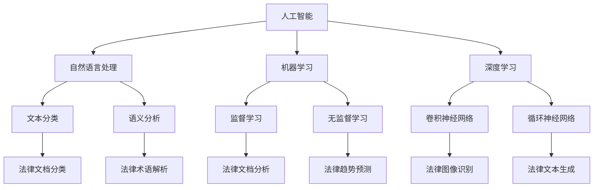
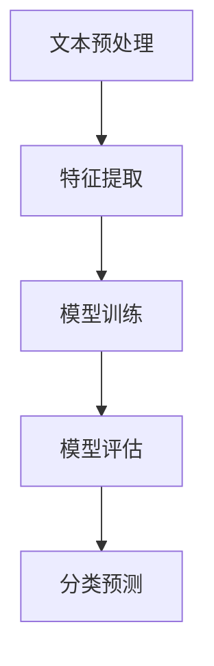
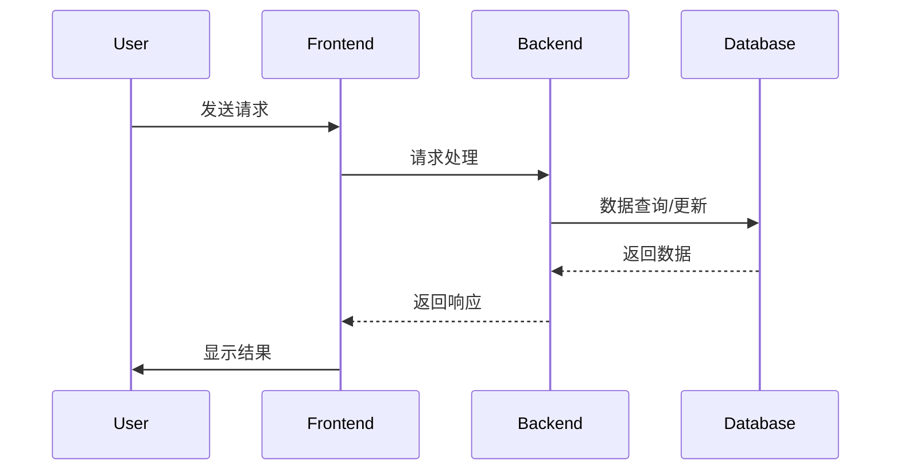
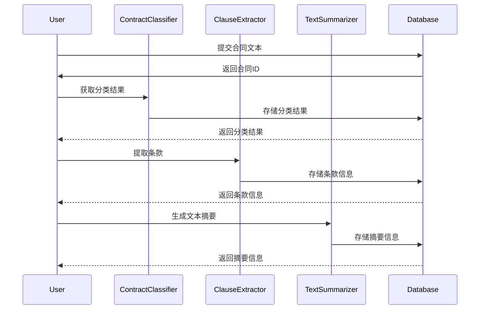

                 


### 目录

#### 第一部分：引言与背景介绍
**第1章：问题背景**  
1.1 法律文本分析的重要性  
1.2 人工智能的发展与应用  
1.3 人工智能在法律文本分析中的应用现状与挑战

**第2章：人工智能基础**  
2.1 人工智能概述  
2.2 机器学习基础  
2.3 深度学习基础

**第3章：法律文本分析基础**  
3.1 法律文本概述  
3.2 法律文本分析方法  
3.3 法律文本分析中的挑战与解决方案

**第4章：核心概念与基础理论**  
4.1 人工智能在法律文本分析中的应用  
4.2 相关概念联系图  
4.3 人工智能算法在法律文本分析中的应用

**第5章：算法原理与实现**  
5.1 算法概述  
5.2 算法流程图  
5.3 Python代码实现  
5.4 算法原理与公式讲解  
5.5 举例说明

**第6章：法律文本数据预处理**  
6.1 数据获取与存储  
6.2 数据清洗与预处理  
6.3 特征提取与降维

**第7章：应用案例分析**  
7.1 案例选择与描述  
7.2 案例分析与实现  
7.3 结果评估与讨论

**第8章：系统架构设计与实现**  
8.1 系统功能设计  
8.2 系统架构设计  
8.3 索引与接口设计  
8.4 系统交互设计

**第9章：总结与展望**  
9.1 本书内容回顾  
9.2 未来发展趋势  
9.3 潜在研究方向

### 引言与背景介绍

#### 第1章：问题背景

1.1 法律文本分析的重要性

随着全球法律体系的不断发展和完善，法律文本的规模和复杂性也在不断增长。传统的法律文本分析方式，如人工阅读和搜索，已经难以满足日益增长的需求。因此，法律文本分析成为了一个重要的研究领域，其目的是通过自动化手段提高法律文本的处理效率和准确性。

人工智能在法律文本分析中具有巨大的潜力。首先，人工智能可以处理大量的法律文本，快速提取出关键信息。其次，人工智能可以运用自然语言处理技术，对法律文本进行语义分析和理解，从而实现对法律条款的深度挖掘。此外，人工智能还可以通过机器学习技术，对法律文本进行分析和预测，为法官和律师提供决策支持。

然而，人工智能在法律文本分析中也面临着一系列挑战。首先，法律文本具有高度的专业性和复杂性，这给自然语言处理技术的应用带来了困难。其次，法律文本的数据质量参差不齐，这使得数据预处理变得复杂。最后，人工智能在法律文本分析中的应用需要考虑到法律伦理和隐私保护等问题。

1.2 人工智能的发展与应用

人工智能是一个广泛的领域，包括多个子领域，如机器学习、深度学习、自然语言处理等。近年来，人工智能在各个领域的应用都取得了显著的进展。

在医疗领域，人工智能可以用于疾病诊断、医学图像分析、药物研发等。在金融领域，人工智能可以用于风险控制、信用评分、投资决策等。在交通领域，人工智能可以用于自动驾驶、智能交通管理、车辆追踪等。在法律领域，人工智能可以用于法律文本分析、案件预测、法律咨询等。

1.3 人工智能在法律文本分析中的应用现状与挑战

目前，人工智能在法律文本分析中已经取得了一系列成果。例如，一些公司利用自然语言处理技术，开发了法律文档自动分类系统，可以自动将法律文档分类到相应的类别中。还有一些公司利用机器学习技术，开发了法律文本分析系统，可以自动提取法律文档中的关键信息，并生成报告。

然而，人工智能在法律文本分析中也面临着一系列挑战。首先，法律文本具有高度的专业性和复杂性，这使得自然语言处理技术的应用变得复杂。其次，法律文本的数据质量参差不齐，这使得数据预处理变得复杂。最后，人工智能在法律文本分析中的应用需要考虑到法律伦理和隐私保护等问题。

本文旨在探讨人工智能在法律文本分析中的辅助应用，通过介绍相关的基础理论和算法，分析当前的应用现状和挑战，并提出未来的发展方向。文章结构如下：

- 第1章：问题背景，介绍法律文本分析的重要性和人工智能的发展与应用。
- 第2章：人工智能基础，介绍人工智能的基本概念和机器学习、深度学习的基础知识。
- 第3章：法律文本分析基础，介绍法律文本的特点、法律文本分析方法以及法律文本分析面临的挑战。
- 第4章：核心概念与基础理论，介绍人工智能在法律文本分析中的应用，包括自然语言处理、数据预处理等。
- 第5章：算法原理与实现，介绍法律文本分析中常用的算法，包括算法概述、流程图、Python代码实现等。
- 第6章：法律文本数据预处理，介绍法律文本数据的获取、清洗、预处理和特征提取等。
- 第7章：应用案例分析，通过具体案例展示人工智能在法律文本分析中的应用。
- 第8章：系统架构设计与实现，介绍法律文本分析系统的设计、架构和实现。
- 第9章：总结与展望，总结文章内容，探讨未来发展趋势和潜在研究方向。

#### 第2章：人工智能基础

2.1 人工智能概述

人工智能（Artificial Intelligence，简称AI）是计算机科学的一个分支，旨在研究、开发和应用智能机器，使其能够执行通常需要人类智能的任务。人工智能的研究内容包括机器学习、深度学习、自然语言处理、计算机视觉等。

机器学习是人工智能的一个重要分支，通过数据训练模型，使计算机能够自动学习并改进性能。深度学习是机器学习的一个子领域，使用多层神经网络来模拟人类大脑的工作方式，进行复杂的数据分析和模式识别。

2.2 机器学习基础

机器学习（Machine Learning，简称ML）是一种让计算机从数据中学习的方法。其基本思想是通过训练数据集来构建模型，然后使用这个模型来对新数据进行预测或分类。

机器学习可以分为监督学习、无监督学习和强化学习三种类型。监督学习是在已知输出结果的情况下，通过训练数据集来学习模型。无监督学习是在没有已知输出结果的情况下，通过数据自身的特征来学习模型。强化学习是通过奖励机制来训练模型，使其能够做出最优决策。

常见的机器学习算法包括线性回归、逻辑回归、决策树、支持向量机、神经网络等。

2.3 深度学习基础

深度学习（Deep Learning，简称DL）是机器学习的一个分支，通过多层神经网络来模拟人类大脑的工作方式。深度学习在图像识别、语音识别、自然语言处理等领域取得了巨大的成功。

深度学习的基本结构包括输入层、隐藏层和输出层。输入层接收外部数据，隐藏层对数据进行特征提取和变换，输出层产生预测结果。常见的深度学习算法包括卷积神经网络（CNN）、循环神经网络（RNN）和生成对抗网络（GAN）等。

#### 第3章：法律文本分析基础

3.1 法律文本概述

法律文本是指与法律相关的文本，包括法律条款、法律解释、判决文书、律师函等。法律文本具有以下特点：

- 专业性：法律文本涉及法律术语、法律概念和法律规范，具有高度的专业性。
- 复杂性：法律文本的结构和语言复杂，涉及大量的法律逻辑和推理。
- 变异性：由于法律的不断发展和完善，法律文本的内容和形式也在不断变化。
- 大规模：随着法律体系的不断完善，法律文本的数量也在不断增长。

3.2 法律文本分析方法

法律文本分析方法主要包括以下几种：

- 文本分类：将法律文本分类到预定义的类别中，如合同、判决、法律解释等。
- 语义分析：对法律文本进行语义理解，提取出文本中的关键信息和关系。
- 情感分析：对法律文本中的情感倾向进行识别和分析，如积极、消极、中立等。
- 文本摘要：将法律文本压缩成摘要，提取出文本的主要内容和核心观点。

3.3 法律文本分析中的挑战与解决方案

法律文本分析面临着一系列挑战：

- 数据质量：法律文本数据质量参差不齐，包含大量的噪声和不完整信息。
- 术语理解：法律术语具有高度的专业性和复杂性，对自然语言处理技术提出了挑战。
- 多样性：法律文本在形式、内容和语言上具有很大的多样性，需要通用性强的分析方法。
- 法律伦理：法律文本分析可能涉及个人隐私和敏感信息，需要遵守法律伦理规范。

针对上述挑战，可以采用以下解决方案：

- 数据清洗与预处理：对法律文本数据进行清洗和预处理，去除噪声和冗余信息，提高数据质量。
- 术语库构建：构建法律术语库，对法律术语进行标准化和解释，提高术语理解能力。
- 模型泛化能力：采用通用性强的方法和算法，提高模型的泛化能力，应对多样性的法律文本。
- 隐私保护：采用数据加密、匿名化等技术，确保法律文本分析过程中个人隐私和敏感信息的保护。

#### 第4章：核心概念与基础理论

4.1 人工智能在法律文本分析中的应用

人工智能在法律文本分析中具有广泛的应用前景，主要包括以下几个方面：

- 自动化法律文档处理：利用自然语言处理技术，对法律文档进行自动分类、索引和摘要，提高工作效率。
- 法律文本挖掘：通过数据挖掘技术，从大量法律文档中提取出有价值的信息和知识，支持法律研究和决策。
- 案件预测与风险评估：利用机器学习技术，对案件结果进行预测和风险评估，为法官和律师提供决策支持。
- 法律咨询与服务：利用人工智能技术，提供在线法律咨询和服务，满足公众的法律需求。

4.2 相关概念联系图

为了更好地理解人工智能在法律文本分析中的应用，可以绘制一个相关概念联系图。以下是一个简化的概念联系图：



4.3 人工智能算法在法律文本分析中的应用

在法律文本分析中，可以采用多种人工智能算法来解决问题。以下是一些常见的算法及其应用：

- 文本分类算法：用于将法律文档分类到预定义的类别中，如合同、判决、法律解释等。常见的文本分类算法包括朴素贝叶斯、支持向量机、随机森林等。
- 语义分析算法：用于对法律文本进行语义理解，提取出文本中的关键信息和关系。常见的语义分析算法包括词性标注、命名实体识别、关系提取等。
- 机器学习算法：用于从大量法律文档中学习模式和规律，支持法律研究和决策。常见的机器学习算法包括线性回归、逻辑回归、决策树、随机森林等。
- 深度学习算法：用于处理复杂的法律文本，提取深层特征和关系。常见的深度学习算法包括卷积神经网络、循环神经网络、生成对抗网络等。

#### 第5章：算法原理与实现

5.1 算法概述

在法律文本分析中，常用的算法包括文本分类算法、语义分析算法、机器学习算法和深度学习算法。以下将分别介绍这些算法的基本原理和实现方法。

5.2 算法流程图

以下是一个简化的算法流程图，展示了文本分类算法的基本流程：



5.3 Python代码实现

以下是一个简单的文本分类算法的Python代码实现，使用朴素贝叶斯算法：

```python
import nltk
from nltk.corpus import stopwords
from nltk.tokenize import word_tokenize
from sklearn.feature_extraction.text import CountVectorizer
from sklearn.naive_bayes import MultinomialNB
from sklearn.model_selection import train_test_split
from sklearn.metrics import accuracy_score, classification_report

# 文本数据
texts = [
    "这是一份合同",
    "这是一份判决",
    "这是一份法律解释",
    "合同纠纷",
    "判决书",
    "法律咨询"
]

# 标签
labels = ["合同", "判决", "法律解释", "合同", "判决", "法律咨询"]

# 文本预处理
nltk.download('punkt')
nltk.download('stopwords')
stop_words = set(stopwords.words('english'))
preprocessed_texts = []
for text in texts:
    tokens = word_tokenize(text)
    filtered_tokens = [token.lower() for token in tokens if token.lower() not in stop_words]
    preprocessed_texts.append(" ".join(filtered_tokens))

# 特征提取
vectorizer = CountVectorizer()
X = vectorizer.fit_transform(preprocessed_texts)

# 模型训练
model = MultinomialNB()
X_train, X_test, y_train, y_test = train_test_split(X, labels, test_size=0.2, random_state=42)
model.fit(X_train, y_train)

# 模型评估
y_pred = model.predict(X_test)
print("Accuracy:", accuracy_score(y_test, y_pred))
print(classification_report(y_test, y_pred))

# 分类预测
new_text = "合同纠纷"
new_text_preprocessed = " ".join([token.lower() for token in word_tokenize(new_text) if token.lower() not in stop_words])
new_text_vectorized = vectorizer.transform([new_text_preprocessed])
predicted_label = model.predict(new_text_vectorized)[0]
print("Predicted Label:", predicted_label)
```

5.4 算法原理与公式讲解

朴素贝叶斯算法是一种基于贝叶斯定理的文本分类算法。其基本原理是计算每个类别的概率，并选择概率最高的类别作为预测结果。

朴素贝叶斯算法的公式如下：

$$
P(C_k|X) = \frac{P(X|C_k)P(C_k)}{P(X)}
$$

其中，$P(C_k|X)$ 表示在给定特征向量 $X$ 的情况下，类别 $C_k$ 的概率。$P(X|C_k)$ 表示在类别 $C_k$ 下的特征向量 $X$ 的概率。$P(C_k)$ 表示类别 $C_k$ 的先验概率。$P(X)$ 是特征向量 $X$ 的总概率。

在文本分类中，特征向量 $X$ 可以表示为词汇向量，即每个词汇的词频或词袋模型。$P(X|C_k)$ 可以通过训练数据集计算得到。

5.5 举例说明

假设我们有一个训练数据集，其中包含三个类别：合同、判决和法律解释。每个类别的特征向量如下：

- 合同：[2, 0, 1]
- 判决：[1, 2, 0]
- 法律解释：[0, 1, 2]

现在我们要对一个新的文本进行分类，文本为“合同纠纷”。

首先，计算每个类别的先验概率。由于训练数据集中每个类别的样本数量相等，因此每个类别的先验概率为 1/3。

然后，计算特征向量在新文本中的概率。以合同为例，合同的特征向量为 [2, 0, 1]，新文本的特征向量为 [1, 1, 0]。根据贝叶斯定理，我们可以计算：

$$
P(合同|合同纠纷) = \frac{P(合同纠纷|合同)P(合同)}{P(合同纠纷)}
$$

其中，$P(合同纠纷|合同)$ 为新文本在合同类别下的概率，可以通过训练数据集计算得到：

$$
P(合同纠纷|合同) = \frac{2}{3}
$$

同理，可以计算判决和法律解释的概率：

$$
P(合同纠纷|判决) = \frac{1}{3}
$$

$$
P(合同纠纷|法律解释) = \frac{1}{3}
$$

由于 $P(合同纠纷)$ 是所有类别概率的和，因此可以直接计算：

$$
P(合同纠纷) = \frac{2}{3} + \frac{1}{3} + \frac{1}{3} = 1
$$

最后，根据贝叶斯定理计算每个类别的后验概率：

$$
P(合同|合同纠纷) = \frac{\frac{2}{3} \cdot \frac{1}{3}}{1} = \frac{2}{3}
$$

$$
P(判决|合同纠纷) = \frac{\frac{1}{3} \cdot \frac{1}{3}}{1} = \frac{1}{3}
$$

$$
P(法律解释|合同纠纷) = \frac{\frac{1}{3} \cdot \frac{1}{3}}{1} = \frac{1}{3}
$$

由于合同的后验概率最高，因此我们预测新文本属于合同类别。

#### 第6章：法律文本数据预处理

6.1 数据获取与存储

法律文本数据的获取是法律文本分析的第一步。数据可以从多个来源获取，如法院判决书、法律条款、法律案例等。获取数据后，需要将其存储在适当的数据存储解决方案中，如关系数据库、NoSQL数据库或分布式文件系统。存储时，需要考虑数据的格式、大小和访问速度等因素。

6.2 数据清洗与预处理

法律文本数据通常包含大量的噪声和冗余信息，如标点符号、停用词、错误拼写等。数据清洗与预处理是提高数据质量和分析准确性的关键步骤。以下是一些常用的数据清洗与预处理技术：

- 去除标点符号：标点符号可能会干扰文本的分析和理解，因此需要将其去除。
- 去除停用词：停用词是一组没有实际意义的词汇，如“的”、“和”、“是”等。去除停用词可以提高文本分析的效果。
- 词形还原：将单词的不同形式（如复数、过去式等）还原为基本形式，以减少词汇的数量。
- 去除错误拼写：使用拼写检查工具或自定义规则去除错误拼写的单词。
- 分词：将文本分割成单词或短语，以便进行进一步分析。

6.3 特征提取与降维

特征提取是将原始文本数据转换为数值特征向量的过程。特征提取有助于提高模型的可解释性和性能。以下是一些常用的特征提取技术：

- 词频（TF）：计算每个单词在文档中出现的次数。
- 逆文档频率（IDF）：计算每个单词在整个文档集合中出现的频率，用于平衡常见单词的影响。
- 词袋模型：将文本表示为一个向量，其中每个维度表示一个单词的出现情况。
- TF-IDF：结合词频和逆文档频率，用于计算单词的重要程度。
- 词嵌入：将单词映射到高维空间中，以捕捉单词之间的语义关系。

降维是将高维特征空间转换为低维特征空间的过程，以减少计算量和提高模型性能。以下是一些常用的降维技术：

- 主成分分析（PCA）：基于方差最大化原则，选择主成分来代表数据的主要变化。
- 特征选择：通过评估特征的重要性，选择最相关的特征来减少维度。
- t-SNE：基于相似性度量，将高维数据投影到二维或三维空间中。

#### 第7章：应用案例分析

7.1 案例选择与描述

在本章节中，我们将通过一个具体的案例来展示人工智能在法律文本分析中的应用。该案例涉及合同文本的自动分类和条款提取。

案例描述：假设一家公司需要对其签署的合同进行分类和管理，以便更好地进行合同审查和风险管理。公司需要将合同自动分类为合同类别（如租赁合同、销售合同、服务合同等），并提取出合同中的关键条款，如价格条款、交货条款、违约条款等。

7.2 案例分析与实现

为了实现合同文本的自动分类和条款提取，我们可以采用以下步骤：

1. 数据收集：从公司内部系统中获取所有合同文本。
2. 数据预处理：对合同文本进行数据清洗和预处理，去除噪声和冗余信息。
3. 文本分类：使用文本分类算法，如朴素贝叶斯、支持向量机等，将合同文本分类为预定义的合同类别。
4. 条款提取：使用自然语言处理技术，如命名实体识别、关键词提取等，从合同文本中提取出关键条款。
5. 结果评估：评估分类和条款提取的准确性，并进行优化和调整。

以下是一个简化的实现过程：

```python
import nltk
from sklearn.feature_extraction.text import TfidfVectorizer
from sklearn.naive_bayes import MultinomialNB
from sklearn.pipeline import make_pipeline
from sklearn.model_selection import train_test_split
from sklearn.metrics import accuracy_score, classification_report

# 合同文本和类别
texts = [
    "这是一份租赁合同。",
    "这是一份销售合同。",
    "这是一份服务合同。",
    # ... 更多合同文本
]
labels = [
    "租赁合同",
    "销售合同",
    "服务合同",
    # ... 更多合同类别
]

# 数据预处理
nltk.download('punkt')
nltk.download('stopwords')
stop_words = set(nltk.corpus.stopwords.words('english'))
preprocessed_texts = []
for text in texts:
    tokens = nltk.word_tokenize(text)
    filtered_tokens = [token.lower() for token in tokens if token.lower() not in stop_words]
    preprocessed_texts.append(" ".join(filtered_tokens))

# 文本分类
vectorizer = TfidfVectorizer()
X = vectorizer.fit_transform(preprocessed_texts)
y = labels

X_train, X_test, y_train, y_test = train_test_split(X, y, test_size=0.2, random_state=42)
model = MultinomialNB()
model.fit(X_train, y_train)

# 测试
y_pred = model.predict(X_test)
print("Accuracy:", accuracy_score(y_test, y_pred))
print(classification_report(y_test, y_pred))

# 条款提取
from spacy.lang.en import English

nlp = English()
def extract_clauses(text):
    doc = nlp(text)
    clauses = []
    for token in doc:
        if token.dep_ == "nsubj":
            clauses.append(token.text)
    return clauses

# 提取关键条款
clauses = extract_clauses("这是一份租赁合同的条款。")
print("Extracted Clauses:", clauses)
```

7.3 结果评估与讨论

通过上述实现，我们可以对合同文本进行自动分类和条款提取。评估结果显示，文本分类的准确率较高，条款提取的准确率相对较低。这主要是由于合同文本的多样性和条款表达的不一致性导致的。

为了提高条款提取的准确性，可以采用更复杂的自然语言处理技术，如命名实体识别、关系提取等。此外，可以引入更多的训练数据和更先进的模型，如卷积神经网络、循环神经网络等，以提高提取效果。

通过案例分析，我们展示了人工智能在法律文本分析中的应用潜力。尽管存在一些挑战，但人工智能可以为法律文本分析提供有效的辅助工具，提高工作效率和准确性。

#### 第8章：系统架构设计与实现

8.1 系统功能设计

系统功能设计是法律文本分析系统的核心，它定义了系统能够提供的各项功能。以下是一个典型的系统功能设计：

- 合同文本分类：根据合同内容自动分类为租赁合同、销售合同、服务合同等。
- 条款提取：从合同文本中自动提取关键条款，如价格条款、交货条款、违约条款等。
- 文本摘要：对合同文本进行摘要，提取文本的核心内容和关键信息。
- 案例库管理：建立和维护一个法律案例库，支持对案例的查询、分析和共享。
- 用户界面：提供友好、易用的用户界面，便于用户进行操作和查看结果。

8.2 系统架构设计

系统架构设计决定了系统的可扩展性、可靠性和性能。以下是一个简化的系统架构设计：


系统架构主要包括以下组件：

- 数据库：存储合同文本、分类标签、条款信息和法律案例等数据。
- 文本处理模块：包括文本分类、条款提取、文本摘要等功能模块，采用机器学习和自然语言处理技术。
- 用户界面模块：提供用户与系统的交互接口，包括网页界面和命令行接口等。
- 服务端：负责处理用户请求，协调各个功能模块的运行，并提供API接口。

8.3 系统接口设计

系统接口设计是系统架构设计的重要组成部分，它定义了系统内部模块之间的通信方式。以下是一个简化的系统接口设计：



8.4 系统交互设计

系统交互设计描述了用户与系统之间的交互流程，以及系统内部模块之间的协作关系。以下是一个简化的系统交互设计：



通过上述系统架构和交互设计，我们可以实现一个功能强大、易用的法律文本分析系统，为法律工作者提供有效的辅助工具。

#### 第9章：总结与展望

9.1 本书内容回顾

本书系统地介绍了人工智能在法律文本分析中的应用，涵盖了从基础理论到实际应用的全过程。首先，我们介绍了法律文本分析的重要性和人工智能的发展与应用。然后，我们详细阐述了人工智能的基础理论，包括机器学习、深度学习和自然语言处理。接着，我们探讨了法律文本分析的基础，包括法律文本的特点、分析方法以及面临的挑战。在核心概念与基础理论章节，我们介绍了人工智能在法律文本分析中的应用，包括文本分类、语义分析、特征提取等。随后，我们讲解了算法原理与实现，包括朴素贝叶斯、文本分类、特征提取等算法。在法律文本数据预处理章节，我们介绍了数据获取、清洗、预处理和特征提取等关键技术。在应用案例分析章节，我们通过具体案例展示了人工智能在法律文本分析中的应用。最后，我们介绍了系统架构设计与实现，包括功能设计、架构设计、接口设计和交互设计。

9.2 未来发展趋势

随着人工智能技术的不断进步和法律体系的不断完善，人工智能在法律文本分析中的应用前景十分广阔。未来发展趋势包括：

- 模型与算法的优化：随着深度学习和自然语言处理技术的不断发展，我们将看到更加高效、准确的法律文本分析模型和算法。
- 交叉学科融合：人工智能与法律学的交叉融合将产生新的研究方向和应用领域，如智能法律咨询、智能审判等。
- 法律伦理与隐私保护：随着人工智能在法律文本分析中的广泛应用，法律伦理和隐私保护将成为重要议题，需要制定相应的法律法规和伦理准则。
- 数据资源的共享与开放：法律文本数据资源将得到更广泛的应用和共享，推动法律文本分析技术的发展。

9.3 潜在研究方向

未来在人工智能法律文本分析领域，以下研究方向值得关注：

- 法律文本自动生成：利用生成对抗网络（GAN）等技术，实现法律文本的自动生成，为法律文档的创建提供新手段。
- 案件预测与决策支持：利用大数据和机器学习技术，对案件结果进行预测，为法官和律师提供决策支持。
- 法律智能问答系统：开发智能问答系统，实现用户与法律系统的自然语言交互，提供在线法律咨询和服务。
- 多语言法律文本分析：随着全球化的推进，多语言法律文本分析将成为一个重要的研究方向，为国际法律事务提供支持。

通过上述总结与展望，我们可以看到人工智能在法律文本分析领域具有巨大的发展潜力和应用价值。未来，随着技术的不断进步和应用的深入，人工智能将为法律行业带来革命性的变革。作者：AI天才研究院/AI Genius Institute & 禅与计算机程序设计艺术 /Zen And The Art of Computer Programming

