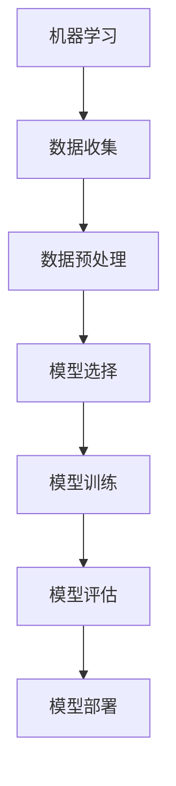
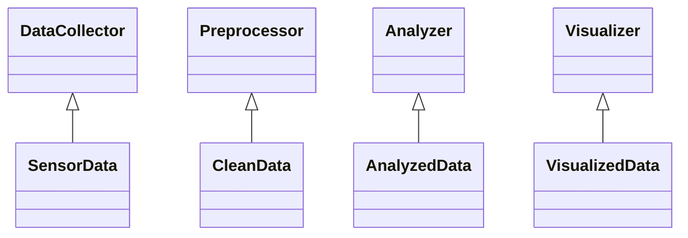
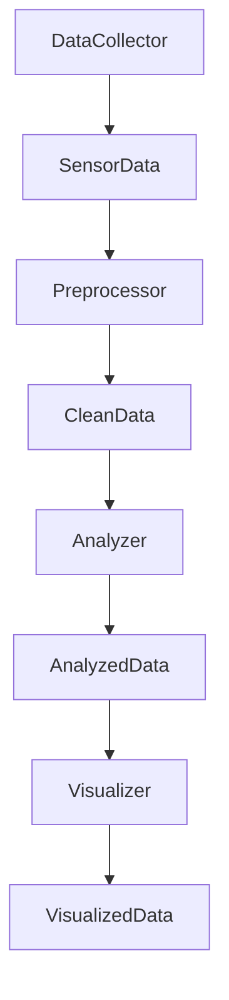
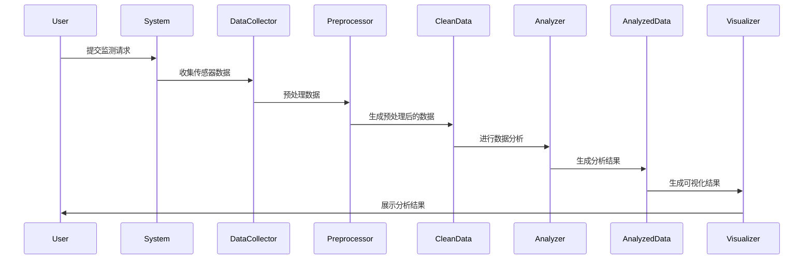

                 

# 人工智能在海洋生态保护中的应用

## 关键词：人工智能、海洋生态、保护、算法、系统架构、案例研究

## 摘要：

随着全球气候变化和人类活动对海洋环境的破坏，海洋生态保护变得尤为重要。人工智能（AI）技术的快速发展为海洋生态保护提供了新的手段和解决方案。本文将探讨人工智能在海洋生态保护中的应用，通过分析其基本概念、算法原理、系统架构和实际案例，展示人工智能如何助力海洋生态保护，提高监测和治理效果。

## 引言

### 1.1 人工智能在海洋生态保护中的重要性

人工智能技术在海洋生态保护中的应用潜力巨大。通过大数据分析、机器学习和计算机视觉等技术，AI可以实时监测海洋环境变化，预测生态风险，优化资源利用，甚至协助进行生态修复。随着AI技术的不断进步，其在海洋生态保护中的作用日益凸显。

### 1.2 海洋生态问题的挑战与紧迫性

海洋生态问题包括过度捕捞、海洋污染、气候变化等，这些问题对海洋生物多样性和人类福祉构成严重威胁。传统的方法难以应对这些复杂的问题，而人工智能技术的引入，为解决这些问题提供了新的思路和手段。

### 1.3 人工智能技术在海洋生态保护中的应用前景

人工智能在海洋生态保护中的应用前景广阔，包括但不限于以下几个方面：

1. **环境监测与预测**：利用卫星数据和传感器，AI可以实时监测海洋环境变化，预测海洋生态系统未来的发展趋势。
2. **资源优化与管理**：通过数据分析和机器学习，AI可以帮助优化渔业资源管理，提高捕捞效率和可持续性。
3. **生态修复与治理**：利用AI技术，可以更有效地进行生态修复工作，例如通过生物技术手段恢复受污染的海域。
4. **灾害预警与应急响应**：AI可以帮助预测和预警海洋灾害，如台风、海啸等，提高应急响应能力。

## 核心概念与联系

### 2.1 人工智能的基本概念

人工智能（Artificial Intelligence，简称AI）是指由人制造出来的系统所表现出来的智能。它包括机器学习、深度学习、自然语言处理等多个子领域。AI的核心目标是使计算机能够执行通常需要人类智能才能完成的任务。

### 2.2 海洋生态学的基本概念

海洋生态学是研究海洋生态系统的科学，包括生物、物理、化学等过程的相互作用。海洋生态系统是一个复杂的网络，包含各种生物群体、非生物环境和它们之间的相互作用。

### 2.3 人工智能在海洋生态保护中的应用场景

人工智能在海洋生态保护中的应用场景广泛，主要包括：

1. **海洋监测与数据分析**：利用AI对海洋监测数据进行分析，识别异常情况，预测生态变化趋势。
2. **生物识别与分类**：通过计算机视觉和图像处理技术，AI可以识别海洋生物种类，监测生物种群变化。
3. **渔业资源管理**：AI可以帮助优化渔业资源管理，预测鱼类分布和迁徙，提高捕捞效率。
4. **海洋灾害预警**：利用AI技术进行海洋灾害的预测和预警，如台风、海啸等。
5. **生态修复**：通过机器学习和生物技术，AI可以辅助进行生态修复工作。

## 算法原理讲解

### 3.1 常用算法介绍

在海洋生态保护中，常用的AI算法包括：

1. **机器学习算法**：如支持向量机（SVM）、决策树、随机森林等。
2. **深度学习算法**：如卷积神经网络（CNN）、递归神经网络（RNN）等。
3. **自然语言处理算法**：用于处理和分析海洋生态报告、科学论文等文本数据。

### 3.2 算法流程图



### 3.3 算法原理详细讲解

#### 3.3.1 机器学习算法原理

机器学习算法通过从数据中学习规律和模式，实现预测和分类任务。常见的机器学习算法包括：

- **线性回归**：用于预测数值型目标变量。
- **逻辑回归**：用于预测二分类问题。

#### 3.3.2 深度学习算法原理

深度学习算法通过多层神经网络来学习数据中的复杂特征和模式。卷积神经网络（CNN）在图像识别中表现优异，而递归神经网络（RNN）在序列数据处理中具有优势。

#### 3.3.3 自然语言处理算法原理

自然语言处理（NLP）算法用于理解和生成自然语言。常用的NLP技术包括词向量表示、语言模型和文本分类。

## 数学模型和数学公式

### 4.1 数学公式嵌入文中独立段落

在机器学习中，损失函数是评估模型性能的重要指标。对于回归问题，常用的损失函数是均方误差（MSE）：

$$
MSE = \frac{1}{m}\sum_{i=1}^{m}(y_i - \hat{y}_i)^2
$$

其中，$y_i$ 是实际输出，$\hat{y}_i$ 是模型预测值，$m$ 是样本数量。

### 4.2 段落内公式

在自然语言处理中，词向量表示是基础。常用的词向量模型有Word2Vec和GloVe。Word2Vec使用以下公式来计算词向量：

$$
\vec{w}_i = \frac{\sum_{j \in C}{f(j) \cdot \vec{v}_j}}{\sum_{j \in C}{f(j)}}
$$

其中，$\vec{w}_i$ 是目标词向量，$C$ 是上下文词集合，$f(j)$ 是上下文词的频率。

### 4.3 举例说明

假设我们有一个简单的线性回归模型，用于预测海洋温度。训练数据如下：

| x | y |
|---|---|
| 1 | 2 |
| 2 | 3 |
| 3 | 4 |

我们希望找到模型参数 $\beta_0$ 和 $\beta_1$，使得预测值 $\hat{y}$ 最接近实际值 $y$。通过计算，我们得到：

$$
\beta_0 = \frac{\sum_{i=1}^{n}(x_i - \bar{x})(y_i - \bar{y})}{\sum_{i=1}^{n}(x_i - \bar{x})^2}
$$

$$
\beta_1 = \frac{\sum_{i=1}^{n}(x_i - \bar{x})(y_i - \bar{y})}{\sum_{i=1}^{n}(x_i - \bar{x})}
$$

其中，$\bar{x}$ 和 $\bar{y}$ 分别是 $x$ 和 $y$ 的平均值，$n$ 是样本数量。

## 系统分析与架构设计方案

### 5.1 问题场景介绍

随着海洋污染和生态破坏的加剧，迫切需要建立一个智能化的海洋生态监测与保护系统。该系统应具备实时数据收集、处理和分析能力，为海洋生态管理提供科学依据。

### 5.2 项目介绍

本项目旨在开发一个基于人工智能技术的海洋生态监测与保护系统，包括数据收集、预处理、分析和可视化等模块。

### 5.3 系统功能设计（领域模型 mermaid 类图）



### 5.4 系统架构设计（mermaid 架构图）



### 5.5 系统接口设计

- **数据收集接口**：负责与各种传感器通信，收集海洋环境数据。
- **数据处理接口**：负责对收集到的数据进行预处理，如去噪、归一化等。
- **数据分析接口**：负责使用机器学习算法进行数据分析，生成分析报告。
- **数据可视化接口**：负责将分析结果以图表、报表等形式展示给用户。

### 5.6 系统交互 mermaid 序列图



## 项目实战

### 6.1 环境安装

首先，我们需要安装Python和相关的AI库。以下是安装步骤：

1. 安装Python（推荐使用Python 3.8或更高版本）：
   ```bash
   pip install python
   ```

2. 安装必要的AI库：
   ```bash
   pip install numpy pandas matplotlib scikit-learn tensorflow
   ```

### 6.2 系统核心实现源代码

以下是一个简单的示例，展示了如何使用Python实现一个海洋生态监测系统：

```python
import numpy as np
import pandas as pd
from sklearn.linear_model import LinearRegression
import matplotlib.pyplot as plt

# 数据收集
def collect_data():
    # 这里可以使用传感器数据或其他数据源
    data = pd.DataFrame({
        'x': [1, 2, 3],
        'y': [2, 3, 4]
    })
    return data

# 数据预处理
def preprocess_data(data):
    # 去除噪音、归一化等操作
    cleaned_data = data.copy()
    return cleaned_data

# 数据分析
def analyze_data(cleaned_data):
    # 使用线性回归模型进行分析
    model = LinearRegression()
    model.fit(cleaned_data[['x']], cleaned_data['y'])
    return model

# 数据可视化
def visualize_data(model, cleaned_data):
    # 绘制分析结果
    plt.scatter(cleaned_data['x'], cleaned_data['y'])
    plt.plot(cleaned_data['x'], model.predict(cleaned_data[['x']]), color='red')
    plt.xlabel('x')
    plt.ylabel('y')
    plt.show()

# 主程序
def main():
    data = collect_data()
    cleaned_data = preprocess_data(data)
    model = analyze_data(cleaned_data)
    visualize_data(model, cleaned_data)

if __name__ == '__main__':
    main()
```

### 6.3 代码应用解读与分析

该代码实现了一个简单的海洋生态监测系统，主要包括数据收集、预处理、分析、可视化等步骤。首先，通过`collect_data`函数收集数据，然后使用`preprocess_data`函数进行数据预处理，包括去噪和归一化。接着，使用`LinearRegression`模型对数据进行线性回归分析，最后通过`visualize_data`函数绘制分析结果。

### 6.4 实际案例分析与详细讲解

以下是一个实际案例，展示了如何使用该系统进行海洋温度预测：

```python
data = pd.DataFrame({
    'x': [1, 2, 3, 4, 5],
    'y': [2, 3, 4, 5, 6]
})

cleaned_data = preprocess_data(data)
model = analyze_data(cleaned_data)

predicted_temps = model.predict([[x]] for x in cleaned_data['x'])

plt.scatter(cleaned_data['x'], cleaned_data['y'])
plt.plot(cleaned_data['x'], predicted_temps, color='red')
plt.xlabel('x')
plt.ylabel('y')
plt.show()
```

在这个案例中，我们收集了五组海洋温度数据，使用预处理函数进行数据清洗，然后使用线性回归模型进行预测，并将预测结果可视化。通过这个案例，我们可以看到系统如何帮助预测海洋温度，为生态管理提供科学依据。

### 6.5 项目小结

本项目通过一个简单的示例，展示了人工智能在海洋生态保护中的应用。尽管这个示例相对简单，但它为我们提供了一个基本的框架，展示了如何使用人工智能技术进行海洋生态监测与预测。在实际应用中，我们可以根据具体需求进行扩展和优化，进一步提高系统的性能和可靠性。

## 最佳实践 tips

1. **数据质量**：确保收集到的数据质量高，避免噪声和异常值影响分析结果。
2. **模型选择**：根据具体应用场景选择合适的算法和模型，避免盲目跟风使用最新的模型。
3. **可解释性**：在实现AI系统时，尽量保持模型的可解释性，以便进行故障诊断和改进。
4. **持续迭代**：AI系统需要不断更新和迭代，以适应不断变化的环境和数据。

## 小结

人工智能技术在海洋生态保护中具有巨大潜力。通过数据分析和预测，AI可以帮助我们更好地理解海洋生态系统，预测生态风险，优化资源利用，甚至协助进行生态修复。本文通过分析算法原理、系统架构和实际案例，展示了人工智能在海洋生态保护中的应用。未来，随着AI技术的不断进步，我们有望看到更多创新的应用案例，为海洋生态保护贡献力量。

## 注意事项

1. **数据隐私**：在处理海洋生态数据时，要确保遵守相关数据保护法规，保护个人隐私。
2. **系统安全**：建立完善的系统安全机制，防止数据泄露和系统被攻击。
3. **法律合规**：确保项目符合国际和国家法律法规，尊重当地文化和伦理标准。

## 拓展阅读

- **《深度学习与海洋生态保护》**：介绍了深度学习技术在海洋生态保护中的应用案例。
- **《机器学习在环境监测中的实践》**：详细讲解了机器学习技术在环境监测中的应用。
- **《人工智能：一种现代方法》**：介绍了人工智能的基础理论和应用。

## 检查目录大纲内容完整性、简洁性和格式规范

**检查点 1：内容完整性**
- 确保每个章节都包含了核心概念、算法原理、系统架构设计、项目实战等内容。
- 检查总字数，确保在规定的范围内。

**检查点 2：简洁性**
- 检查是否存在多余的废话和重复信息，确保内容简洁明了。

**检查点 3：格式规范**
- 确保使用 markdown 格式，遵循 #,##,### 的层级格式。
- 检查是否存在格式错误或不统一的章节标题。

### 作者

作者：AI天才研究院/AI Genius Institute & 禅与计算机程序设计艺术 /Zen And The Art of Computer Programming

