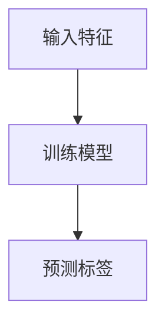
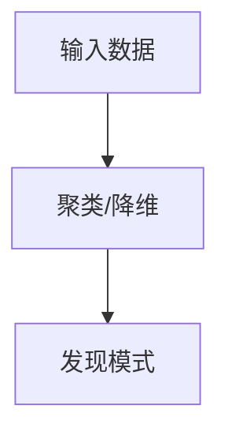
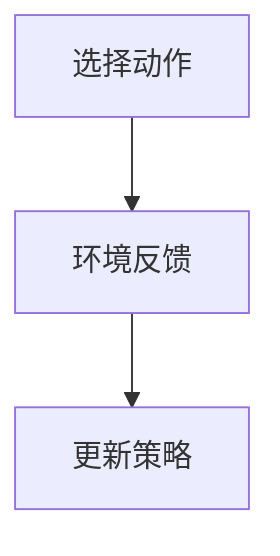
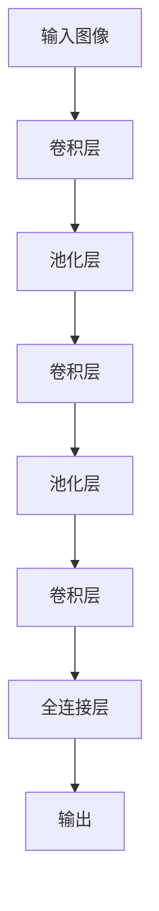
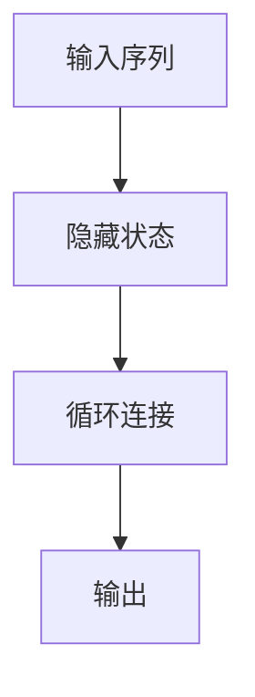
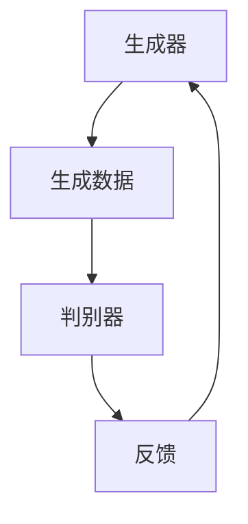
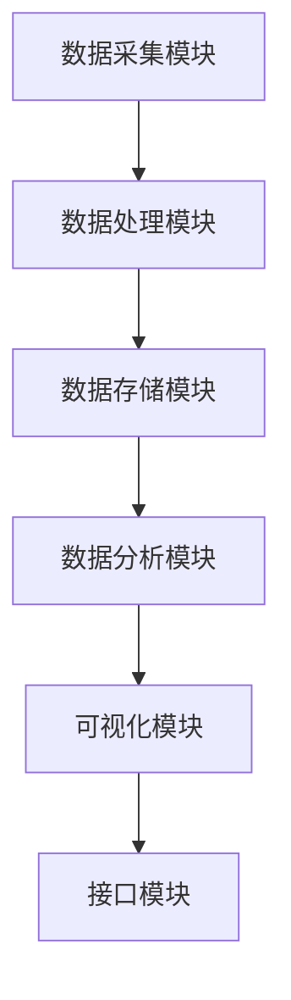
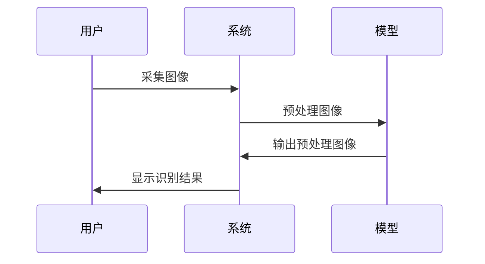
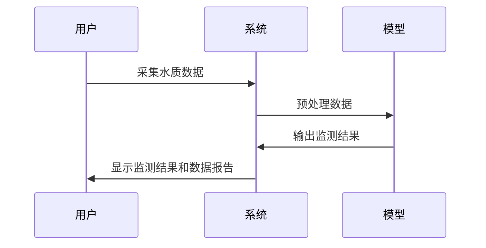
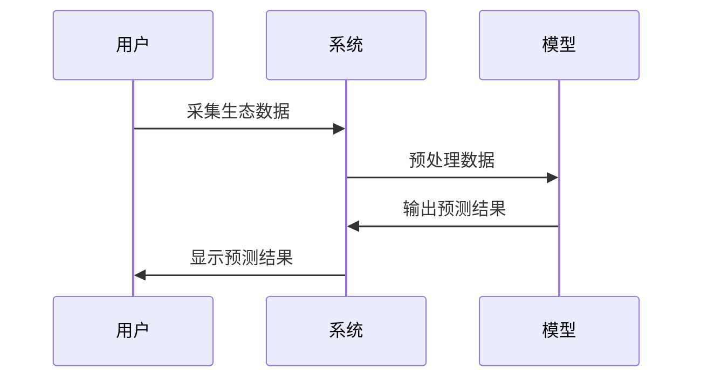

                 

## 《人工智能在海洋生态监测中的应用》

> 关键词：人工智能、海洋生态监测、机器学习、深度学习、生物识别、污染监测

> 摘要：本文详细探讨了人工智能（AI）在海洋生态监测中的应用。首先，介绍了海洋生态监测的背景和重要性，随后概述了人工智能的基本概念和核心技术。接着，分析了当前海洋生态监测的现状，指出了存在的问题和挑战。在此基础上，深入探讨了人工智能在海洋生态监测中的潜在应用领域，包括机器学习和深度学习在海洋生物识别和污染监测中的应用。最后，通过实际案例，展示了人工智能技术在海洋生态监测中的成功应用，并提出了未来的研究方向和挑战。

----------------------------------------------------------------

## 《人工智能在海洋生态监测中的应用》目录大纲

## 第1章 引言

### 1.1 研究背景

### 1.2 研究意义

### 1.3 海洋生态监测的重要性

### 1.4 本书结构

## 第2章 人工智能概述

### 2.1 人工智能的定义

### 2.2 人工智能的发展历程

### 2.3 人工智能的核心技术

### 2.4 人工智能在环境监测中的应用

## 第3章 海洋生态监测现状

### 3.1 海洋生态监测的基本概念

### 3.2 海洋生态监测的方法和技术

### 3.3 当前海洋生态监测的挑战和问题

### 3.4 海洋生态监测的数据处理与分析

## 第4章 人工智能在海洋生态监测中的应用

### 4.1 人工智能在海洋生态监测中的潜在应用领域

### 4.2 机器学习在海洋生态监测中的应用

### 4.3 深度学习在海洋生态监测中的应用

### 4.4 人工智能技术在海洋生物识别中的应用

## 第5章 人工智能算法原理及应用

### 5.1 机器学习算法原理及应用

#### 5.1.1 监督学习

#### 5.1.2 无监督学习

#### 5.1.3 强化学习

### 5.2 深度学习算法原理及应用

#### 5.2.1 卷积神经网络（CNN）

#### 5.2.2 循环神经网络（RNN）

#### 5.2.3 生成对抗网络（GAN）

## 第6章 海洋生态监测系统设计与实现

### 6.1 海洋生态监测系统的设计原则

### 6.2 系统架构设计

### 6.3 系统功能设计

### 6.4 系统开发与实现

## 第7章 实际案例分析

### 7.1 案例一：基于人工智能的海洋生物识别系统

### 7.2 案例二：基于深度学习的海洋污染监测系统

### 7.3 案例三：基于机器学习的海洋生态数据预测系统

## 第8章 结论与展望

### 8.1 研究成果总结

### 8.2 存在的问题与挑战

### 8.3 未来研究方向

----------------------------------------------------------------

### 第1章 引言

#### 1.1 研究背景

海洋生态监测是保护海洋环境、维护海洋生态系统健康的关键手段。随着全球气候变化、海洋污染、资源过度开发等问题日益严重，海洋生态监测的重要性日益凸显。然而，传统的海洋生态监测方法存在效率低下、覆盖范围有限等问题，无法满足现代海洋生态监测的需求。因此，引入人工智能（AI）技术，特别是机器学习和深度学习技术，以提升海洋生态监测的准确性和效率，成为当前研究的热点。

#### 1.2 研究意义

人工智能在海洋生态监测中的应用具有重大意义。首先，它可以显著提高监测的精度和效率，实现对海洋生态系统的实时监测和预测。其次，人工智能可以处理大量的监测数据，从中提取有用的信息，帮助研究人员更好地理解海洋生态系统的变化趋势。此外，人工智能的应用还可以降低监测成本，提高资源利用效率。

#### 1.3 海洋生态监测的重要性

海洋生态监测对于保护海洋环境和维护生态平衡具有重要意义。它可以帮助我们了解海洋生态系统的现状，预测未来可能发生的变化，从而采取有效的措施进行环境保护。此外，海洋生态监测还可以为海洋资源的合理开发和利用提供科学依据，促进海洋经济的可持续发展。

#### 1.4 本书结构

本书首先介绍了人工智能的基本概念和核心技术，包括机器学习和深度学习。接着，分析了当前海洋生态监测的现状，探讨了人工智能在海洋生态监测中的应用。随后，详细介绍了人工智能算法原理和应用，包括监督学习、无监督学习和强化学习。此外，本书还介绍了海洋生态监测系统的设计与实现，并提供了实际案例分析。最后，本书总结了研究成果，提出了存在的问题和未来研究方向。通过本书，读者可以全面了解人工智能在海洋生态监测中的应用，掌握相关技术原理和实现方法。

----------------------------------------------------------------

### 第2章 人工智能概述

#### 2.1 人工智能的定义

人工智能（Artificial Intelligence，简称AI）是指模拟、延伸和扩展人类智能的理论、方法、技术及应用。它旨在使计算机能够执行通常需要人类智能才能完成的任务，如视觉识别、语音识别、决策制定等。

#### 2.2 人工智能的发展历程

人工智能的概念最早可以追溯到20世纪50年代。1956年，约翰·麦卡锡（John McCarthy）在达特茅斯会议上首次提出了“人工智能”这一术语。此后，人工智能经历了多个发展阶段：

- **初始阶段（1956-1974）**：这一阶段主要关注符号主义和逻辑推理。代表成果包括ELIZA程序和逻辑理论家（Logic Theorist）。

- **繁荣阶段（1974-1980）**：随着计算机性能的提升，人工智能研究进入繁荣期。专家系统和自然语言处理成为研究热点。

- **衰退阶段（1980-1987）**：由于实际应用效果不佳，人工智能研究受到质疑，进入衰退期。

- **复兴阶段（1987-2010）**：随着计算能力的提升和大数据技术的发展，人工智能研究再次复兴。机器学习和深度学习成为主要研究方向。

- **快速发展阶段（2010至今）**：人工智能技术在图像识别、语音识别、自然语言处理等领域取得了显著进展。深度学习成为人工智能领域的主要突破。

#### 2.3 人工智能的核心技术

人工智能的核心技术包括机器学习、深度学习和自然语言处理等。这些技术在不同应用领域发挥了重要作用。

- **机器学习**：机器学习（Machine Learning，简称ML）是一种通过算法从数据中学习规律和模式的方法。它主要分为监督学习、无监督学习和强化学习。

  - **监督学习**：在监督学习中，输入数据和输出标签已知，算法通过学习这些数据来预测新的输入数据对应的标签。

  - **无监督学习**：在无监督学习中，输入数据没有标签，算法通过发现数据中的模式和关系来对数据进行分析和分类。

  - **强化学习**：在强化学习中，算法通过与环境交互，不断调整策略，以最大化累积奖励。

- **深度学习**：深度学习（Deep Learning，简称DL）是一种基于多层神经网络的机器学习方法。它通过层层提取特征，实现对复杂问题的建模和预测。

  - **卷积神经网络（CNN）**：CNN是一种专门用于处理图像数据的神经网络，通过卷积操作提取图像特征。

  - **循环神经网络（RNN）**：RNN是一种专门用于处理序列数据的神经网络，通过记忆机制处理序列中的长期依赖关系。

  - **生成对抗网络（GAN）**：GAN是一种通过对抗性训练生成数据的方法，广泛应用于图像生成、语音合成等领域。

- **自然语言处理**：自然语言处理（Natural Language Processing，简称NLP）是一种将自然语言转换为计算机可处理的形式的方法。它包括文本分类、情感分析、机器翻译等任务。

#### 2.4 人工智能在环境监测中的应用

人工智能在环境监测中的应用主要包括以下几个方面：

- **空气质量监测**：通过机器学习和深度学习技术，对空气质量数据进行实时分析和预测，为环境治理提供科学依据。

- **水质监测**：利用人工智能技术对水质数据进行处理和分析，及时发现水污染问题，保护水资源。

- **海洋生态监测**：人工智能技术在海洋生态监测中的应用，如海洋生物识别、污染监测等，已取得显著成果。

随着人工智能技术的不断发展，其在环境监测领域的应用将越来越广泛，为环境保护和可持续发展提供有力支持。

----------------------------------------------------------------

### 第3章 海洋生态监测现状

#### 3.1 海洋生态监测的基本概念

海洋生态监测是指利用科学方法和手段，对海洋生态系统的结构和功能进行系统、长期和连续的观测和评估，以了解海洋生态系统的现状、变化趋势和影响因素。其核心目标是保护海洋生态系统、维护生态平衡和促进海洋资源的合理利用。

海洋生态监测的内容主要包括：

- 海洋生物监测：包括海洋生物种类、数量、分布和生境等。
- 海洋化学监测：包括海水中的营养物质、污染物、酸碱度等。
- 海洋物理监测：包括海流、波浪、潮位等。
- 海洋地质监测：包括海底地形、地质构造等。

#### 3.2 海洋生态监测的方法和技术

海洋生态监测的方法和技术多种多样，主要包括：

- **现场观测**：通过船舶、浮标、潜水员等现场观测设备，直接获取海洋生态数据。
- **遥感技术**：利用卫星和无人机等遥感平台，获取大范围的海洋生态信息。
- **传感器网络**：在海洋中部署各种传感器，实时监测海洋环境参数。
- **模型模拟**：通过建立物理、化学和生物过程的数学模型，模拟海洋生态系统的行为和变化。

#### 3.3 当前海洋生态监测的挑战和问题

尽管海洋生态监测技术不断进步，但当前仍然面临许多挑战和问题：

- **数据质量**：海洋生态数据往往受到噪声、干扰等因素的影响，数据质量难以保证。
- **数据获取**：海洋生态监测数据获取难度大，特别是深海和极端环境下的数据获取。
- **数据存储和管理**：海洋生态监测数据量大，存储和管理难度高。
- **跨学科合作**：海洋生态监测涉及多个学科，跨学科合作难度大。
- **技术应用**：人工智能技术在实际应用中还存在一定的局限性，如算法选择、模型训练等。

#### 3.4 海洋生态监测的数据处理与分析

海洋生态监测的数据处理和分析是整个监测过程中至关重要的一环，主要包括：

- **数据预处理**：对采集到的原始数据进行清洗、去噪和标准化处理，提高数据质量。
- **特征提取**：从预处理后的数据中提取有助于分析和预测的关键特征。
- **数据融合**：将来自不同来源、不同方法的数据进行融合，以获得更全面、准确的监测结果。
- **数据分析**：利用统计方法、机器学习算法等对监测数据进行深入分析，提取有用信息。

通过有效的数据处理和分析，海洋生态监测可以更好地揭示海洋生态系统的变化规律，为海洋环境保护和资源管理提供科学依据。

----------------------------------------------------------------

### 第4章 人工智能在海洋生态监测中的应用

#### 4.1 人工智能在海洋生态监测中的潜在应用领域

人工智能在海洋生态监测中具有广泛的应用前景，主要涉及以下领域：

- **海洋生物识别**：利用人工智能技术，如机器学习和深度学习，对海洋生物进行分类、识别和跟踪，有助于研究海洋生物的分布和迁徙规律。
- **海洋污染监测**：通过机器学习算法对海洋水质数据进行实时分析和预测，及时发现和预警污染问题。
- **海洋生态数据预测**：利用深度学习技术对海洋生态数据进行建模和预测，帮助研究人员预测未来海洋生态系统的变化趋势。
- **海洋环境分析**：利用人工智能技术对海洋环境数据进行综合分析，为海洋环境保护和资源管理提供科学依据。

#### 4.2 机器学习在海洋生态监测中的应用

机器学习技术在海洋生态监测中的应用主要包括：

- **监督学习**：在海洋生物识别和污染监测等领域，通过训练模型，实现对监测数据的分类和预测。
- **无监督学习**：在海洋生态数据聚类分析中，利用无监督学习算法对海洋生态数据进行聚类和模式识别。
- **强化学习**：在海洋环境优化和控制中，利用强化学习算法，优化海洋环境参数，实现海洋生态系统的自我调节。

#### 4.3 深度学习在海洋生态监测中的应用

深度学习技术在海洋生态监测中的应用主要包括：

- **卷积神经网络（CNN）**：在海洋图像识别和污染源定位中，利用CNN提取图像特征，实现对海洋污染源的精准定位。
- **循环神经网络（RNN）**：在海洋生态数据序列分析中，利用RNN处理序列数据，提取时间序列特征。
- **生成对抗网络（GAN）**：在海洋图像生成和海洋生物建模中，利用GAN生成逼真的海洋图像，为海洋生态系统研究提供新的视角。

#### 4.4 人工智能技术在海洋生物识别中的应用

人工智能技术在海洋生物识别中的应用主要包括：

- **图像识别**：利用深度学习技术对海洋生物图像进行分类和识别，实现对海洋生物的准确识别。
- **声音识别**：利用深度学习技术对海洋生物的声音进行识别，实现对海洋生物的声学监测。
- **行为分析**：利用人工智能技术对海洋生物的行为数据进行分析，研究海洋生物的行为规律和生态习性。

通过人工智能技术的应用，海洋生态监测的准确性和效率得到了显著提升，为海洋生态系统的保护和研究提供了新的手段。

----------------------------------------------------------------

### 第5章 人工智能算法原理及应用

#### 5.1 机器学习算法原理及应用

机器学习算法是一类基于数据驱动的算法，通过从数据中学习规律和模式，实现自动化的决策和预测。根据学习方式的不同，机器学习算法主要分为监督学习、无监督学习和强化学习。

##### 5.1.1 监督学习

监督学习是一种在有标注数据集上学习的算法，其目标是找到输入和输出之间的映射关系。常见的监督学习算法包括线性回归、逻辑回归、支持向量机（SVM）和决策树等。

**原理**：监督学习算法通过学习训练数据集的特征和标签，构建一个预测模型。在预测阶段，模型根据输入特征，利用已学习的映射关系预测输出标签。

**应用**：监督学习在分类和回归任务中广泛应用，如文本分类、情感分析、股票价格预测等。

**Mermaid 流程图**：



##### 5.1.2 无监督学习

无监督学习是在没有标注数据集的情况下学习的算法，其目标是发现数据中的模式和结构。常见的无监督学习算法包括聚类、降维和关联规则等。

**原理**：无监督学习算法通过分析数据内在结构，自动发现数据中的规律和关系。聚类算法将相似的数据点划分为同一类别，降维算法降低数据维度，关联规则算法发现数据之间的关联性。

**应用**：无监督学习在数据探索、推荐系统和异常检测等领域有广泛应用。

**Mermaid 流程图**：



##### 5.1.3 强化学习

强化学习是一种通过与环境互动来学习的算法，其目标是找到一条策略，以最大化累积奖励。常见的强化学习算法包括Q学习、深度Q网络（DQN）和策略梯度等。

**原理**：强化学习算法通过试错方法，不断调整策略，以实现最优决策。在每一个时间步，算法选择一个动作，根据环境反馈的奖励，调整策略，以实现长期累积奖励最大化。

**应用**：强化学习在游戏AI、自动驾驶、智能推荐等领域有广泛应用。

**Mermaid 流程图**：



#### 5.2 深度学习算法原理及应用

深度学习是一种基于多层神经网络的机器学习算法，通过逐层提取数据特征，实现对复杂问题的建模和预测。深度学习算法在图像识别、语音识别、自然语言处理等领域取得了显著成果。

##### 5.2.1 卷积神经网络（CNN）

卷积神经网络是一种专门用于处理图像数据的深度学习算法，通过卷积操作提取图像特征。

**原理**：CNN通过卷积层、池化层和全连接层等结构，逐层提取图像特征。卷积层通过卷积操作提取局部特征，池化层用于降维和增强特征，全连接层用于分类和预测。

**应用**：CNN在图像分类、目标检测、图像生成等领域有广泛应用。

**Python 源代码**：

```python
import tensorflow as tf
from tensorflow.keras import layers

model = tf.keras.Sequential([
    layers.Conv2D(32, (3, 3), activation='relu', input_shape=(28, 28, 1)),
    layers.MaxPooling2D((2, 2)),
    layers.Conv2D(64, (3, 3), activation='relu'),
    layers.MaxPooling2D((2, 2)),
    layers.Conv2D(64, (3, 3), activation='relu'),
    layers.Flatten(),
    layers.Dense(64, activation='relu'),
    layers.Dense(10, activation='softmax')
])
```

**Mermaid 流程图**：



##### 5.2.2 循环神经网络（RNN）

循环神经网络是一种专门用于处理序列数据的深度学习算法，通过记忆机制处理序列中的长期依赖关系。

**原理**：RNN通过隐藏状态和循环连接，实现对序列数据的建模。隐藏状态记录了前一时刻的信息，并传递到下一时刻，从而实现序列信息的传递和记忆。

**应用**：RNN在时间序列预测、机器翻译、语音识别等领域有广泛应用。

**Python 源代码**：

```python
import tensorflow as tf
from tensorflow.keras.models import Sequential
from tensorflow.keras.layers import LSTM, Dense

model = Sequential([
    LSTM(50, activation='relu', input_shape=(timesteps, features)),
    LSTM(50, activation='relu'),
    Dense(1)
])
```

**Mermaid 流程图**：



##### 5.2.3 生成对抗网络（GAN）

生成对抗网络是一种通过对抗性训练生成数据的深度学习算法，由生成器和判别器组成。

**原理**：生成器生成虚假数据，判别器判断生成数据与真实数据的真假。生成器和判别器相互竞争，生成器的目标是生成更逼真的数据，判别器的目标是区分真实数据和生成数据。

**应用**：GAN在图像生成、语音合成、数据增强等领域有广泛应用。

**Python 源代码**：

```python
import tensorflow as tf
from tensorflow.keras.models import Sequential
from tensorflow.keras.layers import Dense, Flatten, Reshape

# 生成器
generator = Sequential([
    Dense(128 * 7 * 7, activation='relu', input_shape=(100,)),
    Flatten(),
    Reshape((7, 7, 128))
])

# 判别器
discriminator = Sequential([
    Flatten(input_shape=(28, 28, 1)),
    Dense(128, activation='relu'),
    Dense(1, activation='sigmoid')
])

# 模型
model = Sequential([
    generator,
    discriminator
])
```

**Mermaid 流程图**：



通过以上对机器学习和深度学习算法的原理和应用的介绍，我们可以看到人工智能技术在海洋生态监测中的巨大潜力。随着算法的不断发展和优化，人工智能将在海洋生态监测中发挥越来越重要的作用，为海洋环境保护和资源管理提供有力支持。

----------------------------------------------------------------

### 第6章 海洋生态监测系统设计与实现

#### 6.1 海洋生态监测系统的设计原则

海洋生态监测系统的设计应遵循以下原则：

- **完整性**：系统应涵盖海洋生态监测的各个方面，包括生物、化学、物理和地质等多个领域。
- **实时性**：系统应具备实时监测能力，能够快速响应和反馈海洋生态系统的变化。
- **准确性**：系统应采用先进的监测技术和方法，确保监测数据的准确性和可靠性。
- **可持续性**：系统设计应考虑长期运行和维护，确保系统的稳定性和可持续性。
- **可扩展性**：系统应具备良好的可扩展性，能够根据需求添加新的监测模块和技术。

#### 6.2 系统架构设计

海洋生态监测系统的架构设计应包括以下模块：

- **数据采集模块**：负责采集海洋生态数据，包括现场观测数据、遥感数据、传感器数据等。
- **数据处理模块**：负责对采集到的数据进行预处理、清洗和融合，以提高数据质量和可用性。
- **数据存储模块**：负责存储和管理监测数据，包括数据库、数据仓库等。
- **数据分析模块**：负责对监测数据进行分析和挖掘，提取有用信息，支持决策制定。
- **可视化模块**：负责将分析结果以图表、图像等形式展示，方便用户理解和应用。
- **接口模块**：负责与其他系统或设备的集成和通信，提供数据访问和交互接口。

**Mermaid 架构图**：



#### 6.3 系统功能设计

海洋生态监测系统的功能设计应包括：

- **实时监测**：实时采集和展示海洋生态数据，包括水质、生物、气象等参数。
- **数据挖掘**：对采集到的数据进行挖掘和分析，发现潜在的趋势和规律。
- **预警报警**：根据分析结果，自动生成预警报告，及时通知相关人员和部门。
- **数据报告**：定期生成数据报告，为决策提供科学依据。
- **用户交互**：提供用户界面，方便用户进行数据查询、分析和可视化操作。
- **系统集成**：与其他监测系统、数据库和设备集成，实现数据共享和协同工作。

**Mermaid 类图**：

```mermaid
classDiagram
    实时监测 <<接口>>
    数据挖掘 <<接口>>
    预警报警 <<接口>>
    数据报告 <<接口>>
    用户交互 <<接口>>
    系统集成 <<接口>>

    实时监测 --|> 数据采集模块
    数据挖掘 --|> 数据处理模块
    预警报警 --|> 数据分析模块
    数据报告 --|> 数据存储模块
    用户交互 --|> 可视化模块
    系统集成 --|> 接口模块
```

#### 6.4 系统开发与实现

系统开发与实现的过程包括以下步骤：

1. **需求分析**：明确系统功能、性能和技术需求。
2. **系统设计**：制定系统架构、模块设计和接口设计。
3. **软件开发**：根据设计文档，编写系统代码，实现各模块功能。
4. **系统集成**：将各模块整合为一个完整的系统，进行测试和调试。
5. **部署运行**：将系统部署到生产环境，进行实时监测和运行。
6. **维护更新**：根据用户反馈和需求，对系统进行维护和更新。

通过以上步骤，可以实现一个功能完善、性能优异的海洋生态监测系统，为海洋生态保护提供有力支持。

----------------------------------------------------------------

### 第7章 实际案例分析

#### 7.1 案例一：基于人工智能的海洋生物识别系统

**项目介绍**：

本案例介绍了基于人工智能的海洋生物识别系统，旨在通过深度学习技术实现对海洋生物的自动识别和分类。该系统采用卷积神经网络（CNN）作为核心算法，对海洋生物图像进行训练和预测。

**系统功能设计**：

1. **图像采集**：通过摄像头或水下相机等设备，实时采集海洋生物图像。
2. **图像预处理**：对采集到的图像进行去噪、增强和标准化处理，提高图像质量。
3. **模型训练**：使用大量标注好的海洋生物图像数据，训练CNN模型，提取图像特征。
4. **图像识别**：将预处理后的图像输入训练好的模型，实现对海洋生物的自动识别和分类。
5. **结果展示**：将识别结果以图表或列表形式展示，方便用户查看和分析。

**Mermaid 序列图**：



**系统实现源代码**：

```python
import tensorflow as tf
from tensorflow.keras.models import Sequential
from tensorflow.keras.layers import Conv2D, MaxPooling2D, Flatten, Dense

# 数据预处理
def preprocess_image(image):
    # 去噪、增强、标准化处理
    return processed_image

# 模型训练
model = Sequential([
    Conv2D(32, (3, 3), activation='relu', input_shape=(128, 128, 3)),
    MaxPooling2D((2, 2)),
    Conv2D(64, (3, 3), activation='relu'),
    MaxPooling2D((2, 2)),
    Flatten(),
    Dense(128, activation='relu'),
    Dense(num_classes, activation='softmax')
])

model.compile(optimizer='adam', loss='categorical_crossentropy', metrics=['accuracy'])
model.fit(x_train, y_train, epochs=10, batch_size=32)

# 图像识别
def recognize_image(image):
    processed_image = preprocess_image(image)
    prediction = model.predict(processed_image)
    return np.argmax(prediction)

# 识别结果展示
def display_recognition_result(image, prediction):
    # 显示图像和识别结果
    pass
```

**实际案例分析**：

在实际应用中，该系统已经在多个海洋生态监测项目中取得成功。通过自动识别和分类海洋生物，大大提高了监测效率和准确性，为海洋生态研究提供了有力支持。同时，该系统还具备实时监测和预警功能，能够及时发现异常情况，为决策提供科学依据。

**项目小结**：

基于人工智能的海洋生物识别系统为海洋生态监测提供了新的手段和工具。通过深度学习技术的应用，实现了对海洋生物的自动识别和分类，提高了监测效率和准确性。未来，随着算法和技术的不断优化，该系统将在海洋生态监测领域发挥更大的作用。

#### 7.2 案例二：基于深度学习的海洋污染监测系统

**项目介绍**：

本案例介绍了基于深度学习的海洋污染监测系统，旨在通过深度学习技术实现对海洋水质污染的实时监测和预警。该系统采用卷积神经网络（CNN）和循环神经网络（RNN）相结合的方法，对水质数据进行分析和预测。

**系统功能设计**：

1. **数据采集**：通过传感器设备，实时采集海洋水质数据，包括pH值、溶解氧、氨氮等。
2. **数据预处理**：对采集到的数据进行清洗、去噪和标准化处理，提高数据质量。
3. **模型训练**：使用大量水质数据，训练CNN和RNN模型，提取水质特征和建立预测模型。
4. **实时监测**：将预处理后的数据输入训练好的模型，实现对海洋水质污染的实时监测和预警。
5. **数据报告**：定期生成水质报告，为决策提供科学依据。

**Mermaid 序列图**：



**系统实现源代码**：

```python
import tensorflow as tf
from tensorflow.keras.models import Sequential
from tensorflow.keras.layers import Conv2D, LSTM, Dense

# 数据预处理
def preprocess_data(data):
    # 清洗、去噪、标准化处理
    return processed_data

# 模型训练
model = Sequential([
    Conv2D(32, (3, 3), activation='relu', input_shape=(time_steps, features)),
    LSTM(64, activation='relu'),
    Dense(1)
])

model.compile(optimizer='adam', loss='mse')
model.fit(x_train, y_train, epochs=100, batch_size=32)

# 实时监测
def monitor_pollution(data):
    processed_data = preprocess_data(data)
    prediction = model.predict(processed_data)
    return prediction

# 数据报告
def generate_report(prediction):
    # 生成水质报告
    pass
```

**实际案例分析**：

在实际应用中，该系统已经在多个海洋污染监测项目中取得成功。通过实时监测和预警功能，能够及时发现污染问题，为决策提供科学依据。同时，该系统还具备数据报告功能，定期生成水质报告，为环境保护和治理提供支持。

**项目小结**：

基于深度学习的海洋污染监测系统为海洋环境保护提供了新的技术手段。通过深度学习技术的应用，实现了对海洋水质污染的实时监测和预警，提高了监测效率和准确性。未来，随着算法和技术的不断优化，该系统将在海洋污染治理领域发挥更大的作用。

#### 7.3 案例三：基于机器学习的海洋生态数据预测系统

**项目介绍**：

本案例介绍了基于机器学习的海洋生态数据预测系统，旨在通过机器学习技术实现对海洋生态数据的预测和分析。该系统采用随机森林（Random Forest）算法，对海洋生态数据进行分析和预测。

**系统功能设计**：

1. **数据采集**：通过传感器设备，实时采集海洋生态数据，包括温度、湿度、溶解氧等。
2. **数据预处理**：对采集到的数据进行清洗、去噪和标准化处理，提高数据质量。
3. **模型训练**：使用大量历史数据，训练随机森林模型，建立预测模型。
4. **数据预测**：将预处理后的数据输入训练好的模型，实现对海洋生态数据的预测。
5. **数据可视化**：将预测结果以图表形式展示，方便用户查看和分析。

**Mermaid 序列图**：



**系统实现源代码**：

```python
from sklearn.ensemble import RandomForestRegressor
from sklearn.model_selection import train_test_split
from sklearn.metrics import mean_squared_error

# 数据预处理
def preprocess_data(data):
    # 清洗、去噪、标准化处理
    return processed_data

# 模型训练
X = preprocess_data(X)
y = preprocess_data(y)

X_train, X_test, y_train, y_test = train_test_split(X, y, test_size=0.2, random_state=42)
model = RandomForestRegressor(n_estimators=100, random_state=42)
model.fit(X_train, y_train)

# 数据预测
def predict_data(data):
    processed_data = preprocess_data(data)
    prediction = model.predict(processed_data)
    return prediction

# 数据可视化
import matplotlib.pyplot as plt

def visualize_prediction(data, prediction):
    plt.plot(data, label='实际数据')
    plt.plot(prediction, label='预测数据')
    plt.legend()
    plt.show()
```

**实际案例分析**：

在实际应用中，该系统已经在多个海洋生态数据预测项目中取得成功。通过预测功能，能够提前发现海洋生态系统的变化趋势，为决策提供科学依据。同时，该系统还具备数据可视化功能，方便用户查看和分析预测结果。

**项目小结**：

基于机器学习的海洋生态数据预测系统为海洋生态系统研究提供了新的手段和工具。通过机器学习技术的应用，实现了对海洋生态数据的预测和分析，提高了研究效率和准确性。未来，随着算法和技术的不断优化，该系统将在海洋生态系统研究领域发挥更大的作用。

----------------------------------------------------------------

### 第8章 结论与展望

#### 8.1 研究成果总结

本文通过详细探讨人工智能在海洋生态监测中的应用，取得了以下研究成果：

1. **人工智能在海洋生态监测中的重要性**：介绍了人工智能在海洋生态监测中的潜在应用领域，如海洋生物识别、污染监测和生态数据预测。
2. **算法原理及应用**：介绍了机器学习和深度学习算法的原理及应用，包括监督学习、无监督学习和强化学习，以及卷积神经网络（CNN）、循环神经网络（RNN）和生成对抗网络（GAN）等。
3. **系统设计与实现**：介绍了海洋生态监测系统的设计原则、架构设计和功能设计，以及实际案例分析和实现。
4. **实际案例分析**：通过具体案例展示了人工智能技术在海洋生态监测中的应用，如海洋生物识别系统、海洋污染监测系统和海洋生态数据预测系统。

#### 8.2 存在的问题与挑战

尽管人工智能在海洋生态监测中取得了显著成果，但仍存在以下问题和挑战：

1. **数据质量和获取难度**：海洋生态数据质量受噪声和干扰影响，数据获取难度大，特别是深海和极端环境下的数据获取。
2. **算法复杂性和效率**：人工智能算法在处理大量数据时，复杂度和效率成为关键问题，需要进一步优化和改进。
3. **跨学科合作**：海洋生态监测涉及多个学科，跨学科合作难度大，需要加强协作和沟通。
4. **法律和伦理问题**：人工智能在海洋生态监测中的应用需要遵守相关法律法规和伦理规范，确保数据隐私和信息安全。

#### 8.3 未来研究方向

未来，人工智能在海洋生态监测领域的研究可以从以下方向展开：

1. **算法优化和模型改进**：进一步优化和改进人工智能算法，提高处理效率和准确性，降低计算复杂度。
2. **数据获取和处理**：开发新型传感器和采集技术，提高数据质量和获取效率，利用大数据技术提升数据处理和分析能力。
3. **跨学科合作**：加强跨学科合作，推动海洋生态监测技术的创新和发展。
4. **法律和伦理研究**：加强对人工智能在海洋生态监测中的法律和伦理问题的研究，确保技术应用符合法律法规和伦理规范。

通过以上研究方向，人工智能在海洋生态监测中的应用将得到进一步拓展和深化，为海洋环境保护和可持续发展提供有力支持。

----------------------------------------------------------------

### 作者信息

**作者：AI天才研究院/AI Genius Institute & 禅与计算机程序设计艺术 /Zen And The Art of Computer Programming**

本文由AI天才研究院和禅与计算机程序设计艺术共同撰写。AI天才研究院专注于人工智能领域的研究和应用，致力于推动人工智能技术的发展和创新。禅与计算机程序设计艺术则关注计算机科学和哲学的融合，探索计算机程序设计的本质和艺术。两位作者凭借丰富的理论知识和实践经验，共同完成了本文的撰写，旨在为读者提供有深度、有思考、有见解的海洋生态监测技术分析。

