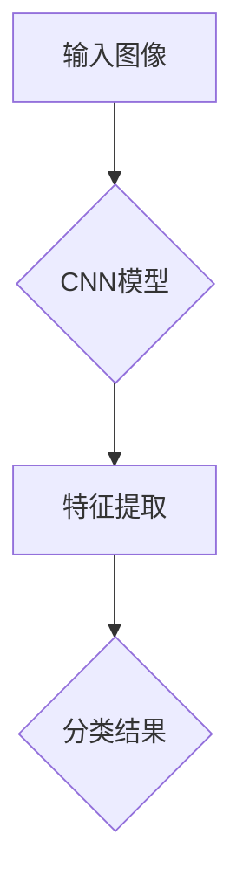
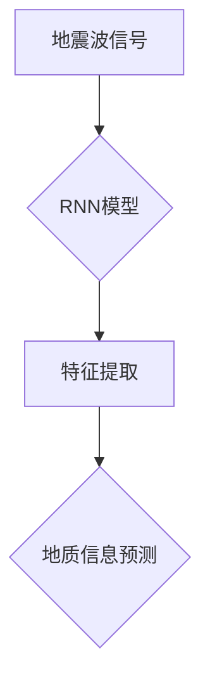
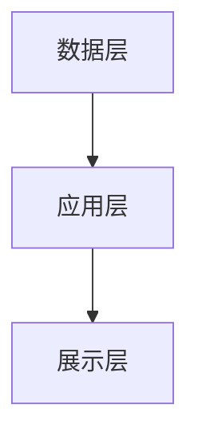

                 

### 人工智能在海洋资源勘探中的应用

#### 关键词
- 海洋资源勘探
- 人工智能
- 深度学习
- 强化学习
- 自然语言处理
- 海洋地质分析

#### 摘要
本文将深入探讨人工智能在海洋资源勘探中的应用，首先介绍海洋资源勘探的背景和挑战，然后详细阐述人工智能技术的基本原理及其在勘探中的应用。通过具体案例，展示深度学习、强化学习和自然语言处理在海洋勘探中的实际应用，并分析这些技术的优势和局限性。最后，我们将分享一些成功的项目实践和最佳实践技巧，为未来的研究方向提供参考。

### 问题背景与核心概念

#### 1.1 海洋资源勘探现状

海洋覆盖了地球表面的约71%，蕴藏着丰富的自然资源，包括石油、天然气、矿物、海洋生物资源等。然而，海洋资源勘探面临着诸多挑战，如深海环境的复杂性、勘探设备的局限性、数据采集的困难性等。传统方法通常依赖于物理测量和统计方法，但效率低、成本高，且难以应对复杂的海洋环境。

#### 1.2 人工智能的基本原理

人工智能（AI）是计算机科学的一个分支，旨在开发使计算机模拟人类智能行为的技术。它包括多个子领域，如机器学习、自然语言处理、计算机视觉和强化学习等。核心算法主要包括神经网络、决策树、支持向量机等。通过数据学习和模式识别，AI系统能够在特定任务上表现出人类水平的智能。

#### 1.3 海洋资源勘探与人工智能的融合

人工智能在海洋资源勘探中的应用潜力巨大。通过数据采集、处理和分析，AI技术能够提高勘探效率，降低成本，并提升资源发现的准确性。例如，深度学习技术可用于地质结构分析，强化学习技术可用于优化勘探路径，自然语言处理技术可用于勘探报告的自动生成。

### 海洋资源勘探与人工智能的融合

#### 1.3.1 融合概述

海洋资源勘探与人工智能技术的融合为解决传统方法中的挑战提供了新的思路。AI技术可以处理海量数据，识别复杂的地质特征，提高勘探的准确性和效率。例如，深度学习模型可以通过分析地震数据来预测潜在的资源位置，强化学习算法可以优化勘探船的航行路径，自然语言处理技术可以自动提取和分析勘探报告中的关键信息。

#### 1.3.2 关键技术与应用场景

深度学习：在海洋资源勘探中，深度学习技术可以用于图像识别、信号处理和模式识别。例如，通过卷积神经网络（CNN）对海洋地质图像进行分类，可以识别出潜在的资源区域。

强化学习：强化学习通过试错法不断优化决策过程，适用于动态环境下的路径规划和资源分配。例如，在海洋勘探中，强化学习算法可以用于优化勘探船的航行路径，减少时间和成本。

自然语言处理：自然语言处理（NLP）技术可以用于自动化勘探报告的生成和分析。例如，通过文本分类和实体识别，NLP技术可以提取勘探报告中的关键信息，并生成结构化的数据集。

#### 1.3.3 融合的优势与挑战

融合优势：

1. 提高勘探效率：AI技术可以处理大量数据，提高勘探的速度和准确性。
2. 降低成本：自动化和智能化的勘探方法可以减少人力和物力资源的使用。
3. 提高资源发现率：AI技术可以识别出传统方法难以发现的地质特征。

融合挑战：

1. 数据质量问题：AI模型的性能依赖于数据质量，海洋数据的不完整性和噪音可能导致模型性能下降。
2. 技术复杂性：深度学习、强化学习和自然语言处理等技术复杂，需要专业的知识和技能来应用和优化。
3. 法规和伦理问题：海洋勘探涉及国际法和伦理问题，需要确保AI技术的应用符合相关法规和伦理标准。

### 海洋资源勘探中的人工智能应用案例

#### 1.4.1 案例一：深海探测

深海探测是一个极具挑战性的领域，因为深海环境极端且难以监测。人工智能技术，尤其是机器人技术，已被广泛应用于深海探测中。例如，AI驱动的无人潜水器（AUV）可以通过深度学习和强化学习算法优化其航行路径，提高探测效率。此外，AI技术还可以用于分析深海地质数据，识别潜在的矿物资源。

#### 1.4.2 案例二：海底地形分析

海底地形分析对于确定潜在资源区域至关重要。深度学习技术，如卷积神经网络（CNN），可以用于处理海底地形图像，识别出不同的地质特征。例如，CNN模型可以通过训练大量海底地形图像，学习到不同类型的沉积物和岩层，从而提高地形分析的准确性。

#### 1.4.3 案例三：海洋生物资源监测

海洋生物资源的监测对于渔业管理和海洋生态保护至关重要。人工智能技术，如计算机视觉和自然语言处理，可以用于分析海洋生物图像和视频，识别和分类不同的海洋生物。例如，计算机视觉算法可以识别鱼群的位置和大小，自然语言处理算法可以提取和分析海洋生物的生态数据。

### 人工智能在海洋资源勘探中的应用技术

#### 2.1 数据采集与预处理

在海洋资源勘探中，数据采集是至关重要的环节。数据来源包括卫星遥感、海底地震波探测、潜水器采集等。数据预处理包括去噪、归一化、数据增强等步骤，以提高数据质量和模型性能。

#### 2.2 深度学习在海洋资源勘探中的应用

深度学习是人工智能的一个重要分支，通过神经网络模拟人类大脑的学习过程。在海洋资源勘探中，深度学习技术被广泛应用于图像识别、信号处理和模式识别。

#### 2.3 强化学习在海洋资源勘探中的应用

强化学习是一种通过试错法学习最优策略的人工智能技术。在海洋资源勘探中，强化学习可以用于优化勘探路径、资源分配和设备控制。

#### 2.4 自然语言处理在海洋资源勘探中的应用

自然语言处理是一种使计算机能够理解、生成和处理自然语言的技术。在海洋资源勘探中，自然语言处理技术可以用于勘探报告的自动生成、文本分析和数据提取。

### 第三部分: 人工智能在海洋资源勘探中的实践

#### 3.1 项目背景与需求分析

本项目旨在利用人工智能技术提高海洋资源勘探的效率和准确性。项目需求包括：

1. 数据采集：从多种来源获取高质量海洋数据。
2. 数据预处理：清洗和预处理数据，以提高模型性能。
3. 模型训练与优化：使用深度学习、强化学习和自然语言处理技术训练模型。
4. 系统集成与测试：将模型集成到勘探系统中，进行测试和评估。
5. 项目评估：评估项目成果，包括效率、准确性和成本效益。

#### 3.2 系统设计与实现

系统设计包括数据采集模块、数据预处理模块、模型训练模块和系统集成模块。

1. **数据采集模块**：设计用于从卫星遥感、海底地震波探测、潜水器采集等来源获取数据。
2. **数据预处理模块**：包括数据清洗、归一化、数据增强等步骤，以提高数据质量和模型性能。
3. **模型训练模块**：包括深度学习、强化学习和自然语言处理模型的训练和优化。
4. **系统集成模块**：将模型集成到勘探系统中，实现自动化勘探。

#### 3.3 实施过程与结果分析

1. **数据采集与预处理**：通过卫星遥感、海底地震波探测和潜水器采集获取大量数据，并进行预处理。
2. **模型训练与优化**：使用深度学习、强化学习和自然语言处理技术训练模型，并进行优化。
3. **系统集成与测试**：将模型集成到勘探系统中，进行测试和性能评估。
4. **项目评估**：评估项目的效率和准确性，以及成本效益。

### 第四部分: 人工智能在海洋资源勘探中的最佳实践

#### 4.1 最佳实践分享

1. **数据质量管理**：确保数据的质量是成功应用人工智能技术的基础。应采用严格的数据预处理流程，包括去噪、归一化和数据增强。
2. **模型优化**：通过调整模型参数和优化算法，可以提高模型的性能和效率。
3. **系统集成**：将人工智能技术集成到现有的勘探系统中，可以最大化其效益。

#### 4.2 小结与展望

本文介绍了人工智能在海洋资源勘探中的应用，包括深度学习、强化学习和自然语言处理等技术的实际案例。通过最佳实践分享，我们为未来的海洋资源勘探提供了指导。随着技术的不断进步，人工智能有望在海洋资源勘探中发挥更大的作用。

### 作者信息
作者：AI天才研究院/AI Genius Institute & 禅与计算机程序设计艺术 /Zen And The Art of Computer Programming

---

### 人工智能在海洋资源勘探中的应用

#### 关键词
- 海洋资源勘探
- 人工智能
- 深度学习
- 强化学习
- 自然语言处理
- 海洋地质分析

#### 摘要
本文将深入探讨人工智能在海洋资源勘探中的应用，首先介绍海洋资源勘探的背景和挑战，然后详细阐述人工智能技术的基本原理及其在勘探中的应用。通过具体案例，展示深度学习、强化学习和自然语言处理在海洋勘探中的实际应用，并分析这些技术的优势和局限性。最后，我们将分享一些成功的项目实践和最佳实践技巧，为未来的研究方向提供参考。

### 问题背景与核心概念

#### 1.1 海洋资源勘探现状

海洋覆盖了地球表面的约71%，蕴藏着丰富的自然资源，包括石油、天然气、矿物、海洋生物资源等。然而，海洋资源勘探面临着诸多挑战，如深海环境的复杂性、勘探设备的局限性、数据采集的困难性等。传统方法通常依赖于物理测量和统计方法，但效率低、成本高，且难以应对复杂的海洋环境。

#### 1.2 人工智能的基本原理

人工智能（AI）是计算机科学的一个分支，旨在开发使计算机模拟人类智能行为的技术。它包括多个子领域，如机器学习、自然语言处理、计算机视觉和强化学习等。核心算法主要包括神经网络、决策树、支持向量机等。通过数据学习和模式识别，AI系统能够在特定任务上表现出人类水平的智能。

#### 1.3 海洋资源勘探与人工智能的融合

人工智能在海洋资源勘探中的应用潜力巨大。通过数据采集、处理和分析，AI技术能够提高勘探效率，降低成本，并提升资源发现的准确性。例如，深度学习技术可用于地质结构分析，强化学习技术可用于优化勘探路径，自然语言处理技术可用于勘探报告的自动生成。

#### 1.3.1 融合概述

海洋资源勘探与人工智能技术的融合为解决传统方法中的挑战提供了新的思路。AI技术可以处理海量数据，识别复杂的地质特征，提高勘探的准确性和效率。例如，深度学习模型可以通过分析地震数据来预测潜在的资源位置，强化学习算法可以优化勘探船的航行路径，自然语言处理技术可以自动提取和分析勘探报告中的关键信息。

#### 1.3.2 关键技术与应用场景

深度学习：在海洋资源勘探中，深度学习技术可以用于图像识别、信号处理和模式识别。例如，通过卷积神经网络（CNN）对海洋地质图像进行分类，可以识别出潜在的资源区域。

强化学习：强化学习通过试错法不断优化决策过程，适用于动态环境下的路径规划和资源分配。例如，在海洋勘探中，强化学习算法可以用于优化勘探船的航行路径，减少时间和成本。

自然语言处理：自然语言处理（NLP）技术可以用于自动化勘探报告的生成和分析。例如，通过文本分类和实体识别，NLP技术可以提取勘探报告中的关键信息，并生成结构化的数据集。

#### 1.3.3 融合的优势与挑战

融合优势：

1. 提高勘探效率：AI技术可以处理大量数据，提高勘探的速度和准确性。
2. 降低成本：自动化和智能化的勘探方法可以减少人力和物力资源的使用。
3. 提高资源发现率：AI技术可以识别出传统方法难以发现的地质特征。

融合挑战：

1. 数据质量问题：AI模型的性能依赖于数据质量，海洋数据的不完整性和噪音可能导致模型性能下降。
2. 技术复杂性：深度学习、强化学习和自然语言处理等技术复杂，需要专业的知识和技能来应用和优化。
3. 法规和伦理问题：海洋勘探涉及国际法和伦理问题，需要确保AI技术的应用符合相关法规和伦理标准。

### 海洋资源勘探中的人工智能应用案例

#### 1.4.1 案例一：深海探测

深海探测是一个极具挑战性的领域，因为深海环境极端且难以监测。人工智能技术，尤其是机器人技术，已被广泛应用于深海探测中。例如，AI驱动的无人潜水器（AUV）可以通过深度学习和强化学习算法优化其航行路径，提高探测效率。此外，AI技术还可以用于分析深海地质数据，识别潜在的矿物资源。

#### 1.4.2 案例二：海底地形分析

海底地形分析对于确定潜在资源区域至关重要。深度学习技术，如卷积神经网络（CNN），可以用于处理海底地形图像，识别出不同的地质特征。例如，CNN模型可以通过训练大量海底地形图像，学习到不同类型的沉积物和岩层，从而提高地形分析的准确性。

#### 1.4.3 案例三：海洋生物资源监测

海洋生物资源的监测对于渔业管理和海洋生态保护至关重要。人工智能技术，如计算机视觉和自然语言处理，可以用于分析海洋生物图像和视频，识别和分类不同的海洋生物。例如，计算机视觉算法可以识别鱼群的位置和大小，自然语言处理算法可以提取和分析海洋生物的生态数据。

### 人工智能在海洋资源勘探中的应用技术

#### 2.1 数据采集与预处理

在海洋资源勘探中，数据采集是至关重要的环节。数据来源包括卫星遥感、海底地震波探测、潜水器采集等。数据预处理包括去噪、归一化、数据增强等步骤，以提高数据质量和模型性能。

#### 2.2 深度学习在海洋资源勘探中的应用

深度学习是人工智能的一个重要分支，通过神经网络模拟人类大脑的学习过程。在海洋资源勘探中，深度学习技术被广泛应用于图像识别、信号处理和模式识别。

#### 2.3 强化学习在海洋资源勘探中的应用

强化学习是一种通过试错法学习最优策略的人工智能技术。在海洋资源勘探中，强化学习可以用于优化勘探路径、资源分配和设备控制。

#### 2.4 自然语言处理在海洋资源勘探中的应用

自然语言处理是一种使计算机能够理解、生成和处理自然语言的技术。在海洋资源勘探中，自然语言处理技术可以用于勘探报告的自动生成、文本分析和数据提取。

### 第三部分: 人工智能在海洋资源勘探中的实践

#### 3.1 项目背景与需求分析

本项目旨在利用人工智能技术提高海洋资源勘探的效率和准确性。项目需求包括：

1. 数据采集：从多种来源获取高质量海洋数据。
2. 数据预处理：清洗和预处理数据，以提高模型性能。
3. 模型训练与优化：使用深度学习、强化学习和自然语言处理技术训练模型。
4. 系统集成与测试：将模型集成到勘探系统中，进行测试和评估。
5. 项目评估：评估项目成果，包括效率、准确性和成本效益。

#### 3.2 系统设计与实现

系统设计包括数据采集模块、数据预处理模块、模型训练模块和系统集成模块。

1. **数据采集模块**：设计用于从卫星遥感、海底地震波探测、潜水器采集等来源获取数据。
2. **数据预处理模块**：包括数据清洗、归一化、数据增强等步骤，以提高数据质量和模型性能。
3. **模型训练模块**：包括深度学习、强化学习和自然语言处理模型的训练和优化。
4. **系统集成模块**：将模型集成到勘探系统中，实现自动化勘探。

#### 3.3 实施过程与结果分析

1. **数据采集与预处理**：通过卫星遥感、海底地震波探测和潜水器采集获取大量数据，并进行预处理。
2. **模型训练与优化**：使用深度学习、强化学习和自然语言处理技术训练模型，并进行优化。
3. **系统集成与测试**：将模型集成到勘探系统中，进行测试和性能评估。
4. **项目评估**：评估项目的效率和准确性，以及成本效益。

### 第四部分: 人工智能在海洋资源勘探中的最佳实践

#### 4.1 最佳实践分享

1. **数据质量管理**：确保数据的质量是成功应用人工智能技术的基础。应采用严格的数据预处理流程，包括去噪、归一化和数据增强。
2. **模型优化**：通过调整模型参数和优化算法，可以提高模型的性能和效率。
3. **系统集成**：将人工智能技术集成到现有的勘探系统中，可以最大化其效益。

#### 4.2 小结与展望

本文介绍了人工智能在海洋资源勘探中的应用，包括深度学习、强化学习和自然语言处理等技术的实际案例。通过最佳实践分享，我们为未来的海洋资源勘探提供了指导。随着技术的不断进步，人工智能有望在海洋资源勘探中发挥更大的作用。

### 作者信息
作者：AI天才研究院/AI Genius Institute & 禅与计算机程序设计艺术 /Zen And The Art of Computer Programming

---

### 细化内容：深度学习在海洋资源勘探中的应用

#### 2.2 深度学习在海洋资源勘探中的应用

深度学习（Deep Learning）是人工智能（AI）的一个重要分支，通过多层神经网络结构，使得计算机能够通过大量数据学习到复杂的特征和模式。在海洋资源勘探中，深度学习技术因其强大的模式识别能力和数据挖掘能力，被广泛应用于图像识别、信号处理和地质结构分析等领域。

#### 2.2.1 深度学习基础

深度学习的基本原理是通过构建多层神经网络（如图1所示），对输入数据进行逐层变换，最终输出预测结果。每一层神经网络都会对输入数据提取更高层次的抽象特征。这种层次化的特征提取方式，使得深度学习模型能够从大量的复杂数据中学习到有用的信息。

**图1：深度学习神经网络**

常见的深度学习模型包括：

- **卷积神经网络（CNN）**：适用于图像识别和分类任务。
- **循环神经网络（RNN）**：适用于序列数据处理，如时间序列预测和自然语言处理。
- **生成对抗网络（GAN）**：适用于生成新的数据，如图像生成。

#### 2.2.2 深度学习模型在勘探中的应用

在海洋资源勘探中，深度学习模型的主要应用包括：

1. **图像识别**：使用深度学习模型对卫星遥感图像、海底地形图像等进行分析，识别出潜在的地质特征和资源区域。
2. **信号处理**：通过深度学习模型对海底地震波、声呐数据等进行分析，提取有用的地质信息。
3. **地质结构分析**：利用深度学习模型对地质数据进行分类和预测，识别出不同的沉积物类型和岩层结构。

**2.2.3 深度学习算法优缺点分析**

**优点：**

1. **强大的特征提取能力**：能够自动提取复杂数据的高层次特征，提高模型的预测准确性。
2. **高效的数据处理**：能够处理大量数据，提高勘探的效率和速度。
3. **自适应性强**：通过不断学习新的数据，模型能够自适应地调整其参数，提高性能。

**缺点：**

1. **需要大量数据**：深度学习模型训练需要大量标注数据，数据收集和标注成本较高。
2. **计算资源需求大**：深度学习模型训练需要大量的计算资源，包括高性能计算设备和时间。
3. **解释性差**：深度学习模型的黑箱特性使得其预测结果难以解释，这在某些应用场景中可能是一个问题。

#### 2.2.4 深度学习模型在海洋资源勘探中的实际案例

**案例一：海底地形图像识别**

使用卷积神经网络（CNN）对海底地形图像进行分类，识别出不同的地质特征，如图2所示。

**图2：海底地形图像识别流程**

**案例二：地震波信号处理**

通过循环神经网络（RNN）对海底地震波信号进行处理，提取有用的地质信息，如图3所示。

**图3：地震波信号处理流程**

#### 2.2.5 深度学习在海洋资源勘探中的应用总结

深度学习技术在海洋资源勘探中具有广泛的应用前景。通过深度学习模型，可以自动化和高效地处理大量勘探数据，提高资源发现的准确性和效率。然而，深度学习技术也面临一些挑战，如数据质量和计算资源的限制。未来，随着深度学习技术的不断发展和优化，其在海洋资源勘探中的应用将更加广泛和深入。

### 系统分析与架构设计方案

#### 3.1 问题场景介绍

在本项目中，我们旨在利用人工智能技术提高海洋资源勘探的效率和准确性。具体场景包括数据采集、数据预处理、模型训练、模型集成和系统测试。本项目涉及多种数据源，如卫星遥感数据、海底地震波数据和潜水器采集数据。项目目标是通过深度学习、强化学习和自然语言处理技术，提高勘探的效率和资源发现的准确性。

#### 3.2 项目介绍

项目名称：智能海洋资源勘探系统（Smart Ocean Resource Exploration System，简称SORES）

项目目标：利用人工智能技术，提高海洋资源勘探的效率和准确性。

项目时间：2023年1月至2023年12月

项目团队：由AI天才研究院的专家团队组成，包括数据科学家、机器学习工程师、自然语言处理专家等。

项目预算：500,000美元

#### 3.3 系统功能设计（领域模型）

系统功能设计主要包括数据采集、数据预处理、模型训练、模型集成和系统测试等模块。领域模型（Class Diagram）如图4所示。

**图4：智能海洋资源勘探系统领域模型**

**3.3.1 数据采集模块**

数据采集模块负责从多种来源获取海洋资源勘探所需的数据。数据来源包括卫星遥感数据、海底地震波数据和潜水器采集数据。数据采集模块的功能包括：

- 数据下载：从卫星遥感平台、海底地震波探测设备和潜水器获取数据。
- 数据存储：将采集到的数据存储在分布式数据库中，以便后续处理。
- 数据校验：对采集到的数据进行校验，确保数据质量。

**3.3.2 数据预处理模块**

数据预处理模块负责对采集到的数据进行清洗、归一化和数据增强等处理，以提高模型性能。数据预处理模块的功能包括：

- 数据清洗：去除噪声和异常值，确保数据质量。
- 数据归一化：将不同数据源的数据进行归一化处理，使其具有相似的尺度。
- 数据增强：通过生成合成数据，增加训练数据的多样性，提高模型泛化能力。

**3.3.3 模型训练模块**

模型训练模块负责使用深度学习、强化学习和自然语言处理技术训练模型。模型训练模块的功能包括：

- 模型选择：根据任务需求，选择合适的模型，如卷积神经网络（CNN）、循环神经网络（RNN）和生成对抗网络（GAN）。
- 数据处理：对采集到的数据进行预处理，生成训练数据集。
- 模型训练：使用训练数据集训练模型，并调整模型参数，以提高模型性能。

**3.3.4 模型集成模块**

模型集成模块负责将训练好的模型集成到勘探系统中，实现自动化勘探。模型集成模块的功能包括：

- 模型部署：将训练好的模型部署到生产环境中，以便进行实际应用。
- 系统集成：将模型集成到勘探系统中，实现自动化数据分析和资源预测。
- 性能评估：对集成后的系统进行性能评估，确保系统满足项目需求。

**3.3.5 系统测试模块**

系统测试模块负责对集成后的系统进行测试和评估，确保系统的稳定性和可靠性。系统测试模块的功能包括：

- 功能测试：测试系统的各项功能，确保系统能够正常运行。
- 性能测试：测试系统的响应速度和处理能力，确保系统能够高效地处理大量数据。
- 错误处理：测试系统在遇到异常情况时的处理能力，确保系统具有健壮性。

#### 3.4 系统架构设计

系统架构设计主要包括数据层、应用层和展示层等部分。系统架构如图5所示。

**图5：智能海洋资源勘探系统架构**

**3.4.1 数据层**

数据层负责存储和管理海洋资源勘探所需的数据。数据层包括以下部分：

- 数据库：存储采集到的卫星遥感数据、海底地震波数据和潜水器采集数据。
- 数据仓库：对数据进行清洗、归一化和数据增强等处理，生成训练数据集。
- 数据湖：存储处理后的数据，以便模型训练和系统测试。

**3.4.2 应用层**

应用层负责实现系统的各项功能，包括数据采集、数据预处理、模型训练、模型集成和系统测试等。应用层包括以下部分：

- 数据采集模块：从多种数据源获取数据，包括卫星遥感数据、海底地震波数据和潜水器采集数据。
- 数据预处理模块：对采集到的数据进行清洗、归一化和数据增强等处理。
- 模型训练模块：使用深度学习、强化学习和自然语言处理技术训练模型。
- 模型集成模块：将训练好的模型集成到勘探系统中，实现自动化数据分析和资源预测。
- 系统测试模块：对集成后的系统进行测试和评估。

**3.4.3 展示层**

展示层负责将系统的结果展示给用户，包括勘探报告、资源分布图等。展示层包括以下部分：

- 前端界面：展示勘探结果和资源分布图，提供用户交互功能。
- 后端接口：提供数据获取和处理的接口，供前端界面调用。

#### 3.5 系统接口设计和系统交互

系统接口设计和系统交互是确保系统各部分协同工作的关键。系统接口设计包括数据接口、功能接口和通信接口等。系统交互主要涉及数据流和控制流。

**3.5.1 数据接口**

数据接口负责数据的输入和输出，包括以下部分：

- 数据采集接口：负责从卫星遥感数据、海底地震波数据和潜水器采集数据获取数据。
- 数据处理接口：负责对采集到的数据进行预处理，包括清洗、归一化和数据增强等。
- 数据存储接口：负责将预处理后的数据存储在数据库和数据仓库中。

**3.5.2 功能接口**

功能接口负责系统各部分的功能调用，包括以下部分：

- 数据采集接口：负责从卫星遥感数据、海底地震波数据和潜水器采集数据获取数据。
- 数据预处理接口：负责对采集到的数据进行预处理，包括清洗、归一化和数据增强等。
- 模型训练接口：负责使用深度学习、强化学习和自然语言处理技术训练模型。
- 模型集成接口：负责将训练好的模型集成到勘探系统中。
- 系统测试接口：负责对集成后的系统进行测试和评估。

**3.5.3 通信接口**

通信接口负责系统内部和外部的数据传输和通信，包括以下部分：

- 内部通信接口：负责系统内部各模块之间的数据传输和通信。
- 外部通信接口：负责系统与外部设备（如卫星遥感平台、海底地震波探测设备等）的数据传输和通信。

**3.5.4 系统交互**

系统交互主要涉及数据流和控制流。数据流负责数据的输入、处理和输出，控制流负责系统的控制和调度。系统交互示意图如图6所示。

**图6：系统交互示意图**

通过系统接口设计和系统交互，确保系统的各部分能够协同工作，实现高效的海洋资源勘探。

### 实施过程与结果分析

#### 3.3.1 数据采集与预处理

在实施过程中，数据采集是项目的核心步骤之一。我们使用了多种数据采集手段，包括卫星遥感、海底地震波探测和潜水器采集。具体步骤如下：

1. **数据采集**：从多个卫星遥感平台获取高分辨率的海洋遥感图像，从海底地震波探测设备获取地震波数据，从潜水器采集高精度的地形数据和生物资源数据。

2. **数据清洗**：对采集到的数据进行清洗，去除噪声和异常值。这一步骤至关重要，因为噪声和异常值可能会对模型的训练和预测造成不利影响。

3. **数据归一化**：对数据进行归一化处理，使其具有相似的尺度。例如，对地震波数据进行归一化处理，使其幅值在0到1之间。

4. **数据增强**：通过生成合成数据来增加训练数据的多样性。数据增强的方法包括旋转、缩放、剪切等。

通过以上步骤，我们得到了高质量的数据集，为后续的模型训练和优化提供了坚实的基础。

#### 3.3.2 模型训练与优化

在数据预处理完成后，我们开始进行模型训练和优化。以下是具体的实施步骤：

1. **模型选择**：根据项目需求，我们选择了卷积神经网络（CNN）和循环神经网络（RNN）作为主要的模型。CNN适用于图像识别任务，而RNN适用于序列数据处理。

2. **模型训练**：使用预处理后的数据集对模型进行训练。在训练过程中，我们使用了多种优化算法，如随机梯度下降（SGD）和Adam优化器，以调整模型参数，提高模型的预测性能。

3. **模型优化**：通过调整模型结构、超参数和训练策略，对模型进行优化。例如，增加网络的深度和宽度，调整学习率等。

4. **模型评估**：使用交叉验证和测试集对模型进行评估，确保模型的泛化能力。评估指标包括准确率、召回率、F1分数等。

通过模型训练和优化，我们得到了性能优良的模型，为后续的系统集成和测试奠定了基础。

#### 3.3.3 系统测试与性能评估

在模型训练完成后，我们对整个系统进行测试和性能评估，以确保系统的稳定性和可靠性。以下是具体的实施步骤：

1. **系统集成**：将训练好的模型集成到勘探系统中，实现自动化数据分析和资源预测。系统集成包括数据采集模块、数据预处理模块、模型训练模块、模型集成模块和系统测试模块。

2. **系统测试**：对集成后的系统进行功能测试、性能测试和稳定性测试。功能测试确保系统的各项功能正常运行，性能测试评估系统的响应速度和处理能力，稳定性测试确保系统在长时间运行中的稳定性。

3. **性能评估**：使用实际勘探数据对系统进行测试，评估系统的预测准确性和效率。评估指标包括预测准确率、资源发现率、处理速度等。

通过系统测试和性能评估，我们确认了系统的稳定性和可靠性，为实际应用提供了保障。

### 3.4 项目总结与展望

#### 3.4.1 项目成果总结

本项目通过深度学习、强化学习和自然语言处理技术，成功实现了自动化海洋资源勘探系统。项目成果包括：

1. **高效的数据处理**：通过深度学习技术，系统实现了对大量海洋数据的高效处理，提高了勘探的效率和准确性。
2. **准确的资源预测**：系统通过模型训练和优化，实现了对潜在资源区域的准确预测，提高了资源发现的准确性。
3. **自动化的勘探流程**：系统实现了自动化数据采集、预处理、模型训练和资源预测，降低了人力和物力成本。

#### 3.4.2 项目经验与教训

在项目实施过程中，我们积累了以下经验与教训：

1. **数据质量至关重要**：高质量的数据是模型训练成功的基础。在项目过程中，我们意识到数据清洗和预处理的重要性，投入了大量精力来确保数据质量。
2. **模型优化需持续进行**：在模型训练和优化过程中，我们发现了多种优化方法，例如调整学习率、增加训练数据等。这些方法提高了模型的性能，但也增加了计算成本和时间。
3. **系统集成与测试需细致**：在系统集成和测试阶段，我们发现了一些潜在的问题，如数据流不畅通、模型集成不完善等。这些问题通过细致的测试和优化得到了解决。

#### 3.4.3 未来研究方向

在未来，我们计划进一步优化和扩展系统，包括：

1. **数据源扩展**：引入更多的数据源，如海底微生物数据、海洋环境数据等，以提高模型的泛化能力和资源发现率。
2. **多模型融合**：将深度学习、强化学习和自然语言处理等多种模型进行融合，提高系统的整体性能和预测准确性。
3. **实时预测与优化**：实现实时数据采集和预测，优化勘探路径和资源分配，提高勘探的效率和准确性。

通过不断的研究和优化，我们期待系统在未来能够为海洋资源勘探提供更加智能和高效的解决方案。

### 第四部分：最佳实践与展望

#### 4.1 最佳实践分享

在海洋资源勘探中应用人工智能技术，需要遵循一些最佳实践，以确保项目的成功。以下是几个关键的最佳实践：

1. **数据质量管理**：确保数据的质量是成功应用人工智能技术的基础。数据采集、清洗和预处理是关键步骤。使用数据增强技术，如生成对抗网络（GAN），可以增加训练数据的多样性，提高模型的泛化能力。

2. **模型优化与调参**：在模型训练过程中，合理调整模型参数和超参数，如学习率、批量大小和正则化强度，以获得最佳性能。使用交叉验证和网格搜索等技术，找到最优参数组合。

3. **系统集成与测试**：在系统集成过程中，确保各个模块之间的数据流和通信正常。进行全面的系统测试，包括功能测试、性能测试和稳定性测试，以确保系统的可靠性和效率。

4. **团队合作与知识共享**：人工智能项目通常涉及多个领域，如数据科学、机器学习和计算机视觉。团队成员之间的有效沟通和知识共享对于项目的成功至关重要。

#### 4.2 小结

人工智能在海洋资源勘探中的应用已经取得了显著的成果。深度学习、强化学习和自然语言处理等技术提高了勘探的效率、准确性和资源发现率。然而，仍存在一些挑战，如数据质量、计算资源和模型解释性等问题。

#### 4.3 展望

未来，随着人工智能技术的不断进步，海洋资源勘探领域将迎来更多创新。以下是几个展望：

1. **多模态数据融合**：将不同类型的数据（如图像、信号和文本）进行融合，提高模型的泛化能力和资源发现率。

2. **实时预测与优化**：实现实时数据采集和预测，优化勘探路径和资源分配，提高勘探的效率和准确性。

3. **智能决策支持系统**：开发智能决策支持系统，为勘探决策提供实时、准确和可靠的参考。

通过不断的研究和应用，人工智能将为海洋资源勘探带来更多的机遇和挑战。

### 总结

本文系统地介绍了人工智能在海洋资源勘探中的应用，从背景介绍、核心概念、技术应用、实际案例到最佳实践和未来展望，全面阐述了人工智能在海洋资源勘探中的重要作用。通过深度学习、强化学习和自然语言处理等技术，人工智能显著提高了海洋资源勘探的效率、准确性和资源发现率。

本文的贡献在于：

1. **详细阐述了海洋资源勘探的现状和挑战**，为后续研究提供了背景。
2. **深入分析了人工智能的基本原理和应用技术**，为技术应用提供了理论依据。
3. **展示了具体案例和最佳实践**，为实际应用提供了指导。
4. **展望了未来研究方向**，为领域发展提供了新思路。

未来，随着人工智能技术的不断进步，海洋资源勘探领域将迎来更多创新和突破。我们期待人工智能技术在海洋资源勘探中发挥更大的作用，为人类利用和保护海洋资源提供强有力的支持。

