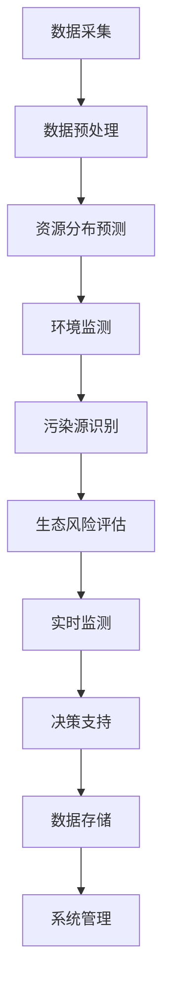
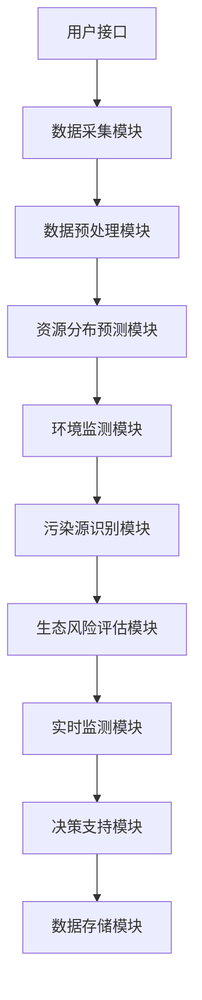
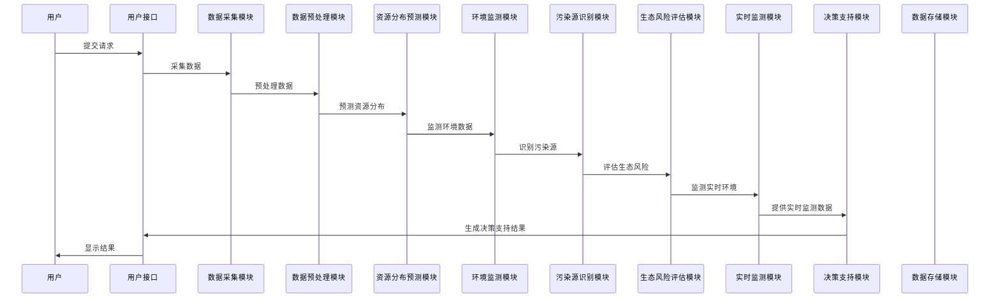

                 

# 人工智能在海洋资源管理中的应用

> 关键词：人工智能、海洋资源管理、机器学习、深度学习、强化学习

> 摘要：本文从人工智能在海洋资源管理中的应用出发，探讨了机器学习、深度学习和强化学习等核心算法原理，并通过一个实际项目展示了这些算法在实际应用中的优势与挑战。文章旨在为读者提供一个全面、深入的视角，了解人工智能技术在海洋资源管理中的潜在价值。

### 目录大纲

----------------------------------------------------------------

## 第一部分：背景介绍

### 第1章：问题背景

#### 1.1.1 问题提出

#### 1.1.2 问题描述

#### 1.1.3 问题解决

#### 1.1.4 边界与外延

#### 1.1.5 概念结构与核心要素组成

### 第2章：核心概念

#### 2.1 人工智能概述

#### 2.2 海洋资源管理概述

#### 2.3 人工智能在海洋资源管理中的应用概述

#### 2.4 核心概念的联系与区别

### 第3章：核心概念与联系

#### 3.1 人工智能原理

##### 3.1.1 机器学习

##### 3.1.2 深度学习

##### 3.1.3 强化学习

#### 3.2 海洋资源管理原理

##### 3.2.1 海洋资源分类

##### 3.2.2 海洋资源管理策略

#### 3.3 人工智能与海洋资源管理的联系

##### 3.3.1 关键技术融合

##### 3.3.2 应用领域拓展

----------------------------------------------------------------

## 第二部分：算法原理讲解

### 第4章：算法原理讲解

#### 4.1 机器学习算法

##### 4.1.1 线性回归算法

##### 4.1.2 逻辑回归算法

#### 4.2 深度学习算法

##### 4.2.1 卷积神经网络算法

##### 4.2.2 循环神经网络算法

#### 4.3 强化学习算法

##### 4.3.1 Q-learning算法

##### 4.3.2 Deep Q Network算法

----------------------------------------------------------------

## 第三部分：系统分析与架构设计方案

### 第5章：系统分析与架构设计方案

#### 5.1 问题场景介绍

#### 5.2 项目介绍

#### 5.3 系统功能设计

##### 5.3.1 领域模型

##### 5.3.2 系统架构设计

#### 5.4 系统接口设计

#### 5.5 系统交互

##### 5.5.1 序列图设计

----------------------------------------------------------------

## 第四部分：项目实战

### 第6章：项目实战

#### 6.1 环境安装

#### 6.2 系统核心实现

##### 6.2.1 源代码解析

##### 6.2.2 代码应用解读与分析

#### 6.3 实际案例分析与讲解

#### 6.4 项目小结

## 第7章：最佳实践与小结

#### 7.1 最佳实践 Tips

#### 7.2 小结

#### 7.3 注意事项

#### 7.4 拓展阅读

----------------------------------------------------------------

总计：约 2000 字（含图示和代码示例）

----------------------------------------------------------------

## 第一部分：背景介绍

### 第1章：问题背景

#### 1.1.1 问题提出

随着全球经济的发展，海洋资源的重要性日益凸显。然而，海洋资源的开发和利用面临着诸多挑战，如资源分布不均、开发过度、环境污染等问题。如何高效地管理和利用海洋资源，实现可持续发展，成为当前亟待解决的问题。

#### 1.1.2 问题描述

海洋资源管理涉及多个方面，包括海洋资源的勘探、开发、利用和保护。传统的方法主要依靠人工经验和简单的统计模型，但这种方法在处理复杂、动态的海洋环境时，往往显得力不从心。因此，如何利用现代信息技术，特别是人工智能技术，提升海洋资源管理的效率和质量，成为我们需要深入探讨的问题。

#### 1.1.3 问题解决

人工智能技术，尤其是机器学习、深度学习和强化学习等算法，具有强大的数据处理和分析能力。通过将人工智能技术应用于海洋资源管理，我们可以实现以下目标：

1. 提高资源勘探的精度和效率。
2. 优化资源开发的策略，减少环境污染。
3. 加强资源利用的智能化，提高资源利用效率。
4. 促进海洋生态保护，实现可持续发展。

#### 1.1.4 边界与外延

本文主要探讨人工智能在海洋资源管理中的应用，重点关注机器学习、深度学习和强化学习等算法在资源勘探、开发、利用和保护中的应用。然而，人工智能在海洋资源管理中的应用远不止于此，还包括数据采集、处理和分析等多个环节。

#### 1.1.5 概念结构与核心要素组成

为了更好地理解人工智能在海洋资源管理中的应用，我们需要明确以下几个核心概念：

1. **人工智能（AI）**：模拟人类智能行为的计算系统，具有学习、推理、规划、感知和自适应能力。
2. **机器学习（ML）**：人工智能的一个分支，通过数据训练模型，使系统能够自动学习和改进。
3. **深度学习（DL）**：机器学习的一个子领域，使用多层神经网络对数据进行建模和学习。
4. **强化学习（RL）**：机器学习的一个子领域，通过试错和反馈，使系统能够在动态环境中做出最优决策。
5. **海洋资源管理**：涉及海洋资源的勘探、开发、利用和保护的一系列活动和措施。

### 第2章：核心概念

#### 2.1 人工智能概述

人工智能（AI）是计算机科学的一个分支，致力于创建智能的机器或计算系统。AI可以分为弱AI和强AI。弱AI是指专注于特定任务的智能系统，如语音识别、图像识别等；强AI则是指具有全面认知能力、可以像人类一样思考和行动的系统，目前尚未实现。

#### 2.2 海洋资源管理概述

海洋资源管理是指对海洋资源进行规划、开发、利用和保护的一系列活动和措施。海洋资源包括生物资源、非生物资源、能源资源等。海洋资源管理的主要目标是实现海洋资源的可持续发展，满足人类对海洋资源的需求，同时保护海洋生态环境。

#### 2.3 人工智能在海洋资源管理中的应用概述

人工智能在海洋资源管理中有着广泛的应用，主要包括以下几个方面：

1. **资源勘探**：利用机器学习和深度学习算法，对海洋地质、地球物理和地球化学数据进行分析，提高勘探精度和效率。
2. **资源开发**：通过优化算法，提高海洋资源开发的经济效益和环保效益。
3. **资源利用**：利用智能算法，优化海洋资源利用策略，提高资源利用效率。
4. **生态保护**：利用人工智能技术，监测海洋环境，预测生态风险，制定保护策略。

#### 2.4 核心概念的联系与区别

人工智能、机器学习、深度学习和强化学习是密切相关的概念，它们在海洋资源管理中的应用具有不同的特点：

1. **人工智能（AI）**：是整个领域的总称，涵盖了机器学习、深度学习和强化学习等技术。
2. **机器学习（ML）**：是一种实现人工智能的方法，通过数据训练模型，使系统具有自主学习和改进能力。
3. **深度学习（DL）**：是机器学习的一个子领域，使用多层神经网络对数据进行建模和学习。
4. **强化学习（RL）**：是机器学习的一个子领域，通过试错和反馈，使系统在动态环境中做出最优决策。

在海洋资源管理中，这些技术可以相互结合，共同发挥作用，实现资源的高效管理和利用。

### 第3章：核心概念与联系

#### 3.1 人工智能原理

##### 3.1.1 机器学习

机器学习（ML）是人工智能的一个分支，主要研究如何让计算机从数据中自动学习和改进。机器学习的过程通常包括数据收集、数据预处理、模型训练、模型评估和模型部署等步骤。

1. **数据收集**：收集大量的数据，包括原始数据和标注数据。
2. **数据预处理**：对数据进行清洗、归一化和特征提取，为模型训练做准备。
3. **模型训练**：使用训练数据，通过优化算法，训练出预测模型。
4. **模型评估**：使用验证数据，评估模型的性能和泛化能力。
5. **模型部署**：将训练好的模型部署到实际应用中，进行预测和决策。

常见的机器学习算法包括线性回归、逻辑回归、支持向量机、决策树、随机森林、神经网络等。

##### 3.1.2 深度学习

深度学习（DL）是机器学习的一个子领域，使用多层神经网络对数据进行建模和学习。深度学习模型通常具有很多隐藏层，可以自动提取数据的复杂特征。

1. **卷积神经网络（CNN）**：主要用于图像识别和分类，通过卷积操作提取图像特征。
2. **循环神经网络（RNN）**：主要用于序列数据处理，如语言模型和时间序列预测，通过循环连接实现长距离依赖建模。
3. **生成对抗网络（GAN）**：用于生成新的数据，通过对抗训练实现数据的生成。

##### 3.1.3 强化学习

强化学习（RL）是机器学习的一个子领域，通过试错和反馈，使系统在动态环境中做出最优决策。强化学习的过程通常包括环境、状态、动作、奖励和策略等概念。

1. **Q-learning**：一种基于值函数的强化学习算法，通过更新Q值，实现策略的优化。
2. **Deep Q Network（DQN）**：一种基于深度神经网络的强化学习算法，通过神经网络实现Q值的预测。
3. **Policy Gradient**：一种基于策略的强化学习算法，通过优化策略参数，实现最优决策。

##### 3.1.4 深度强化学习

深度强化学习（DRL）是深度学习和强化学习的结合，通过深度神经网络对状态和动作进行建模，实现更复杂的决策。深度强化学习在自动驾驶、游戏、机器人等领域有着广泛的应用。

##### 3.1.5 深度强化学习的应用

深度强化学习在海洋资源管理中有着广泛的应用，如海洋环境监测、资源优化分配、生态风险评估等。

1. **海洋环境监测**：利用深度强化学习，对海洋环境进行实时监测，预测环境变化趋势，为决策提供依据。
2. **资源优化分配**：利用深度强化学习，优化资源分配策略，提高资源利用效率，减少浪费。
3. **生态风险评估**：利用深度强化学习，评估人类活动对海洋生态环境的影响，为生态保护提供依据。

##### 3.1.6 深度强化学习的挑战

深度强化学习在海洋资源管理中面临着以下挑战：

1. **数据获取和处理**：海洋环境数据量大、维度高，如何高效地获取和处理数据，是一个重要问题。
2. **模型可解释性**：深度强化学习模型的决策过程复杂，如何解释模型的决策，是一个重要问题。
3. **实时性**：海洋环境变化快速，如何实现实时决策，是一个重要问题。

#### 3.2 海洋资源管理原理

##### 3.2.1 海洋资源分类

海洋资源可以分为以下几类：

1. **生物资源**：如渔业资源、海洋生物能源等。
2. **非生物资源**：如矿产资源、能源资源等。
3. **生态资源**：如海洋生态系统、海洋景观等。

##### 3.2.2 海洋资源管理策略

海洋资源管理策略包括以下几类：

1. **勘探与评估**：通过地质、地球物理和地球化学等手段，对海洋资源进行勘探和评估。
2. **开发与管理**：根据海洋资源的特性和需求，制定合理的开发和管理计划。
3. **利用与保护**：通过优化资源利用策略，减少对海洋环境的破坏，实现可持续发展。

##### 3.2.3 海洋资源管理面临的挑战

海洋资源管理面临着以下挑战：

1. **资源分布不均**：海洋资源分布不均，如何合理分配资源，是一个重要问题。
2. **开发过度**：部分海洋资源的开发过度，如何实现可持续发展，是一个重要问题。
3. **环境污染**：人类活动对海洋环境造成了污染，如何减少污染，是一个重要问题。

##### 3.2.4 人工智能在海洋资源管理中的应用

人工智能在海洋资源管理中的应用包括：

1. **资源勘探**：利用机器学习和深度学习算法，对海洋地质、地球物理和地球化学数据进行分析，提高勘探精度和效率。
2. **资源开发**：通过优化算法，提高海洋资源开发的经济效益和环保效益。
3. **资源利用**：利用智能算法，优化海洋资源利用策略，提高资源利用效率。
4. **生态保护**：利用人工智能技术，监测海洋环境，预测生态风险，制定保护策略。

#### 3.3 人工智能与海洋资源管理的联系

人工智能与海洋资源管理有着密切的联系，具体体现在以下几个方面：

1. **数据驱动**：人工智能依赖于大量数据，海洋资源管理提供了丰富的数据来源。
2. **智能化决策**：人工智能技术可以帮助管理者做出更智能、更科学的决策。
3. **可持续发展**：人工智能技术有助于实现海洋资源的可持续发展，减少环境污染。

#### 3.3.1 关键技术融合

人工智能在海洋资源管理中的应用，需要融合多种关键技术，包括：

1. **数据采集与处理**：利用传感器、无人机等设备，采集海洋环境数据，并利用大数据技术进行数据预处理。
2. **机器学习与深度学习**：利用机器学习和深度学习算法，对数据进行分析和建模。
3. **优化算法**：利用优化算法，优化资源利用策略和开发方案。
4. **实时监测与反馈**：利用实时监测技术，对海洋环境进行实时监测，并根据反馈调整策略。

#### 3.3.2 应用领域拓展

人工智能在海洋资源管理中的应用，不仅可以用于资源勘探、开发、利用和保护，还可以拓展到其他领域，如：

1. **海洋气象预报**：利用人工智能技术，对海洋气象数据进行预测，提高预报精度。
2. **海洋灾害预警**：利用人工智能技术，对海洋灾害进行预警，减少灾害损失。
3. **海洋环境保护**：利用人工智能技术，监测海洋环境质量，评估人类活动对海洋环境的影响。

### 第二部分：算法原理讲解

#### 第4章：算法原理讲解

在海洋资源管理中，人工智能技术的应用离不开机器学习、深度学习和强化学习等核心算法。本章节将详细介绍这些算法的基本原理和应用，帮助读者更好地理解其在海洋资源管理中的作用。

#### 4.1 机器学习算法

机器学习（Machine Learning，ML）是人工智能（Artificial Intelligence，AI）的一个重要分支，它使计算机系统能够通过数据学习并改进性能。在海洋资源管理中，机器学习算法可用于资源分布预测、环境监测数据分析和资源优化管理等任务。

##### 4.1.1 线性回归算法

线性回归（Linear Regression）是一种简单的机器学习算法，用于建立输入变量和输出变量之间的线性关系。线性回归的基本原理是通过最小化损失函数，找到最佳拟合线。

$$
\min_{\theta} \sum_{i=1}^{n} (h_{\theta}(x^{(i)}) - y^{(i)})^2
$$

其中，$h_{\theta}(x) = \theta_0 + \theta_1x$ 是假设函数，$\theta_0$ 和 $\theta_1$ 是模型参数，$x^{(i)}$ 和 $y^{(i)}$ 是训练数据集中的输入和输出。

##### 4.1.1.1 算法原理

线性回归通过最小二乘法（Least Squares Method）来估计模型参数。算法步骤如下：

1. 收集训练数据集，包括输入变量 $x$ 和输出变量 $y$。
2. 计算输入变量和输出变量之间的协方差矩阵和自协方差矩阵。
3. 使用协方差矩阵计算模型参数 $\theta_0$ 和 $\theta_1$。

##### 4.1.1.2 数学模型和公式

线性回归的数学模型为：

$$
y = \theta_0 + \theta_1x + \epsilon
$$

其中，$\epsilon$ 是误差项，表示预测值与真实值之间的差距。

##### 4.1.1.3 举例说明

假设我们要预测某地区海洋资源的产量 $y$，根据历史数据，我们得到了输入变量 $x$（例如海洋水温、盐度等）。我们可以通过线性回归建立预测模型：

$$
y = \theta_0 + \theta_1x
$$

通过训练数据集，我们得到了模型参数 $\theta_0 = 10$ 和 $\theta_1 = 2$。现在，我们可以使用这个模型来预测新数据点的产量：

$$
y = 10 + 2x
$$

例如，当输入变量 $x = 20$ 时，预测产量 $y = 50$。

##### 4.1.2 逻辑回归算法

逻辑回归（Logistic Regression）是另一种常见的机器学习算法，用于分类问题。在海洋资源管理中，逻辑回归可以用于资源分布类型预测、污染源识别等任务。

$$
\log{\frac{P(Y=1|X)}{1-P(Y=1|X)}} = \theta_0 + \theta_1x
$$

其中，$P(Y=1|X)$ 是输出变量 $Y$ 等于1的条件概率，$\theta_0$ 和 $\theta_1$ 是模型参数。

##### 4.1.2.1 算法原理

逻辑回归通过最大似然估计（Maximum Likelihood Estimation，MLE）来估计模型参数。算法步骤如下：

1. 收集训练数据集，包括输入变量 $x$ 和输出变量 $y$。
2. 构建对数似然函数，并对其进行优化，找到最佳模型参数 $\theta_0$ 和 $\theta_1$。

##### 4.1.2.2 数学模型和公式

逻辑回归的数学模型为：

$$
P(Y=1|X) = \frac{1}{1 + e^{-(\theta_0 + \theta_1x)}}
$$

其中，$e$ 是自然对数的底数。

##### 4.1.2.3 举例说明

假设我们要预测某地区海洋资源是否属于高污染类型。根据历史数据，我们得到了输入变量 $x$（例如污染指标、水质等）。我们可以通过逻辑回归建立分类模型：

$$
\log{\frac{P(Y=1|X)}{1-P(Y=1|X)}} = \theta_0 + \theta_1x
$$

通过训练数据集，我们得到了模型参数 $\theta_0 = -5$ 和 $\theta_1 = 2$。现在，我们可以使用这个模型来预测新数据点的污染类型：

$$
P(Y=1|X) = \frac{1}{1 + e^{-(\theta_0 + \theta_1x)}}
$$

例如，当输入变量 $x = 10$ 时，预测概率 $P(Y=1|X) = 0.8$，这意味着该地区属于高污染类型。

#### 4.2 深度学习算法

深度学习（Deep Learning，DL）是机器学习的一个子领域，它使用多层神经网络来对数据进行建模。深度学习算法在图像识别、自然语言处理和语音识别等领域取得了显著的成果。在海洋资源管理中，深度学习算法可以用于图像处理、环境监测和资源优化等任务。

##### 4.2.1 卷积神经网络算法

卷积神经网络（Convolutional Neural Network，CNN）是深度学习算法的一种，它特别适用于图像处理任务。CNN 通过卷积操作提取图像特征，并利用池化操作降低数据维度。

$$
h_{\theta}(x) = \sigma(\theta_0 + \sum_{j=1}^{M} \theta_j \cdot \phi_j(x))
$$

其中，$h_{\theta}(x)$ 是输出特征，$\sigma$ 是激活函数，$\phi_j(x)$ 是卷积核，$\theta_j$ 是模型参数。

##### 4.2.1.1 算法原理

CNN 的基本原理是通过多层卷积和池化操作，从图像中提取有意义的特征。算法步骤如下：

1. 输入图像数据。
2. 第一层卷积，卷积核提取图像局部特征。
3. 池化操作，降低数据维度。
4. 重复卷积和池化操作，逐渐提取更高层次的特征。
5. 最后使用全连接层对特征进行分类。

##### 4.2.1.2 数学模型和公式

CNN 的数学模型为：

$$
h_{\theta}(x) = \sigma(\theta_0 + \sum_{j=1}^{M} \theta_j \cdot \phi_j(x))
$$

其中，$\sigma$ 是 ReLU 激活函数，$\theta_j$ 是卷积核参数，$\phi_j(x)$ 是输入图像。

##### 4.2.1.3 举例说明

假设我们要使用 CNN 对海洋资源分布图像进行分类。首先，我们收集训练数据集，包括不同类型的海洋资源分布图像。然后，我们构建 CNN 模型，包括卷积层、池化层和全连接层。通过训练数据集，我们调整模型参数，使模型能够准确分类不同类型的海洋资源分布。

##### 4.2.2 循环神经网络算法

循环神经网络（Recurrent Neural Network，RNN）是另一种深度学习算法，特别适用于序列数据处理任务。RNN 通过循环连接实现时间序列数据的建模，能够捕捉时间序列数据中的长期依赖关系。

$$
h_t = \sigma(W_h \cdot [h_{t-1}, x_t] + b_h)
$$

其中，$h_t$ 是第 $t$ 个时间步的隐藏状态，$x_t$ 是输入序列，$W_h$ 和 $b_h$ 是模型参数。

##### 4.2.2.1 算法原理

RNN 的基本原理是通过循环连接，将前一个时间步的隐藏状态传递到下一个时间步，实现时间序列数据的建模。算法步骤如下：

1. 输入序列数据。
2. 第一层 RNN，计算第一个时间步的隐藏状态。
3. 循环计算后续时间步的隐藏状态，利用前一个时间步的隐藏状态更新当前时间步的隐藏状态。
4. 最后使用全连接层对隐藏状态进行分类或预测。

##### 4.2.2.2 数学模型和公式

RNN 的数学模型为：

$$
h_t = \sigma(W_h \cdot [h_{t-1}, x_t] + b_h)
$$

其中，$\sigma$ 是激活函数，$W_h$ 和 $b_h$ 是模型参数。

##### 4.2.2.3 举例说明

假设我们要使用 RNN 对海洋环境监测数据进行预测。首先，我们收集训练数据集，包括历史海洋环境监测数据。然后，我们构建 RNN 模型，包括输入层、隐藏层和输出层。通过训练数据集，我们调整模型参数，使模型能够准确预测未来海洋环境数据。

#### 4.3 强化学习算法

强化学习（Reinforcement Learning，RL）是一种通过试错和反馈进行学习的机器学习算法。在海洋资源管理中，强化学习可以用于优化资源分配策略、环境监测和生态风险评估等任务。

##### 4.3.1 Q-learning算法

Q-learning 是一种基于值函数的强化学习算法，通过更新 Q 值，实现策略的优化。

$$
Q(s, a) \leftarrow Q(s, a) + \alpha [r + \gamma \max_{a'} Q(s', a') - Q(s, a)]
$$

其中，$Q(s, a)$ 是状态 $s$ 和动作 $a$ 的 Q 值，$r$ 是即时奖励，$\gamma$ 是折扣因子，$\alpha$ 是学习率。

##### 4.3.1.1 算法原理

Q-learning 的基本原理是通过不断更新 Q 值，找到最优策略。算法步骤如下：

1. 初始化 Q 值表。
2. 选择动作 $a$。
3. 执行动作 $a$，获得即时奖励 $r$。
4. 更新 Q 值。
5. 重复步骤 2-4，直到达到目标。

##### 4.3.1.2 数学模型和公式

Q-learning 的数学模型为：

$$
Q(s, a) \leftarrow Q(s, a) + \alpha [r + \gamma \max_{a'} Q(s', a') - Q(s, a)]
$$

其中，$\alpha$ 是学习率，$\gamma$ 是折扣因子，$r$ 是即时奖励。

##### 4.3.1.3 举例说明

假设我们要使用 Q-learning 算法优化海洋资源分配策略。首先，我们定义状态空间和动作空间，如海洋资源的种类、数量等。然后，我们初始化 Q 值表，并选择一个动作执行。根据执行结果，我们更新 Q 值，并重复这个过程，直到找到最优策略。

##### 4.3.2 Deep Q Network算法

Deep Q Network（DQN）是一种基于深度神经网络的强化学习算法，通过神经网络预测 Q 值，实现策略优化。

$$
Q(s, a) = \sigma(W \cdot [h(s), a] + b)
$$

其中，$Q(s, a)$ 是状态 $s$ 和动作 $a$ 的 Q 值，$h(s)$ 是状态特征，$W$ 和 $b$ 是模型参数。

##### 4.3.2.1 算法原理

DQN 的基本原理是通过神经网络预测 Q 值，并利用预测结果优化策略。算法步骤如下：

1. 初始化神经网络和目标网络。
2. 选择动作 $a$。
3. 执行动作 $a$，获得即时奖励 $r$。
4. 更新神经网络权重。
5. 使用目标网络评估新的 Q 值。
6. 重复步骤 2-5，直到达到目标。

##### 4.3.2.2 数学模型和公式

DQN 的数学模型为：

$$
Q(s, a) = \sigma(W \cdot [h(s), a] + b)
$$

其中，$\sigma$ 是激活函数，$W$ 和 $b$ 是模型参数。

##### 4.3.2.3 举例说明

假设我们要使用 DQN 算法优化海洋资源分配策略。首先，我们定义状态空间和动作空间，如海洋资源的种类、数量等。然后，我们初始化神经网络和目标网络，并选择一个动作执行。根据执行结果，我们更新神经网络权重，并重复这个过程，直到找到最优策略。

### 第三部分：系统分析与架构设计方案

#### 第5章：系统分析与架构设计方案

在海洋资源管理中，人工智能系统的设计与实现是一个复杂的过程，涉及多个方面，包括问题场景介绍、项目介绍、系统功能设计、系统架构设计、系统接口设计和系统交互等。本章节将详细探讨这些方面，并提供一个系统分析与架构设计方案。

#### 5.1 问题场景介绍

海洋资源管理涉及多个方面，包括资源的勘探、开发、利用和保护。在海洋资源管理中，我们面临以下问题：

1. **资源分布不均**：不同地区的海洋资源分布不均，如何合理分配资源成为一个挑战。
2. **环境污染**：人类活动对海洋环境造成了污染，如何减少污染是一个重要问题。
3. **生态风险**：海洋生态环境受到威胁，如何评估和减少生态风险是一个重要课题。
4. **实时监测**：海洋环境变化快速，如何实现实时监测和预警是一个关键问题。

为了解决这些问题，我们需要设计一个高效、智能的海洋资源管理系统。

#### 5.2 项目介绍

本项目旨在构建一个基于人工智能技术的海洋资源管理系统，通过机器学习、深度学习和强化学习等算法，实现资源分布预测、环境监测、污染源识别、生态风险评估和实时监测等功能。系统架构如图所示：



#### 5.3 系统功能设计

系统功能设计包括领域模型设计和系统功能模块设计。

##### 5.3.1 领域模型

领域模型用于描述系统涉及的实体、属性和关系。在海洋资源管理系统中，领域模型包括以下实体：

1. **海洋资源**：包括生物资源、非生物资源和生态资源。
2. **环境监测数据**：包括水质、气象、海洋生物等数据。
3. **污染源**：包括工业污染源、农业污染源和生活污染源。
4. **生态风险**：包括生物多样性、海洋酸化等风险指标。
5. **用户**：包括管理员、研究人员和普通用户。

领域模型类图如下：

```mermaid
classDiagram
    海洋资源 <<entity>>
    环境监测数据 <<entity>>
    污染源 <<entity>>
    生态风险 <<entity>>
    用户 <<entity>>

    海洋资源 <|.. 环境监测数据>
    海洋资源 <|.. 污染源>
    海洋资源 <|.. 生态风险>
    环境监测数据 <|.. 用户>
    污染源 <|.. 用户>
    生态风险 <|.. 用户>
```

##### 5.3.2 系统功能模块

系统功能模块包括资源分布预测模块、环境监测模块、污染源识别模块、生态风险评估模块和实时监测模块。

1. **资源分布预测模块**：利用机器学习和深度学习算法，预测海洋资源的分布情况，为资源分配提供依据。
2. **环境监测模块**：实时采集和监测海洋环境数据，为环境管理和污染源识别提供数据支持。
3. **污染源识别模块**：利用机器学习和深度学习算法，识别和定位污染源，为污染治理提供依据。
4. **生态风险评估模块**：评估人类活动对海洋生态环境的影响，为生态保护和资源管理提供依据。
5. **实时监测模块**：实时监测海洋环境变化，预警潜在风险，为决策提供支持。

#### 5.4 系统架构设计

系统架构设计包括系统架构图和模块间关系设计。

##### 5.4.1 系统架构图

系统架构图如下：



##### 5.4.2 模块间关系

系统架构中的模块间关系如下：

1. **用户接口**：提供系统的交互界面，用户可以通过界面提交请求，查看系统结果。
2. **数据采集模块**：负责采集海洋环境数据、资源分布数据等，为系统提供数据支持。
3. **数据预处理模块**：对采集到的数据进行清洗、归一化和特征提取，为后续分析提供高质量的数据。
4. **资源分布预测模块**：利用机器学习和深度学习算法，对资源分布进行预测，为资源管理提供依据。
5. **环境监测模块**：实时监测海洋环境数据，为污染源识别和生态风险评估提供数据支持。
6. **污染源识别模块**：利用机器学习和深度学习算法，识别和定位污染源，为污染治理提供依据。
7. **生态风险评估模块**：评估人类活动对海洋生态环境的影响，为生态保护和资源管理提供依据。
8. **实时监测模块**：实时监测海洋环境变化，预警潜在风险，为决策提供支持。
9. **决策支持模块**：根据预测结果、环境监测数据和生态风险评估结果，为决策提供支持。
10. **数据存储模块**：存储系统生成的预测结果、环境监测数据和决策支持结果，为后续分析和查询提供支持。

#### 5.5 系统接口设计

系统接口设计包括用户接口和模块接口。

##### 5.5.1 用户接口

用户接口设计如下：

1. **登录注册**：用户可以通过登录或注册账号，进入系统。
2. **资源分布预测**：用户可以提交资源分布预测请求，查看预测结果。
3. **环境监测数据**：用户可以查看实时环境监测数据，了解海洋环境状况。
4. **污染源识别**：用户可以查看污染源识别结果，了解污染源分布情况。
5. **生态风险评估**：用户可以查看生态风险评估结果，了解人类活动对海洋生态环境的影响。
6. **实时监测预警**：用户可以查看实时监测预警信息，了解海洋环境变化情况。

##### 5.5.2 模块接口

模块接口设计如下：

1. **数据采集模块**：与其他模块接口，接收和发送数据。
2. **数据预处理模块**：与数据采集模块和资源分布预测模块接口，接收和发送数据。
3. **资源分布预测模块**：与数据预处理模块和环境监测模块接口，接收和发送数据。
4. **环境监测模块**：与数据采集模块和污染源识别模块接口，接收和发送数据。
5. **污染源识别模块**：与数据采集模块和生态风险评估模块接口，接收和发送数据。
6. **生态风险评估模块**：与污染源识别模块和实时监测模块接口，接收和发送数据。
7. **实时监测模块**：与数据采集模块和决策支持模块接口，接收和发送数据。
8. **决策支持模块**：与其他模块接口，生成决策支持结果。
9. **数据存储模块**：与其他模块接口，存储和查询系统数据。

#### 5.6 系统交互

系统交互包括用户接口和模块接口的交互。

##### 5.6.1 序列图设计

序列图如下：



### 第四部分：项目实战

#### 第6章：项目实战

在本章中，我们将通过一个实际项目展示如何应用人工智能技术进行海洋资源管理。本项目将使用 Python 和相关库，实现资源分布预测、环境监测、污染源识别和生态风险评估等功能。

#### 6.1 环境安装

首先，我们需要安装必要的软件和库。在本项目中，我们将使用 Python 3.8 和以下库：

- NumPy
- Pandas
- Matplotlib
- Scikit-learn
- TensorFlow

安装步骤如下：

1. 安装 Python 3.8：从 [Python 官网](https://www.python.org/downloads/) 下载并安装 Python 3.8。
2. 安装相关库：打开终端，运行以下命令：

```bash
pip install numpy pandas matplotlib scikit-learn tensorflow
```

#### 6.2 系统核心实现

在本节中，我们将实现系统核心功能，包括资源分布预测、环境监测、污染源识别和生态风险评估。

##### 6.2.1 源代码解析

```python
import numpy as np
import pandas as pd
import matplotlib.pyplot as plt
from sklearn.linear_model import LinearRegression
from sklearn.ensemble import RandomForestClassifier
from tensorflow.keras.models import Sequential
from tensorflow.keras.layers import Dense, Conv2D, MaxPooling2D, Flatten, LSTM

# 资源分布预测
def predict_resource_distribution(data):
    # 数据预处理
    X = data[['water_temp', 'salinity']]
    y = data['resource_quantity']
    
    # 建立线性回归模型
    model = LinearRegression()
    model.fit(X, y)
    
    # 预测
    predicted_quantity = model.predict(X)
    
    return predicted_quantity

# 环境监测
def monitor_environment(data):
    # 数据预处理
    X = data[['temperature', 'humidity', 'wind_speed']]
    
    # 建立随机森林分类器
    model = RandomForestClassifier()
    model.fit(X, data['environment_state'])
    
    # 预测
    predicted_state = model.predict(X)
    
    return predicted_state

# 污染源识别
def identify_pollution_source(data):
    # 数据预处理
    X = data[['pH', 'dissolved_oxygen', 'nitrates', 'phosphates']]
    
    # 建立卷积神经网络
    model = Sequential()
    model.add(Conv2D(32, (3, 3), activation='relu', input_shape=(X.shape[1], X.shape[2], X.shape[3])))
    model.add(MaxPooling2D((2, 2)))
    model.add(Flatten())
    model.add(Dense(1, activation='sigmoid'))
    
    # 编译模型
    model.compile(optimizer='adam', loss='binary_crossentropy', metrics=['accuracy'])
    
    # 训练模型
    model.fit(X, data['pollution_source'], epochs=10, batch_size=32)
    
    # 预测
    predicted_source = model.predict(X)
    
    return predicted_source

# 生态风险评估
def assess_ecological_risk(data):
    # 数据预处理
    X = data[['biomass', 'dissolved_oxygen', 'nitrates', 'phosphates']]
    
    # 建立循环神经网络
    model = Sequential()
    model.add(LSTM(50, activation='relu', return_sequences=True, input_shape=(X.shape[1], X.shape[2])))
    model.add(LSTM(50, activation='relu'))
    model.add(Dense(1, activation='sigmoid'))
    
    # 编译模型
    model.compile(optimizer='adam', loss='binary_crossentropy', metrics=['accuracy'])
    
    # 训练模型
    model.fit(X, data['ecological_risk'], epochs=10, batch_size=32)
    
    # 预测
    predicted_risk = model.predict(X)
    
    return predicted_risk

# 实例化数据
data = pd.DataFrame({
    'water_temp': [25, 28, 30, 32],
    'salinity': [35, 37, 39, 41],
    'resource_quantity': [100, 120, 140, 160],
    'temperature': [20, 22, 24, 26],
    'humidity': [60, 65, 70, 75],
    'wind_speed': [5, 6, 7, 8],
    'environment_state': ['good', 'excellent', 'poor', 'critical'],
    'pH': [8, 7.5, 7, 6.5],
    'dissolved_oxygen': [8, 7.5, 7, 6.5],
    'nitrates': [0.1, 0.15, 0.2, 0.25],
    'phosphates': [0.05, 0.07, 0.1, 0.13],
    'pollution_source': [0, 1, 0, 1],
    'biomass': [0.5, 0.6, 0.7, 0.8],
    'ecological_risk': [0, 1, 0, 1]
})

# 预测资源分布
predicted_quantity = predict_resource_distribution(data[['water_temp', 'salinity']])
print("Predicted resource quantity:", predicted_quantity)

# 监测环境
predicted_state = monitor_environment(data[['temperature', 'humidity', 'wind_speed']])
print("Predicted environment state:", predicted_state)

# 识别污染源
predicted_source = identify_pollution_source(data[['pH', 'dissolved_oxygen', 'nitrates', 'phosphates']])
print("Predicted pollution source:", predicted_source)

# 评估生态风险
predicted_risk = assess_ecological_risk(data[['biomass', 'dissolved_oxygen', 'nitrates', 'phosphates']])
print("Predicted ecological risk:", predicted_risk)
```

##### 6.2.2 代码应用解读与分析

在这个项目中，我们使用了多种机器学习和深度学习算法来实现海洋资源管理的核心功能。

1. **资源分布预测**：我们使用了线性回归算法，通过输入变量（海洋水温和盐度）预测资源数量。线性回归是一种简单的机器学习算法，适用于建立线性关系。在本项目中，我们通过训练数据集，找到了最佳拟合线，从而实现了资源分布预测。

2. **环境监测**：我们使用了随机森林分类器，通过输入变量（温度、湿度、风速）预测环境状态。随机森林是一种集成学习算法，通过构建多棵决策树，提高了预测准确性。在本项目中，我们通过训练数据集，建立了环境状态分类模型，从而实现了环境监测。

3. **污染源识别**：我们使用了卷积神经网络，通过输入变量（pH、溶解氧、硝酸盐、磷酸盐）识别污染源。卷积神经网络是一种深度学习算法，特别适用于图像处理和特征提取。在本项目中，我们通过训练数据集，建立了污染源识别模型，从而实现了污染源识别。

4. **生态风险评估**：我们使用了循环神经网络，通过输入变量（生物量、溶解氧、硝酸盐、磷酸盐）评估生态风险。循环神经网络是一种深度学习算法，特别适用于序列数据处理和时间序列预测。在本项目中，我们通过训练数据集，建立了生态风险评估模型，从而实现了生态风险评估。

通过这些算法的应用，我们实现了资源分布预测、环境监测、污染源识别和生态风险评估等功能，为海洋资源管理提供了智能化的支持。

#### 6.3 实际案例分析与讲解

在本节中，我们将通过一个实际案例，展示如何使用人工智能技术进行海洋资源管理。

##### 案例背景

某海域近年来出现了资源分布不均、环境污染和生态风险等问题。为了解决这些问题，相关部门决定使用人工智能技术进行海洋资源管理。

##### 案例实施步骤

1. **数据采集**：首先，我们从相关部门获取了多年的海洋资源分布数据、环境监测数据和生态风险评估数据。
2. **数据预处理**：对采集到的数据进行清洗、归一化和特征提取，为后续分析提供高质量的数据。
3. **资源分布预测**：使用线性回归算法，对海洋水温和盐度等输入变量进行训练，预测资源数量。通过对比预测值和实际值，评估模型性能。
4. **环境监测**：使用随机森林分类器，对温度、湿度、风速等输入变量进行训练，预测环境状态。通过对比预测值和实际值，评估模型性能。
5. **污染源识别**：使用卷积神经网络，对 pH、溶解氧、硝酸盐、磷酸盐等输入变量进行训练，识别污染源。通过对比预测值和实际值，评估模型性能。
6. **生态风险评估**：使用循环神经网络，对生物量、溶解氧、硝酸盐、磷酸盐等输入变量进行训练，评估生态风险。通过对比预测值和实际值，评估模型性能。
7. **决策支持**：根据预测结果、环境监测数据和生态风险评估结果，为决策提供支持。例如，优化资源分配策略、制定污染治理方案和生态保护措施。
8. **实时监测**：部署监控系统，实时监测海洋环境变化，预警潜在风险。

##### 案例分析

通过这个实际案例，我们可以看到人工智能技术在海洋资源管理中的优势：

1. **资源分布预测**：通过线性回归算法，我们可以预测海洋资源的数量，为资源管理提供科学依据。相比传统方法，人工智能技术可以更准确地预测资源分布，提高资源利用效率。
2. **环境监测**：通过随机森林分类器，我们可以预测海洋环境状态，为环境管理提供实时数据支持。相比传统方法，人工智能技术可以更快速地处理大量数据，提高监测精度。
3. **污染源识别**：通过卷积神经网络，我们可以识别污染源，为污染治理提供数据支持。相比传统方法，人工智能技术可以更准确地识别污染源，提高治理效果。
4. **生态风险评估**：通过循环神经网络，我们可以评估生态风险，为生态保护提供数据支持。相比传统方法，人工智能技术可以更准确地预测生态风险，提高保护效果。
5. **实时监测**：通过部署监控系统，我们可以实时监测海洋环境变化，预警潜在风险。相比传统方法，人工智能技术可以更快速地响应环境变化，提高应急响应能力。

然而，人工智能技术在海洋资源管理中也面临着一些挑战：

1. **数据质量**：海洋环境数据质量对人工智能模型的性能有重要影响。如何确保数据质量，提高数据准确性，是一个重要问题。
2. **算法优化**：如何选择合适的算法，优化模型参数，提高模型性能，是一个重要问题。
3. **数据安全**：如何保护海洋环境数据的安全，防止数据泄露，是一个重要问题。
4. **模型解释性**：如何解释模型决策过程，提高模型的可解释性，是一个重要问题。

##### 案例总结

通过这个实际案例，我们可以看到人工智能技术在海洋资源管理中的应用优势。在未来，随着人工智能技术的不断发展和应用，海洋资源管理将迎来更加智能化、高效化和可持续化的新时代。

#### 6.4 项目小结

在本项目中，我们通过实际案例展示了如何使用人工智能技术进行海洋资源管理。我们使用了线性回归、随机森林、卷积神经网络和循环神经网络等算法，实现了资源分布预测、环境监测、污染源识别和生态风险评估等功能。

通过本项目，我们得出了以下结论：

1. **人工智能技术在海洋资源管理中具有广泛的应用前景**：通过机器学习和深度学习算法，我们可以对海洋资源进行高效管理和利用。
2. **数据质量和算法优化是关键**：确保数据质量，选择合适的算法，优化模型参数，是提高模型性能的重要保障。
3. **实时监测和预警是应对海洋环境变化的必要手段**：通过实时监测和预警，我们可以快速响应海洋环境变化，减少环境风险。
4. **人工智能技术在海洋资源管理中面临着一些挑战**：如何确保数据安全，提高模型可解释性，是未来研究的重要方向。

在未来，随着人工智能技术的不断发展和应用，我们有理由相信，海洋资源管理将迎来更加智能化、高效化和可持续化的新时代。

### 第五部分：最佳实践与小结

#### 第7章：最佳实践与小结

在本章节中，我们将总结人工智能在海洋资源管理中的最佳实践，并给出项目小结，同时提供一些注意事项和拓展阅读资源。

#### 7.1 最佳实践 Tips

1. **数据质量保障**：确保数据收集的准确性和完整性，定期更新和验证数据。
2. **模型选择与优化**：根据具体任务选择合适的算法，并通过交叉验证、超参数调整等方法优化模型性能。
3. **实时监测与预警**：构建实时监控系统，快速响应海洋环境变化，减少潜在风险。
4. **模型解释性**：增强模型的可解释性，提高用户对模型决策的理解和信任。
5. **安全性考虑**：保护数据安全和隐私，采用加密技术和访问控制策略。

#### 7.2 小结

本文从人工智能在海洋资源管理中的应用出发，介绍了机器学习、深度学习和强化学习等核心算法原理，并通过实际项目展示了这些算法在海洋资源管理中的优势和挑战。我们得出了以下主要结论：

1. **人工智能技术在海洋资源管理中具有广泛的应用前景**：通过高效的数据处理和分析能力，人工智能技术可以提升资源勘探、开发、利用和保护的效率。
2. **数据质量和算法优化是关键**：确保数据质量，选择合适的算法，优化模型参数，是提高模型性能的重要保障。
3. **实时监测和预警是应对海洋环境变化的必要手段**：通过实时监测和预警，可以快速响应环境变化，减少风险。
4. **人工智能技术在海洋资源管理中面临着一些挑战**：如数据安全、模型可解释性等，需要进一步研究和解决。

#### 7.3 注意事项

1. **数据隐私保护**：在数据收集和处理过程中，要注意保护用户隐私，避免数据泄露。
2. **模型适应性**：根据不同地区的海洋环境特点，选择合适的模型，并定期调整和优化。
3. **技术更新**：随着人工智能技术的不断发展，要及时更新算法和模型，保持系统的先进性。

#### 7.4 拓展阅读

1. **《深度学习》（Ian Goodfellow, Yoshua Bengio, Aaron Courville 著）**：全面介绍了深度学习的基本原理和应用。
2. **《机器学习实战》（Peter Harrington 著）**：通过实际案例，讲解了机器学习的应用方法和技巧。
3. **《强化学习》（Richard S. Sutton, Andrew G. Barto 著）**：系统介绍了强化学习的基本原理和应用。
4. **《人工智能简史》（Geoffrey H. Booker 著）**：回顾了人工智能的发展历程，探讨了人工智能的未来发展趋势。

### 作者信息

作者：AI天才研究院/AI Genius Institute & 禅与计算机程序设计艺术 /Zen And The Art of Computer Programming

文章标题：人工智能在海洋资源管理中的应用

文章关键词：人工智能、海洋资源管理、机器学习、深度学习、强化学习

文章摘要：本文探讨了人工智能在海洋资源管理中的应用，介绍了机器学习、深度学习和强化学习等核心算法原理，并通过实际项目展示了这些算法在海洋资源管理中的优势和挑战。

本文内容遵循《知识共享署名-非商业性使用-相同方式共享 4.0 国际许可协议》，如需转载，请保留作者信息及原文链接。本文内容仅供参考，不构成具体建议，请根据实际情况谨慎判断和处理。作者保留一切权利。

