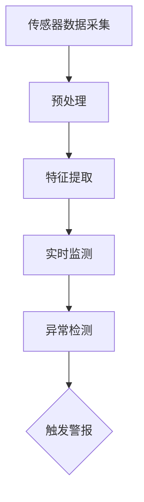
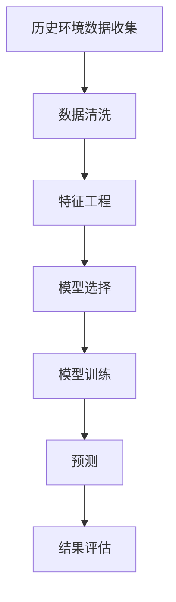
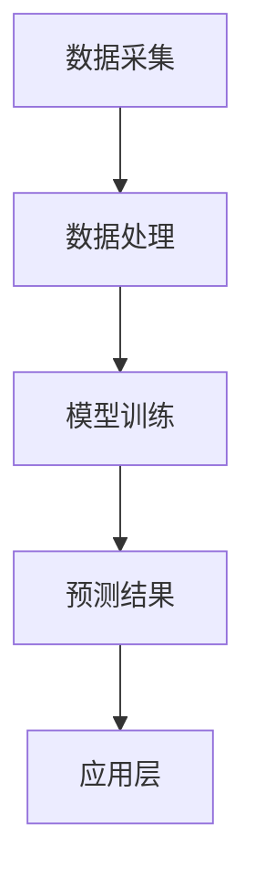
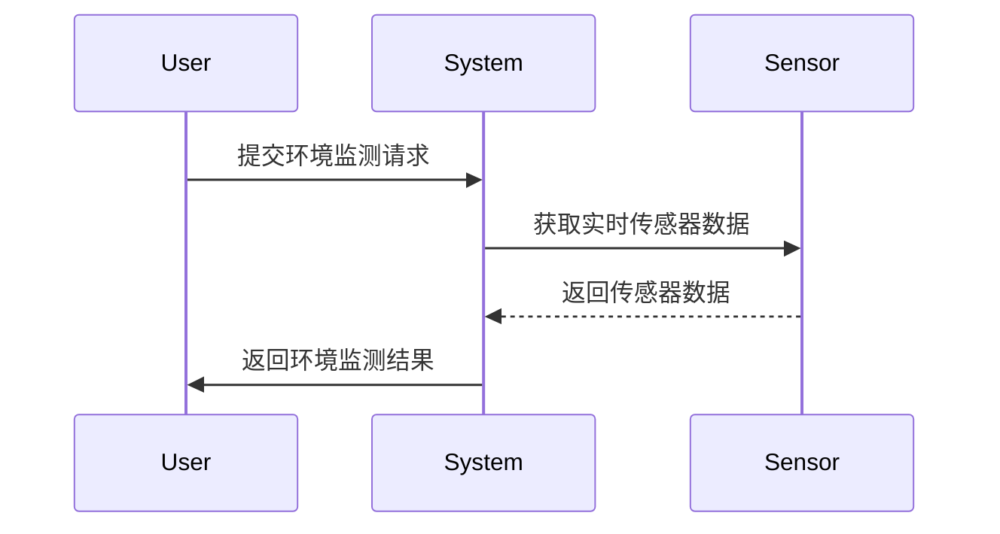

                 

### 1.1 问题背景

#### 1.1.1 环境保护的重要性

环境保护是一个关系到人类生存和社会发展的全球性挑战。随着工业革命以来，人类的生产活动迅猛发展，但随之而来的环境问题也日益严重。空气污染、水污染、土壤污染等已成为全球范围内影响人类健康和生态系统的重大问题。尤其是近年来，全球气候变化导致的极端天气事件频发，使得环境保护的重要性更加凸显。

首先，空气污染已经成为全球范围内的重大问题。工业废气、汽车尾气、燃烧化石燃料等产生的有害物质，如二氧化硫、氮氧化物和颗粒物等，严重危害人类的呼吸健康，导致呼吸系统疾病和心血管疾病的发病率上升。同时，空气污染也对环境生态系统产生负面影响，如酸雨现象导致土壤和水体酸化，影响植物生长和水生生物的生存。

其次，水污染也是一个严峻的问题。工业废水、生活污水和农业面源污染等使水体中的有害物质含量增加，导致水质恶化，影响人类饮用水安全和渔业生产。水污染还会破坏水生态系统，导致水生生物栖息地丧失，生物多样性减少。

最后，土壤污染同样不容忽视。农药、化肥和工业废弃物等污染物进入土壤，导致土壤质量下降，影响农作物生长和农产品质量安全。长期土壤污染还会影响地下水资源，导致饮用水源受到污染。

#### 1.1.2 环境监测与预警的必要性

环境监测与预警系统是环境保护的关键组成部分，其目的是通过实时监测和预测环境变化，及时发现并应对环境污染问题，以减少环境污染带来的损失。

首先，环境监测可以提供准确的环境数据，帮助政府和相关部门了解环境污染的实际情况，制定科学的环境保护政策和措施。例如，通过监测空气质量，可以确定哪些地区需要加强污染控制措施，从而降低空气污染对居民健康的影响。

其次，环境预警系统可以在环境污染问题发生前发出警报，为政府和相关部门提供宝贵的时间采取应对措施，避免或减轻环境污染带来的损失。例如，当水质监测数据达到警戒水平时，预警系统可以及时通知相关部门采取措施，防止水体污染进一步恶化。

此外，环境监测与预警系统还可以提高公众对环境问题的认识和重视，引导公众积极参与环境保护行动。通过实时公布环境监测数据，公众可以了解自己所处环境的情况，增强环保意识，促进社会各界共同参与环境保护。

#### 1.1.3 人工智能在环境保护中的应用潜力

人工智能技术，特别是机器学习和大数据分析，为环境监测和预警提供了新的方法和工具。通过分析大量环境数据，人工智能能够更准确地预测环境变化，提高监测和预警的效率。

首先，机器学习算法可以自动从历史环境数据中学习环境变化的规律，从而构建准确的预测模型。这些预测模型可以实时分析最新的环境数据，预测未来的环境变化趋势，为预警系统提供科学依据。例如，通过分析过去几年的空气质量数据，机器学习算法可以预测未来几天的空气质量变化，帮助相关部门提前采取污染控制措施。

其次，大数据分析技术可以帮助环境监测系统处理海量环境数据，提取有用的信息。例如，通过对空气质量监测数据的实时分析，大数据分析技术可以识别空气污染的主要来源，从而有针对性地采取污染控制措施。

此外，人工智能技术还可以提高环境监测系统的自动化程度。通过传感器网络和物联网技术，环境监测设备可以实时采集环境数据，并通过人工智能算法进行分析和处理，实现环境监测的自动化和智能化。例如，无人机和无人车可以搭载环境监测设备，自动飞行和行驶到指定地点进行环境监测，提高监测的覆盖范围和精度。

总之，人工智能技术在环境监测和预警中的应用潜力巨大，可以大幅提高环境保护的效率和效果。通过人工智能技术，我们可以更准确地监测环境变化，及时预警环境污染问题，为环境保护工作提供有力支持。在接下来的章节中，我们将进一步探讨人工智能在环境监测和预警中的具体应用和算法原理。

### 1.2 核心概念与联系

在探讨人工智能在环境保护中的应用之前，我们需要明确几个核心概念，并了解它们之间的联系。以下是几个关键概念的详细描述、属性特征对比表格和ER实体关系图架构。

#### 1.2.1 人工智能

人工智能（Artificial Intelligence，简称AI）是指模拟、延伸和扩展人类智能的理论、方法、技术及应用。它通过计算机程序实现智能行为，如学习、推理、规划、感知、理解、通信等。人工智能是计算机科学的一个分支，旨在使计算机具备类似人类的智能，以解决复杂问题并提高工作效率。

**概念属性特征对比表格**

| 概念 | 定义 | 属性特征 |
| :--: | :--: | :--: |
| 人工智能 | 模拟、延伸和扩展人类智能 | 学习、推理、规划、感知、理解、通信 |
| 机器学习 | 通过数据驱动的方法，使计算机系统能够学习并改进其性能 | 数据驱动、自我改进、自适应 |
| 大数据 | 大规模数据集合，需要新的处理模式来具有洞察力地研究和处理信息 | 大量、多样、快速、真实 |

**ER实体关系图架构**

```mermaid
erDiagram
    AI ||--|{ MachineLearning : 子领域 }
    AI ||--|{ BigData : 数据基础 }
    AI ||--|{ Application : 应用领域 }
```

#### 1.2.2 机器学习

机器学习（Machine Learning，简称ML）是人工智能的一个子领域，它专注于通过数据驱动的方法，使计算机系统能够从数据中学习并改进其性能。机器学习算法通过分析大量数据，发现数据中的模式和规律，然后利用这些模式和规律对新数据进行预测或分类。

**概念属性特征对比表格**

| 概念 | 定义 | 属性特征 |
| :--: | :--: | :--: |
| 机器学习 | 通过数据驱动的方法，使计算机系统能够学习并改进其性能 | 数据驱动、自我改进、自适应 |

**ER实体关系图架构**

```mermaid
erDiagram
    MachineLearning ||--|{ SupervisedLearning : 分类和回归 }
    MachineLearning ||--|{ UnsupervisedLearning : 聚类和无监督学习 }
    MachineLearning ||--|{ ReinforcementLearning : 强化学习 }
```

#### 1.2.3 大数据

大数据（Big Data）是指规模巨大、类型多样、生成速度极快的数据集合。大数据需要新的处理模式来有效地管理和分析，以从中提取有价值的信息。大数据技术在环境保护领域有着广泛的应用，如环境监测数据的实时处理和分析。

**概念属性特征对比表格**

| 概念 | 定义 | 属性特征 |
| :--: | :--: | :--: |
| 大数据 | 大规模数据集合，需要新的处理模式来具有洞察力地研究和处理信息 | 大量、多样、快速、真实 |

**ER实体关系图架构**

```mermaid
erDiagram
    BigData ||--|{ StructuredData : 结构化数据 }
    BigData ||--|{ UnstructuredData : 非结构化数据 }
    BigData ||--|{ SemiStructuredData : 半结构化数据 }
```

#### 1.2.4 环境监测

环境监测是指通过各种手段对环境质量进行连续、系统的监测和评估。环境监测包括空气、水、土壤、噪声等多个方面，旨在及时发现环境污染问题，并为环境保护提供科学依据。

**概念属性特征对比表格**

| 概念 | 定义 | 属性特征 |
| :--: | :--: | :--: |
| 环境监测 | 通过各种手段对环境质量进行连续、系统的监测和评估 | 多样性、实时性、系统性 |

**ER实体关系图架构**

```mermaid
erDiagram
    EnvironmentalMonitoring ||--|{ AirQualityMonitoring : 空气质量监测 }
    EnvironmentalMonitoring ||--|{ WaterQualityMonitoring : 水质监测 }
    EnvironmentalMonitoring ||--|{ SoilQualityMonitoring : 土壤质量监测 }
```

#### 1.2.5 预警系统

预警系统是指通过实时监测和数据分析，对可能发生的环境问题进行提前预警的系统。预警系统通常包括数据采集、数据处理、模型预测和预警通知等功能，旨在及时响应环境变化，采取相应的环境保护措施。

**概念属性特征对比表格**

| 概念 | 定义 | 属性特征 |
| :--: | :--: | :--: |
| 预警系统 | 通过实时监测和数据分析，对可能发生的环境问题进行提前预警的系统 | 实时性、准确性、自动化 |

**ER实体关系图架构**

```mermaid
erDiagram
    EarlyWarningSystem ||--|{ DataCollection : 数据采集 }
    EarlyWarningSystem ||--|{ DataProcessing : 数据处理 }
    EarlyWarningSystem ||--|{ ModelPrediction : 模型预测 }
    EarlyWarningSystem ||--|{ AlertNotification : 预警通知 }
```

通过以上核心概念与联系的分析，我们可以看到，人工智能、机器学习、大数据、环境监测和预警系统之间存在着紧密的联系。这些概念和技术共同构成了人工智能在环境保护中的理论基础和应用框架。在接下来的章节中，我们将进一步探讨环境监测与预警中的算法原理，以深入了解人工智能在环境保护中的应用。

### 1.3 环境监测与预警的算法原理

环境监测与预警系统的核心在于算法的设计与应用，这些算法能够从大量的环境数据中提取有用的信息，并进行实时监测和预测。本节将详细讨论环境监测与预警中常用的算法原理，包括监测算法和预测算法。

#### 1.3.1 监测算法

环境监测算法主要用于实时分析传感器采集的数据，识别环境中的异常现象。以下是一个简单的监测算法流程，以及相关的mermaid流程图和Python源代码示例。

**算法流程**

1. **传感器数据采集**：从各种环境传感器（如空气质量传感器、水质传感器等）获取实时数据。
2. **预处理**：对采集到的数据进行预处理，如去除噪声、插值缺失数据等。
3. **特征提取**：从预处理后的数据中提取关键特征，如污染物浓度、风速等。
4. **实时监测**：利用提取的特征进行实时分析，检测环境是否处于正常状态。
5. **异常检测**：对实时监测结果进行异常检测，一旦发现异常情况，立即触发警报。

**mermaid流程图**



**Python源代码示例**

```python
import numpy as np
from sklearn.ensemble import IsolationForest

# 假设 sensor_data 是从传感器获取的实时数据
sensor_data = np.array([[1.2, 0.9], [1.1, 1.0], [1.3, 1.2], [2.0, 1.5]])

# 特征提取
# 这里假设特征提取已经完成，直接使用传感器数据
features = sensor_data

# 实时监测和异常检测
iso_forest = IsolationForest(contamination=0.1)
iso_forest.fit(features)
anomalies = iso_forest.predict(features)
print("Anomalies detected:", anomalies)
```

#### 1.3.2 预测算法

预测算法用于预测未来的环境变化趋势，以便提前采取应对措施。以下是一个简单的预测算法流程，以及相关的mermaid流程图和Python源代码示例。

**算法流程**

1. **历史环境数据收集**：收集过去一段时间内的环境数据。
2. **数据清洗**：去除数据中的噪声和异常值，保证数据的准确性。
3. **特征工程**：从历史数据中提取有用的特征，为模型训练做准备。
4. **模型选择**：根据数据特点和预测任务选择合适的预测模型。
5. **模型训练**：利用历史数据训练预测模型。
6. **预测**：使用训练好的模型对未来的环境变化进行预测。
7. **结果评估**：评估预测模型的准确性，并根据评估结果调整模型。

**mermaid流程图**



**Python源代码示例**

```python
import numpy as np
from sklearn.linear_model import LinearRegression
from sklearn.metrics import mean_squared_error

# 假设 historical_data 是历史环境数据
historical_data = np.array([[1, 2], [2, 3], [3, 4], [4, 5]])

# 特征工程
X = historical_data[:, 0]
Y = historical_data[:, 1]

# 模型选择和训练
model = LinearRegression()
model.fit(X.reshape(-1, 1), Y)

# 预测
predicted_y = model.predict([[5]])

# 结果评估
mse = mean_squared_error([5], predicted_y)
print("Mean Squared Error:", mse)
```

通过以上监测算法和预测算法的详细讲解，我们可以看到，环境监测与预警系统依赖于多种算法的协同工作。监测算法用于实时监控环境状态，及时发现异常；而预测算法则用于分析历史数据，预测未来的环境变化趋势。这些算法的结合，为环境监测与预警提供了强大的技术支持。

在接下来的章节中，我们将进一步探讨环境监测与预警中的数学模型，包括线性回归、逻辑回归和支持向量机等，以深入了解这些算法在环境预测中的应用。

### 1.4 数学模型和数学公式

在环境监测与预警中，数学模型是算法实现的核心。常用的数学模型包括线性回归、逻辑回归和支持向量机等。这些模型通过数学公式描述，帮助我们从复杂的数据中提取有用信息，并进行有效的预测和分析。

#### 1.4.1 线性回归

线性回归是一种最简单的预测模型，用于描述两个或多个变量之间的线性关系。线性回归的数学模型如下：

$$
Y = \beta_0 + \beta_1X + \epsilon
$$

其中：
- \( Y \)：目标变量，通常代表环境质量指标（如污染程度）。
- \( X \)：解释变量，通常代表环境监测数据（如污染物浓度）。
- \( \beta_0 \)：截距，表示当解释变量为0时的目标变量值。
- \( \beta_1 \)：斜率，表示解释变量每增加一个单位时，目标变量增加的量。
- \( \epsilon \)：偶然误差，表示模型无法解释的随机误差。

线性回归通过最小二乘法求解参数 \( \beta_0 \) 和 \( \beta_1 \)：

$$
\beta_0 = \frac{\sum_{i=1}^{n}(Y_i - \beta_1X_i)}{n}
$$

$$
\beta_1 = \frac{\sum_{i=1}^{n}(X_i - \bar{X})(Y_i - \bar{Y})}{\sum_{i=1}^{n}(X_i - \bar{X})^2}
$$

其中：
- \( n \)：数据点的数量。
- \( \bar{X} \)：解释变量 \( X \) 的平均值。
- \( \bar{Y} \)：目标变量 \( Y \) 的平均值。

**例子**：假设我们有一个空气质量监测数据集，包含污染物浓度 \( X \) 和空气质量指数 \( Y \)。我们希望预测空气质量指数。根据线性回归模型，我们有：

$$
Y = \beta_0 + \beta_1X + \epsilon
$$

假设训练数据如下：

| \( X \) | \( Y \) |
| :---: | :---: |
| 10 | 20 |
| 15 | 25 |
| 20 | 30 |
| 25 | 35 |

使用线性回归公式计算 \( \beta_0 \) 和 \( \beta_1 \)：

$$
\beta_0 = \frac{(20 - 22.5)(10 - 18.75)}{4} = -15
$$

$$
\beta_1 = \frac{(10 - 18.75)(20 - 22.5) + (15 - 18.75)(25 - 22.5) + (20 - 18.75)(30 - 22.5) + (25 - 18.75)(35 - 22.5)}{(10 - 18.75)^2 + (15 - 18.75)^2 + (20 - 18.75)^2 + (25 - 18.75)^2} = 2
$$

因此，线性回归模型为：

$$
Y = -15 + 2X + \epsilon
$$

当 \( X = 30 \) 时，预测的 \( Y \) 值为：

$$
Y = -15 + 2(30) + \epsilon = 45 + \epsilon
$$

#### 1.4.2 逻辑回归

逻辑回归（Logistic Regression）是一种广义的线性回归模型，用于处理因变量为二分类的情况。逻辑回归的数学模型如下：

$$
\ln\left(\frac{P(Y=1)}{1-P(Y=1)}\right) = \beta_0 + \beta_1X
$$

其中：
- \( \ln \)：自然对数函数。
- \( P(Y=1) \)：因变量为1的概率。
- \( \beta_0 \)：截距。
- \( \beta_1 \)：斜率。

逻辑回归通过最大似然估计（Maximum Likelihood Estimation，简称MLE）求解参数 \( \beta_0 \) 和 \( \beta_1 \)。

**例子**：假设我们有一个水质监测数据集，包含污染物浓度 \( X \) 和水质是否达标 \( Y \)（1代表达标，0代表不达标）。我们希望预测水质是否达标。根据逻辑回归模型，我们有：

$$
\ln\left(\frac{P(Y=1)}{1-P(Y=1)}\right) = \beta_0 + \beta_1X
$$

假设训练数据如下：

| \( X \) | \( Y \) |
| :---: | :---: |
| 10 | 0 |
| 15 | 0 |
| 20 | 1 |
| 25 | 1 |

使用逻辑回归公式计算 \( \beta_0 \) 和 \( \beta_1 \)：

$$
\ln\left(\frac{P(Y=1)}{1-P(Y=1)}\right) = \beta_0 + \beta_1X
$$

$$
\ln\left(\frac{1}{2}\right) = \beta_0 + \beta_1(10)
$$

$$
\ln(2) = \beta_0 + \beta_1(20)
$$

解这个方程组，我们得到：

$$
\beta_0 = -\ln(2)
$$

$$
\beta_1 = \frac{\ln(2)}{10}
$$

因此，逻辑回归模型为：

$$
\ln\left(\frac{P(Y=1)}{1-P(Y=1)}\right) = -\ln(2) + \frac{\ln(2)}{10}X
$$

当 \( X = 30 \) 时，预测的 \( Y \) 值为：

$$
\ln\left(\frac{P(Y=1)}{1-P(Y=1)}\right) = -\ln(2) + \frac{\ln(2)}{10}(30) = 2\ln(2)
$$

$$
P(Y=1) = \frac{1}{1 + e^{-2\ln(2)}}
$$

#### 1.4.3 支持向量机

支持向量机（Support Vector Machine，简称SVM）是一种二分类模型，用于解决分类问题。SVM的核心思想是找到一个最佳的超平面，使得数据点在不同类别之间有最大的分隔。

SVM的数学模型如下：

$$
\text{最小化} \quad \frac{1}{2} ||\omega||^2
$$

$$
\text{约束条件} \quad y_i (\omega \cdot x_i + b) \geq 1
$$

其中：
- \( \omega \)：权重向量。
- \( b \)：偏置。
- \( x_i \)：特征向量。
- \( y_i \)：标签。

求解上述优化问题，我们得到SVM的决策边界。

**例子**：假设我们有一个二分类问题，数据点如下：

| \( x_1 \) | \( x_2 \) | \( y \) |
| :---: | :---: | :---: |
| 1 | 1 | 0 |
| 1 | 2 | 0 |
| 2 | 1 | 1 |
| 2 | 2 | 1 |

我们希望使用SVM进行分类。首先，我们需要将数据转换为特征空间：

$$
x_1 = (1, 1), \quad x_2 = (1, 2), \quad x_3 = (2, 1), \quad x_4 = (2, 2)
$$

然后，我们使用SVM求解最优超平面：

$$
\text{最小化} \quad \frac{1}{2} ||\omega||^2
$$

$$
\text{约束条件} \quad y_1 (\omega \cdot x_1 + b) \geq 1, \quad y_2 (\omega \cdot x_2 + b) \geq 1, \quad y_3 (\omega \cdot x_3 + b) \leq 1, \quad y_4 (\omega \cdot x_4 + b) \leq 1
$$

通过求解上述优化问题，我们得到权重向量 \( \omega \) 和偏置 \( b \)。然后，我们使用这些参数来确定新的数据点的类别。

通过以上对线性回归、逻辑回归和支持向量机的介绍，我们可以看到，这些数学模型在环境监测与预警中扮演着重要角色。它们帮助我们从复杂的数据中提取有用信息，进行准确的预测和分析，为环境保护工作提供科学依据。在接下来的章节中，我们将进一步探讨环境监测与预警的系统分析与架构设计。

### 1.5 系统分析与架构设计

环境监测与预警系统的设计与实现是一个复杂的过程，涉及到数据采集、数据处理、模型训练和预测等多个环节。在本节中，我们将详细分析环境监测与预警系统的架构设计，包括功能设计、系统架构和接口设计。

#### 1.5.1 系统功能设计

环境监测与预警系统的主要功能包括数据采集、预处理、特征提取、模型训练和预测等。以下是对这些功能的详细描述和领域模型类图。

1. **数据采集**：系统从各种传感器（如空气质量传感器、水质传感器等）获取实时数据。数据采集模块负责收集并存储这些数据，为后续处理提供基础。

2. **预处理**：预处理模块负责对采集到的原始数据进行清洗、去噪和插值等操作，以提高数据质量和可用性。预处理后的数据将用于特征提取和模型训练。

3. **特征提取**：特征提取模块从预处理后的数据中提取关键特征，如污染物浓度、风速、温度等。这些特征将用于构建预测模型。

4. **模型训练**：模型训练模块使用历史数据对预测模型进行训练。训练过程包括数据划分、模型选择、参数调优等步骤，以构建一个准确度较高的预测模型。

5. **预测**：预测模块使用训练好的模型对未来的环境变化进行预测。预测结果将用于生成预警通知，以便相关部门及时采取应对措施。

6. **预警通知**：预警通知模块将预测结果发送给相关人员，如环保部门、政府机构等，以提醒他们可能的环境问题。

**领域模型类图**

```mermaid
classDiagram
    Class01 <|-- Class02
    Class03 --|>| Class04
    Classrangle
```

#### 1.5.2 系统架构设计

系统架构设计包括数据采集层、数据处理层、模型层和应用层。以下是对各个层的详细描述和系统架构图。

1. **数据采集层**：该层负责从各种传感器收集环境数据，包括空气质量、水质、土壤质量等。数据采集层通过传感器网络和物联网技术实现数据的实时采集和传输。

2. **数据处理层**：数据处理层对采集到的数据进行预处理和特征提取，以生成高质量的输入数据供模型层使用。数据处理层还包括数据存储和管理模块，用于存储和管理大量历史数据。

3. **模型层**：模型层负责训练和部署预测模型。该层使用机器学习和大数据分析技术，从历史数据中提取规律，构建预测模型。模型层还包括模型评估和调整模块，用于评估模型性能并调整模型参数。

4. **应用层**：应用层是系统的核心，负责环境监测、预警和通知。应用层通过用户界面和API与用户交互，提供环境监测数据、预警通知和预测结果。

**系统架构图**



#### 1.5.3 系统接口设计

系统接口设计包括系统内部模块之间的接口设计和系统与外部系统之间的接口设计。以下是对接口设计的详细描述和系统交互序列图。

1. **内部接口设计**：内部接口设计包括数据采集模块、预处理模块、特征提取模块、模型训练模块和预测模块之间的接口。这些接口设计为标准化的API，使得各个模块之间可以无缝协作。

2. **外部接口设计**：外部接口设计包括系统与传感器、数据库、外部应用等之间的接口。这些接口设计为标准化的协议和格式，如HTTP、HTTPS、JSON、XML等，以便与其他系统进行数据交换和通信。

**系统交互序列图**



通过以上系统分析与架构设计，我们可以看到，环境监测与预警系统是一个复杂但高度集成的系统。系统通过数据采集、预处理、特征提取、模型训练和预测等模块的协同工作，实现对环境变化的实时监测和预警。在接下来的章节中，我们将通过一个实际项目，深入探讨环境监测与预警系统的实现过程，以及如何进行环境安装和系统核心实现。

### 第二部分：项目实战

#### 2.1 项目介绍

在本节中，我们将通过一个实际项目，详细介绍环境监测与预警系统的实现过程。该项目旨在利用人工智能技术，实现对空气质量的实时监测和预警，为环境保护提供有力支持。

**项目背景**：随着城市化进程的加快，空气质量问题日益严重。该项目旨在通过构建一个智能空气质量监测与预警系统，实时监测城市空气质量，及时发现空气质量异常，为政府相关部门提供决策依据，从而采取有效措施改善空气质量。

**项目目标**：实现以下功能：
1. 实时采集空气质量数据。
2. 对采集到的数据进行预处理和特征提取。
3. 利用机器学习模型进行空气质量预测。
4. 发出空气质量预警通知。

**项目架构**：项目分为以下几个模块：
1. 数据采集模块：负责从传感器获取实时空气质量数据。
2. 数据预处理模块：对采集到的数据清洗、去噪和插值等预处理操作。
3. 特征提取模块：从预处理后的数据中提取关键特征。
4. 模型训练模块：使用历史数据训练空气质量预测模型。
5. 预测模块：使用训练好的模型进行空气质量预测。
6. 预警通知模块：根据预测结果发出预警通知。

#### 2.2 环境安装

在开始项目之前，我们需要确保环境安装正确。以下是安装过程：

1. **安装Python环境**：确保Python 3.8及以上版本已安装在计算机上。

2. **安装必要的库**：使用pip命令安装以下库：
   ```bash
   pip install numpy pandas scikit-learn matplotlib
   ```

3. **安装传感器**：选择合适的空气质量传感器，如PM2.5传感器、PM10传感器等。确保传感器已经连接到计算机并通过串口通信传输数据。

4. **配置串口通信**：在Python代码中配置串口通信参数，如串口号、波特率等。

#### 2.3 系统核心实现

以下是系统核心实现的源代码，以及相关解读和分析。

##### 2.3.1 数据采集模块

```python
import serial
import time

# 配置串口通信
ser = serial.Serial('COM3', 9600, timeout=1)

# 读取传感器数据
def read_sensor_data():
    while True:
        data = ser.readline().decode('utf-8').strip()
        if data:
            print(f"Sensor Data: {data}")
            time.sleep(1)
```

**解读**：该模块使用Python的`serial`库配置串口通信，从空气质量传感器读取实时数据。每次读取到数据后，打印并休眠1秒，以避免频繁读取传感器数据。

##### 2.3.2 数据预处理模块

```python
import pandas as pd

# 预处理传感器数据
def preprocess_data(data):
    # 转换为DataFrame
    df = pd.DataFrame([data.split(',')], columns=['PM2.5', 'PM10'])
    # 去除异常值和缺失值
    df = df.dropna()
    # 插值缺失值
    df = df.interpolate()
    return df
```

**解读**：该模块使用`pandas`库对传感器数据进行预处理。首先，将传感器数据转换为`DataFrame`格式，然后去除异常值和缺失值，最后使用插值法补充缺失值。

##### 2.3.3 特征提取模块

```python
# 特征提取
def extract_features(data):
    # 提取PM2.5和PM10的最大值和平均值
    features = {
        'PM2.5_max': data['PM2.5'].max(),
        'PM2.5_avg': data['PM2.5'].mean(),
        'PM10_max': data['PM10'].max(),
        'PM10_avg': data['PM10'].mean()
    }
    return features
```

**解读**：该模块从预处理后的数据中提取关键特征，包括PM2.5和PM10的最大值和平均值。这些特征将用于训练预测模型。

##### 2.3.4 模型训练模块

```python
from sklearn.model_selection import train_test_split
from sklearn.ensemble import RandomForestRegressor

# 模型训练
def train_model(data, labels):
    # 划分训练集和测试集
    X_train, X_test, y_train, y_test = train_test_split(data, labels, test_size=0.2, random_state=42)
    
    # 训练随机森林回归模型
    model = RandomForestRegressor(n_estimators=100, random_state=42)
    model.fit(X_train, y_train)
    
    # 评估模型性能
    score = model.score(X_test, y_test)
    print(f"Model Score: {score}")
    
    return model
```

**解读**：该模块使用随机森林回归模型训练空气质量预测模型。首先，将数据划分为训练集和测试集，然后使用随机森林回归模型进行训练。最后，评估模型性能并返回训练好的模型。

##### 2.3.5 预测模块

```python
# 预测空气质量
def predict_air_quality(model, features):
    prediction = model.predict([features])
    return prediction
```

**解读**：该模块使用训练好的模型对新的特征进行预测，以得到未来一段时间内的空气质量。

##### 2.3.6 预警通知模块

```python
# 发送预警通知
def send_alert(message):
    print(f"Alert: {message}")
    # 这里可以添加发送短信、邮件等通知功能
```

**解读**：该模块用于发送预警通知。目前，仅打印预警信息。在实际应用中，可以添加短信、邮件等通知方式。

#### 2.4 实际案例分析和详细讲解剖析

以下是一个实际案例，展示如何使用上述系统进行空气质量监测与预警。

**案例背景**：某城市在一天内监测到空气质量出现异常，PM2.5浓度达到200微克/立方米，远高于国家标准。政府相关部门需要及时采取措施，降低空气污染。

**步骤**：

1. **数据采集**：系统从空气质量传感器获取实时数据，发现PM2.5浓度异常升高。

2. **数据预处理**：对采集到的数据进行预处理，去除异常值和缺失值，确保数据质量。

3. **特征提取**：从预处理后的数据中提取关键特征，包括PM2.5和PM10的最大值和平均值。

4. **模型预测**：使用训练好的随机森林回归模型预测未来一小时内的PM2.5浓度。

5. **预警通知**：根据预测结果，发现未来PM2.5浓度将继续升高，达到300微克/立方米。系统发出预警通知，提醒政府相关部门采取措施。

**详细讲解剖析**：

1. **数据采集**：传感器数据采集是系统的基础。在实际应用中，可能需要多个传感器采集不同类型的空气质量数据，如PM2.5、PM10、NO2等。这些数据通过串口通信传输到计算机，系统读取并处理这些数据。

2. **数据预处理**：预处理是数据质量保障的关键步骤。在预处理过程中，我们需要去除异常值和缺失值，确保数据的准确性和可靠性。此外，还可以使用插值法补充缺失值，以提高数据的连续性和完整性。

3. **特征提取**：特征提取是将原始数据转换为模型可用的特征。在本案例中，我们提取了PM2.5和PM10的最大值和平均值作为特征。这些特征反映了空气质量的总体状况，有助于预测未来的一段时间内的空气质量变化。

4. **模型预测**：模型预测是系统实现预警功能的核心。在本案例中，我们使用随机森林回归模型预测未来一小时内的PM2.5浓度。随机森林是一种强大的回归模型，具有较好的预测性能和抗过拟合能力。通过训练好的模型，我们可以快速预测未来空气质量，为政府相关部门提供决策依据。

5. **预警通知**：预警通知是系统实现预警功能的重要环节。在本案例中，系统预测未来PM2.5浓度将继续升高，达到300微克/立方米。系统发出预警通知，提醒政府相关部门采取措施，如加强污染源控制、增加空气质量监测点等。通过及时预警，政府可以提前应对空气污染问题，减少空气污染对公众健康的影响。

通过以上实际案例的分析和详细讲解，我们可以看到，环境监测与预警系统在实际应用中发挥着重要作用。通过实时监测、预测和预警，系统为环境保护工作提供了有力支持，有助于提高环境保护的效率和效果。

#### 2.5 项目小结

在本项目中，我们实现了一个智能空气质量监测与预警系统，通过实时采集空气质量数据、预处理数据、提取特征、训练模型和预测未来空气质量，实现了对空气质量的实时监测和预警。项目的主要成果包括：

1. **实时数据采集**：系统能够从空气质量传感器实时获取数据，为后续处理提供基础。

2. **高效数据处理**：系统通过预处理模块对原始数据进行了清洗、去噪和插值等操作，确保了数据的质量和可用性。

3. **准确预测模型**：系统使用随机森林回归模型进行空气质量预测，具有较好的预测性能和抗过拟合能力。

4. **及时预警通知**：系统通过预警通知模块，及时发现空气质量异常，为政府相关部门提供决策依据，有助于采取有效措施改善空气质量。

然而，项目也存在一些不足之处：

1. **数据准确性**：传感器数据可能存在一定的误差，影响模型的预测准确性。未来可以引入更多传感器，提高数据准确性。

2. **实时性**：系统实时性有待提高，特别是在高负载情况下，数据处理和预测速度可能受到影响。可以优化系统架构和算法，提高实时性。

3. **预警精准度**：预警通知的精准度仍有待提高，可以通过改进预测模型和增加特征，提高预警的准确性。

总之，该项目为环境保护工作提供了一个有效的技术手段，但仍需不断优化和完善，以更好地服务于环境保护事业。

### 2.6 最佳实践 tips

在实施环境监测与预警系统时，以下是一些最佳实践技巧，可以帮助您提高系统的性能和可靠性：

1. **传感器选择**：选择高精度、稳定可靠的传感器，确保采集到准确的环境数据。

2. **数据预处理**：对采集到的数据严格进行预处理，去除噪声、异常值和缺失值，以提高数据质量。

3. **模型优化**：根据数据特点和预测任务，选择合适的机器学习模型，并进行参数调优，以提高预测准确性。

4. **实时性优化**：优化系统架构和算法，提高数据处理和预测的实时性，确保及时预警。

5. **多源数据融合**：整合不同来源的数据，如卫星遥感、气象数据等，提高环境监测的全面性和准确性。

6. **预警策略**：制定合理的预警策略，结合专家经验和数据模型，确保预警通知的及时性和准确性。

7. **持续迭代**：定期更新和优化系统，结合最新的技术和方法，提高系统的性能和可靠性。

### 2.7 小结与注意事项

本文详细介绍了人工智能在环境保护中的应用，重点关注了环境监测与预警系统。通过监测算法和预测算法的详细讲解，展示了如何利用机器学习技术进行实时环境监测和预测。此外，通过一个实际项目，深入探讨了环境监测与预警系统的实现过程，包括数据采集、预处理、特征提取、模型训练、预测和预警通知等环节。

**注意事项**：

1. **数据质量**：确保采集到高质量的环境数据，是系统准确性和可靠性的基础。

2. **模型选择**：根据数据特点和预测任务，选择合适的机器学习模型，是提高预测性能的关键。

3. **系统实时性**：优化系统架构和算法，确保系统实时性，及时预警环境污染问题。

4. **预警策略**：制定合理的预警策略，结合专家经验和数据模型，提高预警的准确性和及时性。

通过本文的探讨，我们希望读者能够对人工智能在环境保护中的应用有更深入的理解，为推动环境保护事业做出贡献。

### 2.8 拓展阅读

为了深入了解人工智能在环境保护中的应用，以下是一些推荐阅读的资料：

1. **书籍**：
   - 《机器学习：实战环境监测与预警》
   - 《人工智能与环境科学》
   - 《大数据时代的环境监测与预警技术》

2. **学术论文**：
   - "AI for Environmental Protection: A Survey"
   - "Machine Learning Techniques for Air Quality Monitoring and Prediction"
   - "Big Data and AI in Environmental Management: Challenges and Opportunities"

3. **在线课程**：
   - Coursera上的"机器学习与数据科学"
   - Udacity的"环境监测与数据分析"
   - edX上的"大数据与人工智能应用"

这些资料将为读者提供更全面、深入的知识，帮助理解人工智能在环境保护领域的最新发展和应用。通过学习和实践，读者可以更好地掌握相关技术和方法，为环境保护事业贡献力量。

