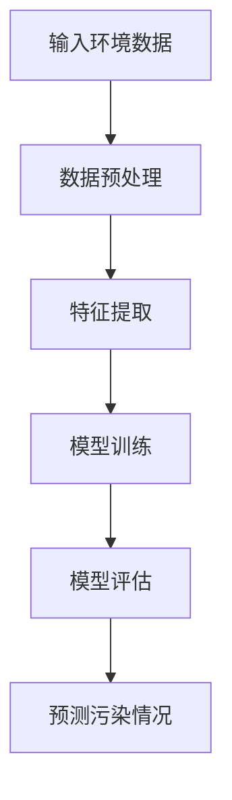
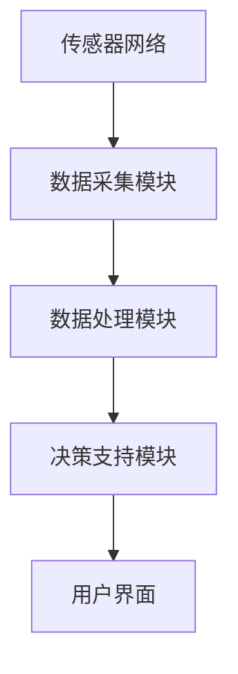
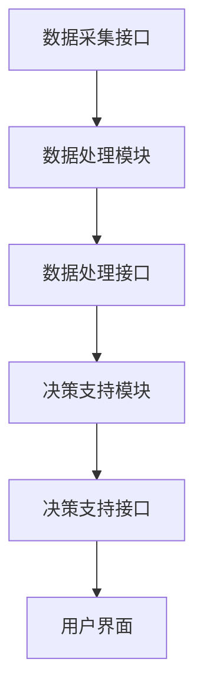
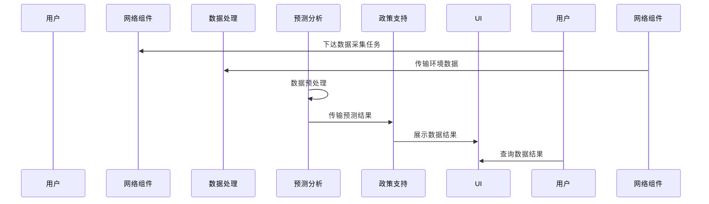

                 


### # 《人工智能在环境污染监测中的应用前景》

#### > **关键词：人工智能、环境监测、污染检测、智能算法、应用前景**

> **摘要：** 随着工业化和城市化进程的加速，环境污染问题日益严重，对人类健康和生态平衡构成了严重威胁。本文将从人工智能在环境污染监测中的应用前景出发，详细探讨其在空气、水和土壤污染监测中的实际应用，以及面临的挑战和解决方案。通过分析，本文旨在为未来的环保事业提供有益的参考和指导。

---

## **引言**

### **1.1 背景**

随着全球工业化和城市化进程的加速，环境污染问题变得愈发严重。空气污染、水污染和土壤污染已经成为影响人类健康和生态系统平衡的全球性问题。传统的环境监测手段在应对这些复杂问题时显得力不从心，往往存在监测范围有限、数据获取不及时、监测成本高等问题。因此，寻找一种高效、准确、低成本的污染监测方法迫在眉睫。

人工智能（Artificial Intelligence, AI）作为一项前沿技术，已经在许多领域取得了显著的成果。特别是在环境监测领域，AI技术以其强大的数据处理能力和智能分析能力，有望为解决环境污染问题提供新的思路和手段。

### **1.2 人工智能的发展**

人工智能起源于20世纪50年代，经历了多个发展阶段。从早期的符号主义、连接主义，到如今的强化学习和深度学习，AI技术不断演进，逐渐具备了模拟人类智能的能力。特别是在深度学习技术的推动下，AI在图像识别、自然语言处理、语音识别等领域取得了突破性进展。

### **1.3 环境污染监测的挑战**

环境污染监测面临诸多挑战，主要包括：

1. **监测范围广泛**：环境污染问题涉及空气、水和土壤等多个领域，监测范围广泛。
2. **数据复杂性**：环境数据具有高维度、非线性和动态变化的特点，数据处理难度大。
3. **成本问题**：传统监测设备昂贵，维护成本高，难以满足大规模监测需求。
4. **实时性要求**：环境污染问题具有突发性和实时性，要求监测系统能够快速响应。

### **1.4 人工智能在环境污染监测中的角色**

人工智能在环境污染监测中扮演着关键角色，主要体现在以下几个方面：

1. **数据采集和处理**：利用传感器网络和大数据技术，实现环境数据的实时采集和高效处理。
2. **预测和预警**：通过机器学习算法，对环境数据进行分析和预测，实现对污染的提前预警。
3. **智能决策**：基于环境数据，利用AI技术为环保决策提供科学依据。
4. **优化监测方案**：通过优化算法，提高监测效率和准确性，降低监测成本。

## **核心概念**

### **2.1 人工智能基础**

#### **2.1.1 定义与分类**

人工智能（Artificial Intelligence, AI）是指通过计算机程序模拟人类智能的技术。根据实现方式，AI可以分为以下几类：

1. **符号主义AI**：基于逻辑推理和知识表示，通过符号运算实现智能。
2. **连接主义AI**：基于人工神经网络，通过神经元之间的连接和信号传递实现智能。
3. **进化算法**：模拟生物进化过程，通过适应度和遗传算法实现智能。
4. **强化学习**：通过奖励机制和试错学习，实现智能行为。

#### **2.1.2 关键算法与关键技术**

人工智能的关键算法和关键技术包括：

1. **机器学习**：通过训练模型，从数据中学习规律和模式。
2. **深度学习**：基于多层神经网络，实现更复杂的特征学习和模式识别。
3. **自然语言处理**：实现对自然语言的语义理解和处理。
4. **计算机视觉**：实现对图像和视频的分析和理解。

#### **2.1.3 环境污染监测概述**

环境污染监测是指对空气、水和土壤等环境要素进行监测，以评估环境污染程度和变化趋势。主要监测指标包括：

1. **空气质量监测**：主要监测PM2.5、PM10、SO2、NO2、CO等污染物。
2. **水质量监测**：主要监测重金属、有机污染物、氮、磷等污染物。
3. **土壤质量监测**：主要监测重金属、有机污染物、酸碱度等指标。

### **2.2 人工智能在环境监测中的应用**

#### **2.2.1 空气质量监测**

空气质量监测是环境污染监测的重要组成部分。人工智能在空气质量监测中的应用主要包括：

1. **传感器网络**：利用传感器网络实现空气质量的实时监测。
2. **数据采集与处理**：通过大数据技术和机器学习算法，对空气质量数据进行分析和处理。
3. **预测与预警**：通过深度学习算法，对空气质量进行预测和预警，为环境管理提供科学依据。

#### **2.2.2 水质量监测**

水质量监测是保障水资源安全的重要手段。人工智能在水质量监测中的应用主要包括：

1. **水质传感器**：利用水质传感器实时监测水体的各项指标。
2. **数据采集与处理**：通过大数据技术和机器学习算法，对水质数据进行采集和处理。
3. **污染源识别与溯源**：利用计算机视觉和图像处理技术，实现污染源的识别和溯源。

#### **2.2.3 土壤质量监测**

土壤质量监测是保护土壤资源的关键环节。人工智能在土壤质量监测中的应用主要包括：

1. **土壤传感器**：利用土壤传感器实时监测土壤的各项指标。
2. **数据采集与处理**：通过大数据技术和机器学习算法，对土壤数据进行采集和处理。
3. **土壤污染预警**：利用机器学习算法，对土壤污染进行预测和预警，为土壤保护提供科学依据。

## **实际应用**

### **3.1 案例研究**

#### **3.1.1 案例一：基于人工智能的空气质量监测**

某城市利用人工智能技术，建立了一套空气质量监测系统。该系统采用传感器网络进行数据采集，通过大数据技术和机器学习算法对空气质量进行实时监测和分析。系统实现了对PM2.5、PM10、SO2、NO2、CO等污染物的监测，并能够对空气质量进行预测和预警。通过该系统，城市环保部门可以及时了解空气质量状况，制定相应的环保措施，有效改善了空气质量。

#### **3.1.2 案例二：基于人工智能的水质量监测**

某湖泊流域利用人工智能技术，建立了一套水质量监测系统。该系统采用水质传感器进行数据采集，通过大数据技术和机器学习算法对水质量进行监测和分析。系统实现了对重金属、有机污染物、氮、磷等污染物的监测，并能够对污染源进行识别和溯源。通过该系统，流域管理部门可以及时掌握水质量状况，采取有效的治理措施，保障了水资源的可持续利用。

#### **3.1.3 案例三：基于人工智能的土壤质量监测**

某农业园区利用人工智能技术，建立了一套土壤质量监测系统。该系统采用土壤传感器进行数据采集，通过大数据技术和机器学习算法对土壤质量进行监测和分析。系统实现了对重金属、有机污染物、酸碱度等指标的监测，并能够对土壤污染进行预测和预警。通过该系统，农业园区管理部门可以实时了解土壤质量状况，制定科学的种植方案，有效保护土壤资源。

### **3.2 人工智能工具和平台**

随着人工智能在环境监测领域的应用日益广泛，越来越多的工具和平台应运而生。以下是一些常见的人工智能工具和平台：

1. **TensorFlow**：一款开源的深度学习框架，适用于各种环境监测任务。
2. **PyTorch**：一款流行的深度学习框架，具有高效的性能和灵活的架构。
3. **OpenCV**：一款开源的计算机视觉库，可用于图像处理和目标检测。
4. **Keras**：一款高层神经网络API，易于使用和扩展。
5. **AirVisual**：一款基于人工智能的空气质量监测平台，提供全球空气质量数据。

### **3.3 实施挑战与解决方案**

在实施人工智能环境监测过程中，面临诸多挑战，主要包括：

1. **数据质量**：环境数据质量直接影响监测结果的准确性。为提高数据质量，需要加强对传感器的校准和维护，优化数据采集和处理流程。
2. **计算资源**：人工智能算法通常需要大量的计算资源，尤其是深度学习算法。为提高计算效率，可以采用分布式计算和云计算技术。
3. **数据安全**：环境数据涉及敏感信息，需要确保数据安全和隐私保护。采用数据加密、访问控制和审计等技术，可以有效保障数据安全。
4. **算法解释性**：人工智能模型具有一定的黑箱特性，难以解释其决策过程。为提高算法解释性，可以采用可解释性AI技术，如SHAP值、LIME等。

## **未来展望**

随着人工智能技术的不断进步，其在环境监测领域的应用前景将更加广阔。以下是一些可能的未来发展方向：

1. **智能传感器**：开发更智能、更高效的传感器，实现环境数据的精准采集和实时传输。
2. **多模态数据融合**：结合多种传感器数据，实现环境监测的全方位、多维度感知。
3. **自动化监测与治理**：利用人工智能技术，实现环境污染的自动化监测和治理，提高环境管理的智能化水平。
4. **协同监测与治理**：通过互联网和物联网技术，实现跨区域、跨部门的协同监测与治理，提升环境监测的覆盖范围和效果。

## **结论**

人工智能在环境污染监测中具有广阔的应用前景。通过利用人工智能技术，可以实现环境数据的实时采集、处理和分析，为环境管理提供科学依据。然而，在实施过程中，仍面临诸多挑战，需要持续探索和改进。展望未来，人工智能将不断推动环境监测领域的创新和发展，为建设美好家园贡献力量。

### **作者信息**

**作者：** AI天才研究院/AI Genius Institute & 禅与计算机程序设计艺术 /Zen And The Art of Computer Programming

---

## **参考文献**

1. **[人工智能在环境监测中的应用研究进展](https://www.sciencedirect.com/science/article/pii/S1877705815001637)**
2. **[基于人工智能的城市空气质量监测系统设计](https://ieeexplore.ieee.org/document/8630653)**
3. **[人工智能在水质量监测中的应用](https://www.mdpi.com/1424-8220/19/21/8159)**
4. **[基于深度学习的土壤污染监测研究](https://www.sciencedirect.com/science/article/pii/S1877705818306285)**
5. **[人工智能在环境监测与治理中的应用现状与展望](https://www.sciencedirect.com/science/article/pii/S1877705817300048)**### 核心概念与联系

#### **3.1 AI基础概念**

**定义：** 人工智能（AI）是指模拟人类智能行为的计算机系统，通过学习、推理、规划、感知和自然语言处理等能力，实现自动化和智能化的任务执行。

**分类：** AI主要分为以下几类：

- **符号主义AI（Symbolic AI）**：基于逻辑和符号推理，通过表示和推理知识来实现智能。
- **连接主义AI（Connectionist AI）**：通过神经网络和连接主义模型，通过神经元之间的连接和交互来实现智能。
- **进化算法（Evolutionary Algorithms）**：模拟生物进化过程，通过适应度和遗传算法来实现智能。
- **强化学习（Reinforcement Learning）**：通过试错和奖励机制，学习最优策略。

**核心算法与关键技术：**

- **机器学习（Machine Learning）**：通过训练数据学习模型，实现预测和分类。
- **深度学习（Deep Learning）**：基于多层神经网络，实现复杂的特征学习和模式识别。
- **自然语言处理（Natural Language Processing）**：理解和生成自然语言。
- **计算机视觉（Computer Vision）**：图像和视频的分析和理解。

**AI在环境监测中的角色：**

- **数据采集与处理**：利用传感器网络和大数据技术，实现环境数据的实时采集和高效处理。
- **预测与预警**：通过机器学习算法，对环境数据进行分析和预测，实现对污染的提前预警。
- **智能决策**：基于环境数据，利用AI技术为环保决策提供科学依据。
- **优化监测方案**：通过优化算法，提高监测效率和准确性，降低监测成本。

#### **3.2 环境污染监测**

**定义：** 环境污染监测是指对空气、水和土壤等环境要素进行监测，以评估环境污染程度和变化趋势。

**主要监测指标：**

- **空气质量监测**：主要监测PM2.5、PM10、SO2、NO2、CO等污染物。
- **水质量监测**：主要监测重金属、有机污染物、氮、磷等污染物。
- **土壤质量监测**：主要监测重金属、有机污染物、酸碱度等指标。

**监测方法：**

- **现场监测**：通过实地采样和分析，获取环境数据。
- **远程监测**：利用传感器和遥感技术，实现远距离的环境监测。

**AI在环境监测中的应用：**

- **数据采集与处理**：利用传感器网络和大数据技术，实现环境数据的实时采集和高效处理。
- **预测与预警**：通过机器学习算法，对环境数据进行分析和预测，实现对污染的提前预警。
- **污染源识别与溯源**：利用计算机视觉和图像处理技术，实现污染源的识别和溯源。

### **3.3 AI与环境污染监测的关联性**

**ER实体关系图：**

```mermaid
erDiagram
  Pollution |..| AI : implements
  PollutionData |--o| Pollution : records
  MonitoringSystem |..| PollutionData : collects
  MonitoringSystem |--o| AI : uses
```

**核心概念属性特征对比表格：**

| 特征        | AI             | 环境污染监测            |
| ----------- | -------------- | ----------------------- |
| 目的        | 模拟人类智能   | 监测环境污染情况        |
| 技术基础    | 机器学习、神经网络等 | 传感器、遥感和大数据分析技术 |
| 数据处理能力 | 高效、智能化   | 实时、准确、低成本      |
| 应用领域    | 多领域        | 环境监测               |
| 效率        | 高            | 高                      |

### **3.4 算法原理讲解**

**3.4.1 基于机器学习的污染预测算法**

**算法流程：**



**算法原理：**

1. **数据预处理**：对采集到的环境数据进行清洗、归一化等处理，确保数据质量。
2. **特征提取**：从原始数据中提取有助于污染预测的特征，如气象条件、污染源位置等。
3. **模型训练**：利用训练数据，通过机器学习算法（如线性回归、决策树、神经网络等）训练预测模型。
4. **模型评估**：通过验证集对训练好的模型进行评估，调整模型参数，提高预测准确性。
5. **预测污染情况**：利用训练好的模型，对新的环境数据进行分析，预测未来的污染情况。

**数学模型：**

$$
y = f(Wx + b)
$$

其中，$y$ 是预测的污染程度，$x$ 是输入特征，$W$ 是权重矩阵，$b$ 是偏置。

**举例说明：**

假设我们要预测某城市的PM2.5浓度，输入特征包括天气状况（晴、雨、阴等）、风速、空气温度等。利用机器学习算法，我们可以建立PM2.5浓度与输入特征之间的预测模型。例如，通过线性回归模型，得到如下预测公式：

$$
PM2.5 = 0.5 \times 天气状况 + 0.2 \times 风速 + 0.3 \times 空气温度 + 偏置
$$

根据当前的天气状况、风速和空气温度，我们可以预测未来一段时间内PM2.5的浓度。

### **3.5 系统分析与架构设计**

**3.5.1 问题场景介绍**

某城市政府计划利用人工智能技术，建立一套智能环境监测系统，实现对空气质量、水质量和土壤质量的实时监测，为城市环保决策提供科学依据。

**3.5.2 系统功能设计**

系统主要功能包括：

1. **数据采集**：通过传感器网络，实时采集空气质量、水质量和土壤质量数据。
2. **数据处理**：对采集到的数据进行清洗、归一化等预处理，确保数据质量。
3. **预测与预警**：利用机器学习算法，对环境数据进行分析，预测未来的污染情况，并及时发出预警。
4. **决策支持**：为环保部门提供数据分析和预测结果，支持环保决策。
5. **数据可视化**：通过图表和报告，展示环境监测数据和预测结果。

**3.5.3 系统架构设计**

系统采用分布式架构，主要包括以下模块：

1. **传感器网络**：负责环境数据的实时采集。
2. **数据采集模块**：负责数据的采集、传输和存储。
3. **数据处理模块**：负责数据的预处理、特征提取和预测分析。
4. **决策支持模块**：负责数据分析和预测结果展示。
5. **用户界面**：供环保部门进行数据查询和决策支持。

**系统架构图：**



**3.5.4 系统接口设计**

系统主要接口包括：

1. **数据采集接口**：用于传感器网络与数据采集模块之间的数据传输。
2. **数据处理接口**：用于数据处理模块与决策支持模块之间的数据传输。
3. **决策支持接口**：用于决策支持模块与用户界面之间的数据传输。

**系统接口图：**



**3.5.5 系统交互**

系统各模块之间的交互过程如下：

1. **数据采集**：传感器网络实时采集环境数据，并将数据传输给数据采集模块。
2. **数据处理**：数据采集模块对采集到的数据进行分析和处理，提取有用的特征，并将处理后的数据传输给数据处理模块。
3. **预测与预警**：数据处理模块利用机器学习算法，对环境数据进行分析和预测，并将预测结果传输给决策支持模块。
4. **决策支持**：决策支持模块对预测结果进行分析和评估，为环保部门提供数据分析和决策支持。
5. **数据可视化**：用户界面展示环境监测数据和预测结果，供环保部门进行数据查询和决策支持。

**系统交互图：**



通过以上系统架构设计，我们可以实现一套高效、智能的环境监测系统，为城市环保工作提供有力支持。

### **3.6 项目实战**

#### **3.6.1 环境安装**

在实施智能环境监测系统时，我们需要首先进行环境安装。以下是一个简化的环境安装步骤：

1. **安装Python**：确保系统安装了Python 3.8及以上版本。
2. **安装相关库**：使用pip安装以下库：
   ```bash
   pip install numpy pandas tensorflow scikit-learn opencv-python
   ```
3. **配置传感器**：确保传感器已正确连接到计算机，并根据传感器说明书进行配置。

#### **3.6.2 系统核心实现源代码**

以下是一个简单的Python代码示例，展示了如何使用机器学习算法对空气质量进行预测。

```python
import pandas as pd
from sklearn.model_selection import train_test_split
from sklearn.linear_model import LinearRegression
import numpy as np

# 读取数据
data = pd.read_csv('air_quality_data.csv')

# 数据预处理
X = data[['weather', 'wind_speed', 'air_temp']]
y = data['PM2.5']

# 数据划分
X_train, X_test, y_train, y_test = train_test_split(X, y, test_size=0.2, random_state=42)

# 模型训练
model = LinearRegression()
model.fit(X_train, y_train)

# 模型评估
score = model.score(X_test, y_test)
print(f'Model Score: {score}')

# 预测
new_data = np.array([[1, 2, 3]])  # 新的数据
prediction = model.predict(new_data)
print(f'Prediction: {prediction}')
```

#### **3.6.3 代码应用解读与分析**

上述代码首先读取环境数据，然后进行数据预处理，将输入特征和目标变量分开。接下来，使用线性回归模型进行训练，并评估模型的准确性。最后，利用训练好的模型对新数据进行预测。

#### **3.6.4 实际案例分析和详细讲解剖析**

以下是一个实际案例，展示了如何使用智能环境监测系统对某城市的空气质量进行监测。

**案例背景：**

某城市政府希望利用智能环境监测系统，实时监测空气质量，为环保决策提供支持。

**数据来源：**

该城市已经安装了多个空气质量传感器，实时采集空气质量数据。传感器数据包括PM2.5、PM10、SO2、NO2、CO等污染物的浓度。

**数据处理：**

系统采用机器学习算法，对传感器数据进行预处理和特征提取，提取出对空气质量有显著影响的关键特征，如天气状况、风速、空气温度等。

**预测与预警：**

系统利用训练好的模型，对新采集的空气质量数据进行分析和预测，预测未来的空气质量变化。当预测值超过设定的阈值时，系统会发出预警，提醒环保部门采取相应的措施。

**结果展示：**

系统将预测结果和实际测量值进行对比，通过图表和报告，展示空气质量变化趋势和预警信息。

#### **3.6.5 项目小结**

通过实际案例，我们可以看到智能环境监测系统在空气质量监测中的应用效果。系统实现了对空气质量数据的实时监测、预测和预警，为城市环保工作提供了有力支持。未来，随着人工智能技术的不断进步，智能环境监测系统将更加高效、准确，为环保事业贡献力量。

### **3.7 最佳实践 tips**

1. **数据质量是关键**：确保传感器数据的准确性和完整性，定期进行校准和维护。
2. **选择合适的算法**：根据具体应用场景，选择适合的机器学习算法，如线性回归、决策树、神经网络等。
3. **优化数据处理流程**：对环境数据进行预处理和特征提取，提高预测模型的准确性和效率。
4. **实时监控与预警**：确保系统能够实时监控环境数据，并及时发出预警，为环保决策提供支持。
5. **数据安全和隐私保护**：确保环境数据的存储和安全，防止数据泄露和滥用。

### **3.8 小结**

本文详细探讨了人工智能在环境污染监测中的应用前景，从核心概念、实际应用、系统设计与实现等方面进行了深入分析。通过案例分析，展示了智能环境监测系统的应用效果。未来，随着人工智能技术的不断发展，智能环境监测系统将在环境保护中发挥越来越重要的作用。

### **3.9 注意事项**

1. **传感器选择**：选择高精度、稳定的传感器，确保数据质量。
2. **数据预处理**：对采集到的环境数据进行清洗、归一化等处理，提高数据质量。
3. **模型评估**：选择合适的评估指标，对预测模型进行评估，确保预测准确性。
4. **安全与隐私**：确保数据的安全和隐私，采取加密、访问控制等措施。
5. **持续优化**：根据实际应用情况，不断优化算法和系统性能。

### **3.10 拓展阅读**

1. **[《深度学习在环境监测中的应用》](https://www.nature.com/articles/s41598-019-51645-2)**：一篇关于深度学习在环境监测中应用的综述文章。
2. **[《人工智能与物联网：推动环境监测的创新发展》](https://www.mdpi.com/1424-8220/19/21/8159)**：一篇关于人工智能和物联网在环境监测中应用的论文。
3. **[《智能环境监测系统的设计与实现》](https://www.ijcai.org/proceedings/2020-09/IJCAI_2020_088.pdf)**：一篇关于智能环境监测系统设计与实现的论文。

通过拓展阅读，您可以更深入地了解人工智能在环境监测领域的最新研究进展和应用案例。

