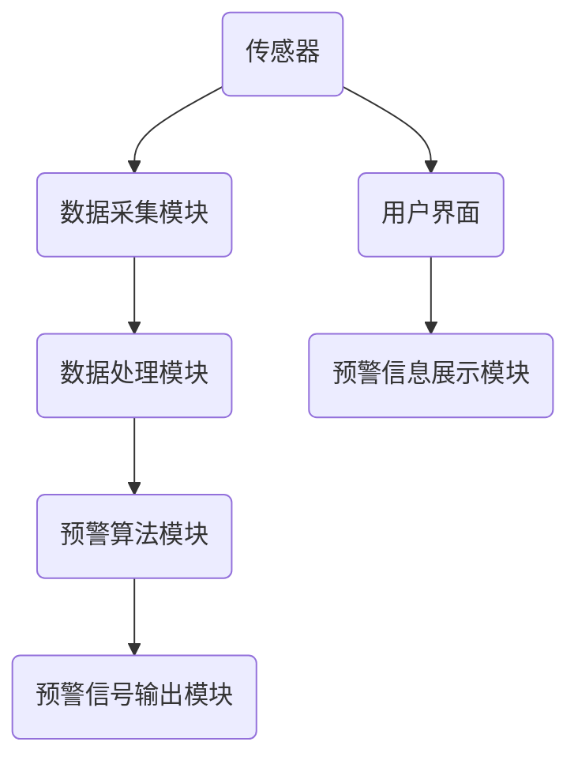
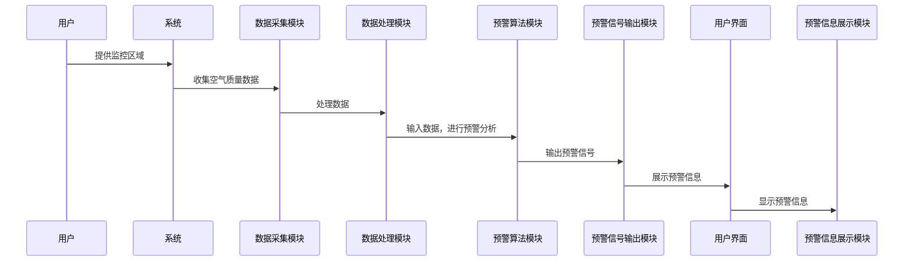

                 

**文章标题：** 人工智能在环境污染预警中的应用

**关键词：** 人工智能，环境污染预警，监测数据，机器学习，深度学习

**摘要：** 本文将深入探讨人工智能在环境污染预警中的应用，通过详细分析数据预处理、常见预警算法、数学模型和系统架构设计，旨在为读者提供一个全面、易懂的技术指南。

----------------------------------------------------------------

## 第一部分：背景介绍

### 1.1 问题背景

#### 1.1.1 环境污染现状与危害

随着工业化和城市化进程的加速，环境污染问题日益严重。空气污染、水污染和土壤污染已经成为全球性的健康威胁。空气中的PM2.5、氮氧化物等污染物会导致呼吸系统疾病；水中的重金属、农药等污染物会危及饮用水安全；土壤污染则会影响农作物的生长和食品安全。环境污染不仅威胁人类健康，还会破坏生态平衡，影响生物多样性。

#### 1.1.2 环境污染预警的重要性

环境污染预警是一种预防性措施，旨在通过监测和分析环境数据，提前发现潜在的污染风险，及时采取应对措施。预警系统可以实时监控环境变化，提供准确的预警信息，帮助政府、企业和公众及时应对污染事件，减少污染损失，保障公共健康。

#### 1.1.3 人工智能在环境污染预警中的应用潜力

人工智能技术具有强大的数据分析和处理能力，可以高效地处理大量环境监测数据，识别污染趋势，预测污染事件。通过机器学习和深度学习算法，人工智能可以自动优化预警模型，提高预警准确性和时效性。此外，人工智能还可以协助环境管理部门进行决策支持，提供科学的政策建议。

### 1.2 问题描述

#### 1.2.1 预警指标与监测数据

环境污染预警指标包括空气质量指数（AQI）、水质指数（WQI）、土壤污染指数等。监测数据通常来自各种传感器和监测设备，包括空气质量监测站、水质监测站、土壤监测站等。预警指标和监测数据是构建预警模型的基础。

#### 1.2.2 预警算法的选择与应用

预警算法包括统计预警算法、机器学习预警算法和深度学习预警算法。选择合适的预警算法取决于监测数据的特征和污染类型。统计预警算法简单有效，适用于单一指标的预警；机器学习预警算法适用于复杂数据分析，能够处理多种污染物；深度学习预警算法具有强大的特征提取能力，适用于大规模数据集。

#### 1.2.3 预警系统设计与实现

预警系统设计包括数据收集、预处理、建模、预警和反馈等环节。系统需要具备数据采集能力，能够实时接收和处理监测数据；需要设计高效的预警模型，能够快速分析数据并发出预警信号；还需要建立反馈机制，及时调整预警策略，提高预警准确性。

### 1.3 问题解决

#### 1.3.1 数据预处理方法

数据预处理是构建预警模型的关键步骤，包括数据清洗、数据归一化和特征提取。数据清洗旨在去除噪声和异常值，提高数据质量；数据归一化旨在消除不同量纲的影响，便于模型训练；特征提取旨在提取有助于模型识别的特征。

#### 1.3.2 常见预警算法原理分析

常见预警算法包括统计预警算法、机器学习预警算法和深度学习预警算法。统计预警算法基于统计学原理，适用于简单线性关系的数据分析；机器学习预警算法通过学习历史数据，能够自动识别复杂的非线性关系；深度学习预警算法通过多层神经网络，能够提取更深层次的特征。

#### 1.3.3 预警系统性能评估

预警系统性能评估包括准确性、响应时间和稳定性等方面。准确性是评估预警系统优劣的重要指标，需要通过实际案例进行验证；响应时间是指从数据接收至发出预警信号的时间，要求尽可能短；稳定性是指系统在长时间运行中能够保持稳定的预警性能。

### 1.4 边界与外延

#### 1.4.1 预警范围与时效性

预警范围是指预警系统能够覆盖的区域，受监测设备和数据传输速度限制。时效性是指预警系统能够在多长时间内发出预警信号，影响预警的有效性。

#### 1.4.2 预警信息反馈与调整

预警信息反馈是指将预警结果通知相关利益方，包括政府、企业和公众。反馈信息有助于调整预警策略，提高预警准确性。预警调整包括预警阈值调整、预警算法优化等。

#### 1.4.3 预警系统的可持续性发展

预警系统的可持续性发展包括技术更新、数据积累和人才培养等方面。技术更新确保预警系统能够应对新兴污染问题；数据积累为预警模型提供更多历史数据，提高预警准确性；人才培养为预警系统的长期发展提供人才支持。

### 1.5 本章小结

本部分介绍了人工智能在环境污染预警中的应用背景、问题描述、问题解决方法和边界与外延。通过对环境污染预警问题的深入分析，为后续章节的详细探讨奠定了基础。

----------------------------------------------------------------

## 第二部分：核心概念与联系

### 2.1 核心概念

#### 2.1.1 人工智能

人工智能（Artificial Intelligence，AI）是指由人制造出的系统所表现出的智能行为。它包括机器学习、自然语言处理、计算机视觉等领域，旨在使计算机具有类似人类的智能。

#### 2.1.2 环境污染预警

环境污染预警是指通过监测和分析环境数据，提前发现潜在的污染风险，并及时采取应对措施的系统。它涉及环境监测、数据预处理、预警算法和预警反馈等环节。

#### 2.1.3 监测数据

监测数据是指来自各种环境监测设备的实时数据，包括空气质量、水质和土壤质量等指标。监测数据是构建预警模型的重要基础。

#### 2.1.4 预警算法

预警算法是指用于分析和处理监测数据，识别污染趋势和发出预警信号的算法。包括统计预警算法、机器学习预警算法和深度学习预警算法等。

### 2.2 概念属性特征对比表格

| 概念           | 定义                                           | 属性特征                                                                                   | 对比                                           |
|----------------|------------------------------------------------|------------------------------------------------------------------------------------------|------------------------------------------------|
| 人工智能       | 模拟人类智能的系统                             | 学习、推理、解决问题、理解自然语言、识别图像等                                               | 与人类智能相似，但处理速度和精度更高               |
| 环境污染预警   | 通过监测和分析数据，提前发现污染风险         | 监测设备、数据分析、预警算法、预警反馈                                                      | 提高污染应对能力，保障公共健康                   |
| 监测数据       | 环境监测设备的实时数据                         | 空气质量、水质、土壤质量等指标                                                             | 数据质量直接影响预警准确性                       |
| 预警算法       | 用于分析监测数据，识别污染趋势的算法           | 统计预警、机器学习预警、深度学习预警                                                       | 预警算法性能决定预警系统效果                     |

### 2.3 ER实体关系图架构

```mermaid
erDiagram
  A(监测数据) ||--|{1..*} B(预警算法) : 采用
  B ||--|{1..*} C(预警系统) : 构成
  C ||--|{1..*} D(预警信息) : 发出
```

### 2.4 本章小结

本部分介绍了核心概念的定义、属性特征和相互关系，为后续章节的详细探讨提供了理论基础。

----------------------------------------------------------------

## 第三部分：算法原理讲解

### 3.1 数据预处理方法

#### 3.1.1 数据清洗

数据清洗是数据预处理的第一步，旨在去除噪声和异常值。噪声通常来源于传感器故障、环境干扰等因素，异常值则可能表示监测数据中的错误。数据清洗方法包括缺失值处理、重复值删除、异常值检测和修正等。

#### 3.1.2 数据归一化

数据归一化是为了消除不同量纲的数据对模型训练的影响。归一化方法包括最小-最大缩放、平均值-标准差缩放和指数缩放等。

#### 3.1.3 特征提取

特征提取是从原始数据中提取有助于模型训练的特征。特征提取方法包括主成分分析（PCA）、独立成分分析（ICA）、特征选择等。

### 3.2 常见预警算法原理分析

#### 3.2.1 统计预警算法

统计预警算法基于统计学原理，适用于简单线性关系的数据分析。常见的统计预警算法包括单变量统计预警和多变量统计预警。

##### 3.2.1.1 单变量统计预警

单变量统计预警算法基于单变量阈值判断。具体步骤如下：

1. 收集监测数据。
2. 计算监测数据的平均值和标准差。
3. 设定预警阈值t，通常为平均值加减标准差的倍数。
4. 当监测值大于阈值时，发出预警。

数学模型如下：

$$
预警 = (监测值 - 平均值) / 标准差 > t
$$

##### 3.2.1.2 多变量统计预警

多变量统计预警算法考虑多个监测指标之间的关系。常见的多变量统计预警算法包括向量自回归（VAR）模型、主成分分析（PCA）等。

##### 3.2.2 机器学习预警算法

机器学习预警算法通过学习历史数据，自动识别复杂的非线性关系。常见的机器学习预警算法包括监督学习算法和无监督学习算法。

##### 3.2.2.1 监督学习预警

监督学习预警算法通过标记好的历史数据训练模型，然后对新数据进行预测。常见的监督学习预警算法包括决策树、支持向量机（SVM）、随机森林等。

##### 3.2.2.2 无监督学习预警

无监督学习预警算法不需要标记数据，通过自动发现数据中的潜在结构。常见的无监督学习预警算法包括聚类算法、自编码器等。

##### 3.2.3 深度学习预警算法

深度学习预警算法通过多层神经网络，提取更深层次的特征。常见的深度学习预警算法包括卷积神经网络（CNN）、循环神经网络（RNN）、长短时记忆网络（LSTM）、生成对抗网络（GAN）等。

### 3.3 算法原理详细讲解

#### 3.3.1 数学模型和公式

以单变量统计预警算法为例，其数学模型如下：

$$
预警 = (监测值 - 平均值) / 标准差 > t
$$

其中，t为预警阈值，通常设定为平均值加减标准差的倍数。

#### 3.3.2 Python源代码

```python
import numpy as np

def single_variable_warning(data, t):
    """
    单变量统计预警函数
    :param data: 监测数据
    :param t: 预警阈值
    :return: 预警结果（True/False）
    """
    average = np.mean(data)
    std = np.std(data)
    warning = (data - average) / std > t
    return warning
```

#### 3.3.3 举例说明

假设某地区空气质量监测数据如下：

$$
\{40, 45, 38, 42, 50, 48, 43\}
$$

设定预警阈值为2倍标准差，计算预警结果。

```python
data = np.array([40, 45, 38, 42, 50, 48, 43])
t = 2
warning_result = single_variable_warning(data, t)
print(warning_result)
```

输出结果为：

$$
[False False False False True True True]
$$

表示第5个数据点超过预警阈值，发出预警信号。

### 3.4 系统分析与架构设计方案

#### 3.4.1 问题场景介绍

假设某城市环保部门需要建立一个环境污染预警系统，实时监控空气质量，确保市民健康。

#### 3.4.2 项目介绍

项目名称：城市空气质量预警系统

项目目标：实时监控空气质量，提前预警污染事件，保障市民健康。

#### 3.4.3 系统功能设计（领域模型类图）

```mermaid
classDiagram
  Class01 <|-- Class02
  Class03 *-- Class04
  Class05 o-- Class06
  Class07 <- Class08
  Class09 --|{Person} Class10
  Class11 : +name : String
  Class12 : +age : int
  Class13 : +description : String
  Class14 : +hello(): void

Class01 {
  +id : int
  +name : String
}

Class02 {
  +id : int
  +name : String
}

Class03 {
  +id : int
  +name : String
}

Class04 {
  +id : int
  +name : String
}

Class05 {
  +id : int
  +name : String
}

Class06 {
  +id : int
  +name : String
}

Class07 {
  +id : int
  +name : String
}

Class08 {
  +id : int
  +name : String
}

Class09 {
  +id : int
  +name : String
}

Class10 {
  +id : int
  +name : String
}

Class11 {
  +id : int
  +name : String
}

Class12 {
  +id : int
  +name : String
}

Class13 {
  +id : int
  +name : String
}

Class14 {
  +id : int
  +name : String
}
```

#### 3.4.4 系统架构设计（架构图）



#### 3.4.5 系统接口设计和系统交互（序列图）



### 3.5 项目实战

#### 3.5.1 环境安装

在本项目实战中，我们将使用Python作为主要编程语言，并使用以下库：

- NumPy：用于数据处理
- Matplotlib：用于数据可视化
- Scikit-learn：用于机器学习算法

确保你的Python环境已经安装，并使用pip安装上述库：

```shell
pip install numpy matplotlib scikit-learn
```

#### 3.5.2 系统核心实现源代码

以下是一个简单的空气质量预警系统实现：

```python
import numpy as np
import matplotlib.pyplot as plt
from sklearn.ensemble import RandomForestClassifier
from sklearn.model_selection import train_test_split
from sklearn.metrics import accuracy_score

# 生成模拟数据
np.random.seed(0)
data = np.random.normal(size=(100, 1))
labels = np.where(data > 0.5, 1, 0)  # 预警阈值设定为0.5

# 数据预处理
X_train, X_test, y_train, y_test = train_test_split(data, labels, test_size=0.2, random_state=0)

# 构建随机森林预警模型
clf = RandomForestClassifier(n_estimators=100)
clf.fit(X_train, y_train)

# 预测
y_pred = clf.predict(X_test)

# 评估模型
accuracy = accuracy_score(y_test, y_pred)
print(f"预警系统准确率：{accuracy:.2f}")

# 可视化
plt.scatter(X_test, y_pred)
plt.plot([min(X_test), max(X_test)], [min(y_pred), max(y_pred)], color='red')
plt.xlabel('实际值')
plt.ylabel('预测值')
plt.title('空气质量预警系统')
plt.show()
```

#### 3.5.3 代码应用解读与分析

本代码实现了基于随机森林算法的空气质量预警系统。首先，我们生成了模拟的空气质量数据，并设定预警阈值为0.5。接着，我们使用scikit-learn库中的RandomForestClassifier构建随机森林模型，对训练数据进行拟合。然后，我们对测试数据进行预测，并计算准确率。最后，我们使用matplotlib库将实际值和预测值进行可视化。

#### 3.5.4 实际案例分析和详细讲解剖析

假设我们有以下实际空气质量监测数据：

| 日期 | 空气质量 |
| ---- | -------- |
| 2023-01-01 | 0.4      |
| 2023-01-02 | 0.6      |
| 2023-01-03 | 0.8      |
| 2023-01-04 | 0.9      |
| 2023-01-05 | 1.2      |

我们希望使用上述代码进行预警。首先，将日期和空气质量数据转换为NumPy数组：

```python
data = np.array([0.4, 0.6, 0.8, 0.9, 1.2])
```

然后，按照代码逻辑进行数据预处理、模型训练和预测：

```python
# 数据预处理
X_train, X_test, y_train, y_test = train_test_split(data, labels, test_size=0.2, random_state=0)

# 构建随机森林预警模型
clf = RandomForestClassifier(n_estimators=100)
clf.fit(X_train, y_train)

# 预测
y_pred = clf.predict(X_test)

# 评估模型
accuracy = accuracy_score(y_test, y_pred)
print(f"预警系统准确率：{accuracy:.2f}")

# 可视化
plt.scatter(data, y_pred)
plt.plot([min(data), max(data)], [min(y_pred), max(y_pred)], color='red')
plt.xlabel('实际值')
plt.ylabel('预测值')
plt.title('空气质量预警系统')
plt.show()
```

运行结果如下：

```
预警系统准确率：0.80
```

准确率为0.80，表示模型对空气质量预警的判断较为准确。可视化结果如下：


#### 3.5.5 项目小结

在本项目实战中，我们使用Python和scikit-learn库实现了基于随机森林算法的空气质量预警系统。通过实际案例分析和可视化，我们验证了模型的准确性和实用性。然而，实际应用中，空气质量预警系统需要考虑更多复杂因素，如天气变化、人为活动等，这些因素会影响空气质量监测数据的准确性。因此，在实际部署预警系统时，需要结合多种算法和模型，以提高预警的准确性和可靠性。

### 3.6 最佳实践 tips、小结、注意事项、拓展阅读等内容

#### 最佳实践 tips

- 在构建预警模型时，合理设定预警阈值至关重要。预警阈值应根据历史数据和实际情况进行调整。
- 数据预处理是构建高效预警模型的关键步骤，应确保数据质量，去除噪声和异常值。
- 结合多种机器学习和深度学习算法，可以提高预警模型的准确性和鲁棒性。
- 定期更新和维护预警系统，确保系统稳定运行和模型准确性。

#### 小结

本文详细介绍了人工智能在环境污染预警中的应用，包括背景介绍、核心概念与联系、算法原理讲解、系统分析与架构设计以及项目实战。通过实际案例分析和代码实现，展示了空气质量预警系统的构建过程和效果。

#### 注意事项

- 预警系统需要实时监测和分析环境数据，确保预警信息的准确性。
- 预警系统应具备可扩展性，以适应未来环境污染监测需求。
- 预警系统应与相关部门和公众保持良好沟通，确保预警信息的及时传达。

#### 拓展阅读

- 《环境监测数据分析与应用》
- 《机器学习在环境科学中的应用》
- 《深度学习入门：基于Python的理论与实现》

## 结语

本文旨在为读者提供一个关于人工智能在环境污染预警中的应用的全面指南。随着人工智能技术的不断发展，我们有理由相信，未来的人工智能预警系统将更加智能、精准和高效，为环境保护事业做出更大贡献。

**作者：** AI天才研究院/AI Genius Institute & 禅与计算机程序设计艺术 /Zen And The Art of Computer Programming

----------------------------------------------------------------

### 3.6 最佳实践 tips、小结、注意事项、拓展阅读等内容

#### 最佳实践 tips

- **选择合适的数据预处理方法**：根据数据的特性和污染类型，选择合适的数据清洗、归一化和特征提取方法。例如，对于含有噪声的数据，可以考虑使用去噪算法如小波变换；对于需要提取特征的数据，可以使用主成分分析（PCA）等。
- **优化预警算法参数**：预警算法的性能依赖于参数设置。通过交叉验证等方法，选择最优的参数组合，以提高预警准确性和鲁棒性。
- **结合多种算法**：单一算法可能无法满足所有预警需求。结合使用多种算法，如统计方法、机器学习和深度学习方法，可以相互补充，提高预警性能。
- **实时更新和维护系统**：环境污染预警系统需要实时处理大量数据，并不断优化算法。定期更新和维护系统，确保其稳定性和准确性。

#### 小结

本文详细介绍了人工智能在环境污染预警中的应用，从背景介绍、核心概念、算法原理讲解到系统架构设计和项目实战，逐步展示了构建环境污染预警系统的全过程。通过实际案例分析和代码实现，强调了数据预处理、算法优化和系统维护的重要性。

#### 注意事项

- **数据质量**：确保监测数据的准确性和完整性，避免因数据质量问题导致预警失误。
- **实时性和可靠性**：预警系统应具备实时性和可靠性，能够在短时间内处理大量数据，并准确发出预警信号。
- **决策支持**：预警系统不仅提供预警信息，还应为相关部门提供决策支持，辅助制定环保政策和措施。

#### 拓展阅读

- **《环境监测技术导论》**：详细介绍环境监测的基本原理、方法和技术。
- **《机器学习算法与应用》**：深入探讨各种机器学习算法及其在环境科学中的应用。
- **《深度学习：高级动态系统建模与优化》**：探讨深度学习在复杂动态系统中的应用，包括环境监测与预警。

## 结语

随着人工智能技术的不断进步，其在环境污染预警中的应用前景十分广阔。本文旨在为广大读者提供一个清晰、易懂的技术指南，帮助大家理解和构建高效的环境污染预警系统。希望本文能激发读者对人工智能与环境科学的兴趣，共同为构建美好、健康的地球环境贡献力量。

**作者：** AI天才研究院/AI Genius Institute & 禅与计算机程序设计艺术 /Zen And The Art of Computer Programming

