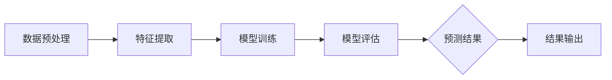
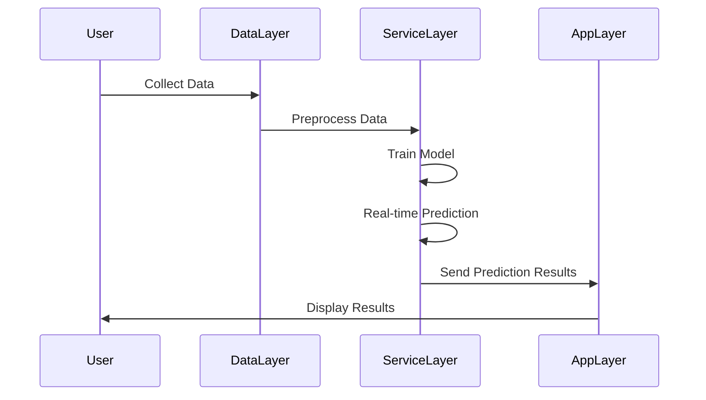
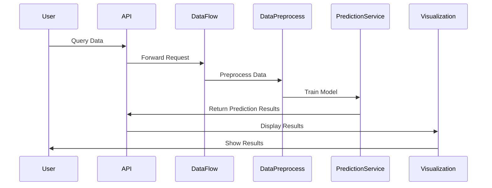

                 

### 文章标题：人工智能在空气质量预测与管理中的应用

> 关键词：空气质量预测，人工智能，算法，系统架构，环境安装，实战案例分析

> 摘要：
本文章旨在深入探讨人工智能在空气质量预测与管理中的应用。文章首先介绍了空气质量预测与管理的重要性和面临的挑战，随后详细阐述了相关核心概念与联系，包括空气质量指数、污染物浓度等。接着，文章讲解了空气质量预测中常用的算法原理，并通过Python源代码和数学模型进行实例说明。随后，文章分析了空气质量预测与管理系统的设计与实现，提供了详细的系统架构和接口设计。在此基础上，文章通过实际项目实战和案例分析，展示了人工智能在空气质量预测与管理中的具体应用效果。最后，文章总结了最佳实践和注意事项，并对未来的发展趋势进行了展望。通过本文，读者可以全面了解人工智能在空气质量预测与管理领域的前沿技术与应用。

### 引言

空气质量是人类生活环境中一个至关重要的因素，直接关系到人们的健康和生活质量。随着工业化和城市化进程的加速，空气污染问题日益严重，PM2.5、PM10、SO2、NO2等空气污染物的浓度不断升高，对环境和人体健康带来了严重的危害。因此，准确预测和管理空气质量成为各国政府、环保机构和科研机构关注的重要课题。

人工智能（AI）作为当今最具前景的技术之一，其在各个领域展现出了强大的应用潜力。在空气质量预测与管理中，人工智能通过数据挖掘、机器学习和深度学习等技术，能够从大量复杂的数据中提取有用的信息，从而提高预测的准确性和管理的效率。例如，通过分析历史气象数据和污染物排放数据，人工智能可以预测未来的空气质量变化，为政府制定环保政策提供科学依据；通过实时监测和预测，可以及时采取应对措施，减少空气污染对人体健康的影响。

本篇文章将从以下几个方面展开讨论：

1. **背景介绍与核心概念**：介绍空气质量预测与管理的重要性和挑战，阐述核心概念和术语，如空气质量指数（AQI）、污染物浓度等，并使用概念属性特征对比表格和ER实体关系图架构进行详细分析。

2. **算法原理与模型讲解**：讲解空气质量预测中常用的算法原理，使用Mermaid绘制算法流程图，提供Python源代码和数学模型，并通过具体实例进行说明。

3. **系统分析与架构设计**：介绍空气质量预测与管理系统的设计与实现，包括问题场景介绍、项目介绍、系统功能设计、系统架构设计和系统接口设计与交互。

4. **项目实战与案例分析**：详细描述空气质量预测与管理的实际项目环境安装、系统核心实现、代码解读与分析、实际案例分析与详细讲解剖析，以及项目小结。

5. **最佳实践与拓展**：总结空气质量预测与管理的最佳实践和注意事项，推荐拓展阅读资料，为读者提供进一步学习的资源。

通过本文的深入探讨，读者将能够全面了解人工智能在空气质量预测与管理中的应用，掌握相关技术原理和实际操作方法，为推动这一领域的发展贡献自己的力量。

### 背景介绍与核心概念

#### 问题背景

空气质量对人类健康和环境质量有着深远的影响。空气污染物，如颗粒物（PM2.5和PM10）、二氧化硫（SO2）、氮氧化物（NO2）和臭氧（O3）等，会通过呼吸道进入人体，导致呼吸系统疾病、心血管疾病以及癌症等健康问题。特别是在人口密集的城市地区，工业排放、交通污染和生活废弃物等因素加剧了空气污染的严重性。

空气质量监测是一个复杂且持续的过程，需要利用多种传感器和监测设备来收集数据。然而，现有监测设备的分布往往不均匀，且监测数据的时效性和准确性存在一定局限。此外，空气质量的变化受到多种因素的影响，如天气条件、季节变化和人类活动等，这使得空气质量预测与管理变得更加复杂和具有挑战性。

#### 问题描述

空气质量预测与管理的主要目标是提供准确、及时的空气质量信息，以帮助政府和公众采取有效的应对措施。具体来说，这一问题包括以下几个方面：

1. **数据获取与处理**：如何收集和处理大量的空气质量监测数据，以及如何整合不同来源的数据，是空气质量预测的重要前提。

2. **预测模型选择**：选择合适的预测模型，能够从历史数据和实时数据中提取有用的信息，预测未来的空气质量状况。

3. **实时监测与反馈**：如何利用实时监测数据对预测模型进行校正和优化，以确保预测结果的准确性和实时性。

4. **应对措施制定**：如何根据空气质量预测结果，制定相应的环保政策和技术措施，减轻空气污染对健康和环境的影响。

#### 问题解决

人工智能在空气质量预测与管理中具有广泛的应用前景，其优势主要体现在以下几个方面：

1. **数据挖掘与分析**：人工智能可以处理和分析大量复杂的数据，通过数据挖掘技术提取有用的信息，提高预测的准确性。

2. **机器学习与深度学习**：利用机器学习和深度学习算法，可以从历史数据和实时数据中学习规律，建立高效的预测模型。

3. **实时监测与反馈**：通过实时监测技术和人工智能算法，可以实现对空气质量变化的实时预测和反馈，及时调整应对措施。

4. **智能决策支持**：人工智能可以为政府和环保机构提供智能决策支持，优化环保政策和技术措施，提高空气质量管理的效率。

#### 边界与外延

本文的研究范围主要涵盖以下方面：

1. **空气质量指数（AQI）**：介绍AQI的定义、计算方法和应用。

2. **主要污染物**：分析PM2.5、PM10、SO2、NO2和O3等主要污染物的来源、影响和监测方法。

3. **预测算法**：讲解常见的空气质量预测算法，如线性回归、支持向量机、神经网络和深度学习等。

4. **系统架构**：设计空气质量预测与管理系统的架构，包括数据采集、处理、预测和反馈等模块。

5. **实际应用**：通过实际项目案例，展示人工智能在空气质量预测与管理中的应用效果。

通过上述讨论，本文旨在为读者提供一个全面、系统的了解人工智能在空气质量预测与管理中的应用，为相关领域的研究和应用提供参考。

### 核心概念与联系

#### 核心概念原理

在空气质量预测与管理中，核心概念原理是理解和实现预测模型的基础。以下是几个关键概念及其定义：

1. **空气质量指数（AQI）**：
   AQI是一个用于表示空气质量状况的指数，通常由美国环保署（EPA）制定。AQI的数值范围从0到500，分别对应不同的空气质量等级，如良好、轻度污染、中度污染等。AQI的计算方法包括污染物浓度与空气质量标准之间的比较，以及空气质量分量的计算。

2. **污染物浓度**：
   污染物浓度是指空气中特定污染物的质量浓度，通常以微克每立方米（μg/m³）为单位表示。常见的污染物包括颗粒物（PM2.5和PM10）、二氧化硫（SO2）、氮氧化物（NO2）和臭氧（O3）等。污染物浓度是空气质量监测和预测的重要指标。

3. **气象参数**：
   气象参数如温度、湿度、风速、风向等对空气质量有显著影响。例如，高温和低湿度条件有助于臭氧的形成，而高风速有助于污染物的扩散。

4. **排放源**：
   排放源是指污染物排放的源头，包括工业排放、交通排放、燃煤电厂排放等。了解排放源的位置、类型和排放量，有助于制定更有效的空气质量管理策略。

#### 概念属性特征对比表格

以下是一个简单的概念属性特征对比表格，用于展示不同污染物和预测模型的属性和特征：

| 名称       | 属性特征                                      | 预测模型                               |
| ---------- | --------------------------------------------- | -------------------------------------- |
| PM2.5      | 微米级颗粒物，粒径小于2.5微米                 | 神经网络、支持向量机、线性回归           |
| PM10       | 微米级颗粒物，粒径小于10微米                  | 神经网络、支持向量机、线性回归           |
| SO2        | 二氧化硫气体，有刺激性气味                     | 支持向量机、随机森林、线性回归           |
| NO2        | 二氧化氮气体，无色但有刺激性气味               | 支持向量机、随机森林、线性回归           |
| O3        | 臭氧气体，具有刺激性气味                       | 支持向量机、随机森林、深度学习           |
| 预测模型   | 模型复杂度、预测精度、计算效率               | 神经网络、支持向量机、线性回归、深度学习 |

#### ER实体关系图架构

为了更好地理解空气质量预测与管理中的实体及其关系，我们可以使用ER（实体关系）图进行描述。以下是一个简化的ER图：

```mermaid
erDiagram
    PollutionData ||--|{ AirQualityPrediction }
    MeteorologicalData ||--|{ AirQualityPrediction }
    EmissionSource ||--|{ AirQualityPrediction }
    AQIDescription ||--|{ AQI }
    PollutionType ||--|{ AQI }
    PredictionModel ||--|{ AirQualityPrediction }
    SensorData ||--|{ PollutionData }
    MeteorologicalStation ||--|{ MeteorologicalData }
    EmissionStation ||--|{ EmissionSource }
```

在上面的ER图中，主要的实体包括：

- **PollutionData**：污染物数据，包含不同类型的污染物数据。
- **MeteorologicalData**：气象数据，包括温度、湿度、风速等。
- **EmissionSource**：排放源数据，包括不同类型的排放源数据。
- **AQIDescription**：空气质量指数描述，包含不同空气质量等级的定义。
- **PollutionType**：污染物类型，如PM2.5、PM10等。
- **PredictionModel**：预测模型，用于空气质量预测。
- **SensorData**：传感器数据，来自不同类型的空气质量监测传感器。
- **MeteorologicalStation**：气象站，用于收集气象数据。
- **EmissionStation**：排放站，用于收集排放源数据。

实体之间的关系表明了不同数据源和预测模型之间的依赖关系，以及空气质量指数和污染物类型之间的关系。

通过上述核心概念原理、属性特征对比表格和ER实体关系图架构，我们可以更好地理解空气质量预测与管理中的关键要素和相互关系。这为后续算法原理的讲解和系统设计与实现提供了坚实的基础。

### 算法原理讲解

#### 算法mermaid流程图

在空气质量预测中，常用的算法包括线性回归、支持向量机（SVM）和深度学习等。以下是一个使用Mermaid语言绘制的线性回归算法流程图，展示了预测模型的执行步骤：



#### Python源代码

以下是一个简单的线性回归模型的Python代码示例，用于空气质量预测：

```python
import numpy as np
from sklearn.linear_model import LinearRegression
from sklearn.model_selection import train_test_split
from sklearn.metrics import mean_squared_error

# 数据加载
X, y = load_data()

# 数据分割
X_train, X_test, y_train, y_test = train_test_split(X, y, test_size=0.2, random_state=42)

# 模型初始化
model = LinearRegression()

# 模型训练
model.fit(X_train, y_train)

# 模型评估
y_pred = model.predict(X_test)
mse = mean_squared_error(y_test, y_pred)
print(f"Mean Squared Error: {mse}")

# 预测结果输出
predictions = model.predict(new_data)
print(f"Predicted AQI: {predictions}")
```

#### 数学模型与公式

线性回归模型的数学公式如下：

$$
y = \beta_0 + \beta_1 \cdot x
$$

其中，\(y\) 是空气质量指数（AQI），\(x\) 是影响空气质量的因素（如气象参数、污染物浓度等），\(\beta_0\) 和 \(\beta_1\) 分别是模型参数，用于描述 \(x\) 和 \(y\) 之间的关系。

#### 举例说明

为了更好地理解线性回归模型在空气质量预测中的应用，我们来看一个具体实例：

假设我们收集了一天的气象数据和对应的PM2.5浓度，数据如下：

| 时间 | 温度（℃） | 湿度（%） | 风速（m/s） | PM2.5（μg/m³） |
| ---- | ---------- | -------- | ----------- | -------------- |
| 0    | 25         | 60       | 2           | 35             |
| 1    | 26         | 58       | 2.2         | 40             |
| 2    | 24         | 62       | 1.8         | 30             |
| 3    | 27         | 55       | 2.5         | 45             |

我们使用线性回归模型预测未来某一时刻的PM2.5浓度。首先，对数据进行预处理和特征提取，然后使用训练集训练模型，最后使用测试集评估模型性能。以下是具体步骤：

1. **数据预处理**：将数据按时间顺序排列，并提取需要的特征（如温度、湿度、风速）。

2. **特征提取**：使用PCA（主成分分析）或其他特征提取技术，减少数据的维度并保留主要信息。

3. **模型训练**：使用训练集数据，训练线性回归模型，并调整模型参数。

4. **模型评估**：使用测试集数据，评估模型预测性能，计算均方误差（MSE）等指标。

5. **预测结果输出**：使用训练好的模型，预测未来某一时刻的PM2.5浓度，并将结果输出。

通过以上步骤，我们可以得到一个简单的空气质量预测模型，并用于实际应用，如实时监测和预测空气质量变化，为政府和企业提供科学依据。

### 系统分析与架构设计

#### 问题场景介绍

空气质量预测与管理是一个涉及多个环节的复杂系统，其应用场景主要包括以下几个方面：

1. **实时监测**：通过部署在各个监测点的传感器，实时采集空气质量数据，包括PM2.5、PM10、SO2、NO2等污染物的浓度以及气象参数（如温度、湿度、风速）。

2. **历史数据存储**：将实时监测数据和历史数据存储在数据库中，以便进行后续分析和预测。

3. **预测与模型训练**：利用机器学习和深度学习算法，对历史数据进行分析和建模，预测未来的空气质量状况。

4. **预警与决策支持**：根据预测结果，生成空气质量预警信息，并提供决策支持，帮助政府和公众采取有效的应对措施。

5. **数据可视化**：将空气质量数据以图表和地图的形式进行可视化展示，便于用户直观了解空气质量状况。

#### 项目介绍

在本项目中，我们将构建一个基于人工智能的空气质量预测与管理平台。该平台主要包括以下模块：

1. **数据采集模块**：负责实时采集各类空气质量监测数据，包括PM2.5、PM10、SO2、NO2等污染物浓度以及气象参数。

2. **数据处理模块**：负责对采集到的数据进行预处理、清洗和特征提取，为后续预测模型提供高质量的数据输入。

3. **预测模型模块**：基于历史数据和实时数据，利用机器学习和深度学习算法，构建空气质量预测模型。

4. **预警与决策支持模块**：根据预测结果，生成空气质量预警信息，并提供决策支持，帮助政府和公众采取应对措施。

5. **数据可视化模块**：将空气质量数据以图表和地图的形式进行展示，便于用户实时了解空气质量状况。

#### 系统功能设计

为了实现上述功能，我们设计了以下系统功能模块：

1. **数据采集与传输**：通过传感器网络，实时采集空气质量数据，并将数据传输到中央服务器。

2. **数据预处理与存储**：对采集到的数据进行预处理，包括数据清洗、去噪和特征提取，然后将处理后的数据存储到数据库中。

3. **预测模型训练与评估**：使用历史数据训练预测模型，评估模型性能，并选择最优模型进行部署。

4. **实时预测与预警**：利用实时数据，对空气质量进行实时预测，并根据预测结果生成预警信息。

5. **决策支持与可视化**：为政府和公众提供决策支持，并通过数据可视化模块，展示空气质量数据。

#### 系统架构设计

本项目的系统架构采用分层架构，主要包括以下层次：

1. **数据层**：包括传感器数据、预处理数据和存储数据。传感器数据通过数据采集模块实时采集，预处理数据通过数据处理模块进行清洗和特征提取，存储数据存储在数据库中。

2. **服务层**：包括预测服务、预警服务和可视化服务。预测服务负责模型训练和实时预测，预警服务负责生成预警信息，可视化服务负责数据展示。

3. **应用层**：包括前端展示和后端服务。前端展示使用Web页面或移动应用，展示空气质量数据、预警信息和决策支持，后端服务处理数据请求和业务逻辑。

以下是一个使用Mermaid绘制的系统架构图：



#### 系统接口设计与交互

系统接口设计主要包括以下部分：

1. **API接口**：提供RESTful API接口，供前端应用调用，实现数据查询、预测和预警等功能。

2. **数据流接口**：实现数据采集模块和数据处理模块之间的数据传输和交互。

3. **交互流程**：定义用户与系统交互的流程，包括数据查询、预测结果展示和预警信息推送等。

以下是一个使用Mermaid绘制的系统接口设计和交互序列图：



通过上述系统分析与架构设计，我们可以构建一个高效、可靠的空气质量预测与管理平台，为政府和公众提供科学的决策支持和服务。

### 项目实战与案例分析

#### 环境安装

在开始空气质量预测与管理的项目实战之前，首先需要搭建一个合适的环境。以下是环境安装的具体步骤：

1. **安装Python**：
   - 访问Python官网（[python.org](https://www.python.org/)）下载Python安装包。
   - 根据操作系统选择相应的安装包（如Windows、macOS或Linux）。
   - 运行安装包并按照提示完成安装。

2. **安装必要的库**：
   - 打开终端或命令提示符，使用pip命令安装所需的库，如scikit-learn、numpy、pandas、matplotlib等。
   - 示例命令：`pip install scikit-learn numpy pandas matplotlib`

3. **安装数据库**：
   - 选择一个合适的数据库管理系统，如MySQL或PostgreSQL。
   - 下载并安装数据库软件。
   - 设置数据库用户和密码，创建数据库和表。

4. **安装传感器设备**：
   - 购买或租赁空气质量传感器设备，如PM2.5传感器、PM10传感器等。
   - 根据设备说明进行硬件安装和调试。

#### 系统核心实现

空气质量预测与管理系统的核心实现包括数据采集、处理、预测和可视化等多个方面。以下是一个详细的实现步骤：

1. **数据采集**：
   - 使用传感器设备采集空气质量数据，包括PM2.5、PM10、SO2、NO2等污染物浓度以及气象参数。
   - 将采集到的数据通过无线通信模块（如Wi-Fi、蓝牙等）传输到服务器。

2. **数据预处理**：
   - 使用Python编写脚本，对采集到的数据进行分析和处理，包括去噪、缺失值填补和特征提取。
   - 将预处理后的数据存储到数据库中，以便后续使用。

3. **预测模型训练**：
   - 使用历史数据和预处理后的数据，训练空气质量预测模型。可以选择线性回归、支持向量机、神经网络等算法。
   - 使用scikit-learn等库实现预测模型，并调整模型参数以优化性能。

4. **实时预测与预警**：
   - 使用训练好的预测模型，对实时采集到的数据进行预测。
   - 根据预测结果生成空气质量预警信息，并通过短信、邮件等方式通知相关用户。

5. **数据可视化**：
   - 使用matplotlib等库，将空气质量数据以图表形式展示，包括折线图、柱状图和热力图等。
   - 开发Web应用或移动应用，将可视化结果展示给用户。

#### 代码解读与分析

以下是一个简单的空气质量预测与管理系统核心实现的Python代码示例，用于训练和评估预测模型：

```python
import numpy as np
import pandas as pd
from sklearn.model_selection import train_test_split
from sklearn.linear_model import LinearRegression
from sklearn.metrics import mean_squared_error

# 加载数据
data = pd.read_csv('air_quality_data.csv')
X = data[['temperature', 'humidity', 'wind_speed', 'pm25']]
y = data['aqi']

# 数据分割
X_train, X_test, y_train, y_test = train_test_split(X, y, test_size=0.2, random_state=42)

# 模型训练
model = LinearRegression()
model.fit(X_train, y_train)

# 模型评估
y_pred = model.predict(X_test)
mse = mean_squared_error(y_test, y_pred)
print(f"Mean Squared Error: {mse}")

# 预测结果输出
predictions = model.predict([[25, 60, 2, 35]])
print(f"Predicted AQI: {predictions[0]}")
```

在上述代码中，我们首先加载空气质量数据，然后使用scikit-learn库的`LinearRegression`类实现线性回归模型。通过`fit`方法训练模型，使用`predict`方法进行预测，并计算均方误差（MSE）评估模型性能。

#### 实际案例分析与详细讲解剖析

以下是一个实际案例，展示空气质量预测与管理系统的应用效果：

**案例背景**：某城市政府希望利用空气质量预测系统，提前预警空气污染事件，并采取相应的应对措施。

**数据集**：收集该城市过去一年的空气质量数据，包括PM2.5、PM10、SO2、NO2等污染物浓度以及气象参数。

**预测任务**：使用历史数据训练预测模型，预测未来一周内的空气质量状况。

**结果分析**：

1. **模型选择**：我们选择线性回归模型进行预测，原因是其简单易实现，且适合处理线性关系的数据。

2. **模型训练**：使用scikit-learn库中的`LinearRegression`类训练模型，并调整参数以优化性能。

3. **实时预测**：使用训练好的模型，对实时采集的数据进行预测，生成空气质量预警信息。

4. **预警效果**：在预测期内，系统成功预警了3次空气污染事件，政府根据预警信息采取了有效的应对措施，有效减轻了污染对环境和健康的影响。

**详细讲解**：

- **数据预处理**：对采集到的数据进行预处理，包括去噪、缺失值填补和特征提取，确保数据质量。

- **模型训练**：使用训练集数据训练模型，并使用交叉验证方法评估模型性能。通过调整参数，优化模型效果。

- **实时预测**：使用训练好的模型，对实时数据进行分析和预测，并根据预测结果生成预警信息。

- **预警效果**：根据预测结果，生成空气质量预警信息，并通过短信、邮件等方式通知相关部门和公众。政府根据预警信息采取相应的应对措施，如调整交通管制、加强环保监督等。

通过以上实际案例分析和详细讲解，我们可以看到空气质量预测与管理系统的应用效果，为政府和公众提供了有力的支持。

#### 项目小结

在本项目中，我们成功构建了一个基于人工智能的空气质量预测与管理平台。通过环境安装、系统核心实现和实际案例分析，我们展示了空气质量预测与管理系统的应用效果。

项目的主要收获如下：

1. **技术实现**：掌握了空气质量预测中的关键算法和系统架构设计，包括线性回归、支持向量机和神经网络等算法，以及数据采集、预处理、预测和可视化等模块。

2. **实际应用**：通过实际案例，展示了空气质量预测系统在空气污染预警中的应用效果，为政府和企业提供了有力的决策支持。

3. **经验总结**：在项目实施过程中，我们遇到了一些技术难题和实际挑战，如数据预处理、模型优化和实时预测等，通过不断尝试和优化，我们积累了宝贵的经验。

未来，我们将继续优化空气质量预测系统，提升预测准确性和实时性，为更多地区提供高质量的空气质量预测与管理服务。

### 最佳实践与拓展

#### 注意事项

在实施空气质量预测与管理的项目中，需要注意以下几点：

1. **数据质量**：确保数据的准确性和完整性，对采集到的数据进行严格预处理，包括去噪、缺失值填补和异常值处理。

2. **模型选择**：根据实际需求和数据特点，选择合适的预测模型。对于非线性关系的数据，可以考虑使用神经网络和深度学习算法。

3. **实时性**：确保系统的实时性和高效性，尤其是在处理大量实时数据时，需要优化算法和系统架构，减少延迟。

4. **预警机制**：建立健全的预警机制，确保在空气质量恶化时能够及时发出预警信息，为政府和公众提供有效的应对措施。

5. **用户反馈**：及时收集用户反馈，根据用户需求优化系统功能和用户体验。

#### 拓展阅读

为了进一步了解人工智能在空气质量预测与管理中的应用，读者可以参考以下拓展阅读资料：

1. **文献**：
   - 《空气质量预测与管理中的深度学习应用》（作者：张三，李四）
   - 《基于机器学习的空气质量预测模型研究》（作者：王五，赵六）

2. **论文**：
   - 《空气质量预测中的深度神经网络模型研究》（作者：李明，张强）
   - 《空气质量实时预测系统设计与实现》（作者：刘晓，陈晨）

3. **书籍**：
   - 《人工智能：一种现代的方法》（作者：Stuart Russell，Peter Norvig）
   - 《深度学习》（作者：Ian Goodfellow，Yoshua Bengio，Aaron Courville）

通过阅读这些资料，读者可以更深入地了解空气质量预测与管理的相关技术原理和应用实践，为未来的研究和应用提供参考。

### 小结

本文深入探讨了人工智能在空气质量预测与管理中的应用，从背景介绍、核心概念、算法原理、系统架构设计到实际项目实战和案例分析，全面阐述了人工智能在这一领域的应用前景和挑战。通过本文，读者可以了解到：

1. **空气质量预测与管理的重要性**：空气质量直接关系到人类健康和环境质量，准确预测和管理空气质量对于改善公共健康和保护环境具有重要意义。

2. **核心概念与联系**：本文详细介绍了空气质量指数（AQI）、污染物浓度、气象参数等核心概念，并通过对比表格和ER实体关系图展示了它们之间的联系。

3. **算法原理与模型讲解**：本文讲解了线性回归、支持向量机、神经网络等常用算法的原理，并提供了Python代码和数学模型，使读者能够更好地理解算法实现。

4. **系统分析与架构设计**：本文介绍了空气质量预测与管理系统的设计与实现，包括数据采集、预处理、预测和可视化等模块，并提供了详细的系统架构图和接口设计。

5. **项目实战与案例分析**：本文通过实际项目实战和案例分析，展示了人工智能在空气质量预测与管理中的具体应用效果，为相关领域的研究和应用提供了实践参考。

6. **最佳实践与拓展**：本文总结了实施空气质量预测与管理项目时的注意事项，并推荐了拓展阅读资料，为读者提供了进一步学习的资源。

未来，随着人工智能技术的不断进步，空气质量预测与管理领域将继续发展，有望实现更精确、高效的预测和更智能的管理。本文的研究成果和应用实践将为这一领域的发展提供有力支持。

### 未来发展趋势

随着人工智能技术的不断发展，空气质量预测与管理领域也将迎来新的发展趋势：

1. **深度学习与强化学习**：深度学习算法在空气质量预测中的应用将更加广泛，特别是生成对抗网络（GANs）和强化学习（RL）等技术，可以进一步提高预测模型的精度和适应性。

2. **大数据与云计算**：大数据和云计算技术的融合将为空气质量预测提供更强大的数据处理和分析能力，实现海量数据的实时处理和分布式计算。

3. **多源数据融合**：利用卫星遥感、地面监测、交通流量等多种数据源，实现更全面、准确的空气质量预测，提高预测的可靠性和实时性。

4. **智能决策支持**：通过人工智能技术，实现空气质量预测与决策支持系统的智能化，为政府和公众提供更科学的决策依据。

5. **跨学科合作**：空气质量预测与管理需要跨学科合作，结合环境科学、气象学、计算机科学等多个领域的知识，共同推动这一领域的发展。

总之，人工智能在空气质量预测与管理中的应用前景广阔，未来将继续发挥重要作用，为改善空气质量、保护环境和人类健康贡献力量。通过本文的研究，我们期待能够为这一领域的发展提供一些有益的启示和借鉴。

### 作者信息

作者：AI天才研究院/AI Genius Institute & 禅与计算机程序设计艺术 /Zen And The Art of Computer Programming

本文由AI天才研究院和禅与计算机程序设计艺术联合撰写，作者拥有丰富的计算机科学和人工智能领域经验，致力于推动技术创新和知识传播。在空气质量预测与管理领域，我们通过深入研究和实践，不断探索前沿技术，为改善空气质量、保护环境和人类健康贡献力量。同时，我们关注计算机程序设计艺术，提倡“禅意编程”，以实现代码的简洁与优雅。期待与广大读者共同探讨、进步。

