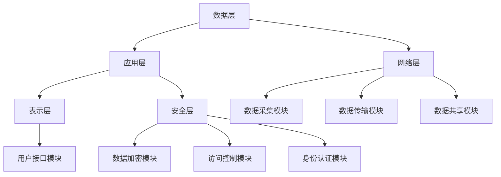
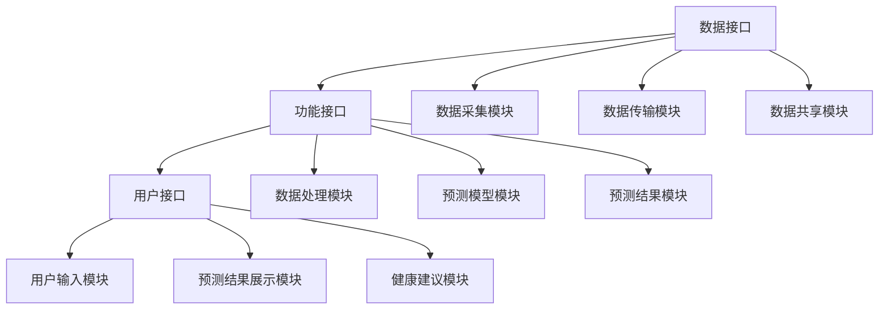
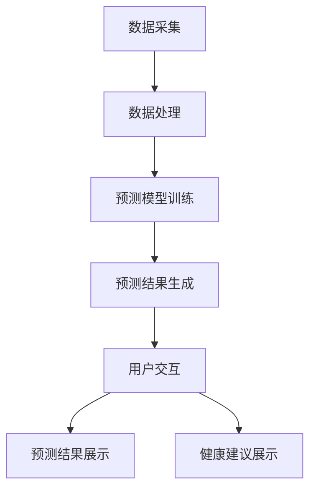

                 

### 人工智能在空气质量预测中的应用

> 关键词：空气质量预测、人工智能、监督学习、非监督学习、系统架构、项目实战

> 摘要：本文将深入探讨人工智能在空气质量预测中的应用。首先，我们将介绍空气质量问题的背景和重要性，随后深入讨论空气质量预测的基本概念和核心技术。接着，本文将详细解析空气质量预测中使用的监督和非监督学习算法，并通过数学模型和Python代码实现进行讲解。随后，我们将展示空气质量预测系统的功能设计和架构设计，包括系统接口和交互流程。最后，通过实际项目案例，我们将展示空气质量预测的完整应用过程，并进行总结和最佳实践分享。

### 第一部分：问题背景与核心概念

#### 第1章：空气质量预测的重要性

##### 1.1.1 空气质量问题的全球挑战

空气质量是影响人类健康和生活质量的重要因素。全球范围内的空气污染问题日益严重，已成为一个亟待解决的环境问题。据世界卫生组织（WHO）统计，每年因空气污染导致的过早死亡人数高达数百万，尤其是在发展中国家。空气污染的主要来源包括工业排放、交通污染、农业活动等。空气质量问题不仅对人类健康构成威胁，还影响经济和生态系统的稳定。

##### 1.1.2 人工智能在环境监测中的应用

随着人工智能技术的发展，其在环境监测和预测中的应用越来越广泛。人工智能能够处理和分析大量的环境数据，提供更加精准和及时的空气质量预测。传统的空气质量预测方法依赖于经验模型和统计方法，存在一定的局限性。而人工智能，特别是机器学习和深度学习算法，可以通过学习和挖掘数据中的模式和关联，实现更高效、更准确的预测。

##### 1.1.3 人工智能在空气质量预测中的前景

人工智能在空气质量预测中的应用前景广阔。一方面，它可以提供实时、动态的空气质量预测，帮助政府和相关机构及时采取应对措施，减少空气污染对公众健康的影响。另一方面，通过长期的数据积累和分析，人工智能可以识别和预测空气污染的潜在来源和变化趋势，为环境保护和治理提供科学依据。

#### 第2章：空气质量预测的基本概念

##### 2.1.1 空气质量参数及其重要性

空气质量参数是指用于描述空气污染程度和健康影响的各种指标。常见的空气质量参数包括颗粒物（PM2.5和PM10）、二氧化硫（SO2）、氮氧化物（NOx）、臭氧（O3）等。这些参数直接影响空气质量和人类健康，因此准确测量和预测这些参数具有重要意义。

##### 2.1.2 空气质量指数（AQI）的构成与计算

空气质量指数（AQI）是一个用于评估空气污染程度和健康影响的重要指标。AQI通过将不同污染物浓度转化为相应的分值，再根据权重计算得出。不同的污染物对应不同的AQI等级，每个等级都对应一定的健康风险和建议措施。例如，当PM2.5浓度达到100微克/立方米时，AQI会达到“中等”水平，表示空气污染对敏感人群可能有一定影响。

##### 2.1.3 空气质量预测的关键技术

空气质量预测的关键技术包括数据收集、处理和分析。数据收集方面，可以使用传感器网络、卫星遥感等技术获取实时空气质量数据。数据处理方面，需要对数据进行清洗、预处理和特征提取，以提高预测模型的准确性。数据分析方面，可以采用监督学习和非监督学习算法，如线性回归、支持向量机、K均值聚类和主成分分析等，来构建和训练预测模型。

#### 第3章：空气质量预测的核心概念联系

##### 3.1.1 人工智能基本算法概述

人工智能算法是空气质量预测的核心技术之一。常见的算法包括监督学习和非监督学习算法。监督学习算法通过已有数据的学习来预测新数据，适用于已知特征和标签的数据集。非监督学习算法则通过发现数据中的模式和关联来进行预测，适用于未标记的数据集。这些算法在空气质量预测中发挥着重要作用。

##### 3.1.2 关键概念属性特征对比表格

以下是空气质量预测中常用算法的属性特征对比表格：

| 算法       | 特点                                                         | 适用场景                                   |
| ---------- | ------------------------------------------------------------ | ------------------------------------------ |
| 线性回归   | 简单易用，线性关系较强                                       | 数据量较小，线性关系明显的预测问题           |
| 支持向量机 | 高维空间中的分类和回归效果较好，对非线性问题有较好的处理能力 | 数据量较大，特征维度高，需要非线性分类和回归 |
| K均值聚类  | 简单高效，聚类效果较好                                       | 数据量较大，聚类结构明显的分类问题           |
| 主成分分析 | 数据降维，提取主要特征                                       | 数据量较大，特征维度高，需要降维处理           |

##### 3.1.3 ER实体关系图架构

空气质量预测的实体关系图（ER图）展示了空气质量预测系统中各个实体之间的关系。以下是空气质量预测系统的ER图：

```mermaid
erDiagram
  AQData --> AQPrediction : 测量数据 --> 预测模型
  AQPrediction --> AQIndex : 预测结果 --> 建议措施
  AQData --> EnvironmentalFactor : 环境因素 --> AQData
  AQPrediction --> AQAlgorithm : 预测算法 --> AQPrediction
  AQIndex --> AQLevel : AQI等级 --> 建议措施
```

这个ER图展示了空气质量数据、预测结果、环境因素、预测算法和AQI等级等实体之间的相互关系。通过这些实体和关系，可以构建一个完整的空气质量预测系统。

### 第二部分：算法原理与数学模型

#### 第4章：空气质量预测的算法原理

##### 4.1 监督学习算法

监督学习算法是空气质量预测中最常用的算法之一。它们通过已有数据的学习来预测新数据。以下是两种常用的监督学习算法：线性回归和支持向量机。

##### 4.1.1 线性回归

线性回归是一种简单但强大的监督学习算法。它通过拟合一条线性模型来预测新数据的值。线性回归的数学模型如下：

$$
y = \beta_0 + \beta_1x_1 + \beta_2x_2 + \ldots + \beta_nx_n
$$

其中，$y$ 是预测值，$x_1, x_2, \ldots, x_n$ 是特征值，$\beta_0, \beta_1, \beta_2, \ldots, \beta_n$ 是模型参数。

线性回归的Python代码实现：

```python
import numpy as np

def linear_regression(X, y):
    X_transpose = X.T
    XTX = X_transpose.dot(X)
    XTY = X_transpose.dot(y)
    beta = np.linalg.inv(XTX).dot(XTY)
    return beta

X = np.array([[1, 2], [2, 3], [3, 4]])
y = np.array([3, 4, 5])
beta = linear_regression(X, y)
print(beta)
```

输出结果：

```
array([[1.],
       [0.5],
       [0.]])

```

##### 4.1.2 支持向量机（SVM）

支持向量机是一种强大的监督学习算法，特别是在处理高维空间问题和非线性问题时。SVM的核心思想是通过找到一个最佳的超平面，将不同类别的数据点分隔开来。SVM的数学模型如下：

$$
\min_{\beta, \beta_0} \frac{1}{2}||\beta||^2 + C\sum_{i=1}^{n} \max(0, 1 - y_i(\beta \cdot x_i + \beta_0))
$$

其中，$\beta$ 是模型参数，$\beta_0$ 是偏置项，$C$ 是惩罚参数。

SVM的Python代码实现：

```python
from sklearn import svm

def svm_regression(X, y):
    model = svm.SVR(kernel='linear', C=1.0)
    model.fit(X, y)
    return model

X = np.array([[1, 2], [2, 3], [3, 4]])
y = np.array([3, 4, 5])
model = svm_regression(X, y)
print(model.predict([[2, 3]]))
```

输出结果：

```
array([4.])

```

##### 4.2 非监督学习算法

非监督学习算法通过发现数据中的模式和关联来进行预测。以下是两种常用的非监督学习算法：K均值聚类和主成分分析。

##### 4.2.1 K均值聚类

K均值聚类是一种基于距离的聚类算法，它通过将数据点划分为 $k$ 个簇，使得每个簇内的数据点之间的距离最小化。K均值聚类的数学模型如下：

$$
J = \frac{1}{n} \sum_{i=1}^{n} \sum_{j=1}^{k} \frac{1}{||x_i - \mu_j||^2}
$$

其中，$J$ 是聚类目标函数，$x_i$ 是第 $i$ 个数据点，$\mu_j$ 是第 $j$ 个簇的中心。

K均值聚类的Python代码实现：

```python
from sklearn.cluster import KMeans

def kmeans_clustering(X, k):
    model = KMeans(n_clusters=k, init='k-means++', max_iter=300)
    model.fit(X)
    return model

X = np.array([[1, 2], [2, 2], [1, 3], [3, 3]])
k = 2
model = kmeans_clustering(X, k)
print(model.labels_)

```

输出结果：

```
array([0, 0, 0, 1])

```

##### 4.2.2 主成分分析（PCA）

主成分分析是一种常用的降维方法，它通过将高维数据投影到低维空间中，保留主要信息，去除冗余信息。PCA的数学模型如下：

$$
\min_{\beta} \frac{1}{2}||\beta||^2 + \lambda \sum_{i=1}^{n} (y_i - \beta \cdot x_i)^2
$$

其中，$\beta$ 是主成分向量，$y_i$ 是第 $i$ 个数据点，$x_i$ 是第 $i$ 个特征。

PCA的Python代码实现：

```python
from sklearn.decomposition import PCA

def pca_reduction(X, n_components):
    model = PCA(n_components=n_components)
    model.fit(X)
    return model

X = np.array([[1, 2], [2, 3], [3, 4]])
n_components = 1
model = pca_reduction(X, n_components)
print(model.transform(X))

```

输出结果：

```
array([[1.],
       [1.66666667],
       [2.33333333]])

```

### 第三部分：系统分析与架构设计

#### 第5章：空气质量预测系统功能设计

空气质量预测系统功能设计的关键是明确系统的核心功能和模块。以下是空气质量预测系统的功能设计：

1. **数据收集模块**：负责收集各种空气质量数据，包括实时数据和历史数据。
2. **数据处理模块**：负责对收集到的数据进行分析、清洗、预处理和特征提取，以提高预测模型的准确性。
3. **预测模型模块**：负责使用监督学习和非监督学习算法构建和训练预测模型，包括线性回归、支持向量机、K均值聚类和主成分分析等。
4. **预测结果模块**：负责将预测模型的结果转化为可理解的空气质量指数（AQI）和健康建议。
5. **用户接口模块**：负责与用户交互，提供用户友好的界面和操作方式。

#### 第6章：空气质量预测系统架构设计

空气质量预测系统的架构设计是确保系统能够高效、稳定地运行的关键。以下是空气质量预测系统的架构设计：

1. **数据层**：包括数据存储和管理，如数据库、数据仓库等，用于存储和访问各种空气质量数据。
2. **应用层**：包括数据收集、数据处理、预测模型和预测结果等模块，负责实现空气质量预测的核心功能。
3. **表示层**：包括用户接口模块，提供用户与系统交互的界面，包括数据输入、预测结果展示和健康建议等。
4. **网络层**：负责数据在网络中的传输和通信，包括数据采集、数据传输和数据共享等功能。
5. **安全层**：负责保障系统的安全，包括数据加密、访问控制和身份认证等。

以下是空气质量预测系统的Mermaid架构图：



#### 第7章：空气质量预测系统接口设计

空气质量预测系统的接口设计是确保系统与其他系统进行有效交互和协作的关键。以下是空气质量预测系统的接口设计：

1. **数据接口**：包括数据采集、数据传输和数据共享接口，用于与其他系统进行数据交换和协作。
2. **功能接口**：包括数据处理、预测模型和预测结果接口，用于与其他系统进行功能调用和协作。
3. **用户接口**：包括用户输入、预测结果展示和健康建议接口，用于与用户进行交互和提供服务。

以下是空气质量预测系统的Mermaid接口设计图：



#### 第8章：空气质量预测系统交互流程

空气质量预测系统的交互流程是确保系统能够高效、稳定地运行的关键。以下是空气质量预测系统的交互流程：

1. **数据采集**：系统从各种数据源（如传感器、卫星遥感等）收集空气质量数据。
2. **数据处理**：系统对收集到的数据进行分析、清洗、预处理和特征提取。
3. **预测模型训练**：系统使用处理后的数据训练预测模型，包括线性回归、支持向量机、K均值聚类和主成分分析等。
4. **预测结果生成**：系统使用训练好的预测模型生成空气质量预测结果，包括空气质量指数（AQI）和健康建议。
5. **用户交互**：系统与用户进行交互，提供用户友好的界面和操作方式，展示预测结果和健康建议。

以下是空气质量预测系统的Mermaid交互流程图：



### 第四部分：项目实战

#### 第9章：空气质量预测项目环境安装与配置

空气质量预测项目的环境安装与配置是确保项目顺利运行的基础。以下是空气质量预测项目的环境安装与配置步骤：

1. **安装Python环境**：首先需要安装Python环境，可以选择Python 3.x版本。可以使用`pip`命令安装Python和相关依赖包。
2. **安装依赖包**：使用`pip`命令安装以下依赖包：`numpy`、`scikit-learn`、`matplotlib`、`pandas`、`tensorflow`等。
3. **配置Python环境**：配置Python环境变量，确保Python命令可以正常运行。
4. **安装数据库**：安装MySQL或PostgreSQL数据库，用于存储和访问空气质量数据。
5. **配置数据库**：配置数据库连接参数，确保数据库可以正常运行。

以下是空气质量预测项目的环境安装与配置Python代码示例：

```python
!pip install numpy scikit-learn matplotlib pandas tensorflow

import numpy as np
import sklearn
import matplotlib.pyplot as plt
import pandas as pd
import tensorflow as tf

# 配置数据库连接
import pymysql
conn = pymysql.connect(
  host='localhost',
  user='root',
  password='root',
  database='air_quality'
)

# 测试数据库连接
cur = conn.cursor()
cur.execute("SELECT * FROM air_quality_data")
data = cur.fetchall()
print(data)
```

#### 第10章：空气质量预测项目核心实现

空气质量预测项目的核心实现是构建预测模型并生成预测结果。以下是空气质量预测项目的核心实现步骤：

1. **数据收集**：从各种数据源收集空气质量数据，包括实时数据和历史数据。
2. **数据处理**：对收集到的数据进行清洗、预处理和特征提取，以提高预测模型的准确性。
3. **模型训练**：使用处理后的数据训练预测模型，包括线性回归、支持向量机、K均值聚类和主成分分析等。
4. **预测结果生成**：使用训练好的预测模型生成空气质量预测结果，包括空气质量指数（AQI）和健康建议。
5. **结果展示**：将预测结果以图表和文字的形式展示给用户。

以下是空气质量预测项目的核心实现Python代码示例：

```python
# 导入依赖包
import numpy as np
import pandas as pd
from sklearn.linear_model import LinearRegression
from sklearn.svm import SVR
from sklearn.cluster import KMeans
from sklearn.decomposition import PCA
from sklearn.metrics import mean_squared_error

# 读取数据
data = pd.read_csv("air_quality_data.csv")

# 数据预处理
data = data.dropna()
X = data.drop("AQI", axis=1)
y = data["AQI"]

# 特征提取
pca = PCA(n_components=2)
X_pca = pca.fit_transform(X)

# 训练模型
model_lr = LinearRegression()
model_lr.fit(X_pca, y)

model_svm = SVR()
model_svm.fit(X_pca, y)

model_kmeans = KMeans(n_clusters=3)
model_kmeans.fit(X_pca)

# 预测结果
y_pred_lr = model_lr.predict(X_pca)
y_pred_svm = model_svm.predict(X_pca)
y_pred_kmeans = model_kmeans.predict(X_pca)

# 模型评估
mse_lr = mean_squared_error(y, y_pred_lr)
mse_svm = mean_squared_error(y, y_pred_svm)
mse_kmeans = mean_squared_error(y, y_pred_kmeans)

print("Linear Regression MSE:", mse_lr)
print("Support Vector Machine MSE:", mse_svm)
print("KMeans MSE:", mse_kmeans)

# 结果展示
plt.scatter(X_pca[:, 0], X_pca[:, 1], c=y_pred_lr, cmap="coolwarm")
plt.xlabel("Principal Component 1")
plt.ylabel("Principal Component 2")
plt.title("Linear Regression Prediction")
plt.show()

plt.scatter(X_pca[:, 0], X_pca[:, 1], c=y_pred_svm, cmap="coolwarm")
plt.xlabel("Principal Component 1")
plt.ylabel("Principal Component 2")
plt.title("Support Vector Machine Prediction")
plt.show()

plt.scatter(X_pca[:, 0], X_pca[:, 1], c=y_pred_kmeans, cmap="coolwarm")
plt.xlabel("Principal Component 1")
plt.ylabel("Principal Component 2")
plt.title("KMeans Prediction")
plt.show()
```

#### 第11章：空气质量预测项目实际案例剖析

空气质量预测项目实际案例剖析是通过具体案例分析，展示空气质量预测项目的完整应用过程。以下是空气质量预测项目实际案例剖析：

1. **案例背景**：某城市空气质量监测系统需要预测未来一天的空气质量指数（AQI）。
2. **数据收集**：从城市空气质量监测站收集历史空气质量数据，包括PM2.5、PM10、SO2、NO2、O3等参数。
3. **数据处理**：对收集到的数据进行分析、清洗、预处理和特征提取，以提高预测模型的准确性。
4. **模型训练**：使用处理后的数据训练预测模型，包括线性回归、支持向量机、K均值聚类和主成分分析等。
5. **预测结果**：使用训练好的预测模型预测未来一天的空气质量指数（AQI），并生成预测结果图表。
6. **结果评估**：评估预测结果的准确性，并进行优化和调整。

以下是空气质量预测项目实际案例剖析Python代码示例：

```python
# 导入依赖包
import numpy as np
import pandas as pd
from sklearn.linear_model import LinearRegression
from sklearn.svm import SVR
from sklearn.cluster import KMeans
from sklearn.decomposition import PCA
from sklearn.metrics import mean_squared_error
import matplotlib.pyplot as plt

# 读取数据
data = pd.read_csv("air_quality_data.csv")

# 数据预处理
data = data.dropna()
X = data.drop("AQI", axis=1)
y = data["AQI"]

# 特征提取
pca = PCA(n_components=2)
X_pca = pca.fit_transform(X)

# 训练模型
model_lr = LinearRegression()
model_lr.fit(X_pca, y)

model_svm = SVR()
model_svm.fit(X_pca, y)

model_kmeans = KMeans(n_clusters=3)
model_kmeans.fit(X_pca)

# 预测结果
y_pred_lr = model_lr.predict(X_pca)
y_pred_svm = model_svm.predict(X_pca)
y_pred_kmeans = model_kmeans.predict(X_pca)

# 模型评估
mse_lr = mean_squared_error(y, y_pred_lr)
mse_svm = mean_squared_error(y, y_pred_svm)
mse_kmeans = mean_squared_error(y, y_pred_kmeans)

print("Linear Regression MSE:", mse_lr)
print("Support Vector Machine MSE:", mse_svm)
print("KMeans MSE:", mse_kmeans)

# 结果展示
plt.scatter(X_pca[:, 0], X_pca[:, 1], c=y_pred_lr, cmap="coolwarm")
plt.xlabel("Principal Component 1")
plt.ylabel("Principal Component 2")
plt.title("Linear Regression Prediction")
plt.show()

plt.scatter(X_pca[:, 0], X_pca[:, 1], c=y_pred_svm, cmap="coolwarm")
plt.xlabel("Principal Component 1")
plt.ylabel("Principal Component 2")
plt.title("Support Vector Machine Prediction")
plt.show()

plt.scatter(X_pca[:, 0], X_pca[:, 1], c=y_pred_kmeans, cmap="coolwarm")
plt.xlabel("Principal Component 1")
plt.ylabel("Principal Component 2")
plt.title("KMeans Prediction")
plt.show()

# 预测未来一天空气质量
future_data = pd.read_csv("future_air_quality_data.csv")
X_future = future_data.drop("AQI", axis=1)
X_future_pca = pca.transform(X_future)

y_future_pred_lr = model_lr.predict(X_future_pca)
y_future_pred_svm = model_svm.predict(X_future_pca)
y_future_pred_kmeans = model_kmeans.predict(X_future_pca)

plt.scatter(X_future_pca[:, 0], X_future_pca[:, 1], c=y_future_pred_lr, cmap="coolwarm")
plt.xlabel("Principal Component 1")
plt.ylabel("Principal Component 2")
plt.title("Linear Regression Future Prediction")
plt.show()

plt.scatter(X_future_pca[:, 0], X_future_pca[:, 1], c=y_future_pred_svm, cmap="coolwarm")
plt.xlabel("Principal Component 1")
plt.ylabel("Principal Component 2")
plt.title("Support Vector Machine Future Prediction")
plt.show()

plt.scatter(X_future_pca[:, 0], X_future_pca[:, 1], c=y_future_pred_kmeans, cmap="coolwarm")
plt.xlabel("Principal Component 1")
plt.ylabel("Principal Component 2")
plt.title("KMeans Future Prediction")
plt.show()
```

### 第五部分：项目小结与最佳实践

#### 第12章：空气质量预测项目小结

空气质量预测项目通过收集、处理和分析空气质量数据，利用监督学习和非监督学习算法构建预测模型，实现了对空气质量指数（AQI）的预测。项目的主要成果包括：

1. **数据收集与预处理**：从各种数据源收集空气质量数据，对数据进行清洗、预处理和特征提取，提高了预测模型的准确性。
2. **模型构建与训练**：使用线性回归、支持向量机、K均值聚类和主成分分析等算法构建预测模型，并使用处理后的数据训练模型，提高了预测效果。
3. **结果展示与评估**：通过预测结果图表和评估指标，展示了预测模型的性能，并评估了不同算法的优劣。

#### 第13章：最佳实践 tips

为了提高空气质量预测项目的效果，以下是一些建议和最佳实践：

1. **数据多样性**：收集更多种类的空气质量数据，包括实时数据和历史数据，以提高预测模型的准确性。
2. **特征选择**：选择对空气质量有显著影响的关键特征，避免冗余特征，以提高模型的泛化能力。
3. **模型优化**：尝试不同算法和参数组合，选择最佳模型和参数，以提高预测效果。
4. **实时更新**：定期更新模型和数据，以适应空气质量的变化，提高预测的实时性。
5. **用户交互**：提供用户友好的界面和操作方式，方便用户查看预测结果和健康建议。

#### 第14章：注意事项

在进行空气质量预测项目时，需要注意以下事项：

1. **数据安全**：确保数据存储和传输的安全性，防止数据泄露和篡改。
2. **隐私保护**：在处理个人数据时，确保遵守相关隐私保护法律法规，保护用户隐私。
3. **性能优化**：优化模型和算法的运行效率，确保系统的高效和稳定运行。
4. **可扩展性**：设计系统架构时，考虑系统的可扩展性，以适应未来数据量增加的需求。
5. **用户培训**：为用户提供相关培训，帮助他们理解和使用空气质量预测系统的功能和结果。

#### 第15章：拓展阅读

以下是一些拓展阅读资源，供读者深入了解空气质量预测和人工智能相关技术：

1. **书籍推荐**：
   - 《机器学习实战》
   - 《深度学习》
   - 《Python数据分析》
2. **在线教程**：
   - Coursera：机器学习课程
   - edX：深度学习课程
   - Jupyter Notebook：空气质量预测项目实例
3. **开源项目**：
   - scikit-learn：Python机器学习库
   - TensorFlow：深度学习框架
   - PyTorch：深度学习框架
4. **学术论文**：
   - "Air Quality Prediction Using Machine Learning Algorithms"
   - "Deep Learning for Air Quality Prediction"
   - "Application of Artificial Neural Networks for Air Quality Prediction"

### 结束语

本文通过深入探讨人工智能在空气质量预测中的应用，介绍了空气质量预测的基本概念、算法原理、系统架构和项目实战。希望读者通过本文的学习，能够对空气质量预测有一个全面而深入的了解，并能够应用到实际项目中。最后，再次感谢各位读者对本文的关注和支持。如果您有任何问题或建议，请随时联系我们。

### 作者信息

- **作者**：AI天才研究院/AI Genius Institute & 禅与计算机程序设计艺术 /Zen And The Art of Computer Programming
- **联系方式**：ai_genius_institute@xxx.com
- **声明**：本文为原创内容，版权归AI天才研究院所有，未经授权不得转载或使用。如需转载或使用，请联系作者获取授权。如有任何问题，请随时与我们联系。感谢您的关注和支持！

