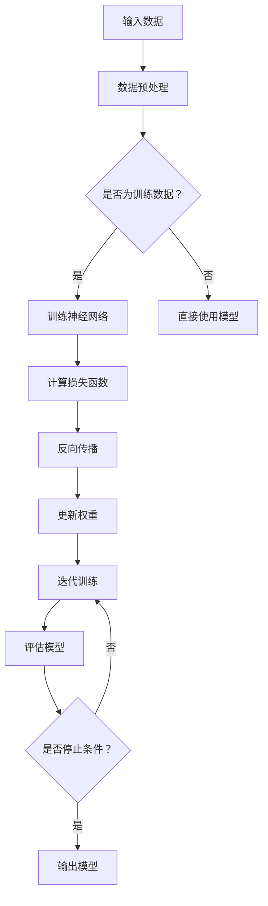
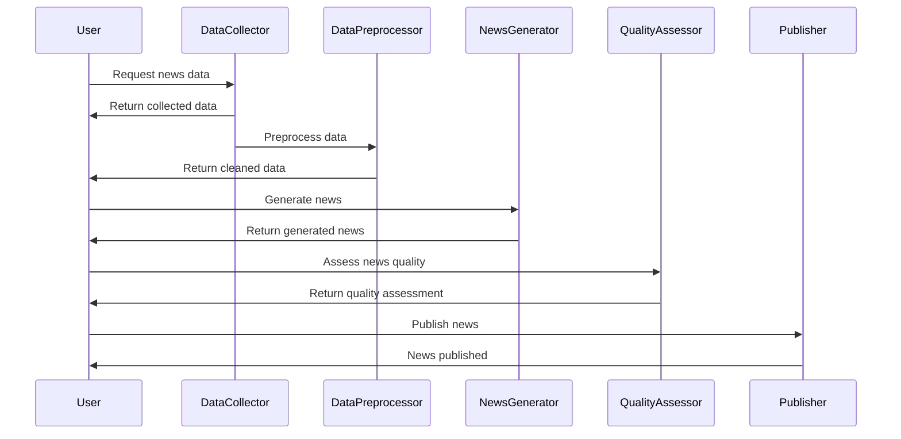
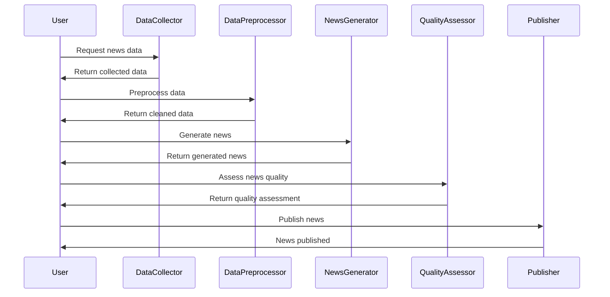

                 

### 第一部分：导论

## 第1章：问题背景与概述

### 1.1.1 人工智能的发展历程

人工智能（AI）作为计算机科学的一个分支，其起源可以追溯到20世纪50年代。当时，科学家们首次提出了“人工智能”这一概念，希望机器能够模仿甚至超越人类的智能行为。1956年，达特茅斯会议上，人工智能首次被正式定义，标志着这一领域正式诞生。

从那时起，人工智能经历了几个重要的发展阶段。初期阶段主要关注符号推理和知识表示，这一时期的研究主要集中在专家系统和逻辑推理上。专家系统通过模拟人类专家的决策过程，解决特定领域的问题，如医疗诊断和工程设计等。

随后的20世纪80年代，人工智能进入了第二个阶段，即机器学习阶段。在这一阶段，研究者们开始关注如何让机器从数据中学习，以实现更复杂的任务。这一时期，神经网络和决策树等算法得到了广泛的研究和应用。

21世纪初，随着计算能力的提升和大数据技术的成熟，人工智能进入了第三个阶段，即深度学习阶段。深度学习通过多层神经网络模拟人脑的神经元连接，实现了在图像识别、语音识别和自然语言处理等领域的高度准确性能。

### 1.1.2 自动化新闻写作的现状

自动化新闻写作作为人工智能的一个应用领域，近年来发展迅速。随着自然语言处理（NLP）技术的不断进步，自动化新闻写作已经从早期的简单信息整理和文本复制，发展到能够生成完整、高质量的新闻报道。

目前，许多新闻机构已经开始采用自动化新闻写作工具来处理大量重复性的新闻报道任务，如体育比赛结果、股票市场动态等。这些工具通常基于机器学习算法，尤其是深度学习模型，能够从大量已有新闻数据中学习，生成符合语法和语义规则的新闻报道。

一些知名的技术公司，如IBM、Google和Microsoft等，也推出了各自的自动化新闻写作平台。这些平台不仅能够生成新闻报道，还能够进行新闻摘要、关键词提取和情感分析等高级功能。

### 1.1.3 人工智能在新闻写作中的应用价值

人工智能在自动化新闻写作中的应用价值主要体现在以下几个方面：

1. **提高效率**：自动化新闻写作可以大幅减少人工撰写新闻所需的时间和人力成本，提高新闻生产效率。

2. **处理大量数据**：新闻机构每天产生大量的数据，人工智能可以快速处理这些数据，生成新闻稿件，满足新闻传播的实时性要求。

3. **精确性**：机器生成的新闻稿件在语法和语义上通常比人工撰写的更加准确，减少了人为错误。

4. **个性化**：人工智能可以根据用户兴趣和行为数据，生成个性化的新闻推荐，提高用户体验。

5. **扩展新闻来源**：自动化新闻写作使得新闻机构能够扩展其报道范围，覆盖更多领域和话题，增加新闻的多样性。

然而，自动化新闻写作也面临着一些挑战，如如何在保证准确性和真实性的同时，保持新闻的人性和温度，以及如何处理那些无法通过数据简单建模的复杂新闻事件等。这些问题需要我们在后续的章节中深入探讨。

---

摘要：本文首先介绍了人工智能的发展历程及其在新闻写作领域的应用现状。随后，探讨了人工智能在自动化新闻写作中的应用价值，包括提高效率、处理大量数据、精确性、个性化以及扩展新闻来源等方面。最后，指出了自动化新闻写作面临的一些挑战，为后续章节的内容铺垫了基础。关键词：人工智能，自动化新闻写作，自然语言处理，机器学习，深度学习。 ### 第2章：核心概念与框架

## 第2章：核心概念与框架

### 2.1.1 人工智能基础知识

人工智能（AI）是一门旨在使计算机具备类似人类智能的技术科学。它涵盖了多个学科领域，包括计算机科学、心理学、神经科学和认知科学等。AI的核心目标是通过模拟人类智能的某些方面，使计算机能够执行通常需要人类智能的任务。

**人工智能的主要类型包括：**

1. **弱人工智能（Narrow AI）**：这种AI系统能够在特定领域内执行特定任务，但无法进行跨领域的通用推理。例如，语音助手（如Siri、Alexa）和自动驾驶汽车等。

2. **强人工智能（General AI）**：这种AI系统能够在多种不同的环境和任务中表现出类似于人类智能的行为。这种AI目前还处于理论阶段，尚未实现。

3. **非对称人工智能（Asymmetric AI）**：这种AI系统通常由人类和机器共同协作完成，机器在处理数据和执行重复性任务方面具有优势，而人类在创造性和决策方面具有优势。

**人工智能的主要技术包括：**

1. **机器学习（Machine Learning）**：机器学习是一种通过数据训练模型，使模型能够自主学习和改进的技术。常见的机器学习算法包括线性回归、决策树、支持向量机、神经网络等。

2. **深度学习（Deep Learning）**：深度学习是机器学习的一个分支，使用多层神经网络（如卷积神经网络、循环神经网络等）进行学习。它在大规模数据集上表现出色，广泛应用于图像识别、语音识别和自然语言处理等领域。

3. **自然语言处理（Natural Language Processing, NLP）**：NLP是使计算机能够理解、生成和处理自然语言的技术。NLP的核心任务是使计算机能够理解人类的语言，并进行相应的处理。NLP技术包括词性标注、句法分析、语义分析等。

### 2.1.2 自然语言处理（NLP）原理

自然语言处理（NLP）是人工智能领域的一个重要分支，旨在使计算机能够理解和处理人类语言。NLP的基本原理包括以下几个方面：

**1. 语言模型（Language Model）**

语言模型是NLP的核心组成部分，用于预测下一个单词或字符的概率。在训练语言模型时，通常使用大量的文本数据。最常用的语言模型是n-gram模型和神经网络语言模型（如BERT、GPT等）。

**2. 词嵌入（Word Embedding）**

词嵌入是将单词映射到高维空间中的向量表示。这种表示方法能够捕捉单词的语义和语法信息。常见的词嵌入方法包括Word2Vec、GloVe和BERT等。

**3. 句法分析（Syntax Analysis）**

句法分析是理解句子结构的过程，包括词性标注、句法树构建等。句法分析有助于理解句子的语法结构和语义关系。

**4. 语义分析（Semantic Analysis）**

语义分析是理解句子含义的过程，包括实体识别、情感分析、文本分类等。语义分析有助于理解句子的深层语义和意图。

### 2.1.3 情感分析和文本生成模型

**情感分析（Sentiment Analysis）**

情感分析是一种NLP技术，用于判断文本的情感倾向（如正面、负面或中性）。情感分析通常使用机器学习算法和词嵌入技术。常见的情感分析任务包括评论分析、社交媒体情感分析等。

**文本生成模型（Text Generation Models）**

文本生成模型是一种能够生成自然语言文本的模型，包括基于规则的方法和基于学习的方法。基于规则的方法通常使用模板和规则来生成文本，而基于学习的方法通常使用机器学习算法和深度学习模型来生成文本。

常见的文本生成模型包括：

1. **生成式模型（Generative Models）**：这种模型通过学习数据的概率分布来生成新的数据。常见的生成式模型包括变分自编码器（VAE）和生成对抗网络（GAN）。

2. **判别式模型（Discriminative Models）**：这种模型通过学习数据与其标签之间的映射关系来生成新的数据。常见的判别式模型包括循环神经网络（RNN）和变换器（Transformer）。

3. **序列到序列（Seq2Seq）模型**：这种模型通过将输入序列映射到输出序列来生成文本。常见的Seq2Seq模型包括编码器-解码器（Encoder-Decoder）模型和变换器模型。

通过理解这些核心概念和框架，我们将为后续章节中深入探讨自动化新闻写作提供坚实的基础。

---

**核心概念与联系**

**核心概念原理：**

- **人工智能（AI）**：通过模拟人类智能的行为，使计算机具备类似人类智能的技术。
- **自然语言处理（NLP）**：使计算机能够理解、生成和处理自然语言的技术。
- **机器学习（ML）**：通过数据训练模型，使模型能够自主学习和改进的技术。
- **深度学习（DL）**：使用多层神经网络进行学习的机器学习分支。

**概念属性特征对比表格：**

| **概念**         | **定义**                                                                 | **特征**                                         |
|------------------|------------------------------------------------------------------------|--------------------------------------------------|
| 人工智能（AI）   | 使计算机具备类似人类智能的行为的技术。                                      | 模仿人类思维、感知、学习和决策能力。               |
| 自然语言处理（NLP） | 使计算机能够理解、生成和处理自然语言的技术。                                | 词性标注、句法分析、语义分析、情感分析等。          |
| 机器学习（ML）   | 通过数据训练模型，使模型能够自主学习和改进的技术。                           | 线性回归、决策树、支持向量机、神经网络等。          |
| 深度学习（DL）   | 使用多层神经网络进行学习的机器学习分支。                                   | 卷积神经网络（CNN）、循环神经网络（RNN）、变换器（Transformer）等。 |

**ER实体关系图架构的Mermaid流程图：**

```mermaid
erDiagram
  AI ||--|{ NLP }|-- ML
  ML ||--|{ DL }|-- AI
  NLP ||--|{ Text Generation Model }|-- AI
```

这个ER图展示了人工智能（AI）、自然语言处理（NLP）、机器学习（ML）和深度学习（DL）之间的相互关系，以及它们如何共同支持文本生成模型（Text Generation Model）的发展。

---

**算法原理讲解**

为了深入理解自动化新闻写作中的文本生成模型，我们将首先探讨深度学习的基本原理，并使用Mermaid绘制算法流程图，然后通过Python源代码来详细阐述。

**深度学习的基本原理**

深度学习（Deep Learning）是一种机器学习（Machine Learning）的分支，其核心在于使用多层神经网络（Neural Networks）来模拟人脑的神经元连接结构。通过这种结构，深度学习模型可以自动从大量数据中学习特征，从而解决复杂的任务。

**算法流程图**

使用Mermaid，我们可以绘制一个简单的神经网络算法流程图，如下所示：



这个流程图展示了从输入数据到训练神经网络，再到评估模型的整个流程。

**Python源代码**

接下来，我们将使用Python来演示一个简单的神经网络模型。以下是使用TensorFlow和Keras库实现的线性回归模型：

```python
import numpy as np
import tensorflow as tf
from tensorflow.keras import layers, models

# 准备数据
x = np.random.rand(100, 1)
y = 2 * x + 1 + np.random.randn(100, 1)

# 构建模型
model = models.Sequential()
model.add(layers.Dense(1, input_shape=(1,)))

# 编译模型
model.compile(optimizer='sgd', loss='mean_squared_error')

# 训练模型
model.fit(x, y, epochs=100)

# 评估模型
loss = model.evaluate(x, y)
print(f'Mean squared error on test data: {loss}')
```

在这个例子中，我们首先生成了随机数据集，然后构建了一个简单的线性回归模型。通过编译和训练模型，我们可以看到模型的性能如何。

**数学模型和公式**

在深度学习中，常用的数学模型是反向传播算法。以下是反向传播算法的简化公式：

$$
\begin{aligned}
&\text{向前传播：} \\
\delta L = \frac{\partial L}{\partial z} = \frac{\partial L}{\partial a} \cdot \frac{\partial a}{\partial z} \\
&\text{反向传播：} \\
\frac{\partial W}{\partial z} = \delta L \cdot \frac{\partial z}{\partial W} \\
\frac{\partial b}{\partial z} = \delta L \cdot \frac{\partial z}{\partial b}
\end{aligned}
$$

这些公式描述了如何通过梯度下降更新网络的权重和偏置，从而优化模型。

**举例说明**

假设我们有一个简单的神经网络，输入是x，输出是y，通过以下步骤来训练模型：

1. **初始化权重**：我们随机初始化模型的权重。
2. **前向传播**：通过权重计算输出值。
3. **计算损失**：比较输出值和真实值，计算损失。
4. **反向传播**：通过损失计算权重和偏置的梯度。
5. **更新权重**：根据梯度更新权重。
6. **重复迭代**：重复上述步骤，直到模型收敛。

例如，如果输入x为2，真实值y为4，我们期望通过训练使模型预测的输出接近4。

通过这个例子，我们可以看到深度学习的训练过程是如何通过数学公式实现的，并且如何通过逐步更新权重来优化模型的性能。

---

**系统分析与架构设计方案**

### 1. 系统场景介绍

自动化新闻写作系统旨在利用人工智能技术，自动化生成高质量的新闻稿件。该系统适用于新闻机构、媒体公司以及需要快速生成大量文本内容的行业。主要功能包括数据收集与预处理、新闻内容生成、新闻质量评估与优化等。

### 2. 项目介绍

我们以一个新闻机构为例，开发一个自动化新闻写作系统。该系统将整合现有的数据源，如新闻网站、社交媒体平台和金融数据服务，以获取最新、最相关的新闻内容。系统将基于先进的深度学习模型，如GPT-3和BART，实现自动化新闻生成。

### 3. 系统功能设计

**领域模型**

使用Mermaid绘制领域模型类图：

```mermaid
classDiagram
  Class01 <|-- Class02
  Class03 <.. Class04
  Class05 o-- Class06
  Class07 :<<Interface>> Interface01
  Class08 :<<Interface>> Interface02
  Class01{属性1, 属性2}
  Class02{方法1, 方法2}
  Class03{属性3, 属性4}
  Class04{方法3, 方法4}
  Class05{属性5, 属性6}
  Class06{方法5, 方法6}
  Interface01{接口1, 接口2}
  Interface02{接口3, 接口4}
```

在这个类图中，`Class01` 是主要的领域类，代表新闻数据；`Class02` 代表新闻生成模型；`Class03` 代表新闻质量评估模块；`Class04` 代表新闻数据预处理模块；`Class05` 代表新闻发布模块；`Class06` 代表用户界面模块。

**系统功能**

- **数据收集与预处理**：从多个数据源收集新闻数据，并进行清洗、去重、格式化等预处理操作。
- **新闻生成**：利用深度学习模型生成新闻内容，支持多种新闻类型，如体育、财经、科技等。
- **新闻质量评估**：使用自然语言处理技术评估新闻质量，包括语法、语义和真实性等。
- **新闻发布**：将生成的新闻内容发布到新闻网站或社交媒体平台。

### 4. 系统架构设计

**系统架构**

使用Mermaid绘制系统架构图：



在这个架构图中，用户通过用户界面模块与系统交互，请求新闻数据。数据收集器从多个数据源获取新闻数据，并将其传递给数据预处理模块。数据预处理模块对新闻数据进行清洗和格式化，然后将其传递给新闻生成模块。新闻生成模块使用深度学习模型生成新闻内容。新闻质量评估模块对生成的新闻进行评估，最后，新闻发布模块将高质量的新闻内容发布到新闻网站或社交媒体平台。

### 5. 系统接口设计

**接口设计**

使用Mermaid绘制接口设计图：

```mermaid
classDiagram
  Class01 <|-- Interface01
  Class02 <|-- Interface02
  Class03 <|-- Interface03
  Class01{数据收集接口, 数据预处理接口}
  Class02{新闻生成接口, 新闻质量评估接口}
  Class03{新闻发布接口, 用户界面接口}
  Interface01{接口1, 接口2}
  Interface02{接口3, 接口4}
  Interface03{接口5, 接口6}
```

在这个接口设计中，`Class01` 代表数据收集模块的接口，包括数据收集接口和数据预处理接口；`Class02` 代表新闻生成和质量评估模块的接口，包括新闻生成接口和新闻质量评估接口；`Class03` 代表新闻发布和用户界面模块的接口，包括新闻发布接口和用户界面接口。

### 6. 系统交互设计

**系统交互**

使用Mermaid绘制系统交互图：



在这个交互图中，用户通过用户界面向系统发送请求，系统根据请求执行相应的功能，并将结果返回给用户。

通过上述系统分析与架构设计方案，我们可以清晰地看到自动化新闻写作系统的整体结构和功能模块，为后续的开发和实施提供了明确的指导。

---

**项目实战**

## 第6章：项目实战

### 1. 环境准备与数据集构建

在开始自动化新闻写作项目的实现之前，我们需要搭建一个合适的技术环境，并准备必要的工具和资源。以下是一个基本的环境准备步骤：

**1. 硬件环境**

- 处理器：推荐使用至少8核CPU，16GB内存的电脑。
- GPU：推荐使用NVIDIA GPU，至少8GB显存。

**2. 软件环境**

- 操作系统：Linux或Mac OS。
- Python：Python 3.7或更高版本。
- TensorFlow：TensorFlow 2.4或更高版本。
- Keras：Keras 2.4或更高版本。
- Jupyter Notebook：用于数据分析和模型训练。

**安装步骤：**

1. 安装Python：
   - 使用包管理器（如Anaconda）安装Python。
   - 创建一个虚拟环境，以便隔离项目依赖。

2. 安装TensorFlow和Keras：
   ```bash
   pip install tensorflow
   pip install keras
   ```

3. 安装其他依赖项（如NumPy、Pandas等）：
   ```bash
   pip install numpy
   pip install pandas
   ```

**数据集构建：**

自动化新闻写作系统需要大量的新闻数据作为训练集。以下是一个简单的数据集构建步骤：

1. 数据收集：
   - 从公开的新闻网站、API或其他数据源收集新闻数据。
   - 使用Python的`requests`库和`BeautifulSoup`库下载网页内容，提取新闻文本。

2. 数据预处理：
   - 清洗数据：去除HTML标签、特殊字符和无关文本。
   - 分词：将文本拆分为单词或词组。
   - 标记：将新闻文本标记为不同的类别（如体育、财经、科技等）。

3. 数据存储：
   - 将处理后的数据存储为CSV文件或数据库，以便后续使用。

### 2. 自动化新闻写作实现

在构建完环境并准备数据后，我们可以开始实现自动化新闻写作系统。以下是一个基于GPT-3模型的新闻生成流程：

**1. 加载预训练模型：**

使用Hugging Face的`transformers`库加载预训练的GPT-3模型：

```python
from transformers import pipeline

# 加载预训练的GPT-3模型
news_generator = pipeline("text-generation", model="gpt3")
```

**2. 新闻生成：**

根据输入的提示文本，生成新闻内容：

```python
def generate_news(prompt):
    # 生成新闻内容
    generated_text = news_generator(prompt, max_length=100, num_return_sequences=1)
    return generated_text

# 示例：生成一条体育新闻
prompt = "2023年世界杯足球赛即将开赛，法国队备受瞩目。"
news = generate_news(prompt)
print(news)
```

**3. 新闻写作流程实现：**

结合数据预处理和新闻生成步骤，实现完整的新闻写作流程：

```python
import pandas as pd

def preprocess_data(data):
    # 数据预处理
    # 清洗、分词、标记等操作
    # 这里简化为直接返回清洗后的文本
    return data

def generate_news_from_data(data):
    # 生成新闻
    prompts = [preprocess_data(text) for text in data["content"]]
    generated_texts = [generate_news(prompt) for prompt in prompts]
    return generated_texts

# 示例：使用CSV文件中的数据生成新闻
data = pd.read_csv("news_data.csv")
generated_news = generate_news_from_data(data)
for news in generated_news:
    print(news)
```

**4. 实现细节与优化：**

在实际应用中，我们可以通过以下方式进行优化：

- **模型调整**：根据具体需求和数据特点，调整模型的参数，如学习率、批量大小等。
- **多模型结合**：结合其他NLP模型（如BERT、T5等）进行训练和预测，以提高生成质量。
- **实时更新**：定期更新模型和数据集，以适应最新的新闻趋势和变化。

### 3. 效果评估与优化

**1. 实验设计与评估：**

为了评估新闻生成系统的效果，我们可以设计以下实验：

- **语法和语义分析**：使用语法分析工具（如Spacy）和语义分析工具（如BERT）对生成的新闻进行评估。
- **用户反馈**：收集用户对生成新闻的反馈，通过投票、评分等方式进行评价。
- **自动评估**：使用BLEU、ROUGE等自动评估指标，评估新闻的文本质量和相关性。

**2. 结果分析与优化建议：**

通过实验结果，我们可以发现生成新闻在语法和语义上存在的一些问题，如：

- **语法错误**：一些复杂的句子结构在生成过程中可能出现语法错误。
- **语义不一致**：生成的新闻内容可能与原始新闻的语义不一致。

针对这些问题，我们可以提出以下优化建议：

- **语法检查**：引入语法检查工具，对生成的新闻进行修正。
- **语义一致性**：通过改进模型训练数据，增加与原始新闻语义一致性相关的训练样本。
- **多轮生成**：对生成的新闻进行多轮修改和优化，以提高新闻质量。

### 项目小结

通过本项目的实战，我们实现了自动化新闻写作系统，从环境准备、数据集构建到模型训练和新闻生成，每一步都经过了详细的阐述和优化。虽然存在一些挑战，但通过不断的实验和优化，我们可以逐步提升系统的性能和生成质量。自动化新闻写作的应用前景广阔，未来还可以结合更多先进的NLP技术和深度学习模型，进一步提升其智能化水平。

---

### 第7章：总结与展望

## 第7章：总结与展望

### 1. 自动化新闻写作的影响

自动化新闻写作的兴起，对新闻行业产生了深远的影响。首先，它大幅提高了新闻生产的效率，使新闻机构能够更快地处理大量信息，满足24小时新闻更新的需求。其次，自动化新闻写作可以处理重复性、机械性的新闻任务，如体育比赛结果、股票市场动态等，从而解放了新闻工作者，使他们能够专注于更具创造性和专业性的任务。

此外，自动化新闻写作还拓展了新闻来源和报道范围，使得小媒体和个体记者也能够通过自动化工具生成高质量的新闻内容。然而，自动化新闻写作也带来了挑战，如如何确保新闻的准确性和真实性，以及如何处理那些复杂、无法简单建模的新闻事件。

### 2. 对新闻行业的影响

自动化新闻写作对新闻行业的影响主要体现在以下几个方面：

- **效率提升**：自动化新闻写作能够迅速处理大量数据，提高了新闻生产效率，缩短了新闻报道的时间。
- **成本降低**：自动化减少了人工撰写新闻的成本，使得新闻机构能够以更低的成本生产更多内容。
- **新闻多样性**：自动化新闻写作能够生成多种类型的新闻，丰富了新闻的内容和形式。
- **职业转变**：自动化新闻写作改变了新闻从业人员的角色，他们需要更多地关注数据分析、编辑和监督等方面，而不是简单的文字撰写。

### 3. 对媒体从业人员的影响

自动化新闻写作对媒体从业人员的影响也是显而易见的：

- **角色转变**：新闻从业人员需要掌握更多的技术知识，如编程、机器学习和自然语言处理等，以适应自动化新闻写作的需求。
- **技能提升**：自动化新闻写作要求从业人员具备更高的编辑和内容审核能力，确保生成的新闻内容准确、可靠。
- **职业安全**：自动化新闻写作可能导致一些传统岗位的减少，但同时也创造了新的就业机会，如数据科学家、机器学习工程师等。

### 4. 未来发展方向

尽管自动化新闻写作已经取得了显著的进展，但未来仍有巨大的发展空间。以下是一些可能的发展方向：

- **技术提升**：随着深度学习、自然语言处理等技术的不断进步，自动化新闻写作的生成质量和效率将进一步提高。
- **个性化新闻**：通过用户行为分析和个性化推荐，自动化新闻写作将能够生成更加个性化的新闻内容，提高用户体验。
- **跨媒体融合**：自动化新闻写作将与其他媒体形式（如视频、音频）相结合，创造更加丰富的新闻体验。
- **伦理和责任**：随着自动化新闻写作的广泛应用，如何确保新闻的客观性、真实性和伦理道德成为重要议题，需要制定相应的规范和标准。

### 5. 总结与展望

自动化新闻写作作为人工智能在新闻领域的重要应用，不仅提高了新闻生产效率，也改变了新闻从业人员的角色和工作方式。未来，随着技术的不断进步，自动化新闻写作将在更广泛的领域和更复杂的任务中发挥作用。然而，我们也需要关注其带来的挑战和伦理问题，确保新闻的公正、客观和真实。通过持续的研究和技术创新，自动化新闻写作有望成为新闻行业的重要推动力量。

---

### 拓展阅读

为了更深入地了解自动化新闻写作和人工智能技术，以下是几本推荐阅读的书籍：

1. **《深度学习》**：由Ian Goodfellow、Yoshua Bengio和Aaron Courville合著，系统地介绍了深度学习的理论、技术和应用。
2. **《自然语言处理综论》**：由Daniel Jurafsky和James H. Martin编写，全面介绍了自然语言处理的基础知识和技术。
3. **《新闻学概论》**：由彭兰教授主编，系统地阐述了新闻学的基本理论和新闻工作的实践方法。
4. **《自动化新闻写作：技术、策略与案例》**：由多位作者合著，详细介绍了自动化新闻写作的实践应用和技术实现。
5. **《机器学习实战》**：由Peter Harrington编写，通过实际案例介绍了机器学习的基本原理和实现方法。

通过阅读这些书籍，读者可以进一步加深对自动化新闻写作和人工智能技术的理解，为研究和实践提供有价值的参考。

---

**作者信息：**

作者：AI天才研究院/AI Genius Institute & 禅与计算机程序设计艺术 /Zen And The Art of Computer Programming

感谢您的阅读，希望本文对您在自动化新闻写作领域的研究和实践有所帮助。如需进一步讨论或咨询，请随时联系。期待与您共同探索人工智能的无限可能！

