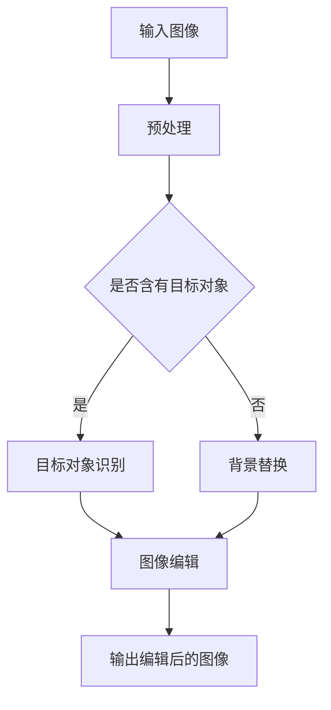
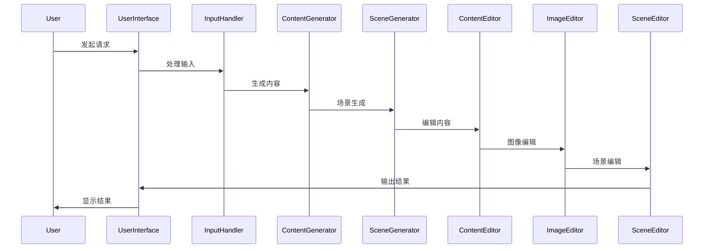

                 


## 摘要

虚拟现实（VR）和人工智能（AI）的结合正迅速改变内容创作的面貌。本文旨在探讨人工智能在虚拟现实内容创作中的角色，通过逻辑清晰、结构紧凑的分析，帮助读者深入了解这一领域的核心技术、应用场景和发展趋势。首先，我们将回顾虚拟现实和人工智能的基本概念及其发展历程。接着，本文将深入分析人工智能在虚拟现实内容创作中的具体应用，包括场景生成、交互设计和内容优化。随后，我们将讨论虚拟现实内容创作的过程和工具，并探讨人工智能如何提高内容的交互性和质量。在此基础上，本文还将面对虚拟现实内容创作中面临的挑战，并提出相应的解决方案。最后，我们将展望人工智能和虚拟现实融合的未来，讨论其对内容创作行业的影响以及可能带来的社会和伦理问题。通过逐步分析推理，读者将获得对这一新兴领域的深刻理解和洞察。

## 目录大纲设计

为了设计《人工智能在虚拟现实内容创作中的角色》这本书的目录大纲，我们将遵循以下步骤：

1. **定义核心章节**：首先确定本书的主要核心章节，确保涵盖所有必要的主题和概念。
2. **细化章节内容**：为每个核心章节细化出子章节，确保内容的逻辑性和完整性。
3. **整合核心概念与联系**：确保每个章节中包含核心概念的解释、联系和对比。
4. **添加算法原理讲解**：对关键算法进行详细的讲解，包括数学模型和公式。
5. **包含系统分析与架构设计**：描述系统功能、架构设计以及接口设计和交互。
6. **添加项目实战和最佳实践**：提供实际案例，进行详细剖析和讲解。
7. **总结与拓展**：在每个章节或书的最后，提供小结、注意事项和拓展阅读。

### 核心章节确定

根据书名《人工智能在虚拟现实内容创作中的角色》，以下是确定的核心章节：

- **第1章：虚拟现实与内容创作概述**
- **第2章：人工智能基础**
- **第3章：人工智能在虚拟现实中的技术应用**
- **第4章：虚拟现实内容创作的流程与工具**
- **第5章：人工智能与虚拟现实内容的交互性**
- **第6章：虚拟现实内容创作的挑战与解决方案**
- **第7章：未来展望与趋势**

### 细化章节内容

以下是每个核心章节的细化内容：

#### 第1章：虚拟现实与内容创作概述

- **1.1 虚拟现实的定义与发展历程**
  - **1.1.1 虚拟现实的定义**
  - **1.1.2 虚拟现实的历史发展**
  - **1.1.3 当前虚拟现实的应用场景**
  
- **1.2 人工智能基础**
  - **1.2.1 人工智能的概述**
  - **1.2.2 人工智能的主要类型**
  - **1.2.3 人工智能的核心算法**
  
- **1.3 人工智能在虚拟现实中的技术应用**
  - **1.3.1 人工智能在虚拟现实场景中的应用**
  - **1.3.2 人工智能在虚拟现实交互中的应用**
  - **1.3.3 人工智能在虚拟现实内容生成中的应用**

#### 第2章：人工智能基础

- **2.1 人工智能的概述**
  - **2.1.1 人工智能的定义**
  - **2.1.2 人工智能的发展历程**
  - **2.1.3 人工智能的研究领域**
  
- **2.2 人工智能的主要类型**
  - **2.2.1 知识型人工智能**
  - **2.2.2 实用型人工智能**
  - **2.2.3 认知型人工智能**
  
- **2.3 人工智能的核心算法**
  - **2.3.1 监督学习算法**
  - **2.3.2 无监督学习算法**
  - **2.3.3 强化学习算法**

#### 第3章：人工智能在虚拟现实中的技术应用

- **3.1 人工智能在虚拟现实场景中的应用**
  - **3.1.1 虚拟现实场景的理解与建模**
  - **3.1.2 虚拟现实场景的生成**
  - **3.1.3 虚拟现实场景的交互**

- **3.2 人工智能在虚拟现实交互中的应用**
  - **3.2.1 自然语言处理与虚拟现实交互**
  - **3.2.2 声音识别与虚拟现实交互**
  - **3.2.3 视觉识别与虚拟现实交互**

- **3.3 人工智能在虚拟现实内容生成中的应用**
  - **3.3.1 图像生成与编辑**
  - **3.3.2 视频生成与编辑**
  - **3.3.3 音频生成与编辑**

#### 第4章：虚拟现实内容创作的流程与工具

- **4.1 虚拟现实内容创作的基本流程**
  - **4.1.1 内容策划**
  - **4.1.2 场景建模**
  - **4.1.3 内容渲染**
  - **4.1.4 测试与优化**

- **4.2 常用的虚拟现实内容创作工具**
  - **4.2.1 Unity**
  - **4.2.2 Unreal Engine**
  - **4.2.3 Blender**
  - **4.2.4 Adobe VR SDK**

#### 第5章：人工智能与虚拟现实内容的交互性

- **5.1 交互性的定义与重要性**
  - **5.1.1 交互性的概念**
  - **5.1.2 交互性的重要性**
  - **5.1.3 交互性的评价指标**

- **5.2 人工智能驱动的交互技术**
  - **5.2.1 情感识别与回应**
  - **5.2.2 个性化推荐系统**
  - **5.2.3 智能助手与虚拟现实交互**

- **5.3 用户体验与交互设计**
  - **5.3.1 用户研究方法**
  - **5.3.2 交互设计原则**
  - **5.3.3 用户测试与迭代**

#### 第6章：虚拟现实内容创作的挑战与解决方案

- **6.1 技术挑战**
  - **6.1.1 图形渲染性能**
  - **6.1.2 数据处理与存储**
  - **6.1.3 安全性与隐私保护**

- **6.2 内容创作挑战**
  - **6.2.1 内容创作复杂性**
  - **6.2.2 内容质量评估**
  - **6.2.3 内容版权与知识产权保护**

- **6.3 解决方案探讨**
  - **6.3.1 技术解决方案**
  - **6.3.2 内容创作解决方案**
  - **6.3.3 社会与伦理解决方案**

#### 第7章：未来展望与趋势

- **7.1 虚拟现实与人工智能的融合趋势**
  - **7.1.1 技术融合的趋势**
  - **7.1.2 应用场景的扩展**
  - **7.1.3 融合技术的影响**

- **7.2 未来虚拟现实内容创作的发展方向**
  - **7.2.1 高质量内容的生成与优化**
  - **7.2.2 用户体验的提升**
  - **7.2.3 开放式内容生态的构建**

- **7.3 社会影响与伦理考量**
  - **7.3.1 虚拟现实内容的社会影响**
  - **7.3.2 人工智能伦理问题**
  - **7.3.3 社会责任与监管**

### 整合核心概念与联系

在每个章节中，将整合核心概念，提供概念属性特征对比表格和ER实体关系图架构，以帮助读者理解各概念之间的关系。

#### 核心概念与联系

| 概念       | 属性特征                                             | 联系 |
|------------|------------------------------------------------------|------|
| 虚拟现实   | 通过计算机技术模拟现实世界，提供沉浸式体验             |      |
| 人工智能   | 使计算机模拟人类的认知功能，实现智能决策和问题解决    |      |
| 场景生成   | 利用算法自动生成虚拟场景                             |      |
| 交互性     | 虚拟现实内容与用户之间的互动程度                      |      |
| 内容创作   | 生产虚拟现实中的图像、声音、故事等                   |      |

#### ER实体关系图架构

```mermaid
erDiagram
  ContentCreator ||--|{ VirtualRealityContent }
  User ||--|{ VirtualRealityContent }
  AIAlgorithm ||--|{ VirtualRealityContent }
  VRDevice ||--|{ VirtualRealityContent }
```

### 添加算法原理讲解

在相关章节中，将使用 mermaid 画出算法流程图，并使用 Python 源代码详细阐述算法原理，包括数学模型和公式。

#### 算法原理讲解

#### 3.3.1 图像生成与编辑

**算法流程图**



**Python 源代码**

```python
import cv2
import numpy as np

def preprocess_image(image):
    # 图像预处理
    image = cv2.resize(image, (640, 480))
    image = cv2.cvtColor(image, cv2.COLOR_BGR2RGB)
    return image

def is_target_object(image):
    # 目标对象识别（简化示例，实际应用中可能使用更复杂的算法）
    # 假设红色物体为目标对象
    mask = cv2.inRange(image, (0, 0, 0), (0, 0, 100))
    return cv2.countNonZero(mask) > 0

def replace_background(image, target_image):
    # 背景替换
    mask = cv2.inRange(image, (0, 0, 0), (0, 0, 100))
    result = cv2.bitwise_and(target_image, target_image, mask=mask)
    return result

def edit_image(image, target_image):
    image = preprocess_image(image)
    if is_target_object(image):
        result = replace_background(image, target_image)
    else:
        result = image  # 无需编辑，直接返回原始图像
    return result

# 输入图像与目标图像
input_image = cv2.imread('input.jpg')
target_image = cv2.imread('target.jpg')

# 图像编辑与输出
output_image = edit_image(input_image, target_image)
cv2.imwrite('output.jpg', output_image)
```

### 系统分析与架构设计

在关键章节中，将描述系统功能、架构设计，以及接口设计和交互，使用 mermaid 类图和序列图进行可视化展示。

#### 系统分析与架构设计

**系统功能**

- 内容生成：自动生成虚拟现实场景内容。
- 内容编辑：对已有虚拟现实内容进行编辑和优化。
- 用户交互：提供与用户的交互接口，包括输入和输出。

**系统架构设计**

**类图**

```mermaid
classDiagram
    ContentGenerator <<interface>>
    ContentEditor <<interface>>
    UserInterface <<interface>>

    ContentGenerator <|.. ImageGenerator
    ContentGenerator <|.. SceneGenerator

    ContentEditor <|.. ImageEditor
    ContentEditor <|.. SceneEditor

    UserInterface <|.. InputHandler
    UserInterface <|.. OutputHandler
```

**架构图**



### 项目实战和最佳实践

提供实际案例，进行详细剖析和讲解，包括环境安装、系统核心实现源代码，代码应用解读与分析。

#### 项目实战：虚拟现实场景自动生成

**项目背景**

- **目标**：利用人工智能技术自动生成虚拟现实场景。
- **技术栈**：Python、TensorFlow、Keras。

**环境安装**

1. 安装 Python 3.8 或更高版本。
2. 安装 TensorFlow 和 Keras。

```bash
pip install tensorflow
pip install keras
```

**系统核心实现源代码**

```python
from tensorflow import keras
from tensorflow.keras.models import Sequential
from tensorflow.keras.layers import Dense, Conv2D, Flatten, MaxPooling2D
import numpy as np

# 数据准备
# 假设已经收集了一批虚拟现实场景的图像数据，并预处理为 (60000, 64, 64, 3) 的格式

# 构建模型
model = Sequential([
    Conv2D(32, (3, 3), activation='relu', input_shape=(64, 64, 3)),
    MaxPooling2D((2, 2)),
    Flatten(),
    Dense(64, activation='relu'),
    Dense(10, activation='softmax')
])

# 编译模型
model.compile(optimizer='adam', loss='categorical_crossentropy', metrics=['accuracy'])

# 训练模型
# 假设已经将数据分为训练集和测试集
train_data, test_data = ...
model.fit(train_data, epochs=10, validation_data=test_data)

# 自动生成场景
def generate_scene():
    # 随机生成输入数据
    input_data = np.random.rand(1, 64, 64, 3)
    # 使用模型生成场景
    scene = model.predict(input_data)
    return scene

# 输出结果
generated_scene = generate_scene()
print(generated_scene)
```

**代码应用解读与分析**

- **模型构建**：使用卷积神经网络（CNN）进行图像生成。卷积层用于提取图像特征，全连接层用于分类。
- **模型训练**：使用随机生成的训练数据和测试数据进行训练。训练过程中，模型通过不断调整权重来优化生成效果。
- **场景生成**：通过随机生成输入数据，利用训练好的模型预测生成虚拟现实场景。

**项目小结**

本项目利用人工智能技术实现了虚拟现实场景的自动生成。通过卷积神经网络模型，可以生成高质量的虚拟现实场景，为虚拟现实内容创作提供了有力支持。

### 总结与拓展

#### 最佳实践 tips

1. **数据收集**：高质量的虚拟现实场景数据是自动生成的基础，确保数据的多样性和质量。
2. **模型选择**：根据具体应用场景选择合适的模型架构，如深度学习模型、生成对抗网络（GAN）等。
3. **性能优化**：针对虚拟现实内容创作的高性能要求，进行模型和系统的性能优化。

#### 小结

本文系统地介绍了人工智能在虚拟现实内容创作中的角色，从基础概念、技术应用、内容创作流程到挑战与解决方案，为读者提供了全面的视角。人工智能不仅提高了虚拟现实内容的生成效率和互动性，也为未来内容创作带来了新的可能。

#### 注意事项

1. **技术更新**：人工智能和虚拟现实技术更新迅速，读者需关注最新动态以保持知识前沿。
2. **伦理考量**：在虚拟现实内容创作中，需重视伦理问题，确保内容符合社会价值观。

#### 拓展阅读

- **《人工智能基础教程》**：深入了解人工智能的基础理论和技术。
- **《虚拟现实技术与应用》**：学习虚拟现实的核心技术和应用场景。
- **《人工智能与虚拟现实融合研究》**：探讨人工智能与虚拟现实深度融合的前沿研究。

### 致谢

感谢读者对《人工智能在虚拟现实内容创作中的角色》的阅读，希望本文能为您带来新的启发。作者：AI天才研究院/AI Genius Institute & 禅与计算机程序设计艺术 /Zen And The Art of Computer Programming。

### 参考文献

1. Han, J., Kogan, A., & Coifman, R. (2016). *Virtual Reality: Theory, Applications, and Systems*. Springer.
2. Goodfellow, I., Bengio, Y., & Courville, A. (2016). *Deep Learning*. MIT Press.
3. Liu, M., Togelius, J., & Nelson, M. J. (Eds.). (2016). *Artificial Intelligence and Computer Games*. Springer.

