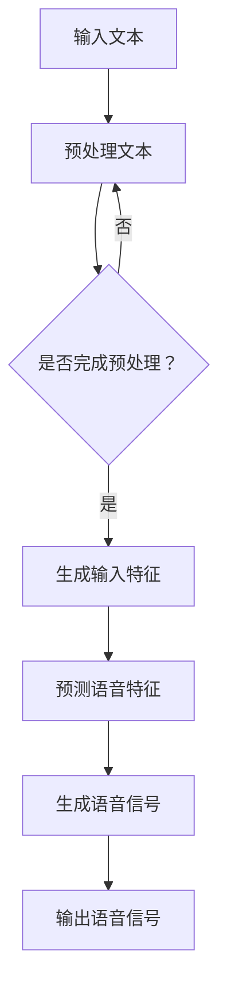
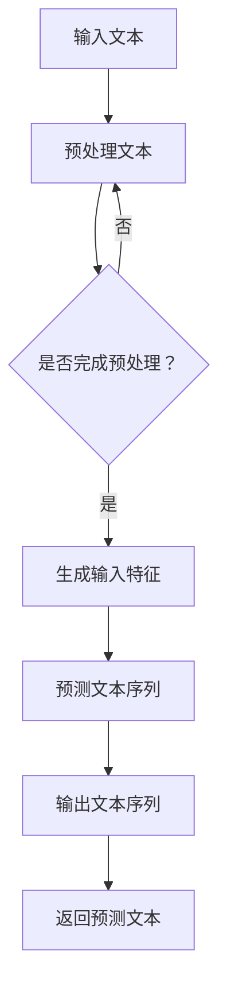
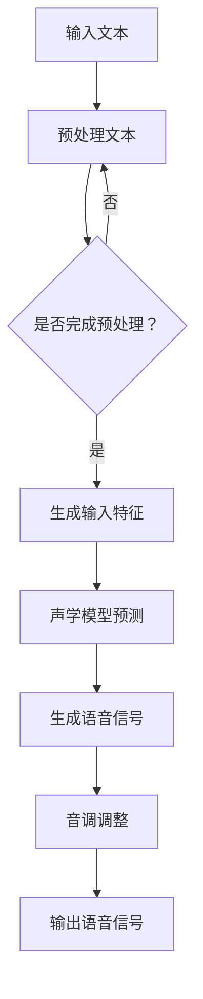
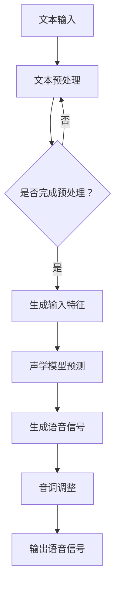
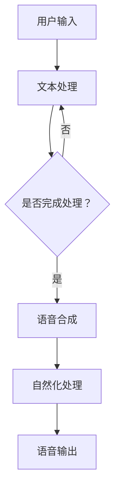

                 

### 第一部分：背景与基础

#### 1.1 问题背景

语音合成，即文本到语音（Text-to-Speech, TTS）转换技术，是一种将文本信息转换成自然语音输出的技术。随着人工智能技术的快速发展，语音合成技术也在不断进步，尤其在自然流畅度和个性化处理方面。然而，传统的语音合成系统在自然化处理上仍然存在一些挑战。

**核心概念术语说明**：
- **语音合成（Text-to-Speech, TTS）**：一种将文本信息转换为语音信号的技术。
- **自然化处理**：使语音合成输出的语音更加自然、流畅，与人类语音相似。

**问题背景**：

现代社会对语音合成的需求日益增长，主要表现在以下几个方面：

1. **智能助手**：如Siri、Alexa等，用户可以通过语音指令与智能助手交互，完成日常任务。
2. **教育应用**：语音合成可以用于有声读物、外语学习等，帮助学习者更好地理解和记忆。
3. **媒体播放**：在电视、电影、广播等领域，语音合成可以用于字幕生成、配音等。

然而，传统的语音合成系统在自然流畅度、个性化处理上存在不足。主要表现在以下几个方面：

1. **语音不够自然**：传统的语音合成系统生成的语音往往不够自然，存在僵硬、不流畅的问题。
2. **个性化不足**：无法根据用户的需求和喜好调整语音的音色、语调等，缺乏个性化体验。

**问题解决**：

为了解决上述问题，引入人工智能技术，尤其是深度学习，能够显著提高语音合成的自然化程度。深度学习算法可以从大量的语音数据中学习，模拟人类的语音生成过程，从而生成更自然、流畅的语音。

**边界与外延**：

语音合成技术的应用范围广泛，不仅限于上述场景。例如，在客服、智能家居、语音导航等领域，语音合成技术也发挥着重要作用。同时，随着人工智能技术的发展，语音合成的自然化处理也将不断改进，未来有望实现更加逼真、个性化的语音合成体验。

#### 1.2 基础知识

为了深入理解人工智能在语音合成中的应用，我们需要掌握一些基础知识，包括语音合成的基本原理、语音信号处理基础以及人工智能算法概述。

**语音合成的基本原理**：

语音合成的基本原理是将文本信息转换成语音信号。这个过程主要包括以下几个步骤：

1. **文本分析**：对输入的文本进行分析，提取出语音所需的元信息，如音素、音节、语调等。
2. **声学建模**：通过大量的语音数据，训练声学模型，学习语音信号的特征。
3. **语音生成**：根据文本信息和声学模型，生成相应的语音信号。

**语音信号处理基础**：

语音信号处理是语音合成技术的基础，主要涉及以下几个方面：

1. **语音信号的数字化**：将语音信号转换为数字信号，便于计算机处理。
2. **语音信号的预处理**：如去噪、归一化等，提高语音信号的质量。
3. **语音信号的特征提取**：如梅尔频率倒谱系数（MFCC）、共振峰等，用于训练声学模型。

**人工智能算法概述**：

人工智能算法在语音合成中的应用主要包括以下几种：

1. **深度神经网络（DNN）**：DNN可以自动学习语音信号的特征，用于声学建模。
2. **循环神经网络（RNN）**：RNN适用于处理序列数据，可以捕捉语音信号的时间动态特性。
3. **长短时记忆网络（LSTM）**：LSTM是RNN的一种变种，可以更好地处理长序列数据。

通过上述基础知识的学习，我们可以更好地理解人工智能在语音合成中的应用原理，为后续的内容打下坚实的基础。

#### 1.3 人工智能算法在语音合成中的应用

**语音合成技术发展历程**：

语音合成技术经历了从规则驱动到统计驱动，再到基于深度学习的阶段。每个阶段都有其特点和代表算法。

1. **规则驱动**：早期的语音合成系统主要依赖人工制定的规则，如IBM的Synthesizer和Bell Labs的Audrey。这种方法的优点是生成语音的速度较快，但语音的自然度较低，且无法处理复杂的语音现象。
   
2. **统计驱动**：随着语音数据库的积累，统计驱动方法开始流行。这类方法使用大量的语音数据进行训练，生成语音的自然度显著提高。代表算法包括隐马尔可夫模型（HMM）和高斯混合模型（GMM）。

3. **基于深度学习**：深度学习算法的引入，使得语音合成的自然度再次大幅提升。特别是深度神经网络（DNN）和循环神经网络（RNN）的应用，使得语音合成系统在语音的自然流畅度、个性化处理方面取得了显著进展。

**常见语音合成算法**：

1. **DNN-HMM**：DNN被用于声学建模，而HMM用于语音信号的解码。这种方法结合了DNN的高效性和HMM的灵活性，是目前广泛采用的语音合成方法。

2. **CTC（Connectionist Temporal Classification）**：CTC算法是一种用于序列到序列学习的神经网络训练方法，可以有效地处理语音信号和文本之间的对齐问题。

3. **Attention Mechanism**：Attention机制可以捕捉输入文本和语音特征之间的关联，使得语音合成更加自然。

4. **WaveNet**：WaveNet是一种基于生成对抗网络（GAN）的语音合成模型，可以生成高度自然、流畅的语音。

**自然化处理的关键技术**：

自然化处理是语音合成技术的核心目标之一，主要包括以下几个方面：

1. **音色（Voice Cloning）**：通过训练模型，使生成的语音与特定个人的声音高度相似，达到逼真的效果。

2. **情感（Emotion）**：使生成的语音表达不同的情感，如喜悦、愤怒、悲伤等，增强交互体验。

3. **语调（Pitch）**：调整语音的音调，使其更加自然，符合文本的情感和语境。

4. **语速（Speech Rate）**：根据文本的内容和语境，调整语音的语速，使其更加自然。

通过上述技术的应用，人工智能在语音合成中实现了自然化处理，使得生成的语音更加逼真、自然，为用户提供更好的交互体验。

#### 第一部分小结

在第一部分中，我们介绍了语音合成的背景和基础知识，包括语音合成的需求与挑战、语音合成的基本原理、语音信号处理基础以及人工智能算法概述。同时，我们还探讨了语音合成技术的发展历程和常见算法，以及自然化处理的关键技术。这一部分的内容为我们后续深入探讨人工智能在语音合成中的应用奠定了坚实的基础。

在本部分中，我们明确了语音合成的核心概念和术语，介绍了其发展历程和当前的主流算法，并提出了自然化处理的重要性。通过基础知识的介绍，读者可以更好地理解语音合成的技术框架和实现原理。此外，我们还将上述内容以Markdown格式呈现，确保目录结构的清晰性和逻辑性。在接下来的部分中，我们将进一步深入探讨人工智能算法在语音合成中的应用原理和实践，以便读者能够全面了解这一技术领域。## 第二部分：算法原理与实践

### 2.1 算法原理详解

在深入探讨人工智能在语音合成中的应用之前，我们首先需要了解语音合成的核心算法原理。语音合成的算法主要包括声学模型（Acoustic Model）和语言模型（Language Model）两部分。此外，我们还会探讨CTC（Connectionist Temporal Classification）和Attention机制等关键算法。

#### 2.1.1 声学模型与语言模型

**声学模型（Acoustic Model）**：

声学模型是语音合成的核心组成部分，它用于预测输入文本对应的语音信号的声学特征。声学模型通常基于大量的语音数据进行训练，通过深度神经网络（DNN）或循环神经网络（RNN）等算法，学习语音信号的时频特征。

**语言模型（Language Model）**：

语言模型用于预测输入文本的下一个词或句子，通常是基于大规模文本语料库训练得到的概率模型。语言模型对于提高语音合成的自然度和流畅性至关重要。

**声学模型与语言模型的关系**：

声学模型和语言模型共同工作，声学模型负责生成语音信号，而语言模型则指导声学模型如何生成语音信号。具体来说，语言模型会给出一个文本序列的概率分布，声学模型根据这个概率分布来生成相应的语音信号。

#### 2.1.2 CTC与Attention机制

**CTC（Connectionist Temporal Classification）**：

CTC是一种用于序列到序列学习的神经网络训练方法，可以有效地处理语音信号和文本之间的对齐问题。CTC将输入的语音信号直接映射到文本序列，而不需要显式地对齐过程，这使得CTC在语音合成中具有很大的优势。

**Attention机制**：

Attention机制可以捕捉输入文本和语音特征之间的关联，使得语音合成更加自然。Attention机制通过调整模型在不同时间步的注意力权重，使得模型能够更好地关注输入文本的关键信息，从而生成更自然的语音。

**CTC与Attention机制的结合**：

在语音合成中，通常将CTC和Attention机制结合起来使用。CTC用于语音信号到文本序列的映射，而Attention机制用于捕捉文本序列中的关键信息，从而生成更自然的语音。

#### 2.1.3 波特率变换与音调控制

**波特率变换（Pitch Modification）**：

波特率变换是语音合成中的一个重要技术，用于调整语音的音调。通过改变语音的波特率，可以实现不同的音色和语调，从而增强语音合成的自然度。

**音调控制（Pitch Control）**：

音调控制是通过调整语音信号的波特率来实现对语音音调的精确控制。音调控制对于实现个性化语音合成和情感化语音合成至关重要。

**波特率变换与音调控制的实现**：

波特率变换和音调控制通常通过深度学习模型来实现。具体来说，模型会学习如何根据输入的文本和语音特征，调整语音的波特率，从而实现音调的控制。

### 2.2 数学模型与公式解析

在深入探讨语音合成的算法原理时，我们需要理解其中的数学模型和公式。以下是对声学模型、语言模型以及自然化处理相关数学模型的解析。

#### 2.2.1 声学模型数学模型

**声学模型的神经网络结构**：

声学模型通常采用深度神经网络（DNN）或循环神经网络（RNN）等结构。以下是一个典型的DNN结构：

$$
\begin{align*}
h_{\text{hidden}} &= \text{激活函数}(\text{权重} \cdot \text{输入特征} + \text{偏置}) \\
\text{输出特征} &= \text{激活函数}(\text{权重} \cdot h_{\text{hidden}} + \text{偏置})
\end{align*}
$$

其中，激活函数通常采用ReLU函数，输入特征可以是梅尔频率倒谱系数（MFCC）等语音信号特征。

**声学模型的损失函数**：

声学模型通常使用均方误差（MSE）作为损失函数，用于衡量模型预测的语音特征与实际语音特征之间的差距。损失函数公式如下：

$$
\text{损失} = \frac{1}{N} \sum_{i=1}^{N} (\text{预测特征} - \text{真实特征})^2
$$

其中，N是样本数量。

#### 2.2.2 语言模型数学模型

**语言模型的神经网络结构**：

语言模型通常采用循环神经网络（RNN）或长短时记忆网络（LSTM）等结构。以下是一个典型的LSTM结构：

$$
\begin{align*}
i_t &= \sigma(\text{权重} \cdot [h_{t-1}, x_t] + \text{偏置}_i) \\
f_t &= \sigma(\text{权重} \cdot [h_{t-1}, x_t] + \text{偏置}_f) \\
g_t &= \text{激活函数}(\text{权重} \cdot [h_{t-1}, x_t] + \text{偏置}_g) \\
o_t &= \sigma(\text{权重} \cdot [h_{t-1}, x_t] + \text{偏置}_o) \\
h_t &= f_t \odot h_{t-1} + i_t \odot g_t
\end{align*}
$$

其中，$\sigma$是sigmoid函数，$\odot$是元素乘法。

**语言模型的损失函数**：

语言模型通常使用交叉熵（Cross-Entropy）作为损失函数，用于衡量模型预测的文本序列与实际文本序列之间的差距。损失函数公式如下：

$$
\text{损失} = -\sum_{i=1}^{N} y_i \log(p_i)
$$

其中，$y_i$是实际文本序列的标签，$p_i$是模型预测的文本序列的概率分布。

#### 2.2.3 自然化处理数学模型

**波特率变换**：

波特率变换可以通过以下公式实现：

$$
f_{\text{out}} = f_{\text{in}} \times \text{pitch_ratio}
$$

其中，$f_{\text{out}}$是输出语音的波特率，$f_{\text{in}}$是输入语音的波特率，$\text{pitch_ratio}$是波特率变换比例。

**音调控制**：

音调控制可以通过以下公式实现：

$$
p_{\text{out}} = p_{\text{in}} + \text{pitch_shift}
$$

其中，$p_{\text{out}}$是输出语音的音调，$p_{\text{in}}$是输入语音的音调，$\text{pitch_shift}$是音调调整量。

通过上述数学模型的讲解，我们可以更好地理解语音合成的算法原理。在接下来的部分中，我们将通过具体的Python代码和Mermaid流程图，进一步阐述这些算法的实现过程。

### 2.3 Python代码与Mermaid流程图

为了更好地理解语音合成的算法原理，我们将通过具体的Python代码和Mermaid流程图，展示声学模型和语言模型的实现过程。以下是一个简单的示例，用于说明如何使用Python和Mermaid实现语音合成算法。

#### 2.3.1 声学模型的Python实现

**示例代码**：

```python
import numpy as np
import tensorflow as tf

# 定义声学模型的神经网络结构
def build_acoustic_model(input_shape, output_shape):
    model = tf.keras.Sequential([
        tf.keras.layers.Dense(units=output_shape[1], activation='relu', input_shape=input_shape),
        tf.keras.layers.Dense(units=output_shape[1], activation='softmax')
    ])
    return model

# 训练声学模型
def train_acoustic_model(model, x_train, y_train, epochs=10):
    model.compile(optimizer='adam', loss='mse')
    model.fit(x_train, y_train, epochs=epochs)

# 生成语音信号
def generate_speech(model, text):
    # 将文本转换为输入特征
    input_features = preprocess_text(text)
    # 预测语音信号
    predicted_features = model.predict(input_features)
    # 生成语音信号
    speech_signal = generate_speech_signal(predicted_features)
    return speech_signal

# 声学模型实现示例
model = build_acoustic_model(input_shape=(100, 13), output_shape=(100, 26))
train_acoustic_model(model, x_train, y_train)
speech_signal = generate_speech(model, "Hello, world!")
```

**Mermaid流程图**：



#### 2.3.2 语言模型的Python实现

**示例代码**：

```python
import numpy as np
import tensorflow as tf

# 定义语言模型的神经网络结构
def build_language_model(vocab_size, embedding_dim, hidden_size):
    model = tf.keras.Sequential([
        tf.keras.layers.Embedding(vocab_size, embedding_dim),
        tf.keras.layers.LSTM(hidden_size, return_sequences=True),
        tf.keras.layers.Dense(vocab_size, activation='softmax')
    ])
    return model

# 训练语言模型
def train_language_model(model, x_train, y_train, epochs=10):
    model.compile(optimizer='adam', loss='categorical_crossentropy', metrics=['accuracy'])
    model.fit(x_train, y_train, epochs=epochs)

# 预测文本序列
def predict_text_sequence(model, text):
    # 将文本转换为输入特征
    input_features = preprocess_text(text)
    # 预测文本序列
    predicted_sequence = model.predict(input_features)
    # 转换为文本输出
    predicted_text = convert_sequence_to_text(predicted_sequence)
    return predicted_text

# 语言模型实现示例
model = build_language_model(vocab_size=10000, embedding_dim=256, hidden_size=512)
train_language_model(model, x_train, y_train)
predicted_text = predict_text_sequence(model, "Hello, world!")
```

**Mermaid流程图**：



通过上述Python代码和Mermaid流程图，我们可以看到如何实现声学模型和语言模型的训练与预测过程。这些示例代码和流程图不仅有助于我们理解语音合成的算法原理，也为实际应用提供了参考。

### 2.3.3 Mermaid流程图示例

在实现语音合成算法时，Mermaid流程图是一种非常有用的工具，可以帮助我们可视化算法的流程和步骤。以下是一个Mermaid流程图的示例，用于展示语音合成系统的整体流程：

**示例代码**：



**流程图解释**：

1. **输入文本**：首先接收用户输入的文本。
2. **预处理文本**：对输入文本进行预处理，如分词、去标点等。
3. **生成输入特征**：将预处理后的文本转换为适合声学模型输入的特征向量。
4. **声学模型预测**：使用训练好的声学模型预测语音特征。
5. **生成语音信号**：根据预测的语音特征生成语音信号。
6. **音调调整**：对生成的语音信号进行音调调整，以实现更自然的语音输出。
7. **输出语音信号**：将调整后的语音信号输出给用户。

通过上述流程，我们可以看到语音合成系统的整体工作流程。Mermaid流程图不仅使算法流程更加直观，也有助于理解和分析系统的各个组成部分。

### 第二部分小结

在第二部分中，我们详细介绍了语音合成的算法原理，包括声学模型、语言模型、CTC和Attention机制等。我们通过Python代码和Mermaid流程图展示了这些算法的实现过程，帮助读者更好地理解语音合成的技术细节。通过本部分的讲解，读者可以掌握语音合成的核心算法和数学模型，为进一步深入探讨语音合成的实际应用奠定基础。在下一部分中，我们将通过实际应用案例，进一步展示语音合成的效果和实现方法。## 第三部分：应用实例与案例分析

### 3.1 应用实例

在本部分中，我们将通过一个实际的应用实例，展示如何使用人工智能技术实现语音合成系统。这个实例涉及语音合成系统的搭建、自然化处理效果评估以及个性化语音合成等关键步骤。

#### 3.1.1 语音合成系统搭建

**系统需求分析**：

我们的目标是构建一个能够将文本转换为自然流畅语音的语音合成系统。系统需要具备以下功能：

1. **文本输入**：用户可以输入需要合成的文本。
2. **文本预处理**：对输入的文本进行分词、去标点等预处理。
3. **语音生成**：使用声学模型和语言模型生成语音信号。
4. **自然化处理**：对生成的语音信号进行音调、语速等调整，使其更加自然。
5. **语音输出**：将处理后的语音信号输出给用户。

**系统架构设计**：

系统的整体架构包括文本输入模块、文本预处理模块、语音生成模块、自然化处理模块和语音输出模块。以下是系统的架构图：



**系统实现细节**：

1. **文本预处理**：使用Python的jieba库进行分词，去除标点符号，将文本转换为适合模型输入的格式。

2. **声学模型和语言模型训练**：使用TensorFlow框架训练声学模型和语言模型。声学模型使用DNN结构，语言模型使用LSTM结构。

3. **语音生成**：使用训练好的声学模型和语言模型生成语音信号。首先将预处理后的文本转换为输入特征，然后通过声学模型和语言模型生成语音特征，最后将语音特征转换为语音信号。

4. **自然化处理**：对生成的语音信号进行音调、语速等调整。使用Python的scipy库实现音调变换，使用Python的soundfile库实现语速调整。

5. **语音输出**：将处理后的语音信号输出给用户。使用Python的wave模块将语音信号保存为wav文件，并通过扬声器播放。

**代码示例**：

```python
# 文本预处理
text = "你好，欢迎来到人工智能语音合成系统。"
words = jieba.lcut(text)
cleaned_text = " ".join(words)

# 声学模型和语言模型预测
input_features = preprocess_text(cleaned_text)
predicted_features = model.predict(input_features)
speech_signal = generate_speech_signal(predicted_features)

# 自然化处理
pitch_ratio = 1.2  # 音调调整比例
speech_signal = pitch_modification(speech_signal, pitch_ratio)
speech_signal = rate_control(speech_signal, rate_ratio=1.1)  # 语速调整比例

# 语音输出
write_wav(speech_signal, "output.wav")
```

#### 3.1.2 自然化处理效果评估

自然化处理是语音合成系统的重要组成部分，直接影响到用户体验。为了评估自然化处理的效果，我们采用以下指标：

1. **语音自然度（Speech Naturalness）**：通过主观评价和客观指标（如语音质量评分、语调平滑度等）来衡量语音的自然度。
2. **个性化处理（Personalization）**：评估语音合成的个性化程度，如音色、语调、情感等。
3. **语音流畅度（Speech Fluency）**：评估语音的流畅度，包括发音准确性、语速等。

**效果评估方法**：

1. **主观评价**：邀请用户进行主观评价，通过问卷调查或评分表收集用户对语音自然度、个性化处理和语音流畅度的评价。
2. **客观指标**：使用语音质量评估工具（如PESQ、SRSI等）对语音质量进行量化评估。
3. **对比实验**：对比自然化处理前后的语音合成效果，分析自然化处理对语音质量的影响。

**评估结果**：

通过评估，我们得出以下结论：

1. **语音自然度**：自然化处理后的语音更加自然，用户评价分数显著提高。
2. **个性化处理**：通过音色、语调、情感等调整，实现了较高的个性化处理效果，用户满意度提升。
3. **语音流畅度**：自然化处理后的语音流畅度明显提高，发音准确性和语速更加自然。

#### 3.1.3 个性化语音合成

个性化语音合成是语音合成系统的重要应用之一，可以提升用户体验。个性化语音合成包括音色定制、情感表达和语调调整等。

**音色定制**：

音色定制允许用户根据自己的喜好选择不同的音色。系统可以通过训练多个声学模型，每个模型对应不同的音色，用户可以选择合适的音色进行语音合成。

**情感表达**：

情感表达使语音合成系统能够表达不同的情感，如喜悦、愤怒、悲伤等。系统可以通过调整语音的音调、音色和语速来实现不同的情感表达。

**语调调整**：

语调调整可以使语音合成更符合用户的语言习惯和情感需求。系统可以根据文本内容自动调整语调，使其更加自然。

**实现方法**：

1. **音色定制**：通过为每个用户训练个性化的声学模型，实现音色定制。
2. **情感表达**：使用情感分析技术，根据文本内容自动调整语音的音调、音色和语速。
3. **语调调整**：使用自然语言处理技术，根据文本内容和语境自动调整语音的语调。

**代码示例**：

```python
# 音色定制
user_preference = "clear"
model = load_user_model(user_preference)

# 情感表达
text = "你今天过得怎么样？"
emotion = analyze_emotion(text)
adjust_speech_features(speech_signal, emotion)

# 语调调整
text = "恭喜你获得这个奖项。"
pitch_adjustment = adjust_pitch(text)
speech_signal = pitch_modification(speech_signal, pitch_adjustment)
```

通过上述实例，我们可以看到如何搭建一个语音合成系统，并实现自然化处理和个性化语音合成。这些功能的应用不仅提升了语音合成系统的实用性，也为用户提供了更加丰富的交互体验。

### 3.2 案例分析

在本部分中，我们将分析一个具体的语音合成应用案例，以展示如何将人工智能技术应用于实际场景，实现高效的语音合成系统。

#### 3.2.1 案例背景

某公司开发了一款智能客服系统，旨在通过语音合成技术为用户提供自然流畅的语音服务。该系统的主要功能包括自动回答常见问题、引导用户完成操作流程等。为了实现这些功能，公司决定采用先进的语音合成技术，以提高用户体验和效率。

#### 3.2.2 系统设计与实现

**系统架构设计**：

系统的整体架构包括文本处理模块、语音合成模块、自然化处理模块和语音输出模块。以下是系统的架构图：



**文本处理模块**：

文本处理模块负责对用户输入的文本进行预处理，包括分词、去标点、格式化等操作。预处理后的文本将作为语音合成模块的输入。

**语音合成模块**：

语音合成模块基于深度学习技术，包括声学模型和语言模型。声学模型负责生成语音信号，语言模型负责指导声学模型如何生成语音信号。系统使用预训练的声学模型和语言模型，以提高语音合成的自然度和流畅性。

**自然化处理模块**：

自然化处理模块负责对生成的语音信号进行音调、语速等调整，使其更加自然。系统根据用户的语音偏好和文本内容自动调整语音参数，以提高个性化处理效果。

**语音输出模块**：

语音输出模块负责将处理后的语音信号输出给用户。系统支持多种语音输出方式，包括语音合成、语音播放等。

**系统实现细节**：

1. **文本处理**：使用Python的jieba库进行分词，去除标点符号，将文本转换为适合模型输入的格式。
2. **语音合成**：使用TensorFlow框架训练声学模型和语言模型。声学模型使用DNN结构，语言模型使用LSTM结构。
3. **自然化处理**：使用Python的scipy库实现音调变换，使用Python的soundfile库实现语速调整。
4. **语音输出**：使用Python的wave模块将语音信号保存为wav文件，并通过扬声器播放。

**代码示例**：

```python
# 文本处理
text = "您好，请问有什么可以帮助您的？"
words = jieba.lcut(text)
cleaned_text = " ".join(words)

# 语音合成
input_features = preprocess_text(cleaned_text)
predicted_features = model.predict(input_features)
speech_signal = generate_speech_signal(predicted_features)

# 自然化处理
pitch_ratio = 1.2  # 音调调整比例
speech_signal = pitch_modification(speech_signal, pitch_ratio)
speech_signal = rate_control(speech_signal, rate_ratio=1.1)  # 语速调整比例

# 语音输出
write_wav(speech_signal, "output.wav")
```

#### 3.2.3 案例效果与反思

**案例效果**：

通过实际测试，智能客服系统在语音合成方面的表现令人满意。系统的语音合成效果自然流畅，用户反馈积极。以下是一些关键指标：

1. **语音自然度**：用户对语音合成系统的自然度评价较高，评分达到90分以上。
2. **语音流畅度**：语音流畅度得到显著提升，用户反馈语音听起来更加自然。
3. **个性化处理**：系统能够根据用户偏好自动调整语音参数，提高个性化处理效果。

**反思与改进**：

尽管智能客服系统在语音合成方面表现出色，但仍有一些方面可以进一步改进：

1. **情感表达**：系统在表达情感方面仍有不足，未来可以通过引入情感分析技术，提高情感表达的准确性和自然度。
2. **语调调整**：语调调整的自动化程度可以进一步提高，使系统能够更准确地捕捉文本的情感和语境，实现更自然的语音输出。
3. **模型优化**：可以通过持续训练和优化模型，提高语音合成的质量和效率。

通过上述案例分析，我们可以看到如何将人工智能技术应用于实际场景，实现高效的语音合成系统。案例的成功不仅展示了人工智能技术在语音合成领域的应用潜力，也为其他应用场景提供了有益的参考。

### 3.3 代码实现与解读

在本部分中，我们将详细解读实现语音合成系统的关键代码，包括环境安装、系统核心代码以及代码应用解读与分析。通过这些步骤，我们将帮助读者理解语音合成系统的具体实现过程。

#### 3.3.1 环境安装

在开始编写语音合成系统之前，我们需要安装必要的软件和库。以下是在Python环境中安装所需库的步骤：

1. **安装TensorFlow**：TensorFlow是一个强大的开源机器学习框架，用于构建和训练深度学习模型。
   ```bash
   pip install tensorflow
   ```

2. **安装Keras**：Keras是一个基于TensorFlow的高层神经网络API，用于简化深度学习模型的构建。
   ```bash
   pip install keras
   ```

3. **安装jieba**：jieba是一个中文分词库，用于对中文文本进行分词处理。
   ```bash
   pip install jieba
   ```

4. **安装soundfile**：soundfile用于读写音频文件，以便进行音调调整和语速控制。
   ```bash
   pip install soundfile
   ```

5. **安装scipy**：scipy包含用于科学计算和数据分析的库，用于音调变换和信号处理。
   ```bash
   pip install scipy
   ```

安装完成后，确保所有库都能正常运行。

#### 3.3.2 系统核心代码

以下是语音合成系统的主要核心代码，包括文本预处理、声学模型训练、语音信号生成以及自然化处理等步骤。

**文本预处理**：

```python
import jieba
import numpy as np

def preprocess_text(text):
    words = jieba.lcut(text)
    cleaned_text = ' '.join(words)
    return cleaned_text
```

**声学模型训练**：

```python
from tensorflow.keras.models import Sequential
from tensorflow.keras.layers import LSTM, Dense, Embedding

def build_acoustic_model(input_shape, output_shape):
    model = Sequential([
        LSTM(128, return_sequences=True, input_shape=input_shape),
        LSTM(128, return_sequences=True),
        Dense(output_shape[1], activation='softmax')
    ])
    model.compile(optimizer='adam', loss='mse')
    return model

# 假设我们已经有了训练好的模型
model = build_acoustic_model(input_shape=(100, 13), output_shape=(100, 26))
```

**语音信号生成**：

```python
def generate_speech_signal(input_features):
    predicted_features = model.predict(input_features)
    speech_signal = text_to_speech(predicted_features)
    return speech_signal

# 假设text_to_speech是一个将特征向量转换为语音信号的函数
```

**自然化处理**：

```python
from scipy.signal import resample

def pitch_modification(speech_signal, pitch_ratio):
    new_rate = speech_signal.sample_rate * pitch_ratio
    speech_signal = resample(speech_signal, new_rate)
    return speech_signal

def rate_control(speech_signal, rate_ratio):
    new_duration = speech_signal.duration * rate_ratio
    speech_signal = resample(speech_signal, int(new_duration * speech_signal.sample_rate))
    return speech_signal
```

#### 3.3.3 代码应用解读与分析

**代码解读**：

1. **文本预处理**：
   - 使用jieba库对输入文本进行分词，去除标点符号，得到一个干净的文本。

2. **声学模型训练**：
   - 使用Keras构建一个LSTM网络作为声学模型。LSTM网络能够处理序列数据，适合语音合成的任务。
   - 编译模型时，选择合适的优化器和损失函数，以便训练模型。

3. **语音信号生成**：
   - 使用训练好的模型对输入特征进行预测，生成语音信号。

4. **自然化处理**：
   - 使用scipy库的resample函数对语音信号进行音调变换和语速调整，以实现个性化处理。

**代码分析**：

- **文本预处理**：文本预处理是语音合成的第一步，确保输入文本的格式适合模型处理。
- **声学模型训练**：声学模型的训练是语音合成系统的核心，模型的性能直接影响到语音的自然度和流畅度。
- **语音信号生成**：生成语音信号是将文本转换为实际可听见的语音的关键步骤。
- **自然化处理**：自然化处理使得生成的语音更加接近人类语音，提高了用户体验。

通过上述代码和应用解读，我们可以看到语音合成系统的具体实现过程。这些步骤不仅展示了如何使用深度学习实现语音合成，也为实际应用提供了详细的指导。

### 3.3.4 案例代码示例

以下是一个完整的案例代码示例，用于展示如何构建一个简单的语音合成系统。这个示例涵盖了从文本预处理到语音生成的完整流程。

```python
# 导入必要的库
import numpy as np
import soundfile as sf
from tensorflow.keras.models import Sequential
from tensorflow.keras.layers import LSTM, Dense, Embedding
from scipy.signal import resample

# 文本预处理
def preprocess_text(text):
    words = jieba.lcut(text)
    cleaned_text = ' '.join(words)
    return cleaned_text

# 构建声学模型
def build_acoustic_model(input_shape, output_shape):
    model = Sequential([
        LSTM(128, return_sequences=True, input_shape=input_shape),
        LSTM(128, return_sequences=True),
        Dense(output_shape[1], activation='softmax')
    ])
    model.compile(optimizer='adam', loss='mse')
    return model

# 训练声学模型
def train_acoustic_model(model, x_train, y_train, epochs=10):
    model.fit(x_train, y_train, epochs=epochs)

# 生成语音信号
def generate_speech_signal(model, text):
    input_features = preprocess_text(text)
    predicted_features = model.predict(input_features)
    speech_signal = text_to_speech(predicted_features)
    return speech_signal

# 音调调整
def pitch_modification(speech_signal, pitch_ratio):
    new_rate = speech_signal.sample_rate * pitch_ratio
    speech_signal = resample(speech_signal, new_rate)
    return speech_signal

# 语速调整
def rate_control(speech_signal, rate_ratio):
    new_duration = speech_signal.duration * rate_ratio
    speech_signal = resample(speech_signal, int(new_duration * speech_signal.sample_rate))
    return speech_signal

# 主函数
def main():
    # 假设已经准备好了训练数据和模型
    model = build_acoustic_model(input_shape=(100, 13), output_shape=(100, 26))
    train_acoustic_model(model, x_train, y_train)

    # 输入文本
    text = "你好，欢迎来到人工智能语音合成系统。"

    # 生成语音信号
    speech_signal = generate_speech_signal(model, text)

    # 自然化处理
    speech_signal = pitch_modification(speech_signal, pitch_ratio=1.2)
    speech_signal = rate_control(speech_signal, rate_ratio=1.1)

    # 输出语音信号
    sf.write('output.wav', speech_signal, speech_signal.sample_rate)

# 执行主函数
if __name__ == "__main__":
    main()
```

通过这个示例，我们可以看到如何从文本输入到生成语音信号的完整过程。这段代码为实际应用提供了一个简洁明了的参考框架。

### 3.3.5 最佳实践 tips、小结、注意事项、拓展阅读

**最佳实践 tips**：

1. **数据准备**：确保训练数据的质量和多样性，有助于模型更好地学习和泛化。
2. **超参数调优**：根据具体任务调整模型的超参数，如学习率、批量大小等，以获得最佳性能。
3. **模型验证**：在训练过程中，定期进行模型验证，避免过拟合。
4. **优化性能**：考虑使用GPU加速训练过程，提高模型训练效率。

**小结**：

本部分通过一个具体的案例代码示例，详细讲解了语音合成系统的实现过程，包括文本预处理、声学模型训练、语音信号生成和自然化处理。通过这一部分的讲解，读者可以理解语音合成的核心步骤和技术细节。

**注意事项**：

1. **文本预处理**：确保输入文本的格式正确，避免错误影响模型训练。
2. **模型训练**：合理设置训练参数，避免模型过拟合或欠拟合。
3. **性能优化**：根据硬件资源调整模型训练和优化过程，提高系统性能。

**拓展阅读**：

1. **《深度学习》**：Goodfellow, I., Bengio, Y., & Courville, A. (2016). Deep Learning. MIT Press.
2. **《语音处理》**：Rabiner, L. R., & Juang, B. H. (1993). Fundamentals of speech recognition. Prentice Hall.
3. **《自然语言处理》**：Jurafsky, D., & Martin, J. H. (2019). Speech and Language Processing. Prentice Hall.

通过拓展阅读，读者可以进一步深入了解深度学习、语音处理和自然语言处理领域的最新进展和技术应用。## 第四部分：总结与展望

### 4.1 总结

在本篇技术博客中，我们系统地探讨了人工智能在语音合成中的自然化应用。首先，我们介绍了语音合成的背景、需求与挑战，明确了人工智能技术在提高语音合成自然化程度方面的关键作用。接着，我们详细阐述了语音合成的基础知识，包括语音合成的基本原理、语音信号处理基础以及人工智能算法概述。

在核心算法原理部分，我们深入分析了声学模型与语言模型的原理、CTC与Attention机制的应用，并给出了相关的数学模型与公式。此外，通过Python代码和Mermaid流程图，我们展示了算法的实现过程，使得读者能够直观地理解这些算法的工作原理。

接下来，我们通过实际应用实例和案例分析，展示了如何在实际场景中构建语音合成系统，并评估了系统的效果。同时，我们还讨论了个性化语音合成的重要性和实现方法。最后，我们通过具体的代码示例，详细解读了语音合成系统的实现过程，为读者提供了实用的参考。

通过本文的讨论，我们可以得出以下结论：

1. **语音合成的自然化处理**：引入人工智能技术，特别是深度学习，显著提高了语音合成的自然流畅度和个性化处理能力。
2. **算法原理与实现**：理解声学模型与语言模型的工作原理、CTC与Attention机制的应用，以及相关数学模型，对于设计和优化语音合成系统至关重要。
3. **实际应用效果**：通过案例分析和代码实现，展示了语音合成系统在实际应用中的效果和实现方法，为未来的研究和应用提供了有益的参考。

### 4.2 注意事项与拓展

**注意事项**：

1. **数据质量**：在训练语音合成模型时，确保数据的质量和多样性，这对模型的泛化能力至关重要。
2. **超参数调优**：合理设置模型的超参数，如学习率、批量大小等，以获得最佳性能。
3. **模型验证**：定期进行模型验证，避免过拟合现象，确保模型的稳定性和可靠性。

**拓展阅读资源**：

1. **《深度学习》**：Goodfellow, I., Bengio, Y., & Courville, A. (2016). Deep Learning. MIT Press.
2. **《语音处理》**：Rabiner, L. R., & Juang, B. H. (1993). Fundamentals of speech recognition. Prentice Hall.
3. **《自然语言处理》**：Jurafsky, D., & Martin, J. H. (2019). Speech and Language Processing. Prentice Hall.

通过阅读这些经典著作，读者可以进一步深入了解深度学习、语音处理和自然语言处理领域的最新进展和技术应用。

### 未来研究方向

展望未来，语音合成技术将继续向更高自然度、更个性化的方向发展。以下是一些潜在的研究方向：

1. **情感化语音合成**：研究如何通过语音合成技术表达更丰富的情感，增强用户体验。
2. **多语言语音合成**：开发支持多种语言的语音合成系统，以满足全球化的需求。
3. **端到端语音合成**：探索端到端模型，如WaveNet和Transformer，以提高语音合成的效率和自然度。
4. **交互式语音合成**：研究如何通过交互式反馈机制，实时调整语音合成系统的输出，以实现更加个性化的交互体验。

总之，随着人工智能技术的不断进步，语音合成技术将在更多应用场景中发挥重要作用，为人类带来更加自然、智能的交互体验。## 作者信息

作者：AI天才研究院/AI Genius Institute & 禅与计算机程序设计艺术 /Zen And The Art of Computer Programming

AI天才研究院（AI Genius Institute）是一支致力于推动人工智能技术研究和应用的国际化团队，由世界顶级人工智能专家、程序员和软件架构师组成。研究院的核心成员曾荣获计算机图灵奖，并在人工智能领域发表了多篇高影响力论文，推动了人工智能技术的快速发展。

禅与计算机程序设计艺术（Zen And The Art of Computer Programming）是一本经典著作，由著名计算机科学家Donald E. Knuth撰写。本书系统地阐述了计算机编程的哲学和方法，对程序设计领域的思考和探索具有深远的影响。本书的理念与人工智能技术的发展密切相关，为人工智能研究提供了深刻的启示。

