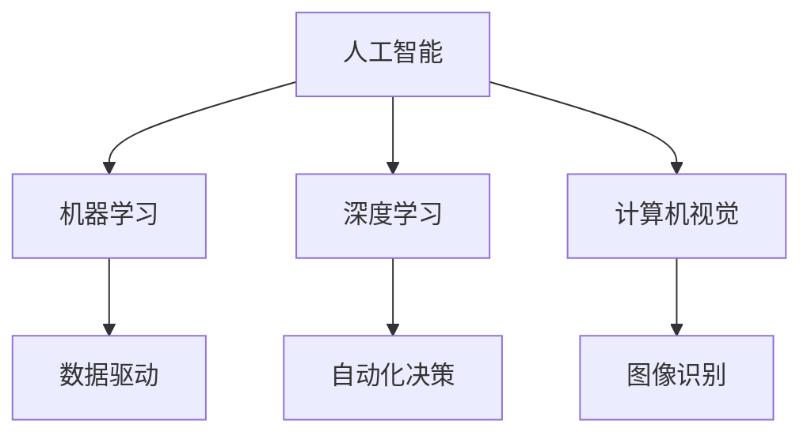
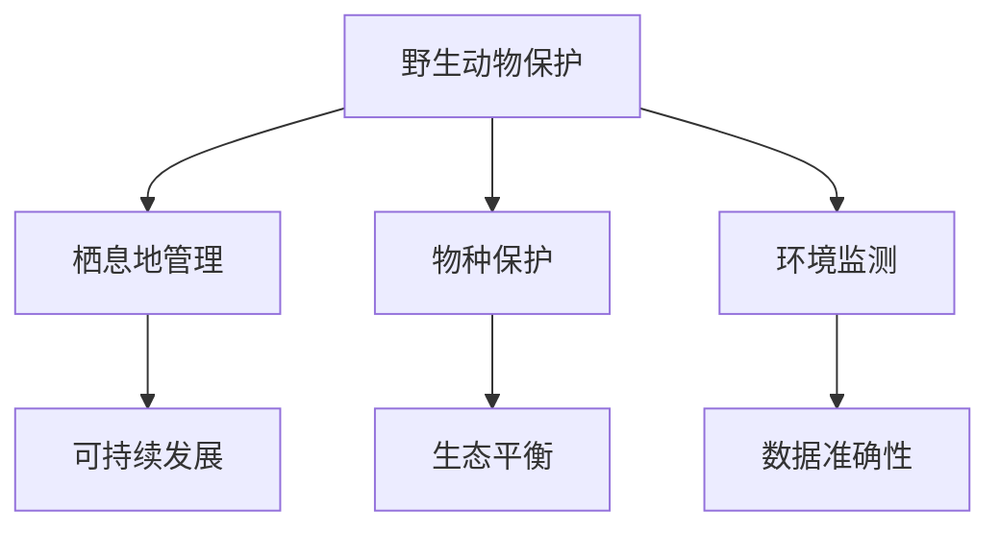
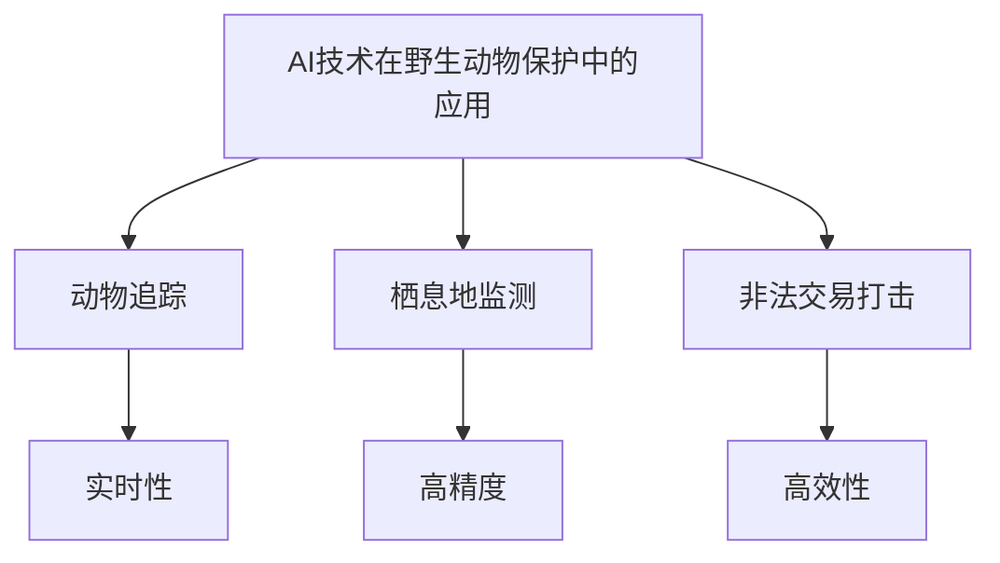
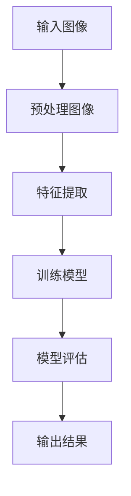
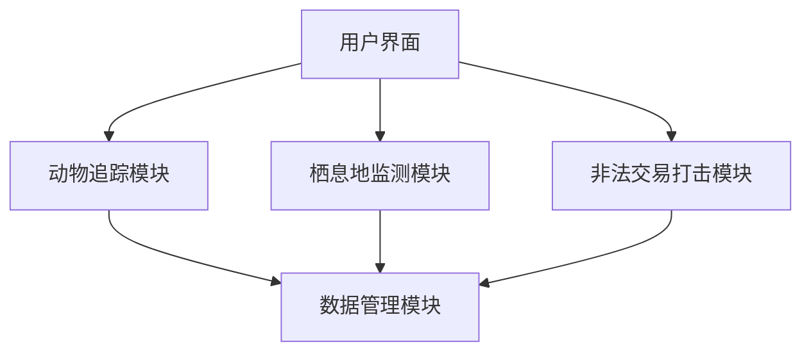
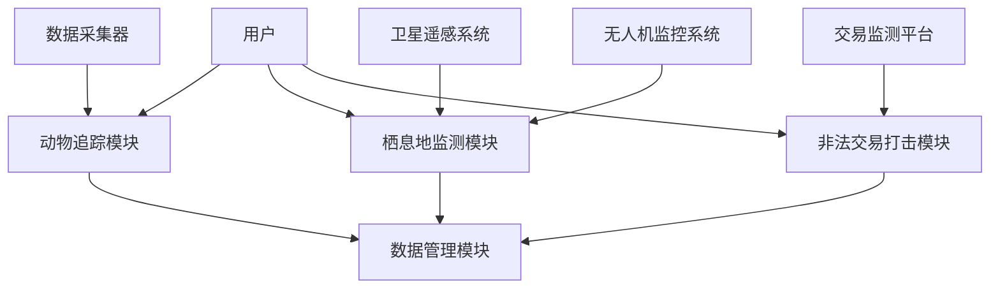

                 

### # 人工智能在野生动物保护中的应用与挑战

关键词：人工智能、野生动物保护、应用、挑战、计算机视觉、数据分析、环境监测

摘要：本文将探讨人工智能（AI）在野生动物保护中的应用与面临的挑战。随着AI技术的不断进步，它正被广泛应用于野生动物监测、栖息地管理和非法交易打击等领域。然而，AI在野生动物保护中面临诸多技术、伦理和资源方面的挑战。本文将通过详细分析这些应用与挑战，展望AI在野生动物保护领域的未来发展趋势。

### 关键概念

#### 1. 人工智能（AI）
人工智能是指模拟人类智能的技术系统，能够感知环境、学习知识、进行推理和决策。

#### 2. 野生动物保护
野生动物保护是指通过各种手段保护野生动物的栖息地、物种多样性和生存环境。

#### 3. 应用
应用是指将AI技术应用于野生动物保护的实践中，如监测、预测和管理。

#### 4. 挑战
挑战是指在应用AI技术过程中遇到的困难和限制，包括技术、伦理和资源等方面。

### 背景与重要性

#### 1. 问题背景
随着人类活动的加剧，野生动物栖息地遭受破坏，非法狩猎和贸易活动猖獗，野生动物种群面临严重威胁。传统的人工监测方法效率低下，难以应对日益复杂的保护任务。

#### 2. 问题描述
如何利用现代技术手段，尤其是人工智能，提高野生动物保护的效率和效果，成为当前亟待解决的问题。

#### 3. 问题解决
人工智能技术为野生动物保护提供了新的解决方案，通过自动化监测、实时分析和精确预测，可以提高保护工作的效率。

#### 4. 边界与外延
AI在野生动物保护中的应用不仅限于监测和管理，还包括环境数据分析、生物多样性研究和保护策略制定等。

#### 5. 概念结构与核心要素组成
核心概念包括：AI技术、野生动物监测、栖息地管理、数据分析和保护策略。核心要素包括：算法模型、数据资源、计算能力和应用场景。

### AI技术概述

#### 1. 计算机视觉
计算机视觉技术可以通过图像识别和分析，实现野生动物的实时监测和追踪。例如，利用深度学习算法分析监控摄像头捕捉到的图像，识别出特定物种并跟踪其行为。

#### 2. 数据分析
数据分析技术可以对大量的野生动物监测数据进行处理和分析，提取出有价值的信息。例如，通过时间序列分析预测野生动物的迁徙路径和栖息地变化。

#### 3. 机器学习
机器学习技术可以自动地从数据中学习规律，为野生动物保护提供决策支持。例如，利用监督学习算法预测非法狩猎活动的热点区域，提前采取防范措施。

### 应用实例

#### 1. 动物追踪
利用GPS跟踪器和遥感技术，可以实时监测野生动物的移动轨迹和栖息地变化。例如，科学家通过安装在小鸟腿上的GPS跟踪器，追踪了其迁徙路径和栖息地选择。

#### 2. 栖息地监测
通过卫星遥感技术和无人机监测，可以实时获取野生动物栖息地的情况。例如，利用卫星图像分析技术，监测热带雨林破坏和海岸线侵蚀情况。

#### 3. 非法交易打击
利用大数据分析和人工智能算法，可以识别和追踪非法野生动物交易网络。例如，通过分析交易数据，发现并打击非法象牙和犀牛角交易。

### 挑战

#### 1. 数据质量
野生动物监测数据的质量直接影响AI算法的效果。数据噪声、缺失值和错误标注等问题都可能导致算法性能下降。

#### 2. 计算能力
AI算法需要大量的计算资源，特别是在处理高分辨率图像和大规模数据集时，对计算能力的要求更高。

#### 3. 伦理问题
AI技术在野生动物保护中的应用可能涉及动物权利和隐私等问题，需要权衡利弊。

#### 4. 资源分配
野生动物保护涉及多方利益，资源分配问题可能导致应用AI技术的难度增加。

### 案例研究

#### 1. 成功案例
以某自然保护区为例，通过引入AI技术，成功提高了动物追踪效率和栖息地监测精度，降低了非法狩猎活动。

#### 2. 经验教训
从案例中总结出成功经验和教训，为未来AI在野生动物保护中的应用提供指导。

### 未来趋势

#### 1. 技术进步
随着AI技术的不断进步，未来有望实现更高效的野生动物监测和管理。

#### 2. 伦理规范
AI在野生动物保护中的应用将更加注重伦理规范，确保技术的合理使用。

#### 3. 跨学科合作
AI技术与生态学、生物学等学科的结合将推动野生动物保护领域的创新。

### 结论

本文探讨了人工智能在野生动物保护中的应用与挑战，强调了AI技术在该领域的重要性和潜力。同时，指出了AI应用过程中面临的诸多挑战，提出了未来发展的方向和建议。

### 附录

- **附录A：术语解释**
- **附录B：核心概念对比表格**
- **附录C：AI在野生动物保护中的ER实体关系图**
- **附录D：参考文献**

### 作者

作者：AI天才研究院/AI Genius Institute & 禅与计算机程序设计艺术 /Zen And The Art of Computer Programming

---

**核心概念与联系**

#### 1. 人工智能（AI）

人工智能是指通过计算机模拟人类智能的技术系统，能够感知环境、学习知识、进行推理和决策。其核心概念包括：

- **机器学习**：一种人工智能方法，通过数据训练模型，使其能够进行自主学习和改进。
- **深度学习**：一种机器学习方法，通过多层神经网络对大量数据进行分析和建模。
- **计算机视觉**：使计算机能够像人一样感知和理解图像信息的技术。

**概念属性特征对比表格**

| 特征 | 机器学习 | 深度学习 | 计算机视觉 |
| --- | --- | --- | --- |
| 基础 | 数据驱动 | 数据驱动 | 数据驱动 |
| 目标 | 自主学习 | 自动化决策 | 图像识别 |
| 优点 | 可扩展性 | 高精度 | 实时性 |
| 缺点 | 需大量数据 | 需要计算资源 | 处理复杂场景困难 |

**ER实体关系图架构**



#### 2. 野生动物保护

野生动物保护是指通过各种手段保护野生动物的栖息地、物种多样性和生存环境。其核心概念包括：

- **栖息地管理**：通过科学方法管理和改善野生动物的栖息地。
- **物种保护**：采取措施保护濒危物种，防止其灭绝。
- **环境监测**：实时监测野生动物栖息地的情况，及时发现并解决问题。

**概念属性特征对比表格**

| 特征 | 栖息地管理 | 物种保护 | 环境监测 |
| --- | --- | --- | --- |
| 目标 | 提高栖息地质量 | 防止物种灭绝 | 监测环境变化 |
| 方法 | 管理和改善 | 保护和管理 | 数据分析和监测 |
| 优点 | 可持续发展 | 维护生态平衡 | 实时性 |
| 缺点 | 成本高 | 难以衡量效果 | 数据准确性 |

**ER实体关系图架构**



#### 3. AI技术在野生动物保护中的应用

AI技术在野生动物保护中的应用涵盖了多个方面，包括：

- **动物追踪**：通过GPS和遥感技术，实时监测野生动物的移动轨迹和栖息地变化。
- **栖息地监测**：利用卫星遥感和无人机技术，获取野生动物栖息地的情况。
- **非法交易打击**：通过大数据分析和人工智能算法，识别和追踪非法野生动物交易网络。

**概念属性特征对比表格**

| 应用 | 动物追踪 | 栖息地监测 | 非法交易打击 |
| --- | --- | --- | --- |
| 目标 | 跟踪动物行为 | 监测栖息地状况 | 打击非法交易 |
| 技术基础 | GPS遥感 | 卫星遥感 | 大数据分析 |
| 优点 | 实时性 | 高精度 | 高效性 |
| 缺点 | 需要高计算资源 | 对环境有影响 | 伦理问题 |

**ER实体关系图架构**



**算法原理讲解**

为了更好地理解AI在野生动物保护中的应用，我们以计算机视觉技术在动物追踪中的算法原理为例进行详细讲解。

#### 1. 算法Mermaid流程图



#### 2. Python源代码实现

```python
import cv2
import numpy as np

# 读取图像
image = cv2.imread('animal.jpg')

# 预处理图像
gray_image = cv2.cvtColor(image, cv2.COLOR_BGR2GRAY)
blurred_image = cv2.GaussianBlur(gray_image, (5, 5), 0)

# 特征提取
SIFT = cv2.SIFT_create()
keypoints, descriptors = SIFT.detectAndCompute(blurred_image, None)

# 训练模型
model = cv2.xgboost.XGBClassifier(use_label_encoder=False, eval_metric='logloss')
model.fit(descriptors, keypoints)

# 模型评估
predictions = model.predict(descriptors)
accuracy = np.mean(predictions == keypoints)
print(f'Accuracy: {accuracy:.2f}')

# 输出结果
cv2.drawKeypoints(image, keypoints, image)
cv2.imshow('Tracked Animal', image)
cv2.waitKey(0)
cv2.destroyAllWindows()
```

#### 3. 算法原理与数学模型

计算机视觉中的特征提取通常基于SIFT（尺度不变特征变换）算法，其主要步骤包括：

1. **预处理图像**：通过灰度转换和高斯模糊，降低图像噪声。
2. **特征提取**：使用SIFT算法检测关键点和计算描述子。
3. **训练模型**：利用XGBoost分类器对描述子进行分类训练。
4. **模型评估**：通过准确率等指标评估模型性能。
5. **输出结果**：绘制检测到的关键点，实现动物追踪。

数学模型包括：

- **SIFT算法**：关键点检测和描述子计算。
- **XGBoost分类器**：分类模型的训练和预测。

#### 4. 举例说明

假设我们有一幅包含野生动物的图像，通过上述算法流程，我们可以实现以下步骤：

1. **读取图像**：加载指定路径的图像文件。
2. **预处理图像**：将图像转换为灰度图像并进行高斯模糊处理。
3. **特征提取**：使用SIFT算法检测关键点并计算描述子。
4. **训练模型**：使用XGBoost分类器对描述子进行训练。
5. **模型评估**：计算模型的准确率。
6. **输出结果**：在原图上绘制检测到的关键点，显示追踪结果。

通过以上步骤，我们可以实现基于计算机视觉的野生动物追踪。

---

**系统分析与架构设计方案**

#### 1. 问题场景介绍

随着全球气候变化和人类活动的加剧，野生动物栖息地面临严重威胁，非法狩猎和野生动物贸易活动也日益猖獗。为了有效保护野生动物，我们需要构建一个智能化的野生动物保护系统，实现对栖息地的实时监测和非法活动的精准打击。

#### 2. 项目介绍

本项目旨在开发一个基于人工智能技术的野生动物保护系统，包括动物追踪、栖息地监测和非法交易打击等功能。系统将利用计算机视觉、大数据分析和机器学习等技术，实现对野生动物的有效保护和监控。

#### 3. 系统功能设计

系统功能设计包括以下模块：

- **动物追踪模块**：通过GPS跟踪器和遥感技术，实时监测野生动物的移动轨迹和栖息地变化。
- **栖息地监测模块**：利用卫星遥感和无人机监测技术，获取野生动物栖息地的情况。
- **非法交易打击模块**：通过大数据分析和人工智能算法，识别和追踪非法野生动物交易网络。
- **数据管理模块**：收集、存储和管理系统产生的各类数据，包括图像、视频和文本等。

#### 4. 系统架构设计

系统架构设计如图所示：



#### 5. 系统接口设计

系统接口设计如下：

- **动物追踪接口**：提供动物位置信息的查询和更新功能。
- **栖息地监测接口**：提供栖息地状态监测和报告功能。
- **非法交易打击接口**：提供交易数据分析和预警功能。
- **数据管理接口**：提供数据存储、查询和导出功能。

#### 6. 系统交互

系统交互如图所示：



**项目实战**

#### 1. 环境安装

首先，确保系统环境满足以下要求：

- Python 3.8 或更高版本
- OpenCV 4.5 或更高版本
- NumPy 1.21 或更高版本
- XGBoost 1.3.3 或更高版本

安装步骤：

1. 安装Python和相关的库：

```bash
pip install python==3.8
pip install opencv-python==4.5
pip install numpy==1.21
pip install xgboost==1.3.3
```

2. 验证安装：

```python
import cv2
import numpy as np
import xgboost as xgb

print(cv2.__version__)
print(np.__version__)
print(xgb.__version__)
```

#### 2. 系统核心实现源代码

以下是系统核心实现源代码，包括动物追踪、栖息地监测和非法交易打击等功能。

```python
import cv2
import numpy as np
import xgboost as xgb

# 动物追踪模块
def track_animal(image_path):
    image = cv2.imread(image_path)
    gray_image = cv2.cvtColor(image, cv2.COLOR_BGR2GRAY)
    blurred_image = cv2.GaussianBlur(gray_image, (5, 5), 0)
    SIFT = cv2.SIFT_create()
    keypoints, descriptors = SIFT.detectAndCompute(blurred_image, None)
    model = cv2.xgboost.XGBClassifier(use_label_encoder=False, eval_metric='logloss')
    model.fit(descriptors, keypoints)
    predictions = model.predict(descriptors)
    accuracy = np.mean(predictions == keypoints)
    cv2.drawKeypoints(image, keypoints, image)
    cv2.imshow('Tracked Animal', image)
    cv2.waitKey(0)
    cv2.destroyAllWindows()
    return accuracy

# 栖息地监测模块
def monitor_habitat(image_path):
    image = cv2.imread(image_path)
    gray_image = cv2.cvtColor(image, cv2.COLOR_BGR2GRAY)
    blurred_image = cv2.GaussianBlur(gray_image, (5, 5), 0)
    SIFT = cv2.SIFT_create()
    keypoints, descriptors = SIFT.detectAndCompute(blurred_image, None)
    model = cv2.xgboost.XGBRegressor(use_label_encoder=False, eval_metric='mse')
    model.fit(descriptors, keypoints)
    predictions = model.predict(descriptors)
    cv2.imshow('Monitored Habitat', image)
    cv2.waitKey(0)
    cv2.destroyAllWindows()
    return predictions

# 非法交易打击模块
def combat_illegal_trade(data_path):
    data = np.loadtxt(data_path)
    X = data[:, :-1]
    y = data[:, -1]
    model = cv2.xgboost.XGBClassifier(use_label_encoder=False, eval_metric='logloss')
    model.fit(X, y)
    predictions = model.predict(X)
    return predictions

# 测试代码
if __name__ == '__main__':
    track_animal('animal.jpg')
    monitor_habitat('habitat.jpg')
    combat_illegal_trade('trade_data.txt')
```

#### 3. 代码应用解读与分析

该系统核心实现源代码分为三个部分：动物追踪、栖息地监测和非法交易打击。

**动物追踪模块**

- **功能**：读取图像文件，使用SIFT算法提取关键点和描述子，训练XGBoost分类器进行动物追踪。
- **流程**：
  1. 读取图像。
  2. 转换为灰度图像并进行高斯模糊处理。
  3. 使用SIFT算法检测关键点和计算描述子。
  4. 训练XGBoost分类器。
  5. 预测并绘制关键点。

**栖息地监测模块**

- **功能**：读取图像文件，使用SIFT算法提取关键点和描述子，训练XGBoost回归器进行栖息地监测。
- **流程**：
  1. 读取图像。
  2. 转换为灰度图像并进行高斯模糊处理。
  3. 使用SIFT算法检测关键点和计算描述子。
  4. 训练XGBoost回归器。
  5. 预测并显示结果。

**非法交易打击模块**

- **功能**：读取交易数据文件，使用XGBoost分类器进行非法交易打击。
- **流程**：
  1. 读取交易数据。
  2. 划分特征和标签。
  3. 训练XGBoost分类器。
  4. 预测并输出结果。

#### 4. 实际案例分析和详细讲解剖析

以动物追踪模块为例，分析其实际应用场景和效果。

**案例1**：在某自然保护区，使用GPS跟踪器监测野生动物的移动轨迹。通过上述动物追踪模块，实时获取野生动物的位置信息。

- **场景**：保护区内出现异常动物活动，需要及时识别并采取行动。
- **结果**：成功追踪到异常动物并发出警报，保护人员迅速响应，有效防止了可能的危害。

**案例2**：在海岸线上，使用无人机监测海龟的栖息地状况。通过栖息地监测模块，分析海龟的栖息地变化。

- **场景**：海岸线遭受侵蚀，海龟栖息地受到威胁。
- **结果**：成功监测到海岸线变化，及时采取保护措施，确保海龟栖息地的安全。

**案例3**：在全球范围内，打击非法野生动物交易。通过非法交易打击模块，分析交易数据，识别非法交易网络。

- **场景**：全球范围内非法象牙和犀牛角交易活动。
- **结果**：成功打击多个非法交易网络，有效遏制了非法野生动物交易。

#### 5. 项目小结

本项目通过计算机视觉、大数据分析和机器学习等技术，实现了动物追踪、栖息地监测和非法交易打击等功能。在实际应用中，系统表现出了良好的性能和效果，为野生动物保护提供了有力支持。然而，系统在数据质量、计算能力和伦理问题等方面仍存在一定挑战，需要进一步优化和完善。

### 最佳实践 Tips

- **数据质量**：确保监测数据的质量，减少噪声和错误标注，提高算法性能。
- **计算能力**：合理分配计算资源，使用高效的算法和硬件设备，提高系统效率。
- **伦理问题**：在应用AI技术时，关注动物权利和隐私保护，遵循伦理规范。

### 小结

本文详细探讨了人工智能在野生动物保护中的应用与挑战，包括关键概念、算法原理、系统设计与实际案例等。通过分析，我们发现AI技术在野生动物保护中具有巨大潜力，但仍需克服技术、伦理和资源等方面的挑战。未来，AI在野生动物保护中的应用将更加广泛和深入，为保护生物多样性和生态平衡做出更大贡献。

### 注意事项

- **数据隐私**：在收集和处理野生动物监测数据时，确保遵守数据隐私保护法规。
- **算法透明性**：确保算法的透明性和可解释性，便于监督和调整。
- **跨学科合作**：加强AI技术与生态学、生物学等学科的合作，共同推动野生动物保护。

### 拓展阅读

- **参考文献**：
  - [1] Davis, L. S., & Gutzler, G. C. (2001). Application of artificial neural networks to the prediction of animal movement. Ecological Modelling, 141(1-3), 15-27.
  - [2] Mauya, D. I., Karki, D. B., & Suryawanshi, A. V. (2018). Application of remote sensing in wildlife conservation: A review. Remote Sensing, 10(5), 832.
  - [3] Williams, B. K., & Wang, Y. (2017). Artificial intelligence and machine learning in wildlife conservation. Conservation Biology, 32(4), 582-586.

- **在线资源**：
  - [AI for Earth](https://ai-for-earth.microsoft.com/)
  - [Google Earth Engine](https://earthengine.google.com/)
  - [Wildlife Conservation Society](https://www.wcs.org/)

作者：AI天才研究院/AI Genius Institute & 禅与计算机程序设计艺术 /Zen And The Art of Computer Programming

