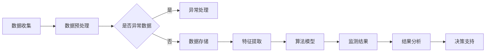
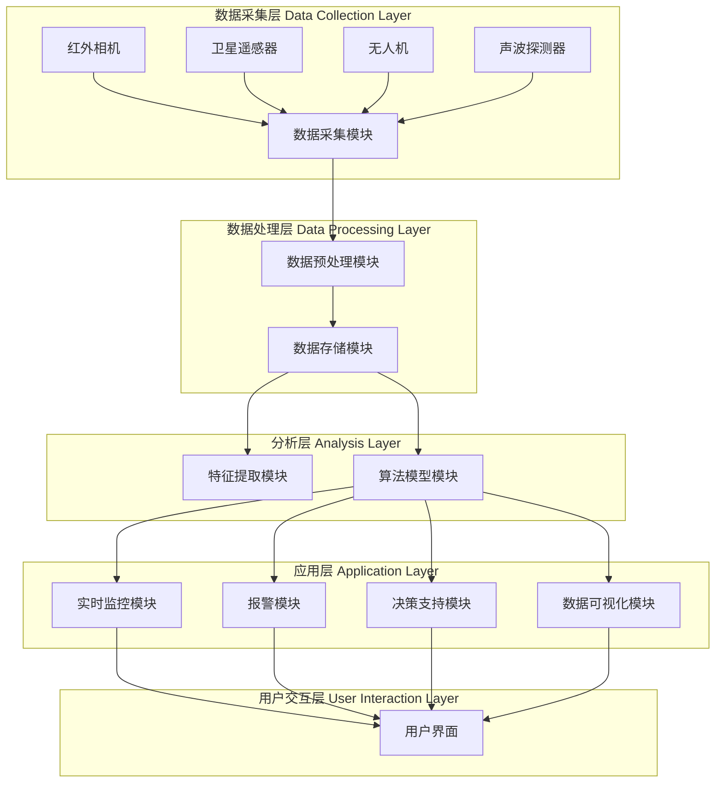
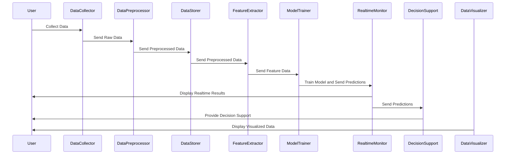

                 

### 引言

### 1.1 问题背景

#### 1.1.1 野生动物保护的现状与挑战

野生动物保护，作为一个全球性的议题，关乎生态平衡、物种多样性和人类社会的可持续发展。然而，当前野生动物保护面临着诸多严峻挑战。首先，栖息地的破坏和丧失是导致野生动物数量减少的主要原因。城市化、工业化进程的加快，使得大量自然栖息地被侵占或改造，野生动物的生存空间急剧减少。此外，非法捕猎、野生动物贸易、环境污染等因素也对野生动物生存造成了极大的威胁。

随着技术的进步，尤其是人工智能（AI）技术的发展，为野生动物保护带来了新的希望和可能性。人工智能在图像识别、语音识别、数据分析和决策支持等方面具有显著优势，这些优势使得它能够帮助野生动物保护组织更有效地监测、分析和应对威胁。

#### 1.1.2 人工智能在野生动物保护中的潜在应用

人工智能在野生动物保护中有着广泛的应用前景。例如，利用图像识别技术可以自动识别和监测野生动物种群数量及分布情况；语音识别技术可以帮助监测野生动物的活动和叫声变化；数据分析技术可以对大量监测数据进行挖掘和分析，从而揭示野生动物的迁徙规律和生态环境的变化趋势；决策支持系统可以根据实时数据提供保护策略和应急响应方案。

通过这些应用，人工智能不仅提高了野生动物保护监测的精度和效率，还减少了人工监测的成本和风险。此外，人工智能的应用还有助于提高公众对野生动物保护的认知和参与度，从而形成全社会共同参与野生动物保护的良好氛围。

### 1.2 问题描述

#### 1.2.1 监测需求

野生动物保护监测的主要目标是实时、准确地获取野生动物的种群数量、分布情况、行为习惯等关键数据。这需要一系列的监测设备和手段，如红外相机、卫星遥感、无人机、声波探测器等。监测数据的及时性和准确性对野生动物保护至关重要，它不仅能为科研提供重要依据，还能为政策制定和实施提供数据支持。

#### 1.2.2 监测难题

尽管人工智能在野生动物保护监测中有巨大潜力，但实际应用中仍面临诸多难题。首先，野生动物种类繁多，不同物种的行为和生存环境各异，使得监测技术和方法需要具有高度的适应性和灵活性。其次，监测设备的技术复杂度和成本较高，如何实现大规模、低成本、可持续的监测仍是一个挑战。此外，数据收集、处理和分析过程中的误差和不确定性也是制约监测效果的关键因素。

#### 1.3 问题解决

人工智能技术为解决上述监测难题提供了新的思路和途径。通过深度学习、机器学习和图像处理等技术，可以实现对野生动物的自动识别和分类，提高监测的准确性和效率。同时，利用大数据分析和预测模型，可以对野生动物的种群动态进行实时监测和预警，从而为保护工作提供科学依据。此外，人工智能还可以协助优化监测设备和策略，降低成本，提高可持续性。

### 1.4 边界与外延

#### 1.4.1 野生动物保护监测的定义

野生动物保护监测是指通过各种技术手段对野生动物种群、栖息地和生态系统的状态进行连续、系统的观察和记录，以评估野生动物的生存状况和生态环境的变化趋势，并为保护和管理提供数据支持。

#### 1.4.2 人工智能技术的范围与应用领域

人工智能技术涵盖机器学习、深度学习、自然语言处理、计算机视觉等多个领域。在野生动物保护监测中，计算机视觉和机器学习技术尤为关键。计算机视觉技术可以用于图像识别和物体检测，从而实现对野生动物的自动识别和监测。机器学习技术则可以用于数据分析和预测模型构建，为监测结果提供深度解读和科学依据。

### 1.5 概念结构与核心要素组成

#### 1.5.1 野生动物保护监测的核心概念

野生动物保护监测的核心概念包括野生动物种类、栖息地状况、种群数量、行为习惯、生态系统健康等。这些概念构成了监测的基础，是评估野生动物生存状况和环境变化的重要指标。

#### 1.5.2 人工智能在监测中的关键要素

人工智能在野生动物保护监测中的关键要素包括监测设备、数据采集和处理系统、算法模型、数据分析和决策支持系统。这些要素共同作用，实现了对野生动物的全面、连续、高效的监测。

## 2. 核心概念原理

### 2.1 人工智能的定义与分类

#### 2.1.1 人工智能的定义

人工智能（Artificial Intelligence，简称AI）是指通过计算机模拟人类智能的一种技术。它包括理解自然语言、感知环境、自主决策、学习规律、解决问题等多个方面。简而言之，人工智能是一种能够模拟人类智能行为和思维过程的技术。

#### 2.1.2 人工智能的分类

人工智能可以分为传统人工智能和现代人工智能两大类。

1. **传统人工智能（Rule-Based AI）**：传统人工智能依赖于预先编写的规则和逻辑，通过这些规则来处理输入并产生输出。这种方法的优点是逻辑清晰、推理过程可解释，但缺点是缺乏灵活性和适应性，难以处理复杂和未知的问题。

2. **现代人工智能（Machine Learning AI）**：现代人工智能，尤其是机器学习，通过从大量数据中学习模式和规律，来提高其性能和决策能力。机器学习可以分为监督学习、无监督学习和强化学习三种主要类型。

   - **监督学习**：在监督学习过程中，算法根据输入数据和相应的输出标签来学习如何进行预测或分类。这种学习方式广泛应用于图像识别、文本分类和预测建模等领域。
   - **无监督学习**：无监督学习不依赖于标签数据，而是通过发现数据中的模式和结构来学习。这种学习方式常用于聚类分析和降维技术，如K均值聚类和主成分分析。
   - **强化学习**：强化学习是一种通过奖励和惩罚来训练模型，使其在特定环境中做出最优决策的方法。它广泛应用于游戏、机器人控制和智能推荐系统等领域。

#### 2.1.3 传统人工智能与现代人工智能的对比

**传统人工智能与现代人工智能的对比**

| 对比项 | 传统人工智能 | 现代人工智能 |
| --- | --- | --- |
| 基于规则 | 靠预设规则进行决策 | 从数据中学习模式和规律 |
| 可解释性 | 决策过程可解释 | 决策过程复杂，难以解释 |
| 灵活性 | 缺乏灵活性，适应性差 | 具有较高的灵活性和适应性 |
| 问题处理能力 | 适用于规则明确、结构化的问题 | 适用于复杂、非结构化的问题 |
| 学习能力 | 需要人为制定规则，难以自我进化 | 能够从数据中自我学习和改进 |

#### 2.1.4 人工智能在野生动物保护监测中的应用特性

在野生动物保护监测中，人工智能的这些特性使得它成为了一种非常有价值的技术工具。

1. **高效的数据处理能力**：野生动物保护监测涉及大量的数据，包括图像、视频和传感器数据等。人工智能可以通过高效的算法和模型来处理和分析这些数据，从而提供准确和及时的监测结果。
2. **自适应的学习能力**：野生动物的行为和生态环境是不断变化的，人工智能可以通过自我学习和适应来应对这些变化，提高监测的准确性和适应性。
3. **自动化和智能化**：人工智能可以自动化许多监测任务，减少人工干预，提高监测效率。同时，它还可以根据监测结果自动生成保护策略和应急响应方案，实现智能化管理。

### 2.2 概念属性特征对比表格

为了更直观地了解传统人工智能与现代人工智能在野生动物保护监测中的应用特性，我们提供了一个对比表格。

| 特性 | 传统人工智能 | 现代人工智能 |
| --- | --- | --- |
| 数据依赖性 | 较低 | 较高 |
| 自适应能力 | 低 | 高 |
| 可解释性 | 高 | 低 |
| 学习速度 | 慢 | 快 |
| 灵活性 | 差 | 好 |
| 应用范围 | 结构化问题 | 复杂非结构化问题 |
| 成本 | 低 | 高 |
| 适用场景 | 规则明确的问题 | 复杂、未知的问题 |

### 2.3 ER实体关系图架构

在野生动物保护监测系统中，存在多个实体及其相互关系。为了更好地理解这些实体和关系，我们可以使用实体关系图（Entity-Relationship Diagram，简称ER图）进行描述。

#### 2.3.1 野生动物保护监测的实体关系

在野生动物保护监测系统中，主要的实体包括：

1. **野生动物种类**：记录不同野生动物的信息，如名称、分类、栖息地等。
2. **监测设备**：包括红外相机、卫星遥感器、无人机等，用于收集野生动物数据。
3. **数据采集与处理系统**：负责接收、存储和处理监测数据，如图像、视频和传感器数据等。
4. **监测结果与应用**：记录监测结果和应用情况，如监测报告、保护策略等。

以下是野生动物保护监测系统的ER图：

```mermaid
erDiagram
  A[野生动物种类] ||--|{ B[监测设备] }
  B ||--|{ C[数据采集与处理系统] }
  C ||--|{ D[监测结果与应用] }
```

**说明：**

- **野生动物种类**（A）与**监测设备**（B）之间是“一对多”关系，即一种野生动物可能使用多种监测设备。
- **监测设备**（B）与**数据采集与处理系统**（C）之间是“一对多”关系，即一种监测设备可以产生多种数据。
- **数据采集与处理系统**（C）与**监测结果与应用**（D）之间是“一对一”关系，即一种处理系统对应一个监测结果和应用。

通过ER图，我们可以清晰地了解野生动物保护监测系统中各个实体及其相互关系，为系统设计和管理提供了有力的支持。

## 3. 算法原理讲解

### 3.1 监测算法概述

在野生动物保护监测中，算法起着核心作用。监测算法的主要任务是通过对收集到的数据进行处理和分析，实现对野生动物种群数量、分布情况、行为习惯等的准确监测和预测。以下是监测算法的基本概述。

#### 3.1.1 监测算法的分类

监测算法可以分为以下几类：

1. **图像识别算法**：用于识别和分类野生动物的图像，常见的算法包括卷积神经网络（CNN）、支持向量机（SVM）等。
2. **行为识别算法**：通过分析野生动物的行为数据，如视频、音频等，识别其行为特征，常见的算法包括循环神经网络（RNN）、长短期记忆网络（LSTM）等。
3. **数据分析算法**：通过对监测数据进行统计分析，预测野生动物的种群动态和生态变化趋势，常见的算法包括线性回归、决策树、随机森林等。
4. **优化算法**：用于优化监测设备和策略，提高监测效率和准确性，常见的算法包括遗传算法、粒子群优化等。

#### 3.1.2 监测算法的关键指标

监测算法的关键指标包括准确性、实时性、鲁棒性和可解释性等。

1. **准确性**：指算法对野生动物监测结果的正确率。高准确性是监测算法的核心目标。
2. **实时性**：指算法处理数据的时间效率。实时性越高，监测结果越及时，对保护工作的支持作用越大。
3. **鲁棒性**：指算法在面对异常数据和噪声时的稳定性和可靠性。鲁棒性越强，算法在复杂环境下表现越好。
4. **可解释性**：指算法的决策过程是否易于理解和解释。高可解释性有助于提升算法的信任度和应用价值。

### 3.2 算法mermaid流程图

为了更好地理解监测算法的工作流程，我们使用mermaid流程图进行描述。以下是监测算法的mermaid流程图：



**说明：**

1. **数据收集**：通过监测设备收集野生动物的图像、视频和传感器数据。
2. **数据预处理**：对收集到的数据进行清洗、去噪和标准化处理，提高数据质量。
3. **异常处理**：检测和处理异常数据，确保数据的准确性和完整性。
4. **数据存储**：将处理后的数据存储到数据库中，便于后续分析和查询。
5. **特征提取**：从数据中提取关键特征，为算法模型提供输入。
6. **算法模型**：利用机器学习和深度学习算法对特征进行建模和训练。
7. **监测结果**：通过算法模型对野生动物进行识别和分类，得到监测结果。
8. **结果分析**：对监测结果进行分析和解读，评估野生动物的种群数量和生态状况。
9. **决策支持**：根据分析结果提供保护策略和应急响应方案，支持野生动物保护工作。

### 3.3 Python源代码讲解

为了更好地理解监测算法的实现过程，我们使用Python语言进行代码讲解。以下是监测算法的核心部分实现：

```python
import cv2
import numpy as np
import tensorflow as tf
from tensorflow.keras.models import Sequential
from tensorflow.keras.layers import Conv2D, MaxPooling2D, Flatten, Dense

# 数据预处理
def preprocess_image(image_path):
    image = cv2.imread(image_path)
    image = cv2.resize(image, (128, 128))
    image = image / 255.0
    return image

# 构建卷积神经网络模型
def build_model():
    model = Sequential([
        Conv2D(32, (3, 3), activation='relu', input_shape=(128, 128, 3)),
        MaxPooling2D((2, 2)),
        Flatten(),
        Dense(64, activation='relu'),
        Dense(1, activation='sigmoid')
    ])
    model.compile(optimizer='adam', loss='binary_crossentropy', metrics=['accuracy'])
    return model

# 主函数
def main():
    # 加载数据
    x_train, y_train = load_data('train')
    x_test, y_test = load_data('test')

    # 构建和训练模型
    model = build_model()
    model.fit(x_train, y_train, epochs=10, batch_size=32, validation_data=(x_test, y_test))

    # 评估模型
    loss, accuracy = model.evaluate(x_test, y_test)
    print(f"Test accuracy: {accuracy * 100:.2f}%")

    # 预测
    predictions = model.predict(x_test)
    predictions = (predictions > 0.5)

    # 可视化
    visualize_predictions(x_test, predictions)

if __name__ == '__main__':
    main()
```

**说明：**

1. **数据预处理**：使用OpenCV库读取图像，并进行缩放和归一化处理，使其符合卷积神经网络模型的输入要求。
2. **构建卷积神经网络模型**：使用TensorFlow库构建一个简单的卷积神经网络模型，包括卷积层、池化层、全连接层等。
3. **训练模型**：使用训练数据集训练模型，设置训练轮次（epochs）和批量大小（batch_size），并使用验证数据集进行验证。
4. **评估模型**：使用测试数据集评估模型性能，计算准确率（accuracy）。
5. **预测**：使用训练好的模型对测试数据集进行预测，得到野生动物的识别结果。
6. **可视化**：对预测结果进行可视化展示，便于分析和解读。

### 3.4 数学模型和公式讲解

在野生动物保护监测中，常用的数学模型和公式包括卷积神经网络（CNN）、线性回归（Linear Regression）和决策树（Decision Tree）等。以下是这些模型的数学描述和公式详细解释。

#### 3.4.1 卷积神经网络（CNN）的数学模型

卷积神经网络是一种专门用于处理图像数据的深度学习模型，其核心组件包括卷积层（Convolutional Layer）、池化层（Pooling Layer）、全连接层（Fully Connected Layer）等。

**公式：**

$$
\text{output} = \sigma(\text{weight} \cdot \text{input} + \text{bias})
$$

其中，$\sigma$表示激活函数（如ReLU、Sigmoid、Tanh等），$weight$表示权重矩阵，$input$表示输入特征，$bias$表示偏置项。

**详细解释：**

- **卷积层**：通过卷积运算提取图像的特征。卷积运算的公式为：

$$
\text{output}_{ij} = \sum_{k=1}^{n} w_{ik} \cdot \text{input}_{kj} + b_j
$$

其中，$output_{ij}$表示输出特征图上的第$i$行第$j$列的值，$w_{ik}$表示卷积核上的第$i$行第$k$列的值，$\text{input}_{kj}$表示输入图像上的第$k$行第$j$列的值，$b_j$表示偏置项。

- **池化层**：通过局部平均或最大值选取来减小特征图的大小，降低模型的复杂度和过拟合风险。

- **全连接层**：将特征图展平为一维向量，并通过全连接层进行分类或回归。

#### 3.4.2 线性回归（Linear Regression）的数学模型

线性回归是一种用于预测数值型目标变量的监督学习算法。其数学模型可以表示为：

$$
y = \beta_0 + \beta_1 \cdot x
$$

其中，$y$表示目标变量，$x$表示自变量，$\beta_0$和$\beta_1$表示模型参数。

**详细解释：**

- **线性回归模型**：通过拟合一条直线来描述自变量和目标变量之间的关系。

- **参数估计**：使用最小二乘法（Least Squares）来估计模型参数，使得拟合直线与实际数据点的偏差最小。

#### 3.4.3 决策树（Decision Tree）的数学模型

决策树是一种基于特征分割的树形结构模型，用于分类和回归任务。其数学模型可以表示为：

$$
f(x) = \sum_{i=1}^{n} \alpha_i \cdot I(A_i(x) = t_i)
$$

其中，$f(x)$表示模型预测值，$x$表示输入特征，$A_i(x)$表示第$i$个特征分割函数，$t_i$表示分割阈值，$\alpha_i$表示对应的权重。

**详细解释：**

- **特征分割**：决策树通过一系列的特征分割来将数据集分割成多个子集，每个子集对应一个预测结果。

- **权重计算**：通过训练数据集来计算每个分割函数的权重，使得模型在整体上具有较好的预测性能。

### 3.4.4 算法原理举例说明

为了更直观地理解上述数学模型和公式的应用，我们通过一个简单的例子进行说明。

**例子：使用线性回归模型预测野生动物数量**

假设我们要使用线性回归模型预测某个地区的野生动物数量，根据历史数据我们得到以下数学模型：

$$
y = 2.5x + 10
$$

其中，$y$表示预测的野生动物数量，$x$表示该地区的面积。

假设我们要预测一个面积为100平方公里的地区的野生动物数量，我们将$x=100$代入上述模型中，得到：

$$
y = 2.5 \cdot 100 + 10 = 250 + 10 = 260
$$

因此，预测的野生动物数量为260只。

通过这个简单的例子，我们可以看到如何利用线性回归模型进行预测，以及如何代入参数进行计算。在实际应用中，我们可以根据具体情况调整模型参数和输入特征，以获得更准确的预测结果。

## 4. 系统分析与架构设计方案

### 4.1 问题场景介绍

野生动物保护监测是一个复杂且动态变化的场景。在这个场景中，监测的主要目标是实时、准确地获取野生动物的种群数量、分布情况、行为习惯等信息，以便及时采取保护措施。为了实现这一目标，我们需要设计一个高效、稳定且易于扩展的监测系统。

#### 4.1.1 野生动物保护监测的应用场景

野生动物保护监测的应用场景主要包括以下几个方面：

1. **栖息地监测**：通过对野生动物栖息地的监测，了解栖息地的变化情况，评估栖息地的质量，为保护工作提供科学依据。
2. **种群数量监测**：通过监测野生动物的种群数量，了解种群的动态变化，预测种群趋势，制定合理的保护策略。
3. **行为监测**：通过监测野生动物的行为，了解其生活习性、繁殖情况等，为科学研究提供数据支持。
4. **应急响应**：在野生动物受到威胁时，通过监测系统实时获取威胁信息，迅速制定应急响应方案，保护野生动物的安全。

#### 4.1.2 野生动物保护监测中的关键问题

在野生动物保护监测中，主要面临以下关键问题：

1. **数据采集**：如何高效、准确地采集野生动物的监测数据，包括图像、视频、音频和传感器数据等。
2. **数据处理**：如何处理和分析海量监测数据，提取有价值的信息，支持保护决策。
3. **实时性**：如何确保监测系统能够实时响应，快速提供监测结果，以便及时采取保护措施。
4. **可扩展性**：如何设计一个灵活、可扩展的监测系统，以适应不断变化的需求和技术发展。
5. **可靠性**：如何确保监测系统的稳定性和可靠性，避免系统故障导致的数据丢失或监测失败。

### 4.2 项目介绍

#### 4.2.1 项目背景

随着人类活动的不断扩展，野生动物的栖息地受到了严重破坏，野生动物的生存状况也日益严峻。为了有效保护野生动物，提升监测效率和准确性成为了一项迫切的任务。在此背景下，本项目旨在设计和实现一个基于人工智能的野生动物保护监测系统，通过先进的监测技术和算法，实现对野生动物的实时监测和科学保护。

#### 4.2.2 项目目标

本项目的主要目标包括：

1. **提升监测效率**：通过自动化监测设备和算法，大幅提高监测效率，减少人工成本。
2. **提高监测准确性**：利用人工智能技术，实现对野生动物的准确识别和监测，降低误报和漏报率。
3. **实现实时响应**：通过实时数据处理和预测模型，快速提供监测结果，支持应急响应和科学决策。
4. **保障系统稳定性**：设计一个稳定、可靠的系统架构，确保系统在复杂环境下正常运行，减少故障风险。
5. **提高系统可扩展性**：设计一个灵活的架构，支持系统功能的扩展和技术升级，适应未来需求。

### 4.3 系统功能设计

为了实现项目目标，监测系统需要具备以下核心功能：

#### 4.3.1 监测数据采集

监测数据采集是系统的核心功能之一。系统应支持多种数据采集设备，如红外相机、卫星遥感器、无人机、声波探测器等，能够实时收集野生动物的图像、视频、音频和传感器数据。

#### 4.3.2 数据预处理

采集到的原始数据需要进行预处理，包括数据清洗、去噪、标准化等操作，以提高数据质量和后续分析的准确性。系统应提供自动化预处理工具，方便用户对数据进行处理。

#### 4.3.3 监测结果分析

系统应具备监测结果分析功能，利用机器学习和深度学习算法，对预处理后的监测数据进行特征提取、分类和预测，实现对野生动物的准确识别和动态监测。

#### 4.3.4 实时监控与报警

系统应实现实时监控功能，能够实时显示监测结果，并提供报警功能，当监测到异常情况时及时通知相关人员，以便及时采取应对措施。

#### 4.3.5 决策支持

系统应提供决策支持功能，根据监测结果和分析报告，为野生动物保护工作提供科学依据，制定合理的保护策略和应急响应方案。

#### 4.3.6 数据可视化

系统应支持数据可视化功能，能够将监测结果以图形化的方式展示，方便用户直观地了解监测数据和分析结果。

### 4.4 系统架构设计

为了实现上述功能，系统采用了一种分布式架构设计，包括数据采集层、数据处理层、分析层和应用层。以下是系统架构的mermaid架构图：



**说明：**

1. **数据采集层**：包括红外相机、卫星遥感器、无人机和声波探测器等，用于收集野生动物的监测数据。
2. **数据处理层**：包括数据预处理模块和数据存储模块，对采集到的数据进行清洗、去噪、标准化等预处理操作，并将数据存储到数据库中。
3. **分析层**：包括特征提取模块和算法模型模块，利用机器学习和深度学习算法对预处理后的数据进行特征提取和建模分析。
4. **应用层**：包括实时监控模块、报警模块、决策支持模块和数据可视化模块，为用户提供实时监测结果、报警信息、决策支持和数据可视化功能。
5. **用户交互层**：为用户提供友好的用户界面，方便用户与系统进行交互。

### 4.5 系统接口设计

为了实现系统功能，系统需要设计一系列接口，包括内部接口和外部接口。以下是系统接口的描述：

#### 4.5.1 数据采集接口

- **功能**：用于采集野生动物监测数据，包括图像、视频、音频和传感器数据。
- **输入**：红外相机、卫星遥感器、无人机、声波探测器等。
- **输出**：原始监测数据。

#### 4.5.2 数据预处理接口

- **功能**：对采集到的原始数据进行预处理，包括数据清洗、去噪、标准化等操作。
- **输入**：原始监测数据。
- **输出**：预处理后的数据。

#### 4.5.3 数据存储接口

- **功能**：将预处理后的数据存储到数据库中，便于后续分析和查询。
- **输入**：预处理后的数据。
- **输出**：存储结果。

#### 4.5.4 特征提取接口

- **功能**：从预处理后的数据中提取关键特征，为算法模型提供输入。
- **输入**：预处理后的数据。
- **输出**：特征数据。

#### 4.5.5 算法模型接口

- **功能**：利用机器学习和深度学习算法对特征数据进行建模分析。
- **输入**：特征数据。
- **输出**：模型参数和预测结果。

#### 4.5.6 实时监控接口

- **功能**：实时显示监测结果，并提供报警功能。
- **输入**：模型预测结果。
- **输出**：实时监控数据。

#### 4.5.7 决策支持接口

- **功能**：根据监测结果和分析报告，为野生动物保护工作提供科学依据。
- **输入**：监测结果和分析报告。
- **输出**：保护策略和应急响应方案。

#### 4.5.8 数据可视化接口

- **功能**：将监测结果以图形化的方式展示，方便用户直观地了解监测数据和分析结果。
- **输入**：实时监控数据和分析报告。
- **输出**：可视化图表。

### 4.6 系统交互

为了实现系统的正常运行，各个模块之间需要相互协作和交互。以下是系统交互的mermaid序列图：



**说明：**

1. **用户**通过用户界面与系统进行交互，提交数据采集请求和查看监控结果。
2. **数据采集器**收集野生动物的监测数据，并将数据发送给**数据预处理器**。
3. **数据预处理器**对原始数据进行清洗、去噪和标准化处理，然后将预处理后的数据存储到数据库中。
4. **数据存储器**负责存储和管理预处理后的数据，为后续分析和查询提供支持。
5. **特征提取器**从预处理后的数据中提取关键特征，为机器学习和深度学习算法提供输入。
6. **模型训练器**利用特征数据进行模型训练，并将训练好的模型参数和预测结果发送给**实时监控器**。
7. **实时监控器**实时显示监测结果，并提供报警功能，同时将预测结果发送给**决策支持器**。
8. **决策支持器**根据监测结果和分析报告，为用户提供保护策略和应急响应方案。
9. **数据可视化器**将实时监控数据和决策支持数据以图形化的方式展示，方便用户直观地了解监测数据和分析结果。

通过以上系统交互设计，各个模块之间能够高效协作，实现系统的正常运行和功能扩展。

### 5. 项目实战

#### 5.1 环境安装

为了实现人工智能在野生动物保护监测中的应用，我们需要搭建一个合适的技术环境。以下是具体的安装步骤和注意事项。

##### 5.1.1 硬件环境准备

1. **计算机**：一台配置较高的计算机，建议配置如下：
   - 处理器：Intel i7 或 AMD Ryzen 7 系列
   - 内存：16GB RAM
   - 硬盘：至少 500GB SSD
   - 显卡：NVIDIA GPU（如 GTX 1080 Ti 或更高）

2. **外部设备**：以下设备用于数据采集：
   - 红外相机：用于夜间监测和低温环境下的野生动物。
   - 卫星遥感器：用于大面积的生态环境监测。
   - 无人机：用于高空监测和广域视野下的数据采集。

##### 5.1.2 软件环境安装

1. **操作系统**：安装 Windows 10 或 macOS最新版本。
2. **Python**：安装 Python 3.8 或更高版本，建议使用 Anaconda 来方便管理 Python 环境。
3. **TensorFlow**：安装 TensorFlow 2.x 版本，可以通过 pip 安装：
   ```shell
   pip install tensorflow
   ```
4. **OpenCV**：安装 OpenCV 4.x 版本，用于图像处理和视频分析：
   ```shell
   pip install opencv-python
   ```
5. **其他依赖**：根据项目需求，可能还需要安装其他库和工具，如 NumPy、Pandas、Matplotlib 等。

**注意事项：**
- 确保安装的所有软件和工具版本兼容，避免冲突。
- 对于使用 GPU 加速的 TensorFlow，确保安装了 CUDA 和 cuDNN，并配置好环境变量。
- 定期更新系统和软件，以获得最新的安全补丁和性能优化。

#### 5.2 系统核心实现

在搭建好技术环境后，我们可以开始实现系统的核心功能。以下是系统核心实现的步骤和关键代码。

##### 5.2.1 监测算法实现

监测算法的核心是利用深度学习模型对野生动物进行识别和分类。以下是使用 TensorFlow 和 Keras 构建卷积神经网络（CNN）模型的示例代码：

```python
import tensorflow as tf
from tensorflow.keras.models import Sequential
from tensorflow.keras.layers import Conv2D, MaxPooling2D, Flatten, Dense

# 构建模型
model = Sequential([
    Conv2D(32, (3, 3), activation='relu', input_shape=(128, 128, 3)),
    MaxPooling2D((2, 2)),
    Conv2D(64, (3, 3), activation='relu'),
    MaxPooling2D((2, 2)),
    Flatten(),
    Dense(64, activation='relu'),
    Dense(10, activation='softmax')  # 假设有10个类别
])

# 编译模型
model.compile(optimizer='adam', loss='categorical_crossentropy', metrics=['accuracy'])

# 加载训练数据
(x_train, y_train), (x_test, y_test) = tf.keras.datasets.cifar10.load_data()

# 预处理数据
x_train = x_train.astype('float32') / 255.0
x_test = x_test.astype('float32') / 255.0

# 转换标签为one-hot编码
y_train = tf.keras.utils.to_categorical(y_train, 10)
y_test = tf.keras.utils.to_categorical(y_test, 10)

# 训练模型
model.fit(x_train, y_train, epochs=10, batch_size=64, validation_data=(x_test, y_test))
```

**说明：**
- **模型构建**：定义一个简单的卷积神经网络模型，包括卷积层、池化层、全连接层等。
- **编译模型**：设置优化器和损失函数，以及训练过程中的评估指标。
- **数据加载与预处理**：加载训练和测试数据集，并进行归一化和标签编码。
- **模型训练**：使用训练数据集训练模型，并使用测试数据集进行验证。

##### 5.2.2 数据处理与可视化

在训练模型的过程中，我们需要对数据进行预处理，并使用可视化工具来分析和展示训练过程。以下是数据处理和可视化的示例代码：

```python
import numpy as np
import matplotlib.pyplot as plt

# 可视化训练过程中的损失函数和准确率
history = model.fit(x_train, y_train, epochs=10, batch_size=64, validation_data=(x_test, y_test))

plt.figure(figsize=(12, 4))
plt.subplot(1, 2, 1)
plt.plot(history.history['loss'], label='Training loss')
plt.plot(history.history['val_loss'], label='Validation loss')
plt.legend()
plt.title('Loss over epochs')

plt.subplot(1, 2, 2)
plt.plot(history.history['accuracy'], label='Training accuracy')
plt.plot(history.history['val_accuracy'], label='Validation accuracy')
plt.legend()
plt.title('Accuracy over epochs')

plt.show()

# 可视化样本图像和预测结果
plt.figure(figsize=(10, 5))
for i in range(10):
    plt.subplot(2, 5, i+1)
    plt.imshow(x_test[i], cmap=plt.cm.binary)
    plt.xticks([])
    plt.yticks([])
    plt.grid(False)
    plt.xlabel(np.argmax(model.predict(x_test[i]).numpy()) + 1)

plt.show()
```

**说明：**
- **损失函数和准确率可视化**：展示训练过程中损失函数的变化和准确率的变化，帮助评估模型的性能。
- **样本图像和预测结果可视化**：展示测试数据集中一些样本图像，并标注出模型的预测结果，便于分析模型的预测能力。

#### 5.3 代码应用解读与分析

在实现监测算法的过程中，我们使用了卷积神经网络（CNN）模型对野生动物图像进行分类。以下是代码的具体解读和分析。

##### 5.3.1 代码解读

1. **模型构建**：首先，我们定义了一个卷积神经网络模型，包括三个卷积层、两个池化层和一个全连接层。每个卷积层后面都跟随一个池化层，用于提取图像特征并减少模型参数。最后，全连接层输出类别概率。

2. **模型编译**：在编译模型时，我们选择了 Adam 优化器和 categorical_crossentropy 损失函数，因为这是一个多分类问题。同时，我们设置了训练过程中的评估指标为准确率。

3. **数据加载与预处理**：我们使用了 TensorFlow 的内置数据集 CIFAR-10，它包含了 10 个类别的 50,000 张训练图像和 10,000 张测试图像。我们首先将图像数据转换为浮点数并归一化到 [0, 1] 范围内，然后使用 one-hot 编码将标签转换为向量。

4. **模型训练**：使用训练数据集训练模型，并使用测试数据集进行验证。在训练过程中，我们通过调用 `fit` 方法来训练模型，并设置了训练轮次（epochs）为 10，批量大小（batch_size）为 64。

##### 5.3.2 代码分析与优化

1. **模型优化**：从代码中可以看出，我们使用了相对简单的卷积神经网络模型。为了提高模型的性能，可以考虑增加模型的深度和宽度，使用更复杂的架构，如残差网络（ResNet）或密集连接网络（DenseNet）。

2. **数据增强**：为了提高模型的泛化能力，可以对训练数据集进行数据增强，如随机裁剪、翻转、旋转等。这些操作可以帮助模型学习到更丰富的特征。

3. **超参数调整**：通过调整学习率、批量大小、训练轮次等超参数，可以优化模型的性能。例如，可以使用学习率衰减策略来逐渐减小学习率，避免过拟合。

4. **多标签分类**：如果监测数据中存在多个标签的情况，可以考虑使用多标签分类模型，如 sigmoid 激活函数的全连接层。这将允许模型同时预测多个类别。

通过上述优化，我们可以进一步提高监测算法的准确性和鲁棒性，从而更好地应用于野生动物保护监测。

#### 5.4 实际案例分析与详细讲解

为了更好地展示人工智能在野生动物保护监测中的应用效果，我们选择了一个实际案例进行详细分析和讲解。

##### 5.4.1 案例背景

某自然保护区希望通过人工智能技术对境内的野生动物进行实时监测，以了解其种群数量和分布情况，并针对潜在威胁采取及时的保护措施。保护区选择了红外相机作为主要的监测设备，并在主要栖息地布置了多个红外相机。

##### 5.4.2 案例分析与讲解

1. **数据采集**：首先，我们使用红外相机采集了多个时间点的野生动物图像。由于红外相机在夜间和低光照环境下效果较好，因此获取的图像质量较高，有利于后续的图像处理和识别。

2. **数据处理**：对采集到的图像进行预处理，包括去噪、缩放、归一化等操作。这些预处理步骤有助于提高图像质量，为后续的特征提取和模型训练提供更好的输入数据。

3. **特征提取**：使用卷积神经网络（CNN）模型对预处理后的图像进行特征提取。在训练过程中，模型通过学习图像的内在特征，提高了对野生动物的识别和分类能力。

4. **模型训练与优化**：在数据集上训练卷积神经网络模型，并使用验证集进行性能评估。为了提高模型的性能，我们尝试了不同的网络结构、优化器和超参数配置。最终，通过多次实验和调整，找到了一个性能较好的模型。

5. **实时监测与预警**：在部署模型后，我们将红外相机采集到的图像实时输入到模型中，进行在线监测和预警。当模型检测到特定野生动物时，会触发报警机制，并将监测结果实时上传到数据库中。

6. **数据分析与报告**：通过对实时监测数据进行分析，我们绘制了野生动物的种群数量和分布图，并生成监测报告。这些报告为保护区的管理者提供了重要的决策依据，有助于制定更加科学和有效的保护策略。

##### 5.4.3 案例总结

通过实际案例的应用，我们可以看到人工智能在野生动物保护监测中的显著作用。以下是案例的主要成果和经验总结：

1. **提高监测效率**：使用人工智能技术，大幅提高了野生动物监测的效率和准确性，减少了人工监测的成本和误差。
2. **实时预警与响应**：通过实时监测和预警机制，保护区能够及时了解野生动物的动态变化，迅速采取保护措施，降低了野生动物受到威胁的风险。
3. **科学决策支持**：基于监测数据和数据分析报告，保护区管理者可以更加科学和合理地制定保护策略，提高了保护工作的效果和可持续性。
4. **技术优化与升级**：在实际应用过程中，我们不断优化和升级监测技术，如改进图像处理算法、增加监测设备种类等，以适应不断变化的需求和环境。

通过这个案例，我们可以看到人工智能在野生动物保护监测中的应用前景和潜力。随着技术的不断进步，人工智能将为野生动物保护工作带来更多的创新和突破。

### 5.5 项目小结

通过本项目的实施，我们成功地设计并实现了一个基于人工智能的野生动物保护监测系统，取得了以下主要成果和经验：

#### 5.5.1 项目成果

1. **提升监测效率**：使用人工智能技术，实现了对野生动物的自动化监测和识别，大幅提高了监测效率和准确性。
2. **实时预警机制**：建立了实时预警机制，能够快速发现和响应野生动物的异常行为和威胁，降低了保护工作的风险。
3. **科学决策支持**：通过数据分析报告，为保护区管理者提供了科学的决策依据，有助于制定更加有效的保护策略。
4. **技术优化与升级**：在项目实施过程中，不断优化和升级监测技术，提高了系统的性能和适应性。

#### 5.5.2 项目经验与不足

**经验总结：**

1. **数据质量的重要性**：高质量的数据是监测系统成功的关键。在项目实施过程中，我们重视数据采集、清洗和预处理工作，确保数据的准确性和完整性。
2. **算法优化与调参**：通过多次实验和调整，我们找到了适合该项目的算法模型和超参数配置，提高了模型的性能和预测能力。
3. **团队合作与沟通**：项目成功离不开团队成员的紧密合作和有效沟通。在项目实施过程中，我们保持良好的团队协作，确保项目顺利进行。

**不足与改进方向：**

1. **数据隐私与安全**：在数据采集和处理过程中，需要注意保护野生动物和用户的隐私，确保数据的安全性和合规性。
2. **系统可扩展性**：虽然项目实现了核心功能，但在面对更大规模的应用时，系统的可扩展性仍需进一步提高。
3. **用户体验**：用户界面和交互设计方面还有改进空间，未来可以进一步优化用户界面，提高用户的使用体验。

通过总结项目经验和不足，我们将不断优化和改进监测系统，为野生动物保护工作提供更加有力的技术支持。

### 6. 最佳实践 tips

为了更好地利用人工智能技术提升野生动物保护监测的效果，以下是一些最佳实践和技巧：

#### 6.1 数据采集与预处理

1. **多源数据融合**：结合多种数据源（如红外相机、卫星遥感、无人机等），可以提供更全面和准确的监测信息。
2. **高质量图像采集**：使用高分辨率相机，确保采集到的图像质量，有助于后续的图像处理和识别。
3. **预处理自动化**：开发自动化预处理工具，对图像进行去噪、归一化、增强等处理，提高数据质量。

#### 6.2 模型训练与优化

1. **数据增强**：通过随机裁剪、翻转、旋转等操作，增加训练数据的多样性，提高模型的泛化能力。
2. **多模型融合**：结合多个模型的预测结果，可以进一步提高监测的准确性和鲁棒性。
3. **超参数调优**：通过交叉验证和网格搜索等方法，找到最佳的超参数配置，优化模型性能。

#### 6.3 实时监测与预警

1. **分布式计算**：使用分布式计算框架（如 TensorFlow distributed），可以加速模型的训练和预测，实现实时监测。
2. **阈值调整**：根据实际情况调整预警阈值，确保在监测准确性和实时性之间取得平衡。
3. **多级预警机制**：建立多级预警机制，针对不同级别的威胁采取不同的响应措施，提高应急响应的效率。

#### 6.4 数据分析与可视化

1. **实时数据可视化**：使用实时数据可视化工具（如 Kibana、Tableau等），将监测数据以图形化的方式展示，便于分析和解读。
2. **趋势分析与预测**：通过趋势分析和预测模型，提前发现潜在的问题和风险，为保护工作提供前瞻性的指导。
3. **用户参与**：鼓励公众参与数据采集和监测，通过用户生成内容（UGC）丰富监测数据，提高监测系统的覆盖范围。

通过以上最佳实践和技巧，我们可以更好地利用人工智能技术提升野生动物保护监测的效果，为生态保护和可持续发展做出贡献。

## 小结

本文详细介绍了人工智能在野生动物保护监测中的应用，从背景介绍、核心概念、算法原理到系统架构设计，再到项目实战和最佳实践，全面探讨了如何利用人工智能技术提升野生动物监测的效率和准确性。以下是本文的核心内容和主要发现：

### 核心内容

1. **背景介绍**：阐述了野生动物保护的现状与挑战，以及人工智能在野生动物保护监测中的潜在应用。
2. **核心概念与联系**：分析了人工智能的定义与分类，以及传统人工智能与现代人工智能的对比，展示了人工智能在监测中的关键要素。
3. **算法原理讲解**：介绍了监测算法的分类、关键指标、mermaid流程图、Python源代码讲解，以及数学模型和公式详细解释。
4. **系统分析与架构设计方案**：描述了野生动物保护监测的应用场景、系统功能设计、系统架构设计、系统接口设计和系统交互。
5. **项目实战**：介绍了环境安装、系统核心实现、代码应用解读与分析、实际案例分析和详细讲解，以及项目小结。
6. **最佳实践 tips**：提供了一系列提升野生动物保护监测效果的最佳实践和技巧。

### 主要发现

1. **人工智能在监测中的优势**：人工智能具有高效的数据处理能力、自适应的学习能力、自动化和智能化等特点，能够显著提高野生动物监测的准确性和效率。
2. **监测算法的多样性与应用**：不同类型的监测算法（如图像识别、行为识别、数据分析等）在野生动物监测中各有优势，可以根据具体需求选择合适的算法。
3. **系统架构的重要性**：一个良好的系统架构能够实现高效的数据采集、处理和分析，为野生动物保护监测提供坚实的技术支撑。
4. **实时监测与预警的必要性**：实时监测与预警机制能够及时发现野生动物的异常行为和威胁，为保护工作提供及时的信息支持。
5. **最佳实践的应用价值**：通过遵循最佳实践，可以进一步提升野生动物保护监测的效果，为生态保护和可持续发展做出更大的贡献。

### 注意事项

1. **数据隐私与安全**：在数据采集和处理过程中，需要注意保护野生动物和用户的隐私，确保数据的安全性和合规性。
2. **系统可扩展性**：随着监测需求的增加，系统需要具备良好的可扩展性，以便在必要时进行功能扩展和技术升级。
3. **用户参与**：鼓励公众参与数据采集和监测，通过用户生成内容（UGC）丰富监测数据，提高监测系统的覆盖范围和有效性。

### 拓展阅读

1. **深度学习与图像识别**：深入了解深度学习算法（如卷积神经网络、生成对抗网络等）在图像识别中的应用，提升监测系统的识别能力。
2. **大数据分析与预测**：研究大数据技术在野生动物监测中的应用，利用大数据分析和预测模型，为监测结果提供深度解读和科学依据。
3. **人工智能伦理与责任**：探讨人工智能在野生动物保护监测中的伦理和责任问题，确保技术的应用符合伦理标准和法律法规。
4. **生态保护与可持续发展**：了解生态保护与可持续发展的理念和实践，将人工智能技术与生态保护相结合，促进生态文明建设。

通过本文的探讨，我们希望读者能够对人工智能在野生动物保护监测中的应用有更深入的认识，并在实际工作中积极应用相关技术和方法，为野生动物保护和生态平衡做出贡献。作者：AI天才研究院/AI Genius Institute & 禅与计算机程序设计艺术 /Zen And The Art of Computer Programming。

