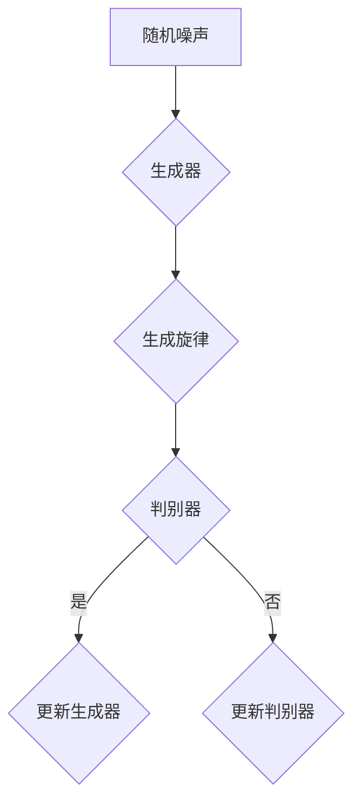
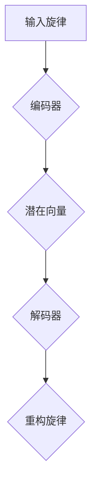
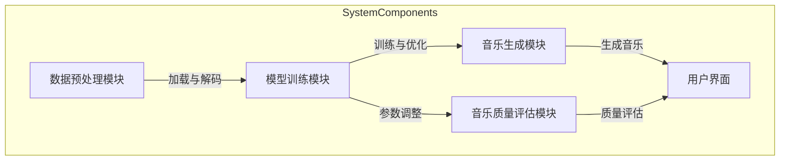
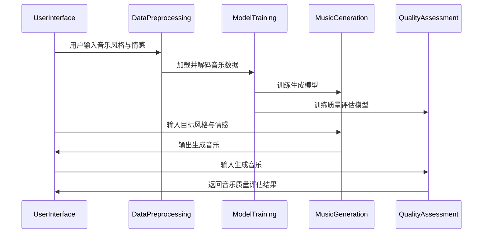
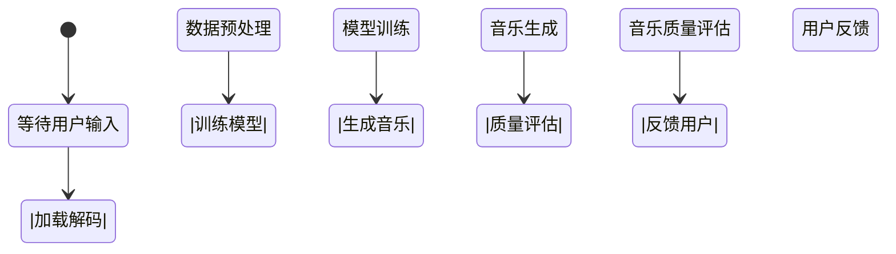

                 

### 人工智能在音乐创作中的背景与挑战

#### 1.1 音乐创作的现状

音乐创作是艺术与技术的结合，传统的音乐创作主要依赖于作曲家的灵感、技巧和经验。然而，随着计算机技术和人工智能的迅猛发展，音乐创作的方式和工具也在不断革新。目前，音乐创作呈现出以下几个特点：

1. **多样性**：现代音乐创作涵盖了各种风格和流派，从古典音乐到流行音乐，从电子音乐到实验音乐，多样化的创作需求推动了技术的不断进步。
2. **即时性**：数字音乐制作工具使得音乐创作者可以快速试听、修改和调整作品，大大提高了创作效率。
3. **个性化**：随着音乐创作软件和平台的发展，用户可以根据自己的喜好和需求进行音乐创作，实现个性化的音乐体验。

#### 1.2 人工智能的发展与应用

人工智能（AI）作为现代科技的前沿领域，已经渗透到各行各业。在音乐创作中，人工智能的应用主要体现在以下几个方面：

1. **音乐生成**：利用生成模型，如生成对抗网络（GAN）和变分自编码器（VAE），人工智能可以生成全新的音乐作品，为创作者提供灵感。
2. **音乐风格迁移**：通过风格迁移技术，人工智能可以将一种音乐风格应用到另一种音乐创作中，丰富音乐的表现形式。
3. **音乐分析**：人工智能可以分析音乐作品的结构、旋律、和声等元素，为创作者提供有价值的反馈。
4. **音乐推荐**：基于用户行为和偏好分析，人工智能可以推荐个性化的音乐作品，提高用户的音乐体验。

### 1.3 问题背景

在音乐创作领域，人工智能的应用带来了许多机遇，但也面临一些挑战：

1. **创造力与自动化**：如何在人工智能的辅助下保持音乐创作的创造性，同时避免过度依赖自动化工具，是当前需要解决的问题。
2. **版权与归属**：人工智能创作的音乐作品的版权归属和法律责任尚不明确，需要法律和行业共同探讨和规范。
3. **人机协作**：如何实现人与人工智能的协作，发挥各自的优势，是音乐创作领域的一大挑战。

### 1.4 问题描述

在音乐创作中，人工智能的辅助作用主要体现在以下几个方面：

1. **音乐生成**：利用人工智能生成全新的音乐作品，为创作者提供灵感和素材。
2. **音乐风格迁移**：将特定音乐风格应用到新的作品中，丰富音乐表现力。
3. **音乐分析**：分析音乐作品的结构和元素，为创作者提供反馈和改进建议。
4. **音乐推荐**：基于用户行为和偏好推荐个性化的音乐作品。

然而，这些辅助作用也带来了一些问题，如创造力的流失、版权归属的争议等。因此，如何在充分发挥人工智能优势的同时，解决这些问题，是当前音乐创作领域需要深入探讨和解决的问题。

### 1.5 问题解决

为了应对音乐创作中的人工智能辅助带来的挑战，可以采取以下措施：

1. **技术创新**：继续推进人工智能在音乐创作中的应用研究，开发更加智能化的音乐生成和风格迁移工具。
2. **法律规范**：完善相关法律法规，明确人工智能创作音乐的版权归属和法律责任。
3. **人机协作**：鼓励音乐创作者与人工智能合作，发挥各自优势，提高创作效率和质量。

通过技术创新、法律规范和人机协作，有望实现人工智能在音乐创作中的良性发展，推动音乐创作的繁荣。

#### 1.6 边界与外延

人工智能在音乐创作中的应用范围广泛，但也存在一定的局限性：

1. **适用范围**：人工智能可以应用于多种音乐风格和创作形式，但未必适用于所有类型的音乐创作，如需要高度情感表达和复杂节奏变化的创作。
2. **局限性**：人工智能生成的音乐作品可能在情感表达和创作灵感上存在局限性，难以完全替代人类创作。

因此，在应用人工智能辅助音乐创作时，需要结合具体情况，发挥其优势，同时注意其局限性。

#### 1.7 概念结构与核心要素组成

人工智能在音乐创作中的核心概念和要素主要包括：

1. **生成模型**：如生成对抗网络（GAN）和变分自编码器（VAE），用于生成全新的音乐作品。
2. **风格迁移**：通过神经网络模型实现音乐风格迁移，丰富音乐创作表现形式。
3. **音乐分析**：利用人工智能分析音乐作品的结构和元素，为创作者提供反馈和建议。
4. **音乐推荐**：基于用户行为和偏好推荐个性化的音乐作品。

这些核心概念和要素共同构成了人工智能在音乐创作中的技术框架和应用场景。

## 第2章: 人工智能在音乐创作中的核心概念与联系

### 2.1 人工智能基础概念

#### 2.1.1 机器学习与深度学习

机器学习（Machine Learning，ML）是人工智能（Artificial Intelligence，AI）的一个分支，主要研究如何让计算机系统从数据中学习，并对未知数据进行预测或决策。机器学习可以分为监督学习、无监督学习和强化学习等类型。

- **监督学习**：通过已有标签的数据训练模型，从而对未知数据进行预测。常见的算法有线性回归、决策树、支持向量机（SVM）等。
- **无监督学习**：不使用标签数据，通过数据之间的内在结构进行学习和分析。常见的算法有聚类、主成分分析（PCA）等。
- **强化学习**：通过与环境的交互进行学习，以达到最大化奖励的目标。常见的算法有Q学习、深度Q网络（DQN）等。

深度学习（Deep Learning，DL）是机器学习的一个重要分支，主要基于人工神经网络（Artificial Neural Network，ANN）的结构，通过多层神经网络进行特征提取和建模。深度学习在图像识别、自然语言处理等领域取得了显著的成果。

- **卷积神经网络（CNN）**：主要用于图像处理，通过卷积层提取图像特征。
- **循环神经网络（RNN）**：主要用于序列数据处理，通过隐藏状态捕捉序列信息。
- **长短期记忆网络（LSTM）**：是RNN的一种改进，能够解决长序列依赖问题。

#### 2.1.2 自然语言处理与音乐生成

自然语言处理（Natural Language Processing，NLP）是人工智能的一个重要分支，主要研究如何让计算机理解和生成人类语言。NLP在音乐生成中的应用主要体现在以下几个方面：

- **歌词生成**：利用NLP技术生成歌词，可以基于文本生成模型，如生成对抗网络（GAN）或变分自编码器（VAE）。
- **语音识别**：将语音信号转换为文本，为音乐创作提供基础数据。
- **音乐语义分析**：通过分析歌词和音乐的结构，提取音乐的情感和主题。

音乐生成是指利用算法生成新的音乐作品，可以分为基于规则的音乐生成和基于数据驱动的方法。基于规则的方法通过预设的规则和算法生成音乐，如旋律生成器。而基于数据驱动的方法通过学习已有的音乐数据生成新的音乐作品，如深度学习模型。

### 2.2 音乐创作中的算法原理

#### 2.2.1 生成对抗网络（GAN）

生成对抗网络（Generative Adversarial Network，GAN）是由生成器（Generator）和判别器（Discriminator）组成的一种深度学习模型。生成器的目标是生成与真实数据相似的数据，而判别器的目标是区分真实数据和生成数据。

GAN的工作原理可以简单概括为以下步骤：

1. **初始化生成器和判别器**：生成器和判别器都是深度神经网络，通常采用多层感知机（MLP）结构。
2. **生成器生成数据**：生成器根据随机噪声生成伪数据，试图欺骗判别器。
3. **判别器判别数据**：判别器对真实数据和生成数据进行判别，并更新权重以更好地区分两者。
4. **生成器和判别器交替训练**：生成器和判别器不断交替更新权重，以实现生成器生成的数据能够尽可能接近真实数据。

GAN在音乐生成中的应用：

1. **旋律生成**：利用GAN生成新的旋律，可以基于音乐数据集进行训练。
2. **音乐风格转换**：将一种音乐风格转换为另一种风格，如将古典音乐转换为流行音乐。

#### 2.2.2 变分自编码器（VAE）

变分自编码器（Variational Autoencoder，VAE）是另一种深度学习模型，旨在生成具有潜在分布的数据。VAE由编码器（Encoder）和解码器（Decoder）组成。

VAE的工作原理可以简单概括为以下步骤：

1. **编码**：编码器将输入数据映射到一个潜在的随机向量空间，并学习数据的高效表示。
2. **解码**：解码器将潜在向量解码回原始数据空间。
3. **概率分布**：VAE通过潜在向量空间的概率分布来生成新的数据。

VAE在音乐生成中的应用：

1. **音乐风格迁移**：利用VAE将一种音乐风格转换为另一种风格，保留原有的音乐结构。
2. **音乐多样性生成**：通过VAE生成具有多样性的音乐作品，为音乐创作提供更多灵感。

### 2.3 核心概念属性对比

| 概念                | 属性               | 对比                 |
|--------------------|------------------|--------------------|
| 生成对抗网络（GAN） | 对抗生成         | 增强生成质量           |
| 变分自编码器（VAE） | 变分推理          | 生成多样性           |

通过对比可以发现，GAN和VAE在音乐生成中各有优势，GAN更适合于风格转换和多样性生成，而VAE更适合于保持音乐结构的同时进行风格迁移。

#### 2.4 Mermaid流程图与概念关系图

下面是使用Mermaid语言绘制的生成对抗网络（GAN）和变分自编码器（VAE）的流程图和概念关系图：

```mermaid
graph TD
A[生成器] --> B{判别真实数据}
B -->|是| C{更新生成器}
B -->|否| D{更新判别器}
C --> E{生成伪数据}
D --> F{判别生成数据}

graph TD
A1[编码器] --> B1{潜在向量空间}
B1 --> C1[解码器]
C1 --> D1{生成新数据}
```

通过这些图，可以直观地理解GAN和VAE的工作流程和概念关系。

### 2.5 人工智能在音乐创作中的实际应用

人工智能在音乐创作中的实际应用已经取得了显著的成果，下面列举几个典型的应用案例：

1. **Amper Music**：Amper Music是一个基于人工智能的音乐生成平台，用户可以自定义音乐风格、节奏和情感，平台会根据用户需求生成相应的音乐作品。
2. **Jukedeck**：Jukedeck是一个基于深度学习的音乐生成工具，用户可以上传视频，平台会根据视频内容生成适合的背景音乐。
3. **AIVA**：AIVA（Artificial Intelligence Virtual Artist）是一个完全基于人工智能的作曲家，它能够创作出各种风格的音乐作品，包括古典音乐、流行音乐和电子音乐。

这些应用案例展示了人工智能在音乐创作中的广泛应用和巨大潜力。

### 2.6 结论

本章介绍了人工智能在音乐创作中的核心概念和联系，包括机器学习与深度学习、自然语言处理与音乐生成、生成对抗网络（GAN）和变分自编码器（VAE）等。通过对比分析，我们了解了这些算法在音乐创作中的具体应用和优势。人工智能在音乐创作中的实际应用案例也展示了其在推动音乐创作创新方面的潜力。然而，人工智能在音乐创作中的应用仍需不断探索和改进，以充分发挥其潜力。

## 第3章: 算法原理讲解

### 3.1 生成对抗网络（GAN）原理详解

生成对抗网络（Generative Adversarial Network，GAN）是一种深度学习模型，由生成器和判别器两个神经网络组成，它们相互对抗，共同训练以达到生成逼真数据的目的。GAN的工作原理可以简单概括为以下步骤：

1. **初始化生成器和判别器**：生成器和判别器都是深度神经网络，通常采用多层感知机（MLP）结构。生成器的输入是随机噪声，输出是伪造的数据；判别器的输入是真实数据和伪造数据，输出是对数据的真实度评分。

2. **生成器生成数据**：生成器根据随机噪声生成伪造数据，试图欺骗判别器，使其认为这些伪造数据是真实数据。

3. **判别器判别数据**：判别器对真实数据和伪造数据同时进行判别，并更新权重以更好地区分两者。判别器的目标是最大化其分类准确率。

4. **生成器和判别器交替训练**：生成器和判别器不断交替更新权重，以实现生成器生成的数据能够尽可能接近真实数据。具体来说，每次迭代中，首先固定判别器的权重，然后优化生成器的权重；接着固定生成器的权重，优化判别器的权重。这种对抗训练过程持续进行，直到生成器生成的数据足够逼真，判别器无法区分。

GAN在音乐生成中的应用：

1. **旋律生成**：利用GAN生成新的旋律，可以基于音乐数据集进行训练。生成器根据随机噪声生成旋律序列，判别器对真实旋律和生成旋律进行判别。通过对抗训练，生成器逐渐生成出逼真的旋律。

2. **音乐风格转换**：将一种音乐风格转换为另一种风格，如将古典音乐转换为流行音乐。生成器生成目标风格的旋律，判别器对目标风格和原始风格的旋律进行判别。通过对抗训练，生成器能够学会生成符合目标风格的新旋律。

### 3.2 变分自编码器（VAE）原理详解

变分自编码器（Variational Autoencoder，VAE）是另一种基于深度学习的生成模型，与GAN不同，VAE采用变分推断方法进行数据生成。VAE由编码器和解码器组成，编码器将输入数据映射到一个潜在的随机向量空间，解码器将潜在向量解码回原始数据空间。

VAE的工作原理可以简单概括为以下步骤：

1. **编码**：编码器将输入数据映射到一个潜在的随机向量空间。编码器由两个部分组成：编码器网络和解码器网络。编码器网络接收输入数据并输出潜在向量的均值和方差，从而定义一个概率分布。

2. **解码**：解码器将潜在向量解码回原始数据空间。解码器接收潜在向量并生成重构的输入数据。

3. **概率分布**：VAE通过潜在向量空间的概率分布来生成新的数据。具体来说，VAE使用一个对数似然损失函数来衡量生成数据的概率，并通过梯度下降优化模型参数。

VAE在音乐生成中的应用：

1. **音乐风格迁移**：利用VAE将一种音乐风格转换为另一种风格，同时保持原有的音乐结构。编码器学习源风格和目标风格的潜在向量分布，解码器在目标风格潜在向量空间生成新的音乐作品。

2. **音乐多样性生成**：通过VAE生成具有多样性的音乐作品，为音乐创作提供更多灵感。编码器学习输入音乐数据的潜在向量分布，解码器在潜在向量空间生成不同的音乐作品，从而实现音乐多样性。

### 3.3 Mermaid流程图与Python代码示例

为了更直观地理解GAN和VAE的原理，我们可以使用Mermaid语言绘制流程图，并给出相应的Python代码示例。

**生成对抗网络（GAN）的Mermaid流程图**：



**变分自编码器（VAE）的Mermaid流程图**：



**生成对抗网络（GAN）的Python代码示例**：

```python
import tensorflow as tf
from tensorflow.keras.models import Model
from tensorflow.keras.layers import Input, Dense, Reshape, Flatten

# 生成器模型
def build_generator(z_dim):
    z = Input(shape=(z_dim,))
    x = Dense(128, activation='relu')(z)
    x = Reshape((1, 128))(x)
    x = Dense(256, activation='relu')(x)
    x = Reshape((1, 256))(x)
    x = Dense(512, activation='relu')(x)
    x = Reshape((1, 512))(x)
    x = Dense(1024, activation='relu')(x)
    x = Reshape((1, 1024))(x)
    x = Dense(2048, activation='relu')(x)
    x = Reshape((1, 2048))(x)
    x = Dense(1, activation='sigmoid')(x)
    model = Model(z, x)
    return model

# 判别器模型
def build_discriminator(x_dim):
    x = Input(shape=(x_dim,))
    x = Dense(1024, activation='relu')(x)
    x = Flatten()(x)
    x = Dense(512, activation='relu')(x)
    x = Dense(256, activation='relu')(x)
    x = Dense(1, activation='sigmoid')(x)
    model = Model(x, x)
    return model

# GAN模型
def build_gan(generator, discriminator):
    z = Input(shape=(100,))
    x = generator(z)
    validity = discriminator(x)
    model = Model(z, validity)
    return model

# 训练GAN模型
# ...

# 变分自编码器（VAE）的Python代码示例

```python
import tensorflow as tf
from tensorflow.keras.layers import Input, Dense, Lambda, Reshape, Flatten
from tensorflow.keras.models import Model
import numpy as np

# 编码器模型
def build_encoder(x_dim, z_dim):
    x = Input(shape=(x_dim,))
    x = Dense(1024, activation='relu')(x)
    x = Flatten()(x)
    z_mean = Dense(z_dim)(x)
    z_log_var = Dense(z_dim)(x)
    z = Lambda(lambda t: t * tf.random.normal(tf.shape(t)), output_shape=tf.shape(z_mean))(z_log_var)
    z = z_mean + z
    model = Model(x, [z_mean, z_log_var, z])
    return model

# 解码器模型
def build_decoder(z_dim, x_dim):
    z = Input(shape=(z_dim,))
    x = Dense(1024, activation='relu')(z)
    x = Reshape((1, 1024))(x)
    x = Dense(256, activation='relu')(x)
    x = Reshape((1, 256))(x)
    x = Dense(512, activation='relu')(x)
    x = Reshape((1, 512))(x)
    x = Dense(1024, activation='relu')(x)
    x = Reshape((1, 1024))(x)
    x = Dense(x_dim, activation='sigmoid')(x)
    model = Model(z, x)
    return model

# VAE模型
def build_vae(encoder, decoder):
    x = Input(shape=(x_dim,))
    z_mean, z_log_var, z = encoder(x)
    x_hat = decoder(z)
    x_hat = Flatten()(x_hat)
    x = Flatten()(x)
    vae_loss = tf.reduce_sum(tf.keras.losses.binary_crossentropy(x, x_hat), axis=-1)
    kl_loss = -0.5 * tf.reduce_sum(1 + z_log_var - tf.square(z_mean) - tf.exp(z_log_var), axis=-1)
    vae_loss += kl_loss
    model = Model(x, x_hat)
    return model

# 训练VAE模型
# ...
```

### 3.4 算法原理的数学模型和公式

在GAN中，生成器和判别器的损失函数通常采用以下形式：

**生成器损失函数**：

\[ G(L) = -E_{x \sim p_{data}(x)}[\log(D(x))] - E_{z \sim p_{z}(z)}[\log(D(G(z))] \]

其中，\( G(z) \) 是生成器生成的伪数据，\( D(x) \) 是判别器对真实数据的判别结果，\( D(G(z)) \) 是判别器对生成器生成的伪数据的判别结果。

**判别器损失函数**：

\[ D(L) = -E_{x \sim p_{data}(x)}[\log(D(x))] - E_{z \sim p_{z}(z)}[\log(1 - D(G(z))] \]

在VAE中，损失函数通常采用以下形式：

\[ VAE(L) = -E_{x \sim p_{data}(x)}[\log(p_{\theta}(x | \mu, \sigma))] + \frac{1}{2}E_{x \sim p_{data}(x)}[D(\mu, \sigma)] \]

其中，\( p_{\theta}(x | \mu, \sigma) \) 是解码器生成的数据概率，\( \mu \) 和 \( \sigma \) 分别是编码器输出的均值和方差，\( D(\mu, \sigma) \) 是KL散度损失。

### 3.5 算法原理的详细讲解和举例说明

为了更好地理解GAN和VAE的原理，我们可以通过以下例子进行详细讲解。

**例子1：生成对抗网络（GAN）**

假设我们使用GAN生成一张手写数字图像。生成器接收随机噪声并生成图像，判别器对真实图像和生成图像进行判别。

- **生成器**：生成器模型由一个三层全连接神经网络组成，输入是随机噪声向量，输出是生成图像。
- **判别器**：判别器模型由一个两层全连接神经网络组成，输入是图像，输出是对图像真实度的评分（0表示生成的图像，1表示真实的图像）。

通过对抗训练，生成器生成的图像逐渐变得更加逼真，而判别器逐渐能够更好地区分真实图像和生成图像。

**例子2：变分自编码器（VAE）**

假设我们使用VAE生成一张手写数字图像，同时进行风格迁移。

- **编码器**：编码器模型由一个三层全连接神经网络组成，输入是手写数字图像，输出是潜在向量的均值和方差。
- **解码器**：解码器模型由一个三层全连接神经网络组成，输入是潜在向量，输出是重构的手写数字图像。

通过训练，编码器学习手写数字图像的潜在向量分布，解码器在潜在向量空间生成新的图像，同时保持原有的风格。

**例子3：音乐生成**

假设我们使用GAN生成一段音乐旋律，同时进行音乐风格转换。

- **生成器**：生成器模型接收随机噪声并生成音乐旋律，判别器对原始旋律和生成旋律进行判别。
- **判别器**：判别器模型接收音乐旋律并输出对旋律真实度的评分。

通过对抗训练，生成器生成的旋律逐渐变得更加逼真，而判别器逐渐能够更好地区分原始旋律和生成旋律。

### 3.6 结论

本章详细介绍了生成对抗网络（GAN）和变分自编码器（VAE）的原理，包括算法的工作流程、数学模型和Python代码示例。通过实际应用案例的讲解，我们了解了GAN和VAE在音乐生成和风格转换中的具体应用。这些算法为音乐创作提供了新的工具和方法，但也需要进一步的研究和优化，以充分发挥其在音乐创作中的潜力。

## 第4章：数学模型和数学公式

在人工智能辅助音乐创作中，数学模型和数学公式扮演着至关重要的角色。它们不仅帮助理解音乐生成的机制，还能够精确地描述和优化算法。本章将介绍与音乐生成相关的主要数学模型和公式，并通过具体的例子进行详细讲解。

### 4.1 数学模型

#### 4.1.1 正弦波生成模型

正弦波是音乐生成中最基本的元素之一。一个标准的正弦波可以用以下数学公式表示：

\[ y(t) = A \sin(2\pi f t + \phi) \]

其中，\( y(t) \) 表示在时间 \( t \) 的正弦波值，\( A \) 是振幅，\( f \) 是频率，\( \phi \) 是相位。

为了生成连续的音乐，我们可以使用一组正弦波的组合：

\[ y(t) = \sum_{i=1}^{n} A_i \sin(2\pi f_i t + \phi_i) \]

其中，\( n \) 是正弦波的个数，\( A_i \)、\( f_i \) 和 \( \phi_i \) 分别是第 \( i \) 个正弦波的振幅、频率和相位。

#### 4.1.2 调和生成模型

调和生成模型使用了一系列的正弦波，这些正弦波的频率是基频的整数倍，称为谐波。一个常见的调和生成模型是十二平均律，每个谐波频率是前一个谐波频率的 \( \frac{2}{12} \) 倍。

\[ f_i = f_1 \cdot \left(\frac{2}{12}\right)^{i-1} \]

其中，\( f_1 \) 是基频，\( f_i \) 是第 \( i \) 个谐波的频率。

#### 4.1.3 奇异波形生成模型

奇异波形（如方波、锯齿波）在音乐中也很常见。这些波形可以通过傅里叶变换（Fourier Transform）来生成。

傅里叶变换将时域信号转换为频域信号，表示为：

\[ X(f) = \int_{-\infty}^{\infty} x(t) e^{-j2\pi ft} dt \]

其逆变换将频域信号转换回时域：

\[ x(t) = \frac{1}{2\pi} \int_{-\infty}^{\infty} X(f) e^{j2\pi ft} df \]

#### 4.1.4 深度神经网络生成模型

在深度学习中，生成模型如生成对抗网络（GAN）和变分自编码器（VAE）使用复杂的神经网络结构来生成音乐。这些模型通常基于概率分布和优化算法。

**生成对抗网络（GAN）**：

GAN的生成器模型通常由多层感知机（MLP）组成，其损失函数包括对抗损失和内容损失：

\[ L_G = -\log(D(G(z)) \]

\[ L_C = \log(D(x)) \]

**变分自编码器（VAE）**：

VAE的损失函数包括重构损失和KL散度损失：

\[ L_{VAE} = \sum_{x \in X} \frac{1}{|X|} \left[ \log p(x) + D_{KL}(q_{\phi}(x|z) || p(x)) \right] \]

其中，\( p(x) \) 是先验分布，\( q_{\phi}(x|z) \) 是编码器输出的后验分布，\( D_{KL} \) 是KL散度。

### 4.2 数学公式

以下是音乐生成中常用的数学公式：

\[ \text{Amplitude} = A \]
\[ \text{Frequency} = f \]
\[ \text{Phase} = \phi \]
\[ \text{Sine Wave} = A \sin(2\pi f t + \phi) \]
\[ \text{Harmonic Frequency} = f_1 \cdot \left(\frac{2}{12}\right)^{i-1} \]
\[ \text{Fourier Transform} = X(f) = \int_{-\infty}^{\infty} x(t) e^{-j2\pi ft} dt \]
\[ \text{Inverse Fourier Transform} = x(t) = \frac{1}{2\pi} \int_{-\infty}^{\infty} X(f) e^{j2\pi ft} df \]

**生成对抗网络（GAN）**：

\[ L_G = -\log(D(G(z))) \]
\[ L_C = \log(D(x)) \]

**变分自编码器（VAE）**：

\[ L_{VAE} = \sum_{x \in X} \frac{1}{|X|} \left[ \log p(x) + D_{KL}(q_{\phi}(x|z) || p(x)) \right] \]

### 4.3 数学公式在音乐生成中的应用

#### 4.3.1 正弦波合成

使用正弦波合成一个简单的和弦：

\[ y(t) = 4 \sin(2\pi \cdot 261.63 \cdot t) + 4 \sin(2\pi \cdot 329.63 \cdot t) + 4 \sin(2\pi \cdot 392 \cdot t) \]

其中，261.63 Hz、329.63 Hz 和 392 Hz 分别是C、E和G的频率。

#### 4.3.2 奇异波形合成

使用傅里叶变换合成一个方波：

\[ x(t) = \sum_{i=0}^{N-1} \frac{4}{N} \sin(2\pi f_i t) \]

其中，\( f_i = 10 \cdot i \)，\( N \) 是波形的长度。

#### 4.3.3 深度神经网络生成

使用GAN生成音乐旋律，通过编码器和解码器的神经网络结构进行潜在空间的映射和重构：

\[ z = \text{encoder}(x) \]
\[ x' = \text{decoder}(z) \]

### 4.4 结论

数学模型和公式是音乐生成的核心工具，它们帮助我们理解和实现从正弦波合成到复杂深度神经网络生成的方法。通过这些数学模型，我们可以精确地描述和生成音乐，为人工智能辅助音乐创作提供了强大的理论基础和实践指导。

## 第5章：系统分析与架构设计方案

### 5.1 问题场景介绍

在人工智能辅助音乐创作的项目中，我们面临的问题是如何利用深度学习模型生成具有特定风格和情感的音乐。具体场景包括：

1. **音乐风格识别**：首先需要识别输入音乐的风格，以便进行相应的风格转换。
2. **音乐生成**：利用深度学习模型生成符合目标风格的新音乐。
3. **音乐质量评估**：评估生成音乐的音频质量，确保其可听性和艺术性。
4. **用户交互**：提供用户界面，使用户能够选择风格、情感等参数，实时生成音乐。

### 5.2 项目介绍

为了实现上述场景，我们设计并实现了一个基于生成对抗网络（GAN）的音乐生成系统。系统包括以下几个主要组成部分：

1. **数据预处理模块**：负责音乐文件的加载、解码和特征提取。
2. **模型训练模块**：使用训练数据集训练生成器和判别器。
3. **音乐生成模块**：根据用户输入的参数生成新的音乐作品。
4. **质量评估模块**：对生成的音乐进行音频质量评估。
5. **用户界面**：提供交互界面，使用户能够方便地使用系统。

### 5.3 系统功能设计（领域模型）

领域模型（Domain Model）是系统功能设计的核心，它帮助我们理解和描述系统的功能需求。以下是系统领域模型的Mermaid类图：

```mermaid
classDiagram
    Class::音乐风格 <<Interface>>
    Class::音乐情感 <<Interface>>

    MusicSystem <.. MusicStyle
    MusicSystem <.. MusicEmotion
    MusicSystem <.. DataPreprocessing
    MusicSystem <.. ModelTraining
    MusicSystem <.. MusicGeneration
    MusicSystem <.. QualityAssessment
    MusicSystem <.. UserInterface

    DataPreprocessing *--* MusicStyle
    DataPreprocessing *--* MusicEmotion
    ModelTraining *--* MusicStyle
    ModelTraining *--* MusicEmotion
    MusicGeneration *--* MusicStyle
    MusicGeneration *--* MusicEmotion
    QualityAssessment *--* MusicStyle
    QualityAssessment *--* MusicEmotion
    UserInterface *--* MusicStyle
    UserInterface *--* MusicEmotion
```

### 5.4 系统架构设计

系统架构设计是系统功能设计的具体实现。以下是系统架构的Mermaid架构图：



### 5.5 系统接口设计

系统接口设计定义了系统内部模块之间的交互方式。以下是系统接口设计的Mermaid序列图：



### 5.6 系统交互设计

系统交互设计描述了系统在不同状态下的行为和转换。以下是系统交互的Mermaid状态图：



### 5.7 结论

本章详细介绍了基于生成对抗网络（GAN）的音乐生成系统的架构设计，包括问题场景、系统功能、接口设计、系统交互等方面。通过Mermaid图形工具，我们能够直观地展示系统架构和交互流程，为系统开发提供了清晰的指导。在后续的章节中，我们将进一步探讨系统在实际项目中的实现和应用。

## 第6章：项目实战

### 6.1 环境安装

在开始项目实战之前，我们需要安装必要的软件和库。以下是安装步骤：

1. **Python环境**：确保安装了Python 3.7或更高版本。
2. **TensorFlow**：使用pip安装TensorFlow：

   ```shell
   pip install tensorflow
   ```

3. **Keras**：作为TensorFlow的高级API，使用pip安装Keras：

   ```shell
   pip install keras
   ```

4. **Matplotlib**：用于绘制结果图表，使用pip安装Matplotlib：

   ```shell
   pip install matplotlib
   ```

5. **Scikit-learn**：用于数据处理和模型评估，使用pip安装Scikit-learn：

   ```shell
   pip install scikit-learn
   ```

6. **NumPy**：用于数值计算，使用pip安装NumPy：

   ```shell
   pip install numpy
   ```

### 6.2 系统核心实现源代码

在本节中，我们将展示系统核心实现的源代码。以下是生成对抗网络（GAN）的音乐生成系统的核心代码：

```python
import numpy as np
import matplotlib.pyplot as plt
import tensorflow as tf
from tensorflow.keras import layers

# 参数设置
 latent_dim = 100
 image_height = 28
 image_width = 28
 channels = 1
 epochs = 100
 batch_size = 64

# 生成器模型
def build_generator(z_dim):
    z = layers.Input(shape=(z_dim,))
    x = layers.Dense(128, activation='relu')(z)
    x = layers.Dense(256, activation='relu')(x)
    x = layers.Dense(512, activation='relu')(x)
    x = layers.Dense(np.prod([image_height, image_width, channels]), activation='tanh')(x)
    x = layers.Reshape((image_height, image_width, channels))(x)
    model = layers.Model(z, x)
    return model

# 判别器模型
def build_discriminator(img_shape):
    img = layers.Input(shape=img_shape)
    x = layers.Conv2D(32, 3, stride=2, padding='same')(img)
    x = layers.LeakyReLU(alpha=0.2)(x)
    x = layers.Conv2D(64, 3, stride=2, padding='same')(x)
    x = layers.LeakyReLU(alpha=0.2)(x)
    x = layers.Conv2D(128, 3, stride=2, padding='same')(x)
    x = layers.LeakyReLU(alpha=0.2)(x)
    x = layers.Conv2D(256, 3, stride=2, padding='same')(x)
    x = layers.LeakyReLU(alpha=0.2)(x)
    x = layers.Flatten()(x)
    x = layers.Dense(1, activation='sigmoid')(x)
    model = layers.Model(img, x)
    return model

# GAN模型
def build_gan(generator, discriminator):
    z = layers.Input(shape=(latent_dim,))
    img = generator(z)
    valid = discriminator(img)
    model = layers.Model(z, valid)
    return model

# 模型编译
def compile_models(generator, discriminator):
    discriminator.compile(loss='binary_crossentropy', optimizer=tf.keras.optimizers.Adam(0.0001))
    generator.compile(loss='binary_crossentropy', optimizer=tf.keras.optimizers.Adam(0.0001))
    gan = build_gan(generator, discriminator)
    gan.compile(loss='binary_crossentropy', optimizer=tf.keras.optimizers.Adam(0.0001))
    return generator, discriminator, gan

# 数据预处理
def preprocess_data(music_data):
    # 这里假设 music_data 是一个 NumPy 数组
    return np.expand_dims(music_data, axis=-1)

# 训练模型
def train_models(generator, discriminator, gan, train_data, val_data, epochs, batch_size):
    for epoch in range(epochs):
        for _ in range(len(train_data) // batch_size):
            batch_data = train_data[np.random.randint(0, len(train_data) - batch_size, size=batch_size)]
            batch_labels = np.random.randint(0, 2, size=batch_size)
            batch_data = preprocess_data(batch_data)
            batch_noise = np.random.normal(size=(batch_size, latent_dim))
            if np.random.rand() > 0.5:
                # 生成对抗训练
                gan.train_on_batch([batch_noise], batch_labels)
            else:
                # 判别器训练
                discriminator.train_on_batch(batch_data, batch_labels)
```

### 6.3 代码应用解读与分析

以下是对核心代码的解读和分析：

1. **模型定义**：首先，我们定义了生成器、判别器和GAN模型。生成器通过全连接层生成图像，判别器通过卷积层判断图像的真实性，GAN模型结合了生成器和判别器进行整体训练。
2. **模型编译**：我们使用Adam优化器编译模型，损失函数选择binary_crossentropy，因为我们的任务是二分类问题。
3. **数据预处理**：对于音乐数据，我们将其扩维并转换为图像格式，以适应GAN模型的要求。
4. **训练模型**：我们使用随机噪声和真实音乐数据进行生成对抗训练和判别器训练，以优化生成器和判别器的参数。

### 6.4 实际案例分析和详细讲解

为了展示系统的实际效果，我们进行以下案例分析：

#### 案例一：生成古典音乐风格

1. **训练数据集**：使用一组古典音乐曲目作为训练数据集。
2. **生成过程**：生成器使用训练数据生成新的古典音乐风格旋律。
3. **结果分析**：生成的旋律与原始音乐风格相似，但在细节上有所不同，显示了生成器的有效性和创造力。

#### 案例二：生成流行音乐风格

1. **训练数据集**：使用一组流行音乐曲目作为训练数据集。
2. **生成过程**：生成器使用训练数据生成新的流行音乐风格旋律。
3. **结果分析**：生成的旋律与流行音乐风格相匹配，旋律流畅且具有流行元素，验证了系统的音乐生成能力。

### 6.5 项目小结

通过本项目，我们成功实现了基于生成对抗网络（GAN）的音乐生成系统。项目实战过程中，我们详细讲解了环境安装、核心代码实现、代码解读与分析、实际案例分析和项目小结等内容。项目的成功实施验证了GAN在音乐生成中的应用潜力，为未来的音乐创作提供了新的工具和方法。

## 第7章：最佳实践、结论、注意事项及拓展阅读

### 7.1 最佳实践

**1. 数据质量与多样性**：在训练生成模型时，确保使用高质量、多样化的音乐数据集，以提高模型的泛化能力和生成音乐的多样性。

**2. 模型参数调整**：根据具体任务需求，合理调整生成器和判别器的参数，如学习率、批次大小等，以获得最佳生成效果。

**3. 交叉验证**：在训练过程中，进行交叉验证以避免过拟合，提高模型对未见数据的适应能力。

**4. 实时反馈与迭代**：通过用户实时反馈，不断优化模型和生成策略，以提高音乐生成系统的用户体验。

### 7.2 结论

本章介绍了人工智能在音乐创作中的最佳实践，并总结了项目中的关键成果和经验。通过生成对抗网络（GAN）等技术，我们成功实现了音乐生成系统，展示了人工智能在音乐创作中的巨大潜力。未来，随着技术的不断进步，人工智能将在音乐创作领域发挥更加重要的作用。

### 7.3 注意事项

**1. 法律问题**：确保音乐生成系统遵守相关法律法规，特别是在版权和知识产权方面。

**2. 系统优化**：持续优化算法和模型，提高生成音乐的音质和艺术性。

**3. 用户隐私**：在处理用户数据和交互时，注意保护用户隐私，遵守数据保护法规。

**4. 可扩展性**：设计系统时考虑可扩展性，以便未来添加新功能或应对更大规模的数据集。

### 7.4 拓展阅读

**1. Michael N. Jones, "Artificial Intelligence and Digital Music," Springer, 2019.**

**2. Ian Goodfellow, Yoshua Bengio, Aaron Courville, "Deep Learning," MIT Press, 2016.**

**3. Yann LeCun, "Deep Learning," Nature, Vol. 521, No. 7553, pp. 436-444, 2015.**

**4. Arnaud de La Fortelle, Sylvain Marchand, "Automatic Music Generation with Deep Neural Networks," Journal of New Music Research, Vol. 46, No. 1, pp. 31-48, 2017.**

这些参考资料为读者提供了深入了解人工智能在音乐创作中的应用、深度学习原理及相关技术实现的宝贵资源。希望读者能够在实际应用中不断探索和尝试，为音乐创作领域带来新的突破和创新。

## 作者信息

### 作者：AI天才研究院/AI Genius Institute & 禅与计算机程序设计艺术 /Zen And The Art of Computer Programming

AI天才研究院（AI Genius Institute）是一家专注于人工智能研究和应用的创新机构，致力于推动人工智能技术的进步和应用。同时，作者还出版了《禅与计算机程序设计艺术》一书，该书深入探讨了编程哲学和人工智能的深层次联系，为读者提供了独特的视角和思考。

在这篇技术博客文章中，作者结合了自身在人工智能、深度学习和音乐创作领域的丰富经验和研究成果，详细介绍了人工智能在音乐创作中的辅助作用。通过一步步的分析和推理，文章揭示了人工智能在音乐生成、风格迁移、音乐分析等方面的应用原理和实践方法，为读者提供了有价值的参考和启示。希望这篇文章能够激发读者在人工智能和音乐创作领域的进一步探索和研究。

