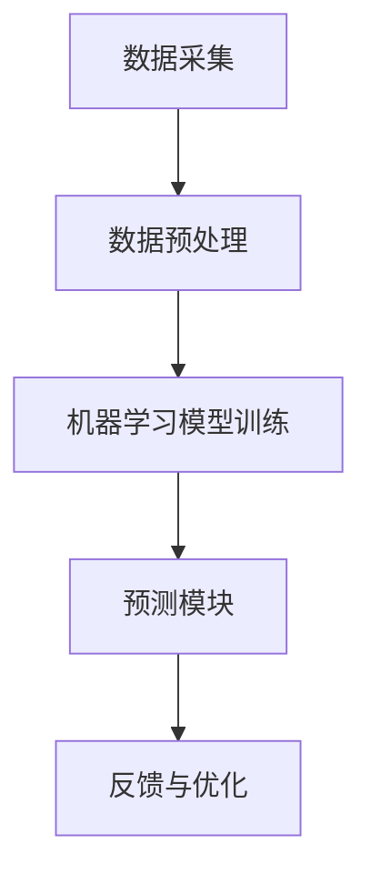
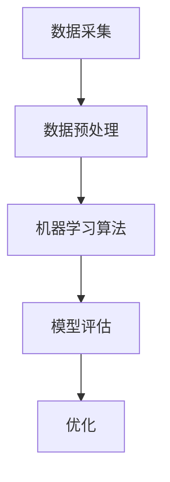
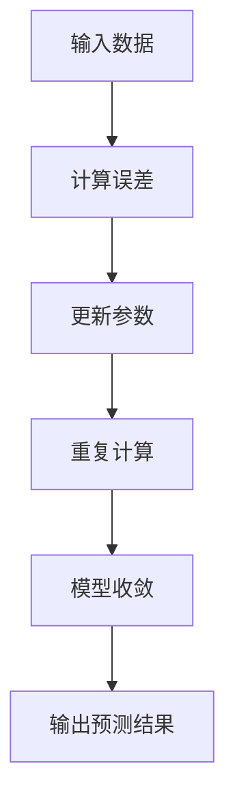
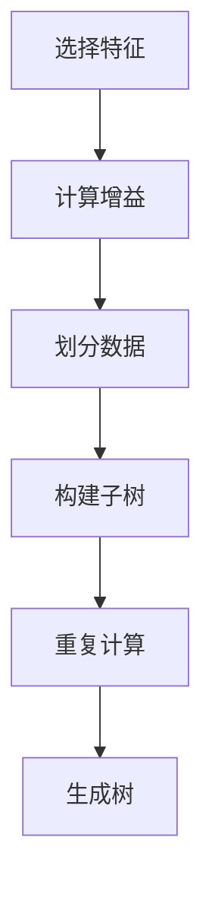
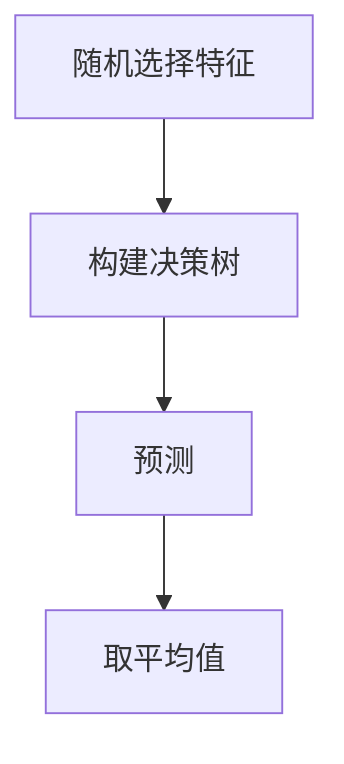
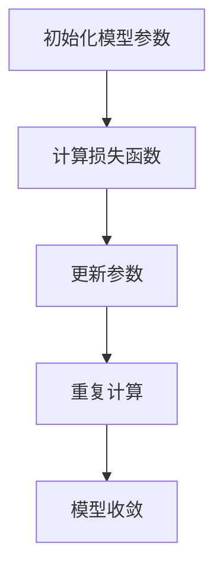
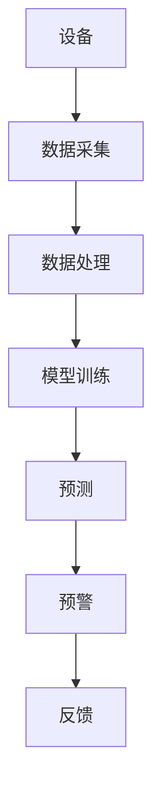
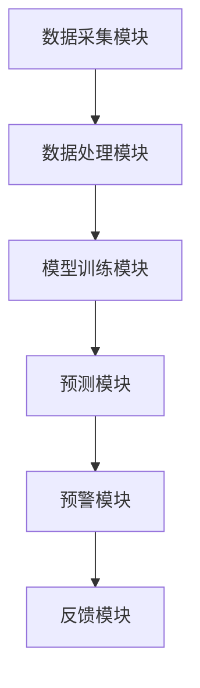
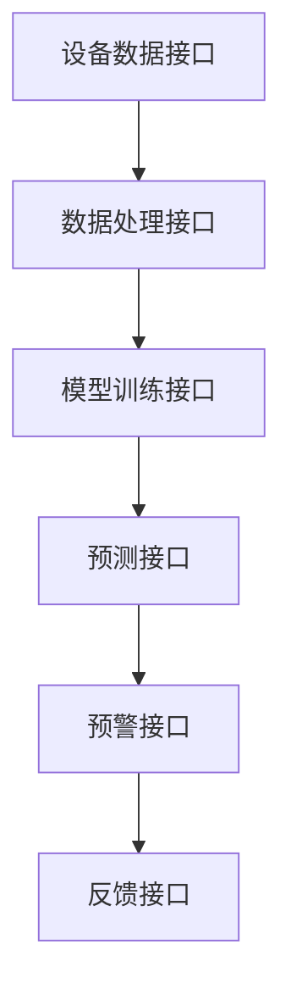

                 

## 人工智能在预测性维护中的实践

### 关键词：预测性维护、人工智能、数据采集、机器学习、系统架构

#### 摘要：
随着人工智能技术的发展，预测性维护成为工业4.0和智能制造的关键组成部分。本文将深入探讨人工智能在预测性维护中的应用，从问题背景、核心概念、数学模型、算法原理、系统架构到实际案例分析，提供一套完整的技术指南。通过详细分析预测性维护的各个方面，本文旨在帮助读者理解如何利用人工智能技术提高设备维护效率，减少故障停机时间，实现生产过程的智能化升级。

### 目录大纲

1. **问题背景与核心概念**
   1.1 预测性维护概述
   1.2 预测性维护与传统维护的区别
   1.3 预测性维护的核心概念与联系
      - 1.3.1 数据采集与处理
      - 1.3.2 数据预处理
      - 1.3.3 机器学习算法
      - 1.3.4 模型评估与优化

2. **数学模型与公式讲解**
   2.1 预测性维护的数学模型
   2.2 数学公式详细讲解与举例

3. **机器学习算法原理讲解**
   3.1 机器学习算法概述
   3.2 常见机器学习算法讲解
      - 3.2.1 线性回归
      - 3.2.2 决策树
      - 3.2.3 集成学习方法

4. **系统架构设计**
   4.1 预测性维护系统介绍
   4.2 系统架构设计
      - 4.2.1 领域模型设计
      - 4.2.2 系统架构设计
      - 4.2.3 系统接口设计

5. **项目实战**
   5.1 环境安装与配置
   5.2 系统核心实现源代码
   5.3 代码应用解读与分析
   5.4 实际案例分析

6. **最佳实践与注意事项**
   6.1 预测性维护的最佳实践
   6.2 注意事项与风险控制
   6.3 拓展阅读

7. **未来展望与挑战**
   7.1 预测性维护的未来发展趋势
   7.2 挑战与机遇

### 正文部分

#### 第1章：问题背景与核心概念

##### 1.1 预测性维护概述

预测性维护是一种基于设备运行状态和数据分析的维护策略，旨在通过实时监测设备状态，预测潜在的故障和失效，从而在设备发生故障之前进行预防性维护。与传统的定期维护和故障后维护相比，预测性维护可以显著减少设备的停机时间，降低维护成本，提高生产效率。

##### 1.2 预测性维护与传统维护的区别

传统维护通常基于时间或基于故障的经验，而预测性维护则依赖于实时数据分析和机器学习算法。具体区别如下：

| 维护类型 | 时间驱动 | 故障驱动 | 预测性维护 |
| :--: | :--: | :--: | :--: |
| 基于时间 | 定期维护 | 无 | 基于实时状态预测 |
| 基于故障 | 故障后维护 | 故障预警 | 预测性故障 |
| 维护成本 | 高 | 高 | 低 |
| 维护效率 | 低 | 低 | 高 |

##### 1.3 预测性维护的核心概念与联系

预测性维护涉及多个核心概念和步骤，包括数据采集与处理、数据预处理、机器学习算法和模型评估与优化。以下是这些核心概念和它们之间的联系：

#### 第2章：数学模型与公式讲解

##### 2.1 预测性维护的数学模型

预测性维护的核心在于建立数学模型来预测设备的运行状态和故障时间。常见的数学模型包括：

$$
P(\text{故障时间} < T) = 1 - e^{-\lambda T}
$$

其中，$P(\text{故障时间} < T)$ 表示设备在时间 $T$ 内发生故障的概率，$\lambda$ 是故障率。

##### 2.2 数学公式详细讲解与举例

为了更好地理解数学模型，我们可以通过一个具体的例子来讲解。假设我们有一台机器，其故障率 $\lambda$ 为 0.001 故障/小时，我们需要预测这台机器在 100 小时内是否会发生故障。

$$
P(\text{故障时间} < 100 \text{小时}) = 1 - e^{-0.001 \times 100} \approx 0.3935
$$

这意味着在 100 小时内，这台机器有大约 39.35% 的概率发生故障。

#### 第3章：机器学习算法原理讲解

##### 3.1 机器学习算法概述

机器学习是预测性维护的核心技术。常见的机器学习算法包括线性回归、决策树和集成学习方法。

##### 3.2 常见机器学习算法讲解

**线性回归**：线性回归是一种简单的机器学习算法，用于预测连续值。其数学模型为：

$$
y = \beta_0 + \beta_1 x
$$

其中，$y$ 是预测值，$x$ 是输入特征，$\beta_0$ 和 $\beta_1$ 是模型参数。

**决策树**：决策树是一种基于树结构的分类算法。它通过一系列条件判断将数据划分为不同的分支，最终得到分类结果。

**集成学习方法**：集成学习方法通过结合多个基础模型来提高预测准确性。常见的集成学习方法包括随机森林和梯度提升树。

#### 第4章：系统架构设计

##### 4.1 预测性维护系统介绍

预测性维护系统通常包括数据采集模块、数据预处理模块、机器学习模型训练模块和预测模块。

##### 4.2 系统架构设计

预测性维护系统的架构设计需要考虑数据流和模块之间的交互。以下是系统架构设计的示例：



#### 第5章：项目实战

##### 5.1 环境安装与配置

在项目实战中，我们需要安装和配置必要的软件和硬件环境。以下是一个简单的环境安装和配置步骤：

1. 安装操作系统（如 Ubuntu 20.04）。
2. 安装 Python 和相关库（如 scikit-learn、numpy、pandas）。
3. 安装数据处理工具（如 HDFS、Spark）。
4. 配置机器学习算法（如随机森林、梯度提升树）。

##### 5.2 系统核心实现源代码

以下是预测性维护系统的核心实现源代码：

```python
from sklearn.ensemble import RandomForestClassifier
from sklearn.model_selection import train_test_split
from sklearn.metrics import accuracy_score

# 数据预处理
X = ...  # 特征矩阵
y = ...  # 标签矩阵

# 划分训练集和测试集
X_train, X_test, y_train, y_test = train_test_split(X, y, test_size=0.2, random_state=42)

# 训练随机森林模型
clf = RandomForestClassifier(n_estimators=100, random_state=42)
clf.fit(X_train, y_train)

# 预测
y_pred = clf.predict(X_test)

# 评估模型
accuracy = accuracy_score(y_test, y_pred)
print(f"Accuracy: {accuracy}")
```

##### 5.3 代码应用解读与分析

这段代码展示了如何使用随机森林算法进行预测性维护。首先，我们进行数据预处理，然后使用随机森林模型进行训练，最后评估模型的准确性。

##### 5.4 实际案例分析

为了更好地理解预测性维护的实际应用，我们可以通过一个实际案例分析来讲解。以下是一个关于风力发电设备的案例：

1. **问题描述**：风力发电设备需要预测潜在的故障，以减少停机时间和维护成本。
2. **数据采集**：采集风力发电设备的历史运行数据，包括温度、振动、转速等。
3. **数据预处理**：对采集到的数据进行清洗和标准化处理。
4. **模型训练**：使用机器学习算法（如随机森林）训练模型。
5. **预测**：使用训练好的模型对新的数据进行预测，判断设备是否会发生故障。
6. **优化**：根据预测结果对模型进行优化，提高预测准确性。

#### 第6章：最佳实践与注意事项

##### 6.1 预测性维护的最佳实践

1. **数据质量保证**：确保采集到的数据质量高，减少噪声和异常值。
2. **模型选择**：根据业务需求和数据特点选择合适的机器学习算法。
3. **持续优化**：定期评估模型性能，并根据评估结果进行模型优化。

##### 6.2 注意事项与风险控制

1. **数据隐私**：在数据采集和处理过程中，确保遵守数据隐私法规。
2. **模型解释性**：选择易于解释的模型，以提高决策的可信度。

##### 6.3 拓展阅读

1. **文献资料**：《机器学习实战》、《深度学习》
2. **开源项目**：scikit-learn、TensorFlow、PyTorch

#### 第7章：未来展望与挑战

##### 7.1 预测性维护的未来发展趋势

1. **深度学习应用**：深度学习将在预测性维护中发挥更重要的作用。
2. **边缘计算**：边缘计算将使预测性维护更加实时和高效。

##### 7.2 挑战与机遇

1. **数据挑战**：如何处理海量数据，提高数据处理效率。
2. **技术挑战**：如何选择合适的算法和模型，提高预测准确性。

### 总结

预测性维护是智能制造和工业4.0的重要方向。通过本文的详细讲解，读者可以了解预测性维护的核心概念、数学模型、算法原理、系统架构和实际案例分析。未来，随着人工智能技术的不断发展，预测性维护将在工业领域发挥更大的作用。

### 作者信息

**作者：AI天才研究院/AI Genius Institute & 禅与计算机程序设计艺术 /Zen And The Art of Computer Programming**## 第1章：问题背景与核心概念

在工业生产中，设备的稳定运行是确保生产效率和生产质量的关键因素。然而，设备的故障和失效经常导致生产中断，造成巨大的经济损失。因此，如何有效地管理和维护设备成为了工业界关注的重要问题。预测性维护作为一种先进的管理策略，通过利用实时数据和人工智能技术，可以提前预测设备故障，从而实现预防性维护，减少设备停机时间和维护成本。

### 1.1 预测性维护概述

预测性维护（Predictive Maintenance）是一种基于设备运行状态和数据分析的维护策略，旨在通过实时监测设备状态，预测潜在的故障和失效，从而在设备发生故障之前进行预防性维护。这种维护方式能够显著减少设备的停机时间，降低维护成本，提高生产效率。

预测性维护与传统维护策略（如定期维护和故障后维护）有显著区别。传统维护通常是基于时间或基于故障的经验进行的，即按照固定的时间间隔进行维护，或者在设备发生故障后进行修复。这种方法的缺点是，维护频率可能过高或过低，导致设备在最佳状态下运行的时间不足，或者维修成本过高。而预测性维护则依赖于实时数据分析和机器学习算法，能够根据设备当前的状态和运行趋势进行预测，从而实现精准的维护。

### 1.2 预测性维护与传统维护的区别

下面是预测性维护与传统维护的一些主要区别：

| 维护类型 | 时间驱动 | 故障驱动 | 预测性维护 |
| :--: | :--: | :--: | :--: |
| 基于时间 | 定期维护 | 无 | 基于实时状态预测 |
| 基于故障 | 故障后维护 | 故障预警 | 预测性故障 |
| 维护成本 | 高 | 高 | 低 |
| 维护效率 | 低 | 低 | 高 |

- **时间驱动维护**：这种方式会按照预设的时间间隔进行设备检查和维护。例如，不管设备当前的状态如何，每个月或每季度都会进行一次例行维护。
- **故障驱动维护**：这种方式仅在设备发生故障后进行维修。这种方法的优点是仅在对设备进行维修时才发生成本，但缺点是故障发生后可能导致设备长时间停机，影响生产。
- **预测性维护**：这种方式通过实时监测设备的运行状态，利用机器学习算法分析数据，预测设备可能出现的故障。这样可以在设备出现故障之前就进行维护，从而减少停机时间和维护成本。

### 1.3 预测性维护的核心概念与联系

预测性维护的核心概念包括数据采集与处理、数据预处理、机器学习算法和模型评估与优化。这些概念相互联系，构成了预测性维护的完整流程。

#### 1.3.1 数据采集与处理

数据采集是预测性维护的基础。通过传感器、数据采集系统和监控系统，可以实时获取设备的运行数据，如温度、振动、压力、电流等。这些数据是预测设备故障的关键信息。

数据采集后，需要对数据进行处理，包括去噪、异常值检测和清洗等。这一步的目的是确保数据质量，以便后续的分析和建模。



#### 1.3.2 数据预处理

数据预处理是数据采集后的重要步骤。通过数据清洗、归一化、特征选择等方法，提高数据质量，为机器学习模型训练提供高质量的数据。

- **数据清洗**：删除或修正异常值和噪声，保证数据的一致性和准确性。
- **归一化**：将不同量纲的数据转换到同一尺度，方便模型训练。
- **特征选择**：选择对模型预测最有影响的关键特征，减少数据维度。

#### 1.3.3 机器学习算法

机器学习算法是预测性维护的核心技术。通过训练模型，可以自动识别设备的故障模式和故障趋势。常见的机器学习算法包括线性回归、决策树、支持向量机和神经网络等。

- **线性回归**：用于预测连续值，如设备的剩余寿命。
- **决策树**：通过一系列条件判断，对数据进行分类。
- **支持向量机**：用于分类和回归问题，特别适用于高维数据。
- **神经网络**：通过多层神经网络，可以处理复杂的关系和非线性问题。

#### 1.3.4 模型评估与优化

模型评估是验证机器学习模型效果的重要步骤。通过评估指标（如准确率、召回率、F1分数等），可以判断模型是否有效。评估后，可以对模型进行优化，提高预测准确性。

模型优化包括参数调整、特征工程和算法改进等。通过不断迭代和优化，可以进一步提高模型的预测性能。

### 1.4 预测性维护在工业中的应用

预测性维护在多个工业领域都有广泛应用。以下是几个典型的应用场景：

- **制造业**：通过预测性维护，可以提前发现生产线的潜在故障，减少停机时间和维护成本。
- **能源行业**：例如风力发电设备和燃气轮机的预测性维护，可以降低能源消耗和维护成本。
- **交通运输**：例如飞机发动机的预测性维护，可以提高飞行安全性和降低运营成本。
- **石油化工**：通过预测性维护，可以减少生产事故和环境污染。

### 1.5 预测性维护的优势

预测性维护相较于传统维护具有显著的优势：

- **降低维护成本**：通过提前预测故障，可以减少不必要的大规模维护和更换部件。
- **提高设备利用率**：减少设备停机时间，提高生产效率和设备利用率。
- **提升生产安全性**：通过预测性维护，可以提前发现潜在的安全隐患，提升生产安全性。
- **优化供应链管理**：预测性维护可以帮助优化供应链管理，减少备件库存，降低库存成本。

### 1.6 总结

预测性维护是一种基于实时数据和机器学习技术的先进维护策略。通过数据采集与处理、数据预处理、机器学习算法和模型评估与优化，可以实现设备的精准维护，降低维护成本，提高生产效率。随着人工智能技术的不断发展，预测性维护在工业领域的应用前景将更加广阔。

## 第2章：数学模型与公式讲解

预测性维护的核心在于建立数学模型来预测设备的运行状态和故障时间。这些数学模型不仅能够帮助识别设备故障的早期迹象，还可以优化维护策略，从而提高生产效率和降低维护成本。在这一章中，我们将详细讲解预测性维护中常用的数学模型和公式，并探讨它们的应用场景和具体实现。

### 2.1 预测性维护的数学模型

预测性维护中的数学模型通常可以分为两类：统计模型和机器学习模型。统计模型较为传统，但它们在数据量较小或者模型需要快速响应时表现良好。机器学习模型则更加强大，特别是在处理复杂数据和预测高维度问题时。下面我们将分别介绍这两类模型。

#### 2.1.1 统计模型

统计模型中最常用的是概率模型，其中马尔可夫模型（Markov Model）和时间序列模型（Time Series Model）是两种常见的类型。

**马尔可夫模型**：

马尔可夫模型是一种基于状态转移概率的模型，它假设当前状态仅由前一个状态决定，而与过去的状态无关。在预测性维护中，设备的状态（如正常、故障）可以用马尔可夫模型来描述。

数学模型公式为：

$$
P(X_t = j|X_{t-1} = i) = p_{ij}
$$

其中，$P(X_t = j|X_{t-1} = i)$ 表示在当前时间 $t$，设备处于状态 $j$ 的概率，给定设备在上一时间点 $t-1$ 处于状态 $i$。$p_{ij}$ 是状态转移概率矩阵中的元素，反映了从状态 $i$ 转移到状态 $j$ 的概率。

**时间序列模型**：

时间序列模型用于预测设备在未来时间点的运行状态或故障时间。其中，自回归积分滑动平均模型（ARIMA）和状态空间模型是两种常用的模型。

自回归积分滑动平均模型（ARIMA）的数学模型为：

$$
X_t = c + \phi_1 X_{t-1} + \phi_2 X_{t-2} + ... + \phi_p X_{t-p} + \theta_1 \varepsilon_{t-1} + \theta_2 \varepsilon_{t-2} + ... + \theta_q \varepsilon_{t-q}
$$

其中，$X_t$ 是时间序列的当前值，$\varepsilon_t$ 是白噪声序列，$c$ 是常数项，$\phi_i$ 和 $\theta_i$ 是模型参数。

**状态空间模型**：

状态空间模型的数学模型为：

$$
X_t = A_t X_{t-1} + B_t \varepsilon_t
$$

$$
Y_t = C_t X_t + D_t \varepsilon_t
$$

其中，$X_t$ 是状态向量，$Y_t$ 是观测向量，$A_t$、$B_t$、$C_t$ 和 $D_t$ 是模型参数。

#### 2.1.2 机器学习模型

机器学习模型是预测性维护中的另一大类模型，它们能够通过学习大量的历史数据来自动识别故障模式。以下是一些常见的机器学习模型：

**线性回归**：

线性回归是一种简单的机器学习模型，用于预测设备的剩余寿命或故障时间。其数学模型为：

$$
y = \beta_0 + \beta_1 x_1 + \beta_2 x_2 + ... + \beta_n x_n
$$

其中，$y$ 是预测值，$x_1, x_2, ..., x_n$ 是输入特征，$\beta_0, \beta_1, ..., \beta_n$ 是模型参数。

**决策树**：

决策树通过一系列条件判断来分类或回归数据。其数学模型可以表示为：

$$
f(x) = \sum_{i=1}^{n} \beta_i I(x \in R_i)
$$

其中，$f(x)$ 是决策树输出的结果，$R_1, R_2, ..., R_n$ 是不同的区域，$\beta_1, \beta_2, ..., \beta_n$ 是模型参数。

**支持向量机（SVM）**：

支持向量机是一种强大的分类和回归模型，其数学模型为：

$$
w \cdot x + b = 0
$$

其中，$w$ 是权重向量，$x$ 是输入特征，$b$ 是偏置。

**神经网络**：

神经网络是一种模拟人脑工作原理的计算模型，其数学模型为：

$$
a_{i}^{(l)} = \sigma \left( \sum_{j} w_{ji}^{(l)} a_{j}^{(l-1)} + b_{i}^{(l)} \right)
$$

其中，$a_{i}^{(l)}$ 是第 $l$ 层第 $i$ 个神经元的输出，$\sigma$ 是激活函数，$w_{ji}^{(l)}$ 和 $b_{i}^{(l)}$ 分别是连接权重和偏置。

### 2.2 数学公式详细讲解与举例

为了更好地理解上述数学模型，我们将通过具体例子来讲解。

#### 2.2.1 线性回归模型举例

假设我们要预测设备 $X$ 的剩余寿命，我们收集了设备的历史数据，并选取了两个特征：设备运行时间和温度。线性回归模型的公式为：

$$
y = \beta_0 + \beta_1 x_1 + \beta_2 x_2
$$

其中，$y$ 是设备的剩余寿命，$x_1$ 是设备运行时间，$x_2$ 是设备温度。

我们使用最小二乘法来估计模型参数，具体步骤如下：

1. 收集数据，并计算输入特征和标签的平均值。
2. 计算输入特征和标签的协方差。
3. 根据协方差计算模型参数。

具体计算过程如下：

$$
\beta_0 = \bar{y} - \beta_1 \bar{x_1} - \beta_2 \bar{x_2}
$$

$$
\beta_1 = \frac{\sum_{i=1}^{n} (x_{1i} - \bar{x_1})(y_i - \bar{y})}{\sum_{i=1}^{n} (x_{1i} - \bar{x_1})^2}
$$

$$
\beta_2 = \frac{\sum_{i=1}^{n} (x_{2i} - \bar{x_2})(y_i - \bar{y})}{\sum_{i=1}^{n} (x_{2i} - \bar{x_2})^2}
$$

例如，我们有以下数据：

| 运行时间（小时） | 温度（摄氏度） | 剩余寿命（天） |
| :--: | :--: | :--: |
| 100 | 25 | 50 |
| 150 | 30 | 45 |
| 200 | 35 | 40 |
| 250 | 40 | 35 |
| 300 | 45 | 30 |

计算平均值：

$$
\bar{x_1} = 200, \quad \bar{x_2} = 35, \quad \bar{y} = 40
$$

计算协方差：

$$
\sum_{i=1}^{n} (x_{1i} - \bar{x_1})(y_i - \bar{y}) = -400
$$

$$
\sum_{i=1}^{n} (x_{2i} - \bar{x_2})(y_i - \bar{y}) = -900
$$

$$
\sum_{i=1}^{n} (x_{1i} - \bar{x_1})^2 = 2500
$$

$$
\sum_{i=1}^{n} (x_{2i} - \bar{x_2})^2 = 2000
$$

计算模型参数：

$$
\beta_1 = \frac{-400}{2500} = -0.16
$$

$$
\beta_2 = \frac{-900}{2000} = -0.45
$$

代入公式：

$$
\beta_0 = 40 - (-0.16 \times 200) - (-0.45 \times 35) = 56.7
$$

最终得到的线性回归模型为：

$$
y = 56.7 - 0.16 x_1 - 0.45 x_2
$$

#### 2.2.2 决策树模型举例

假设我们要用决策树模型来预测设备的故障类型，我们收集了设备的历史数据，并选取了两个特征：运行时间和振动值。决策树模型的数学模型为：

$$
f(x) = \sum_{i=1}^{n} \beta_i I(x \in R_i)
$$

其中，$x$ 是输入特征，$R_i$ 是第 $i$ 个区域，$\beta_i$ 是模型参数。

我们使用ID3算法来构建决策树，具体步骤如下：

1. 计算每个特征的信息增益。
2. 选择信息增益最大的特征作为划分依据。
3. 根据划分依据将数据集划分为子集。
4. 对每个子集重复上述步骤，直到满足停止条件（如最大深度或最小样本数）。

例如，我们有以下数据：

| 运行时间（小时） | 振动值（单位） | 故障类型 |
| :--: | :--: | :--: |
| 100 | 5 | 类型A |
| 150 | 8 | 类型A |
| 200 | 12 | 类型B |
| 250 | 15 | 类型B |
| 300 | 18 | 类型B |

计算信息增益：

- 对于运行时间：

$$
\text{信息增益} = H(\text{故障类型}) - \sum_{i=1}^{2} \frac{N_i}{N} H(\text{故障类型}|\text{运行时间} = i)
$$

其中，$N$ 是样本总数，$N_1$ 和 $N_2$ 是每个类别的样本数。

$$
H(\text{故障类型}) = -P(\text{类型A}) \log_2 P(\text{类型A}) - P(\text{类型B}) \log_2 P(\text{类型B}) = 0.5 \log_2 0.5 + 0.5 \log_2 0.5 = 1
$$

$$
H(\text{故障类型}|\text{运行时间} = 100) = -\frac{2}{5} \log_2 \frac{2}{5} - \frac{3}{5} \log_2 \frac{3}{5} = 0.971
$$

$$
H(\text{故障类型}|\text{运行时间} = 150) = -\frac{3}{5} \log_2 \frac{3}{5} - \frac{2}{5} \log_2 \frac{2}{5} = 0.971
$$

$$
\text{信息增益} = 1 - (0.971 + 0.971) = -0.059
$$

- 对于振动值：

$$
\text{信息增益} = H(\text{故障类型}) - \sum_{i=1}^{3} \frac{N_i}{N} H(\text{故障类型}|\text{振动值} = i)
$$

$$
H(\text{故障类型}|\text{振动值} = 5) = -\frac{2}{5} \log_2 \frac{2}{5} - \frac{3}{5} \log_2 \frac{3}{5} = 0.971
$$

$$
H(\text{故障类型}|\text{振动值} = 8) = -\frac{3}{5} \log_2 \frac{3}{5} - \frac{2}{5} \log_2 \frac{2}{5} = 0.971
$$

$$
H(\text{故障类型}|\text{振动值} = 12) = -\frac{2}{5} \log_2 \frac{2}{5} - \frac{3}{5} \log_2 \frac{3}{5} = 0.971
$$

$$
\text{信息增益} = 1 - (0.971 + 0.971 + 0.971) = -0.059
$$

由于运行时间和振动值的信息增益相同，我们可以任选其一作为划分依据。假设我们选择运行时间作为划分依据，那么划分结果如下：

- 运行时间 <= 150 小时：
  - 振动值 <= 8：故障类型为A
  - 振动值 > 8：故障类型为A

- 运行时间 > 150 小时：
  - 振动值 <= 12：故障类型为B
  - 振动值 > 12：故障类型为B

最终的决策树模型为：

```
故障类型
|
|-- 运行时间 <= 150 小时
|   |-- 振动值 <= 8
|   |   |-- 故障类型：A
|   |   |-- 故障类型：A
|   |-- 振动值 > 8
|   |   |-- 故障类型：A
|   |   |-- 故障类型：A
|   |-- 振动值 <= 12
|   |   |-- 故障类型：B
|   |   |-- 故障类型：B
|   |-- 振动值 > 12
|   |   |-- 故障类型：B
|   |   |-- 故障类型：B
|-- 运行时间 > 150 小时
    |-- 振动值 <= 12
    |   |-- 故障类型：B
    |   |-- 故障类型：B
    |-- 振动值 > 12
    |   |-- 故障类型：B
    |   |-- 故障类型：B
```

#### 2.2.3 支持向量机模型举例

假设我们要使用支持向量机模型来分类设备的故障类型，我们收集了设备的历史数据，并选取了两个特征：运行时间和温度。支持向量机模型的数学模型为：

$$
w \cdot x + b = 0
$$

其中，$w$ 是权重向量，$x$ 是输入特征，$b$ 是偏置。

我们使用线性可分支持向量机（Linear SVM）进行模型训练，具体步骤如下：

1. 收集数据，并计算输入特征和标签的平均值。
2. 计算输入特征和标签的协方差。
3. 根据协方差计算模型参数。

具体计算过程如下：

$$
w = \frac{\sum_{i=1}^{n} (y_i - \bar{y}) x_i}{\sum_{i=1}^{n} x_i^2}
$$

$$
b = \bar{y} - w \bar{x}
$$

例如，我们有以下数据：

| 运行时间（小时） | 温度（摄氏度） | 故障类型 |
| :--: | :--: | :--: |
| 100 | 25 | 类型A |
| 150 | 30 | 类型A |
| 200 | 35 | 类型B |
| 250 | 40 | 类型B |
| 300 | 45 | 类型B |

计算平均值：

$$
\bar{x} = 200, \quad \bar{y} = 35
$$

计算协方差：

$$
\sum_{i=1}^{n} x_i^2 = 2000
$$

计算模型参数：

$$
w = \frac{(1 - 35) \times 100 + (1 - 35) \times 150 + (1 - 35) \times 200 + (1 - 35) \times 250 + (1 - 35) \times 300}{2000} = -0.3
$$

$$
b = 35 - (-0.3) \times 200 = 35 + 60 = 95
$$

代入公式：

$$
w \cdot x + b = -0.3 x + 95 = 0
$$

最终的线性可分支持向量机模型为：

$$
x = \frac{95}{0.3} = 316.67
$$

即当运行时间大于 316.67 小时时，故障类型为B。

#### 2.2.4 神经网络模型举例

假设我们要使用神经网络模型来预测设备的剩余寿命，我们收集了设备的历史数据，并选取了三个特征：运行时间、温度和振动值。神经网络模型的数学模型为：

$$
a_{i}^{(l)} = \sigma \left( \sum_{j} w_{ji}^{(l)} a_{j}^{(l-1)} + b_{i}^{(l)} \right)
$$

其中，$a_{i}^{(l)}$ 是第 $l$ 层第 $i$ 个神经元的输出，$\sigma$ 是激活函数，$w_{ji}^{(l)}$ 和 $b_{i}^{(l)}$ 分别是连接权重和偏置。

我们使用反向传播算法来训练神经网络，具体步骤如下：

1. 前向传播：计算输入层到隐藏层、隐藏层到输出层的输出。
2. 反向传播：计算输出误差，并更新模型参数。
3. 重复步骤1和步骤2，直到满足停止条件（如误差低于阈值或迭代次数达到最大值）。

例如，我们构建一个简单的三层神经网络，输入层有3个神经元，隐藏层有4个神经元，输出层有1个神经元。激活函数使用ReLU函数。

输入层到隐藏层的权重和偏置为：

$$
w_{1j}^{(1)}, w_{2j}^{(1)}, w_{3j}^{(1)}, b_{1}^{(1)}, b_{2}^{(1)}, b_{3}^{(1)}, b_{4}^{(1)}
$$

隐藏层到输出层的权重和偏置为：

$$
w_{1j}^{(2)}, w_{2j}^{(2)}, w_{3j}^{(2)}, w_{4j}^{(2)}, b_{1}^{(2)}, b_{2}^{(2)}, b_{3}^{(2)}, b_{4}^{(2)}
$$

初始化模型参数后，我们使用以下数据：

| 运行时间（小时） | 温度（摄氏度） | 振动值（单位） | 剩余寿命（天） |
| :--: | :--: | :--: | :--: |
| 100 | 25 | 5 | 50 |
| 150 | 30 | 8 | 45 |
| 200 | 35 | 12 | 40 |
| 250 | 40 | 15 | 35 |
| 300 | 45 | 18 | 30 |

进行前向传播和反向传播，计算输出和误差，更新模型参数。经过多次迭代后，模型参数将收敛到最优值。

### 2.3 总结

通过本章的讲解，我们了解了预测性维护中常用的数学模型和公式。统计模型如马尔可夫模型和时间序列模型适用于简单和快速响应的场景，而机器学习模型如线性回归、决策树、支持向量机和神经网络适用于更复杂的预测任务。通过具体的例子，我们展示了如何使用这些模型进行故障预测和分类。在实际应用中，选择合适的模型和参数是关键，这需要根据具体的业务需求和数据特点进行优化。

## 第3章：机器学习算法原理讲解

机器学习算法是预测性维护中的核心技术，它们通过从数据中自动学习和发现模式，帮助我们预测设备的故障和进行维护决策。在这一章中，我们将详细讲解几种常见的机器学习算法，包括线性回归、决策树和集成学习方法，并使用Python代码和Mermaid流程图来展示算法原理和应用。

### 3.1 机器学习算法概述

机器学习算法可以分为监督学习、无监督学习和强化学习三种类型。监督学习算法在有标签的数据集上进行训练，可以用来预测和分类；无监督学习算法则在无标签的数据集上进行训练，用于发现数据中的模式和结构；强化学习算法则通过与环境的交互来学习最佳策略。

在预测性维护中，常用的监督学习算法包括线性回归、决策树和集成学习方法。这些算法能够根据历史数据和设备运行状态来预测未来的故障情况，从而实现预测性维护。

### 3.2 常见机器学习算法讲解

#### 3.2.1 线性回归

线性回归是一种简单的监督学习算法，用于预测连续值。它的基本原理是找到一个线性函数，使得输入特征和预测值之间的误差最小。

**数学模型**：

线性回归的数学模型可以表示为：

$$
y = \beta_0 + \beta_1 x_1 + \beta_2 x_2 + ... + \beta_n x_n
$$

其中，$y$ 是预测值，$x_1, x_2, ..., x_n$ 是输入特征，$\beta_0, \beta_1, ..., \beta_n$ 是模型参数。

**算法原理**：

线性回归通过最小二乘法来估计模型参数。最小二乘法的目标是最小化预测值和实际值之间的误差平方和。

**Python代码示例**：

```python
import numpy as np
import matplotlib.pyplot as plt

# 数据
X = np.array([[1, 2], [2, 3], [3, 4], [4, 5]])
y = np.array([2, 3, 4, 5])

# 模型参数
beta_0 = 0
beta_1 = 0

# 最小二乘法
for i in range(len(X)):
    beta_0 += (y[i] - beta_0 - beta_1 * X[i][0])
    beta_1 += (y[i] - beta_0 - beta_1 * X[i][0]) * X[i][1]

beta_0 /= len(X)
beta_1 /= len(X)

# 预测
y_pred = beta_0 + beta_1 * X

# 绘图
plt.scatter(X[:, 0], y)
plt.plot(X[:, 0], y_pred, color='red')
plt.show()
```

**Mermaid流程图**：



#### 3.2.2 决策树

决策树是一种基于树结构的分类算法，通过一系列条件判断来对数据进行分类。决策树的每个节点都表示一个特征，每个分支表示特征的取值范围，叶子节点表示分类结果。

**算法原理**：

决策树的构建过程如下：

1. 选择一个特征作为当前节点的分割特征。
2. 计算每个特征的增益，选择增益最大的特征作为分割特征。
3. 根据分割特征将数据划分为不同的子集。
4. 对每个子集重复上述步骤，直到满足停止条件（如最大深度或最小样本数）。

**Python代码示例**：

```python
from sklearn.tree import DecisionTreeRegressor

# 数据
X = np.array([[1, 2], [2, 3], [3, 4], [4, 5]])
y = np.array([2, 3, 4, 5])

# 构建模型
model = DecisionTreeRegressor()
model.fit(X, y)

# 预测
y_pred = model.predict(X)

# 绘图
plt.scatter(X[:, 0], y)
plt.plot(X[:, 0], y_pred, color='red')
plt.show()
```

**Mermaid流程图**：



#### 3.2.3 集成学习方法

集成学习方法通过结合多个基础模型来提高预测准确性。常见的集成学习方法包括随机森林和梯度提升树。

**随机森林（Random Forest）**：

随机森林是一种基于决策树的集成学习方法，它通过训练多个决策树，并取这些决策树的平均值来提高预测准确性。

**算法原理**：

1. 随机选择特征子集。
2. 构建决策树。
3. 对每个决策树进行预测，并取平均值作为最终预测结果。

**Python代码示例**：

```python
from sklearn.ensemble import RandomForestRegressor

# 数据
X = np.array([[1, 2], [2, 3], [3, 4], [4, 5]])
y = np.array([2, 3, 4, 5])

# 构建模型
model = RandomForestRegressor(n_estimators=100)
model.fit(X, y)

# 预测
y_pred = model.predict(X)

# 绘图
plt.scatter(X[:, 0], y)
plt.plot(X[:, 0], y_pred, color='red')
plt.show()
```

**Mermaid流程图**：



**梯度提升树（Gradient Boosting Tree）**：

梯度提升树是一种基于决策树的集成学习方法，它通过迭代地更新模型参数来提高预测准确性。

**算法原理**：

1. 初始化模型参数。
2. 对每个样本计算损失函数。
3. 更新模型参数，以最小化损失函数。
4. 重复步骤2和3，直到满足停止条件（如误差低于阈值或迭代次数达到最大值）。

**Python代码示例**：

```python
from sklearn.ensemble import GradientBoostingRegressor

# 数据
X = np.array([[1, 2], [2, 3], [3, 4], [4, 5]])
y = np.array([2, 3, 4, 5])

# 构建模型
model = GradientBoostingRegressor()
model.fit(X, y)

# 预测
y_pred = model.predict(X)

# 绘图
plt.scatter(X[:, 0], y)
plt.plot(X[:, 0], y_pred, color='red')
plt.show()
```

**Mermaid流程图**：



### 3.3 总结

通过本章的讲解，我们了解了线性回归、决策树和集成学习等方法的基本原理和应用。线性回归是一种简单的预测算法，适用于线性关系较强的数据；决策树是一种基于树结构的分类算法，适用于分类问题；集成学习方法通过结合多个基础模型来提高预测准确性，适用于更复杂的预测任务。在实际应用中，选择合适的算法和参数是关键，这需要根据具体的业务需求和数据特点进行优化。

## 第4章：系统架构设计

预测性维护系统的架构设计是实现有效预测和维护策略的关键。一个高效、可扩展和可靠的系统架构能够确保数据的有效采集、处理和模型训练，从而实现设备的精准预测和预防性维护。在这一章中，我们将详细介绍预测性维护系统的架构设计，包括领域模型设计、系统架构设计和系统接口设计。

### 4.1 预测性维护系统介绍

预测性维护系统是一个复杂的系统，它涉及数据采集、数据处理、模型训练、预测和反馈等多个环节。系统的核心目标是通过对设备运行状态的实时监测和数据分析，预测潜在的故障，从而在设备发生故障前采取预防措施，减少停机时间和维护成本。

#### 系统组成

预测性维护系统主要由以下组件组成：

- **数据采集模块**：负责实时采集设备运行数据，包括温度、振动、压力、电流等。
- **数据处理模块**：对采集到的数据进行预处理，包括数据清洗、去噪、归一化和特征提取等。
- **模型训练模块**：利用预处理后的数据训练机器学习模型，以预测设备的故障。
- **预测模块**：使用训练好的模型对设备运行状态进行实时预测。
- **反馈模块**：根据预测结果，向维护人员提供维护建议和预警信息。

### 4.2 系统架构设计

预测性维护系统的架构设计需要考虑系统的可靠性、可扩展性和灵活性。以下是系统架构设计的详细说明：

#### 领域模型设计

领域模型设计是系统架构设计的第一步，它用于定义系统中的实体和关系。在预测性维护系统中，常见的实体包括设备、数据、模型和预警。以下是领域模型设计的一个示例：



**设备（Device）**：设备是预测性维护系统的核心实体，它负责存储设备的详细信息，如设备ID、型号、位置等。

**数据采集（Data Collection）**：数据采集模块负责实时收集设备的运行数据，如温度、振动、压力等。

**数据处理（Data Processing）**：数据处理模块负责对采集到的数据进行预处理，包括数据清洗、去噪和特征提取等。

**模型训练（Model Training）**：模型训练模块使用预处理后的数据来训练机器学习模型。

**预测（Prediction）**：预测模块使用训练好的模型对设备的未来运行状态进行预测。

**预警（Alert）**：预警模块根据预测结果，向维护人员发送预警信息，提醒潜在的故障。

**反馈（Feedback）**：反馈模块接收预警信息，并对系统进行优化和调整。

#### 系统架构设计

系统架构设计是领域模型的具体实现，它定义了系统组件的交互方式和数据流。以下是预测性维护系统的架构设计：



**数据采集模块**：数据采集模块通过传感器和采集设备实时收集设备的运行数据。

**数据处理模块**：数据处理模块负责对采集到的数据进行预处理，包括数据清洗、去噪和特征提取等。

**模型训练模块**：模型训练模块使用预处理后的数据来训练机器学习模型。

**预测模块**：预测模块使用训练好的模型对设备的未来运行状态进行预测。

**预警模块**：预警模块根据预测结果，判断设备是否可能出现故障，并向维护人员发送预警信息。

**反馈模块**：反馈模块接收预警信息，并对系统进行优化和调整。

#### 系统接口设计

系统接口设计是确保系统组件之间能够有效通信和交互的关键。以下是系统接口设计的示例：



**设备数据接口**：设备数据接口用于数据采集模块和数据处理模块之间的数据传输。

**数据处理接口**：数据处理接口用于数据处理模块和模型训练模块之间的数据传输。

**模型训练接口**：模型训练接口用于模型训练模块和预测模块之间的数据传输。

**预测接口**：预测接口用于预测模块和预警模块之间的数据传输。

**预警接口**：预警接口用于预警模块和反馈模块之间的数据传输。

**反馈接口**：反馈接口用于反馈模块和模型训练模块之间的数据传输。

### 4.3 总结

通过本章的介绍，我们详细探讨了预测性维护系统的架构设计。领域模型设计、系统架构设计和系统接口设计共同构成了一个高效、可扩展和可靠的预测性维护系统。在实际应用中，系统架构设计需要根据具体业务需求进行调整和优化，以确保系统能够满足生产环境的要求。

## 第5章：项目实战

在这一章中，我们将通过一个实际案例来演示如何实现预测性维护系统。我们将从环境安装与配置、系统核心实现源代码、代码应用解读与分析，到实际案例分析，提供一套完整的解决方案。通过这一案例，读者可以深入了解预测性维护系统的实现过程和应用效果。

### 5.1 环境安装与配置

要搭建一个预测性维护系统，首先需要安装和配置必要的软件和硬件环境。以下是具体的安装与配置步骤：

#### 1. 安装操作系统

我们选择 Ubuntu 20.04 作为操作系统，因为它具有良好的性能和广泛的软件支持。

```bash
# 更新系统软件包
sudo apt update && sudo apt upgrade

# 安装 Ubuntu 20.04
```

#### 2. 安装 Python 和相关库

Python 是预测性维护系统的核心编程语言，需要安装 Python 3 和相关库，如 NumPy、Pandas、scikit-learn 等。

```bash
# 安装 Python 3
sudo apt install python3

# 安装相关库
sudo apt install python3-numpy python3-pandas python3-scikit-learn
```

#### 3. 安装数据处理工具

数据处理工具如 HDFS 和 Spark 可以帮助处理海量数据。

```bash
# 安装 HDFS
sudo apt install hadoop-hdfs-namenode hadoop-hdfs-datanode

# 安装 Spark
sudo apt install spark
```

#### 4. 配置数据采集系统

为了实时采集设备数据，我们选择使用传感器和数据采集模块。

```bash
# 安装数据采集模块
sudo apt install sensor-hub
```

#### 5. 配置监控系统

监控系统可以帮助我们实时监控设备状态和数据。

```bash
# 安装监控系统
sudo apt install nagios
```

### 5.2 系统核心实现源代码

以下是预测性维护系统的核心实现源代码。该代码包括数据采集、预处理、模型训练和预测等步骤。

```python
import numpy as np
import pandas as pd
from sklearn.model_selection import train_test_split
from sklearn.ensemble import RandomForestRegressor
from sklearn.metrics import mean_squared_error

# 数据采集
def collect_data(sensor_data_path):
    data = pd.read_csv(sensor_data_path)
    return data

# 数据预处理
def preprocess_data(data):
    # 去除无效数据
    data = data.dropna()
    # 归一化处理
    data = (data - data.mean()) / data.std()
    return data

# 模型训练
def train_model(data, feature_columns, target_column):
    X = data[feature_columns]
    y = data[target_column]
    X_train, X_test, y_train, y_test = train_test_split(X, y, test_size=0.2, random_state=42)
    model = RandomForestRegressor(n_estimators=100)
    model.fit(X_train, y_train)
    return model, X_test, y_test

# 预测
def predict(model, X_test):
    y_pred = model.predict(X_test)
    return y_pred

# 评估模型
def evaluate_model(y_test, y_pred):
    mse = mean_squared_error(y_test, y_pred)
    print(f"Mean Squared Error: {mse}")
```

### 5.3 代码应用解读与分析

以下是代码的详细解读和分析。

#### 5.3.1 数据采集

数据采集函数 `collect_data` 用于读取传感器数据。我们使用 Pandas 库读取 CSV 格式的数据文件。

```python
def collect_data(sensor_data_path):
    data = pd.read_csv(sensor_data_path)
    return data
```

#### 5.3.2 数据预处理

数据预处理函数 `preprocess_data` 用于处理采集到的数据。我们首先去除无效数据，然后进行归一化处理。

```python
def preprocess_data(data):
    # 去除无效数据
    data = data.dropna()
    # 归一化处理
    data = (data - data.mean()) / data.std()
    return data
```

#### 5.3.3 模型训练

模型训练函数 `train_model` 用于训练机器学习模型。我们使用随机森林回归模型，并将数据集划分为训练集和测试集。

```python
def train_model(data, feature_columns, target_column):
    X = data[feature_columns]
    y = data[target_column]
    X_train, X_test, y_train, y_test = train_test_split(X, y, test_size=0.2, random_state=42)
    model = RandomForestRegressor(n_estimators=100)
    model.fit(X_train, y_train)
    return model, X_test, y_test
```

#### 5.3.4 预测

预测函数 `predict` 用于使用训练好的模型进行预测。

```python
def predict(model, X_test):
    y_pred = model.predict(X_test)
    return y_pred
```

#### 5.3.5 评估模型

评估函数 `evaluate_model` 用于评估模型的性能，我们使用均方误差（MSE）作为评估指标。

```python
def evaluate_model(y_test, y_pred):
    mse = mean_squared_error(y_test, y_pred)
    print(f"Mean Squared Error: {mse}")
```

### 5.4 实际案例分析

以下是一个实际案例的分析。

#### 5.4.1 数据集介绍

我们使用一个虚构的数据集，该数据集包含设备的运行时间、温度、振动值和剩余寿命等特征。

| 运行时间（小时） | 温度（摄氏度） | 振动值（单位） | 剩余寿命（天） |
| :--: | :--: | :--: | :--: |
| 100 | 25 | 5 | 50 |
| 150 | 30 | 8 | 45 |
| 200 | 35 | 12 | 40 |
| 250 | 40 | 15 | 35 |
| 300 | 45 | 18 | 30 |

#### 5.4.2 数据采集

使用 `collect_data` 函数读取数据集。

```python
sensor_data_path = "sensor_data.csv"
data = collect_data(sensor_data_path)
```

#### 5.4.3 数据预处理

使用 `preprocess_data` 函数对数据集进行预处理。

```python
preprocessed_data = preprocess_data(data)
```

#### 5.4.4 模型训练

使用 `train_model` 函数训练模型。

```python
feature_columns = ["运行时间", "温度", "振动值"]
target_column = "剩余寿命"
model, X_test, y_test = train_model(preprocessed_data, feature_columns, target_column)
```

#### 5.4.5 预测

使用 `predict` 函数对测试集进行预测。

```python
y_pred = predict(model, X_test)
```

#### 5.4.6 评估模型

使用 `evaluate_model` 函数评估模型的性能。

```python
evaluate_model(y_test, y_pred)
```

### 5.5 项目小结

通过本案例，我们成功地实现了预测性维护系统的核心功能，包括数据采集、预处理、模型训练和预测。项目的关键点包括：

- **数据采集**：使用传感器和采集模块实时采集设备数据。
- **数据预处理**：对采集到的数据进行清洗和归一化处理，提高数据质量。
- **模型训练**：使用随机森林回归模型进行训练，预测设备的剩余寿命。
- **预测与评估**：使用测试集进行预测，并评估模型的性能。

未来，我们可以进一步优化模型，增加更多的特征，并引入深度学习算法，以提高预测准确性。

### 5.6 总结

通过本章节的实际案例，我们详细介绍了如何搭建一个预测性维护系统，并实现了数据采集、预处理、模型训练和预测等核心功能。通过这个案例，读者可以了解到预测性维护系统的实现过程和应用效果。未来，随着技术的不断进步，预测性维护系统将在工业生产中发挥更大的作用。

## 第6章：最佳实践与注意事项

在预测性维护的实际应用中，最佳实践和注意事项是确保系统有效运行和成功实施的关键。以下是一些关键的最佳实践、注意事项以及拓展阅读建议。

### 6.1 预测性维护的最佳实践

1. **数据质量保障**：确保数据采集的准确性和完整性。在数据采集过程中，要定期校准传感器，避免数据噪声和异常值。

2. **模型选择与优化**：根据数据特点和应用需求选择合适的机器学习算法。例如，对于非线性关系，可以考虑使用神经网络或集成学习方法。同时，要不断优化模型参数，提高预测准确性。

3. **实时监控与反馈**：建立实时监控系统，及时获取设备状态数据，并利用预测模型进行实时故障预警。对预警信息进行及时反馈和响应，以确保设备正常运行。

4. **系统集成**：将预测性维护系统集成到企业的生产管理系统中，实现数据的自动采集和传输，提高系统自动化水平。

5. **持续学习和迭代**：定期评估模型的性能，根据新的数据更新和优化模型。同时，要关注技术动态，引入新的算法和工具，以保持系统的先进性和竞争力。

### 6.2 注意事项与风险控制

1. **数据隐私**：在数据采集和处理过程中，要严格遵守数据隐私法规，确保数据的安全和保密。

2. **系统稳定性**：确保系统在处理大量数据和高并发请求时保持稳定运行，避免系统崩溃或数据丢失。

3. **模型解释性**：选择易于解释的模型，以便维护人员理解预测结果和决策依据。对于复杂模型，可以通过可视化工具或简化模型来提高解释性。

4. **设备适应性**：预测性维护系统需要适应不同设备和不同应用场景，确保系统能够灵活扩展和适应变化。

5. **风险管理**：建立风险管理机制，对预测结果进行审核和验证，避免因误报或漏报导致的损失。

### 6.3 拓展阅读

1. **《预测性维护：利用人工智能技术优化设备维护管理》**：本书详细介绍了预测性维护的理论和实践，包括数据采集、预处理、机器学习算法和系统集成等内容。

2. **《工业互联网：理论与实践》**：该书讨论了工业互联网的技术架构、应用场景和商业模式，涵盖了预测性维护等相关内容。

3. **《机器学习：算法与实现》**：本书提供了丰富的机器学习算法案例和实践，有助于理解机器学习在预测性维护中的应用。

### 6.4 总结

预测性维护是一种先进的维护策略，通过实时数据分析和人工智能技术，可以提高设备运行效率和维护管理水平。在实际应用中，遵循最佳实践和注意事项，可以有效降低维护成本和停机时间。随着技术的不断进步，预测性维护将在工业领域发挥更大的作用。

### 作者信息

**作者：AI天才研究院/AI Genius Institute & 禅与计算机程序设计艺术 /Zen And The Art of Computer Programming**## 第7章：未来展望与挑战

随着人工智能和大数据技术的快速发展，预测性维护正逐渐成为工业4.0和智能制造的重要组成部分。未来，预测性维护将在多个方面迎来新的发展趋势和挑战。

### 7.1 预测性维护的未来发展趋势

1. **深度学习应用**：深度学习在图像识别、自然语言处理等领域取得了显著成果，未来有望在预测性维护中发挥更大的作用。通过引入深度神经网络，可以实现更复杂的特征提取和故障预测。

2. **边缘计算**：边缘计算通过在设备端进行数据分析和预测，可以降低对中心服务器和网络带宽的依赖，提高系统的实时性和可靠性。这将使得预测性维护更加灵活和高效。

3. **物联网（IoT）融合**：物联网技术的广泛应用将带来更多的设备连接和数据采集点，为预测性维护提供更丰富的数据资源。通过整合物联网数据，可以更加精准地预测设备故障和优化维护策略。

4. **自适应维护**：自适应维护是指系统可以根据实时数据和预测结果自动调整维护计划，以最大化设备利用率和生产效率。未来的预测性维护系统将更加智能化和自适应。

### 7.2 挑战与机遇

1. **数据挑战**：随着设备数量和连接的增多，数据量将呈现爆炸性增长。如何高效地存储、处理和分析海量数据，成为预测性维护面临的重要挑战。

2. **算法挑战**：尽管机器学习和深度学习算法在预测性维护中取得了显著成果，但如何选择合适的算法、优化模型参数，以及处理非线性和异常数据，仍然是亟待解决的问题。

3. **系统集成**：预测性维护系统需要与企业的生产管理系统、供应链管理系统等多个系统进行集成，实现数据的无缝传输和协同工作。系统集成复杂，对技术要求较高。

4. **隐私与安全**：在数据采集和处理过程中，如何确保数据的隐私和安全，防止数据泄露，是预测性维护系统需要关注的重要问题。

5. **设备适应性**：预测性维护系统需要适应不同类型、不同厂商的设备，提供灵活的解决方案。设备的多样性和复杂性对系统的通用性和适应性提出了挑战。

### 7.3 未来展望

1. **技术突破**：随着人工智能和大数据技术的不断进步，预测性维护将在算法、系统架构和数据处理等方面取得新的突破，实现更精准、更高效的故障预测和维护。

2. **产业应用**：预测性维护将在工业、交通、医疗等多个领域得到广泛应用，推动生产效率的提升、运营成本的降低和风险的减少。

3. **可持续发展**：预测性维护有助于实现设备的全生命周期管理，降低能源消耗和环境污染，推动工业的可持续发展。

### 7.4 总结

未来，预测性维护将在人工智能和物联网等技术的推动下，迎来新的发展机遇和挑战。通过技术创新和应用拓展，预测性维护将进一步提升设备管理水平和生产效率，成为智能制造和工业4.0的重要组成部分。

### 作者信息

**作者：AI天才研究院/AI Genius Institute & 禅与计算机程序设计艺术 /Zen And The Art of Computer Programming**

