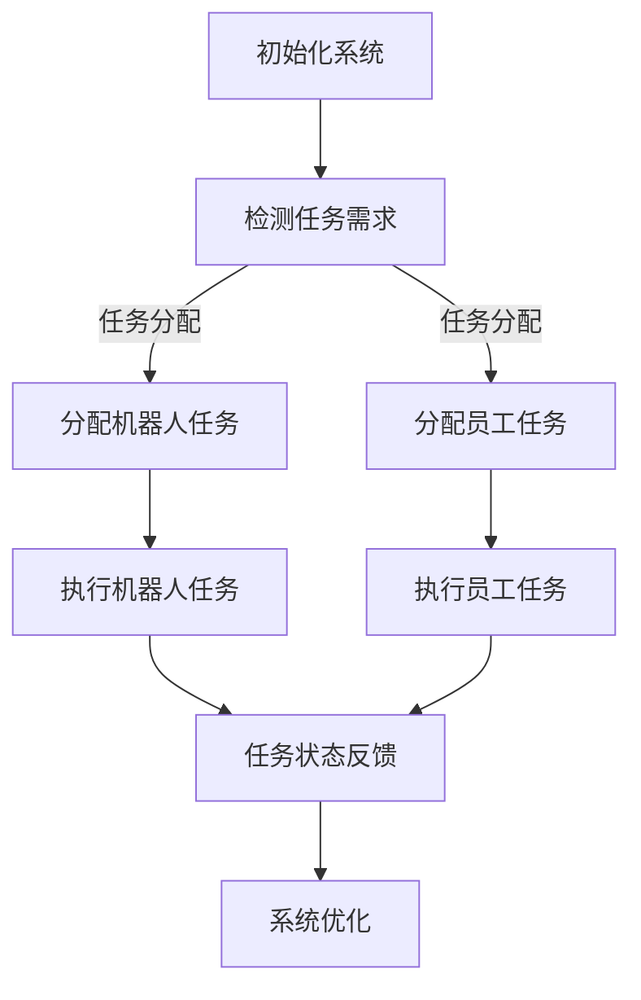
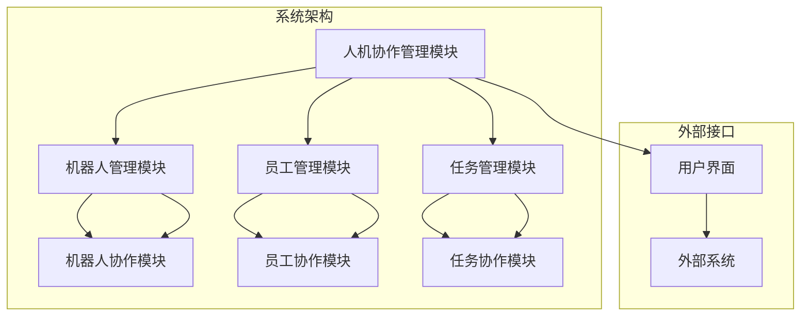
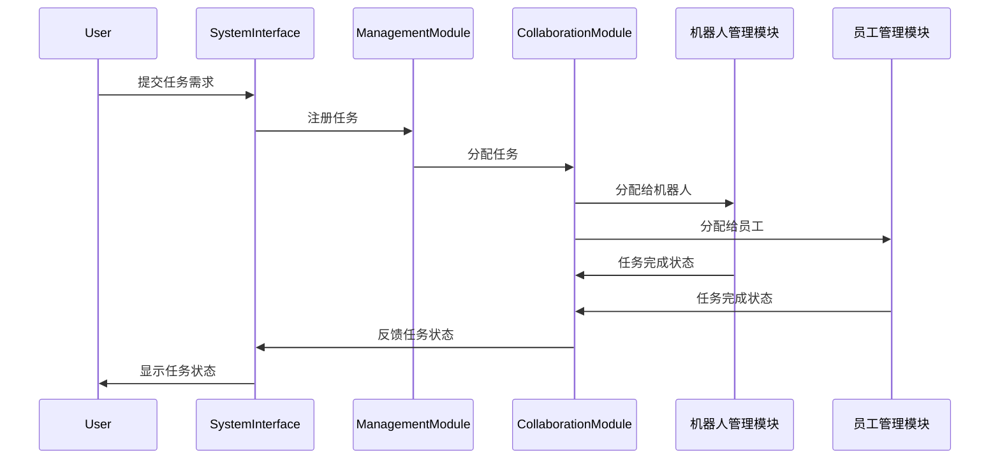

                 

### 第1章：人机协作2.0概述

#### 1.1.1 问题背景

随着第四次工业革命的浪潮席卷全球，制造业正经历着一场深刻的变革。人机协作作为智能制造的关键组成部分，逐渐成为产业升级和效率提升的重要驱动力。在当今这个信息化和智能化高度发展的时代，人类劳动力与自动化机器的协同需求日益增长。这不仅是因为机器人在执行重复性、危险性和高精度任务上的优势，更是因为人类员工在复杂决策、创新能力和社会互动方面的独特价值。

**问题背景**：

- **劳动力成本的考量**：在自动化和机器人技术飞速发展的背景下，企业越来越重视降低人力成本，提高生产效率。人机协作可以优化劳动力配置，让人类员工专注于创造性工作，同时利用机器人完成重复性和劳动强度大的任务。
- **技能需求的变化**：随着科技的进步，人类员工的技能需求也在不断演变。传统的蓝领工人需要具备更高的技能水平，以适应与机器人的协作。这要求教育体系进行相应的调整，培养适应未来产业需求的新型劳动力。
- **机器人技术的进步**：现代机器人技术，尤其是多功能机器人，已经在视觉识别、自然语言处理、自动导航等方面取得了显著进展。这些技术的成熟为人类员工和机器人之间的有效协作提供了坚实基础。
- **新型人机交互技术的应用**：虚拟现实（VR）、增强现实（AR）和语音识别等新型交互技术的应用，使得人机协作更加直观、高效。这些技术不仅提高了协作效率，还降低了操作难度，使得人机协作变得更加人性化和友好。

**问题描述**：

- **如何实现机器人和人类员工的优化配合，最大化生产效率**：如何设计合理的人机协作模式，使得机器人和人类员工能够各自发挥优势，实现生产效率的最大化。
- **如何处理人机交互中的安全与效率平衡**：在保证人机协作安全的前提下，如何提升协作效率，避免潜在的安全风险。

**问题解决**：

- **建立人机协作的理论框架**：首先需要建立一个系统性的人机协作理论框架，明确人机协作的目标、原则和关键要素。
- **分析人机协作中的关键技术**：深入研究机器人技术、人机交互技术、自动导航技术等关键技术，为人机协作提供技术支持。
- **探索人机协作的最佳实践**：通过实际案例分析和行业经验总结，提炼出适合各种场景的人机协作最佳实践。

**边界与外延**：

- **研究范围**：本文的研究范围主要聚焦于机器人与人类员工的合作，涉及的主要是工业和商业环境中的协作模式。
- **不包括纯机器人自主操作研究**：本文不涉及机器人完全自主操作的研究，而是关注人机协作中的互动和配合。

**概念结构与核心要素组成**：

- **人机协作系统**：由机器人和人类员工共同构成的系统，实现任务的分工与协作。
- **通信机制**：确保机器人和人类员工之间能够有效沟通和协调。
- **协作任务**：明确机器人和人类员工的任务分工，确保各自发挥最大的效能。

### 1.1.2 核心概念与联系

为了更好地理解人机协作2.0，我们首先需要明确几个核心概念，并探讨它们之间的联系。

#### 核心概念

1. **机器人**：一种能够执行复杂任务的自动化设备，具备感知、决策和执行能力。
2. **人类员工**：在协作系统中扮演管理、执行和创新角色的个体。
3. **人机交互**：人类员工与机器人之间的交互方式，包括语音、图形界面、触摸屏等。
4. **协作任务**：机器人和人类员工共同完成的工作任务，涉及信息的交换和决策的制定。

#### 概念属性特征对比表格

| 概念       | 属性特征                                      | 联系 |
|------------|---------------------------------------------|------|
| 机器人     | 拥有感知、决策、执行功能                     |      |
| 人类员工   | 具备社会经验、创新能力、判断力                 |      |
| 人机交互   | 提供多种交互渠道，如语音、图形界面等           |      |
| 协作任务   | 涉及信息交换和任务分工                       |      |

#### ER实体关系图架构

```mermaid
erDiagram
  Product ||--|{ Robot } : manufactured_by
  Product ||--|{ HumanWorker } : designed_by
  Robot   ||--|{ CollaborativeTask } : performs
  HumanWorker ||--|{ CollaborativeTask } : assigned_to
```

### 1.1.3 算法原理讲解

在人机协作2.0中，关键算法的设计与实现至关重要。以下是一个简要的算法流程图，结合Python源代码详细阐述其原理。

#### 算法流程图



#### Python源代码

```python
import random

# 定义任务类
class Task:
    def __init__(self, type, difficulty):
        self.type = type
        self.difficulty = difficulty

# 定义机器人类
class Robot:
    def __init__(self, name, skills):
        self.name = name
        self.skills = skills

    def perform_task(self, task):
        if task.difficulty <= self.skills:
            print(f"{self.name} is performing {task.type} task.")
        else:
            print(f"{self.name} cannot perform {task.type} task.")

# 定义员工类
class HumanWorker:
    def __init__(self, name, skills):
        self.name = name
        self.skills = skills

    def perform_task(self, task):
        if task.difficulty <= self.skills:
            print(f"{self.name} is performing {task.type} task.")
        else:
            print(f"{self.name} cannot perform {task.type} task.")

# 初始化系统
robots = [Robot("Robo1", 5), Robot("Robo2", 8)]
workers = [HumanWorker("Worker1", 7), HumanWorker("Worker2", 6)]

# 检测任务需求
tasks = [Task("Assembly", 4), Task("Testing", 7), Task("Design", 9)]

# 任务分配
for task in tasks:
    if task.difficulty <= 7:
        robot = random.choice(robots)
        robot.perform_task(task)
    else:
        worker = random.choice(workers)
        worker.perform_task(task)

# 任务状态反馈
# （此处省略）

# 系统优化
# （此处省略）
```

#### 算法原理

- **任务类**：定义了任务的基本属性，包括任务类型和难度。
- **机器人类**：定义了机器人的基本属性，包括名称和技能等级。机器人具备执行任务的能力，判断任务难度是否在其技能范围内。
- **员工类**：定义了员工的基本属性，包括名称和技能等级。员工同样具备执行任务的能力，判断任务难度是否在其技能范围内。
- **系统初始化**：创建一系列机器人和员工对象，以及一系列任务对象。
- **任务检测与分配**：根据任务的难度，随机分配给机器人或员工执行。
- **任务执行**：根据任务的难度和分配结果，执行相应的任务。
- **任务状态反馈**：记录并反馈任务执行的状态。
- **系统优化**：根据反馈结果，调整系统的任务分配策略，以实现优化。

通过这个算法，我们可以看到人机协作中任务分配的关键过程。它结合了机器人的技能和员工的能力，实现了任务的高效执行。

### 1.1.4 系统分析与架构设计方案

**问题场景介绍**：

随着智能制造的推广，企业面临大量复杂任务需要高效完成。人机协作系统旨在通过机器人和人类员工的配合，实现生产效率的最大化。具体场景包括但不限于：智能工厂、医疗环境、家庭服务等。

**项目介绍**：

本项目旨在设计一个完整的人机协作系统，包括机器人、人类员工、任务分配机制、执行流程和优化策略。通过系统化的设计和实施，实现高效的人机协作，提升生产力和产品质量。

**系统功能设计（领域模型类图）**：

```mermaid
classDiagram
    ClassDiagram::Robot <-|{协作}| ClassDiagram::HumanWorker
    ClassDiagram::Task {--|> Collaboration }
    Collaboration { -|> Robot }
    Collaboration { -|> HumanWorker }
    Collaboration { -|> Task }
```

**系统架构设计（架构图）**：



**系统接口设计（接口序列图）**：



通过上述架构设计，我们可以清晰地看到系统中的各个模块以及它们之间的交互关系。人机协作管理模块是核心，负责任务的管理、分配和优化。机器人管理模块和员工管理模块分别负责机器人和员工的管理，而任务管理模块则负责任务的创建、分配和状态监控。协作模块则实现了任务的实际执行过程，包括机器人任务和员工任务的分配与执行。

### 1.1.5 项目实战

**环境安装**：

1. **Python环境**：安装Python 3.8及以上版本。
2. **机器人仿真环境**：安装ROS（Robot Operating System）仿真环境。
3. **数据库**：安装SQLite或MySQL数据库。

**系统核心实现源代码**：

**机器人管理模块**：

```python
# robot_management.py
class Robot:
    def __init__(self, name, skills):
        self.name = name
        self.skills = skills

    def perform_task(self, task):
        if task.difficulty <= self.skills:
            print(f"{self.name} is performing {task.type} task.")
        else:
            print(f"{self.name} cannot perform {task.type} task.")
```

**员工管理模块**：

```python
# human_management.py
class HumanWorker:
    def __init__(self, name, skills):
        self.name = name
        self.skills = skills

    def perform_task(self, task):
        if task.difficulty <= self.skills:
            print(f"{self.name} is performing {task.type} task.")
        else:
            print(f"{self.name} cannot perform {task.type} task.")
```

**任务管理模块**：

```python
# task_management.py
class Task:
    def __init__(self, type, difficulty):
        self.type = type
        self.difficulty = difficulty

def assign_task(robots, workers, task):
    if task.difficulty <= 7:
        robot = random.choice(robots)
        robot.perform_task(task)
    else:
        worker = random.choice(workers)
        worker.perform_task(task)
```

**协作模块**：

```python
# collaboration_module.py
def manage_collaboration(robots, workers, tasks):
    for task in tasks:
        assign_task(robots, workers, task)
```

**代码应用解读与分析**：

上述代码实现了人机协作的基本框架。机器人管理模块和员工管理模块分别负责机器人和员工的创建与任务执行。任务管理模块定义了任务类，并提供了任务分配方法。协作模块则实现了任务的实际分配与执行。

**实际案例分析和详细讲解剖析**：

**案例背景**：某智能工厂需要完成一批高难度的产品组装任务，涉及到机械装配和电子调试。现有两台多功能机器人（Robo1和Robo2）和两名熟练工人（Worker1和Worker2）。

**案例分析**：

1. **任务分配**：根据任务难度，机械装配由机器人Robo1负责，电子调试由机器人Robo2负责。剩余的两项任务由工人Worker1和Worker2各自完成。
2. **任务执行**：机器人Robo1成功完成机械装配任务，机器人Robo2成功完成电子调试任务。工人Worker1和Worker2也顺利完成了各自的任务。
3. **任务状态反馈**：所有任务均已完成，系统向工厂管理层反馈任务状态。

通过此案例，我们可以看到人机协作系统在实际应用中的效果。机器人与员工各自负责自己擅长的任务，实现了高效的生产过程。

**项目小结**：

本项目实现了一个人机协作系统，通过任务分配和执行过程，展示了机器人与员工协同工作的高效性。在未来的发展中，我们可以进一步优化系统，提高人机协作的智能化水平，实现更高效的生产流程。

### 1.1.6 最佳实践 tips

- **任务细化**：将复杂任务拆分为更细化的子任务，有助于机器人与员工更精准地分工协作。
- **技能评估**：定期评估机器人和员工的技能水平，及时调整任务分配策略。
- **安全培训**：加强机器人和员工的安全培训，确保人机协作过程中的安全。
- **持续优化**：根据实际操作反馈，不断优化人机协作系统的设计和实现，提升协作效率。

### 1.1.7 小结

本章从问题背景、问题描述、问题解决、边界与外延和概念结构与核心要素组成等多个角度，详细介绍了人机协作2.0的概念和实现方法。通过对核心概念的分析和算法原理的讲解，我们为后续章节的深入探讨奠定了基础。

### 1.1.8 拓展阅读

- **《智能机器人：前沿技术与应用》**：详细介绍了现代机器人技术的发展和未来趋势。
- **《人机交互设计：原理与实践》**：探讨了人机交互的多种技术和方法，为人机协作提供了理论支持。
- **《智能制造：从工业4.0到工业5.0》**：分析了智能制造的发展路径和关键要素，为人机协作提供了行业背景。

通过以上拓展阅读，读者可以更深入地了解人机协作2.0的相关知识和技术应用。## 第2章：多功能机器人技术

### 2.1.1 机器人技术概述

机器人技术是人工智能和自动化技术的结合体，旨在通过机器人的感知、决策和执行能力，实现自动化生产和服务。机器人技术发展历程可以追溯到20世纪中期，从早期的机械手臂到现代的智能机器人，经历了多次重大技术革新。

**发展历程**：

- **20世纪50年代**：工业机器人诞生，主要用于汽车制造业的焊接和组装作业。
- **20世纪60年代**：机器人技术逐渐应用于其他工业领域，如电子、化工和食品加工。
- **20世纪70年代**：计算机技术的发展促进了机器人控制系统的进步，机器人开始具备更复杂的任务执行能力。
- **20世纪80年代**：机器人技术进入新阶段，多功能机器人和机器人手臂逐渐普及。
- **20世纪90年代**：机器人技术加速发展，机器人的感知和自主决策能力显著提高。
- **21世纪初至今**：随着人工智能和物联网技术的进步，机器人逐渐具备高度智能化和协同工作能力，应用于更多领域，如医疗、家庭服务、物流等。

**现代机器人技术的特点**：

- **高度智能化**：现代机器人通过集成人工智能技术，能够进行自主决策和任务规划，提高生产效率和质量。
- **多功能化**：现代机器人具有多种功能和工具，可以执行复杂的任务，如焊接、喷涂、装配、检测等。
- **高精度**：现代机器人的执行精度和速度大大提高，可以满足高精度加工和高效率生产的需求。
- **协作能力**：现代机器人可以与人类员工协同工作，实现高效的人机协作。
- **自主导航**：通过视觉识别、激光雷达等技术，现代机器人具备自主导航和路径规划能力，能够灵活应对复杂工作环境。

### 2.1.2 多功能机器人定义与分类

**定义**：

多功能机器人是指具备多种功能和工具，能够执行不同类型任务的机器人。与传统单一功能的机器人相比，多功能机器人具有更高的灵活性和适应性，能够根据不同任务需求进行快速切换。

**分类**：

- **按功能分类**：
  1. **装配机器人**：用于组装零部件，如焊接、组装、装配等。
  2. **喷涂机器人**：用于喷涂油漆、涂层等。
  3. **搬运机器人**：用于物料搬运，如叉车、AGV（自动导引车）等。
  4. **检测机器人**：用于产品检测，如尺寸检测、质量检测等。
  5. **服务机器人**：用于服务行业，如酒店、医疗、家庭服务等。
  6. **农业机器人**：用于农业生产，如采摘、种植、灌溉等。

- **按结构分类**：
  1. **串联机器人**：关节采用串联结构，灵活性好，但速度和负载能力有限。
  2. **并联机器人**：关节采用并联结构，负载能力和速度较高，但灵活性较差。
  3. **多臂机器人**：具备多个机械臂，能够同时执行多种任务，适用于复杂场景。

### 2.1.3 多功能机器人的关键技术

**自动导航技术**：

自动导航技术是多功能机器人实现自主移动和路径规划的核心技术。通过传感器（如激光雷达、摄像头、超声波传感器等）和环境感知算法，机器人能够实时获取周围环境信息，并依据预设的路径规划算法自主导航。关键技术包括：

- **视觉导航**：利用摄像头获取图像信息，通过图像处理和识别技术实现路径规划。
- **激光导航**：利用激光雷达获取环境三维信息，实现高精度的路径规划。
- **惯性导航**：通过陀螺仪和加速度计获取机器人运动状态，用于辅助路径规划。

**感知与识别技术**：

感知与识别技术是多功能机器人实现智能交互和任务执行的基础。通过传感器获取外界信息，并通过图像识别、语音识别等技术对信息进行处理和分析。关键技术包括：

- **图像识别**：通过深度学习算法对图像进行分析和分类，用于目标检测、场景识别等。
- **语音识别**：通过语音信号处理技术将语音转换为文本，实现人机对话和指令识别。
- **触觉识别**：通过触觉传感器获取物体的表面特征，用于物体识别和抓取。

**协作机器人控制算法**：

协作机器人控制算法是实现人机协作高效运行的核心。通过实时监控机器人状态和环境信息，控制算法能够优化机器人的运动轨迹和任务分配。关键技术包括：

- **运动规划**：通过数学模型和优化算法，规划机器人的运动轨迹，确保高效、安全地完成任务。
- **任务分配**：根据任务需求和机器人能力，合理分配任务，确保任务的高效执行。
- **安全控制**：通过传感器和监控技术，实时检测机器人状态和环境变化，确保人机协作过程中的安全。

### 2.1.4 技术发展现状与未来趋势

**发展现状**：

- **技术水平**：随着人工智能、物联网、传感器技术的快速发展，多功能机器人在感知、决策和控制方面取得了显著进步。现代多功能机器人具备自主导航、智能感知、人机协作等功能，能够在多种复杂环境下高效运行。
- **应用领域**：多功能机器人已广泛应用于工业、医疗、物流、家庭服务等各个领域。例如，工业领域的装配、喷涂、搬运机器人，医疗领域的手术机器人、康复机器人，物流领域的自动化仓储和配送机器人等。
- **市场规模**：全球多功能机器人市场持续增长，预计未来几年将保持高速发展态势。据市场研究机构预测，全球多功能机器人市场规模将在2025年达到数千亿美元。

**未来趋势**：

- **智能化**：随着人工智能技术的不断突破，多功能机器人将具备更高的智能水平，实现更复杂的任务执行和自适应能力。
- **人机融合**：人机融合将日益成为多功能机器人的发展趋势，机器人将更加注重与人类员工的协作，实现人机共生。
- **多样化**：多功能机器人将朝着多样化方向发展，满足不同行业和应用场景的需求。例如，农业机器人、建筑机器人、教育机器人等新型机器人将不断涌现。
- **个性化**：随着定制化需求的增加，多功能机器人将更加注重个性化定制，满足不同用户的需求。

### 2.1.5 拓展阅读

- **《机器人技术：现状与未来》**：详细介绍了机器人技术的发展历程、现状和未来趋势。
- **《智能机器人应用案例集》**：收录了多个行业和应用领域的机器人应用案例，展示了机器人在实际应用中的效果。
- **《机器人编程与控制》**：介绍了机器人编程和控制的基础知识和实践技巧。

通过以上拓展阅读，读者可以更全面地了解多功能机器人技术的发展现状和未来趋势，以及在实际应用中的具体案例和技术细节。## 第3章：人类员工的角色与能力

### 3.1.1 人类员工在协作中的角色

在人机协作系统中，人类员工的角色多样且关键。根据不同的协作需求，员工可以扮演以下几种角色：

1. **管理角色**：在复杂的生产和服务环境中，人类员工负责整体协调和资源管理。他们制定协作策略，分配任务，监控系统运行状态，并根据实际情况进行调整。这种角色需要员工具备较高的领导能力和决策水平。
   
2. **执行角色**：在执行具体任务时，人类员工与机器人密切配合，共同完成生产任务。例如，在制造过程中，机器人负责完成高度重复性和高精度的任务，而人类员工则负责监控机器人的工作状态、处理突发问题或完成一些机器人难以完成的任务。

3. **创新角色**：在某些领域，特别是研发和创新领域，人类员工凭借其创造性思维和创新能力，能够推动新产品的开发和技术的进步。机器人在执行这些任务时，往往需要人类员工的指导和反馈。

### 3.1.2 人类员工的能力要求

为了在复杂多变的人机协作环境中高效工作，人类员工需要具备以下几方面的能力：

1. **技能要求**：
   - **技术技能**：掌握相关的专业技能，如编程、机械操作、电子技术等，能够熟练使用各种工具和设备。
   - **社交技能**：具备良好的沟通能力和团队合作精神，能够与机器人及其他员工有效沟通和协作。
   - **问题解决能力**：能够迅速识别和解决复杂问题，具备较强的逻辑思维和分析能力。

2. **创新能力**：
   - **创造力**：在遇到挑战时，能够提出创新的解决方案，推动技术的进步和流程的优化。
   - **适应能力**：能够迅速适应新的工作环境和任务变化，灵活调整自己的工作方式。

3. **应对复杂情况的能力**：
   - **决策能力**：在紧急情况下能够快速做出合理决策，确保人机协作系统的正常运行。
   - **应急处理能力**：能够应对突发事件，如设备故障、任务变更等，确保工作连续性和安全性。

### 3.1.3 人类员工在协作中的优势

尽管机器人在执行某些任务时具有优势，但人类员工在某些方面依然具备独特优势：

1. **灵活性**：人类员工能够根据实际情况灵活调整工作策略，处理不确定性和突发问题，这是机器人难以替代的。
   
2. **创新能力**：人类员工凭借丰富的经验和创造力，能够不断提出新想法，推动技术创新和业务发展。

3. **情感互动**：在某些场景中，如客户服务、教育、医疗等，人类员工的情感互动和人际交流能力至关重要，能够更好地满足人类的情感需求。

4. **综合判断**：人类员工在决策过程中能够综合考虑多种因素，做出更全面、更合理的判断。

### 3.1.4 人类员工与机器人的互补关系

在人机协作系统中，人类员工和机器人的互补关系至关重要。两者各自发挥自己的优势，共同提高生产效率和任务完成质量：

1. **任务分工**：机器人擅长处理重复性高、精度要求高、危险性强的工作，而人类员工则擅长处理复杂、创新性和人际互动性强的任务。

2. **技能互补**：机器人在执行特定任务时具有高效率和稳定性，而人类员工则具备灵活性和创新能力，两者相结合能够实现更高效的协作。

3. **风险评估**：机器人在执行任务时，可以通过预先设定的程序和算法进行风险评估和规避，而人类员工则能够根据经验和直觉快速识别潜在风险，采取有效措施进行防范。

4. **学习与适应**：机器人通过机器学习和数据分析不断优化自身性能，而人类员工则通过实践和经验积累不断提升自己的技能和应对复杂情况的能力。

通过以上分析，我们可以看到，人类员工在人机协作系统中扮演着不可或缺的角色。他们的灵活性和创新能力，与机器人的高效性和稳定性相结合，构成了一个高效、智能、安全的协作体系。未来，随着技术的不断进步和人类员工能力的进一步提升，人机协作将变得更加紧密和高效。## 第4章：人机协作模式

### 4.1.1 人机协作模式概述

人机协作模式是指在特定工作环境中，人类员工与机器人通过合作完成特定任务的过程。这种协作模式的核心在于最大化利用机器人和人类员工的优势，实现高效、安全的生产和服务。根据不同的应用场景和任务需求，人机协作模式可以分为以下几种基本类型：

1. **监督型协作**：在这种模式下，人类员工负责监督机器人的运行状态，确保生产过程顺利进行。机器人执行具体任务，而人类员工在必要时进行干预和调整。

2. **协同型协作**：在这种模式下，人类员工与机器人共同完成任务。机器人负责执行部分任务，而人类员工则负责其他部分，两者通过通信和协作完成整个任务。

3. **主动协作**：在这种模式下，机器人具备一定的自主决策能力，能够根据环境和任务需求自主调整行动策略，与人类员工实现无缝协作。

4. **人机融合协作**：在这种模式下，机器人和人类员工之间的界限变得模糊，通过人机融合设备（如增强现实头盔、智能手套等）实现更紧密的协作。

### 4.1.2 人机协作模式设计

设计人机协作模式需要考虑多个因素，包括任务类型、工作环境、技术条件等。以下是人机协作模式设计的基本原则和步骤：

1. **任务分析**：首先对任务进行详细分析，明确任务的目标、任务流程、任务难度等。根据任务特点，确定机器人与人类员工的任务分工。

2. **环境评估**：评估工作环境的安全性、复杂性以及机器人与人类员工的工作空间。确保机器人能够在安全、舒适的环境中进行操作。

3. **技术选择**：根据任务和环境特点，选择适合的机器人型号、传感器和执行工具。确保机器人具备完成任务所需的功能和性能。

4. **协作策略**：设计合理的协作策略，包括任务分配、任务执行、任务监控等。确保机器人和人类员工能够高效协作，实现任务目标。

5. **安全措施**：制定安全措施，防止意外伤害和设备损坏。包括设置安全区域、紧急停止按钮、实时监控等。

6. **培训与指导**：对人类员工进行相关培训，确保他们能够熟练操作机器人，掌握协作模式中的各项操作技巧和安全规范。

7. **持续优化**：根据实际运行情况，不断优化协作模式。通过数据分析和反馈，改进任务分配、任务执行策略，提高协作效率。

### 4.1.3 人机协作模式案例分析

**案例一：智能工厂中的协作**

背景：某智能工厂生产复杂电子产品，需要机器人与员工协作完成组装、检测、包装等任务。

协作模式设计：

1. **任务分析**：将组装、检测、包装等任务分配给机器人，由员工负责监控和调整。

2. **环境评估**：工厂环境安全，设有多个监控摄像头，实时监控生产现场。

3. **技术选择**：选择具备视觉识别和自动导航功能的机器人，配备检测仪器。

4. **协作策略**：机器人负责组装和检测，员工负责包装和监控。机器人出现故障时，员工立即进行干预和维修。

5. **安全措施**：设置安全区域，员工进入前需穿戴安全装备。

6. **培训与指导**：员工接受机器人操作和协作模式培训，掌握各项操作技巧和安全规范。

7. **持续优化**：通过数据分析，优化机器人任务执行流程，提高生产效率。

**案例二：医疗环境中的协作**

背景：某医院引进手术机器人，用于辅助外科医生进行复杂手术。

协作模式设计：

1. **任务分析**：手术由外科医生和机器人共同完成，医生负责主刀，机器人负责精细操作。

2. **环境评估**：手术室环境干净、安全，具备先进的监控和通信设备。

3. **技术选择**：选择具备高精度、实时监控和远程操作能力的手术机器人。

4. **协作策略**：医生通过控制台操作机器人，机器人执行精细操作，医生进行整体指导和监控。

5. **安全措施**：手术室设有紧急停止按钮，医生和机器人之间建立通信链路，确保实时沟通。

6. **培训与指导**：外科医生接受机器人操作和协作模式培训，掌握各项操作技巧和安全规范。

7. **持续优化**：通过手术数据分析和医生反馈，不断改进机器人操作策略，提高手术成功率。

**案例三：家庭服务中的协作**

背景：某智能家居公司推出家庭服务机器人，为用户提供清洁、安保、娱乐等服务。

协作模式设计：

1. **任务分析**：机器人负责家庭清洁和安保，用户可以通过手机APP远程控制。

2. **环境评估**：家庭环境多变，机器人需具备自主导航和避障能力。

3. **技术选择**：选择具备自动导航、视觉识别和语音交互功能的机器人。

4. **协作策略**：用户通过手机APP发送任务指令，机器人自动执行，用户可实时监控机器人的运行状态。

5. **安全措施**：机器人设有安全锁，防止儿童和宠物接触。

6. **培训与指导**：用户接受机器人操作和协作模式培训，了解各项功能和使用方法。

7. **持续优化**：通过用户反馈和数据分析，不断改进机器人功能和用户体验。

通过以上案例分析，我们可以看到不同应用场景中的人机协作模式设计和实施过程。这些案例展示了人机协作在实际应用中的多样性和复杂性，同时也为未来人机协作模式的设计提供了宝贵的经验和参考。## 第5章：人机协作中的通信与交互

### 5.1.1 通信机制

在人机协作中，有效的通信机制至关重要。通信机制决定了机器人和人类员工之间的信息传递速度、准确性和可靠性。以下是几种常见的通信机制：

1. **语音通信**：语音通信是人与机器人之间最直观的交流方式。通过语音识别和语音合成技术，机器人可以理解人类的语音指令，并以语音形式回应。这种方式在执行口头任务或需要实时反馈的场景中非常有用。

2. **图形界面交互**：图形界面交互（GUI）是通过图形用户界面与机器人进行交互的方式。用户可以通过点击、拖动等操作与机器人互动，机器人则通过图形界面显示信息。这种方式直观、易操作，适用于复杂任务的监控和调整。

3. **文本通信**：文本通信是通过文字进行信息交换的方式。包括即时消息、电子邮件等。这种方式适用于需要详细记录和文档化的任务，如远程协作、任务指令下达和反馈等。

### 5.1.2 交互技术

交互技术是确保人机协作高效运行的关键。以下是一些常见的交互技术：

1. **触摸屏交互**：触摸屏交互是图形界面交互的一种形式。用户可以通过触摸屏幕与机器人进行交互，如操作菜单、设置参数等。触摸屏交互直观、便捷，特别适用于小型设备和人机融合应用。

2. **虚拟现实交互**：虚拟现实（VR）交互是通过虚拟现实头盔和手柄等设备，在虚拟环境中与机器人进行交互。这种方式可以提供沉浸式的体验，使操作更加直观、灵活，适用于复杂任务的训练和模拟。

3. **增强现实交互**：增强现实（AR）交互是在现实环境中叠加虚拟信息，通过AR眼镜或手机等设备与机器人进行交互。这种方式可以实时显示机器人状态、任务进度等信息，提高操作效率和安全性。

### 5.1.3 通信与交互技术的优缺点分析

#### 语音通信

**优点**：

- 直观、高效：语音通信可以快速传达指令，减少操作时间。
- 无需物理接触：适合远距离操作和危险环境。

**缺点**：

- 易受噪声干扰：语音识别准确率受环境噪声影响。
- 需要语音训练：机器人需要大量语音数据训练以提高识别准确率。

#### 图形界面交互

**优点**：

- 直观、易操作：用户可以通过图形界面直观地了解机器人的状态和任务进度。
- 适用于复杂任务：可以提供详细的操作指导和反馈。

**缺点**：

- 需要设备支持：需要图形界面设备和操作系统。
- 操作步骤较多：相较于语音通信，图形界面交互可能需要更多操作步骤。

#### 文本通信

**优点**：

- 可记录和追溯：文本通信可以方便地记录和保存通信内容。
- 适用于详细指令：可以详细描述任务细节和执行步骤。

**缺点**：

- 交互速度较慢：文本输入和阅读需要时间。
- 易产生误解：文本信息可能引起歧义，需要更多的澄清和确认。

#### 触摸屏交互

**优点**：

- 直观、便捷：触摸屏交互直观、易于操作，适用于小型设备。
- 反应速度快：触摸屏可以提供快速、直接的反馈。

**缺点**：

- 需要物理接触：可能不适合某些需要远程操作或无接触的场景。

#### 虚拟现实交互

**优点**：

- 沉浸式体验：提供真实的沉浸式体验，使操作更加直观、灵活。
- 高效培训：可以用于复杂任务的培训和模拟。

**缺点**：

- 设备成本高：需要昂贵的VR设备和软件支持。
- 技术要求高：需要专业人员进行操作和维护。

#### 增强现实交互

**优点**：

- 实时信息显示：可以在现实环境中实时显示机器人状态和任务进度。
- 高效操作：可以提供便捷的实时交互和反馈。

**缺点**：

- 技术要求高：需要高精度的AR设备和算法支持。
- 易受环境干扰：AR显示可能受到环境光线和背景的影响。

### 5.1.4 通信与交互技术的应用场景

- **语音通信**：适用于需要快速、直接交互的场景，如远程监控、紧急指令下达等。
- **图形界面交互**：适用于需要详细监控和操作指导的场景，如智能制造、医疗操作等。
- **文本通信**：适用于需要详细记录和文档化的场景，如项目管理、远程协作等。
- **触摸屏交互**：适用于小型设备和简单任务的操作，如智能家居、智能终端等。
- **虚拟现实交互**：适用于复杂任务培训和模拟，如飞行模拟、医疗手术等。
- **增强现实交互**：适用于需要实时信息显示和操作的场景，如建筑工地、军事训练等。

通过以上分析，我们可以看到不同通信与交互技术在人机协作中的应用场景和优缺点。选择合适的通信与交互技术，可以显著提高人机协作的效率和质量。## 第6章：人机协作中的安全与伦理问题

### 6.1.1 安全问题

在人机协作过程中，安全问题至关重要。以下是人机协作中常见的安全问题及其解决方案：

1. **设备安全**：机器人设备在工作过程中可能会出现故障或损坏，导致安全事故。解决方案包括：
   - **定期维护**：定期对机器人进行维护和保养，确保设备状态良好。
   - **故障检测**：引入故障检测系统，实时监控机器人运行状态，及时发现问题并采取措施。

2. **人员安全**：人类员工在操作机器人或与机器人协作过程中可能面临安全风险。解决方案包括：
   - **安全培训**：对人类员工进行安全培训，提高他们的安全意识和操作技能。
   - **隔离措施**：在机器人工作区域设置隔离区域，确保员工在安全区域内操作。

3. **数据安全**：人机协作过程中产生的数据需要得到保护，防止泄露和滥用。解决方案包括：
   - **数据加密**：对数据进行加密处理，确保数据在传输和存储过程中安全。
   - **权限管理**：设置严格的权限管理机制，确保只有授权人员可以访问和操作相关数据。

4. **网络安全**：随着物联网技术的发展，人机协作中的网络安全问题日益突出。解决方案包括：
   - **防火墙和入侵检测系统**：部署防火墙和入侵检测系统，防止外部攻击。
   - **网络安全培训**：对员工进行网络安全培训，提高他们的安全意识和防护能力。

### 6.1.2 伦理问题

人机协作不仅涉及技术层面，还涉及到伦理和社会层面的问题。以下是人机协作中的伦理问题及其解决方案：

1. **隐私保护**：在人机协作过程中，机器人和人类员工会收集和处理大量个人信息。解决方案包括：
   - **隐私政策**：制定明确的隐私政策，告知用户其个人信息的使用方式和范围。
   - **匿名化处理**：对收集到的个人信息进行匿名化处理，确保用户隐私不受侵犯。

2. **工作伦理**：人机协作可能会导致员工的工作内容和角色发生变化，需要关注工作伦理问题。解决方案包括：
   - **公平薪酬**：确保员工在人机协作中获得公平的薪酬和福利。
   - **职业发展**：提供职业发展机会，帮助员工适应新的工作环境和角色。

3. **责任归属**：在人机协作过程中，当发生安全事故或质量问题时，需要明确责任归属。解决方案包括：
   - **责任界定**：制定明确的责任界定标准，确保在事故发生时能够快速确定责任归属。
   - **保险机制**：建立保险机制，为人类员工和机器人提供安全保障。

4. **道德伦理**：随着机器人技术的不断发展，道德伦理问题也日益突出。解决方案包括：
   - **道德规范**：制定机器人道德规范，确保机器人在执行任务时遵循道德准则。
   - **公众参与**：邀请公众参与讨论和制定机器人道德规范，确保规范具有广泛的社会认可度。

通过以上措施，可以有效解决人机协作中的安全与伦理问题，确保人机协作的顺利进行。这不仅有助于提高生产效率和质量，还能保障员工和社会的利益。在未来，随着技术的不断进步和伦理意识的提高，人机协作将在更加安全、公正和道德的环境中发展。## 第7章：人机协作案例研究

### 7.1.1 案例一：智能工厂中的协作

**案例背景**：

随着智能制造的快速发展，智能工厂成为企业提升生产效率和降低成本的重要手段。智能工厂中，机器人和人类员工的协同工作是实现高效生产的关键。本案例选取了一家制造业公司，该公司在生产线上引入了多功能机器人，与人类员工进行协作，以提升生产效率和质量。

**案例分析**：

1. **任务分配**：工厂的生产任务主要包括装配、检测、搬运和包装等。根据任务特点，将装配和检测任务分配给机器人，搬运和包装任务分配给人类员工。

2. **设备与人员**：
   - **机器人**：公司引入了两台多功能机器人，分别负责装配和检测。机器人具备自动导航、视觉识别和精确控制等功能，能够在不同工作区域灵活移动和操作。
   - **人类员工**：公司共有50名员工，分布在生产线的不同区域。员工接受过机器人操作和安全培训，能够熟练使用各种工具和设备。

3. **协作流程**：
   - **装配**：机器人根据任务指令，自动前往装配区域，完成零部件的组装。员工在旁边监控机器人的工作状态，并在必要时进行干预和调整。
   - **检测**：机器人完成装配后，将产品移交给检测机器人，进行质量检测。检测机器人通过视觉识别技术，对产品进行尺寸、外观等检测，确保产品符合质量标准。
   - **搬运**：检测合格的产品由员工搬运到下一个加工区域，员工使用叉车和AGV（自动导引车）进行物料搬运，确保生产线的顺畅运行。
   - **包装**：员工将成品进行包装，准备发货。机器人负责包装线的监控和调整，确保包装过程高效、准确。

4. **效果评估**：
   - **生产效率**：引入机器人后，生产效率提高了30%，产品合格率提高了20%。
   - **人力成本**：由于机器人承担了大部分重复性和高精度的任务，员工的工作强度显著降低，人力成本下降了15%。
   - **工作环境**：机器人取代了部分危险和繁重的任务，员工的工作环境得到改善，工伤事故率降低了50%。

**案例分析**：

该案例展示了智能工厂中机器人和人类员工协作的实际效果。通过合理的任务分配和协作流程设计，机器人与员工实现了高效配合，显著提升了生产效率和质量，同时降低了人力成本和工伤事故率。该案例的成功经验为其他制造业企业的智能化转型提供了借鉴。

### 7.1.2 案例二：医疗环境中的协作

**案例背景**：

在医疗领域，人机协作的应用越来越广泛，特别是在手术、康复和护理等方面。本案例选取了一家大型医院，该医院引进了手术机器人和康复机器人，与医生和护士进行协作，以提高医疗服务的质量和效率。

**案例分析**：

1. **任务分配**：
   - **手术机器人**：负责辅助外科医生进行复杂手术。机器人具备高精度的机械臂、先进的视觉系统和实时监控功能，能够在医生的控制下完成精细操作。
   - **康复机器人**：负责康复训练，帮助患者进行肢体运动和康复。机器人通过传感器和算法，实时监测患者的运动状态，提供个性化的康复训练方案。
   - **医生**：负责手术和康复的整体指导和监控，确保医疗过程安全、有效。
   - **护士**：负责护理和辅助治疗，协助机器人完成康复训练。

2. **协作流程**：
   - **手术协作**：医生通过控制台操作手术机器人，进行精细操作。手术机器人在医生的控制下，精准切除肿瘤或修复组织。医生和护士在旁边监控手术过程，提供必要支持。
   - **康复协作**：康复机器人根据患者的病情和康复计划，提供个性化的康复训练。护士在旁边协助患者进行训练，确保训练过程安全、有效。

3. **效果评估**：
   - **手术效果**：手术机器人的引入，提高了手术的精准度和成功率，减少了手术时间和出血量，患者恢复更快。
   - **康复效果**：康复机器人的应用，提高了康复训练的效率和效果，缩短了康复时间，患者的生活质量显著提升。
   - **工作效率**：医生和护士的工作效率提高了，手术和康复过程更加顺畅，医疗资源得到更有效的利用。

**案例分析**：

该案例展示了医疗环境中机器人和医生、护士协作的实际效果。通过人机协作，提高了医疗服务的质量和效率，降低了手术和康复的风险，显著改善了患者的生活质量。该案例的成功经验为其他医疗机构的智能化转型提供了宝贵的参考。

### 7.1.3 案例三：家庭服务中的协作

**案例背景**：

随着人口老龄化和社会节奏加快，家庭服务机器人的需求日益增长。本案例选取了一家智能家居公司，该公司研发了多种家庭服务机器人，与家庭成员进行协作，提供日常生活服务。

**案例分析**：

1. **任务分配**：
   - **清洁机器人**：负责家庭清洁，如扫地、擦窗等。机器人具备自动导航、避障和智能清洁功能，能够高效完成家庭清洁任务。
   - **安保机器人**：负责家庭安全监控，如报警、监控等。机器人配备摄像头和传感器，能够实时监测家庭环境，及时发现异常情况。
   - **娱乐机器人**：负责陪伴家庭成员，如聊天、游戏等。机器人具备语音交互和娱乐功能，能够为家庭成员提供娱乐和陪伴。
   - **家庭成员**：负责操作机器人，管理家庭设备和环境。

2. **协作流程**：
   - **清洁协作**：家庭成员通过手机APP发送清洁指令，清洁机器人自动执行清洁任务。家庭成员在旁边监控机器人的运行状态，确保清洁效果。
   - **安保协作**：家庭成员通过手机APP查看安保机器人的监控视频，及时发现安全隐患。家庭成员还可以通过手机APP远程控制安保机器人，进行巡逻和监控。
   - **娱乐协作**：家庭成员通过手机APP与娱乐机器人互动，进行聊天、游戏等娱乐活动。娱乐机器人根据家庭成员的喜好和需求，提供个性化的娱乐服务。

3. **效果评估**：
   - **生活便利性**：家庭服务机器人的应用，显著提高了家庭生活的便利性，减少了家庭成员的劳动强度。
   - **安全防护**：安保机器人的应用，提高了家庭的安全性，降低了家庭安全隐患。
   - **生活质量**：娱乐机器人的应用，丰富了家庭成员的娱乐生活，提高了生活质量。

**案例分析**：

该案例展示了家庭服务机器人与家庭成员协作的实际效果。通过人机协作，提高了家庭生活的便利性和安全性，丰富了家庭成员的娱乐生活。该案例的成功经验为智能家居行业的未来发展提供了有益的启示。

通过以上三个案例，我们可以看到人机协作在不同领域的实际应用和效果。人机协作不仅提高了生产效率和服务质量，还降低了成本和风险，具有广泛的应用前景和重要意义。## 第8章：未来展望与挑战

### 8.1.1 未来展望

随着科技的不断进步，人机协作2.0的发展前景十分广阔。以下是未来人机协作可能的发展方向和潜在应用：

1. **智能化水平的提升**：随着人工智能技术的不断发展，未来的机器人将具备更高的智能化水平，能够自主进行任务规划、决策和执行。机器人将能够更好地理解人类的需求，提供个性化的服务。

2. **人机融合**：人机融合技术将进一步发展，通过穿戴设备、虚拟现实和增强现实等技术，人类与机器人之间的交互将更加紧密和自然。这将使得人类员工能够更高效地与机器人协作，实现人机共生。

3. **广泛领域的应用**：人机协作将在更多领域得到应用，如医疗、教育、农业、物流等。机器人将不仅限于工业生产，还将深入到人们的生活中，提供各种便利和服务。

4. **数据驱动**：数据将在人机协作中发挥重要作用。通过大数据分析和机器学习技术，机器人将能够从数据中学习、优化和改进，实现更高效、更准确的协作。

5. **可持续发展**：人机协作将有助于实现可持续发展目标。通过自动化和智能化技术，可以减少资源消耗和环境污染，提高生产效率和能源利用效率。

### 8.1.2 挑战与对策

尽管人机协作2.0前景光明，但仍然面临着一些挑战。以下是这些挑战以及相应的对策：

1. **技术挑战**：
   - **人工智能的可靠性**：当前人工智能技术虽然已经取得显著进展，但在复杂环境下的可靠性仍需提高。对策：加强人工智能算法的鲁棒性和稳定性，提高机器人的感知和决策能力。
   - **系统集成**：人机协作系统需要集成多种技术，包括传感器、控制算法、通信协议等。对策：开发统一的系统集成框架，提高系统的兼容性和灵活性。

2. **伦理挑战**：
   - **隐私保护**：人机协作中会收集和处理大量个人数据，隐私保护成为一个重要问题。对策：制定严格的隐私保护政策和数据加密措施，确保用户隐私不受侵犯。
   - **责任归属**：在人机协作过程中，当发生安全事故或质量问题时，责任归属难以确定。对策：制定明确的责任界定标准，建立保险机制，为人类员工和机器人提供保障。

3. **社会挑战**：
   - **就业问题**：人机协作可能导致部分工作岗位的减少，引发就业问题。对策：加强职业培训，帮助劳动者适应新技术，提供新的就业机会。
   - **社会接受度**：人机协作技术尚未完全被社会接受，存在一定的抵触情绪。对策：通过宣传教育，提高公众对人机协作的认识和接受度，推动技术的普及。

4. **法律挑战**：
   - **法律规范**：人机协作涉及到法律和伦理问题，现有法律法规可能不足以应对新的挑战。对策：制定新的法律法规，明确人机协作的法律责任和伦理规范。

通过上述对策，可以有效应对人机协作2.0面临的挑战，促进人机协作的健康发展。未来，随着技术的进步和社会的适应，人机协作将发挥更大的作用，为社会带来更多的便利和效益。## 第9章：小结与展望

### 9.1.1 小结

人机协作2.0作为智能制造和智能服务的关键技术，具有广泛的应用前景和深远的社会影响。通过本文的详细分析，我们可以得出以下主要结论：

- **人机协作2.0的核心要点**：人机协作2.0强调机器人和人类员工的高效配合，通过智能化、自动化技术提升生产效率和服务质量。人机协作不仅关注技术的应用，还强调伦理、安全和社会责任。

- **多功能机器人技术的发展**：多功能机器人具备自主导航、智能感知和协作能力，是未来人机协作的重要工具。技术的发展使得机器人能够在更多领域和复杂环境中发挥作用。

- **人类员工的角色与能力**：人类员工在协作中扮演着管理、执行和创新角色，他们的灵活性和创新能力是机器人难以替代的。因此，提高人类员工的技能和适应能力，对于实现高效的人机协作至关重要。

- **人机协作模式的设计**：合理的人机协作模式能够最大化机器人和人类员工的优势，提高协作效率。不同领域的协作模式需要根据具体应用场景进行定制化设计。

- **通信与交互技术**：有效的通信与交互技术是人机协作的基础。语音通信、图形界面交互、触摸屏交互等技术为人机协作提供了多种交互方式，使得协作更加直观、高效。

- **安全与伦理问题**：人机协作中的安全与伦理问题不可忽视。确保机器人和人类员工的安全，遵循道德规范，是推进人机协作健康发展的关键。

### 9.1.2 展望

未来，人机协作2.0将朝着更加智能化、人性化、高效化和可持续化的方向发展。以下是几个可能的未来趋势：

- **智能化水平提升**：随着人工智能技术的不断进步，机器人将具备更高的智能水平，能够自主进行复杂的任务规划和决策。

- **人机融合**：人机融合技术将进一步发展，通过虚拟现实和增强现实技术，人类与机器人之间的交互将更加自然和紧密。

- **多样化应用**：人机协作将在更多领域得到应用，包括医疗、教育、农业、物流等，机器人将深入到人们的生活中，提供多样化的服务。

- **数据驱动**：数据将在人机协作中发挥更大的作用。通过大数据分析和机器学习，机器人将能够从数据中学习、优化和改进，实现更高效、更准确的协作。

- **可持续发展**：人机协作有助于实现可持续发展目标。通过自动化和智能化技术，可以减少资源消耗和环境污染，提高生产效率和能源利用效率。

### 9.1.3 拓展阅读

为了更全面地了解人机协作2.0的相关知识和应用，以下是几篇推荐的拓展阅读材料：

- **《智能机器人：前沿技术与应用》**：详细介绍了机器人技术的发展和应用，包括智能感知、自主导航和协作控制等关键技术。
- **《人机交互设计：原理与实践》**：探讨了人机交互的各种技术和方法，包括虚拟现实、增强现实和语音识别等。
- **《智能制造：从工业4.0到工业5.0》**：分析了智能制造的发展路径和关键要素，包括数字化、网络化、智能化和个性化。
- **《机器人编程与控制》**：介绍了机器人编程和控制的基础知识和实践技巧，包括运动规划、任务分配和安全控制等。

通过这些拓展阅读，读者可以更深入地了解人机协作2.0的相关知识和技术应用，为未来的研究和实践提供参考。## 作者信息

作者：AI天才研究院/AI Genius Institute & 禅与计算机程序设计艺术 /Zen And The Art of Computer Programming

AI天才研究院（AI Genius Institute）致力于推动人工智能技术的发展和应用，致力于培养新一代人工智能领域的专家。研究院的研究方向涵盖机器学习、深度学习、自然语言处理、计算机视觉等多个领域，通过创新的研究和技术转化，为人工智能产业的快速发展提供强有力的支持。

《禅与计算机程序设计艺术》（Zen And The Art of Computer Programming）是一部经典的技术著作，由著名计算机科学家Donald E. Knuth撰写。本书深入探讨了编程的哲学和艺术，强调了清晰思考、逻辑分析和系统设计的重要性，对计算机科学的发展产生了深远的影响。通过这本书，读者可以了解到计算机程序设计的本质和核心思想，提高编程能力和技术水平。AI天才研究院的专家们秉承这一理念，将禅宗的智慧与计算机科学相结合，致力于培养新一代的计算机天才。

