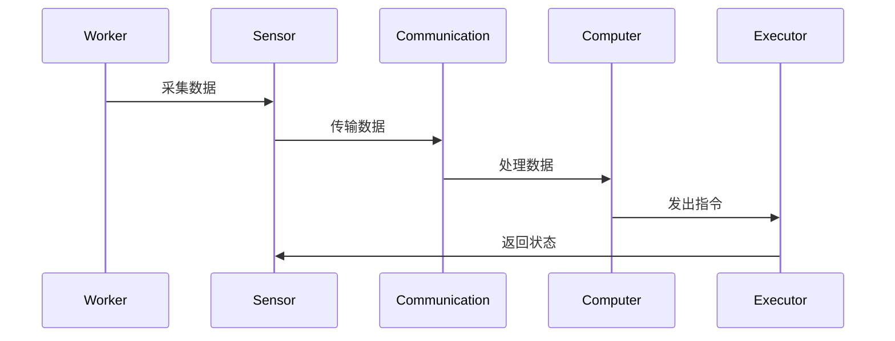

                 


## 《人机协作在危险环境作业中的应用》

### 关键词

- 人机协作
- 危险环境作业
- 算法实现
- 系统架构
- 最佳实践

### 摘要

随着科技的进步，人机协作在危险环境作业中的应用逐渐成为研究和应用的热点。本文从人机协作的核心概念出发，详细阐述了其在危险环境作业中的应用原理、算法实现、系统架构设计和项目实战，并提供了实用的最佳实践建议。通过本文的阅读，读者将深入了解人机协作在危险环境作业中的实际应用价值。

### 引言

在现代社会，危险环境作业如矿井开采、核能处理、深海探测等领域的需求日益增长。然而，这些环境往往存在高辐射、高温度、高压等危险因素，对工作人员的生命安全构成了严重威胁。传统的人工操作方式难以满足这些环境的安全和高效要求。因此，人机协作技术应运而生，它通过将人类的智慧和机器的计算能力相结合，为危险环境作业提供了全新的解决方案。

### 第一部分：背景与核心概念

#### 第1章：危险环境作业问题背景

**1.1 问题背景**

危险环境作业通常指的是在极端条件下进行的作业活动，这些环境可能包含有害物质、高风险操作以及恶劣的自然条件。例如，矿井开采过程中可能存在的瓦斯爆炸、坍塌等风险，核能处理中的放射性物质泄漏、高温高压等危险。

**1.2 问题描述**

危险环境作业的主要挑战在于如何保障工作人员的安全、提高作业效率并减少环境影响。传统的人工操作方式在应对这些挑战时显得力不从心，常常导致事故发生。

**1.3 解决方法**

为了解决这些问题，人机协作技术被提上了日程。通过将人类的决策能力和机器的计算、执行能力相结合，可以在危险环境中实现远程控制、自动化操作，从而提高安全性、降低事故发生率。

**1.4 边界与外延**

人机协作在危险环境作业中的应用不仅限于特定领域，还可以扩展到其他高风险行业，如航空航天、深海勘探等。

#### 第2章：人机协作核心概念

**2.1 人机协作定义**

人机协作是指人与计算机系统之间通过信息交换、共享资源和协同工作，共同完成任务的过程。

**2.2 人机协作特点**

- 高效性：通过机器的计算能力和自动化操作，可以显著提高工作效率。
- 安全性：减少人类直接参与危险操作，降低事故风险。
- 灵活性：可以根据环境变化和任务需求动态调整协作方式。

**2.3 人机协作与传统作业对比**

| 对比项         | 人机协作                 | 传统作业                   |
|----------------|--------------------------|----------------------------|
| 操作效率       | 高效、自动化             | 低效、人工操作             |
| 安全性         | 安全、远程控制           | 不安全、高风险操作           |
| 灵活性         | 动态调整、适应性强       | 固定模式、适应性差           |

#### 第3章：核心概念与联系

**3.1 核心概念原理**

人机协作系统的核心概念包括传感器技术、通信技术、智能决策算法等。这些概念相互作用，共同实现危险环境作业的自动化和智能化。

**3.2 概念属性特征对比**

| 概念         | 属性特征                          |
|--------------|---------------------------------|
| 传感器技术   | 高精度、多模态、实时性           |
| 通信技术     | 低延迟、高带宽、高可靠性         |
| 智能决策算法 | 自适应、鲁棒性、优化性能         |

**3.3 ER实体关系图架构**

```mermaid
erDiagram
  Task --> Worker : performs
  Worker --> Environment : operates
  Machine --> Environment : assists
  Task --> Machine : requires
```

### 第二部分：人机协作算法原理与实现

#### 第4章：人机协作算法原理

**4.1 算法原理讲解**

人机协作算法的核心原理在于信息的实时传输和智能决策。传感器采集环境数据，通过通信网络传输到计算机系统，计算机系统利用算法进行分析和决策，然后控制执行器执行操作。

**4.2 数学模型与公式**

$$
\text{决策模型} = f(\text{环境数据}, \text{历史数据}, \text{目标函数})
$$

**4.3 算法举例说明**

以矿井救援为例，计算机系统根据传感器获取的气体浓度、温度等数据，结合历史数据和救援目标，实时调整救援方案的路径和策略。

### 第三部分：系统设计与项目实战

#### 第5章：系统分析与架构设计

**5.1 问题场景介绍**

以深海探测为例，介绍深海环境的特点和作业需求。

**5.2 系统功能设计**

设计包括数据采集、实时监测、智能决策、执行控制等模块。

**5.3 系统架构设计**

采用分布式架构，确保系统的可靠性和扩展性。

**5.4 系统接口设计**

设计包括传感器接口、通信接口、执行器接口等。

**5.5 系统交互序列图**



### 第四部分：项目实战与最佳实践

#### 第6章：项目实战

**6.1 环境安装**

详细说明所需软件和硬件的安装过程。

**6.2 系统核心实现源代码**

提供系统核心功能的源代码。

**6.3 代码应用解读与分析**

分析代码中的关键算法和数据结构。

**6.4 实际案例分析与讲解**

分析深海探测项目的实际案例。

#### 第7章：最佳实践

**7.1 最佳实践 tips**

提供人机协作在危险环境作业中的最佳实践建议。

**7.2 小结**

总结文章的主要观点和结论。

**7.3 注意事项**

强调在实际应用中需要关注的安全问题和注意事项。

**7.4 拓展阅读**

推荐进一步阅读的相关文献和资料。

### 结语

人机协作在危险环境作业中的应用不仅有助于提高作业效率和安全性，还为未来的智能自动化发展提供了新的方向。通过本文的阐述，读者可以对人机协作在危险环境作业中的实际应用有更深入的了解。希望本文能为相关领域的研究者和从业者提供有价值的参考。

### 作者信息

作者：AI天才研究院/AI Genius Institute & 禅与计算机程序设计艺术 /Zen And The Art of Computer Programming

