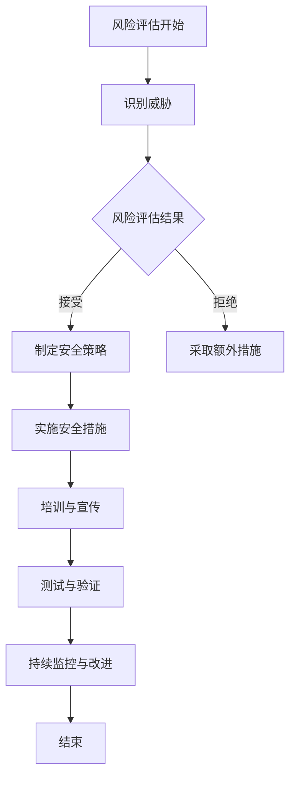

                 

### 引言

在当今信息技术飞速发展的时代，人机协作已经成为提高工作效率、促进创新的重要手段。无论是在制造业、服务业还是科研领域，人与机器的协同工作模式正在逐渐成为主流。然而，随着人机协作的广泛应用，安全问题也愈发凸显，对工作场所的安全保障提出了新的挑战。为此，制定一套科学、全面的人机协作安全标准显得尤为重要。

本文将围绕“人机协作安全标准：确保工作场所安全”这一主题，进行深入探讨。首先，我们将介绍人机协作安全标准的背景和重要性，阐述其在现代工作环境中的必要性。接着，我们将探讨人机协作安全的背景，分析其历史演变以及当前的应用情况。在此基础上，我们将详细讨论人机协作安全的核心概念，包括人机交互模型、安全风险与安全要素等。随后，我们将介绍相关安全标准和法规，并进行比较分析。

在技术实施与评估部分，我们将探讨安全技术的核心原理、实施策略以及安全评估的方法。为了更加直观地展示这些内容，我们将使用Mermaid绘制相关流程图，并借助Python代码详细阐述算法原理和数学模型。此外，我们还将介绍系统分析与架构设计方案，包括问题场景介绍、系统功能设计、系统架构设计、系统接口设计和系统交互等。

案例分析部分将结合实际案例，对成功案例和失败案例进行详细剖析，总结出人机协作安全的最佳实践。最后，我们将对人机协作安全的未来趋势进行展望，总结文章的主要结论，并对读者提出一些建议。

通过这篇文章，我们希望为读者提供一个全面、深入的人机协作安全标准理解，帮助他们在实际工作中更好地应对安全问题，确保工作场所的安全和稳定。

### 背景与概述

人机协作安全标准的产生并非偶然，而是在信息技术不断进步、应用场景日益复杂的背景下，对工作场所安全需求日益增长的自然回应。首先，从历史的角度来看，人机协作的安全问题可以追溯到工业革命时期。随着机械化生产方式的普及，人与机器的协作逐渐成为常态。然而，早期的自动化设备相对简单，安全隐患主要集中在机械伤害和物理环境方面。随着技术的不断演进，计算机和人工智能技术进入工业生产领域，人与机器的协作模式变得更加复杂和紧密，这也使得安全问题更加突出。

进入21世纪，随着互联网、物联网和大数据技术的快速发展，人机协作的形式和深度都发生了革命性的变化。现代工作场所中，人机协作不仅限于单一的任务执行，更涉及到复杂的决策支持和智能优化。这种协作模式的复杂性，使得传统的安全管理和防范手段显得力不从心。例如，在智能制造领域，机器人与人类的合作越来越紧密，任何微小的安全漏洞都可能导致严重的生产事故或经济损失。因此，制定一套系统、全面的人机协作安全标准，成为保障工作场所安全的必要手段。

人机协作安全标准的必要性主要体现在以下几个方面：

首先，标准化能够提供统一的安全评估和衡量标准。在一个高度复杂的协作环境中，不同系统和设备的安全要求可能存在差异，如果没有统一的标准，将难以确保各环节的安全一致性。通过制定安全标准，可以为各类协作系统提供统一的评估基准，便于进行安全审计和评估。

其次，标准化有助于提升协作系统的整体安全性。安全标准不仅涵盖了技术层面的要求，还包括了管理、培训、操作规程等多个方面。通过全面、系统的标准化，可以确保人机协作过程中的各个环节都符合安全要求，从而提升整个系统的安全性。

再次，标准化能够促进技术进步和创新。在标准化框架下，企业和研究机构可以更加专注于技术本身的创新，而不必担心安全问题的制约。这有助于推动技术进步，加速人机协作系统的发展。

然而，当前人机协作安全标准的制定和应用仍面临一些挑战。首先，标准化工作需要广泛参与，包括政府、企业、学术界和标准机构等。不同利益相关方之间可能存在分歧，如何达成共识是一个亟待解决的问题。其次，随着技术的不断演进，安全标准也需要不断更新和迭代，以适应新的安全威胁和挑战。此外，安全标准的实际执行和监督也是一个重要问题，需要建立有效的监督机制和责任追究制度。

总的来说，人机协作安全标准的制定和实施，是现代工作场所安全保障的必然要求。通过标准化，我们可以更好地应对复杂的人机协作环境中的安全挑战，为工作场所的安全和稳定提供坚实的保障。

### 人机协作安全的背景

人机协作的安全问题并不是一个新兴议题，其历史可以追溯到机械化生产初期。在工业革命时期，随着机械化生产线的广泛应用，人与机器的协作模式初步形成。然而，那个时期的人机协作相对简单，主要涉及机械操作和生产线上的操作员。虽然存在一些安全风险，但由于技术水平和安全意识的限制，这些问题并没有引起足够的重视。

随着计算机技术的发展，人机协作进入了新的阶段。20世纪末，计算机开始广泛应用于工业生产、科学研究、服务业等多个领域，人与机器的协作模式变得更加复杂和深入。计算机系统不仅承担了繁重的计算任务，还开始参与到决策支持和智能优化中。这一阶段，人机协作的安全问题逐渐凸显，尤其是在信息安全领域。计算机系统的漏洞和恶意软件攻击成为主要的安全威胁，对工作场所的安全稳定构成重大挑战。

进入21世纪，随着互联网、物联网和大数据技术的迅猛发展，人机协作达到了前所未有的高度。现代工作场所中，人机协作已经超越了传统的机械操作和计算任务，涉及到复杂的数据处理、智能决策和实时通信等多个方面。例如，在智能制造领域，工业机器人与人类的协作已经深入到生产线的各个环节，从原材料处理到产品组装，每一个步骤都离不开人与机器的紧密配合。这种高度复杂的协作模式，使得安全问题变得更加复杂和多样化。

当前，人机协作在现代工作场所中的应用日益广泛，具体体现在以下几个方面：

首先，人工智能技术的应用。人工智能（AI）系统已经在许多领域发挥了重要作用，如自动驾驶汽车、智能客服系统、智能监控系统等。这些系统通过复杂的数据处理和算法，实现了对人类行为的预测和响应，大大提高了工作效率和安全性。然而，人工智能系统的安全性和可靠性也成为了新的关注点。如何确保AI系统的行为符合预期，避免因算法错误或恶意攻击导致的安全事故，是当前面临的重要挑战。

其次，物联网技术的普及。物联网（IoT）技术通过将各类设备互联，实现了对工作环境的实时监控和智能管理。例如，智能工厂中的各种传感器和设备可以实时收集生产数据，通过物联网平台进行数据分析和优化。然而，物联网系统的安全风险也显而易见，如设备被黑客入侵、数据泄露等问题，都可能对工作场所的安全构成威胁。

最后，云计算和大数据技术的应用。云计算和大数据技术为工作场所提供了强大的计算能力和数据存储能力，使得大规模数据处理和实时分析成为可能。例如，通过大数据分析，企业可以更好地了解客户需求，优化生产流程，提高市场竞争力。然而，云计算和大数据系统也面临着数据安全和隐私保护的问题，如数据泄露、数据滥用等，这些都是需要关注的安全隐患。

总之，人机协作在现代工作场所中的应用已经深入到各个方面，带来了前所未有的便利和效率。然而，这也使得安全风险变得更加复杂和多样化。面对这些挑战，制定科学、全面的人机协作安全标准，成为保障工作场所安全和稳定的关键。

### 人机协作安全的关键概念

在人机协作中，理解关键概念是制定有效安全标准的基础。以下我们将详细探讨几个核心概念：人机交互模型、安全风险与安全要素。

#### 人机交互模型

人机交互（Human-Computer Interaction, HCI）模型是描述人与计算机系统如何相互作用的框架。常见的交互模型包括以下几种：

1. **命令驱动模型**：用户通过输入命令来控制计算机系统，例如使用命令行界面（CLI）。
2. **事件驱动模型**：系统根据用户操作或外部事件（如鼠标点击或传感器数据）进行响应。
3. **情境感知模型**：系统根据用户的当前情境（如地理位置、时间等）提供定制化的交互体验。
4. **多模态交互模型**：结合多种输入方式（如语音、手势、触摸等）进行交互。

不同模型有不同的优缺点。例如，命令驱动模型提供了高度的灵活性和控制力，但可能对用户技能要求较高；事件驱动模型适合自动化流程，但可能难以提供个性化体验；情境感知模型能够提供定制化交互，但需要复杂的情境识别技术；多模态交互模型结合了多种交互方式的优势，但可能面临技术实现和用户体验的挑战。

#### 安全风险

在人与机器的协作过程中，安全风险无处不在。以下是一些常见的安全风险类型：

1. **物理风险**：如设备故障、机械伤害、火灾等。
2. **信息安全风险**：包括数据泄露、网络攻击、恶意软件等。
3. **操作风险**：由人为错误、操作失误导致的意外事故。
4. **系统风险**：系统故障、软件漏洞等可能导致的安全漏洞。

评估安全风险时，我们通常采用以下步骤：

1. **风险识别**：识别可能存在的风险，例如通过安全审计、漏洞扫描等方法。
2. **风险分析**：对识别出的风险进行详细分析，包括风险的概率和潜在影响。
3. **风险评估**：根据风险分析的结果，评估风险的可接受程度。
4. **风险处理**：选择合适的风险处理策略，如风险规避、风险转移、风险减轻等。

#### 安全要素

为了确保人机协作的安全，需要考虑多个安全要素，包括以下几个方面：

1. **人员安全**：确保所有操作人员具备必要的安全知识和技能，提供安全培训，制定安全操作规程。
2. **设备安全**：确保所有设备和系统符合安全标准，进行定期维护和检查，及时更新安全补丁。
3. **数据安全**：采用加密、访问控制等技术保护数据，防止数据泄露和未授权访问。
4. **网络安全**：建立安全的网络架构，防止网络攻击和数据泄露。
5. **系统安全**：确保系统具有足够的容错能力和安全防护机制，例如防火墙、入侵检测系统等。

#### 安全与效率的平衡

在确保人机协作安全的过程中，常常面临一个挑战，那就是如何在保证安全的同时，不降低工作效率。以下是几种常见的平衡策略：

1. **自动化与监督相结合**：对于一些高风险任务，可以采用自动化系统进行操作，同时由人类进行监督和干预，确保在发生异常时能够及时处理。
2. **逐步引入**：在引入新的安全措施时，可以逐步实施，观察其对工作效率的影响，并根据实际情况进行调整。
3. **优化流程**：通过优化工作流程，减少冗余步骤和重复劳动，提高整体效率。
4. **安全意识和培训**：加强员工的安全意识培训，提高他们对安全措施的接受度和执行力。

总之，人机协作安全是一个复杂且多维的问题，需要综合考虑多个因素，采取系统化的方法和策略来确保工作场所的安全和效率。通过深入理解关键概念，我们可以更好地制定和实施有效的安全标准，为现代工作场所提供坚实的安全保障。

### 安全标准与法规

在全球范围内，人机协作安全标准的制定和应用已经取得了显著进展。不同国家和地区根据自己的实际情况和需求，制定了一系列相关的安全标准和法规。本文将介绍一些主要的国际安全标准，并结合我国的相关法规和政策进行分析，以期为读者提供全面的视角。

#### 国际安全标准概述

在国际上，多个组织和企业积极参与人机协作安全标准的制定。以下是一些主要的国际安全标准：

1. **国际标准化组织（ISO）**：ISO 45001 是一个广泛认可的职业健康和安全管理体系标准，尽管它不是专门针对人机协作的安全标准，但其理念和方法可以应用于人机协作的安全管理。

2. **国际电工委员会（IEC）**：IEC 62941 是专门针对工业自动化系统与机器人安全的标准。该标准详细规定了工业机器人的安全设计、安装、操作和维护的要求。

3. **国际电信联盟（ITU）**：ITU X.805 是关于远程工作场所安全的标准，包括网络连接、数据保护和远程访问控制等方面的要求。

4. **国际标准化组织（ISO）**：ISO 25022 是关于机器人安全系统的性能评估标准，提供了评估机器人安全系统有效性的方法。

#### 我国相关法规与政策

我国也在人机协作安全领域制定了一系列法规和政策，旨在保障工作场所的安全和稳定。以下是一些主要的法规和政策：

1. **《中华人民共和国安全生产法》**：该法明确了企业在安全生产方面的责任，规定了安全管理体系和安全操作规程的要求，适用于所有涉及人机协作的行业。

2. **《工业机器人安全技术规范》**：这是由国家标准化管理委员会和中华人民共和国工业和信息化部发布的行业标准，专门针对工业机器人安全的设计、制造、使用和维护提出了具体要求。

3. **《信息安全技术—网络安全等级保护基本要求》**：该标准规定了网络安全等级保护的基本要求，包括物理安全、网络安全、主机安全、应用安全、数据安全等方面的内容，适用于涉及信息安全的人机协作系统。

4. **《中华人民共和国密码法》**：该法明确了密码管理和使用的相关规定，对涉及信息安全的设备和系统提出了加密保护的要求。

#### 安全标准与法规的比较分析

国际安全标准与我国相关法规在目标和内容上存在一定的相似性，但也存在差异：

1. **适用范围**：国际标准通常更广泛，涵盖了全球范围内的工业和商业应用，而我国的法规和政策则更多地针对国内特定行业和应用场景。

2. **技术深度**：国际标准往往提供更详细的技术要求和测试方法，而我国的法规和政策则更多地侧重于管理和规范。

3. **更新速度**：国际标准通常更新速度较快，能够及时反映新的技术发展和安全威胁，而我国的法规和政策更新则相对缓慢。

4. **执行力度**：我国的法规和政策在执行力度上通常较强，具有明确的法律责任和处罚措施，而国际标准更多地依赖于自愿遵守。

总的来说，国际安全标准和我国相关法规共同构成了人机协作安全的基础。通过结合国际标准和国内法规，可以更好地保障工作场所的安全，推动人机协作的健康发展。

### 技术实施与策略

在确保人机协作安全的过程中，技术实施和策略的制定至关重要。这不仅涉及到安全技术的基础原理，还包括实施步骤和优化策略。以下将详细介绍这些方面，并使用Mermaid流程图和Python代码进行说明。

#### 安全技术的核心原理

1. **访问控制**：通过限制访问权限，确保只有授权用户才能访问系统和数据。常见的访问控制方法包括基于用户身份验证的访问控制（Authentication）和基于角色访问控制（Role-Based Access Control, RBAC）。

2. **加密技术**：使用加密算法对敏感数据进行加密，防止未授权访问和数据泄露。常用的加密算法包括对称加密（如AES）和非对称加密（如RSA）。

3. **防火墙与入侵检测系统**：防火墙用于监控和控制进出网络的流量，防止恶意攻击。入侵检测系统（IDS）则用于检测和响应网络入侵行为。

4. **数据备份与恢复**：定期对系统和数据进行备份，确保在数据丢失或系统故障时能够快速恢复。

5. **安全审计与监控**：通过日志记录和监控工具，对系统活动和安全事件进行实时监控和审计，及时发现和处理安全威胁。

#### 安全技术的实施步骤

1. **风险评估**：首先，进行全面的系统风险评估，识别潜在的安全威胁和漏洞。可以使用风险分析工具（如Risk Manager）进行定量和定性分析。

2. **制定安全策略**：基于风险评估的结果，制定具体的安全策略和操作规程。安全策略应包括访问控制、加密、防火墙、数据备份等方面的具体要求。

3. **实施安全措施**：根据安全策略，实施具体的安全技术和措施。例如，配置防火墙规则、部署加密软件、设置访问控制权限等。

4. **培训与宣传**：对员工进行安全意识和操作规程培训，确保他们能够正确使用安全技术，遵守安全操作规程。

5. **测试与验证**：进行安全测试和验证，确保安全措施的有效性。可以使用渗透测试工具（如Metasploit）进行漏洞扫描和渗透测试。

6. **持续监控与改进**：建立持续的安全监控机制，定期进行安全检查和审计，及时发现和处理新出现的威胁和漏洞。

#### 安全技术的优化策略

1. **动态安全策略**：根据安全威胁的变化，动态调整安全策略。例如，使用基于机器学习的威胁检测系统，自动识别和响应新的安全威胁。

2. **云计算与大数据**：利用云计算和大数据技术，实现更高效的安全管理和监控。例如，通过云平台提供的安全服务，实现对大规模数据的实时监控和分析。

3. **人工智能与自动化**：利用人工智能技术，实现自动化安全监控和威胁响应。例如，使用深度学习模型进行异常检测和自动化响应。

#### Mermaid流程图与Python代码示例

以下是一个使用Mermaid绘制的安全风险评估流程图示例：



以下是一个简单的Python代码示例，用于加密和解密数据：

```python
from Crypto.Cipher import AES
from Crypto.Util.Padding import pad, unpad
from Crypto.Random import get_random_bytes

# 密钥和初始化向量
key = b'Sixteen byte key'
iv = b'Sixteen byte IV'

# 待加密的数据
data = b"This is some text to encrypt!"

# AES加密
cipher = AES.new(key, AES.MODE_CBC, iv)
ct_bytes = cipher.encrypt(pad(data, AES.block_size))
print("加密后的数据：", ct_bytes.hex())

# AES解密
cipher = AES.new(key, AES.MODE_CBC, iv)
pt = unpad(cipher.decrypt(ct_bytes), AES.block_size)
print("解密后的数据：", pt.decode('utf-8'))
```

通过这些技术实施和优化策略，我们可以更好地确保人机协作过程中的安全，为工作场所提供坚实的保障。

### 安全评估与持续改进

安全评估是确保人机协作系统安全性的关键环节。通过系统化的安全评估，可以及时发现和解决潜在的安全问题，为系统的持续改进提供依据。以下将详细探讨安全评估的框架、风险评估以及安全改进策略。

#### 安全评估框架

一个完整的安全评估框架通常包括以下几个步骤：

1. **评估准备**：确定评估目标和范围，组建评估团队，收集相关资料和系统信息。

2. **威胁识别**：通过风险评估工具和方法（如风险分析表、漏洞扫描工具）识别系统可能面临的安全威胁。

3. **风险分析**：对识别出的威胁进行详细分析，评估其概率和潜在影响，确定优先级。

4. **风险评估**：综合分析结果，评估系统整体安全状况，确定需要采取的安全措施。

5. **评估报告**：编写详细的安全评估报告，包括评估过程、发现的问题、风险评估结果和安全改进建议。

6. **跟踪与反馈**：对安全改进措施的实施进行跟踪和评估，收集反馈信息，不断优化安全策略。

#### 安全风险评估

风险评估是安全评估的核心环节。以下是常见的安全风险评估步骤：

1. **风险识别**：通过访谈、问卷调查、文档审查等方法，识别系统可能面临的安全威胁。

2. **风险分析**：对识别出的威胁进行详细分析，包括其发生概率和潜在影响。可以使用定量和定性方法进行评估。

3. **风险排序**：根据风险的概率和影响，对风险进行排序，确定优先处理的风险。

4. **风险接受与拒绝**：根据风险评估结果，决定是否接受风险或采取相应措施进行控制。

5. **风险处理**：针对高风险，制定具体的应对措施，如改进系统设计、增加安全控制等。

6. **风险监控**：建立风险监控机制，对风险进行持续监控，确保安全措施的有效性。

#### 安全改进策略

为了确保人机协作系统的长期安全性，需要采取一系列持续改进措施：

1. **定期评估**：定期进行安全评估，确保系统安全策略与实际情况保持一致。

2. **更新安全策略**：根据评估结果和新出现的安全威胁，及时更新安全策略和操作规程。

3. **培训与教育**：加强员工的安全意识和培训，确保他们能够正确执行安全操作规程。

4. **技术升级**：定期对系统和设备进行技术升级和更新，确保其具备最新的安全防护能力。

5. **安全审计**：进行定期的安全审计，检查安全策略和措施的实施情况，确保其有效性和合规性。

6. **应急预案**：制定应急预案，确保在发生安全事件时能够迅速响应和处理。

通过上述安全评估和改进措施，可以确保人机协作系统的安全性，为工作场所提供一个安全、稳定的工作环境。

### 案例分析

为了更好地理解人机协作安全标准在实际工作中的应用，我们将分析几个具体的案例，包括成功案例和失败案例。通过这些案例，我们将探讨在实际操作中如何应用安全标准，以及从案例中得到的启示和教训。

#### 成功案例

**案例一：智能制造工厂的安全管理**

一家全球领先的智能制造工厂采用了严格的人机协作安全标准，通过一系列措施确保了生产线的安全运行。以下是该案例的关键点：

1. **安全风险评估**：工厂在项目启动阶段进行了全面的安全风险评估，识别了潜在的安全威胁，如设备故障、网络攻击和数据泄露等。

2. **安全策略制定**：基于风险评估结果，工厂制定了详细的安全策略，包括访问控制、数据加密、网络安全和应急响应等。

3. **技术实施**：工厂采用了先进的访问控制系统，确保只有授权人员能够访问关键设备和数据。同时，部署了加密技术保护数据传输和存储，以及防火墙和入侵检测系统来保障网络安全。

4. **员工培训**：对员工进行了系统的安全培训，确保他们了解并能够正确执行安全操作规程。

5. **持续监控与改进**：工厂建立了持续的安全监控机制，定期进行安全检查和审计，及时发现和处理安全事件。

**启示**：通过全面的安全评估和系统化的安全策略，智能制造工厂成功降低了安全风险，确保了生产线的安全和稳定运行。这一案例表明，科学的安全评估和严格的实施措施是确保人机协作安全的关键。

#### 失败案例

**案例二：医疗机构的网络攻击**

一家大型医疗机构在一次网络攻击中遭受了严重的损失。以下是该案例的关键点：

1. **安全意识不足**：医疗机构的员工对网络安全缺乏足够的重视，未及时更新系统和补丁，导致系统存在多个漏洞。

2. **安全措施不完善**：虽然医疗机构部署了一些基本的安全措施，如防火墙和入侵检测系统，但未能全面覆盖安全需求，如数据加密和访问控制。

3. **应急响应不及时**：在遭受网络攻击后，医疗机构的应急响应机制不完善，未能及时切断攻击路径和恢复系统。

4. **数据泄露和损失**：网络攻击导致大量患者数据泄露，不仅侵犯了患者的隐私权，还造成了医疗机构的声誉损失。

**教训**：这一案例提醒我们，安全意识不足、安全措施不完善和应急响应不及时都是导致安全事故的重要原因。医疗机构需要加强员工的安全培训，完善安全措施，并建立有效的应急响应机制，以应对潜在的安全威胁。

#### 案例分析总结

通过对成功案例和失败案例的分析，我们可以得到以下启示和教训：

1. **全面的安全评估**：在任何人机协作项目中，进行全面的安全评估都是确保安全性的第一步。只有深入了解潜在的安全威胁，才能制定出有效的安全策略。

2. **系统化的安全策略**：制定系统化的安全策略，包括访问控制、数据加密、网络安全和应急响应等，是确保安全性的关键。

3. **持续的安全监控与改进**：安全工作不是一劳永逸的，需要建立持续的安全监控和改进机制，及时发现和处理新的安全威胁。

4. **员工安全培训**：加强员工的安全意识培训，确保他们能够正确执行安全操作规程，是降低安全风险的重要措施。

5. **完善的应急响应机制**：建立完善的应急响应机制，确保在发生安全事件时能够迅速响应和处理，是保障工作场所安全的重要保障。

通过这些案例，我们可以看到，遵循科学的安全标准和严格的安全措施，能够有效地降低人机协作过程中的安全风险，确保工作场所的安全和稳定。

### 实践指南与最佳实践

在人机协作安全标准的实际应用过程中，遵循一系列最佳实践和注意事项是确保工作场所安全的关键。以下将介绍一些关键的安全实践，并提供具体的操作步骤，帮助读者在实际工作中有效地实施人机协作安全标准。

#### 关键的安全实践

1. **访问控制**：
   - **操作步骤**：为系统和数据设置严格的访问控制，确保只有授权用户才能访问关键资源和功能。通过用户身份验证（如密码认证、双因素认证）和基于角色的访问控制（RBAC），限制用户权限。
   - **注意事项**：定期审查和更新访问控制列表，删除不再需要的访问权限，防止未授权访问。

2. **数据加密**：
   - **操作步骤**：对敏感数据进行加密，确保数据在传输和存储过程中不被未授权访问。使用AES、RSA等加密算法对数据进行加密。
   - **注意事项**：确保加密算法和密钥管理符合行业标准，定期更换密钥，防止密钥泄露。

3. **网络安全**：
   - **操作步骤**：部署防火墙和入侵检测系统（IDS），监控和阻止网络攻击。使用网络隔离技术，如虚拟专用网络（VPN）和安全边界网关（SWG）。
   - **注意事项**：定期进行网络漏洞扫描和渗透测试，及时修补安全漏洞，确保网络架构的完整性。

4. **安全审计与监控**：
   - **操作步骤**：建立安全审计和监控机制，实时记录和监控系统活动，及时发现和处理异常行为。
   - **注意事项**：确保审计日志的完整性和可靠性，定期审查和分析审计日志，以便及时发现潜在的安全威胁。

5. **员工培训与意识提升**：
   - **操作步骤**：对员工进行系统的安全培训，提高他们的安全意识和操作技能。培训内容应包括安全政策、常见的安全威胁、安全操作规程等。
   - **注意事项**：定期进行安全意识培训，通过实际案例和演练，提高员工的应急响应能力。

#### 安全实施步骤详解

1. **风险评估**：
   - **步骤**：进行全面的系统风险评估，识别潜在的安全威胁和漏洞。
   - **工具**：使用风险分析工具（如Risk Manager），进行定量和定性分析，确定风险的优先级。

2. **制定安全策略**：
   - **步骤**：根据风险评估结果，制定详细的安全策略和操作规程。
   - **文档**：安全策略文档应包括访问控制、数据加密、网络安全、应急响应等方面的具体要求。

3. **安全措施实施**：
   - **步骤**：根据安全策略，实施具体的安全技术和措施，如配置防火墙、部署加密软件、设置访问控制权限等。
   - **工具**：使用安全工具（如防火墙管理软件、加密软件等）进行安全措施的实施。

4. **测试与验证**：
   - **步骤**：进行安全测试和验证，确保安全措施的有效性。
   - **工具**：使用漏洞扫描工具（如Nessus）、渗透测试工具（如Metasploit）进行测试。

5. **监控与改进**：
   - **步骤**：建立持续的安全监控机制，定期进行安全检查和审计，发现和处理新的安全威胁。
   - **工具**：使用安全监控工具（如日志分析工具、入侵检测系统等）进行实时监控。

#### 最佳实践总结

1. **全面的安全评估**：定期进行安全评估，确保安全策略与实际需求相符，及时识别和处理潜在的安全威胁。

2. **系统化的安全策略**：制定全面、系统化的安全策略，覆盖访问控制、数据加密、网络安全、应急响应等方面。

3. **严格的实施与监控**：确保安全措施的有效实施和持续监控，通过测试和验证，确保安全措施的有效性。

4. **员工培训与意识提升**：定期进行安全培训，提高员工的安全意识和操作技能，建立有效的应急响应机制。

5. **安全意识与企业文化**：将安全意识融入企业文化，通过安全文化建设，使安全成为工作的一部分。

通过遵循这些最佳实践和注意事项，可以有效提高人机协作系统的安全性，确保工作场所的安全和稳定。

### 总结

本文从背景与概述、人机协作安全的背景、关键概念、安全标准与法规、技术实施与策略、安全评估与持续改进、案例分析以及实践指南等多个方面，对人机协作安全标准进行了全面而深入的探讨。通过分析历史演变、技术应用、风险评估、安全要素和法规标准，我们明确了人机协作安全的重要性，并提出了一系列最佳实践和注意事项。

**主要结论**：

1. **必要性**：人机协作安全标准的制定是现代工作环境的安全需求，有助于保障工作场所的安全和稳定。
2. **关键概念**：理解人机交互模型、安全风险与安全要素是制定和实施安全标准的基础。
3. **技术实施**：通过访问控制、加密技术、网络安全和持续监控等技术手段，可以提升人机协作系统的安全性。
4. **评估与改进**：定期进行安全评估和改进，确保安全策略与实际需求相符，是保障系统长期安全的关键。
5. **案例分析**：成功案例和失败案例的分析，为我们提供了宝贵的经验和教训。

**进一步研究的问题**：

1. **新技术的应用**：随着人工智能、物联网等新技术的不断发展，人机协作安全标准如何适应这些新技术，成为亟待研究的问题。
2. **跨行业协作**：如何在不同行业和领域之间建立统一的人机协作安全标准，促进跨行业的安全合作，是一个重要的研究方向。
3. **持续改进机制**：如何建立更加高效、灵活的持续改进机制，确保安全标准的动态调整和实施，是一个值得探讨的问题。

**对读者的建议**：

1. **加强学习**：持续关注人机协作安全领域的发展动态，不断学习新的安全技术和方法。
2. **实践应用**：在实际工作中，积极应用本文提出的安全标准和最佳实践，确保人机协作系统的安全性。
3. **安全意识**：提高安全意识，将安全理念融入企业文化，使安全成为工作的一部分。

总之，人机协作安全标准的制定和实施是一个复杂而长期的过程，需要各方共同努力，确保工作场所的安全和稳定。通过不断的学习、实践和改进，我们可以为人机协作创造一个更加安全和高效的工作环境。

### 展望与未来

在人机协作安全标准的未来发展方面，我们可以预见几个重要的趋势和方向。首先，随着人工智能（AI）和物联网（IoT）技术的不断进步，人机协作模式将变得更加复杂和智能。这种复杂性的提升，不仅带来了更高的生产效率和创新能力，同时也带来了新的安全挑战。因此，未来的安全标准需要更加全面和灵活，以适应不断变化的技术环境。

**技术发展趋势**：

1. **智能安全系统**：未来的人机协作安全标准将更加依赖于智能安全系统。这些系统可以通过机器学习和深度学习技术，实现自动化的威胁检测和响应。例如，智能防火墙和入侵检测系统能够根据实时数据进行分析，自动识别并阻止潜在的安全威胁。

2. **自主安全管理**：随着自动化技术的进步，未来人机协作系统将具备更高的自主管理能力。例如，自主的安全运维系统可以自动完成系统更新、漏洞修复和安全审计等任务，降低人工干预的风险。

3. **区块链技术的应用**：区块链技术因其去中心化和不可篡改的特性，将在人机协作安全标准中发挥重要作用。通过区块链，可以确保数据的完整性和真实性，提高数据传输和存储的安全性。

**法规政策展望**：

1. **国际标准统一**：随着全球化的推进，各国对人机协作安全标准的关注程度不断提高。未来，我们可以预见国际标准化组织（ISO）和其他相关机构将推出更多统一的安全标准，以应对跨国界的协作需求。

2. **法规更新与完善**：各国政府和企业将加强对人机协作安全的监管，制定更加详细和严格的法规政策。例如，针对人工智能和物联网领域，将出台专门的安全法规，规范其应用和安全管理。

**安全挑战与机遇**：

1. **挑战**：未来人机协作安全面临的挑战主要包括技术的快速更新、新安全威胁的不断涌现、以及跨行业协作的安全标准统一等问题。这些挑战需要各方共同努力，通过技术创新和合作来解决。

2. **机遇**：另一方面，人机协作安全标准的不断完善和推广，将为企业提供更强大的安全保障，促进其业务的发展和创新。同时，这也将推动相关技术的发展，形成良性的互动。

综上所述，未来人机协作安全标准的方向将更加智能化、标准化和协同化。通过技术创新、法规完善和国际合作，我们可以预见一个更加安全、高效的工作环境，为人机协作的发展提供坚实的基础。

### 作者信息

作者：AI天才研究院/AI Genius Institute & 禅与计算机程序设计艺术 /Zen And The Art of Computer Programming

感谢您的阅读，希望本文对您理解和应用人机协作安全标准有所帮助。如果您有任何问题或建议，欢迎随时与我们联系。我们致力于推动人工智能和计算机编程领域的创新与发展，期待与您共同探索技术的前沿。再次感谢您的关注与支持！

