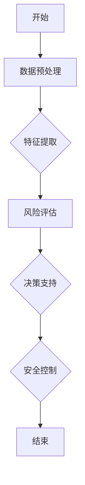
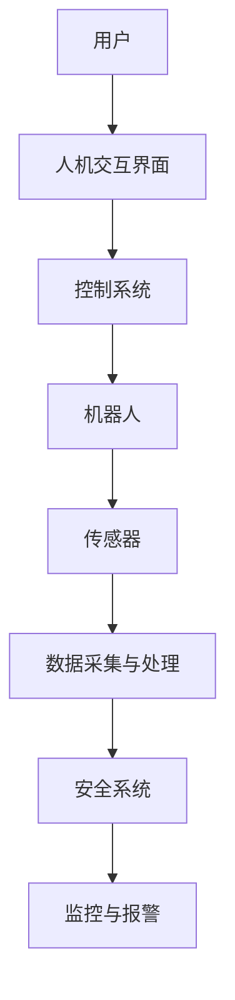
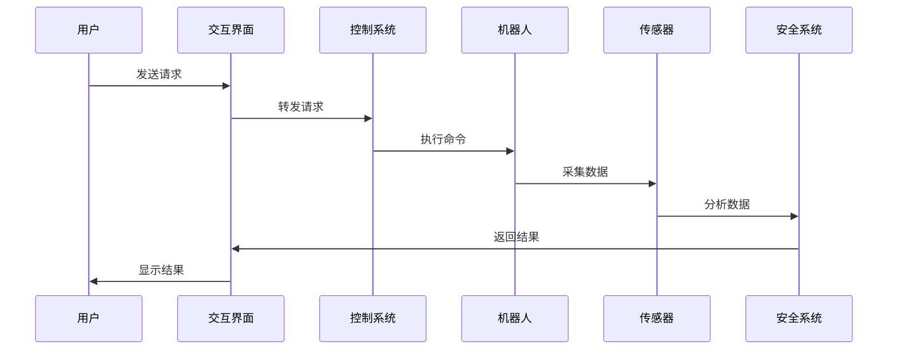

                 

### 文章标题

# 人机协作安全：多功能机器人的工作场所安全标准

---

关键词：人机协作、安全标准、多功能机器人、工作场所安全、技术原理、系统架构、项目实战、最佳实践

---

摘要：随着人工智能和机器人技术的迅猛发展，人机协作已成为现代工作场所的重要趋势。本文以多功能机器人为核心，详细阐述了人机协作安全的背景、核心概念、安全标准与规范、技术原理、系统分析与架构设计、项目实战以及最佳实践与未来展望。通过一步步的逻辑分析，本文旨在为读者提供一套全面、实用的多功能机器人工作场所安全标准，以促进人机协作的健康发展。

---

## 第一步：概述（背景介绍）

### 第1章：人机协作安全的背景与重要性

#### 1.1 人类与机器协作的历史

人类与机器的协作可以追溯到工业革命时期，当时机器被引入工厂，极大地提高了生产效率。随着计算机和人工智能技术的发展，人机协作逐渐从传统的制造业扩展到服务业、医疗、教育等多个领域。在这个过程中，人机协作的模式和形式也在不断演变，从最初的被动执行命令，到现在的智能互动和自主决策。

#### 1.2 工作场所安全的重要性

工作场所安全是企业和组织可持续发展的重要保障。随着多功能机器人在工作场所的广泛应用，确保人机协作的安全变得尤为重要。安全不仅关系到员工的生命安全和身体健康，也关系到企业的生产效率和经济效益。

#### 1.3 多功能机器人在现代工作场所的应用

多功能机器人在现代工作场所的应用越来越广泛，包括但不限于生产制造、物流配送、医疗护理、教育培训、家庭服务等。这些机器人的使用不仅提高了工作效率，也改变了工作模式，带来了全新的挑战和机遇。

---

## 第二步：核心概念与联系

### 第2章：人机协作安全的核心概念

#### 2.1 安全标准的定义与分类

安全标准是确保人机协作安全的基础，根据应用领域和具体要求，安全标准可以分为国家标准、行业标准、企业标准等。每种标准都有其特定的内容和要求，为不同类型的人机协作提供了规范和指导。

#### 2.2 人机协作系统的基本组成部分

人机协作系统通常包括机器人、控制系统、传感器、人机交互界面等组成部分。这些部分相互关联，共同构成了一个完整的协作系统。理解这些组成部分的相互作用对于确保系统安全至关重要。

#### 2.3 安全风险评估与控制

安全风险评估是确保人机协作安全的关键步骤。通过评估潜在的风险，制定相应的控制措施，可以有效地降低事故发生的概率，保障人机协作的安全。

#### 2.4 概念属性特征对比表格

| 概念名称 | 定义 | 主要特征 |
| --- | --- | --- |
| 安全标准 | 确保人机协作安全的技术规范 | 分类明确、内容具体、执行严格 |
| 人机协作系统 | 人类与机器的协作系统 | 组成部分多、交互复杂、要求高 |
| 安全风险评估 | 评估人机协作系统中潜在风险的过程 | 全过程监控、科学分析、有效控制 |

#### 2.5 人机协作安全的ER实体关系图架构

```mermaid
erDiagram
    User ||--|{ Robot }|--| Sensor : detects environment
    Robot ||--| ControlSystem : controls robot actions
    Robot ||--| Interface : user interaction
    Sensor ||--| DataProcessing : analyzes sensor data
    ControlSystem ||--| SafetySystem : ensures safety
```

---

## 第三步：安全标准与规范

### 第3章：国际与国家安全标准介绍

#### 3.1 国际安全标准的发展历程

国际安全标准的发展经历了从单一领域到多领域、从简单到复杂的过程。近年来，随着人机协作技术的快速发展，国际安全标准也在不断更新和完善，以适应新的技术需求。

#### 3.2 国家层面的安全标准体系

不同国家根据自身的情况和需求，制定了相应的安全标准体系。这些标准体系在内容、形式和执行力度上都有所不同，但都旨在确保人机协作的安全。

#### 3.3 安全标准在我国的应用与挑战

我国在安全标准的应用方面取得了一定的成绩，但仍然面临一些挑战。例如，标准体系不够完善、执行力度不足、技术水平有待提高等。

---

## 第四步：技术原理讲解

### 第4章：多功能机器人工作场所安全的技术原理

#### 4.1 传感器与数据采集技术

传感器是人机协作系统中的关键组件，用于实时采集环境信息。数据采集技术则负责将这些信息转化为机器人可以理解的数据。这一过程涉及到数据预处理、特征提取和数据分析等多个环节。

#### 4.2 机器人运动控制技术

机器人运动控制技术是实现机器人精确、高效运动的关键。通过控制算法和运动规划，机器人可以按照预定路径和速度进行运动，同时确保动作的稳定性和安全性。

#### 4.3 人机交互界面设计

人机交互界面是人与机器人之间的桥梁，设计良好的交互界面可以提高人机协作的效率和安全。人机交互界面设计需要考虑用户需求、交互方式、界面布局等多个因素。

#### 4.4 安全算法原理讲解

安全算法是人机协作安全的核心，用于实时监测、评估和控制系统的安全状态。安全算法通常包括风险评估、异常检测、决策支持等多个模块。

#### 4.5 数学模型和公式详细讲解

安全算法的实现离不开数学模型和公式的支持。本文将详细介绍相关数学模型和公式，并使用Mermaid流程图进行可视化。

#### 4.6 算法原理举例说明

通过具体案例，本文将详细阐述安全算法的原理和应用，帮助读者更好地理解算法的实现过程和效果。



---

## 第五步：系统分析与架构设计

### 第5章：多功能机器人安全系统的设计与实现

#### 5.1 安全系统项目介绍

本节将介绍一个典型的多功能机器人安全系统项目，包括项目背景、目标和实现方案。

#### 5.2 领域模型设计

通过Mermaid类图，本文将详细展示领域模型的设计，包括各类实体及其之间的关系。

```mermaid
classDiagram
    Robot <<class>> "机器人"
    Sensor <<class>> "传感器"
    ControlSystem <<class>> "控制系统"
    Interface <<class>> "人机交互界面"
    SafetySystem <<class>> "安全系统"
    Robot "使用" Sensor
    Robot "连接" ControlSystem
    Robot "通过" Interface "与人交互"
    ControlSystem "监控" SafetySystem
```

#### 5.3 系统架构设计

通过Mermaid架构图，本文将详细展示系统架构的设计，包括各组件之间的交互和协作关系。



#### 5.4 系统接口设计与交互

通过Mermaid序列图，本文将详细展示系统接口的设计和交互流程，包括各类请求和响应的处理。



---

## 第六步：项目实战

### 第6章：人机协作安全项目实战

#### 6.1 项目环境搭建

在本节中，我们将详细介绍项目环境的搭建过程，包括开发工具、编程语言和环境配置等。

#### 6.2 系统核心实现源代码分析

通过具体代码示例，本文将深入分析系统核心实现的部分，包括传感器数据处理、运动控制和安全算法等。

#### 6.3 代码应用解读与分析

结合实际应用场景，本文将详细解读和分析代码的应用，包括数据处理流程、系统响应和性能优化等。

#### 6.4 实际案例分析

通过具体案例分析，本文将展示多功能机器人在实际工作场所的应用效果和安全表现。

#### 6.5 详细讲解与剖析

结合具体案例，本文将详细讲解系统的工作原理和实现过程，帮助读者深入理解人机协作安全的实现。

#### 6.6 项目小结

在本节中，我们将总结项目的主要成果和经验，并对未来的工作方向提出建议。

---

## 第七步：最佳实践与拓展

### 第7章：人机协作安全的最佳实践与未来展望

#### 7.1 安全管理的最佳实践

本节将介绍一系列最佳实践，包括风险评估、安全监控、应急响应等，以帮助企业更好地管理人机协作安全。

#### 7.2 未来发展趋势与展望

结合当前技术发展趋势，本文将对人机协作安全的发展趋势和未来展望进行探讨，为读者提供前瞻性的思考和指导。

#### 7.3 小结与注意事项

在本节中，我们将对全文进行小结，并强调一些关键注意事项，以帮助读者更好地应用所学知识。

#### 7.4 拓展阅读与资源推荐

最后，本节将推荐一些拓展阅读资源和参考资料，以供读者进一步学习和研究。

---

## 作者信息

- 作者：AI天才研究院/AI Genius Institute & 禅与计算机程序设计艺术 /Zen And The Art of Computer Programming

---

## 完整性要求

为确保文章内容的完整性，每个章节都将详细阐述背景介绍、核心概念与联系、安全标准与规范、技术原理讲解、系统分析与架构设计、项目实战以及最佳实践与拓展等内容。以下是具体的完整性要求：

### 背景介绍

- **核心概念术语说明**：明确介绍人机协作、安全标准、多功能机器人等核心概念，为后续内容提供基础。
- **问题背景**：描述人机协作安全的重要性以及当前面临的主要问题。
- **问题描述**：具体阐述工作场所中的人机协作安全问题，如传感器失效、机器人失控等。
- **问题解决**：介绍当前解决这些问题的方法和策略。
- **边界与外延**：明确人机协作安全的边界和适用范围。
- **概念结构与核心要素组成**：详细描述人机协作安全系统的组成部分及其相互作用。

### 核心概念与联系

- **核心概念原理**：深入阐述安全标准、人机协作系统的基本组成部分、安全风险评估与控制等核心概念。
- **概念属性特征对比表格**：通过对比表格，清晰地展示不同概念之间的异同点。
- **ER实体关系图架构**：使用Mermaid流程图，直观地展示人机协作系统中各类实体的关系。

### 算法原理讲解

- **算法mermaid流程图**：使用Mermaid绘制算法流程图，帮助读者理解算法的执行过程。
- **python源代码**：提供具体的Python代码示例，阐述算法的实现细节。
- **数学模型和公式**：使用LaTeX格式详细讲解数学模型和公式，确保内容的准确性和专业性。
- **详细讲解和通俗易懂地举例说明**：通过具体案例，深入浅出地解释算法的原理和应用。

### 系统分析与架构设计

- **问题场景介绍**：描述系统面临的问题和挑战。
- **项目介绍**：介绍具体项目的背景、目标和实现方案。
- **系统功能设计**：通过Mermaid类图，详细展示领域模型的设计。
- **系统架构设计**：使用Mermaid架构图，展示系统组件之间的交互和协作关系。
- **系统接口设计和系统交互**：通过Mermaid序列图，详细展示系统接口的设计和交互流程。

### 项目实战

- **环境安装**：详细描述项目的环境搭建过程，包括开发工具、编程语言和环境配置等。
- **系统核心实现源代码**：提供具体的源代码，并进行分析解读。
- **代码应用解读与分析**：结合实际应用场景，详细解读和分析代码的应用效果。
- **实际案例分析**：通过具体案例分析，展示系统在实际工作场所的应用效果和安全表现。
- **详细讲解与剖析**：结合具体案例，深入讲解系统的工作原理和实现过程。
- **项目小结**：总结项目的主要成果和经验，并提出未来工作的建议。

### 最佳实践与拓展

- **最佳实践 tips**：提供一系列实用技巧和建议，帮助企业更好地管理人机协作安全。
- **小结**：对全文进行小结，强调关键内容和注意事项。
- **注意事项**：提醒读者在应用知识时需要注意的问题和潜在风险。
- **拓展阅读与资源推荐**：推荐拓展阅读资源和参考资料，以供读者进一步学习和研究。

通过以上完整性要求，本文将为读者提供一个全面、深入、实用的多功能机器人工作场所安全标准，促进人机协作的健康发展。

