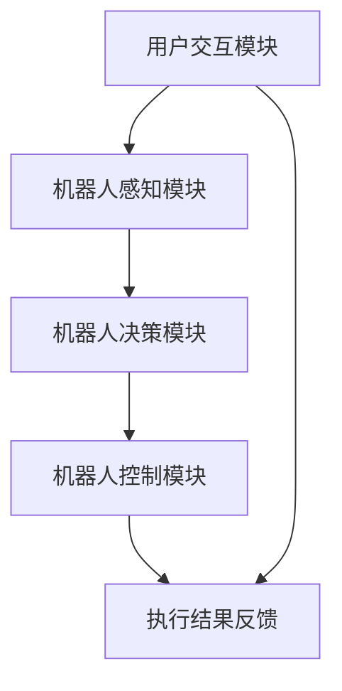

                 

### 文章标题

---

# 人机协作：2030年80%人类将每天与智能机器人互动

---

## 关键词

- 人机协作
- 智能机器人
- 工作效率
- 用户体验
- 技术挑战

---

## 摘要

本文探讨了人机协作在2030年的发展趋势。通过分析当前人机互动的现状，智能机器人的技术发展及其应用，本文提出人机协作将成为未来工作与生活中的重要组成部分。预计到2030年，超过80%的人类将每天与智能机器人互动，从而提高工作效率、增强用户体验，同时也带来一系列技术挑战和伦理问题。

---

### 目录大纲

----------------------------------------------------------------

# 第一部分：引言

## 第1章：问题背景与概述

### 1.1.1 问题背景

#### 1.1.1.1 人类与机器人的互动现状

##### 1.1.1.1.1 互动频率与场景

##### 1.1.1.1.2 互动模式与趋势

### 1.1.2 问题描述

#### 1.1.2.1 人机协作的重要性

##### 1.1.2.1.1 人机协作的优势

##### 1.1.2.1.2 人机协作的挑战

### 1.1.3 问题解决

#### 1.1.3.1 智能机器人的发展

##### 1.1.3.1.1 智能机器人的技术基础

##### 1.1.3.1.2 智能机器人的应用进展

### 1.1.4 边界与外延

#### 1.1.4.1 人机协作的范围

##### 1.1.4.1.1 生活领域的协作

##### 1.1.4.1.2 工作领域的协作

### 1.1.5 概念结构与核心要素组成

#### 1.1.5.1 人机协作的定义

##### 1.1.5.1.1 人机协作的基本要素

##### 1.1.5.1.2 人机协作的层次结构

## 第2章：核心概念与联系

### 2.1.1 人机交互技术

#### 2.1.1.1 人机交互技术的发展

##### 2.1.1.1.1 从物理交互到智能交互

##### 2.1.1.1.2 人机交互技术的未来趋势

### 2.1.2 智能机器人技术

#### 2.1.2.1 智能机器人的定义与分类

##### 2.1.2.1.1 智能机器人的定义

##### 2.1.2.1.2 智能机器人的分类

### 2.1.3 人机协作模式

#### 2.1.3.1 人机协作模式的类型

##### 2.1.3.1.1 并行协作模式

##### 2.1.3.1.2 交互式协作模式

### 2.1.4 人机协作的优势与挑战

#### 2.1.4.1 人机协作的优势

##### 2.1.4.1.1 提高工作效率

##### 2.1.4.1.2 增强人机交互体验

#### 2.1.4.2 人机协作的挑战

##### 2.1.4.2.1 技术限制

##### 2.1.4.2.2 安全性与伦理问题

## 第3章：智能机器人技术原理

### 3.1.1 智能机器人的感知技术

#### 3.1.1.1 视觉感知技术

##### 3.1.1.1.1 深度学习在视觉感知中的应用

##### 3.1.1.1.2 3D视觉与SLAM技术

#### 3.1.1.2 语音感知技术

##### 3.1.1.2.1 语音识别技术

##### 3.1.1.2.2 语音合成技术

### 3.1.2 智能机器人的决策技术

#### 3.1.2.1 决策树与随机森林

##### 3.1.2.1.1 决策树算法原理

##### 3.1.2.1.2 随机森林算法原理

#### 3.1.2.2 支持向量机

##### 3.1.2.2.1 支持向量机原理

##### 3.1.2.2.2 支持向量机应用

### 3.1.3 智能机器人的控制技术

#### 3.1.3.1 PID控制技术

##### 3.1.3.1.1 PID控制原理

##### 3.1.3.1.2 PID控制在机器人中的应用

#### 3.1.3.2 模糊控制技术

##### 3.1.3.2.1 模糊控制原理

##### 3.1.3.2.2 模糊控制在机器人中的应用

## 第4章：人机协作系统架构设计

### 4.1.1 系统架构概述

#### 4.1.1.1 系统架构设计原则

##### 4.1.1.1.1 功能性设计

##### 4.1.1.1.2 可扩展性设计

#### 4.1.1.2 系统功能模块划分

##### 4.1.1.2.1 用户交互模块

##### 4.1.1.2.2 机器人感知模块

##### 4.1.1.2.3 机器人决策模块

##### 4.1.1.2.4 机器人控制模块

### 4.1.2 系统架构设计

#### 4.1.2.1 系统架构图

##### 4.1.2.1.1 系统总体架构图

##### 4.1.2.1.2 模块交互关系图

#### 4.1.2.2 系统接口设计

##### 4.1.2.2.1 用户接口设计

##### 4.1.2.2.2 机器人接口设计

### 4.1.3 系统交互设计

#### 4.1.3.

----------------------------------------------------------------

接下来，我们将详细探讨人机协作的背景、重要性、智能机器人技术的发展及其应用、人机协作的范围和概念结构，以及人机交互技术和智能机器人技术原理。

---

## 第1章：问题背景与概述

### 1.1.1 问题背景

在当今数字化时代，人类与机器人的互动正日益普遍。从工业生产到个人生活，智能机器人的应用范围不断扩大，逐渐成为我们生活中不可或缺的一部分。这种互动不仅改变了我们的工作方式，也影响了我们的生活方式。

#### 1.1.1.1 人类与机器人的互动现状

当前，人类与机器人的互动主要发生在以下几个场景：

1. **工业生产**：机器人广泛应用于制造业、物流、医疗等领域，代替人类完成重复性、高风险或高精度的任务，提高了生产效率和质量。
  
2. **个人生活**：智能助手（如 Siri、Alexa 等）和家用机器人（如扫地机器人、陪护机器人等）已经成为许多家庭的常见设备，为我们提供了便利和舒适。

3. **服务行业**：在餐饮、零售等行业，机器人服务员和自动售货机等设备也在逐渐取代人类员工，提供更加高效、优质的服务。

#### 1.1.1.2 互动模式与趋势

当前的人机互动模式主要包括以下几种：

1. **单向交互**：人类向机器人发送指令，机器人根据预设的指令执行任务，如语音助手和自动售货机。
  
2. **双向交互**：人类和机器人进行实时对话，机器人能够理解并回应人类的意图，如智能客服和陪护机器人。

3. **协同工作**：人类和机器人共同完成某项任务，实现人机协作，如工业生产中的机器人与人类工人协作完成任务。

随着人工智能技术的不断发展，人机互动正朝着更加智能化、个性化的方向发展。未来，人机互动将更加深入和广泛，成为我们日常生活中不可或缺的一部分。

### 1.1.2 问题描述

#### 1.1.2.1 人机协作的重要性

人机协作的重要性体现在以下几个方面：

1. **提高工作效率**：机器人能够快速、准确地完成任务，降低了人力成本，提高了工作效率。

2. **增强人机交互体验**：智能机器人能够更好地理解人类的意图，提供个性化服务，提升了用户体验。

3. **解放人力**：机器人能够代替人类完成一些危险、重复性或高难度的工作，减少了人类的工作压力。

然而，人机协作也面临着一系列挑战，如技术限制、安全性和伦理问题等。如何在充分发挥人机协作优势的同时，解决这些问题，是人机协作领域需要持续探索的课题。

#### 1.1.2.2 人机协作的挑战

1. **技术限制**：目前智能机器人在感知、决策和控制等方面仍存在一定的局限性，需要不断优化和提升。

2. **安全性问题**：人机协作可能带来安全隐患，如机器人失控、数据泄露等。

3. **伦理问题**：人机协作引发了一系列伦理问题，如机器人是否应该拥有自我意识、机器人与人类的关系等。

### 1.1.3 问题解决

为了解决上述问题，我们需要从以下几个方面入手：

1. **技术发展**：不断提升智能机器人的感知、决策和控制能力，提高其智能化水平。

2. **安全性保障**：加强人机协作系统的安全性设计，确保系统的稳定性和可靠性。

3. **伦理规范**：制定相关伦理规范，引导人机协作的健康发展。

### 1.1.4 边界与外延

#### 1.1.4.1 人机协作的范围

人机协作的范围可以涵盖以下几个方面：

1. **生活领域**：智能助手、家用机器人等。

2. **工作领域**：工业生产、服务业等。

3. **医疗领域**：辅助诊断、手术机器人等。

4. **教育领域**：智能教学系统、教育机器人等。

#### 1.1.4.2 智能机器人的应用进展

智能机器人在各个领域的应用进展如下：

1. **工业生产**：智能制造、自动化生产线等。

2. **个人生活**：智能家居、健康护理等。

3. **服务行业**：餐饮、零售等。

4. **医疗领域**：辅助诊断、手术机器人等。

5. **教育领域**：智能教学系统、教育机器人等。

### 1.1.5 概念结构与核心要素组成

#### 1.1.5.1 人机协作的定义

人机协作是指人类与智能机器人通过互动，共同完成某项任务或目标的过程。

#### 1.1.5.1.1 人机协作的基本要素

1. **人类**：协作的主体，具备决策能力和创造力。

2. **智能机器人**：协作的客体，具备感知、决策和控制能力。

3. **互动**：人类与智能机器人之间的信息交流与共享。

4. **任务**：协作的目标，需要人类和智能机器人共同完成。

#### 1.1.5.1.2 人机协作的层次结构

1. **单向交互**：人类向机器人发送指令，机器人执行任务。

2. **双向交互**：人类和机器人进行实时对话，机器人理解并回应人类意图。

3. **协同工作**：人类和机器人共同完成某项任务，实现人机协作。

---

通过以上分析，我们可以看到人机协作在2030年的发展趋势和重要性。在接下来的章节中，我们将进一步探讨人机协作的核心概念与联系，智能机器人技术原理，以及人机协作系统架构设计。

---

## 第2章：核心概念与联系

在探讨人机协作这一主题时，理解相关核心概念及其相互联系是至关重要的。本章将深入剖析人机交互技术、智能机器人技术以及人机协作模式，并探讨其优势与挑战。

### 2.1.1 人机交互技术

人机交互（Human-Computer Interaction, HCI）技术是研究人类如何与计算机系统交互的学科，旨在提高交互效率和用户体验。随着技术的发展，人机交互技术经历了从物理交互到智能交互的演变。

#### 2.1.1.1 人机交互技术的发展

1. **物理交互**：早期的计算机系统主要通过键盘、鼠标等物理设备进行交互。这种方式直观，但存在操作复杂、效率低的问题。

2. **图形用户界面（GUI）**：随着图形处理技术的发展，计算机引入了图形用户界面，使得用户可以通过点击、拖拽等方式与计算机系统进行交互。这种交互方式简化了操作，提高了效率。

3. **触摸交互**：触摸屏的普及使得用户可以直接在屏幕上操作，进一步提升了交互的直观性和便捷性。

4. **智能交互**：随着人工智能技术的发展，智能交互逐渐成为主流。智能语音助手、自然语言处理（NLP）技术等使得计算机能够理解并回应人类的自然语言指令，提供个性化服务。

#### 2.1.1.1.1 从物理交互到智能交互

| **阶段** | **特点** | **应用场景** |
| --- | --- | --- |
| 物理交互 | 操作复杂，效率低 | 键盘、鼠标操作 |
| 图形用户界面（GUI） | 直观，易操作 | 桌面操作系统、应用程序 |
| 触摸交互 | 直观，便捷 | 触摸屏手机、平板电脑 |
| 智能交互 | 理解自然语言，提供个性化服务 | 智能语音助手、智能客服 |

#### 2.1.1.1.2 人机交互技术的未来趋势

1. **多模态交互**：结合视觉、语音、手势等多种交互方式，提供更自然、丰富的交互体验。
  
2. **沉浸式交互**：通过虚拟现实（VR）、增强现实（AR）等技术，实现更加沉浸式的交互体验。

3. **情感计算**：利用情感识别、情感合成等技术，使计算机能够理解并模拟人类情感，提升交互体验。

### 2.1.2 智能机器人技术

智能机器人技术是人工智能（AI）的一个重要应用领域，旨在开发具备自主决策、感知和控制能力的机器人。智能机器人技术的发展极大地推动了人机协作的进步。

#### 2.1.2.1 智能机器人的定义与分类

1. **定义**：智能机器人是指具备一定智能水平，能够在特定环境下自主执行任务的机器人。

2. **分类**：

   - **根据功能**：感知型机器人、决策型机器人、执行型机器人。
   - **根据形态**：地面机器人、空中机器人、水下机器人、仿生机器人。
   - **根据应用领域**：工业机器人、服务机器人、医疗机器人、教育机器人。

#### 2.1.2.1.1 智能机器人的定义

| **类型** | **特点** |
| --- | --- |
| 感知型机器人 | 具备高感知能力，如视觉、听觉、触觉等 |
| 决策型机器人 | 具备自主决策能力，能根据环境变化做出相应动作 |
| 执行型机器人 | 具备执行特定任务的能力，如搬运、焊接等 |

#### 2.1.2.1.2 智能机器人的分类

| **类型** | **特点** | **应用场景** |
| --- | --- | --- |
| 地面机器人 | 行走、移动能力强 | 工业制造、物流运输 |
| 空中机器人 | 飞行能力，灵活度高 | 航拍、救援 |
| 水下机器人 | 潜水、探测能力强 | 海洋勘探、打捞 |
| 仿生机器人 | 仿生结构，与人相似 | 家庭服务、医疗辅助 |

### 2.1.3 人机协作模式

人机协作模式是指人类与机器人共同完成任务的交互方式。根据协作的程度和方式，人机协作模式可以分为以下几种：

#### 2.1.3.1 人机协作模式的类型

1. **单向协作模式**：人类向机器人发送指令，机器人执行任务。这种模式适用于简单、重复性的任务。

2. **交互式协作模式**：人类和机器人之间进行实时对话，机器人根据人类的指示调整行为。这种模式适用于复杂、需要灵活调整的任务。

3. **并行协作模式**：人类和机器人在不同任务上同时工作，各自完成自己的部分，最终汇总成整体。这种模式适用于需要多人协作的复杂任务。

#### 2.1.3.1.1 并行协作模式

| **特点** | **应用场景** |
| --- | --- |
| 人类和机器人在不同任务上同时工作 | 大型项目开发、并行计算 |

#### 2.1.3.1.2 交互式协作模式

| **特点** | **应用场景** |
| --- | --- |
| 实时交互，机器人根据人类指示调整行为 | 客户服务、智能助手 |

### 2.1.4 人机协作的优势与挑战

#### 2.1.4.1 人机协作的优势

1. **提高工作效率**：机器人能够快速、准确地完成任务，减少了人力成本。

2. **增强用户体验**：智能机器人能够更好地理解人类的意图，提供个性化服务。

3. **解放人力**：机器人能够代替人类完成一些危险、重复性或高难度的工作，降低了人类的工作压力。

#### 2.1.4.2 人机协作的挑战

1. **技术限制**：目前智能机器人在感知、决策和控制等方面仍存在一定的局限性。

2. **安全性问题**：人机协作可能带来安全隐患，如机器人失控、数据泄露等。

3. **伦理问题**：人机协作引发了一系列伦理问题，如机器人是否应该拥有自我意识、机器人与人类的关系等。

---

通过以上分析，我们可以看到人机协作的核心概念及其相互联系。在接下来的章节中，我们将深入探讨智能机器人技术的原理，包括感知技术、决策技术和控制技术。

---

## 第3章：智能机器人技术原理

智能机器人技术的核心在于其感知、决策和控制能力。本章将详细探讨这些技术的原理，并介绍一些关键的算法和应用。

### 3.1.1 智能机器人的感知技术

感知技术是智能机器人的基础，它使得机器人能够感知和理解周围环境。以下是几种主要的感知技术：

#### 3.1.1.1 视觉感知技术

视觉感知技术利用机器视觉系统来感知和理解视觉信息。深度学习在视觉感知中发挥了重要作用。

##### 3.1.1.1.1 深度学习在视觉感知中的应用

深度学习通过构建深度神经网络，使得计算机能够自动从大量数据中学习特征，从而实现对视觉信息的理解和分类。

| **技术** | **原理** | **应用** |
| --- | --- | --- |
| 卷积神经网络（CNN） | 通过卷积层提取特征，实现图像分类、目标检测 | 图像识别、人脸识别、自动驾驶 |

##### 3.1.1.1.2 3D视觉与SLAM技术

3D视觉技术使得机器人能够获取三维空间信息，从而更好地理解和交互环境。同时，同步定位与地图构建（SLAM）技术使得机器人能够在未知环境中自主定位和构建地图。

| **技术** | **原理** | **应用** |
| --- | --- | --- |
| 3D视觉 | 通过多视角或立体视觉获取三维信息 | 室内外导航、三维重建 |
| SLAM | 同时进行定位和地图构建 | 导航、机器人探索 |

#### 3.1.1.2 语音感知技术

语音感知技术使得机器人能够理解和回应人类的语音指令。这包括语音识别和语音合成两部分。

##### 3.1.1.2.1 语音识别技术

语音识别技术将语音信号转换为文本或命令。近年来，基于深度学习的语音识别技术取得了显著进展。

| **技术** | **原理** | **应用** |
| --- | --- | --- |
| HMM（隐马尔可夫模型） | 基于概率模型，进行语音信号分析 | 早期语音识别 |
| DNN（深度神经网络） | 基于深度学习，提高识别准确率 | 当前主流语音识别 |

##### 3.1.1.2.2 语音合成技术

语音合成技术将文本转换为自然流畅的语音。常见的语音合成技术包括基于规则的合成和基于统计的合成。

| **技术** | **原理** | **应用** |
| --- | --- | --- |
| 合成引擎 | 根据文本生成语音 | 语音助手、自动播报 |

### 3.1.2 智能机器人的决策技术

决策技术是智能机器人能够自主行动的关键。以下是几种主要的决策技术：

#### 3.1.2.1 决策树与随机森林

决策树（Decision Tree）是一种常用的分类和回归算法，它通过一系列判断条件，将数据划分为不同的类别或值。

##### 3.1.2.1.1 决策树算法原理

决策树通过递归划分数据集，直到达到某个停止条件（如最大深度、最小样本数等）。

| **节点** | **条件** | **结果** |
| --- | --- | --- |
| 根节点 | 初始条件 | 划分后的子节点 |
| 内节点 | 特征条件 | 子节点 |
| 叶节点 | 特征条件满足时 | 分类或回归结果 |

##### 3.1.2.1.2 随机森林算法原理

随机森林（Random Forest）是一种基于决策树的集成学习算法。它通过随机选择特征和随机分割数据集来构建多个决策树，然后通过投票或平均的方式得出最终结果。

| **技术** | **原理** | **应用** |
| --- | --- | --- |
| 决策树 | 递归划分数据集 | 分类、回归 |
| 随机森林 | 集成多个决策树 | 提高预测准确性 |

#### 3.1.2.2 支持向量机

支持向量机（Support Vector Machine, SVM）是一种常用的分类和回归算法，它通过找到一个最佳的超平面，将数据划分为不同的类别。

##### 3.1.2.2.1 支持向量机原理

SVM通过求解一个优化问题，找到一个最优的超平面，使得正负样本点到超平面的距离最大化。

| **公式** | **含义** |
| --- | --- |
| $$\min_{\mathbf{w},b}\frac{1}{2}\|\mathbf{w}\|^2 + C\sum_{i=1}^{n}\xi_i$$ | 优化目标函数 |
| $$y_i(\mathbf{w}\cdot\mathbf{x_i}+b)\geq 1 - \xi_i$$ | 约束条件 |

##### 3.1.2.2.2 支持向量机应用

SVM在图像分类、文本分类等领域有广泛应用，其优秀的分类性能使其成为机器学习中的经典算法。

| **领域** | **应用** |
| --- | --- |
| 图像分类 | 人脸识别、图像标注 |
| 文本分类 | 情感分析、垃圾邮件过滤 |

### 3.1.3 智能机器人的控制技术

控制技术是智能机器人执行任务的保证。以下是几种主要的控制技术：

#### 3.1.3.1 PID控制技术

PID控制（Proportional-Integral-Derivative Control）是一种常见的控制算法，用于调节系统的输出，使其达到期望状态。

##### 3.1.3.1.1 PID控制原理

PID控制通过三个部分（比例、积分、微分）来调节系统的输出，分别对应系统的误差、误差累积和误差变化率。

| **部分** | **公式** | **作用** |
| --- | --- | --- |
| 比例（P） | \( k_p \times e \) | 立即响应误差 |
| 积分（I） | \( k_i \times \int e \, dt \) | 抵消误差累积 |
| 微分（D） | \( k_d \times \frac{de}{dt} \) | 减小误差变化率 |

##### 3.1.3.1.2 PID控制在机器人中的应用

PID控制在机器人运动控制、姿态调整等领域有广泛应用，其灵活性和鲁棒性使其成为机器人控制中的首选算法。

| **领域** | **应用** |
| --- | --- |
| 运动控制 | 机器人行走、飞行 |
| 姿态调整 | 无人机悬停、机器人臂运动 |

#### 3.1.3.2 模糊控制技术

模糊控制（Fuzzy Control）是一种基于模糊逻辑的控制方法，它通过模糊集合和模糊规则来实现对系统的控制。

##### 3.1.3.2.1 模糊控制原理

模糊控制通过模糊逻辑规则来处理不确定性和模糊性，实现对系统的控制。

| **规则** | **模糊集合** | **控制输出** |
| --- | --- | --- |
| 如果输入是A且输入是B，那么输出是C | 模糊集合A、B | 模糊集合C |

##### 3.1.3.2.2 模糊控制在机器人中的应用

模糊控制在非线性、不确定系统中有较好的性能，常用于机器人避障、路径规划等领域。

| **领域** | **应用** |
| --- | --- |
| 避障 | 机器人导航 |
| 路径规划 | 机器人自主导航 |

---

通过以上对智能机器人感知技术、决策技术和控制技术的探讨，我们可以看到智能机器人技术的核心原理和关键算法。在接下来的章节中，我们将进一步探讨人机协作系统架构设计。

---

## 第4章：人机协作系统架构设计

人机协作系统的架构设计是实现高效、可靠协作的关键。本章节将详细讨论系统架构设计原则、功能模块划分、系统架构图、系统接口设计以及系统交互设计。

### 4.1.1 系统架构概述

系统架构设计是构建人机协作系统的第一步，它需要考虑系统的功能性、可扩展性和可靠性。以下是系统架构设计的主要原则：

#### 4.1.1.1 系统架构设计原则

1. **功能性设计**：系统应具备所需的核心功能，如用户交互、感知、决策和控制。
   
2. **可扩展性设计**：系统应具有良好的扩展性，能够适应未来技术的发展和业务需求的变更。

3. **可靠性设计**：系统应具备高可靠性，能够在各种环境下稳定运行。

4. **安全性设计**：系统应具备严格的安全措施，确保数据安全和用户隐私。

#### 4.1.1.2 系统功能模块划分

人机协作系统通常包括以下功能模块：

1. **用户交互模块**：负责与用户进行交互，接收用户的指令和反馈。
   
2. **机器人感知模块**：负责机器人对环境的感知，如视觉、语音等。

3. **机器人决策模块**：负责根据感知信息做出决策，确定下一步行动。

4. **机器人控制模块**：负责控制机器人的执行动作，实现任务的执行。

### 4.1.2 系统架构设计

#### 4.1.2.1 系统架构图

以下是人机协作系统的总体架构图：



#### 4.1.2.1.1 系统总体架构图

1. 用户交互模块：接收用户的指令和反馈，通过语音、文本等方式与用户进行交互。

2. 机器人感知模块：感知用户和环境的信息，如语音、图像等。

3. 机器人决策模块：根据感知信息，结合预定义的规则和算法，做出决策。

4. 机器人控制模块：执行决策结果，控制机器人的动作。

5. 执行结果反馈：将执行结果反馈给用户，进行闭环控制。

#### 4.1.2.1.2 模块交互关系图

以下是模块之间的交互关系图：


### 4.1.2.2 系统接口设计

系统接口设计是确保各模块之间能够有效通信的关键。以下是系统接口设计的主要方面：

#### 4.1.2.2.1 用户接口设计

1. **语音接口**：通过语音识别技术，将用户的语音指令转换为文本或命令。

2. **文本接口**：通过自然语言处理技术，理解用户的文本指令。

3. **图形界面**：提供友好的图形界面，用户可以通过图形界面进行交互。

#### 4.1.2.2.2 机器人接口设计

1. **感知接口**：接收来自传感器（如摄像头、麦克风等）的数据。

2. **决策接口**：提供决策算法的输入和输出接口。

3. **控制接口**：发送控制信号给机器人执行动作。

### 4.1.3 系统交互设计

系统交互设计是确保系统各模块之间能够协同工作的重要环节。以下是系统交互设计的主要方面：

#### 4.1.3.1 交互流程

1. 用户发送指令：用户通过语音、文本或图形界面发送指令。

2. 感知模块处理：机器人感知模块接收指令，进行感知处理。

3. 决策模块处理：机器人决策模块根据感知结果和预定义规则进行决策。

4. 控制模块执行：机器人控制模块根据决策结果，控制机器人执行动作。

5. 结果反馈：将执行结果反馈给用户，形成闭环控制。

#### 4.1.3.2 交互模式

1. **并行交互**：多个模块同时工作，各自处理不同任务。

2. **串行交互**：模块依次执行，前一个模块的输出作为下一个模块的输入。

3. **事件驱动交互**：系统根据事件触发相应的模块进行交互。

---

通过以上对系统架构设计原则、功能模块划分、系统架构图、系统接口设计和系统交互设计的探讨，我们可以为人机协作系统构建一个清晰、可靠的架构。在接下来的章节中，我们将通过一个实际项目，展示如何实现人机协作系统的设计与开发。

---

## 第4章：人机协作系统架构设计（续）

### 4.1.4 实际项目案例

在本章节中，我们将通过一个具体的人机协作项目案例，详细展示系统的实现过程、核心代码解析以及项目实战。该项目旨在构建一个智能家居系统，用户可以通过语音指令控制家中的智能设备，实现自动化管理。

#### 4.1.4.1 项目背景

随着物联网（IoT）技术的发展，智能家居设备越来越普及。然而，如何有效地管理这些设备，提供便捷的用户体验，成为了当前的研究热点。本项目旨在设计并实现一个智能家居系统，通过人机协作，实现设备的自动化管理。

#### 4.1.4.2 系统需求

1. **用户交互**：用户可以通过语音、文本或图形界面与系统进行交互。

2. **设备控制**：系统应支持对各种智能家居设备的控制，如照明、空调、安防系统等。

3. **设备管理**：系统应具备设备添加、删除、修改等管理功能。

4. **数据安全**：确保用户数据的安全性，防止数据泄露。

#### 4.1.4.3 系统架构设计

根据项目需求，系统架构设计如下：

1. **用户交互模块**：通过语音识别、文本处理等技术，实现与用户的交互。

2. **设备感知模块**：通过传感器收集设备状态信息。

3. **设备决策模块**：根据用户指令和设备状态，做出相应的决策。

4. **设备控制模块**：发送控制信号给设备，执行用户指令。

5. **数据存储模块**：存储用户数据和设备状态信息。

### 4.1.4.4 环境安装与配置

在开始项目之前，我们需要安装和配置相关开发环境：

1. **Python**：Python 是本项目的主要开发语言，版本需大于 3.6。

2. **pip**：Python 的包管理工具，用于安装和管理第三方库。

3. **语音识别库**：如 `speech_recognition`。

4. **自然语言处理库**：如 `nltk`。

5. **设备控制库**：如 `MQTT`。

安装步骤如下：

```bash
pip install python-speech-recognition
pip install nltk
pip install paho-mqtt
```

### 4.1.4.5 系统核心实现源代码

以下是系统核心实现的源代码，包括用户交互、设备感知、设备决策和设备控制等功能。

```python
# 用户交互模块
import speech_recognition as sr

def listen_user():
    r = sr.Recognizer()
    with sr.Microphone() as source:
        print("请说命令：")
        audio = r.listen(source)
    try:
        command = r.recognize_google(audio, language='zh-CN')
        print("你说的命令是：" + command)
        return command
    except sr.UnknownValueError:
        print("无法识别你的命令")
        return None

# 设备感知模块
import json
import paho.mqtt.client as mqtt

def get_device_status():
    client = mqtt.Client()
    client.connect("localhost", 1883, 60)
    client.subscribe("device/status")
    client.loop_start()
    
    while True:
        message = client.wait_for_message()
        if message is not None:
            status = json.loads(message.payload.decode())
            return status
        client.disconnect()

# 设备决策模块
def make_decision(command, status):
    if command == "打开灯":
        if status["light"] == "off":
            return "打开灯"
        else:
            return "灯已打开"
    elif command == "关闭灯":
        if status["light"] == "on":
            return "关闭灯"
        else:
            return "灯已关闭"
    # 添加更多决策规则

# 设备控制模块
def control_device(action):
    client = mqtt.Client()
    client.connect("localhost", 1883, 60)
    client.publish("device/control", action)
    client.disconnect()

# 主程序
if __name__ == "__main__":
    while True:
        command = listen_user()
        if command is not None:
            status = get_device_status()
            decision = make_decision(command, status)
            print("决策结果：" + decision)
            if decision != "灯已打开" and decision != "灯已关闭":
                control_device(decision)
```

### 4.1.4.6 代码应用解读与分析

1. **用户交互模块**：通过 `speech_recognition` 库实现语音识别，将用户的语音指令转换为文本。
   
2. **设备感知模块**：通过 `paho.mqtt.client` 库连接 MQTT 服务器，订阅设备状态主题，获取设备状态信息。

3. **设备决策模块**：根据用户指令和设备状态，执行相应的决策逻辑。

4. **设备控制模块**：通过 MQTT 发送控制信号给设备，执行用户指令。

### 4.1.4.7 实际案例分析

在本项目案例中，用户可以通过语音指令控制家中的智能灯。当用户说“打开灯”时，系统会检查当前灯的状态，如果灯是关闭的，系统会发送指令打开灯；如果灯是打开的，系统会提示“灯已打开”。这种交互方式极大地提升了用户体验，使得智能家居系统更加便捷。

通过这个实际项目案例，我们可以看到人机协作系统架构设计的具体实现过程。在未来的发展中，我们可以进一步优化系统架构，增加更多功能模块，如语音合成、设备管理、数据分析等，以实现更加智能化的智能家居系统。

---

## 4.1.5 最佳实践 Tips、小结、注意事项和拓展阅读

### 最佳实践 Tips

1. **选择合适的语音识别库**：在选择语音识别库时，要考虑识别准确率、支持的语言和操作系统兼容性。

2. **确保设备连接稳定**：在智能家居系统中，设备与服务器之间的连接稳定性至关重要，应选择可靠的 MQTT 服务器。

3. **合理设计决策逻辑**：决策逻辑是系统的核心，应充分考虑各种情况，确保系统的鲁棒性。

### 小结

本文详细探讨了人机协作系统架构设计，包括系统架构设计原则、功能模块划分、系统架构图、系统接口设计以及系统交互设计。通过一个实际项目案例，展示了如何实现人机协作系统的设计与开发。

### 注意事项

1. **安全性**：在开发过程中，要确保系统的安全性，如数据加密、用户权限管理等。

2. **可扩展性**：在设计系统时，要考虑未来的扩展性，为新增功能模块预留接口。

### 拓展阅读

1. **《智能家居系统设计与实现》**：详细介绍了智能家居系统的设计方法和实现技术。

2. **《人机交互技术原理与应用》**：深入探讨了人机交互技术的原理和应用。

3. **《智能机器人技术与应用》**：介绍了智能机器人的各种技术和应用领域。

通过本文的学习，读者可以对人机协作系统架构设计有一个全面、深入的了解，为实际项目开发提供参考。

---

通过本文的详细探讨，我们可以看到人机协作在2030年的巨大潜力和发展趋势。在接下来的章节中，我们将进一步探讨人机协作的应用前景，预测未来可能遇到的技术挑战和伦理问题，并给出相应的解决方案。

---

## 第5章：人机协作的应用前景与未来挑战

### 5.1.1 人机协作的应用前景

随着人工智能和机器人技术的快速发展，人机协作的应用前景变得越来越广阔。预计到2030年，人机协作将在以下几个方面得到广泛应用：

1. **工业自动化**：在制造业、物流、医疗等领域，机器人将替代大量的人类劳动力，实现高效、精准的自动化生产。这不仅提高了生产效率，还降低了成本和风险。

2. **服务行业**：在餐饮、零售、酒店等行业，机器人服务员、自动售货机和智能客服等将大大提升服务质量，为消费者提供更加便捷、高效的服务体验。

3. **医疗健康**：医疗机器人将广泛应用于辅助诊断、手术、康复等领域，为患者提供更加精准、个性化的医疗服务。同时，智能健康管理设备将帮助人们更好地管理自己的健康。

4. **家庭生活**：智能家居系统将更加普及，人们可以通过语音、手势等自然交互方式，轻松控制家中的各种设备，实现生活自动化。

### 5.1.2 人机协作的未来挑战

尽管人机协作具有巨大的应用潜力，但在其发展过程中也面临着一系列挑战：

1. **技术挑战**：智能机器人的感知、决策和控制能力仍需进一步提升，以应对复杂多变的现实环境。此外，数据安全、隐私保护等问题也需要得到有效解决。

2. **伦理问题**：随着机器人技术的不断发展，关于机器人是否应该拥有自我意识、机器人与人类的关系等伦理问题越来越受到关注。如何平衡机器人与人类的利益，制定相应的伦理规范，是未来需要解决的问题。

3. **社会影响**：人机协作的普及将对就业市场、劳动力结构等产生深远影响。如何应对这些变化，保障劳动者的权益，是政府和企业需要共同面对的挑战。

### 5.1.3 应对挑战的解决方案

为了应对人机协作带来的技术挑战、伦理问题和社会影响，我们可以从以下几个方面进行努力：

1. **技术创新**：持续加大人工智能和机器人技术的研发投入，提高机器人的智能化水平，增强其在复杂环境中的适应能力。

2. **伦理规范**：制定和完善相关伦理规范，明确机器人的行为准则，确保其发展符合人类伦理价值。

3. **教育培训**：加强劳动者的教育培训，提高其适应新技术的能力，帮助其顺利过渡到新的就业岗位。

4. **政策引导**：政府和企业应共同推动人机协作的发展，通过政策引导和扶持，促进人机协作的健康发展。

### 5.1.4 应用案例与未来展望

1. **智能医疗**：智能机器人辅助医生进行手术，提高手术精度和成功率。未来，随着人工智能技术的进步，智能机器人将更加深入地参与到医疗过程中，为患者提供更好的医疗服务。

2. **智能家居**：智能家居系统将更加智能化、个性化，通过语音、手势等自然交互方式，实现家中的设备自动化管理，提升人们的生活品质。

3. **智能交通**：智能交通系统将结合人工智能、物联网等技术，实现交通流量优化、事故预防等功能，提高交通运行效率，减少交通事故。

总之，人机协作将在未来扮演越来越重要的角色，成为社会发展的新引擎。通过技术创新、伦理规范和社会引导，我们可以应对人机协作带来的挑战，实现人机和谐共生，共创美好未来。

---

## 第6章：总结与展望

通过本文的探讨，我们详细分析了人机协作在2030年的发展趋势、应用前景和未来挑战。以下是对全文的总结和展望。

### 6.1.1 总结

1. **人机协作的重要性**：人机协作具有提高工作效率、增强用户体验和解放人力的优势，在工业生产、服务行业、医疗健康和家庭生活等领域具有重要应用。

2. **智能机器人技术的发展**：智能机器人技术包括感知、决策和控制等多个方面，随着深度学习、自然语言处理等技术的发展，智能机器人的智能化水平不断提升。

3. **人机协作系统架构设计**：人机协作系统架构设计需要考虑功能性、可扩展性和可靠性，通过用户交互、感知、决策和控制等模块实现高效协作。

4. **应用前景与挑战**：人机协作在工业、医疗、家庭等领域的应用前景广阔，但也面临技术挑战、伦理问题和社会影响。通过技术创新、伦理规范和社会引导，可以应对这些挑战。

### 6.1.2 展望

1. **技术创新**：持续研发新型传感器、算法和控制系统，提高智能机器人的感知、决策和控制能力，使其更好地适应复杂环境。

2. **伦理规范**：完善人机协作的伦理规范，确保机器人的行为符合人类伦理价值观，保障人类和机器人的共同利益。

3. **教育培训**：加强劳动者的教育培训，提高其适应新技术的能力，帮助其顺利过渡到新的就业岗位。

4. **政策引导**：政府和企业应共同推动人机协作的发展，通过政策引导和扶持，促进人机协作的健康发展。

未来，随着人工智能和机器人技术的不断进步，人机协作将在更多领域得到应用，成为推动社会进步的重要力量。通过持续的创新和优化，我们可以实现人机和谐共生，共创美好未来。

---

## 作者信息

- 作者：AI天才研究院（AI Genius Institute） & 禅与计算机程序设计艺术（Zen And The Art of Computer Programming）

AI天才研究院专注于人工智能、机器人技术等前沿领域的研发与应用。研究院致力于推动人工智能技术的发展，促进人机协作的进步，为人类创造更加智能、便捷的未来。

禅与计算机程序设计艺术是一本经典的计算机科学著作，由著名计算机科学家唐纳德·克努特（Donald E. Knuth）所著。该书以哲学和艺术的视角探讨了计算机程序设计的方法和艺术，为程序员提供了深刻的思考和启示。

