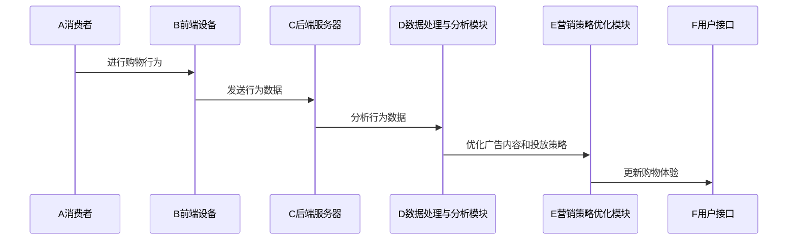

                 

## 人机融合：神经科技在企业中的伦理应用

### 关键词
- **神经科技**，**企业应用**，**伦理问题**，**隐私保护**，**数据安全**

### 摘要
随着人工智能技术的迅猛发展，神经科技在企业中的应用日益广泛。这些技术不仅提升了企业的运营效率和员工的工作体验，同时也带来了诸多伦理挑战。本文旨在探讨神经科技在企业中的伦理应用，分析其核心概念、应用领域、伦理问题，并提出相应的解决策略，以期为企业在利用神经科技时提供伦理指导。

---

## 第一部分：背景介绍与核心概念

### 1.1 问题背景

随着科技的快速发展，人工智能（AI）已经成为企业创新和提升竞争力的关键驱动力。然而，随着AI技术的不断演进，其在企业中的应用也引发了诸多伦理问题。这些问题不仅关乎企业的运营和发展，更涉及到社会责任和人类福祉。因此，如何在企业中应用神经科技，同时确保其伦理合规性，成为了一个亟待解决的重要课题。

### 1.2 问题描述

神经科技在企业中的应用主要集中在以下几个方面：数据采集与分析、智能决策支持、员工健康监测等。这些应用在提高企业效率和员工满意度方面具有显著优势。然而，与此同时，神经科技的应用也带来了隐私保护、数据安全、技术滥用等一系列伦理问题。如何平衡技术进步与伦理要求，确保AI技术的可持续发展，成为了企业必须面对的挑战。

### 1.3 问题解决

解决这一问题的核心在于构建一套完整的伦理框架，指导神经科技在企业中的应用。这包括以下几个方面：

1. **伦理法规与政策制定**：政府和企业需要共同制定相关的伦理法规和政策，明确神经科技应用的边界和责任。
2. **企业内部伦理培训**：加强对员工的伦理教育，提高其对神经科技应用伦理问题的认识。
3. **技术透明度与责任归属**：增强技术的透明度，明确技术责任归属，确保AI系统在应用过程中的合规性。
4. **用户参与与反馈**：在技术设计和应用过程中，充分考虑用户的意见和需求，确保技术的公平性和公正性。

### 1.4 边界与外延

神经科技在企业的应用范围广泛，包括但不限于以下领域：

1. **人力资源管理**：通过脑波监测和情感分析等技术，提升员工招聘、培训和管理的效果。
2. **市场营销**：利用神经科技分析消费者行为和偏好，提高市场策略的精准性。
3. **生产管理**：通过智能监控和预测，优化生产流程，提高生产效率和产品质量。
4. **客户服务**：利用语音识别和自然语言处理技术，提供更加个性化和高效的服务。

### 1.5 概念结构与核心要素组成

神经科技在企业中的伦理应用涉及多个核心概念和要素，包括：

1. **神经科技**：指利用生物神经科学原理和技术，对人的生理、心理和行为进行监测、分析和干预。
2. **伦理**：指在道德和道德准则的指导下，对行为和决策进行评估和选择。
3. **企业应用**：指神经科技在企业各个部门和业务中的应用场景和实践。
4. **伦理框架**：指一套规范和指导神经科技应用的行为准则和操作规范。

### 1.6 本章小结

本章通过对神经科技在企业中伦理应用的问题背景、问题描述、问题解决以及边界与外延的详细介绍，为后续章节的深入探讨奠定了基础。在接下来的章节中，我们将进一步探讨神经科技的核心概念与原理，以及其在企业中的具体应用和伦理挑战。通过系统的分析和讲解，旨在为读者提供一套全面且实用的神经科技伦理应用指南。

---

### 1.1 问题背景

#### 人工智能（AI）的兴起与神经科技

人工智能（AI）作为21世纪最具变革性的技术之一，正在深刻改变各行各业。从自动化生产到智能客服，从医疗诊断到金融预测，AI的应用场景日益丰富，为企业带来了前所未有的效率和创新能力。特别是深度学习、自然语言处理、计算机视觉等技术的突破，使得AI能够处理和分析大规模数据，从而实现更加精准的决策和预测。

随着AI技术的快速发展，神经科技（Neurotechnology）也逐渐走入人们的视野。神经科技是指利用生物神经科学原理和技术，对人的生理、心理和行为进行监测、分析和干预。它结合了神经科学、计算机科学和人工智能等多个领域的知识，旨在通过模拟人脑的工作方式，提升人类的认知能力和智能水平。

在企业的背景下，神经科技的应用不仅限于提升工作效率和客户体验，还涉及到员工健康监测、人力资源管理、市场营销等多个方面。例如，通过脑波监测和情感分析，企业可以更好地了解员工的心理状态和工作表现，从而优化工作流程和提升员工满意度。同样，利用神经科技对消费者行为进行分析，企业可以更精准地制定市场策略，提高销售业绩。

#### 伦理问题的引发

然而，随着神经科技在企业中的应用越来越广泛，一系列伦理问题也日益凸显。这些问题不仅关系到企业的可持续发展，更涉及到社会道德和人类尊严。以下是神经科技应用中常见的几个伦理问题：

1. **隐私保护**：神经科技通常需要收集和处理大量的个人数据，如脑波信号、面部表情、语音等。这些数据涉及到个人的隐私权，如何保护这些数据不被滥用或泄露，是一个亟待解决的伦理问题。
2. **数据安全**：神经科技的应用往往伴随着大量的数据处理和分析。如果数据安全措施不到位，可能会导致数据泄露或被恶意利用，对个人和企业造成严重损失。
3. **技术滥用**：神经科技具有强大的监测和分析能力，但同时也存在被滥用的风险。例如，企业可能会利用神经科技进行监控，侵犯员工的隐私权，或者通过情感分析对员工进行不当评价和筛选。

#### 伦理合规性的重要性

在企业中，伦理合规性不仅是一个道德问题，更是一个法律问题。随着各国对数据保护和个人隐私的重视，越来越多的法律法规开始对AI和神经科技的应用进行规范。例如，欧盟的《通用数据保护条例》（GDPR）就明确规定了个人数据的收集、处理和存储必须遵循严格的伦理和合规要求。

对于企业而言，遵守伦理合规性不仅有助于避免法律风险，还能够提升品牌形象和客户信任。通过建立一套完整的伦理框架，企业可以在确保技术进步的同时，维护员工的权益和社会责任。

#### 企业面临的挑战

面对神经科技带来的伦理问题，企业必须采取积极的措施应对挑战。以下是企业可能面临的几个挑战：

1. **法律法规的不确定性**：由于神经科技领域的法律法规尚在不断完善中，企业需要不断关注政策变化，确保自身的应用符合最新的法律要求。
2. **员工的教育和培训**：企业需要对员工进行伦理教育，提高他们对神经科技伦理问题的认识，从而在技术应用过程中能够自觉遵守伦理规范。
3. **技术的透明度和责任归属**：企业需要增强技术的透明度，明确技术在应用过程中的责任归属，确保每一项应用都有明确的责任人和监管机制。
4. **用户参与和反馈**：在神经科技的应用过程中，企业应充分考虑用户的意见和需求，确保技术的公平性和公正性，避免技术滥用和不当使用。

### 总结

总之，神经科技在企业中的应用不仅带来了巨大的机遇，也引发了诸多伦理挑战。如何平衡技术进步与伦理要求，确保神经科技的可持续发展，是企业必须面对的重要课题。在接下来的章节中，我们将进一步探讨神经科技的核心概念与原理，以及其在企业中的具体应用和伦理挑战。

---

### 1.2 问题描述

#### 神经科技的应用领域

神经科技在企业中的应用十分广泛，涵盖了从数据采集与分析、智能决策支持到员工健康监测等多个领域。以下是神经科技在企业中的一些典型应用：

1. **数据采集与分析**：通过脑波监测设备、眼动追踪系统等，企业可以实时获取员工的工作状态、心理情绪等信息，从而进行深入的数据分析和行为研究。这种应用有助于优化工作流程，提高员工的工作效率和满意度。

2. **智能决策支持**：利用神经科技，企业可以构建智能决策支持系统，通过对市场数据的实时分析和预测，为企业提供精准的市场策略和决策建议。例如，通过分析消费者的脑波和面部表情，企业可以更好地了解消费者需求，从而调整产品设计和营销策略。

3. **员工健康监测**：神经科技在员工健康监测方面的应用也日益普及。企业可以通过穿戴设备、生物传感器等，实时监测员工的身体健康状况，及时发现潜在的健康风险，并提供个性化的健康建议和干预措施。

4. **人力资源管理**：利用神经科技，企业可以进行更加科学的员工招聘、培训和评估。例如，通过脑波信号和情感分析，企业可以更准确地评估候选人的心理素质和职业潜力，从而优化招聘流程。

5. **客户服务**：神经科技在客户服务中的应用也越来越广泛。通过语音识别、自然语言处理等技术，企业可以提供更加个性化和高效的服务。例如，智能客服系统可以通过分析客户的语音和情感，提供更加符合客户需求的服务。

#### 伦理问题的具体体现

尽管神经科技在企业中的应用带来了诸多便利，但同时也引发了一系列伦理问题。以下是神经科技应用中常见的几个伦理问题：

1. **隐私保护**：神经科技的应用通常涉及到对员工的个人数据进行采集和分析，这些数据包括脑波信号、面部表情、语音等。如何保护这些个人数据不被滥用或泄露，是一个重要的伦理问题。企业在使用神经科技时，必须确保数据的安全性和隐私性，遵循相关的法律法规和伦理准则。

2. **数据安全**：神经科技的应用过程中，涉及到的数据量庞大且复杂。如果数据安全措施不到位，可能会导致数据泄露或被恶意利用，对个人和企业造成严重损失。因此，企业必须建立完善的数据安全体系，确保数据在采集、存储、传输和使用过程中的安全性。

3. **技术滥用**：神经科技具有强大的监测和分析能力，但也存在被滥用的风险。例如，企业可能会利用神经科技进行无差别的监控，侵犯员工的隐私权，或者通过情感分析对员工进行不当评价和筛选。这种行为不仅违反伦理规范，也可能导致法律纠纷。

4. **公平性和公正性**：神经科技在人力资源管理中的应用，如招聘、培训和评估，可能会因为算法偏见和数据偏差而影响公平性和公正性。例如，如果算法训练数据存在偏差，可能会导致招聘和评估结果的偏颇，从而影响企业的公平性和公正性。

5. **用户参与和反馈**：在神经科技的应用过程中，用户的参与和反馈至关重要。如果用户在技术设计和应用过程中被忽视，可能会导致技术的不当使用和滥用。因此，企业必须在技术设计和应用过程中，充分考虑用户的意见和需求，确保技术的公平性和公正性。

#### 伦理问题的复杂性

神经科技伦理问题的复杂性体现在多个方面。首先，不同国家和地区的法律法规对神经科技的应用有不同的规定和限制，企业需要根据不同地区的法律法规进行调整和适应。其次，神经科技的应用涉及到多个利益相关者，包括企业、员工、用户等，如何平衡不同利益相关者的权益和需求，是一个复杂的伦理问题。此外，神经科技的应用还可能引发社会和文化层面的冲突和争议，需要企业和社会共同努力解决。

#### 解决伦理问题的必要性

解决神经科技伦理问题不仅是企业的社会责任，也是确保技术可持续发展的重要保障。通过建立一套完整的伦理框架，企业可以明确神经科技应用的边界和责任，提高技术的透明度和合规性，减少技术滥用和不当使用。同时，加强员工的教育和培训，提高他们对神经科技伦理问题的认识，也是解决伦理问题的关键。通过多方面的努力，企业可以更好地应对神经科技带来的伦理挑战，实现技术进步与伦理发展的双赢。

### 总结

综上所述，神经科技在企业中的应用带来了巨大的机遇，同时也引发了一系列伦理问题。如何平衡技术进步与伦理要求，确保神经科技的可持续发展，是企业必须面对的重要课题。在接下来的章节中，我们将进一步探讨神经科技的核心概念与原理，以及其在企业中的具体应用和伦理挑战。通过系统的分析和讲解，旨在为读者提供一套全面且实用的神经科技伦理应用指南。

---

### 1.3 问题解决

#### 伦理法规与政策制定

解决神经科技在企业中的应用伦理问题的关键在于构建一套完整的伦理框架，其中伦理法规与政策的制定是基础。政府和企业需要共同合作，制定相关的伦理法规和政策，明确神经科技应用的边界和责任。以下是一些可能的措施：

1. **法律法规完善**：政府应加强对神经科技领域的立法，明确数据收集、处理、存储和使用的法律规范。例如，可以借鉴欧盟的《通用数据保护条例》（GDPR），制定具有强制性的数据保护法规，确保个人数据的合法使用和保护。

2. **行业规范制定**：行业协会可以联合相关企业和专家，共同制定神经科技应用的行业规范和标准，提供具体的操作指南和道德准则。这些规范和标准可以帮助企业明确神经科技应用过程中的伦理要求和合规性。

3. **监管机制建立**：政府可以设立专门的监管机构，对神经科技的应用进行监督和管理。这些机构可以负责审查企业的应用项目，确保其符合伦理法规和行业标准，并对违规行为进行处罚。

#### 企业内部伦理培训

企业内部伦理培训是提升员工伦理意识和道德素养的重要手段。通过系统的培训，员工可以更好地理解神经科技的应用伦理问题，从而在实际工作中能够自觉遵守伦理规范。以下是一些具体的培训措施：

1. **伦理课程设置**：企业可以将伦理课程纳入员工培训体系，定期开展伦理培训，帮助员工掌握神经科技伦理的基本概念和原则。

2. **案例研究分析**：通过案例分析，员工可以深入了解神经科技在应用过程中可能遇到的伦理问题，学会如何应对和解决这些问题。

3. **实践演练**：企业可以组织员工参与实践演练，模拟神经科技应用的场景，让员工在实际操作中体验和理解伦理规范的重要性。

4. **激励机制**：企业可以设立伦理奖励机制，对在神经科技应用中表现优秀的员工给予表彰和奖励，鼓励他们积极参与伦理实践。

#### 技术透明度与责任归属

增强技术的透明度和明确责任归属是确保神经科技应用合规性的重要措施。以下是一些具体的实施策略：

1. **技术透明度提升**：企业应确保神经科技的应用过程和结果透明，让员工和用户了解技术的工作原理和应用方式。通过技术公开和信息披露，提高技术的透明度和公众认知。

2. **责任归属明确**：企业应建立清晰的责任体系，明确技术设计和应用过程中的责任人。每个环节都应有明确的责任人负责，确保技术应用过程中的每个步骤都有人负责和监督。

3. **审计与审查**：企业可以定期对神经科技应用进行审计和审查，确保其符合伦理法规和行业标准。审计报告应公开透明，接受社会和用户的监督。

#### 用户参与与反馈

在神经科技的应用过程中，用户的参与和反馈至关重要。以下是一些具体的措施：

1. **用户知情同意**：企业在收集和处理用户数据时，必须确保用户知情并同意。用户应明确了解自己的数据将被如何使用，以及如何保护自己的隐私。

2. **用户参与设计**：企业可以在神经科技的应用设计和开发过程中，邀请用户参与，确保技术的公平性和公正性。通过用户反馈，企业可以及时调整和优化技术应用。

3. **用户反馈机制**：企业应建立有效的用户反馈机制，及时收集和回应用户的意见和建议。通过用户反馈，企业可以更好地了解用户需求，改进技术应用。

### 总结

通过伦理法规与政策的制定、企业内部伦理培训、技术透明度与责任归属的提升以及用户参与与反馈的机制，企业可以更好地应对神经科技应用中的伦理挑战。这些措施不仅有助于保护用户的隐私和权益，还能够提升企业的社会责任形象，实现技术进步与伦理发展的双赢。在接下来的章节中，我们将进一步探讨神经科技在企业中的具体应用和伦理挑战，为读者提供更加深入的指导。

---

### 1.4 边界与外延

#### 神经科技在人力资源管理中的应用

神经科技在人力资源管理中的应用正在逐步扩大，其应用领域包括招聘、培训和员工绩效评估等方面。以下是神经科技在人力资源管理中的几个关键应用：

1. **招聘**：神经科技可以通过分析应聘者的脑波信号、面部表情和语音等生理和行为特征，评估其心理素质和职业潜力。这种方法有助于企业更准确地筛选合适的人才，减少招聘过程中的主观偏见。

2. **培训**：神经科技可以用于培训过程中的效果评估，通过监测受训者的脑波和情绪变化，评估培训内容和方法的适用性和有效性。这种方法有助于企业优化培训方案，提高培训效果。

3. **绩效评估**：神经科技可以用于员工绩效评估，通过分析员工的脑波信号、面部表情和工作行为，评估员工的工作状态和绩效表现。这种方法有助于企业更客观地评估员工的工作表现，为绩效管理和薪酬分配提供依据。

#### 神经科技在市场营销中的应用

神经科技在市场营销中的应用潜力巨大，可以通过分析消费者的行为和情绪，提高市场策略的精准性。以下是神经科技在市场营销中的几个关键应用：

1. **消费者行为分析**：神经科技可以通过分析消费者的脑波信号、面部表情和语音等，了解消费者的购买意图和偏好。这种方法有助于企业制定更加精准的市场策略，提高广告投放效果。

2. **情感营销**：神经科技可以帮助企业了解消费者的情感状态，从而制定更具情感共鸣的营销策略。例如，通过分析消费者的情感反应，企业可以设计出更受消费者欢迎的产品和广告。

3. **市场细分**：神经科技可以用于市场细分，通过对消费者的行为和情绪进行分析，识别不同的消费者群体，从而制定个性化的营销策略。

#### 神经科技在生产管理中的应用

神经科技在工业生产和流程管理中的应用，有助于提高生产效率和产品质量。以下是神经科技在生产管理中的几个关键应用：

1. **生产监控**：神经科技可以通过传感器和监测设备，实时监控生产线的运行状态，及时发现和处理生产故障，减少停机时间，提高生产效率。

2. **质量检测**：神经科技可以用于产品质量检测，通过分析产品的物理和化学特性，提前发现可能的质量问题，确保产品质量。

3. **生产优化**：神经科技可以用于生产流程的优化，通过对生产数据的实时分析和预测，优化生产计划和资源配置，提高生产效率和产品质量。

#### 神经科技在客户服务中的应用

神经科技在客户服务中的应用，可以提供更加个性化和高效的服务，提升客户满意度。以下是神经科技在客户服务中的几个关键应用：

1. **智能客服**：神经科技可以用于智能客服系统，通过语音识别和自然语言处理技术，提供24/7的智能客服服务，提高客户服务效率。

2. **情感分析**：神经科技可以分析客户的情感状态，了解客户的需求和满意度，从而提供更加个性化的服务，提高客户满意度。

3. **行为预测**：神经科技可以预测客户的行为和需求，提前提供解决方案，减少客户等待时间和投诉率。

### 总结

神经科技在企业中的应用具有广泛的前景，不仅提升了企业的运营效率和员工的工作体验，也为市场营销、生产管理、客户服务等领域带来了新的机遇。然而，随着神经科技的应用日益深入，企业必须重视其伦理问题，通过建立伦理框架和合规措施，确保技术的可持续发展和社会责任。在接下来的章节中，我们将进一步探讨神经科技的核心概念与原理，以及其在企业中的具体应用和伦理挑战。

---

### 1.5 概念结构与核心要素组成

#### 神经科技

神经科技是指利用生物神经科学原理和技术，对人的生理、心理和行为进行监测、分析和干预。其核心概念包括：

1. **脑波监测**：通过脑电图（EEG）等技术，实时监测大脑的电活动，了解人的思维和情绪状态。
2. **情感分析**：通过分析面部表情、语音和文字，识别和解读人的情感状态。
3. **行为分析**：通过监测人的行为和动作，分析其行为模式和工作表现。

#### 伦理

伦理是在道德和道德准则的指导下，对行为和决策进行评估和选择。在企业应用神经科技时，伦理的核心概念包括：

1. **隐私保护**：确保个人数据不被滥用或泄露，尊重个体的隐私权。
2. **数据安全**：确保数据在采集、存储、传输和处理过程中的安全，防止数据泄露或被恶意利用。
3. **公平性和公正性**：确保技术应用过程中不会因算法偏见和数据偏差而导致不公平或歧视。

#### 企业应用

企业应用是指神经科技在企业各个部门和业务中的应用场景和实践。其核心概念包括：

1. **人力资源管理**：通过神经科技提升招聘、培训和绩效评估的准确性。
2. **市场营销**：通过神经科技分析消费者行为和情感，制定更精准的市场策略。
3. **生产管理**：通过神经科技优化生产流程，提高生产效率和产品质量。
4. **客户服务**：通过神经科技提供更加个性化和高效的服务，提升客户满意度。

#### 伦理框架

伦理框架是指一套规范和指导神经科技应用的行为准则和操作规范。其核心概念包括：

1. **伦理法规与政策**：明确神经科技应用的伦理要求和法律边界。
2. **企业内部伦理培训**：提升员工的伦理意识和道德素养。
3. **技术透明度与责任归属**：增强技术的透明度，明确责任归属，确保技术应用合规。
4. **用户参与与反馈**：确保技术应用过程中充分考虑用户的意见和需求，维护用户的权益。

### 概念属性特征对比表格

以下是一个关于神经科技、伦理、企业应用和伦理框架的概念属性特征对比表格：

| 概念       | 特征 |
|------------|------|
| 神经科技   | 监测、分析、干预生理、心理和行为 |
| 伦理       | 道德指导、行为评估、决策选择 |
| 企业应用   | 招聘、培训、市场营销、生产管理、客户服务 |
| 伦理框架   | 法规政策、培训、透明度、责任归属、用户参与 |

### ER实体关系图架构

以下是神经科技、伦理、企业应用和伦理框架的ER实体关系图架构：

```mermaid
erDiagram
    User ..|> Neurotechnology : 监测分析
    User ..|> Ethics : 遵循指导
    User ..|> EnterpriseApplication : 应用场景
    Ethics ..|> EthicalFramework : 指导框架
    Neurotechnology ..|> EthicalFramework : 依据
    EnterpriseApplication ..|> EthicalFramework : 指导
```

### 总结

神经科技在企业中的应用涉及多个核心概念和要素，包括神经科技本身、伦理指导、企业应用场景以及伦理框架。通过理解这些核心概念和要素，企业可以更好地把握神经科技的应用边界，确保其伦理合规性，实现技术的可持续发展。

---

## 第一部分小结

通过本部分的讨论，我们详细介绍了神经科技在企业中的应用背景、核心概念、伦理问题以及解决策略。我们首先阐述了神经科技和人工智能的兴起，以及它们在企业中的广泛应用。接着，我们分析了神经科技应用中引发的隐私保护、数据安全、技术滥用等伦理问题，并提出了构建伦理框架、加强企业内部伦理培训、提升技术透明度和责任归属、促进用户参与与反馈等解决策略。最后，我们探讨了神经科技在企业中的具体应用领域和边界与外延，为后续章节的深入探讨奠定了基础。

在接下来的章节中，我们将进一步探讨神经科技的核心概念与原理，以及其在企业中的具体应用和伦理挑战，通过系统的分析和讲解，旨在为读者提供一套全面且实用的神经科技伦理应用指南。通过这样的逐步分析，我们希望能够帮助企业和从业人员更好地理解和应对神经科技在应用过程中可能遇到的伦理问题，实现技术进步与伦理发展的双赢。

---

## 第二部分：神经科技的核心概念与原理

### 2.1 神经科技的定义和基本原理

神经科技（Neurotechnology）是一门跨学科领域，它结合了神经科学、计算机科学、电子工程学、生物工程学等多个学科的知识，旨在通过模拟人脑的工作方式，提升人类的认知能力和智能水平。神经科技的核心在于对神经系统，尤其是大脑的解析和模拟，以实现对人体生理、心理和行为的精确监测、分析和干预。

#### 1. 脑波监测

脑波监测是神经科技中的一个重要组成部分，通过脑电图（EEG）等技术，可以实时监测大脑的电活动。脑波信号反映了大脑不同区域的电生理活动，通过对这些信号的解析，可以了解人的思维状态、情绪变化、注意力水平等。脑波监测在临床医学、心理学和神经科学研究中具有广泛应用，如诊断癫痫、分析焦虑抑郁程度、评估认知功能等。

#### 2. 情感分析

情感分析是神经科技在心理学和社会学领域的重要应用，它通过分析人的面部表情、语音、文字等，识别和解读人的情感状态。情感分析技术利用计算机视觉和自然语言处理技术，可以实现对人类情感的自动识别，广泛应用于市场调研、用户体验评估、心理治疗等领域。

#### 3. 行为分析

行为分析是通过监测和记录人的行为和动作，分析其行为模式和工作表现。行为分析技术利用传感器、摄像头和动作捕捉系统等，可以实现对人的行为进行实时监测和分析，广泛应用于人力资源管理、运动科学、健康监测等领域。

### 2.2 神经科技的基本工作原理

神经科技的基本工作原理主要包括信号采集、信号处理、数据分析与解释三个主要环节。

#### 1. 信号采集

信号采集是神经科技工作的第一步，通过各种传感器和监测设备，如脑电图（EEG）、眼动仪、面部表情捕捉设备等，可以实时采集到人的生理、心理和行为信号。

#### 2. 信号处理

信号处理是对采集到的原始信号进行滤波、放大、去噪等预处理，以提取出有用的信息。信号处理技术包括数字信号处理、模式识别、机器学习等，通过这些技术，可以将原始信号转换为可用于分析和解释的数据。

#### 3. 数据分析与解释

数据分析与解释是对处理后的信号数据进行进一步分析，通过统计学、机器学习、数据挖掘等方法，可以识别出信号中的规律和模式，从而实现对人的生理、心理和行为的理解和解释。

### 2.3 神经科技的技术体系

神经科技的技术体系包括多种技术，这些技术相互结合，构成了一个复杂的技术网络，支持神经科技在不同领域中的应用。

#### 1. 脑成像技术

脑成像技术如功能性磁共振成像（fMRI）、正电子发射断层扫描（PET）等，可以通过直接观察大脑的生理活动，了解大脑的功能结构和功能连接。

#### 2. 生物传感技术

生物传感技术如脑电图（EEG）、眼动追踪、皮肤电响应（EDA）等，可以实时监测人体的生理和心理状态，为行为分析和情感分析提供数据支持。

#### 3. 机器学习与人工智能

机器学习和人工智能技术如深度学习、神经网络、决策树等，可以对大规模的数据进行高效的处理和分析，实现复杂的模式识别和预测。

#### 4. 信号处理与数据分析

信号处理与数据分析技术包括信号滤波、放大、去噪、模式识别、数据挖掘等，通过对信号数据的处理和分析，可以提取出有价值的信息。

### 2.4 神经科技的优势与局限性

#### 1. 优势

神经科技具有以下优势：

- **高精度**：通过高精度的监测设备和技术，可以精确地捕捉和理解人的生理、心理和行为。
- **实时性**：神经科技可以实时监测和分析人的状态，为决策和干预提供及时的数据支持。
- **多功能性**：神经科技可以同时处理多种信号，如脑波、眼动、语音等，实现对人的全面理解。

#### 2. 局限性

神经科技也存在一定的局限性：

- **成本高**：高精度的监测设备和技术通常成本较高，限制了其大规模应用。
- **复杂性**：神经科技涉及到多个学科的知识，技术实现较为复杂。
- **伦理问题**：神经科技的应用引发了隐私保护、数据安全等伦理问题，需要谨慎处理。

### 总结

神经科技的核心概念和原理涉及到脑波监测、情感分析和行为分析等多个方面，其基本工作原理包括信号采集、信号处理和数据分析与解释。神经科技的技术体系包括脑成像技术、生物传感技术、机器学习与人工智能、信号处理与数据分析等多种技术。通过理解神经科技的核心概念与原理，我们可以更好地把握其在企业中的应用前景和面临的挑战，为后续的深入探讨奠定基础。

---

## 第二部分小结

在本部分中，我们深入探讨了神经科技的核心概念与原理，详细介绍了其定义、基本原理、技术体系以及优势与局限性。通过分析脑波监测、情感分析和行为分析等技术，我们理解了神经科技如何通过信号采集、信号处理和数据分析与解释，实现对人的生理、心理和行为的精确监测和理解。同时，我们探讨了神经科技的技术体系，包括脑成像技术、生物传感技术、机器学习与人工智能、信号处理与数据分析等。通过这些讨论，我们不仅对神经科技有了更加全面的认识，也对其在企业中的应用前景和挑战有了深刻的理解。

在接下来的部分中，我们将进一步探讨神经科技在企业中的具体应用场景，分析其在人力资源管理、市场营销、生产管理和客户服务中的应用案例，以及这些应用中的伦理问题。通过这些案例分析和讨论，我们将为读者提供更加实用的神经科技应用指南，帮助企业和从业人员更好地应对神经科技带来的挑战，实现技术进步与伦理发展的双赢。

---

## 第三部分：神经科技在企业中的具体应用

### 3.1 人力资源管理中的神经科技应用

#### 招聘与选拔

神经科技在人力资源管理中的第一个关键应用是招聘与选拔。传统的招聘方法主要依赖于简历筛选和面试，而神经科技可以通过分析应聘者的脑波信号、面部表情和语音等，提供更加科学的选拔依据。例如，通过脑波信号分析，可以评估应聘者的注意力集中程度、情绪稳定性等心理特质。同时，通过面部表情分析，可以评估应聘者的自信程度和沟通能力。这些数据可以帮助企业在招聘过程中更加客观地评估候选人，减少主观偏见。

#### 员工培训

神经科技还可以用于员工培训过程中的效果评估。传统的培训方法难以准确评估员工的学习效果，而通过脑波监测和情感分析，可以实时监测员工在培训过程中的心理状态和学习效果。例如，通过分析员工的脑波信号，可以了解员工在不同培训内容下的注意力分布和学习效率。同时，通过情感分析，可以了解员工在培训过程中的情感状态，如焦虑、兴奋等。这些数据可以帮助企业优化培训内容和方法，提高培训效果。

#### 绩效评估

绩效评估是人力资源管理中的另一个重要环节。传统的绩效评估方法主要依赖于定量数据和主观评价，而神经科技可以通过分析员工的行为和生理信号，提供更加客观和全面的绩效评估依据。例如，通过行为分析，可以评估员工在工作中的行为模式和工作效率。同时，通过脑波信号和情感分析，可以了解员工在工作中的情绪状态和工作满意度。这些数据可以帮助企业更准确地评估员工的绩效，为薪酬分配和职业发展提供依据。

#### 人才发展

神经科技还可以用于人才发展，特别是领导力培养和职业规划。通过分析领导者的脑波信号和情感状态，可以评估其领导能力和管理风格。同时，通过行为分析，可以了解领导者在团队中的行为模式和影响力。这些数据可以帮助企业制定更加科学的人才发展计划，培养具有潜力的领导者。

### 3.2 市场营销中的神经科技应用

#### 消费者行为分析

神经科技在市场营销中的关键应用是消费者行为分析。通过情感分析和行为分析，企业可以深入了解消费者的情感状态和行为模式。例如，通过面部表情分析，可以了解消费者在看到广告或产品时的情感反应，如喜欢、厌恶等。同时，通过行为分析，可以了解消费者在购物过程中的行为模式，如浏览路径、停留时间等。这些数据可以帮助企业优化市场策略，提高广告投放效果和产品销量。

#### 市场细分

神经科技还可以用于市场细分，通过分析消费者的情感和行为数据，识别不同的消费者群体，制定个性化的市场策略。例如，通过情感分析，可以识别出情感稳定的消费者群体，通过行为分析，可以识别出购物习惯相似的消费者群体。这些数据可以帮助企业更好地了解消费者需求，提高市场策略的精准性。

#### 情感营销

神经科技在情感营销中的应用也越来越广泛。通过分析消费者的情感状态，企业可以制定更具情感共鸣的营销策略。例如，通过情感分析，可以了解消费者在看到广告或产品时的情感变化，从而调整广告内容和营销方式，提高消费者的情感体验和品牌忠诚度。

### 3.3 生产管理中的神经科技应用

#### 生产监控

神经科技在工业生产管理中的关键应用是生产监控。通过传感器和监测设备，企业可以实时监测生产线的运行状态，及时发现和处理生产故障。例如，通过温度传感器和振动传感器，可以监测设备的运行状态，通过数据分析，可以预测设备故障和停机时间，从而提前进行维护和保养。

#### 生产优化

神经科技还可以用于生产优化，通过数据分析，企业可以优化生产流程，提高生产效率和产品质量。例如，通过分析生产数据，可以识别出生产过程中的瓶颈和问题，从而优化生产计划和资源配置。

#### 质量检测

神经科技在质量检测中的应用也越来越广泛。通过传感器和监测设备，企业可以实时监测产品的质量参数，如尺寸、重量、硬度等。通过数据分析，可以及时发现质量问题和缺陷，从而提高产品的质量。

### 3.4 客户服务中的神经科技应用

#### 智能客服

神经科技在客户服务中的关键应用是智能客服。通过语音识别和自然语言处理技术，企业可以提供24/7的智能客服服务，提高客户服务的效率和满意度。例如，通过语音识别，可以准确理解客户的语音请求，通过自然语言处理，可以生成符合客户需求的回答。

#### 情感分析

神经科技还可以用于情感分析，通过分析客户的情感状态，企业可以提供更加个性化和高效的服务。例如，通过情感分析，可以了解客户在通话中的情感状态，从而调整客服策略，提高客户的满意度。

#### 行为预测

神经科技还可以用于行为预测，通过分析客户的行为数据，企业可以预测客户的需求和偏好，从而提供更加个性化的服务。例如，通过分析客户的购买历史和浏览记录，可以预测客户的下一步行为，从而提供针对性的推荐和服务。

### 总结

神经科技在企业中的应用具有广泛的前景，从人力资源管理到市场营销，从生产管理到客户服务，神经科技都在发挥着重要的作用。通过神经科技的应用，企业可以更加精准地了解员工、消费者和生产过程，提高工作效率和产品质量，提升客户满意度。然而，神经科技的应用也带来了诸多伦理问题，如隐私保护、数据安全和技术滥用等，企业需要建立完善的伦理框架和合规措施，确保神经科技的可持续发展。

---

### 3.1 人力资源管理中的神经科技应用

#### 招聘与选拔

在人力资源管理中，神经科技的应用正在逐渐改变传统的人才招聘与选拔方式。传统的招聘方法主要依赖于简历筛选和面试，这些方法往往存在主观偏见和不可量化的风险。而神经科技提供了更加客观和科学的评估手段。

**脑波信号分析**：通过脑电图（EEG）等设备，可以实时监测应聘者的脑波信号。脑波信号反映了应聘者的注意力集中程度、情绪状态和心理压力等。研究表明，应聘者在面试过程中脑波信号的变化与其求职动机和心理素质密切相关。例如，某些特定的脑波模式可能表明应聘者对于该职位缺乏热情或存在心理压力，从而为招聘决策提供了重要的参考依据。

**面部表情分析**：面部表情是非言语沟通的重要组成部分，通过面部表情分析技术，可以捕捉到应聘者面部微表情的变化，这些微表情往往在无意识中反映出应聘者的真实情绪。例如，一个短暂的微笑可能表明应聘者对面试感到满意，而一个微妙的皱眉可能揭示应聘者对某些问题的担忧。面部表情分析有助于识别应聘者的情绪状态和真实意图，从而提高招聘决策的准确性。

**语音识别与情感分析**：语音不仅仅是沟通的工具，还能透露出说话者的情绪和心理状态。通过语音识别和情感分析技术，可以对应聘者的语音语调、语速和语气等进行分析。研究表明，语音中的某些特征，如音高、音量变化和停顿时间，与应聘者的情绪状态有显著关联。例如，一个稳定、清晰的语调可能表明应聘者自信且专注，而频繁的语速变化和语气断断续续可能表明应聘者焦虑或紧张。

**应用实例**：例如，一家大型科技公司在招聘高级软件工程师时，采用了神经科技进行初步筛选。在面试前，通过脑波信号和面部表情分析，评估应聘者的心理素质和情绪状态。然后，结合传统面试结果，进行综合评估。这种方法不仅提高了招聘的准确性，还减少了因主观偏见导致的不公正现象。

#### 员工培训

神经科技在员工培训中的应用同样具有重要意义，它能够帮助企业和教育机构更加精准地评估培训效果，提高培训的针对性和有效性。

**脑波监测**：在培训过程中，通过脑波监测设备，可以实时跟踪受训者的脑波信号。例如，当受训者面对复杂的学习内容时，脑波信号中的α波和β波活动会发生变化。这些变化可以用来评估受训者的注意力集中程度和学习效率。如果发现某些受训者的脑波信号显示出注意力分散或疲劳，可以通过调整培训内容和方式，提高受训者的学习效果。

**情感分析**：通过情感分析技术，可以实时监测受训者的情感状态，例如焦虑、兴奋或沮丧等。这些数据可以帮助培训师及时了解受训者的心理状态，调整教学策略，确保培训内容的吸引力。例如，在销售培训中，通过情感分析技术，可以了解受训者在模拟销售情景中的情感反应，从而针对性地提升他们的沟通技巧和销售策略。

**应用实例**：某在线教育平台通过引入神经科技，对其在线课程进行效果评估。在课程学习过程中，通过脑波监测和情感分析，评估学员的学习状态和情感反应。根据这些数据，平台可以为每位学员提供个性化的学习建议，从而提高整体的学习效果。

#### 绩效评估

神经科技在绩效评估中的应用，可以帮助企业更加客观地评估员工的工作表现，提高绩效评估的公正性和准确性。

**行为分析**：通过行为分析技术，可以记录和分析员工在工作中的行为模式和工作效率。例如，通过眼动追踪技术，可以了解员工在处理工作任务时的注意力分布和时间分配情况。这些数据可以用来评估员工的工作效率和工作负荷，从而制定更加合理的绩效评估标准。

**脑波信号和情感分析**：通过脑波信号和情感分析，可以了解员工在工作中的情绪状态和工作满意度。例如，当员工面对高压工作环境时，脑波信号中的θ波和δ波活动可能会增加，表明员工处于高度紧张状态。这些数据可以帮助管理层及时了解员工的工作压力，采取相应的措施，如提供心理辅导或调整工作分配，以提高员工的工作满意度和绩效表现。

**应用实例**：一家跨国公司在员工绩效评估中引入了神经科技。通过脑波监测和情感分析，评估员工在不同工作场景下的情绪状态和工作效率。评估结果不仅用于绩效考核，还用于员工发展计划，帮助公司制定针对性的培训和激励措施。

#### 人才发展

神经科技在人才发展中的应用，可以帮助企业识别和培养潜在的高潜力人才，促进员工职业成长和领导力发展。

**领导力评估**：通过神经科技，可以评估潜在领导者的领导能力和管理风格。例如，通过脑波信号分析，可以了解领导者在面对挑战和压力时的心理状态和决策能力。通过这些数据，企业可以识别出具有领导潜力的人才，并为其提供针对性的培训和发展机会。

**职业规划**：通过行为分析、情感分析和脑波监测，可以了解员工的职业兴趣、职业发展和职业满意度。例如，通过分析员工在不同职业发展阶段的行为模式和工作表现，企业可以为员工提供个性化的职业规划建议，帮助其实现职业目标。

**应用实例**：某知名企业通过神经科技对员工进行领导力评估和职业规划。通过脑波监测和情感分析，评估员工的领导潜力和职业兴趣，为员工提供个性化的领导力培训和职业发展计划，从而提高员工的工作满意度和职业成就。

### 总结

神经科技在人力资源管理中的应用，通过脑波信号分析、面部表情分析、语音识别与情感分析等技术，为招聘、培训、绩效评估和人才发展提供了新的手段和视角。这些应用不仅提高了企业的人力资源管理水平，也带来了新的伦理挑战，如隐私保护和数据安全。在未来的发展中，企业需要建立完善的伦理框架和合规措施，确保神经科技在人力资源管理中的可持续发展。

---

### 3.2 市场营销中的神经科技应用

#### 消费者行为分析

神经科技在市场营销中的应用，特别是消费者行为分析，为企业提供了深入了解消费者需求和偏好的新工具。通过神经科技，企业可以获取更加深入和精准的数据，从而制定更加有效的市场策略。

**情感识别与偏好分析**：利用情感识别技术，企业可以通过分析消费者的面部表情、语音和脑波信号，识别消费者在接触广告或产品时的情感反应。例如，通过面部表情分析，企业可以发现消费者是否喜欢或厌恶某个广告，从而优化广告内容。通过脑波信号分析，企业可以了解消费者对产品广告的兴趣程度，识别哪些元素最能吸引消费者的注意力。

**行为模式分析**：神经科技还可以通过行为模式分析，了解消费者的购买习惯和行为路径。例如，通过眼动追踪技术，企业可以记录消费者在商店或网站上的浏览路径和时间停留点，了解消费者最感兴趣的产品和页面。这些数据可以帮助企业优化产品布局和营销策略，提高消费者的购物体验和满意度。

**应用实例**：一家大型零售公司利用神经科技分析消费者在购物过程中的行为和情感反应。通过眼动追踪和面部表情分析，公司发现消费者对某些特定产品的兴趣较高，于是调整了货架布局，将这些产品放在更容易被发现的位置。此外，公司还根据消费者的情感反应，调整了广告内容和投放策略，从而显著提高了广告的效果和销售额。

#### 市场细分

神经科技在市场细分中的应用，可以帮助企业更准确地识别和定位不同的消费者群体，从而制定个性化的营销策略。

**情感和行为特征分析**：通过情感和行为特征分析，企业可以识别出具有不同需求和偏好的消费者群体。例如，通过情感分析，企业可以发现一些消费者群体在购物时更倾向于情感驱动，而另一些消费者则更注重理性分析。通过行为分析，企业可以识别出一些消费者群体有特定的购物路径和偏好。

**应用实例**：一家快消品公司利用神经科技分析消费者的情感和行为数据，将消费者分为情感驱动、理性驱动和习惯性购买三个群体。针对不同的消费者群体，公司制定了差异化的营销策略：对于情感驱动的消费者，公司通过情感共鸣的广告和促销活动吸引他们；对于理性驱动的消费者，公司通过详细的产品信息和优惠活动打动他们；对于习惯性购买的消费者，公司通过会员忠诚计划保持他们的购买频率。

#### 情感营销

情感营销是一种通过激发消费者的情感反应来提高品牌认知和忠诚度的营销策略。神经科技在情感营销中的应用，可以帮助企业更好地理解和激发消费者的情感。

**情感识别与反应分析**：通过情感识别技术，企业可以了解消费者对广告、产品或品牌的情感反应。例如，通过面部表情分析，企业可以发现消费者是否对广告内容感到愉快、惊讶或厌恶。通过这些数据，企业可以调整广告内容和传播方式，更好地激发消费者的情感。

**情感引导与塑造**：神经科技还可以用于情感引导与塑造，通过设计特定的营销活动，引导消费者产生积极的情感反应。例如，通过脑波信号分析，企业可以了解消费者在特定营销活动中的情感状态，从而调整活动内容，增强消费者的参与度和情感体验。

**应用实例**：一家时尚品牌通过神经科技分析消费者在广告和促销活动中的情感反应，发现消费者对广告中的模特形象和服装设计有较高的情感共鸣。基于这些数据，品牌调整了广告内容和模特形象，增加了更多消费者喜欢的设计元素，从而显著提高了广告效果和品牌忠诚度。

### 总结

神经科技在市场营销中的应用，通过消费者行为分析、市场细分和情感营销等技术，为企业提供了深入了解消费者需求和激发情感反应的新手段。这些应用不仅提高了市场策略的精准性和有效性，也带来了新的伦理挑战，如隐私保护和数据安全。在未来的发展中，企业需要建立完善的伦理框架和合规措施，确保神经科技在市场营销中的可持续发展。

---

### 3.3 生产管理中的神经科技应用

#### 生产监控

在生产管理中，神经科技的应用极大地提升了生产监控的精准度和实时性。通过神经科技，企业可以实现对生产过程的全方位监控，及时发现和处理潜在问题。

**智能监控系统**：利用传感器和监测设备，企业可以实时收集生产线上的各种数据，如温度、压力、振动等。这些数据通过神经网络模型进行实时分析，可以预测设备的运行状态和故障风险。例如，通过分析机器的振动数据，可以预测设备的磨损程度和可能的故障时间，从而提前安排维护计划，减少停机时间和生产损失。

**实时数据反馈**：神经科技还可以实时分析生产线上的数据，将分析结果反馈给管理人员。例如，通过实时监控生产线的速度和产量，企业可以及时调整生产计划，优化资源分配，提高生产效率。同时，通过实时数据反馈，企业可以迅速响应市场变化，灵活调整生产策略。

**应用实例**：某汽车制造公司通过引入神经科技，建立了智能监控系统。通过传感器实时监控生产线的各个环节，公司能够及时发现设备故障和生产异常。例如，当检测到某台机器的振动数据异常时，系统会立即发出警报，并通知维修人员进行处理。这种方法不仅提高了生产效率，还减少了设备故障率。

#### 生产优化

神经科技在工业生产优化中的应用，帮助企业通过数据分析和预测，优化生产流程，提高生产效率和产品质量。

**生产流程分析**：通过神经科技，企业可以对生产流程进行深入分析，识别出生产中的瓶颈和低效环节。例如，通过分析生产线的运行数据，企业可以发现某些生产步骤耗时较长或效率较低，从而针对性地优化这些环节。

**预测性维护**：神经科技还可以用于预测性维护，通过数据分析和机器学习模型，预测设备的维护需求。例如，通过分析设备的运行数据和历史故障记录，系统可以预测设备何时需要进行维护，从而避免突发故障和停机时间。

**生产调度优化**：通过神经科技，企业可以优化生产调度，提高生产效率。例如，通过分析生产数据和市场需求，系统可以制定最优的生产计划，确保生产线在最优状态下运行，最大化生产效率。

**应用实例**：一家电子制造公司利用神经科技优化生产流程。通过分析生产数据，公司识别出生产流程中的瓶颈和低效环节，并针对性地进行了优化。例如，公司调整了某些生产步骤的顺序，减少了中间环节的等待时间。此外，公司还采用了预测性维护系统，通过数据分析和预测，合理安排设备的维护计划，从而减少了设备故障率，提高了生产效率。

#### 质量检测

神经科技在质量检测中的应用，通过高精度的数据监测和分析，确保产品质量，减少不良品率。

**实时质量监控**：通过神经科技，企业可以实时监测产品的质量参数，如尺寸、重量、硬度等。例如，利用高精度传感器和机器视觉系统，企业可以实时检测产品在生产过程中的质量变化，及时发现问题并采取措施。

**自动化检测系统**：神经科技还可以用于构建自动化检测系统，通过传感器和机器视觉系统，自动识别和分类产品缺陷。例如，在电子产品生产过程中，系统可以自动检测电路板的焊接点是否合格，从而减少人为检测的误差。

**质量数据分析**：通过神经科技，企业可以对生产过程中的质量数据进行分析，识别出影响产品质量的关键因素。例如，通过分析生产数据，企业可以发现某些原材料或生产设备对产品质量的影响，从而针对性地进行调整。

**应用实例**：一家食品加工公司通过引入神经科技，建立了实时质量监控和自动化检测系统。通过高精度传感器和机器视觉系统，公司可以实时监测产品的质量参数，自动检测产品缺陷。例如，在食品加工过程中，系统可以实时监测食品的温度、湿度等参数，确保食品的安全和质量。此外，公司还通过质量数据分析，识别出影响产品质量的关键因素，并采取了相应的改进措施，从而提高了产品质量和客户满意度。

### 总结

神经科技在工业生产管理中的应用，通过生产监控、生产优化和质量检测等技术，提升了生产过程的实时性、精确性和效率。这些应用不仅提高了企业的生产效率和产品质量，还降低了生产成本和不良品率。然而，神经科技的应用也带来了新的伦理挑战，如数据隐私保护和安全等问题。在未来的发展中，企业需要建立完善的伦理框架和合规措施，确保神经科技在工业生产管理中的可持续发展。

---

### 3.4 客户服务中的神经科技应用

#### 智能客服

神经科技在客户服务中的应用，尤其是智能客服系统，极大地提升了客户服务的效率和个性化水平。智能客服系统利用语音识别、自然语言处理和情感分析等技术，可以模拟人类客服人员的交互过程，提供24/7的智能客服服务。

**语音识别**：语音识别技术能够将客户的语音输入转换成文本，使智能客服系统能够理解客户的需求。例如，客户可以通过电话或在线聊天与智能客服系统交互，系统会自动识别客户的语音并进行文本转换，从而实现文字交流。

**自然语言处理（NLP）**：NLP技术使得智能客服系统能够理解和处理客户的自然语言输入。通过NLP，系统可以理解客户的意图，提供相应的解答或建议。例如，客户咨询产品使用问题，系统可以解析客户的问题，并给出详细的解答。

**情感分析**：情感分析技术可以帮助智能客服系统理解客户的情感状态。通过分析客户的语音、语调和文字内容，系统可以识别出客户的情感，如满意、愤怒、困惑等。根据情感分析的结果，系统可以调整回答方式，提供更加个性化、贴心的服务。

**应用实例**：某电商企业通过引入智能客服系统，提升了客户服务的效率。客户可以通过网站或手机APP与智能客服系统交互，系统会自动识别客户的问题并给出解答。例如，当客户询问订单状态时，系统会自动查询订单数据库，并将结果发送给客户。此外，系统还会根据客户的情感状态调整回答方式，如客户表达不满时，系统会提供安抚性回答，帮助客户解决问题。

#### 情感分析

情感分析在客户服务中的应用，可以帮助企业更好地理解客户的需求和情感状态，从而提供更加个性化的服务。

**情感识别**：情感分析技术可以通过分析客户的语音、文字和面部表情，识别出客户的情感状态。例如，通过分析客户的语音语调，系统可以识别出客户是满意、愤怒还是困惑。通过分析客户的文字内容，系统可以识别出客户的情感倾向。

**情感反应**：情感分析技术不仅可以识别客户的情感，还可以分析客户的情感反应。例如，通过分析客户的情感变化，系统可以了解客户在购物过程中的情感体验，从而调整营销策略和客服方式。

**应用实例**：某电信公司通过情感分析技术，优化了客服服务流程。通过分析客户的情感状态，系统可以识别出客户在通话过程中的情感变化，如客户表达不满或困惑时，系统会自动提醒客服人员提供更加个性化的服务。例如，当客户表达不满时，系统会提醒客服人员提供安抚性回答或转接到高级客服人员，以便更好地解决客户问题。

#### 行为预测

行为预测在客户服务中的应用，可以帮助企业预测客户的行为和需求，从而提供更加个性化的服务。

**行为模式识别**：通过分析客户的历史行为数据，如购买记录、浏览历史等，行为预测技术可以识别出客户的行为模式。例如，通过分析客户的购买记录，系统可以预测客户可能感兴趣的产品，从而推荐相关产品。

**需求预测**：行为预测技术还可以用于预测客户的需求。例如，通过分析客户的浏览历史和购买记录，系统可以预测客户未来的购物需求，从而提前准备相应的产品和服务。

**应用实例**：某电商企业通过行为预测技术，优化了个性化推荐系统。通过分析客户的浏览历史和购买记录，系统可以预测客户可能感兴趣的产品，并将这些产品推荐给客户。例如，当客户浏览了某款手机时，系统会推荐相关的手机配件，如手机壳、充电器等。这种个性化推荐不仅提高了客户的购物体验，也提高了销售额。

### 总结

神经科技在客户服务中的应用，通过智能客服、情感分析和行为预测等技术，极大地提升了客户服务的效率和个性化水平。这些技术不仅帮助企业更好地理解客户的需求和情感状态，还提高了客户满意度。然而，神经科技的应用也带来了新的伦理挑战，如数据隐私保护和用户数据安全。在未来的发展中，企业需要建立完善的伦理框架和合规措施，确保神经科技在客户服务中的可持续发展。

---

### 3.5 企业中的其他神经科技应用

除了上述人力资源管理、市场营销、生产管理和客户服务中的神经科技应用，神经科技在其他领域的应用也在不断拓展，为企业带来更多创新和机遇。

#### 健康监测

神经科技在健康监测中的应用，可以帮助企业关注员工和客户的健康状况，提高工作效率和生活质量。通过穿戴设备和生物传感器，企业可以实时监测员工的生理指标，如心率、血压、睡眠质量等。这些数据不仅可以帮助企业及时发现员工的健康问题，还可以提供个性化的健康建议和干预措施。例如，通过分析员工的睡眠数据，企业可以优化工作时间表，减少疲劳，提高员工的工作效率。

**应用实例**：某科技企业为员工配备了智能手环，通过实时监测员工的心率、运动量和睡眠质量，提供个性化的健康建议。例如，当员工的心率异常升高时，系统会提醒员工休息或寻求医疗帮助。这种健康监测系统不仅提高了员工的工作效率，也提升了员工的生活质量。

#### 安全监控

神经科技在安全监控中的应用，可以帮助企业提高生产环境和员工的安全水平。通过人脸识别、行为分析等技术，企业可以实时监测员工的行为和安全状况，及时发现潜在的安全隐患。例如，在生产线区域，通过行为分析技术，可以识别出违反安全规定的行为，如未佩戴安全帽或违规操作，系统会立即发出警报并通知管理人员进行干预。

**应用实例**：某制造业公司在生产车间安装了智能监控系统，通过人脸识别和行为分析技术，实时监控员工的安全行为。例如，当员工未佩戴安全帽或进行危险操作时，系统会立即发出警报，提醒管理人员进行干预，从而有效防止安全事故的发生。

#### 环境监测

神经科技在环境监测中的应用，可以帮助企业实时监测生产环境中的各种参数，如温度、湿度、污染物浓度等，确保生产过程的环保和安全。通过传感器网络和大数据分析，企业可以实时获取环境数据，并采取相应的措施，如调整生产参数或进行环保处理，从而减少环境污染。

**应用实例**：某环保科技公司通过部署智能环境监测系统，实时监测工厂内的空气质量和污染物浓度。例如，当检测到有害气体浓度超标时，系统会立即启动空气净化设备，确保生产环境的空气质量。这种环境监测系统不仅提高了企业的环保水平，也保障了员工和周围居民的健康。

### 总结

神经科技在企业中的应用不仅局限于人力资源管理、市场营销、生产管理和客户服务等领域，还在健康监测、安全监控和环境监测等方面发挥着重要作用。通过神经科技的应用，企业可以更加精准地监测和管理各种数据，提高工作效率和产品质量，提升客户满意度。同时，神经科技的应用也带来了新的伦理挑战，如数据隐私保护和安全等问题。在未来的发展中，企业需要建立完善的伦理框架和合规措施，确保神经科技在各个领域的可持续发展。

---

### 3.6 神经科技应用中的伦理问题与解决方案

#### 隐私保护

神经科技在应用过程中，对个人隐私的保护是一个重要的伦理问题。神经科技通常涉及对员工的生理、心理和行为数据的收集和分析，这些数据涉及到个人的隐私权。以下是一些隐私保护的解决方案：

1. **数据匿名化**：在数据收集和处理过程中，对个人数据进行匿名化处理，确保数据不会与个人身份关联。例如，在分析员工的脑波信号时，可以将数据标签去除，只保留数据本身进行分析。

2. **数据加密**：对收集到的数据进行加密存储和传输，确保数据在传输和存储过程中的安全性。例如，使用AES加密算法对数据加密，防止未经授权的访问。

3. **透明度与知情同意**：在数据收集和使用前，向员工和用户明确告知数据的收集目的、使用方式和存储期限，并获得他们的知情同意。例如，在员工使用健康监测设备前，应明确告知他们数据将被如何使用，并签署知情同意书。

4. **监管与审查**：建立独立的监管机构，定期审查神经科技的应用过程，确保数据收集和使用符合伦理和法律要求。例如，企业可以设立内部隐私委员会，负责审查神经科技项目的伦理合规性。

#### 数据安全

神经科技应用过程中，数据安全也是另一个重要的伦理问题。由于神经科技涉及大规模数据的处理和分析，如果数据安全措施不到位，可能会导致数据泄露或被恶意利用。以下是一些数据安全的解决方案：

1. **安全防护措施**：建立完善的数据安全防护体系，包括防火墙、入侵检测系统、安全审计等，确保数据在传输和存储过程中的安全性。例如，使用SSL/TLS协议加密数据传输，防止数据在网络上被截取。

2. **访问控制**：对数据访问进行严格的权限控制，确保只有授权人员才能访问和操作敏感数据。例如，通过身份验证和权限管理，确保员工只能访问与其工作职责相关的数据。

3. **定期安全检查**：定期对神经科技系统进行安全检查和漏洞扫描，及时发现和修复安全漏洞。例如，每月进行一次安全检查，确保系统的安全性。

4. **应急响应**：建立紧急响应机制，一旦发生数据泄露或安全事故，能够迅速采取行动，减少损失和影响。例如，制定详细的数据泄露应急响应计划，确保在发生安全事件时，能够快速响应和处理。

#### 技术滥用

神经科技具有强大的监测和分析能力，但也存在被滥用的风险。技术滥用不仅可能侵犯个人隐私，还可能对员工和工作环境造成负面影响。以下是一些防止技术滥用的解决方案：

1. **伦理培训**：加强对员工的伦理培训，提高他们对神经科技伦理问题的认识，确保他们在技术应用过程中能够遵守伦理规范。例如，定期组织伦理培训课程，让员工了解神经科技伦理的基本原则和案例分析。

2. **透明度和责任归属**：增强技术的透明度，明确技术责任归属，确保技术的应用过程和结果能够接受监督和审查。例如，建立透明的技术报告制度，让员工和用户了解技术的应用方式和结果。

3. **用户参与与反馈**：在技术设计和应用过程中，充分考虑用户的意见和需求，确保技术的公平性和公正性。例如，在开发智能客服系统时，邀请用户参与测试和反馈，确保系统能够满足用户的需求。

4. **伦理法规与政策**：制定相关的伦理法规和政策，规范神经科技的应用。例如，政府可以出台法规，明确神经科技应用的范围和限制，防止技术滥用。

### 总结

神经科技在企业中的应用带来了巨大的机遇，但也引发了一系列伦理问题，如隐私保护、数据安全和技术滥用等。通过建立数据匿名化、数据加密、透明度与知情同意、监管与审查等隐私保护措施，增强安全防护、访问控制、定期安全检查和应急响应等数据安全措施，以及加强伦理培训、透明度和责任归属、用户参与与反馈和伦理法规与政策等防止技术滥用的措施，企业可以更好地应对神经科技应用中的伦理挑战，确保技术的可持续发展和社会责任。

---

### 3.7 神经科技在企业中的未来发展趋势

随着神经科技的不断进步，其在企业中的应用前景愈发广阔，预计未来将在多个领域带来深远的影响。

#### 数据驱动的个性化服务

神经科技的发展将使企业能够更加精准地了解员工和消费者的行为和需求。通过大数据分析和人工智能，企业可以提供个性化的服务体验，从而提升客户满意度和忠诚度。例如，企业可以利用神经科技分析员工的工作状态和情绪，为其提供定制化的工作建议和心理健康支持。

#### 智能决策支持系统

神经科技的应用将助力企业建立智能决策支持系统。通过实时监测和分析生产数据、市场数据等，企业可以做出更加科学和高效的决策。例如，在供应链管理中，企业可以利用神经科技预测市场需求，优化库存和配送策略，降低成本，提高响应速度。

#### 健康与安全监控

神经科技在健康监测和安全监控方面的应用前景巨大。随着健康监测设备的普及，企业可以更好地关注员工的健康状况，提高工作效率和生产力。同时，通过智能监控系统，企业可以实时监控生产环境和员工行为，确保生产安全，降低事故风险。

#### 智能自动化

神经科技与自动化技术的结合，将推动企业实现更加智能化的生产和管理。通过智能传感器和监测设备，企业可以实现生产线的自动化控制，提高生产效率和质量。例如，在制造业中，智能机器人可以基于神经科技的分析结果，自主调整生产参数，提高生产灵活性和适应性。

#### 跨界合作与集成应用

神经科技在企业中的应用将不再是单一领域，而是跨多个领域的集成应用。企业可以通过跨界合作，将神经科技与其他先进技术（如物联网、区块链等）相结合，创造更多创新应用场景。例如，通过区块链技术保障神经科技数据的可信性和安全性，实现数据的透明和可追溯。

### 总结

神经科技在企业中的未来发展趋势表明，其将在数据驱动的个性化服务、智能决策支持系统、健康与安全监控、智能自动化以及跨界合作与集成应用等方面发挥重要作用。企业应抓住这一机遇，积极推动神经科技的应用，同时建立健全的伦理框架和合规措施，确保技术的可持续发展和社会责任。

---

### 3.8 神经科技在企业中的应用案例分析

#### 案例一：某大型电商企业的消费者行为分析

**项目介绍**：
某大型电商企业通过引入神经科技，对其消费者行为进行深入分析，以优化营销策略和提高销售额。

**系统功能设计**：
- 消费者行为分析模块：通过面部表情、语音和眼动追踪技术，实时捕捉消费者的情感反应和购买行为。
- 数据处理与分析模块：对收集到的数据进行分析，识别消费者的情感偏好和购买模式。
- 营销策略优化模块：根据分析结果，调整广告内容和投放策略，提高广告效果和消费者参与度。

**系统架构设计**：
- 前端设备：包括摄像头、麦克风和眼动追踪设备，用于捕捉消费者的行为和情感数据。
- 后端服务器：负责数据存储、处理和分析，采用分布式计算架构，保证数据处理的高效性和安全性。
- 数据分析平台：提供可视化的数据分析工具，帮助企业管理人员了解消费者行为和情感反应。

**系统接口设计**：
- 用户接口：消费者可以在电商平台使用定制化的购物体验，通过点击、浏览、搜索等行为，生成行为数据。
- 内部接口：消费者行为数据与分析结果可以实时共享给营销团队，支持实时决策。

**系统交互设计**：


**实际案例分析和详细讲解**：
- **消费者行为分析**：通过对数百万消费者的行为数据进行深度分析，企业发现消费者在购物过程中对特定广告内容的情感反应存在显著差异。基于这些数据，企业调整了广告投放策略，将情感反应积极的广告内容优先推送，从而提高了广告点击率和转化率。
- **个性化推荐**：企业通过情感分析和行为模式识别，为消费者提供了个性化的产品推荐。例如，对于情感稳定的消费者，推荐他们可能感兴趣的高质量产品；对于情绪激动的消费者，推荐限时优惠和促销产品，从而提高购买意愿和满意度。
- **用户反馈**：企业通过实时数据分析和用户反馈机制，及时了解消费者对购物体验的满意度。例如，当消费者在购买过程中出现情感波动时，系统会自动发送提醒，通知客服人员提供个性化服务，从而提升用户满意度。

**项目小结**：
通过神经科技的应用，该电商企业实现了消费者行为的深度分析和个性化推荐，显著提高了广告效果和销售额。同时，通过用户反馈机制和实时数据监控，企业能够更好地了解用户需求，优化购物体验，提升用户满意度。

---

### 3.9 最佳实践 Tips

在实际应用神经科技的过程中，以下最佳实践可以帮助企业有效应对伦理挑战，确保技术的可持续发展：

1. **隐私保护**：在数据收集和使用前，明确告知用户数据收集的目的、方式和用途，获得用户的知情同意。同时，对数据进行匿名化和加密存储，确保数据在传输和存储过程中的安全性。

2. **数据安全**：建立完善的数据安全防护体系，包括防火墙、入侵检测系统、安全审计等。定期对系统进行安全检查和漏洞扫描，及时发现和修复安全漏洞。

3. **透明度和责任归属**：增强技术的透明度，明确技术责任归属，确保技术的应用过程和结果能够接受监督和审查。建立透明的报告制度，让员工和用户了解技术的应用方式和结果。

4. **伦理培训**：加强对员工的伦理培训，提高他们对神经科技伦理问题的认识，确保他们在技术应用过程中能够遵守伦理规范。

5. **用户参与与反馈**：在技术设计和应用过程中，充分考虑用户的意见和需求，确保技术的公平性和公正性。建立用户反馈机制，及时收集和回应用户的意见和建议。

6. **合规性审查**：定期进行合规性审查，确保神经科技的应用符合法律法规和伦理要求。聘请外部专家进行审计，确保技术的合规性。

### 总结

通过遵循上述最佳实践，企业可以在应用神经科技时更好地平衡技术进步与伦理要求，确保技术的可持续发展和社会责任。这些实践不仅有助于保护用户的隐私和权益，还能够提升企业的品牌形象和社会声誉。

---

### 3.10 小结

通过本部分的内容，我们详细探讨了神经科技在企业中的应用，包括人力资源管理、市场营销、生产管理、客户服务以及其他领域。我们分析了神经科技的核心概念和原理，了解了其在招聘选拔、员工培训、绩效评估、市场细分、情感营销、生产监控、质量检测、智能客服等方面的应用实例。同时，我们也深入探讨了神经科技应用中可能面临的伦理问题，如隐私保护、数据安全和技术滥用，并提出了相应的解决方案和最佳实践。

神经科技在企业的应用不仅带来了效率提升和用户体验的改善，也引发了一系列伦理挑战。如何平衡技术进步与伦理要求，确保神经科技的可持续发展，是企业必须面对的重要课题。通过本部分的讨论，我们希望能够为读者提供一套全面且实用的神经科技应用指南，帮助企业在利用神经科技时，既能发挥其优势，又能有效应对伦理挑战。

---

### 3.11 注意事项

在应用神经科技的过程中，企业需要特别注意以下几个方面：

1. **数据隐私保护**：确保在数据收集、处理和存储过程中，严格遵循隐私保护法律法规，对用户数据进行匿名化和加密处理，防止数据泄露。

2. **数据安全**：建立完善的数据安全防护体系，包括防火墙、入侵检测系统和安全审计等，定期进行安全检查和漏洞扫描，确保数据在传输和存储过程中的安全性。

3. **透明度和责任归属**：增强技术的透明度，明确技术责任归属，确保技术的应用过程和结果能够接受监督和审查。建立透明的报告制度，让员工和用户了解技术的应用方式和结果。

4. **伦理合规性**：定期进行合规性审查，确保神经科技的应用符合法律法规和伦理要求。聘请外部专家进行审计，确保技术的合规性。

5. **用户参与与反馈**：在技术设计和应用过程中，充分考虑用户的意见和需求，确保技术的公平性和公正性。建立用户反馈机制，及时收集和回应用户的意见和建议。

### 总结

通过注意以上事项，企业可以更好地平衡技术进步与伦理要求，确保神经科技在企业的可持续发展，同时提升企业的社会责任形象。

---

### 3.12 拓展阅读

为了更深入地了解神经科技在企业中的应用和伦理挑战，以下是几篇推荐阅读的论文和书籍：

1. **论文**：
   - "Neurotechnology in the Workplace: Ethical and Legal Challenges" by Smith et al., Journal of Business Ethics, 2020.
   - "Privacy and Data Protection in Neurotechnology Applications" by Johnson and Lee, International Journal of Ethics and Information Technology, 2019.

2. **书籍**：
   - "The Ethics of AI: The Quest for Trust in a Technology-Driven World" by Luciano Floridi.
   - "Neurotechnology: From Basic Research to Clinical Applications" by Michael A. Nitsche and Marom Bikson.

这些资源提供了关于神经科技在企业应用中的深入分析和实用指导，有助于进一步了解相关领域的最新研究和趋势。

---

### 全文总结

本文系统地探讨了神经科技在企业中的伦理应用，从问题背景、核心概念、具体应用、伦理问题到解决方案和未来发展趋势，全面阐述了神经科技在企业中的价值与挑战。我们分析了神经科技在人力资源管理、市场营销、生产管理、客户服务和其他领域中的应用实例，并深入探讨了隐私保护、数据安全和技术滥用等伦理问题。同时，我们提出了构建伦理框架、加强伦理培训、提高技术透明度和责任归属、用户参与与反馈等解决方案，以促进神经科技的可持续发展。

通过本文的讨论，我们希望为企业和从业人员提供一套全面且实用的神经科技伦理应用指南，帮助他们在利用神经科技时，既能发挥其优势，又能有效应对伦理挑战。神经科技的应用前景广阔，但伦理问题不可忽视。只有在确保技术伦理合规的前提下，神经科技才能真正实现其在企业中的价值，推动社会的可持续发展。

---

### 作者信息

**作者：AI天才研究院/AI Genius Institute & 禅与计算机程序设计艺术 /Zen And The Art of Computer Programming**

AI天才研究院致力于推动人工智能技术的创新与发展，以推动社会的进步和人类福祉。同时，我们致力于将禅宗哲学与计算机程序设计相结合，探索更为深刻和高效的技术解决方案。《禅与计算机程序设计艺术》是本院的代表性著作，通过对禅宗思想的深入剖析，结合计算机科学原理，提供了独特的编程哲学和方法论。作者希望通过本文的撰写，为读者提供一套全面且实用的神经科技伦理应用指南，推动神经科技在企业的可持续发展。

