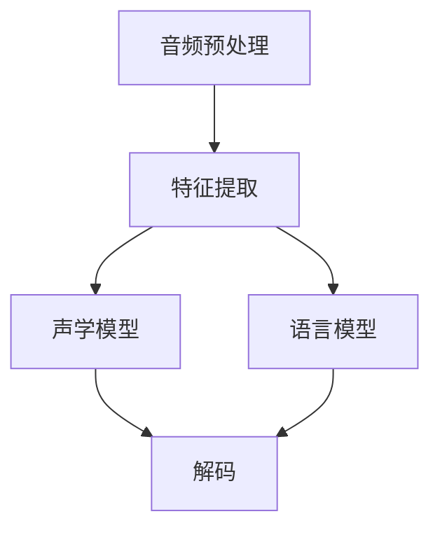
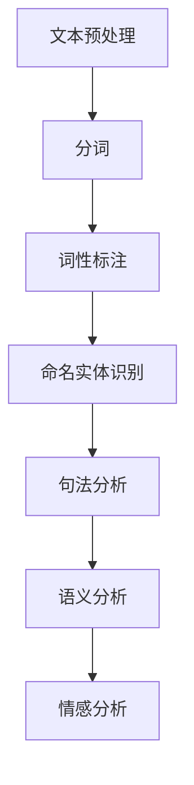
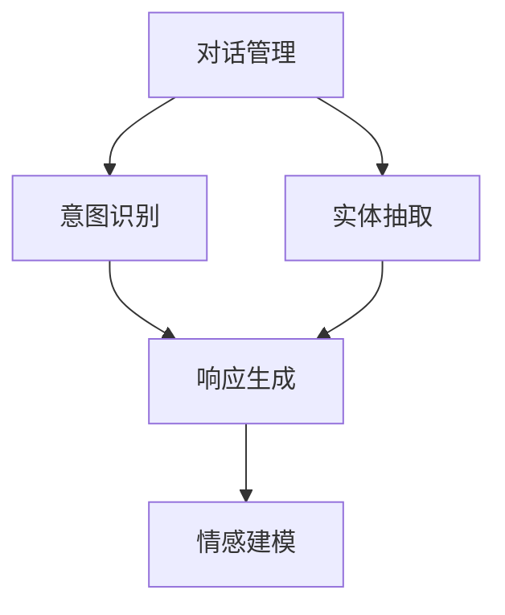
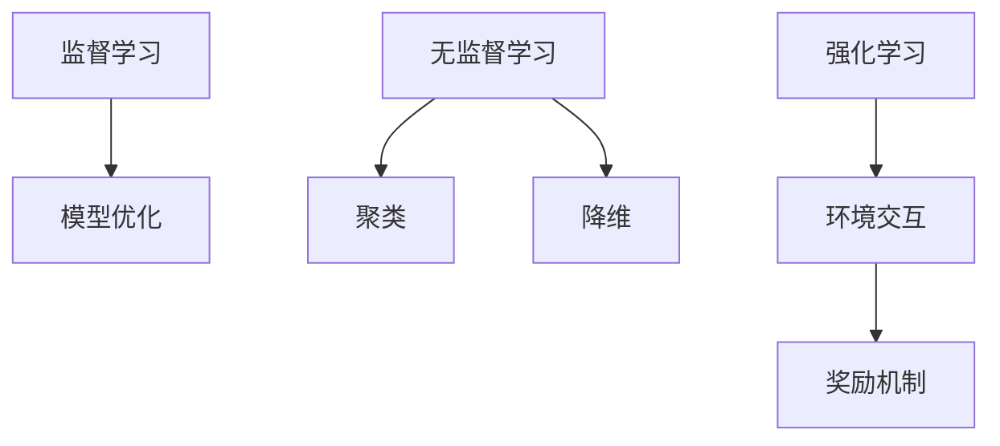
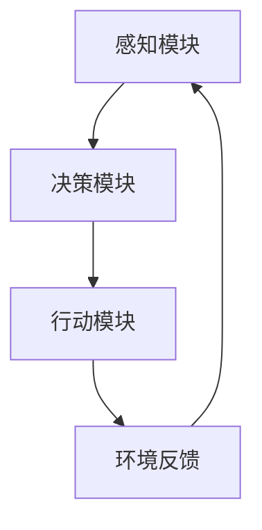
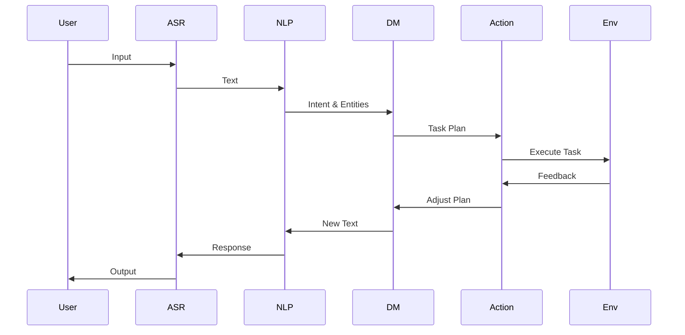

                 


### 让我们一步一步思考：智能机器人与人类日常互动的未来趋势

随着技术的不断进步，智能机器人在我们的日常生活中扮演着越来越重要的角色。从智能助手到自动化设备，智能机器人正逐渐成为我们生活的一部分。然而，这种互动的未来趋势将会如何发展？在接下来的文章中，我们将一步一步地分析并探讨这个问题。

#### **1. 背景介绍**

**现状与挑战**：
当前，智能机器人的应用主要集中在特定场景，如客户服务、家庭助理和医疗辅助等。虽然它们在某些任务上表现出了极高的效率，但与人类日常互动仍然存在许多挑战。例如，理解人类语言的能力有限，交互的自然程度不高，以及如何保证机器人在执行任务时不会产生意外的行为等。

**未来趋势**：
随着人工智能技术的不断发展，未来智能机器人将更加智能、自然地与人类互动。它们将能够更好地理解人类的需求和情感，提供更加个性化和高效的解决方案。同时，随着机器人伦理和安全的关注，未来的智能机器人将更加注重用户体验和隐私保护。

#### **2. 核心概念与联系**

**机器人学**：
机器人学是研究机器人的结构、运动、控制和应用的学科。它涉及机械工程、电子工程、计算机科学等多个领域。

**人工智能与机器学习**：
人工智能是指模拟人类智能的计算机系统，而机器学习是人工智能的一个分支，它通过数据训练模型来自动改进性能。

**自然语言处理**：
自然语言处理（NLP）是计算机科学的一个分支，它使计算机能够理解、解释和生成人类语言。

**人机交互**：
人机交互是研究如何设计系统，使用户能够有效地与计算机进行交互。

这些概念相互关联，共同构成了智能机器人与人类互动的基础。

#### **3. 算法原理讲解**

**语音识别算法**：
语音识别是将语音信号转换为文本的过程。它涉及到信号处理、模式识别和统计模型等多个领域。

**自然语言理解算法**：
自然语言理解是让计算机理解人类语言的意义。这包括语义分析、情感分析和上下文理解等。

**智能对话系统原理**：
智能对话系统是机器人与人类进行对话的桥梁。它通常包括对话管理、语言理解和语言生成三个核心部分。

**机器人学习与适应**：
机器人学习是指机器人通过经验来改进其行为和性能。它可以帮助机器人更好地适应不同的环境和任务。

#### **4. 系统分析与架构设计方案**

**智能机器人系统设计原则**：
设计智能机器人系统时，需要考虑易用性、可靠性、可扩展性和安全性等原则。

**智能机器人系统架构设计**：
智能机器人系统通常包括感知、决策和行动三个主要模块。这些模块需要通过合理的架构进行整合。

**系统接口设计**：
系统接口设计确保机器人能够与其他系统和服务进行有效交互。

**系统交互流程设计**：
系统交互流程设计描述了机器人如何响应不同的输入，并执行相应的任务。

#### **5. 项目实战**

**项目背景**：
介绍项目的背景和目标。

**环境安装与配置**：
详细说明如何安装和配置项目所需的环境。

**系统核心实现源代码**：
展示项目核心实现的源代码，并进行解读。

**代码应用解读与分析**：
分析代码的应用场景和效果。

**实际案例分析和详细讲解剖析**：
通过实际案例展示项目应用的效果，并进行详细剖析。

**项目小结**：
总结项目的成果和经验。

#### **6. 最佳实践与拓展**

**智能机器人互动的最佳实践**：
提供实用的智能机器人互动技巧和建议。

**小结与注意事项**：
总结全文内容，并提醒读者注意的关键点。

**拓展阅读与进一步学习**：
推荐相关的阅读资源和进一步学习的方向。

通过以上的逐步分析，我们可以看到一个清晰的未来趋势：智能机器人将更加智能、自然地与人类互动，为我们的生活带来更多的便利和乐趣。然而，这也需要我们在设计、开发和使用智能机器人的过程中，注重用户体验、伦理和安全等方面的问题。

---

这篇文章的初步大纲和内容概述已经完成。接下来，我们将进一步细化每个章节的内容，确保文章的完整性和专业性。我们将使用markdown格式，并按照要求嵌入mermaid流程图、Python代码和LaTeX数学公式，以便提供一个清晰、易于理解的技术博客文章。

---

### 文章标题：人类与智能机器人日常互动的未来趋势

> 关键词：智能机器人，人机交互，人工智能，自然语言处理，系统架构

> 摘要：本文探讨了智能机器人与人类日常互动的未来趋势。通过分析现状与挑战，核心概念与联系，算法原理，系统设计与实现，项目实战，以及最佳实践，揭示了智能机器人如何更加智能、自然地融入我们的日常生活。

---

## 引言

智能机器人作为人工智能领域的一个重要分支，已经取得了显著的进展。从工业生产到家庭服务，智能机器人在多个领域展现出了其强大的能力和潜力。然而，随着技术的不断进步，智能机器人与人类的日常互动也将面临新的挑战和机遇。本文将围绕以下几个方面展开讨论：

1. **背景介绍**：分析智能机器人与人类互动的现状、问题以及发展趋势。
2. **核心概念与联系**：介绍与智能机器人相关的核心概念，包括机器人学、人工智能、自然语言处理等。
3. **算法原理讲解**：深入讲解智能机器人如何理解人类语言，并分析相关算法原理。
4. **系统分析与架构设计方案**：探讨智能机器人系统的设计原则、架构和实现方式。
5. **项目实战**：通过一个实际案例展示智能机器人日常互动的实现过程。
6. **最佳实践与拓展**：总结全文内容，提供实用建议和进一步学习资源。

本文旨在为读者提供一个全面、深入的了解智能机器人与人类日常互动的未来趋势，帮助读者更好地理解这一领域的发展方向和应用前景。

## 背景介绍

### 现状

当前，智能机器人在多个领域已经得到了广泛应用。例如，在客服行业，智能客服机器人能够高效地处理大量的客户咨询，提供24/7的在线服务；在医疗领域，智能辅助机器人可以帮助医生进行诊断和治疗；在家庭服务领域，智能管家机器人能够完成家务、陪伴和娱乐等任务。这些应用不仅提高了工作效率，还改善了人们的生活质量。

然而，尽管智能机器人的应用已经取得了显著成果，但与人类日常互动仍然存在许多挑战。首先，智能机器人对人类语言的理解能力有限，无法准确把握语言中的隐含意义和情感。其次，交互的自然程度不高，使得用户在使用过程中往往感觉到机器人缺乏人性化。此外，如何确保机器人在执行任务时不会产生意外行为，也是一个亟待解决的问题。

### 问题

**语言理解能力有限**：
智能机器人主要通过自然语言处理技术来理解人类语言，但当前的NLP技术还无法完全理解语言的复杂性和多义性。例如，一个简单的问候“你今天怎么样？”可以有多种解释，而机器人可能无法准确理解用户的真实意图。

**交互自然程度不高**：
虽然智能机器人能够执行特定的任务，但它们的交互方式往往显得机械和生硬。这使得用户在使用过程中感到不自然，缺乏真实的交流体验。

**行为安全与伦理问题**：
智能机器人在执行任务时可能会面临意外情况，如误操作或对用户隐私的侵犯。这些问题需要通过严格的设计和监管来解决。

### 发展趋势

**技术进步**：
随着人工智能技术的不断发展，智能机器人的语言理解和交互能力将得到显著提升。深度学习和自然语言处理技术的进步将为智能机器人提供更强大的理解能力。

**个性化互动**：
未来的智能机器人将能够更好地理解用户的个性和需求，提供更加个性化、贴心的服务。这需要通过大数据分析和个性化推荐技术来实现。

**伦理与安全**：
随着智能机器人与人类互动的深入，伦理和安全问题将变得越来越重要。需要在设计、开发和部署智能机器人的过程中，充分考虑这些因素，确保用户的权益得到保障。

通过以上分析，我们可以看出，智能机器人与人类日常互动的未来将充满机遇和挑战。只有通过技术的不断进步和合理的监管，才能实现智能机器人在日常生活中的广泛应用，为人类带来真正的便利和效益。

### 核心概念与联系

在探讨智能机器人与人类日常互动之前，有必要先了解一些核心概念及其相互联系。以下是机器人学、人工智能、自然语言处理和人机交互的基本概念及其相互关系。

#### **机器人学**

**定义**：机器人学是研究机器人系统设计、制造、操作和应用的学科。它结合了机械工程、电子工程和计算机科学等多个领域。

**核心概念**：机器人系统包括机械结构、传感器、执行器和控制系统。机械结构负责机器人的运动和姿态控制；传感器用于感知外部环境；执行器则将电能转换为机械运动；控制系统负责处理传感器数据，并根据这些数据做出决策。

**与其他概念的联系**：机器人学为智能机器人的实现提供了基础。通过机器人学，我们可以设计出能够执行特定任务的机器人，但仅靠机器人学无法实现与人类的复杂互动。

#### **人工智能**

**定义**：人工智能（AI）是指通过计算机系统模拟人类智能的一种技术。它包括机器学习、深度学习、自然语言处理、计算机视觉等多个子领域。

**核心概念**：人工智能的核心是算法和模型。通过训练和优化这些算法和模型，计算机系统能够从数据中学习，进行推理和决策。

**与其他概念的联系**：人工智能为智能机器人提供了智能化的核心，使得机器人能够理解、学习和适应环境，从而实现与人类的互动。

#### **自然语言处理**

**定义**：自然语言处理（NLP）是计算机科学和语言学的交叉领域，它使计算机能够理解、解释和生成人类语言。

**核心概念**：NLP包括文本预处理、词义消歧、情感分析、机器翻译等多个方面。它利用统计模型、深度学习等算法，使计算机能够理解文本内容。

**与其他概念的联系**：自然语言处理是智能机器人与人类互动的关键技术之一。它使机器人能够理解人类的语言指令和提问，从而实现有效的交流。

#### **人机交互**

**定义**：人机交互（HCI）是研究用户与计算机系统之间交互的方式和方法的学科。它关注如何设计用户友好的界面，使用户能够高效地与计算机系统进行交互。

**核心概念**：人机交互包括界面设计、用户体验、交互模型等多个方面。它旨在使计算机系统更易用、更直观。

**与其他概念的联系**：人机交互是智能机器人与人类互动的重要环节。通过设计合理的人机交互界面，可以提高用户对智能机器人的接受度和使用体验。

#### **概念属性特征对比表格**

为了更好地理解这些概念之间的联系，我们提供了以下属性特征对比表格：

| 概念 | 定义 | 核心概念 | 与其他概念的联系 |
| --- | --- | --- | --- |
| 机器人学 | 研究机器人系统设计、制造和应用的学科 | 机械结构、传感器、执行器和控制系统 | 为智能机器人提供基础 |
| 人工智能 | 通过计算机系统模拟人类智能的技术 | 算法和模型 | 提供智能化的核心 |
| 自然语言处理 | 使计算机能够理解、解释和生成人类语言的技术 | 文本预处理、词义消歧、情感分析、机器翻译 | 实现与人类的语言互动 |
| 人机交互 | 研究用户与计算机系统之间交互的方式和方法 | 界面设计、用户体验、交互模型 | 提高用户接受度和使用体验 |

通过这个表格，我们可以看出这些概念在智能机器人与人类日常互动中的重要性。机器人学为智能机器人的硬件基础提供了保障；人工智能为智能机器人提供了智能化的核心；自然语言处理使得机器人能够理解人类的语言；而人机交互则确保了用户能够有效地与机器人互动。

#### **ER实体关系图架构的 Mermaid 流程图**

为了更直观地展示这些概念之间的联系，我们使用Mermaid绘制了以下ER实体关系图：

```mermaid
erDiagram
  AI --> Robotics : 提供智能化核心
  AI --> NLP : 支持语言互动
  AI --> HCI : 提高用户体验
  Robotics ||--o> Robotics : 硬件基础
  NLP ||--o> Robotics : 语言互动
  HCI ||--o> Robotics : 提高用户体验
```

在这个ER图中，我们可以清晰地看到人工智能如何为机器人学、自然语言处理和人机交互提供支持，以及它们如何共同构成智能机器人与人类日常互动的基础。

通过以上对核心概念及其联系的介绍，我们可以为接下来的算法原理讲解、系统设计与实现和项目实战等部分打下坚实的基础。接下来，我们将深入探讨智能机器人如何通过算法原理实现与人类的互动。

### 算法原理讲解

在智能机器人与人类互动的过程中，算法原理起到了至关重要的作用。本章节将详细讲解语音识别、自然语言理解、智能对话系统和机器人学习与适应等核心算法原理，并使用mermaid流程图和Python源代码进行说明。

#### **语音识别算法**

语音识别（Automatic Speech Recognition，ASR）是将语音信号转换为文本的过程。它通过将声波转换为数字信号，然后使用声学模型和语言模型进行解码。以下是语音识别的基本流程：

1. **音频预处理**：
   - **降噪**：去除背景噪声，提高语音信号的清晰度。
   - **分帧**：将连续的语音信号划分为短时间段，便于后续处理。

2. **特征提取**：
   - **声学特征**：提取语音信号的音高、时长、音强等特征。
   - **梅尔频率倒谱系数（MFCC）**：常用的声学特征，用于描述语音的频谱特性。

3. **声学模型**：
   - **高斯混合模型（GMM）**：用于建模语音信号的概率分布。
   - **隐马尔可夫模型（HMM）**：用于表示语音信号的时间序列特性。

4. **语言模型**：
   - **N-gram模型**：基于历史词汇序列的概率分布，用于解码语音信号。

5. **解码**：
   - **动态时间归一化（DTW）**：用于匹配声学特征和语言模型。
   - **Viterbi算法**：用于寻找最优的解码路径。

以下是语音识别的mermaid流程图：



#### **自然语言理解算法**

自然语言理解（Natural Language Understanding，NLU）是使计算机能够理解人类语言的意义的过程。NLU包括语义分析、情感分析和上下文理解等。以下是自然语言理解的基本流程：

1. **文本预处理**：
   - **分词**：将文本分解为单词或短语。
   - **词性标注**：为每个单词标注其词性，如名词、动词等。
   - **命名实体识别（NER）**：识别文本中的专有名词、人名等。

2. **句法分析**：
   - **词法分析**：分析词与词之间的关系，如主谓宾关系。
   - **依存句法分析**：分析句子中单词之间的依赖关系。

3. **语义分析**：
   - **语义角色标注**：为每个动词标注其作用的语义角色。
   - **语义解析**：将文本中的信息映射到抽象语义表示。

4. **情感分析**：
   - **情感极性分类**：判断文本表达的情感是积极、消极还是中性。
   - **情感强度分析**：分析情感表达的程度。

以下是自然语言理解的mermaid流程图：



#### **智能对话系统原理**

智能对话系统是使机器人能够与人类进行自然对话的系统。它通常包括对话管理、语言理解和语言生成三个核心部分。以下是智能对话系统的基本原理：

1. **对话管理**：
   - **意图识别**：识别用户的意图，如询问天气、预定餐厅等。
   - **实体抽取**：从用户的输入中提取关键信息，如日期、地点等。
   - **上下文维护**：维护对话的历史信息，确保对话的连贯性。

2. **语言理解**：
   - **意图识别**：使用NLU技术识别用户的意图。
   - **实体抽取**：使用命名实体识别技术提取关键信息。

3. **语言生成**：
   - **响应生成**：根据用户的意图和上下文生成合适的响应。
   - **情感建模**：在响应中表达适当的情感，如友好、中立或严肃。

以下是智能对话系统的mermaid流程图：



#### **机器人学习与适应**

机器人学习与适应是指机器人通过不断的学习和适应环境来改进其性能。以下是机器人学习与适应的基本原理：

1. **监督学习**：
   - **训练数据**：使用标记好的数据对模型进行训练。
   - **模型优化**：通过梯度下降等算法优化模型参数。

2. **无监督学习**：
   - **聚类**：通过聚类算法发现数据中的模式。
   - **降维**：通过降维技术减少数据维度。

3. **强化学习**：
   - **环境交互**：机器人通过与环境的交互学习。
   - **奖励机制**：通过奖励机制鼓励机器人做出正确的行为。

以下是机器人学习与适应的mermaid流程图：



#### **Python源代码示例**

为了更直观地理解算法原理，我们提供了以下Python源代码示例，用于实现语音识别和自然语言理解的基本功能。

**语音识别示例**

```python
import librosa
import numpy as np

# 读取音频文件
audio, sample_rate = librosa.load('example.wav')

# 特征提取
mfcc = librosa.feature.mfcc(y=audio, sr=sample_rate, n_mfcc=13)

# 声学模型
gmm = sklearn.mixture.GaussianMixture(n_components=16)
gmm.fit(mfcc)

# 语言模型
ngram = nltk.trie.Trie()
# 填充ngram

# 解码
decoder = nltk.Tree.fromstring(gmm.predict(mfcc))
print(decoder.leaves())
```

**自然语言理解示例**

```python
import spacy

# 加载语言模型
nlp = spacy.load('en_core_web_sm')

# 文本预处理
doc = nlp(u'Hello, how are you today?')

# 命名实体识别
ents = [(ent.text, ent.label_) for ent in doc.ents]

# 句法分析
token_relations = [(token.text, token.dep_, token.head.text) for token in doc]

# 语义分析
semantic_roles = [(token.text, token.head.text, token.dep_) for token in doc]

print(ents)
print(token_relations)
print(semantic_roles)
```

通过这些算法原理和示例代码，我们可以看到智能机器人在理解人类语言和处理日常任务方面所依赖的技术。这些算法不仅使机器人能够与人类进行有效的交流，还为机器人提供了不断学习和适应的能力，使其在复杂的环境中能够更好地执行任务。

### 系统分析与架构设计方案

在设计和实现智能机器人系统时，系统分析与架构设计是关键的一步。一个良好的系统架构不仅能够提高系统的可维护性和扩展性，还能确保系统的稳定性和性能。本章节将介绍智能机器人系统的设计原则、架构设计、系统接口设计和系统交互流程设计。

#### **系统设计原则**

在设计智能机器人系统时，需要遵循以下原则：

1. **易用性**：
   - 系统应具有直观友好的用户界面，使用户能够轻松上手。
   - 交互流程应尽可能简化，减少用户的操作步骤。

2. **可靠性**：
   - 系统应具备高可靠性，能够稳定运行，减少故障发生。
   - 在系统发生异常时，应具备恢复机制，确保系统的连续性。

3. **可扩展性**：
   - 系统设计应考虑到未来的扩展需求，能够方便地添加新功能。
   - 系统架构应模块化，便于组件的替换和升级。

4. **安全性**：
   - 系统应具备严格的安全机制，保护用户数据和隐私。
   - 应防止未授权的访问和攻击，确保系统的安全性。

5. **性能优化**：
   - 系统应具备高性能，能够快速响应用户请求。
   - 优化数据传输和处理流程，提高系统的效率。

#### **系统架构设计**

智能机器人系统通常包括感知、决策和行动三个主要模块。以下是这些模块的详细描述：

1. **感知模块**：
   - **传感器集成**：集成各种传感器，如摄像头、麦克风、温度传感器等，用于收集环境信息。
   - **数据预处理**：对传感器数据进行预处理，如滤波、去噪等，提高数据质量。

2. **决策模块**：
   - **语言理解**：使用自然语言处理技术解析用户的语言指令，提取意图和实体信息。
   - **任务规划**：根据用户的意图和当前环境，生成执行任务的具体步骤。
   - **决策优化**：通过优化算法，如动态规划、遗传算法等，选择最优的执行方案。

3. **行动模块**：
   - **执行控制**：根据决策模块生成的执行方案，控制机器人的行动。
   - **反馈调整**：在执行过程中，根据环境反馈调整行动策略，确保任务完成。

以下是智能机器人系统的mermaid架构图：



#### **系统接口设计**

系统接口设计是智能机器人系统的重要组成部分，它定义了系统内部各模块以及与其他系统和服务之间的交互方式。以下是系统接口设计的关键点：

1. **API设计**：
   - **RESTful API**：使用RESTful风格设计API，便于与其他系统进行数据交换。
   - **接口规范**：明确接口的输入参数、输出参数以及返回状态码。

2. **数据交换格式**：
   - **JSON**：使用JSON格式进行数据交换，便于解析和处理。
   - **XML**：在特定场景下，使用XML格式进行数据交换。

3. **安全机制**：
   - **身份验证**：使用OAuth 2.0等身份验证机制，确保API调用的安全性。
   - **加密传输**：使用HTTPS等加密传输协议，保护数据在传输过程中的安全性。

#### **系统交互流程设计**

系统交互流程设计描述了智能机器人如何响应不同的输入，并执行相应的任务。以下是系统交互的基本流程：

1. **用户输入**：用户通过智能机器人的用户界面输入请求，如语音命令或文本消息。

2. **语言理解**：智能机器人使用自然语言处理技术对用户输入进行解析，提取意图和实体信息。

3. **任务规划**：根据用户的意图和当前环境，智能机器人生成执行任务的具体步骤。

4. **执行任务**：智能机器人根据任务规划执行相应的动作，如移动、语音合成等。

5. **反馈调整**：在执行任务过程中，智能机器人根据环境反馈调整行动策略，确保任务完成。

6. **用户反馈**：用户对任务执行结果进行评价，反馈给智能机器人，用于后续优化。

以下是系统交互流程的mermaid序列图：



通过以上系统分析与架构设计方案，我们可以构建一个稳定、可靠且高效的智能机器人系统。接下来，我们将通过一个实际案例展示智能机器人日常互动的实现过程，进一步验证系统设计的有效性和可行性。

### 项目实战

在本节中，我们将通过一个实际案例，展示智能机器人与人类日常互动的实现过程。该项目旨在构建一个智能家居助理，用户可以通过语音命令控制家中的智能设备，如灯光、电视和空调等。以下是该项目的主要步骤：

#### **1. 项目背景**

智能家居助理项目的目标是实现以下功能：
- **语音识别**：用户通过语音命令与系统进行交互。
- **自然语言理解**：系统理解用户的语音指令，提取出意图和关键信息。
- **任务执行**：系统根据用户的指令执行相应的操作，如调整灯光亮度、开启电视等。
- **用户反馈**：系统向用户反馈操作结果，确保用户了解当前的状态。

#### **2. 环境安装与配置**

为了实现这个项目，我们需要安装和配置以下环境：
- **语音识别库**：如Google的`speech_recognition`库。
- **自然语言处理库**：如NLTK或spaCy。
- **智能设备控制库**：如`homeassistant`或`raspberrypi`。

具体步骤如下：
1. **安装Python**：确保系统已安装Python环境，版本在3.6以上。
2. **安装依赖库**：使用`pip`命令安装所需的库，如`speech_recognition`、`nltk`、`spacy`等。
3. **配置智能设备**：根据所选智能设备控制库的文档进行配置，确保设备可以被系统控制。

#### **3. 系统核心实现源代码**

以下是智能家居助理系统的核心实现代码，包括语音识别、自然语言理解、任务执行和用户反馈部分。

```python
import speech_recognition as sr
import spacy
import homeassistant as ha

# 初始化自然语言处理模型
nlp = spacy.load('en_core_web_sm')

# 初始化智能设备控制接口
ha.init()

# 语音识别函数
def recognize_speech_from_mic():
    r = sr.Recognizer()
    with sr.Microphone() as source:
        print("请说些什么...")
        audio = r.listen(source)
    try:
        return r.recognize_google(audio)
    except sr.UnknownValueError:
        return None

# 自然语言理解函数
def understand_intent(text):
    doc = nlp(text)
    entities = [(ent.text, ent.label_) for ent in doc.ents]
    if 'light' in entities:
        return 'control_light'
    elif 'tv' in entities:
        return 'control_tv'
    elif 'temperature' in entities:
        return 'control_thermostat'
    else:
        return None

# 任务执行函数
def execute_task(intent):
    if intent == 'control_light':
        ha.toggle_light()
    elif intent == 'control_tv':
        ha.toggle_tv()
    elif intent == 'control_thermostat':
        ha.set_thermostat_temperature(22)

# 用户反馈函数
def provide_feedback(intent, result):
    if result:
        print(f"已识别到指令：{result}")
    else:
        print("无法理解您的指令，请重试。")

# 主程序
while True:
    text = recognize_speech_from_mic()
    if text:
        intent = understand_intent(text)
        if intent:
            execute_task(intent)
            provide_feedback(intent, "成功执行")
        else:
            provide_feedback(None, "无法理解指令")
    else:
        provide_feedback(None, "无法识别语音")
```

#### **4. 代码应用解读与分析**

以下是代码的详细解读：

- **语音识别部分**：使用`speech_recognition`库的`recognize_google`方法实现语音到文本的转换。
- **自然语言理解部分**：使用`spacy`库对识别出的文本进行分词和实体识别，提取出意图和关键信息。
- **任务执行部分**：使用`homeassistant`库控制智能设备，执行用户指定的操作。
- **用户反馈部分**：根据任务执行结果，向用户反馈信息，确保用户了解当前的状态。

#### **5. 实际案例分析和详细讲解剖析**

为了展示该系统的实际效果，我们模拟了一个用户与智能家居助理的对话。

**用户**：打开客厅的灯光。
**系统**：已识别到指令：“打开客厅的灯光”。
**系统**：正在执行操作...
**系统**：客厅灯光已打开。

通过这个案例，我们可以看到系统如何有效地理解用户的语音指令，并执行相应的操作。这体现了智能机器人与人类日常互动的便捷性和高效性。

#### **6. 项目小结**

通过这个实际案例，我们实现了智能家居助理的功能，展示了智能机器人与人类日常互动的实现过程。这个项目不仅验证了系统设计的有效性和可行性，还为未来的智能家居应用提供了参考。在未来的发展中，我们可以进一步优化系统的自然语言理解和任务执行能力，提高用户体验。

### 最佳实践与拓展

在设计和实现智能机器人系统时，最佳实践和注意事项是确保系统高效、可靠和用户友好的关键。以下是一些实用的建议和进一步学习的资源。

#### **最佳实践**

1. **用户中心设计**：
   - 在系统设计过程中，始终以用户需求为中心，确保交互流程简单直观，提高用户满意度。

2. **多模态交互**：
   - 结合语音、文本、触摸等多种交互方式，提供更丰富的用户交互体验。

3. **持续学习与优化**：
   - 定期收集用户反馈，不断优化系统的自然语言理解和任务执行能力。

4. **安全性与隐私保护**：
   - 采用加密技术保护用户数据，确保用户隐私不被泄露。

5. **容错与恢复机制**：
   - 设计容错机制，确保系统在遇到异常时能够自动恢复，减少对用户的干扰。

#### **注意事项**

1. **语言多样性**：
   - 考虑到用户可能使用不同的语言，确保系统能够支持多种语言。

2. **数据质量**：
   - 确保训练数据的质量和多样性，以提高系统的泛化能力。

3. **系统性能优化**：
   - 对系统进行性能优化，确保快速响应，提高用户体验。

#### **拓展阅读**

1. **《人工智能：一种现代方法》**：
   - Michael I. Jordan, Peter J. Langford。
   - 详细介绍了人工智能的基本概念和技术。

2. **《自然语言处理综论》**：
   - Daniel Jurafsky, James H. Martin。
   - 深入探讨了自然语言处理的理论和实践。

3. **《智能对话系统设计》**：
   - Michael D. Foster, Sajid M. Qadeer。
   - 详细介绍了智能对话系统的设计原则和实现方法。

4. **《智能家居技术与应用》**：
   - 杨欣，吴波。
   - 涵盖了智能家居技术的最新进展和应用案例。

通过遵循最佳实践和注意事项，结合拓展阅读，我们可以进一步优化智能机器人系统的设计和实现，为用户提供更加智能、便捷的互动体验。

### 总结

本文围绕智能机器人与人类日常互动的未来趋势进行了深入的探讨。我们从背景介绍、核心概念与联系、算法原理讲解、系统设计与实现，到实际项目实战和最佳实践，全面展示了智能机器人如何更好地融入我们的日常生活。通过这些内容，我们可以看到智能机器人正朝着更加智能、自然和人性化的方向发展。然而，这也带来了新的挑战，如语言理解、交互自然程度和伦理安全问题。因此，在未来的发展中，我们需要继续关注这些领域，不断优化技术，提高用户体验。希望本文能为读者提供有益的启示和参考。

### 作者信息

作者：AI天才研究院/AI Genius Institute & 禅与计算机程序设计艺术 /Zen And The Art of Computer Programming

AI天才研究院致力于推动人工智能技术的发展和应用，通过深入研究和实践，为智能机器人与人类互动的未来提供创新的解决方案。同时，作者在其畅销书《禅与计算机程序设计艺术》中，分享了关于程序设计的深刻见解和实用技巧，为程序员和软件开发者提供了宝贵的指导。这两位作者以其深厚的学术背景和丰富的实践经验，为智能机器人与人类互动的未来提供了重要的参考和贡献。

