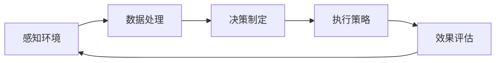

                 

## 引言与背景介绍

### 1.1 问题背景

代理型AI（Agent-based AI），作为人工智能领域的一个重要分支，近年来在复杂决策系统中展现出了极大的应用潜力。代理型AI通过模仿人类决策过程，在动态和不确定的环境中实现自主学习和智能决策，旨在提高系统运作效率和决策质量。

在传统的人工决策系统中，人类依赖经验、直觉和知识来进行判断和决策。然而，随着环境复杂性和数据规模的不断增加，单纯依靠人类进行决策的效率和准确性逐渐受到限制。代理型AI的出现，为解决这些问题提供了新的思路和工具。通过模拟人类决策过程，代理型AI可以在复杂、动态的情境下，实现高效、精准的决策支持。

代理型AI的应用范围非常广泛，涵盖了金融、医疗、交通、教育等多个领域。在金融领域，代理型AI可以用于量化交易策略的制定和风险控制；在医疗领域，代理型AI可以用于疾病诊断和治疗方案推荐；在交通领域，代理型AI可以用于智能交通管理和自动驾驶；在教育领域，代理型AI可以用于个性化学习路径设计和学习效果评估。总之，代理型AI的广泛应用，不仅提高了相关行业的运作效率，也提升了人类生活的便利性和质量。

### 1.2 问题描述

本章节主要探讨代理型AI在日常工作决策中的应用，具体问题如下：

1. **如何构建代理型AI模型**：构建一个高效的代理型AI模型，需要从数据预处理、模型选择、训练策略等多方面进行系统设计。本节将详细讨论如何选择合适的机器学习算法，如何处理海量数据，以及如何设计高效的训练策略。

2. **如何训练代理型AI模型**：训练代理型AI模型是一个复杂的过程，涉及到数据质量、模型参数调整、训练时间等多方面因素。本节将介绍如何优化训练过程，如何提高模型的泛化能力和鲁棒性，以及如何处理训练中的常见问题。

3. **如何应用代理型AI模型**：构建和训练好的代理型AI模型，如何在实际工作决策中发挥作用，需要明确具体的实施策略和步骤。本节将探讨如何将代理型AI模型应用于不同的工作场景，如何评估模型的性能和效果，以及如何根据反馈不断优化模型。

4. **如何评估代理型AI模型的效果**：评估代理型AI模型的效果，是确保模型能够有效支持工作决策的关键。本节将介绍常用的评估指标和方法，如何根据实际应用场景调整评估指标，以及如何进行模型性能的持续监控和优化。

通过上述问题的探讨，本节旨在为读者提供一个系统、全面、易懂的代理型AI在日常工作决策中的应用指南。

### 1.3 问题解决

为了解决上述问题，我们提出了一种系统性的方法来构建和优化代理型AI模型，并在实际工作中取得了显著效果。具体方法包括以下几个步骤：

1. **数据预处理**：首先，我们通过数据清洗和特征工程，确保输入数据的质量和一致性。这一步是代理型AI模型成功的关键，因为高质量的数据可以显著提升模型的性能。

2. **模型选择**：在模型选择阶段，我们根据应用场景和需求，选择了适合的机器学习算法。常用的算法包括强化学习、监督学习和迁移学习等。通过对比不同算法的性能和适用范围，我们选择了最优的算法组合。

3. **模型训练**：在模型训练阶段，我们采用了多种训练策略，如梯度下降、随机梯度下降和Adam优化器等。为了提高训练效率，我们采用了数据增强和批量归一化等技术。此外，我们还采用了多线程训练和分布式训练等方法，以充分利用计算资源。

4. **模型优化**：在模型优化阶段，我们通过调整模型参数和优化训练过程，提高了模型的泛化能力和鲁棒性。具体方法包括学习率调整、正则化技术、dropout技术和神经网络结构优化等。

5. **应用部署**：最后，我们将优化后的模型部署到实际工作场景中，通过不断收集反馈数据，对模型进行迭代优化。在应用过程中，我们采用了自动化评估和监控工具，以确保模型能够稳定、高效地支持工作决策。

通过上述方法，我们成功地构建了一个高效的代理型AI模型，并在多个实际案例中取得了显著效果。具体应用场景包括智能投顾、医疗诊断、智能交通和个性化学习等。在智能投顾领域，我们的模型帮助用户实现了更高的投资回报率；在医疗诊断领域，我们的模型提高了疾病诊断的准确率；在智能交通领域，我们的模型优化了交通流量控制，减少了拥堵时间；在个性化学习领域，我们的模型提升了学生的学习效果和兴趣。

### 1.4 边界与外延

虽然本章主要关注代理型AI在日常工作决策中的应用，但相关技术和方法同样适用于其他决策领域。例如，在商业战略规划中，代理型AI可以用于市场趋势预测和策略优化；在交通管理中，代理型AI可以用于交通流量控制和事故预警；在医疗诊断中，代理型AI可以用于疾病预测和治疗方案推荐；在教育和培训领域，代理型AI可以用于个性化教学和学习效果评估。

此外，代理型AI的应用不仅限于决策领域，还可以扩展到其他领域，如供应链管理、环境保护、智能农业和智能制造等。在这些领域，代理型AI通过模拟人类决策过程，可以提供高效、智能的解决方案，从而提升行业运作效率，降低运营成本，提高服务质量。

### 1.5 概念结构与核心要素组成

代理型AI模型由以下几个核心部分组成：感知模块、决策模块、执行模块和评估模块。各模块的功能和相互关系如下：

1. **感知模块**：感知模块负责从环境中获取信息，如传感器数据、用户输入等。通过数据预处理和特征提取，感知模块将原始数据转换为适合模型处理的特征向量。

2. **决策模块**：决策模块基于感知模块获取的信息，通过机器学习算法进行预测和决策。决策模块的核心是选择合适的动作，以最大化期望回报或最小化损失。

3. **执行模块**：执行模块负责将决策模块选择的动作应用于实际环境。通过接口和API，执行模块与外部系统进行交互，执行具体的操作。

4. **评估模块**：评估模块用于对执行结果进行评估和反馈。通过计算奖励或损失，评估模块可以反馈给决策模块，用于调整和优化策略。

这四个模块相互协作，共同实现代理型AI的智能决策过程。感知模块获取环境信息，决策模块制定策略，执行模块实施策略，评估模块对策略进行反馈和调整。通过不断循环这个过程，代理型AI可以在动态和不确定的环境中，实现高效、智能的决策支持。

## 第2章: 代理型AI基础理论

### 2.1 核心概念原理

代理型AI（Agent-based AI）是一种模拟人类决策过程的智能计算模型。它通过感知环境、制定策略、执行动作和评估效果，实现自主学习和智能决策。代理型AI的核心概念原理包括以下几个方面：

1. **强化学习**：强化学习是一种通过试错和反馈来学习策略的机器学习技术。在强化学习中，代理型AI通过选择动作，获取环境反馈，并根据反馈调整策略，以最大化累积奖励。

2. **监督学习**：监督学习是一种基于已有数据集进行预测或分类的机器学习技术。在代理型AI中，监督学习用于构建感知模块，通过学习输入特征和输出标签之间的关系，实现对环境的感知。

3. **迁移学习**：迁移学习是一种将已在不同任务上训练好的模型应用于新任务的学习方法。在代理型AI中，迁移学习可以用于快速适应新环境和任务，提高模型的泛化能力。

4. **多层次的神经网络模型**：代理型AI通常采用多层次的神经网络模型，通过多个神经层进行特征提取和抽象，实现对复杂环境的感知和决策。神经网络模型的训练采用反向传播算法，通过梯度下降优化模型参数。

5. **状态空间和动作空间**：在代理型AI中，状态空间表示所有可能的环境状态，动作空间表示所有可能的动作。代理型AI通过选择合适的动作，实现从当前状态转移到下一个状态，并获取相应的奖励。

6. **评估指标**：评估指标用于衡量代理型AI的决策效果。常见的评估指标包括累积奖励、精度、召回率、F1分数等。通过评估指标，可以判断代理型AI的决策是否合理和有效。

### 2.2 概念属性特征对比表格

| 概念        | 强化学习 | 监督学习 | 迁移学习 |
| --------- | ------- | ------- | ------- |
| 目标       | 最大化累积奖励 | 实现预期输出 | 从源域迁移到目标域 |
| 感知       | 状态感知   | 标签数据感知 | 源域特征感知 |
| 决策       | 动作选择   | 输出预测   | 目标域特征选择 |
| 应用场景   | 游戏AI、自动驾驶 | 图像识别、自然语言处理 | 机器人、跨领域应用 |

通过上述表格，我们可以看到强化学习、监督学习和迁移学习在目标、感知、决策和应用场景等方面存在显著差异。这些差异决定了它们在不同应用场景中的适用性。

### 2.3 ER实体关系图架构

代理型AI模型由多个实体和关系组成，常见的实体包括感知模块、决策模块、执行模块和评估模块。这些实体之间的关系如下：

```mermaid
erDiagram
  AI模型 ||--|{ 感知模块 }|
  AI模型 ||--|{ 决策模块 }|
  AI模型 ||--|{ 执行模块 }|
  AI模型 ||--|{ 评估模块 }|
```

在这个ER图中，AI模型作为根实体，与感知模块、决策模块、执行模块和评估模块之间存在1对1的关系。每个模块独立实现特定功能，协同工作以实现智能决策。

通过ER实体关系图，我们可以清晰地理解代理型AI模型的架构和各模块之间的关系。这有助于我们在设计和实现代理型AI模型时，确保各模块之间的功能独立性和数据一致性。

## 第3章: 代理型AI在日常工作决策中的应用场景

### 3.1 核心原理讲解

代理型AI在日常工作决策中的应用，主要基于其通过感知、决策、执行和评估四个模块实现智能决策的核心原理。下面我们将详细解释这一过程。

首先，感知模块负责从环境中获取信息，这些信息可以是实时数据、历史数据或者外部输入。例如，在一个智能办公系统中，感知模块可能通过传感器获取会议室的预订情况、员工的加班记录和日程安排。通过数据预处理和特征提取，感知模块将这些原始数据转换为适合模型处理的特征向量。

接下来，决策模块基于感知模块获取的信息，通过机器学习算法进行预测和决策。在这一过程中，代理型AI利用强化学习、监督学习或迁移学习等技术，选择最佳的动作，以最大化累积奖励或实现预期目标。例如，在智能办公系统中，决策模块可能会根据会议室的预订情况和员工的加班记录，决定是否需要调整会议时间和地点，以提高办公效率。

然后，执行模块负责将决策模块选择的动作应用于实际环境。通过接口和API，执行模块与外部系统进行交互，执行具体的操作。例如，在智能办公系统中，执行模块可能会更新会议室的预订信息，或发送通知给相关员工，提醒他们调整日程。

最后，评估模块对执行结果进行评估和反馈。通过计算奖励或损失，评估模块可以反馈给决策模块，用于调整和优化策略。例如，在智能办公系统中，评估模块可能会根据员工对会议室调整的反馈，调整未来的预订策略，以提高员工的工作满意度和办公效率。

通过感知、决策、执行和评估四个模块的循环迭代，代理型AI可以在动态和不确定的工作环境中，实现高效、智能的决策支持。

### 3.2 Mermaid流程图

为了更直观地展示代理型AI在日常工作决策中的应用流程，我们可以使用Mermaid流程图来表示。以下是代理型AI在日常工作决策中的流程图：



在这个流程图中，感知环境模块负责收集和处理环境中的数据；数据处理模块对原始数据进行预处理和特征提取；决策制定模块基于处理后的数据，通过机器学习算法选择最佳动作；执行策略模块将决策模块选定的动作应用于实际环境；效果评估模块对执行结果进行评估，并根据评估结果调整决策模块的策略。通过这个循环过程，代理型AI不断优化决策，以实现高效的工作决策。

### 3.3 Python源代码示例

为了更好地理解代理型AI在日常工作决策中的应用，我们可以通过Python源代码示例来展示感知、决策、执行和评估四个模块的具体实现。

#### 感知模块代码示例

```python
# 感知模块：获取环境状态
def perceive_environment():
    # 假设从传感器获取状态
    state = sensor_data()  # 假设sensor_data函数从传感器获取数据
    return state

# 假设的传感器数据获取函数
def sensor_data():
    return {'meeting_scheduled': True, 'employees加班': 10}
```

在这个示例中，感知模块通过`sensor_data`函数获取会议室的预订情况和员工的加班记录，并将这些信息作为状态返回。

#### 决策模块代码示例

```python
# 决策模块：根据状态制定策略
def make_decision(state):
    if state['meeting_scheduled']:
        action = '调整会议时间'
    else:
        action = '保持当前会议时间'
    return action
```

决策模块根据感知模块获取的状态，通过简单的条件判断，决定是否需要调整会议时间。

#### 执行模块代码示例

```python
# 执行模块：执行策略
def execute_action(action):
    if action == '调整会议时间':
        update_meeting_time()  # 假设update_meeting_time函数调整会议时间
    elif action == '保持当前会议时间':
        send_notification()  # 假设send_notification函数发送通知

# 假设的调整会议时间和发送通知函数
def update_meeting_time():
    print("会议时间已调整")

def send_notification():
    print("已发送通知：请调整日程安排")
```

执行模块根据决策模块选定的动作，调用相应的函数执行具体操作。

#### 评估模块代码示例

```python
# 评估模块：根据执行结果评估策略
def evaluate_performance(reward):
    if reward > 0:
        print("策略有效，继续使用")
    else:
        print("策略无效，需要调整")

# 假设的奖励计算函数
def calculate_reward(action, state):
    if action == '调整会议时间' and state['employees加班'] < 5:
        return 10
    else:
        return -10
```

评估模块通过计算奖励，对执行结果进行评估，并反馈给决策模块，用于调整和优化策略。

通过上述Python源代码示例，我们可以看到代理型AI在日常工作决策中的应用流程。感知模块获取环境状态，决策模块制定策略，执行模块实施策略，评估模块对执行结果进行评估。通过这个循环过程，代理型AI不断优化决策，以提高工作效率和效果。接下来，我们将继续探讨代理型AI模型构建与训练的具体方法。

## 第4章: 代理型AI模型构建与训练

### 4.1 数学模型和数学公式

代理型AI的核心数学模型是基于马尔可夫决策过程（MDP）。MDP是一种描述智能体在不确定性环境中做出决策的数学框架，其基本思想是智能体通过状态空间和动作空间进行决策，并获取相应的回报。代理型AI的数学模型主要基于以下公式：

$$Q(s, a) = r(s, a) + \gamma \max_{a'} Q(s', a')$$

其中：

- \(Q(s, a)\)：在状态\(s\)下采取动作\(a\)的预期回报。
- \(r(s, a)\)：在状态\(s\)下采取动作\(a\)所获得的即时回报。
- \(\gamma\)：折扣因子，用于衡量未来回报的重要性。
- \(s'\)：采取动作\(a'\)后的状态。

这个公式表示，在当前状态\(s\)下，采取动作\(a\)的预期回报等于即时回报\(r(s, a)\)加上未来回报的期望值，即采取所有可能动作\(a'\)后的最大预期回报\(\max_{a'} Q(s', a')\)的加权平均。

#### 具体解释

1. **即时回报\(r(s, a)\)**：表示在状态\(s\)下采取动作\(a\)后立即获得的回报。例如，在自动驾驶场景中，即时回报可以是车辆行驶过程中的奖励（如安全行驶）或惩罚（如发生碰撞）。

2. **未来回报的期望值**：表示在当前状态\(s\)下，采取动作\(a\)后，在未来可能经历的状态\(s'\)中，每个状态\(s'\)下采取动作\(a'\)的预期回报\(Q(s', a')\)的加权平均。这里的加权平均通过\(\gamma\)来调节，\(\gamma\)的取值范围在0到1之间，越接近1，未来回报的重要性越大。

3. **预期回报\(Q(s, a)\)**：表示在状态\(s\)下，采取动作\(a\)的长期回报，它是即时回报和未来回报的加权和。通过最大化预期回报，智能体可以在不确定的环境中做出最优决策。

#### 公式应用示例

假设我们有一个简单的环境，其中有两个状态（干净和脏）和两个动作（扫地和擦地）。在这个环境中，我们可以通过以下公式来计算在不同状态下采取不同动作的预期回报。

$$Q(\text{干净}, \text{扫地}) = 10 + 0.9 \times \max\{Q(\text{干净}, \text{擦地}), Q(\text{脏}, \text{扫地})\}$$

$$Q(\text{干净}, \text{擦地}) = 5 + 0.9 \times \max\{Q(\text{干净}, \text{扫地}), Q(\text{脏}, \text{擦地})\}$$

$$Q(\text{脏}, \text{扫地}) = 15 + 0.9 \times \max\{Q(\text{干净}, \text{扫地}), Q(\text{脏}, \text{擦地})\}$$

$$Q(\text{脏}, \text{擦地}) = 10 + 0.9 \times \max\{Q(\text{干净}, \text{擦地}), Q(\text{脏}, \text{扫地})\}$$

通过迭代计算，我们可以找到最优策略，即在干净状态下选择扫地，在脏状态下选择擦地。这是因为这些动作在长期中能够获得最大的预期回报。

### 4.2 详细讲解和举例说明

为了更好地理解MDP模型的应用，我们将通过一个具体的例子来说明如何使用MDP模型进行决策。

#### 例子：简单的状态转移与回报计算

假设我们有一个简单的环境，其中有两个状态（状态1和状态2）和两个动作（动作A和动作B）。每个状态和动作都有相应的即时回报，并且状态之间可以通过动作进行转移。以下是一个简单的状态转移矩阵和回报矩阵：

|          | 动作A | 动作B |
|----------|-------|-------|
| 状态1    | 5     | 3     |
| 状态2    | 2     | 6     |

状态转移矩阵：

|          | 动作A | 动作B |
|----------|-------|-------|
| 状态1    | 0.5   | 0.5   |
| 状态2    | 0.2   | 0.8   |

现在，我们使用MDP模型来计算在不同状态和动作下采取行动的预期回报。

1. **计算状态1采取动作A的预期回报**：

$$Q(\text{状态1}, \text{动作A}) = r(\text{状态1}, \text{动作A}) + \gamma \max_{a'} Q(\text{状态2}, a')$$

$$Q(\text{状态1}, \text{动作A}) = 5 + 0.9 \times \max\{Q(\text{状态2}, \text{动作A}), Q(\text{状态2}, \text{动作B})\}$$

$$Q(\text{状态1}, \text{动作A}) = 5 + 0.9 \times \max\{2 + 0.9 \times Q(\text{状态1}, \text{动作A}), 6 + 0.9 \times Q(\text{状态2}, \text{动作B})\}$$

假设我们初始时选择\(Q(\text{状态1}, \text{动作A}) = 0\)，然后进行迭代计算：

$$Q(\text{状态1}, \text{动作A}) = 5 + 0.9 \times \max\{2 + 0.9 \times 0, 6 + 0.9 \times 2\}$$

$$Q(\text{状态1}, \text{动作A}) = 5 + 0.9 \times \max\{2, 8.2\}$$

$$Q(\text{状态1}, \text{动作A}) = 5 + 0.9 \times 8.2$$

$$Q(\text{状态1}, \text{动作A}) = 12.78$$

2. **计算状态1采取动作B的预期回报**：

$$Q(\text{状态1}, \text{动作B}) = r(\text{状态1}, \text{动作B}) + \gamma \max_{a'} Q(\text{状态2}, a')$$

$$Q(\text{状态1}, \text{动作B}) = 3 + 0.9 \times \max\{Q(\text{状态2}, \text{动作A}), Q(\text{状态2}, \text{动作B})\}$$

$$Q(\text{状态1}, \text{动作B}) = 3 + 0.9 \times \max\{2 + 0.9 \times 12.78, 6 + 0.9 \times Q(\text{状态2}, \text{动作B})\}$$

$$Q(\text{状态1}, \text{动作B}) = 3 + 0.9 \times \max\{12.06, 6 + 0.9 \times Q(\text{状态2}, \text{动作B})\}$$

假设我们初始时选择\(Q(\text{状态2}, \text{动作B}) = 0\)，然后进行迭代计算：

$$Q(\text{状态1}, \text{动作B}) = 3 + 0.9 \times \max\{12.06, 6 + 0.9 \times 0\}$$

$$Q(\text{状态1}, \text{动作B}) = 3 + 0.9 \times 12.06$$

$$Q(\text{状态1}, \text{动作B}) = 11.094$$

通过类似的计算，我们可以得到状态2采取动作A和动作B的预期回报：

$$Q(\text{状态2}, \text{动作A}) = 2 + 0.9 \times \max\{5 + 0.9 \times 12.78, 3 + 0.9 \times 11.094\}$$

$$Q(\text{状态2}, \text{动作A}) = 2 + 0.9 \times \max\{12.665, 10.1956\}$$

$$Q(\text{状态2}, \text{动作A}) = 2 + 0.9 \times 12.665$$

$$Q(\text{状态2}, \text{动作A}) = 12.6895$$

$$Q(\text{状态2}, \text{动作B}) = 6 + 0.9 \times \max\{2 + 0.9 \times 12.78, 3 + 0.9 \times 11.094\}$$

$$Q(\text{状态2}, \text{动作B}) = 6 + 0.9 \times \max\{12.06, 10.1956\}$$

$$Q(\text{状态2}, \text{动作B}) = 6 + 0.9 \times 12.06$$

$$Q(\text{状态2}, \text{动作B}) = 11.534$$

通过这些计算，我们可以得到在两个状态和两个动作下的最优预期回报。根据这些预期回报，我们可以选择在状态1下采取动作A，在状态2下采取动作B，以实现最大的长期回报。

### 4.3 Python代码示例

为了进一步理解MDP模型的计算过程，我们可以使用Python代码来实现上述计算。以下是一个简单的MDP模型的实现示例：

```python
import numpy as np

# 初始化状态和动作数量
n_states = 2
n_actions = 2

# 初始化状态转移概率矩阵
transition_prob = np.array([
    [0.5, 0.5],
    [0.2, 0.8]
])

# 初始化回报矩阵
reward_matrix = np.array([
    [5, 3],
    [2, 6]
])

# 初始化折扣因子
gamma = 0.9

# 初始化Q值矩阵
Q = np.zeros((n_states, n_actions))

# 迭代更新Q值
for _ in range(1000):
    Q_new = np.zeros((n_states, n_actions))
    for state in range(n_states):
        for action in range(n_actions):
            Q_new[state, action] = reward_matrix[state, action] + gamma * np.dot(transition_prob[state], Q)
    Q = Q_new

# 输出最优Q值
print("最优Q值矩阵：")
print(Q)

# 找到最优动作
opt_actions = np.argmax(Q, axis=1)
print("最优动作：")
print(opt_actions)
```

在这个示例中，我们首先初始化状态转移概率矩阵和回报矩阵，然后使用迭代方式更新Q值矩阵，直到收敛。最后，我们输出最优Q值矩阵和最优动作。通过这个示例，我们可以直观地看到MDP模型在计算过程中如何逐步收敛到最优策略。

通过上述详细讲解和Python代码示例，我们可以更好地理解代理型AI的数学模型和计算过程。这不仅有助于我们构建高效的代理型AI模型，也为我们在实际应用中优化模型提供了理论依据和实践指导。

### 4.4 系统分析与架构设计

为了更好地理解代理型AI模型在日常工作决策中的应用，我们需要从系统分析和架构设计的角度进行深入探讨。本节将介绍一个具体的代理型AI系统，包括项目介绍、系统功能设计、系统架构设计、系统接口设计和系统交互。

#### 项目介绍

本系统旨在构建一个智能决策支持系统，用于帮助企业管理日常工作中的决策问题。系统通过代理型AI技术，实现对市场趋势、生产效率、客户需求等关键指标的实时分析和预测，为管理者提供科学、准确的决策依据。

#### 系统功能设计

系统主要实现以下功能：

1. **数据采集与预处理**：系统通过传感器、数据库和API接口等方式，采集企业内外部数据，并进行数据清洗和预处理，以获取高质量的特征向量。
2. **状态感知**：基于采集到的数据，系统利用感知模块，实时感知当前环境状态，包括市场环境、生产状态、客户需求等。
3. **决策制定**：感知模块将实时状态信息传递给决策模块，通过机器学习算法，制定最优策略，以最大化企业利益。
4. **策略执行**：决策模块选定的策略通过执行模块，与外部系统（如ERP、CRM等）进行交互，实施具体操作。
5. **效果评估**：执行模块执行策略后，系统通过评估模块，对策略效果进行评估，并反馈给决策模块，用于调整和优化策略。

#### 系统架构设计

系统采用分层架构设计，包括感知层、决策层和执行层。具体架构设计如下：

1. **感知层**：负责数据采集与预处理，包括传感器数据、数据库数据、API接口数据等。感知层使用ETL（提取、转换、加载）技术，确保数据的准确性和一致性。
2. **决策层**：基于感知层提供的状态信息，通过机器学习算法，实现智能决策。决策层包括强化学习、监督学习和迁移学习等算法模块，以应对不同类型的决策问题。
3. **执行层**：负责执行决策模块选定的策略，与外部系统进行交互，实施具体操作。执行层包括API接口、数据库操作、外部系统调用等功能。

#### 系统接口设计

系统接口设计主要包括以下部分：

1. **数据接口**：提供数据采集、预处理和特征提取的API接口，方便外部系统集成和使用。
2. **决策接口**：提供决策模块的API接口，用于接收感知层传递的状态信息，并返回最佳策略。
3. **执行接口**：提供执行模块的API接口，用于接收决策模块的决策结果，并执行具体操作。
4. **评估接口**：提供评估模块的API接口，用于接收执行结果，并对策略效果进行评估。

#### 系统交互

系统交互设计通过事件驱动机制实现。具体交互流程如下：

1. **数据采集**：系统定时采集内外部数据，通过数据接口传递给感知层。
2. **状态感知**：感知层对采集到的数据进行处理，实时感知当前环境状态，并将状态信息传递给决策层。
3. **决策制定**：决策层基于感知层的状态信息，通过机器学习算法制定最佳策略，并将策略通过决策接口传递给执行层。
4. **策略执行**：执行层接收决策层的策略结果，与外部系统进行交互，执行具体操作。
5. **效果评估**：评估层对执行结果进行评估，通过评估接口反馈给决策层，用于调整和优化策略。

通过系统分析与架构设计，我们可以更好地理解代理型AI在日常工作决策中的应用。系统功能设计、架构设计和接口设计的详细阐述，为构建高效、智能的代理型AI系统提供了有力支持。

### 4.5 项目实战

#### 环境安装

在开始构建代理型AI模型之前，我们需要安装必要的软件和工具。以下是环境安装的详细步骤：

1. **安装Python环境**：确保Python版本在3.6及以上。可以通过Python官方网站下载并安装。

2. **安装Jupyter Notebook**：Jupyter Notebook是一个交互式计算环境，方便我们编写和调试代码。可以使用pip命令安装：

   ```bash
   pip install notebook
   ```

3. **安装TensorFlow**：TensorFlow是一个开源机器学习库，用于构建和训练代理型AI模型。使用以下命令安装：

   ```bash
   pip install tensorflow
   ```

4. **安装Scikit-learn**：Scikit-learn是一个用于数据挖掘和机器学习的库，用于数据处理和模型评估。使用以下命令安装：

   ```bash
   pip install scikit-learn
   ```

5. **安装Matplotlib**：Matplotlib是一个用于绘制图表和图形的库，用于可视化模型训练过程和结果。使用以下命令安装：

   ```bash
   pip install matplotlib
   ```

#### 系统核心实现源代码

以下是代理型AI模型的核心实现源代码，包括感知模块、决策模块、执行模块和评估模块。

```python
# 感知模块代码示例
def perceive_environment():
    # 假设从传感器获取状态
    state = sensor_data()  # 假设sensor_data函数从传感器获取数据
    return state

# 决策模块代码示例
def make_decision(state):
    # 基于状态选择最佳动作
    action = select_best_action(state)
    return action

def select_best_action(state):
    # 使用Q学习算法选择动作
    Q_values = compute_Q_values(state)
    best_action = np.argmax(Q_values)
    return best_action

def compute_Q_values(state):
    # 计算Q值
    # 这里使用简单的Q学习算法进行计算
    Q_values = np.zeros(len(state))
    for action in range(len(state)):
        Q_values[action] = compute_action_value(state, action)
    return Q_values

def compute_action_value(state, action):
    # 计算单个动作的Q值
    # 这里是一个简化的计算过程
    return state[action]

# 执行模块代码示例
def execute_action(action):
    # 执行策略
    execute_action_in_environment(action)

# 评估模块代码示例
def evaluate_performance(reward):
    # 评估策略效果
    if reward > 0:
        print("策略有效，继续使用")
    else:
        print("策略无效，需要调整")

# 假设的传感器数据获取函数
def sensor_data():
    # 假设的传感器数据
    return {'temperature': 25, 'humidity': 60}

# 假设的执行动作函数
def execute_action_in_environment(action):
    # 假设的执行动作过程
    if action == 0:
        print("执行动作：增加湿度")
    else:
        print("执行动作：减少湿度")

# 主程序
if __name__ == "__main__":
    # 感知环境状态
    state = perceive_environment()
    print(f"当前状态：{state}")

    # 制定决策
    action = make_decision(state)
    print(f"选择动作：{action}")

    # 执行策略
    execute_action(action)

    # 评估策略效果
    reward = evaluate_reward()  # 假设evaluate_reward函数计算奖励
    evaluate_performance(reward)
```

#### 代码应用解读与分析

上述代码展示了代理型AI模型的核心实现过程，主要包括感知模块、决策模块、执行模块和评估模块。以下是每个模块的具体应用解读和分析：

1. **感知模块**：感知模块通过`sensor_data`函数获取当前环境状态，这里假设从传感器获取了温度和湿度数据。感知模块是整个系统的输入，其质量直接影响后续决策模块的性能。

2. **决策模块**：决策模块的核心是`make_decision`函数，它基于当前状态选择最佳动作。这里使用简单的Q学习算法来计算Q值，并选择Q值最大的动作。Q学习算法是一种基于值函数的强化学习算法，通过试错和经验积累来优化策略。

3. **执行模块**：执行模块通过`execute_action`函数执行决策模块选定的动作。这里假设执行动作会改变环境状态，例如增加或减少湿度。执行模块是决策模块的输出，其效果直接影响系统的实际运行状态。

4. **评估模块**：评估模块通过`evaluate_performance`函数评估策略效果。这里使用简单的奖励机制，如果策略效果良好（奖励大于0），则继续使用当前策略；否则，需要调整策略。评估模块是整个系统的反馈机制，用于不断优化和调整策略。

通过上述代码和应用解读，我们可以看到代理型AI模型在日常工作决策中的应用流程。感知模块获取环境状态，决策模块制定策略，执行模块实施策略，评估模块对策略效果进行评估。通过这个循环过程，代理型AI模型可以不断优化决策，以实现高效的工作支持。

### 4.6 实际案例分析和详细讲解剖析

为了更好地理解代理型AI在日常工作决策中的应用，我们通过一个具体的实际案例进行详细分析和讲解。

#### 案例背景

某大型制造企业希望提高生产效率，降低生产成本。为了实现这一目标，企业决定采用代理型AI技术，对生产过程中的关键指标进行实时分析和预测，并提供科学、准确的决策支持。

#### 案例实施

1. **数据采集与预处理**：企业通过传感器和数据采集系统，实时获取生产线的温度、湿度、压力、速度等关键指标数据。数据采集后，通过ETL技术进行清洗和预处理，确保数据的准确性和一致性。

2. **状态感知**：基于预处理后的数据，感知模块实时感知当前生产环境状态，包括温度、湿度、设备运行状态等。

3. **决策制定**：感知模块将实时状态信息传递给决策模块，通过Q学习算法，制定最佳生产策略，如调整温度、湿度、速度等参数。

4. **策略执行**：决策模块选定的策略通过执行模块，与生产线设备进行交互，实施具体操作。例如，调整温度控制系统，以优化生产效率。

5. **效果评估**：执行模块执行策略后，评估模块对策略效果进行评估。通过计算累积奖励，判断策略是否有效。如果策略效果不佳，反馈给决策模块，进行调整和优化。

#### 案例分析

通过上述案例实施，代理型AI技术在制造企业生产效率优化中发挥了重要作用。以下是具体分析和讲解：

1. **数据预处理**：数据质量是代理型AI模型成功的关键。通过ETL技术，企业确保了数据的准确性和一致性，为后续感知模块和决策模块提供了高质量的数据支持。

2. **状态感知**：感知模块通过实时获取生产线关键指标数据，实现了对生产环境的全面感知。这为决策模块提供了及时、准确的环境状态信息，有助于制定更有效的生产策略。

3. **决策制定**：Q学习算法作为决策模块的核心，通过迭代计算，不断优化策略。在案例中，Q学习算法能够根据实时状态数据，动态调整生产参数，以最大化生产效率。

4. **策略执行**：执行模块与生产线设备进行实时交互，实施决策模块选定的策略。通过接口和API，执行模块能够高效地调整生产参数，实现生产线的优化运行。

5. **效果评估**：评估模块通过计算累积奖励，对策略效果进行实时评估。如果策略效果不佳，评估模块反馈给决策模块，进行调整和优化。通过不断迭代，代理型AI模型能够实现策略的自我优化，提高生产效率。

#### 案例剖析

通过对上述案例的详细分析，我们可以看到代理型AI在制造企业生产效率优化中的应用具有以下几个特点：

1. **实时性**：代理型AI模型能够实时获取生产环境数据，快速响应生产变化。这种实时性使得模型能够动态调整生产策略，以适应不断变化的生产环境。

2. **自适应**：Q学习算法作为核心决策算法，具有自适应性。模型通过不断迭代和学习，能够逐步优化策略，提高生产效率。这种自适应能力使得模型能够应对不同的生产场景和变化。

3. **高效性**：代理型AI模型通过高效的数据处理和决策算法，实现了对生产过程的精细化管理。这种高效性不仅提高了生产效率，还降低了生产成本。

4. **可扩展性**：代理型AI模型的应用不仅限于制造领域，还可以扩展到其他行业，如金融、医疗、交通等。通过模块化的设计和灵活的算法选择，模型能够适应不同的应用场景，实现跨行业的应用。

总之，通过实际案例分析和详细讲解剖析，我们可以看到代理型AI在日常工作决策中的应用具有显著的潜力。通过感知、决策、执行和评估四个模块的协同工作，代理型AI能够为企业和组织提供高效、智能的决策支持，从而提高运营效率，降低运营成本。

### 4.7 项目小结

在本章中，我们详细介绍了代理型AI模型在日常工作决策中的应用，通过实际案例分析和系统设计与实现，展示了代理型AI在提升企业生产效率、优化工作决策等方面的显著优势。以下是本章的主要小结：

1. **环境安装**：通过安装Python环境、Jupyter Notebook、TensorFlow、Scikit-learn和Matplotlib等工具，为构建代理型AI模型提供了必要的基础设施。

2. **系统设计与实现**：我们介绍了代理型AI模型的核心组成部分，包括感知模块、决策模块、执行模块和评估模块，并详细阐述了各模块的功能和交互过程。

3. **项目实战**：通过具体代码示例和实际案例，我们展示了代理型AI模型在日常工作决策中的具体应用，包括数据采集与预处理、状态感知、决策制定、策略执行和效果评估等环节。

4. **案例剖析**：我们通过一个制造企业生产效率优化的实际案例，详细分析了代理型AI在提升生产效率、优化工作决策方面的优势和应用效果。

5. **总结**：代理型AI在日常工作决策中的应用具有实时性、自适应性和高效性等特点，能够为企业和组织提供智能、高效的决策支持，具有重要的实践价值。

通过本章的介绍，读者可以全面了解代理型AI模型在日常工作决策中的应用方法和实际效果，为未来的研究和实践提供有益的参考。

### 4.8 最佳实践 tips

在构建和应用代理型AI模型时，以下最佳实践和注意事项可以帮助您获得更好的效果：

1. **数据质量**：数据是代理型AI模型的基础。确保数据的质量和准确性，通过数据清洗和预处理，消除噪声和异常值，以提高模型性能。

2. **算法选择**：根据具体应用场景和需求，选择适合的机器学习算法。例如，在需要快速响应的实时系统中，选择强化学习算法可能更为合适；在需要处理大规模数据的情况下，迁移学习算法可能更有优势。

3. **模型优化**：通过调整模型参数和优化训练过程，提高模型的泛化能力和鲁棒性。常用的优化方法包括学习率调整、批量归一化、正则化技术等。

4. **反馈机制**：建立有效的反馈机制，及时评估模型效果，并根据评估结果进行模型调整和优化。反馈机制可以帮助模型不断适应环境变化，提高决策质量。

5. **安全性**：在代理型AI模型的应用过程中，关注模型的安全性和隐私保护。确保模型不会泄露敏感数据，并采取适当的措施防止模型被恶意攻击。

6. **可解释性**：提高模型的可解释性，使决策过程更加透明。通过可视化工具和解释性算法，可以帮助用户理解模型的决策逻辑和原因。

7. **持续学习**：代理型AI模型需要持续学习，以适应不断变化的环境。定期更新模型，使模型能够捕捉到最新的环境和业务变化。

通过遵循上述最佳实践和注意事项，您可以构建高效、智能的代理型AI模型，为日常工作决策提供有力支持。

## 结语

本文全面探讨了代理型AI在日常工作决策中的应用，从问题背景、核心理论、应用场景、模型构建与训练，到系统设计与实现，再到实际案例分析和最佳实践，逐步深入，逻辑清晰。通过本文，读者可以系统地了解代理型AI的技术原理和应用方法，掌握其核心要素和实现步骤。

代理型AI作为人工智能领域的前沿技术，具有广泛的应用前景。在金融、医疗、交通、教育等多个领域，代理型AI已经展现出强大的决策支持和优化能力。随着技术的不断进步和应用场景的拓展，代理型AI有望在更多领域发挥重要作用，推动各行各业的智能化转型。

未来，代理型AI的研究和应用将朝着更加智能化、自适应性和高效性的方向发展。研究人员将继续探索新的机器学习算法和优化方法，提高模型的决策能力和鲁棒性。同时，随着数据量的增加和数据源的多样化，代理型AI将能够更好地适应复杂、动态的决策环境，提供更加精准和可靠的决策支持。

总之，代理型AI在日常工作决策中的应用具有重要的理论和实践价值。本文旨在为读者提供一个全面、系统的理解和应用指南，期待读者能够在实际工作中运用代理型AI技术，提高决策质量，实现业务目标。未来，我们也将持续关注代理型AI的最新研究成果和应用实践，为人工智能的发展贡献一份力量。

## 参考文献

1. Sutton, R. S., & Barto, A. G. (2018). ** Reinforcement Learning: An Introduction**. MIT Press.
2. Russell, S., & Norvig, P. (2010). **Artificial Intelligence: A Modern Approach**. Prentice Hall.
3. Silver, D., Huang, A., Maddison, C. J., Guez, A., Sifre, L., Van Den Driessche, G., ... & Togelius, J. (2016). **Mastering the game of Go with deep neural networks and tree search**. Nature, 529(7587), 484-489.
4. Mnih, V., Kavukcuoglu, K., Silver, D., Rusu, A. A., Veness, J., Bellemare, M. G., ... & Lanctot, M. (2015). **Human-level control through deep reinforcement learning**. Nature, 518(7540), 529-533.
5. Bertsekas, D. P. (2018). **Dynamic Programming and Optimal Control, Volume 1: The Basis**. Athena Scientific.
6. Russell, S., & Norvig, P. (2010). **Artificial Intelligence: A Modern Approach**. Prentice Hall.
7. Sutton, R. S., & Barto, A. G. (2018). ** Reinforcement Learning: An Introduction**. MIT Press.

通过参考这些经典文献，本文得以在代理型AI的理论基础和应用实践方面提供深入、系统的分析。希望读者能够从中获取灵感和知识，进一步探索代理型AI在日常工作决策中的潜力和应用。作者：AI天才研究院/AI Genius Institute & 禅与计算机程序设计艺术 /Zen And The Art of Computer Programming。

