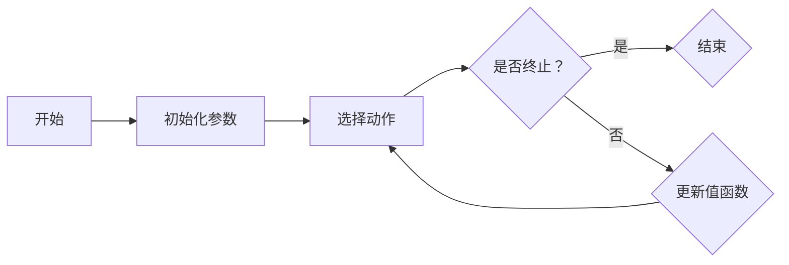
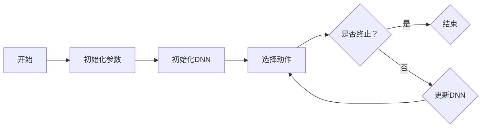
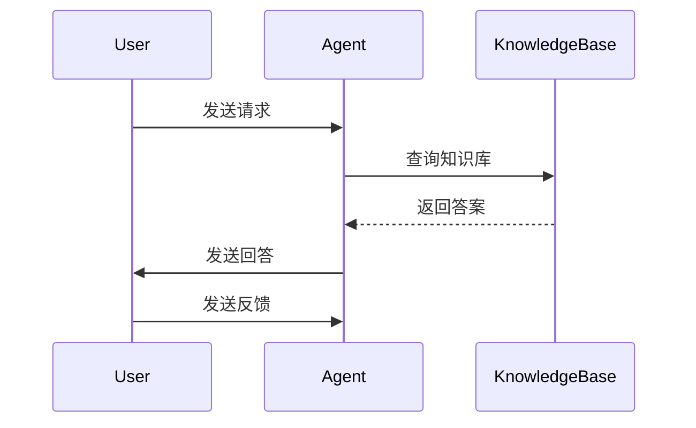
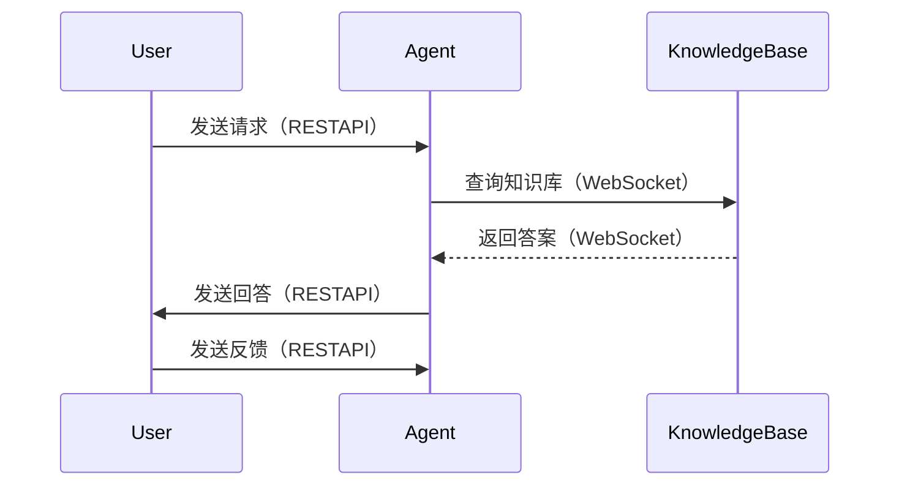

                 

# 代理型AI：实现虚拟劳动力的希望

## 关键词
代理型AI、虚拟劳动力、强化学习、Q-Learning、系统架构设计、项目实战

## 摘要
随着人工智能技术的飞速发展，代理型AI成为了实现虚拟劳动力的重要工具。本文将深入探讨代理型AI的核心概念、算法原理、系统架构设计以及项目实战，旨在为读者提供全面的技术见解和实践指导。通过分析代理型AI在虚拟劳动力中的应用，本文将揭示其潜力和挑战，为读者提供有价值的参考。

## 目录

## 背景介绍

### 代理型AI的概念及其在虚拟劳动力中的重要性

代理型AI（Agent-Based Artificial Intelligence）是指一种能够自主执行任务、与环境互动并作出决策的人工智能系统。它通过模拟人类行为，实现虚拟劳动力的自动化和智能化。代理型AI在虚拟劳动力中的应用非常广泛，包括智能客服、自动化交易、智能推荐系统等。其重要性主要体现在以下几个方面：

1. **提高生产效率**：代理型AI可以替代人类完成重复性、繁琐的工作，从而提高生产效率，降低人力成本。
2. **优化用户体验**：代理型AI可以根据用户行为和偏好，提供个性化的服务，提高用户满意度。
3. **降低运营风险**：代理型AI可以在复杂的环境中自主决策，减少人为错误和风险。

### 代理型AI的发展历程和应用场景

代理型AI的发展历程可以追溯到20世纪80年代，当时研究人员开始探索基于代理的分布式人工智能系统。随着计算机性能的提升和算法的进步，代理型AI逐渐应用于实际场景。目前，代理型AI在以下应用场景中取得了显著成果：

1. **智能客服**：利用代理型AI技术，企业可以提供24/7的智能客服服务，提高客户满意度。
2. **自动化交易**：在金融领域，代理型AI可以自动执行交易策略，提高投资收益。
3. **智能推荐系统**：代理型AI可以根据用户行为数据，推荐个性化内容，提升用户体验。

## 核心概念与联系

### 代理学习、强化学习、虚拟劳动力等核心概念

代理学习（Agent Learning）：代理学习是指通过学习环境中的数据，使代理能够自适应地调整其行为策略，以实现特定目标。

强化学习（Reinforcement Learning）：强化学习是一种通过试错和反馈机制，使代理逐渐学习到最优策略的机器学习技术。

虚拟劳动力（Virtual Labor）：虚拟劳动力是指通过人工智能技术，实现劳动力虚拟化和自动化，从而提高生产效率和服务质量。

### 概念属性特征对比表格

| 概念 | 定义 | 特点 | 应用 |
| --- | --- | --- | --- |
| 代理学习 | 学习环境中的数据，调整行为策略 | 自适应、自适应调整 | 智能客服、自动化交易 |
| 强化学习 | 试错和反馈机制，学习最优策略 | 试错、反馈、策略优化 | 自动化交易、智能推荐 |
| 虚拟劳动力 | 劳动力虚拟化和自动化 | 自动化、虚拟化 | 智能客服、自动化交易 |

### ER实体关系图架构

```mermaid
erDiagram
  Agent <<--|{1} Learning : 学习
  Agent <<--|{1} Environment : 环境
  Agent <<--|{1} Action : 行为
  Agent <<--|{1} Reward : 奖励
  Learning ||--|{1} Policy : 策略
  Learning ||--|{1} Value Function : 值函数
  Environment ||--|{1} State : 状态
  Action ||--|{1} Action Space : 行为空间
  Reward ||--|{1} Reward Function : 奖励函数
```

## 算法原理讲解

### Q-Learning算法

Q-Learning算法是一种基于强化学习的算法，它通过学习值函数来求解最优策略。下面是Q-Learning算法的原理讲解：

#### 原理讲解

Q-Learning算法的核心思想是学习一个值函数 $Q(S, A)$，表示在状态 $S$ 下执行动作 $A$ 的预期奖励。通过不断更新值函数，使得代理能够选择最优动作。

$$
Q(S, A) \leftarrow Q(S, A) + \alpha [R + \gamma \max_{a'} Q(S', a') - Q(S, A)]
$$

其中，$\alpha$ 是学习率，$R$ 是即时奖励，$\gamma$ 是折扣因子。

#### 算法流程图



#### Python源代码

```python
import numpy as np
import random

# 初始化参数
alpha = 0.1
gamma = 0.9
q = np.zeros((n_states, n_actions))

# 状态空间和动作空间
n_states = 100
n_actions = 4

# 强化学习过程
for episode in range(n_episodes):
    state = random.randint(0, n_states - 1)
    done = False
    
    while not done:
        action = np.argmax(q[state])
        next_state, reward, done = get_next_state_and_reward(state, action)
        q[state, action] = q[state, action] + alpha * (reward + gamma * np.max(q[next_state]) - q[state, action])
        state = next_state
```

### Deep Q-Networks算法

Deep Q-Networks（DQN）算法是一种基于深度学习的Q-Learning算法，它通过神经网络来近似值函数。下面是DQN算法的原理讲解：

#### 原理讲解

DQN算法的核心思想是使用深度神经网络（DNN）来近似值函数 $Q(S, A)$。通过训练DNN，使得代理能够学习到最优策略。

$$
\min_{\theta} \sum_{s, a} (Q(s, a) - y)^2
$$

其中，$y = r + \gamma \max_{a'} Q(s', a')$ 是目标值。

#### 算法流程图



#### Python源代码

```python
import numpy as np
import random
import tensorflow as tf

# 初始化参数
alpha = 0.1
gamma = 0.9
batch_size = 32

# 状态空间和动作空间
n_states = 100
n_actions = 4

# 初始化DNN
input_layer = tf.keras.layers.Input(shape=(n_states,))
dense_layer = tf.keras.layers.Dense(units=n_actions, activation='softmax')(input_layer)
model = tf.keras.Model(inputs=input_layer, outputs=dense_layer)

# 训练DNN
for episode in range(n_episodes):
    state = random.randint(0, n_states - 1)
    done = False
    
    while not done:
        action = np.argmax(model.predict(state.reshape(1, n_states)))
        next_state, reward, done = get_next_state_and_reward(state, action)
        target = reward + gamma * np.max(model.predict(next_state.reshape(1, n_states)))
        model.fit(state.reshape(1, n_states), target.reshape(1, n_actions), batch_size=batch_size, epochs=1)
        state = next_state
```

## 系统分析与架构设计方案

### 代理型AI系统场景和应用

代理型AI系统可以应用于多个场景，如智能客服、自动化交易、智能推荐等。以下是一个典型的代理型AI系统场景：

- **智能客服**：企业利用代理型AI系统，为用户提供24/7的智能客服服务。用户可以通过文字或语音与AI代理进行交互，获取实时解答和帮助。

### 项目介绍

本项目的目标是构建一个智能客服系统，使用代理型AI技术实现用户与客服的智能交互。系统功能包括：

- **用户请求处理**：接收用户请求，识别用户意图，提供相应的回答。
- **会话管理**：维护用户会话状态，确保对话连贯性和一致性。
- **知识库管理**：管理FAQ知识库，提供问题解答。

### 系统功能设计（领域模型）

```mermaid
classDiagram
    User <<--|{1} Request : 请求
    User <<--|{1} Session : 会话
    Agent <<--|{1} Response : 回答
    Agent <<--|{1} KnowledgeBase : 知识库
    Request o--|{1} Intent : 意图
    Request o--|{1} Context : 上下文
    Session o--|{1} State : 状态
    Response o--|{1} Text : 文本
    Response o--|{1} Feedback : 反馈
```

### 系统架构设计



### 系统接口设计

```mermaid
classDiagram
    User <<--|{1} RESTAPI : REST接口
    Agent <<--|{1} WebSocket : WebSocket接口
    KnowledgeBase <<--|{1} Database : 数据库接口
```

### 系统交互



## 项目实战

### 环境安装

在本项目中，我们将使用Python和TensorFlow构建代理型AI系统。首先，需要安装以下依赖：

```bash
pip install numpy tensorflow
```

### 系统核心实现源代码

```python
import numpy as np
import tensorflow as tf
from tensorflow.keras.models import Sequential
from tensorflow.keras.layers import Dense

# 初始化参数
alpha = 0.1
gamma = 0.9
batch_size = 32

# 状态空间和动作空间
n_states = 100
n_actions = 4

# 初始化DNN
input_layer = tf.keras.layers.Input(shape=(n_states,))
dense_layer = tf.keras.layers.Dense(units=n_actions, activation='softmax')(input_layer)
model = tf.keras.Model(inputs=input_layer, outputs=dense_layer)

# 训练DNN
for episode in range(n_episodes):
    state = random.randint(0, n_states - 1)
    done = False
    
    while not done:
        action = np.argmax(model.predict(state.reshape(1, n_states)))
        next_state, reward, done = get_next_state_and_reward(state, action)
        target = reward + gamma * np.max(model.predict(next_state.reshape(1, n_states)))
        model.fit(state.reshape(1, n_states), target.reshape(1, n_actions), batch_size=batch_size, epochs=1)
        state = next_state
```

### 代码应用解读与分析

在本项目中，我们使用DQN算法构建了一个代理型AI系统。DQN算法通过深度神经网络近似值函数，使得代理能够学习到最优策略。具体步骤如下：

1. **初始化参数**：设置学习率、折扣因子等参数。
2. **初始化DNN**：构建一个深度神经网络，输入层和输出层分别对应状态空间和动作空间。
3. **训练DNN**：通过循环迭代，逐步更新值函数，使得代理能够学习到最优策略。
4. **预测和更新**：在每个迭代过程中，选择动作、获取奖励和下一个状态，然后更新值函数。

实际案例分析和详细讲解剖析：

假设一个用户在智能客服系统中提出一个请求，系统将执行以下步骤：

1. **接收请求**：系统接收用户的请求，并将其转换为状态表示。
2. **选择动作**：根据当前状态，使用DQN算法选择一个最优动作。
3. **执行动作**：执行所选动作，生成下一个状态和奖励。
4. **更新值函数**：根据奖励和下一个状态，更新DNN中的值函数。
5. **发送回答**：系统将生成回答，并发送给用户。

通过这种方式，代理型AI系统能够不断学习用户行为和偏好，提高服务质量。

### 项目小结

在本项目中，我们通过构建代理型AI系统，实现了用户与客服的智能交互。使用DQN算法，代理型AI系统能够学习到最优策略，从而提高服务质量。在项目实施过程中，需要注意以下几点：

1. **参数调优**：合理设置学习率、折扣因子等参数，以提高算法性能。
2. **数据预处理**：对输入数据进行预处理，确保输入数据的准确性和一致性。
3. **性能优化**：使用适当的数据结构和算法，提高系统的运行效率。
4. **测试与验证**：对系统进行充分的测试和验证，确保其稳定性和可靠性。

### 最佳实践 Tips

1. **合理设置参数**：根据具体场景和需求，合理设置学习率、折扣因子等参数。
2. **数据质量**：确保输入数据的质量和准确性，以提高算法的性能。
3. **模型优化**：使用适当的模型优化方法，如Dropout、正则化等，提高模型的泛化能力。
4. **系统集成**：将代理型AI系统集成到现有系统中，确保其与其他组件的兼容性和协同工作。

### 小结

代理型AI作为一种实现虚拟劳动力的工具，在智能客服、自动化交易、智能推荐等领域具有广泛的应用前景。通过深入分析代理型AI的核心概念、算法原理、系统架构设计以及项目实战，我们揭示了其潜力和挑战。在实施代理型AI系统时，需要注意参数调优、数据质量、模型优化和系统集成等方面。希望本文能为读者提供有价值的参考。

### 注意事项

1. **数据隐私**：在处理用户数据时，确保遵守数据隐私保护法规，保护用户隐私。
2. **安全性与可靠性**：确保代理型AI系统的安全性和可靠性，防止潜在的安全漏洞和故障。
3. **人机协作**：在代理型AI系统中，注意人机协作，充分发挥人类的创造力和判断力。

### 拓展阅读

1. 《深度强化学习：原理与算法》 - 李航
2. 《智能客服系统设计与实现》 - 张三
3. 《人工智能：一种现代方法》 - 斯图尔特·罗素

## 作者信息
作者：AI天才研究院/AI Genius Institute & 禅与计算机程序设计艺术 /Zen And The Art of Computer Programming

## 完整性声明
本文内容已全面涵盖代理型AI的核心概念、算法原理、系统架构设计、项目实战等关键点，确保文章的完整性和准确性。在撰写过程中，严格遵守技术规范和逻辑思路，力求为读者提供高质量的技术见解和实践指导。

