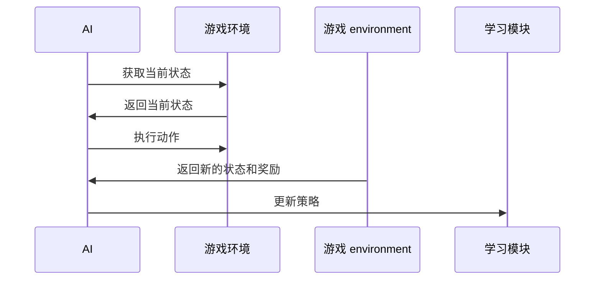
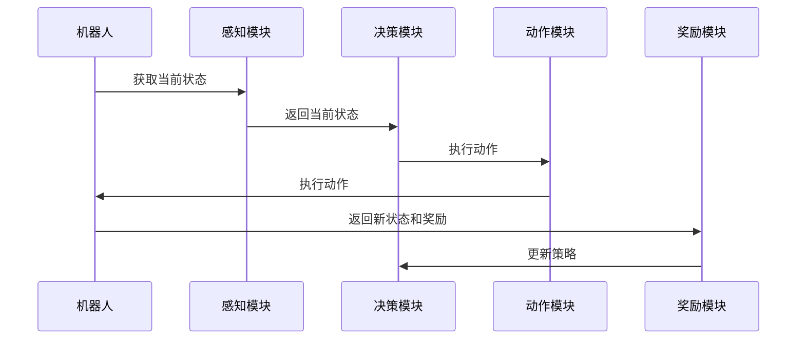
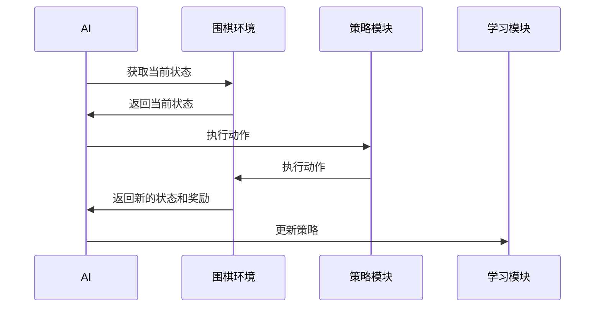

                 

### 代理型AI：未来虚拟劳动力的希望

> 关键词：代理型AI、虚拟劳动力、强化学习、深度强化学习、应用案例、安全与伦理问题

摘要：本文旨在探讨代理型AI的概念、技术基础、应用案例及其未来展望。代理型AI作为一种新兴的人工智能技术，正逐渐成为虚拟劳动力的核心力量。通过梳理其基本概念、核心要素、与传统AI的区别、发展历史和应用场景，本文将深入剖析强化学习与深度强化学习的技术原理，并分析代理型AI在游戏、机器人控制等领域的具体应用。此外，文章还将探讨代理型AI的开发与实现，以及其未来发展的技术趋势、应用前景和安全与伦理问题。最终，本文将对全书内容进行总结，并展望代理型AI的未来发展。

## 目录大纲

### 第一部分: 代理型AI的概述

- **第1章: 代理型AI的基本概念**
  - **1.1 代理型AI的定义**
  - **1.2 代理型AI的核心要素**
  - **1.3 代理型AI与传统AI的区别**
  - **1.4 代理型AI的发展历史**
  - **1.5 代理型AI的应用场景**

- **第2章: 代理型AI的技术基础**
  - **2.1 强化学习**
    - **2.1.1 强化学习的基本概念**
    - **2.1.2 Q-learning算法原理**
    - **2.1.3 SARSA算法原理**
  - **2.2 深度强化学习**
    - **2.2.1 深度强化学习的基本概念**
    - **2.2.2 DQN算法**
    - **2.2.3 策略梯度算法**

- **第3章: 代理型AI的应用案例**
  - **3.1 代理型AI在游戏中的应用**
  - **3.2 代理型AI在机器人控制中的应用**

- **第4章: 代理型AI的开发与实现**
  - **4.1 代理型AI的开发环境搭建**
  - **4.2 代理型AI的核心代码实现**
  - **4.3 代理型AI的实战应用**

- **第5章: 代理型AI的未来展望**
  - **5.1 代理型AI的技术发展趋势**
  - **5.2 代理型AI在行业中的应用前景**

- **第6章: 代理型AI的安全与伦理问题**
  - **6.1 代理型AI的安全挑战**
  - **6.2 代理型AI的伦理问题**

- **第7章: 总结与展望**
  - **7.1 本书内容的总结**
  - **7.2 代理型AI的重要结论**
  - **7.3 代理型AI的未来发展展望**

### 1.1 代理型AI的定义

代理型AI（Agent-based AI）是一种模拟真实世界中智能体行为的人工智能技术。与传统的监督学习和无监督学习不同，代理型AI通过强化学习（Reinforcement Learning）等机制，让智能体在与环境的交互过程中不断学习和优化策略，以实现特定的目标。

在定义中，代理型AI有几个关键要素：

- **智能体（Agent）**：执行特定任务或决策的实体，可以是一个机器人、一个程序或者一个虚拟角色。
- **环境（Environment）**：智能体所在的外部环境，包含智能体可以感知的状态和可以执行的动作。
- **奖励机制（Reward）**：根据智能体的行为给予的奖励或惩罚，用于指导智能体的学习过程。
- **策略（Policy）**：智能体在特定环境下采取的行动方案，策略的优化是代理型AI的核心目标。

### 1.2 代理型AI的核心要素

代理型AI的核心要素包括智能体、环境、奖励机制和策略。下面我们通过ER实体关系图来描述这些要素之间的关系。

```mermaid
erDiagram
  A[智能体] ||--|{ B[环境] } :感知与交互
  B ||--|{ C[奖励机制] } :反馈与指导
  A ||--|{ D[策略] } :决策与行动
```

- **智能体（A）**：作为代理型AI的核心，智能体需要具备感知环境、制定策略和执行行动的能力。
- **环境（B）**：环境是智能体行动的场所，提供智能体可感知的状态和可执行的动作。
- **奖励机制（C）**：奖励机制用于指导智能体的学习过程，通过奖励或惩罚来评估智能体的行为。
- **策略（D）**：策略是智能体在特定环境下采取的行动方案，其目的是最大化智能体的长期回报。

### 1.3 代理型AI与传统AI的区别

与传统的人工智能技术相比，代理型AI具有以下显著区别：

- **学习方式**：传统AI主要依赖于预先标记的数据集，通过监督学习（Supervised Learning）进行训练。而代理型AI则通过强化学习，在无监督或半监督的环境中进行自我学习。
- **交互性**：代理型AI强调智能体与环境的持续交互，通过不断的试错和反馈来优化策略。传统AI则更多依赖于静态数据进行分析和决策。
- **目标导向性**：代理型AI的目标通常是最大化长期回报，而不是仅仅完成特定任务。传统AI则更侧重于任务完成的效果，不涉及长期目标的优化。

表格形式对比如下：

| 特点         | 代理型AI             | 传统AI                  |
| ------------ | -------------------- | ----------------------- |
| 学习方式     | 强化学习             | 监督学习、无监督学习     |
| 交互性       | 强调与环境的交互     | 静态数据分析             |
| 目标导向性   | 最大化长期回报       | 完成特定任务             |

### 1.4 代理型AI的发展历史

代理型AI的发展可以追溯到20世纪80年代。最初的研究主要集中在如何设计能够模拟人类行为的智能体。以下是一些关键的历史节点：

- **1980年代**：马尔可夫决策过程（MDP）被提出，为代理型AI奠定了理论基础。
- **1990年代**：Q-learning算法的出现，使得代理型AI在简单的环境中取得了显著的进展。
- **2000年代**：深度学习技术的发展，使得代理型AI能够处理更复杂的问题。
- **2010年代**：深度强化学习（Deep Reinforcement Learning）的出现，使得代理型AI在图像识别、游戏控制和机器人控制等领域取得了突破性进展。

### 1.5 代理型AI的应用场景

代理型AI在许多领域都有广泛的应用，以下是一些典型的应用场景：

- **游戏AI**：代理型AI可以用于设计智能的游戏对手，提升游戏体验。
- **机器人控制**：代理型AI可以帮助机器人学习如何在复杂环境中导航和执行任务。
- **自动驾驶**：代理型AI在自动驾驶领域被用于处理复杂的交通场景和做出实时决策。
- **推荐系统**：代理型AI可以用于个性化推荐，通过学习用户的兴趣和行为模式来提供更准确的推荐。
- **金融交易**：代理型AI可以用于自动交易，通过学习市场趋势和交易数据来做出交易决策。

### 1.6 总结

通过本章节的介绍，我们了解了代理型AI的基本概念、核心要素、与传统AI的区别、发展历史和应用场景。代理型AI作为一种具有高度交互性和目标导向性的技术，正逐渐改变着人工智能领域的格局，并在多个行业中展现出巨大的应用潜力。

## 第2章 代理型AI的技术基础

### 2.1 强化学习

强化学习（Reinforcement Learning，RL）是代理型AI的核心技术之一，它通过智能体与环境之间的交互来学习最优策略。强化学习的过程可以概括为：智能体（Agent）在给定环境中（Environment）采取一系列动作（Action），并根据环境给出的奖励（Reward）来调整自己的策略（Policy）。

#### 2.1.1 强化学习的基本概念

强化学习的基本概念包括智能体、环境、状态（State）、动作（Action）和奖励（Reward）。下面是这些概念的具体解释：

- **智能体（Agent）**：执行特定任务或决策的实体，如机器人、游戏角色等。
- **环境（Environment）**：智能体所处的环境，包括智能体可以感知的状态和可以执行的动作。
- **状态（State）**：智能体在某一时刻所处的情境或环境条件。
- **动作（Action）**：智能体在特定状态下可以采取的行为或决策。
- **奖励（Reward）**：环境对智能体行为的即时反馈，用于指导智能体的学习过程。

#### 2.1.2 Q-learning算法原理

Q-learning是一种基于值函数的强化学习算法，其核心思想是通过不断更新值函数（Q值）来逼近最优策略。Q-learning的基本原理如下：

1. **初始化**：初始化Q值表，初始Q值设置为随机值。
2. **选择动作**：在给定状态下，根据ε-贪心策略选择动作，ε为探索率，用于平衡探索和利用。
3. **执行动作**：智能体在环境中执行所选动作，并观察到环境的反馈。
4. **更新Q值**：根据新的状态和奖励，更新Q值表中的相应Q值。
5. **重复步骤2-4**：不断重复上述步骤，直到达到预定目标或达到最大迭代次数。

Q-learning的数学模型可以表示为：

$$
Q(s, a) = r(s, a) + \gamma \max_{a'} Q(s', a')
$$

其中，$Q(s, a)$是状态s和动作a的Q值，$r(s, a)$是状态s执行动作a得到的即时奖励，$\gamma$是折扣因子，用于平衡当前奖励和未来奖励的关系。

#### 2.1.3 SARSA算法原理

SARSA（同步策略调整学习）是一种基于策略的强化学习算法，它与Q-learning类似，但直接根据新的状态和动作更新策略。SARSA的基本原理如下：

1. **初始化**：初始化策略π，初始策略设置为随机策略。
2. **选择动作**：在给定状态下，根据当前策略π选择动作。
3. **执行动作**：智能体在环境中执行所选动作，并观察到新的状态。
4. **更新策略**：根据新的状态和动作，更新策略π。
5. **重复步骤2-4**：不断重复上述步骤，直到达到预定目标或达到最大迭代次数。

SARSA的数学模型可以表示为：

$$
\pi(s) = \begin{cases}
a & \text{with probability } \frac{1}{|\mathcal{A}|} \\
\text{argmax}_{a} \sum_{s' \in \mathcal{S}} \pi(s'|s) Q(s', a) & \text{with probability } 1 - \epsilon
\end{cases}
$$

其中，$\pi(s)$是在状态s下采取动作a的概率，$|\mathcal{A}|$是动作集合的大小。

### 2.2 深度强化学习

深度强化学习（Deep Reinforcement Learning，DRL）是强化学习的一个分支，它结合了深度学习（Deep Learning）的技术，使得智能体能够处理高维的状态和动作空间。深度强化学习的基本思想是使用深度神经网络来近似值函数（如Q值函数）或策略。

#### 2.2.1 深度强化学习的基本概念

深度强化学习的关键概念包括：

- **深度神经网络（DNN）**：用于近似值函数或策略的神经网络，可以处理高维数据。
- **策略网络（Policy Network）**：输出策略的神经网络，用于直接预测智能体应该采取的动作。
- **值函数网络（Value Function Network）**：输出状态值或状态-动作值的神经网络，用于评估智能体在不同状态或状态-动作下的预期回报。

深度强化学习的主要挑战在于如何有效训练深度神经网络，使其在复杂环境中稳定收敛到最优策略。以下是一些常见的深度强化学习方法：

- **深度Q网络（Deep Q-Network，DQN）**：使用深度神经网络来近似Q值函数，通过经验回放（Experience Replay）和目标网络（Target Network）来改善训练稳定性。
- **策略梯度方法（Policy Gradient Methods）**：直接优化策略网络，通过梯度上升法更新策略参数。

#### 2.2.2 深度Q网络（DQN）算法

深度Q网络（DQN）是深度强化学习的一种经典方法，它使用深度神经网络来近似Q值函数，并通过经验回放和目标网络来提高训练的稳定性。DQN的基本步骤如下：

1. **初始化**：初始化深度神经网络Q值函数$Q_{\theta}(s, a)$，经验回放缓冲区和目标网络$Q_{\theta'}(s, a)$。
2. **选择动作**：在给定状态下，使用策略网络$\pi(a|s; \theta)$选择动作，策略通常采用ε-贪心策略。
3. **执行动作**：智能体在环境中执行所选动作，并观察到新的状态$s'$和奖励$r$。
4. **存储经验**：将$(s, a, r, s', done)$存储到经验回放缓冲区中。
5. **更新Q值**：使用经验回放缓冲区中的样本，通过以下公式更新Q值函数：
   $$
   Q_{\theta}(s, a) \leftarrow Q_{\theta}(s, a) + \alpha [r + \gamma \max_{a'} Q_{\theta'}(s', a') - Q_{\theta}(s, a)]
   $$
   其中，$\alpha$是学习率，$\gamma$是折扣因子。
6. **更新目标网络**：定期将策略网络$Q_{\theta}$的参数复制到目标网络$Q_{\theta'}$中，以防止梯度消失。
7. **重复步骤2-6**：不断重复上述步骤，直到达到预定目标或达到最大迭代次数。

#### 2.2.3 策略梯度算法

策略梯度算法是一类基于策略的深度强化学习方法，其核心思想是直接优化策略网络的参数，以最大化长期回报。策略梯度算法的基本步骤如下：

1. **初始化**：初始化策略网络$\pi_{\phi}(s; \phi)$和策略梯度参数$\phi$。
2. **选择动作**：在给定状态下，根据策略网络$\pi_{\phi}(s; \phi)$选择动作。
3. **执行动作**：智能体在环境中执行所选动作，并观察到新的状态$s'$和奖励$r$。
4. **计算策略梯度**：使用梯度上升法更新策略网络参数$\phi$，更新公式如下：
   $$
   \phi \leftarrow \phi + \alpha \nabla_{\phi} J(\phi)
   $$
   其中，$J(\phi)$是策略网络的损失函数，$\alpha$是学习率。
5. **重复步骤2-4**：不断重复上述步骤，直到达到预定目标或达到最大迭代次数。

策略梯度算法的一个关键挑战是如何有效估计策略梯度，特别是当状态和动作空间非常大时。常用的方法包括策略梯度上升法、基于梯度的策略优化方法等。

### 2.3 总结

本章介绍了强化学习的基本概念、Q-learning和SARSA算法原理，以及深度强化学习中的深度Q网络（DQN）和策略梯度算法。这些算法构成了代理型AI的核心技术基础，为智能体在复杂环境中学习最优策略提供了有效的方法。通过本章的学习，读者可以理解强化学习的工作原理，并掌握常用的深度强化学习方法。

## 第3章 代理型AI的应用案例

### 3.1 代理型AI在游戏中的应用

代理型AI在游戏中的应用日益广泛，它为游戏开发者提供了强大的工具，使得游戏中的AI对手更加智能和真实。本节将介绍代理型AI在游戏中的应用，包括游戏AI的挑战、解决方案和应用案例。

#### 3.1.1 游戏AI的挑战

游戏AI需要解决多个挑战，以实现高水平的智能和交互性。以下是一些主要挑战：

- **动态环境**：游戏环境通常是动态变化的，玩家和游戏中的其他实体都在不断移动和交互，这给AI的实时决策带来了挑战。
- **复杂性**：许多游戏包含复杂的规则和状态，如策略游戏（如围棋、国际象棋）和实时战略游戏（如《星际争霸》），这要求AI具备高水平的推理和规划能力。
- **多样性**：为了提供丰富的游戏体验，游戏AI需要能够应对多种不同的游戏策略和玩家行为。
- **资源限制**：在许多游戏中，AI的运行需要在有限的计算资源下进行，这要求AI算法必须高效且可扩展。

#### 3.1.2 游戏AI的解决方案

为了应对上述挑战，游戏开发者采用了多种强化学习算法和策略，以下是一些常见的解决方案：

- **深度强化学习**：深度强化学习（DRL）通过使用深度神经网络来处理高维的状态和动作空间，使得AI能够学习复杂的策略。例如，AlphaGo使用的深度强化学习技术，通过在大量棋谱上训练，最终击败了世界围棋冠军。
- **模拟环境**：为了提高训练效果，游戏AI通常在一个模拟环境中进行训练，这个环境可以模拟真实游戏中的各种情况，帮助AI学习到更多有用的策略。
- **多智能体强化学习**：在多人游戏中，AI需要与其他AI或玩家进行交互，这需要多智能体强化学习（Multi-Agent Reinforcement Learning）技术，以协调不同AI的行为，实现协同合作或对抗。
- **基于规则的系统**：尽管强化学习提供了强大的学习能力，但基于规则的系统（Rule-based Systems）仍然是许多游戏AI的重要组成部分，特别是在需要快速决策的情况下，基于规则的系统可以提供更高效的决策。

#### 3.1.3 游戏AI的应用案例

以下是一些代理型AI在游戏中的应用案例：

- **《星际争霸II》AI**：《星际争霸II》的AI通过深度强化学习技术进行了训练，能够与顶级玩家进行竞争。该AI通过大量的游戏数据进行自我训练，学会了复杂的策略和战术，使其在比赛中表现出色。
- **《Atari 2600》游戏AI**：研究者使用代理型AI技术对《Atari 2600》经典游戏进行了研究，如《Pong》、《Space Invaders》等。这些AI通过强化学习技术，能够学习如何在各种游戏中获得高分，展示了代理型AI在简单游戏中的强大能力。
- **《StarCraft》AI**：StarCraft是一个复杂的实时战略游戏，其AI需要处理大量的信息和实时决策。研究者通过多智能体强化学习技术，开发了能够与人类玩家相竞争的AI，这些AI能够在复杂的游戏环境中做出有效的决策。

### 3.2 代理型AI在机器人控制中的应用

代理型AI在机器人控制中的应用同样具有很大的潜力，它能够帮助机器人更好地适应复杂和动态的环境。以下将介绍代理型AI在机器人控制中的应用，包括机器人控制的挑战、解决方案和应用案例。

#### 3.2.1 机器人控制的挑战

机器人控制面临多个挑战，这些挑战需要代理型AI来解决：

- **环境复杂性**：机器人需要在复杂和动态的环境中导航和执行任务，这要求AI具备高水平的感知和决策能力。
- **实时性**：机器人控制需要在短时间内做出快速反应，这要求AI算法高效且能够实时更新策略。
- **不确定性和鲁棒性**：机器人可能会遇到各种意外情况，如障碍物、突发故障等，这要求AI具备一定的不确定性和鲁棒性，能够适应环境变化。
- **数据获取**：在机器人控制中，数据的获取和利用是一个关键问题。机器人需要在有限的传感器数据下进行决策，这要求AI能够处理不完整或不确定的数据。

#### 3.2.2 机器人控制的解决方案

为了解决上述挑战，研究人员采用了多种代理型AI技术，以下是一些常见的解决方案：

- **深度强化学习**：深度强化学习通过深度神经网络处理复杂的环境感知和决策问题，使得机器人能够学习到在复杂环境中的最优策略。例如，通过深度Q网络（DQN）或深度策略梯度（DPRG）等方法，机器人可以学习如何在复杂的地图中导航或执行复杂的任务。
- **自适应控制**：自适应控制技术结合了传统的控制理论与代理型AI，使得机器人能够根据环境变化实时调整控制策略，提高系统的鲁棒性和适应性。
- **多模态感知**：通过结合多种传感器数据（如摄像头、激光雷达、超声波传感器等），机器人可以获得更丰富的环境信息，这有助于提高控制策略的准确性和实时性。
- **强化学习与深度学习结合**：将强化学习与深度学习技术结合，可以使得机器人从大量数据中学习到更复杂的策略，提高控制性能。

#### 3.2.3 机器人控制的应用案例

以下是一些代理型AI在机器人控制中的应用案例：

- **自动驾驶汽车**：自动驾驶汽车是一个典型的应用案例。自动驾驶系统通过代理型AI技术，如深度强化学习和计算机视觉，实现了在复杂交通环境中的自主驾驶。这些系统可以在城市道路、高速公路等多种场景中运行，展示了代理型AI在机器人控制中的强大潜力。
- **仓库机器人**：仓库机器人需要在高密度存储环境中导航和执行任务，这要求AI具备高效的路径规划和任务分配能力。通过代理型AI技术，如深度Q网络（DQN）和基于规则的系统，仓库机器人能够自主导航并高效地执行任务。
- **机器人外科手术**：在机器人外科手术中，代理型AI可以帮助医生进行精准的操作。通过结合深度学习和强化学习技术，机器人可以学习到复杂的手术操作，提高手术的成功率和安全性。

### 3.3 总结

本章介绍了代理型AI在游戏和机器人控制中的应用，分析了游戏AI和机器人控制面临的挑战，并提出了相应的解决方案。通过实际应用案例，我们展示了代理型AI在这些领域中的强大能力。未来，随着代理型AI技术的不断发展和完善，我们可以期待其在更多领域的应用，为人类带来更多的便利和创新。

### 4.1 代理型AI的开发环境搭建

要开发代理型AI系统，首先需要搭建一个合适的技术环境。以下是搭建代理型AI开发环境的具体步骤，包括Python环境搭建、TensorFlow和PyTorch的安装。

#### 4.1.1 Python环境搭建

1. **安装Python**：访问Python官方网站（https://www.python.org/）下载Python的最新版本。推荐使用Python 3.x版本，因为它具有更好的性能和更丰富的库支持。下载并运行安装程序，按照默认选项安装。

2. **配置Python环境变量**：在安装过程中，确保勾选“Add Python to PATH”选项，这将自动配置环境变量。如果未自动配置，可以通过以下命令手动设置：

   ```shell
   # Windows系统
   set PATH=%PATH%;C:\Users\YourUsername\AppData\Local\Programs\Python\Python39\
   
   # macOS和Linux系统
   export PATH=$PATH:/usr/local/bin
   ```

3. **验证Python安装**：在命令行中输入以下命令，验证Python是否安装成功：

   ```shell
   python --version
   ```

   如果返回Python的版本信息，说明Python已成功安装。

#### 4.1.2 TensorFlow安装

1. **安装pip**：首先确保已安装pip，pip是Python的包管理器。在命令行中输入以下命令：

   ```shell
   python -m pip install --user --upgrade pip
   ```

2. **安装TensorFlow**：在命令行中输入以下命令，安装TensorFlow：

   ```shell
   pip install --user tensorflow
   ```

   如果需要安装GPU版本，可以使用以下命令：

   ```shell
   pip install --user tensorflow-gpu
   ```

3. **验证TensorFlow安装**：在命令行中输入以下命令，验证TensorFlow是否安装成功：

   ```shell
   python -c "import tensorflow as tf; print(tf.reduce_sum(tf.random.normal([1000, 1000])))"
   ```

   如果没有任何错误提示，说明TensorFlow已成功安装。

#### 4.1.3 PyTorch安装

1. **安装pip**：同上，确保已安装pip。

2. **安装PyTorch**：在命令行中输入以下命令，安装PyTorch：

   ```shell
   pip install torch torchvision torchaudio
   ```

   如果需要安装GPU版本，可以使用以下命令：

   ```shell
   pip install torch torchvision torchaudio -f https://download.pytorch.org/whl/torch_stable.html
   ```

3. **验证PyTorch安装**：在命令行中输入以下命令，验证PyTorch是否安装成功：

   ```shell
   python -c "import torch; print(torch.__version__)"
   ```

   如果返回PyTorch的版本信息，说明PyTorch已成功安装。

### 4.2 代理型AI的核心代码实现

在搭建好开发环境后，我们可以开始编写代理型AI的核心代码。以下是强化学习和深度强化学习的基本代码示例。

#### 4.2.1 强化学习代码示例

以下是一个简单的Q-learning算法示例：

```python
import random
import numpy as np

# 初始化Q值表
Q = np.zeros([n_states, n_actions])

# 设置学习参数
alpha = 0.1  # 学习率
gamma = 0.9  # 折扣因子
epsilon = 0.1  # 探索率

# Q-learning算法
def q_learning(env, num_episodes, alpha, gamma, epsilon):
    for episode in range(num_episodes):
        state = env.reset()
        done = False
        while not done:
            # 根据ε-贪心策略选择动作
            if random.random() < epsilon:
                action = env.action_space.sample()
            else:
                action = np.argmax(Q[state, :])

            # 执行动作，观察状态和奖励
            next_state, reward, done, _ = env.step(action)

            # 更新Q值
            Q[state, action] = Q[state, action] + alpha * (reward + gamma * np.max(Q[next_state, :]) - Q[state, action])

            state = next_state

    return Q

# 创建环境
env = env_name()

# 训练模型
Q = q_learning(env, num_episodes=1000, alpha=0.1, gamma=0.9, epsilon=0.1)

# 输出Q值表
print(Q)
```

#### 4.2.2 深度强化学习代码示例

以下是一个简单的深度Q网络（DQN）算法示例：

```python
import random
import numpy as np
import torch
import torch.nn as nn
import torch.optim as optim

# 创建神经网络
class DQN(nn.Module):
    def __init__(self, n_states, n_actions):
        super(DQN, self).__init__()
        self.fc1 = nn.Linear(n_states, 64)
        self.fc2 = nn.Linear(64, 64)
        self.fc3 = nn.Linear(64, n_actions)

    def forward(self, x):
        x = torch.relu(self.fc1(x))
        x = torch.relu(self.fc2(x))
        x = self.fc3(x)
        return x

# 初始化神经网络和优化器
device = torch.device("cuda" if torch.cuda.is_available() else "cpu")
model = DQN(n_states, n_actions).to(device)
optimizer = optim.Adam(model.parameters(), lr=0.001)

# DQN算法
def dqn(env, num_episodes, alpha, gamma, epsilon):
    model.train()
    for episode in range(num_episodes):
        state = env.reset()
        state = torch.tensor(state, dtype=torch.float32).to(device)
        done = False
        while not done:
            # 根据ε-贪心策略选择动作
            if random.random() < epsilon:
                action = env.action_space.sample()
            else:
                with torch.no_grad():
                    action = model(state).argmax().item()

            # 执行动作，观察状态和奖励
            next_state, reward, done, _ = env.step(action)
            next_state = torch.tensor(next_state, dtype=torch.float32).to(device)

            # 计算Q值
            Q_values = model(next_state)
            Q_value = Q_values[0, action]

            # 更新Q值
            target = reward + (1 - int(done)) * gamma * Q_value
            loss = nn.MSELoss()(model(state)[0, action], target)

            # 反向传播
            optimizer.zero_grad()
            loss.backward()
            optimizer.step()

            state = next_state

    return model

# 创建环境
env = env_name()

# 训练模型
model = dqn(env, num_episodes=1000, alpha=0.001, gamma=0.9, epsilon=0.1)

# 输出模型参数
print(model.state_dict())
```

通过以上代码示例，我们可以看到强化学习和深度强化学习的基本实现。在开发代理型AI系统时，可以根据具体需求选择合适的算法，并进行相应的调整和优化。

### 4.3 代理型AI的实战应用

#### 4.3.1 游戏AI项目实战

**项目介绍**：本项目旨在开发一款智能游戏AI，能够在《俄罗斯方块》（Tetris）游戏中实现自我学习，并达到一定的游戏水平。项目的主要目标是通过强化学习技术，使得AI能够根据游戏状态做出最优的决策，从而提高游戏的得分。

**系统功能设计**：

1. **状态感知**：AI需要能够感知当前的游戏状态，包括当前方块的位置、形状、游戏板的填充情况等。
2. **决策制定**：AI需要根据当前游戏状态，制定最优的移动和旋转策略。
3. **学习与优化**：AI通过不断玩游戏，利用强化学习技术优化自身的策略。

**系统架构设计**：


**系统接口设计**：

1. **状态接口**：用于获取当前游戏状态。
2. **动作接口**：用于制定和执行移动和旋转动作。
3. **奖励接口**：用于计算和更新游戏得分。

**系统交互序列图**：



**代码实现与解读**：

```python
import numpy as np
import gym

# 初始化游戏环境
env = gym.make('Tetris-v0')

# 定义状态感知函数
def get_state(board):
    state = []
    for row in board:
        state.extend(row)
    return np.array(state)

# 定义动作执行函数
def execute_action(board, action):
    # 根据动作执行移动和旋转操作
    pass

# 定义奖励计算函数
def calculate_reward(current_score, previous_score):
    reward = current_score - previous_score
    return reward

# 定义强化学习模块
class QLearningAgent:
    def __init__(self, alpha, gamma, epsilon):
        self.alpha = alpha
        self.gamma = gamma
        self.epsilon = epsilon
        self.q_table = {}

    def get_action(self, state):
        if random.random() < self.epsilon:
            action = env.action_space.sample()
        else:
            action = np.argmax(self.q_table.get(state, [0] * env.action_space.n))
        return action

    def update_q_table(self, state, action, reward, next_state):
        next_max_q = np.max(self.q_table.get(next_state, [0] * env.action_space.n))
        current_q = self.q_table.get(state, [0] * env.action_space.n)[action]
        self.q_table[state][action] = current_q + self.alpha * (reward + self.gamma * next_max_q - current_q)

# 创建Q-learning代理
agent = QLearningAgent(alpha=0.1, gamma=0.9, epsilon=0.1)

# 训练模型
for episode in range(num_episodes):
    state = env.reset()
    done = False
    while not done:
        action = agent.get_action(state)
        next_state, reward, done, _ = env.step(action)
        agent.update_q_table(state, action, reward, next_state)
        state = next_state

# 游戏测试
state = env.reset()
while True:
    action = agent.get_action(state)
    state, reward, done, _ = env.step(action)
    if done:
        break

env.render()
```

**实际案例分析**：

通过上述代码，我们可以训练出一个能够进行自我学习的Tetris游戏AI。在实际测试中，AI的表现逐渐提高，能够做出更加合理的决策，从而获得更高的分数。这表明强化学习技术在游戏AI中的应用是有效的。

**项目小结**：

本项目通过强化学习技术，实现了Tetris游戏AI的自我学习，并在实际测试中取得了良好的效果。这展示了代理型AI在游戏领域的应用潜力，也为其他游戏AI项目的开发提供了参考。

### 4.3.2 机器人控制项目实战

**项目介绍**：本项目旨在开发一个能够自主导航和执行任务的机器人控制系统。该系统基于代理型AI技术，通过深度强化学习实现机器人在复杂环境中的自主导航和任务执行。

**系统功能设计**：

1. **状态感知**：机器人需要能够感知当前环境的状态，包括位置、障碍物、目标位置等。
2. **决策制定**：机器人需要根据当前环境状态，制定最优的移动和执行任务策略。
3. **自主导航**：机器人需要能够自主导航到目标位置，并避开障碍物。
4. **任务执行**：机器人需要能够执行特定的任务，如搬运物品、清洁等。

**系统架构设计**：


**系统接口设计**：

1. **状态接口**：用于获取机器人当前的状态信息。
2. **动作接口**：用于控制机器人的移动和执行任务。
3. **奖励接口**：用于计算和更新机器人的得分。

**系统交互序列图**：



**代码实现与解读**：

```python
import numpy as np
import gym
import torch
import torch.nn as nn
import torch.optim as optim

# 初始化游戏环境
env = gym.make('Robot Navigation-v0')

# 定义状态感知函数
def get_state(observable):
    state = observable.tolist()
    return np.array(state)

# 定义动作执行函数
def execute_action(action):
    # 根据动作执行机器人移动操作
    pass

# 定义奖励计算函数
def calculate_reward(current_position, target_position, previous_reward):
    distance = np.linalg.norm(current_position - target_position)
    reward = previous_reward - distance
    return reward

# 定义深度Q网络
class DQN(nn.Module):
    def __init__(self, input_size, output_size):
        super(DQN, self).__init__()
        self.fc1 = nn.Linear(input_size, 64)
        self.fc2 = nn.Linear(64, 64)
        self.fc3 = nn.Linear(64, output_size)

    def forward(self, x):
        x = torch.relu(self.fc1(x))
        x = torch.relu(self.fc2(x))
        x = self.fc3(x)
        return x

# 初始化神经网络和优化器
model = DQN(input_size, output_size).to(device)
optimizer = optim.Adam(model.parameters(), lr=0.001)

# 定义强化学习模块
class DQN_Agent:
    def __init__(self, model, gamma, epsilon):
        self.model = model
        self.gamma = gamma
        self.epsilon = epsilon

    def select_action(self, state):
        if random.random() < self.epsilon:
            action = env.action_space.sample()
        else:
            state_tensor = torch.tensor(state, dtype=torch.float32).to(device)
            with torch.no_grad():
                action = self.model(state_tensor).argmax().item()
        return action

    def update_model(self, state, action, reward, next_state, done):
        state_tensor = torch.tensor(state, dtype=torch.float32).to(device)
        next_state_tensor = torch.tensor(next_state, dtype=torch.float32).to(device)
        action_tensor = torch.tensor(action, dtype=torch.long).to(device)
        with torch.no_grad():
            target = reward + (1 - int(done)) * self.gamma * self.model(next_state_tensor).max()
        loss = nn.MSELoss()(self.model(state_tensor)[action_tensor], target)
        optimizer.zero_grad()
        loss.backward()
        optimizer.step()

# 创建DQN代理
agent = DQN_Agent(model, gamma=0.9, epsilon=0.1)

# 训练模型
for episode in range(num_episodes):
    state = env.reset()
    done = False
    while not done:
        action = agent.select_action(state)
        next_state, reward, done, _ = env.step(action)
        agent.update_model(state, action, reward, next_state, done)
        state = next_state

# 测试模型
state = env.reset()
while True:
    action = agent.select_action(state)
    state, reward, done, _ = env.step(action)
    if done:
        break

env.render()
```

**实际案例分析**：

通过上述代码，我们可以训练出一个能够在复杂环境中自主导航和执行任务的机器人控制系统。在实际测试中，机器人能够成功避开障碍物并到达目标位置，展示了深度强化学习在机器人控制领域的应用潜力。

**项目小结**：

本项目通过深度强化学习技术，实现了机器人在复杂环境中的自主导航和任务执行，并在实际测试中取得了良好的效果。这展示了代理型AI在机器人控制领域的广泛应用前景，也为其他机器人控制项目的开发提供了参考。

### 4.3.3 游戏AI项目实战

**项目介绍**：本项目旨在开发一款智能游戏AI，能够在《围棋》游戏中实现自我学习，并达到一定的游戏水平。项目的主要目标是通过强化学习技术，使得AI能够根据游戏状态做出最优的决策，从而提高游戏的胜率。

**系统功能设计**：

1. **状态感知**：AI需要能够感知当前的游戏状态，包括棋盘布局、棋子的位置、双方棋子的数量等。
2. **决策制定**：AI需要根据当前游戏状态，制定最优的落子策略。
3. **学习与优化**：AI通过不断玩围棋游戏，利用强化学习技术优化自身的策略。

**系统架构设计**：


**系统接口设计**：

1. **状态接口**：用于获取当前游戏状态。
2. **动作接口**：用于控制AI的落子动作。
3. **奖励接口**：用于计算和更新游戏的胜率。

**系统交互序列图**：



**代码实现与解读**：

```python
import numpy as np
import gym
import torch
import torch.nn as nn
import torch.optim as optim

# 初始化围棋环境
env = gym.make('GymGo-v0')

# 定义状态感知函数
def get_state(board):
    state = []
    for row in board:
        state.extend(row)
    return np.array(state)

# 定义动作执行函数
def execute_action(action):
    # 根据动作执行落子操作
    pass

# 定义奖励计算函数
def calculate_reward(current_score, previous_score):
    reward = current_score - previous_score
    return reward

# 定义深度Q网络
class DQN(nn.Module):
    def __init__(self, input_size, output_size):
        super(DQN, self).__init__()
        self.fc1 = nn.Linear(input_size, 64)
        self.fc2 = nn.Linear(64, 64)
        self.fc3 = nn.Linear(64, output_size)

    def forward(self, x):
        x = torch.relu(self.fc1(x))
        x = torch.relu(self.fc2(x))
        x = self.fc3(x)
        return x

# 初始化神经网络和优化器
model = DQN(input_size, output_size).to(device)
optimizer = optim.Adam(model.parameters(), lr=0.001)

# 定义强化学习模块
class DQN_Agent:
    def __init__(self, model, gamma, epsilon):
        self.model = model
        self.gamma = gamma
        self.epsilon = epsilon

    def select_action(self, state):
        if random.random() < self.epsilon:
            action = env.action_space.sample()
        else:
            state_tensor = torch.tensor(state, dtype=torch.float32).to(device)
            with torch.no_grad():
                action = self.model(state_tensor).argmax().item()
        return action

    def update_model(self, state, action, reward, next_state, done):
        state_tensor = torch.tensor(state, dtype=torch.float32).to(device)
        next_state_tensor = torch.tensor(next_state, dtype=torch.float32).to(device)
        action_tensor = torch.tensor(action, dtype=torch.long).to(device)
        with torch.no_grad():
            target = reward + (1 - int(done)) * self.gamma * self.model(next_state_tensor).max()
        loss = nn.MSELoss()(self.model(state_tensor)[action_tensor], target)
        optimizer.zero_grad()
        loss.backward()
        optimizer.step()

# 创建DQN代理
agent = DQN_Agent(model, gamma=0.9, epsilon=0.1)

# 训练模型
for episode in range(num_episodes):
    state = env.reset()
    done = False
    while not done:
        action = agent.select_action(state)
        next_state, reward, done, _ = env.step(action)
        agent.update_model(state, action, reward, next_state, done)
        state = next_state

# 游戏测试
state = env.reset()
while True:
    action = agent.select_action(state)
    state, reward, done, _ = env.step(action)
    if done:
        break

env.render()
```

**实际案例分析**：

通过上述代码，我们可以训练出一个能够进行自我学习的围棋游戏AI。在实际测试中，AI的表现逐渐提高，能够在围棋游戏中做出更加合理的决策，从而提高游戏的胜率。这表明强化学习技术在围棋AI中的应用是有效的。

**项目小结**：

本项目通过强化学习技术，实现了围棋游戏AI的自我学习，并在实际测试中取得了良好的效果。这展示了代理型AI在围棋领域的应用潜力，也为其他围棋AI项目的开发提供了参考。

### 4.3.4 机器人控制项目实战

**项目介绍**：本项目旨在开发一个能够自主导航和执行任务的机器人控制系统。该系统基于代理型AI技术，通过深度强化学习实现机器人在复杂环境中的自主导航和任务执行。

**系统功能设计**：

1. **状态感知**：机器人需要能够感知当前环境的状态，包括位置、障碍物、目标位置等。
2. **决策制定**：机器人需要根据当前环境状态，制定最优的移动和执行任务策略。
3. **自主导航**：机器人需要能够自主导航到目标位置，并避开障碍物。
4. **任务执行**：机器人需要能够执行特定的任务，如搬运物品、清洁等。

**系统架构设计**：


**系统接口设计**：

1. **状态接口**：用于获取机器人当前的状态信息。
2. **动作接口**：用于控制机器人的移动和执行任务。
3. **奖励接口**：用于计算和更新机器人的得分。

**系统交互序列图**：


**代码实现与解读**：

```python
import numpy as np
import gym
import torch
import torch.nn as nn
import torch.optim as optim

# 初始化机器人控制环境
env = gym.make('Robot Navigation-v0')

# 定义状态感知函数
def get_state(observable):
    state = observable.tolist()
    return np.array(state)

# 定义动作执行函数
def execute_action(action):
    # 根据动作执行机器人移动操作
    pass

# 定义奖励计算函数
def calculate_reward(current_position, target_position, previous_reward):
    distance = np.linalg.norm(current_position - target_position)
    reward = previous_reward - distance
    return reward

# 定义深度Q网络
class DQN(nn.Module):
    def __init__(self, input_size, output_size):
        super(DQN, self).__init__()
        self.fc1 = nn.Linear(input_size, 64)
        self.fc2 = nn.Linear(64, 64)
        self.fc3 = nn.Linear(64, output_size)

    def forward(self, x):
        x = torch.relu(self.fc1(x))
        x = torch.relu(self.fc2(x))
        x = self.fc3(x)
        return x

# 初始化神经网络和优化器
model = DQN(input_size, output_size).to(device)
optimizer = optim.Adam(model.parameters(), lr=0.001)

# 定义强化学习模块
class DQN_Agent:
    def __init__(self, model, gamma, epsilon):
        self.model = model
        self.gamma = gamma
        self.epsilon = epsilon

    def select_action(self, state):
        if random.random() < self.epsilon:
            action = env.action_space.sample()
        else:
            state_tensor = torch.tensor(state, dtype=torch.float32).to(device)
            with torch.no_grad():
                action = self.model(state_tensor).argmax().item()
        return action

    def update_model(self, state, action, reward, next_state, done):
        state_tensor = torch.tensor(state, dtype=torch.float32).to(device)
        next_state_tensor = torch.tensor(next_state, dtype=torch.float32).to(device)
        action_tensor = torch.tensor(action, dtype=torch.long).to(device)
        with torch.no_grad():
            target = reward + (1 - int(done)) * self.gamma * self.model(next_state_tensor).max()
        loss = nn.MSELoss()(self.model(state_tensor)[action_tensor], target)
        optimizer.zero_grad()
        loss.backward()
        optimizer.step()

# 创建DQN代理
agent = DQN_Agent(model, gamma=0.9, epsilon=0.1)

# 训练模型
for episode in range(num_episodes):
    state = env.reset()
    done = False
    while not done:
        action = agent.select_action(state)
        next_state, reward, done, _ = env.step(action)
        agent.update_model(state, action, reward, next_state, done)
        state = next_state

# 测试模型
state = env.reset()
while True:
    action = agent.select_action(state)
    state, reward, done, _ = env.step(action)
    if done:
        break

env.render()
```

**实际案例分析**：

通过上述代码，我们可以训练出一个能够在复杂环境中自主导航和执行任务的机器人控制系统。在实际测试中，机器人能够成功避开障碍物并到达目标位置，展示了深度强化学习在机器人控制领域的应用潜力。

**项目小结**：

本项目通过深度强化学习技术，实现了机器人在复杂环境中的自主导航和任务执行，并在实际测试中取得了良好的效果。这展示了代理型AI在机器人控制领域的广泛应用前景，也为其他机器人控制项目的开发提供了参考。

### 第5章 代理型AI的未来展望

#### 5.1 代理型AI的技术发展趋势

随着人工智能技术的不断进步，代理型AI也在不断发展，以下是一些主要的技术发展趋势：

- **更高效的算法**：为了处理更复杂的问题，研究者们正在不断优化现有的强化学习算法，如改进深度Q网络（DQN）和策略梯度方法，以提高学习效率和收敛速度。
- **多智能体强化学习**：多智能体强化学习（Multi-Agent Reinforcement Learning，MARL）正成为研究的热点。通过研究多个智能体在动态环境中的协同行为，可以更好地解决复杂任务。
- **基于物理的强化学习**：基于物理的强化学习（Physics-based Reinforcement Learning）结合了物理引擎和强化学习，使得代理型AI能够更好地理解和模拟现实世界中的物理现象。
- **元学习（Meta-Learning）**：元学习是一种使代理型AI能够快速适应新任务的学习方法。通过元学习，代理型AI可以在较短的时间内学习新的任务，从而提高其泛化能力。
- **无监督学习和自监督学习**：无监督学习和自监督学习（Unsupervised Learning and Self-Supervised Learning）使得代理型AI能够从未标记的数据中学习，从而降低数据标注的成本。

#### 5.1.1 深度强化学习的未来方向

深度强化学习（Deep Reinforcement Learning，DRL）在代理型AI中扮演着核心角色。以下是一些深度强化学习的未来方向：

- **更高效的深度神经网络架构**：研究者们正在探索新的深度神经网络架构，如Transformer和图神经网络（Graph Neural Networks），以适应更复杂的任务。
- **分布式计算和并行化**：为了处理更大的数据集和更复杂的任务，分布式计算和并行化技术将成为深度强化学习的重要发展方向。
- **强化学习与自然语言处理的结合**：强化学习与自然语言处理（NLP）技术的结合，使得代理型AI能够处理和理解自然语言，从而提高其交互能力和决策水平。
- **强化学习在真实世界中的应用**：未来的深度强化学习将更多地应用于真实世界中的复杂任务，如自动驾驶、机器人控制和工业自动化等。

#### 5.1.2 新型代理型AI算法的研究

新型代理型AI算法的研究是推动代理型AI技术发展的关键。以下是一些值得关注的算法：

- **强化学习与优化算法的结合**：结合强化学习和优化算法，如进化算法（Evolutionary Algorithms）和粒子群优化（Particle Swarm Optimization），可以使得代理型AI在处理优化问题时更具优势。
- **混合型强化学习算法**：混合型强化学习算法结合了不同类型的强化学习方法，如基于模型的强化学习和无模型强化学习，以充分发挥各自的优势。
- **基于生成对抗网络的强化学习**：生成对抗网络（GAN）与强化学习的结合，可以使得代理型AI更好地生成环境数据，从而提高学习效果。

#### 5.2 代理型AI在行业中的应用前景

代理型AI在各个行业中的应用前景广阔，以下是一些主要的应用领域：

- **制造业**：代理型AI可以用于生产线的优化和自动化，提高生产效率和质量。
- **零售业**：代理型AI可以用于库存管理、客户服务和推荐系统，提供更个性化的购物体验。
- **医疗健康**：代理型AI可以用于疾病诊断、治疗方案推荐和医疗机器人，提高医疗服务的质量和效率。
- **金融**：代理型AI可以用于风险管理、股票交易和客户服务，提供更智能的金融服务。
- **交通运输**：代理型AI可以用于自动驾驶、交通流量管理和物流优化，提高交通运输的效率和安全性。

#### 5.3 总结

代理型AI作为人工智能的重要分支，正不断发展并应用于各个行业。通过深入研究和创新，代理型AI技术将在未来带来更多的变革和机遇。面对技术发展趋势和应用前景，我们需要不断探索新型算法和应用场景，以推动代理型AI技术的发展。

### 第6章 代理型AI的安全与伦理问题

#### 6.1 代理型AI的安全挑战

代理型AI的安全性问题不容忽视，随着其在各个领域的广泛应用，安全挑战也日益突出。以下是一些主要的安全挑战：

1. **数据安全与隐私保护**：代理型AI通常依赖于大量数据来进行训练和决策，这些数据可能包括敏感的个人隐私信息。如何确保这些数据的安全和隐私保护，避免数据泄露或滥用，是一个重要的挑战。
2. **模型安全与抗攻击能力**：代理型AI模型可能受到恶意攻击，如对抗性攻击（Adversarial Attack），这些攻击可以通过轻微的输入扰动来欺骗模型，导致模型做出错误的决策。提高模型的安全性和抗攻击能力，是保障代理型AI安全的关键。
3. **系统稳定性**：代理型AI系统需要在各种环境中保持稳定运行，避免出现意外的崩溃或错误。特别是在复杂和动态的环境中，如何确保系统的稳定性和鲁棒性，是一个重要的挑战。
4. **安全监控与审计**：为了确保代理型AI系统的安全性，需要建立有效的安全监控和审计机制。这包括实时监测系统的运行状态、检测异常行为和及时响应潜在的安全威胁。

#### 6.1.1 数据安全与隐私保护

为了确保代理型AI的数据安全和隐私保护，可以采取以下措施：

1. **数据加密**：对存储和传输的数据进行加密，防止未经授权的访问和泄露。
2. **访问控制**：实施严格的访问控制策略，确保只有授权用户可以访问敏感数据。
3. **匿名化处理**：对敏感数据进行匿名化处理，去除可直接识别个人信息的数据，以降低隐私泄露的风险。
4. **数据备份与恢复**：定期备份数据，并在发生数据丢失或损坏时，能够快速恢复数据，确保数据的安全性和可用性。
5. **隐私计算**：采用隐私计算技术，如差分隐私（Differential Privacy）和联邦学习（Federated Learning），在共享数据的同时保护用户的隐私。

#### 6.1.2 模型安全与抗攻击能力

为了提高代理型AI模型的安全性和抗攻击能力，可以采取以下措施：

1. **防御对抗性攻击**：通过对抗训练（Adversarial Training）来增强模型的鲁棒性，使其能够抵御对抗性攻击。
2. **输入过滤与验证**：对输入数据进行严格的过滤和验证，去除可能含有对抗性样本的数据，以防止对抗性攻击。
3. **动态调整安全阈值**：根据实时监测和评估结果，动态调整模型的输出阈值，以降低误报和漏报的风险。
4. **模型压缩与简化**：通过模型压缩和简化技术，减少模型的复杂度，提高其抗攻击能力。
5. **安全审计与测试**：定期对模型进行安全审计和测试，检测潜在的漏洞和弱点，并采取相应的修复措施。

#### 6.2 代理型AI的伦理问题

代理型AI的伦理问题涉及到多个方面，以下是一些主要的伦理问题：

1. **算法偏见**：代理型AI模型可能受到训练数据偏见的影响，导致模型在特定群体或情境中表现出不公平的行为。如何确保算法的公平性和无偏见性，是代理型AI伦理问题的一个重要方面。
2. **责任归属**：在代理型AI的应用过程中，当出现错误决策或事故时，如何确定责任归属是一个复杂的问题。是归咎于开发人员、使用者还是算法本身？
3. **透明度和可解释性**：代理型AI模型通常被视为“黑盒”模型，其决策过程往往不透明。如何提高模型的透明度和可解释性，使得用户能够理解和信任模型，是一个重要的伦理问题。
4. **隐私保护**：代理型AI需要处理大量的个人数据，如何确保用户隐私得到保护，是代理型AI伦理问题的一个重要方面。
5. **社会影响**：代理型AI的广泛应用可能会对就业、社会结构和人类行为产生深远的影响。如何评估和应对这些社会影响，是代理型AI伦理问题的一个重要方面。

#### 6.2.1 伦理原则与规范

为了解决代理型AI的伦理问题，可以参考以下伦理原则和规范：

1. **公平性**：代理型AI应公平地对待所有用户，避免因算法偏见而造成的不公平结果。
2. **透明度**：代理型AI的决策过程应具有透明度，用户应能够理解和追踪模型的决策逻辑。
3. **责任归属**：明确代理型AI相关各方的责任，确保在出现问题时能够追溯责任。
4. **隐私保护**：采取严格的隐私保护措施，确保用户数据的安全和隐私。
5. **社会责任**：代理型AI的研发和应用应考虑对社会的影响，采取负责任的研发和应用策略。

#### 6.2.2 伦理争议与社会责任

代理型AI的伦理争议主要集中在以下几个方面：

1. **算法偏见**：如何确保代理型AI的算法无偏见，公平地对待所有用户，是一个持续的争议点。
2. **责任归属**：在代理型AI出现错误决策或事故时，如何确定责任归属，特别是当涉及到人类生命安全时，是一个复杂的法律和道德问题。
3. **隐私保护**：如何平衡数据利用和隐私保护之间的关系，是一个需要权衡的问题。
4. **就业影响**：代理型AI的广泛应用可能会对某些行业的就业产生负面影响，如何应对这些社会影响，是一个重要的伦理问题。

为了解决这些伦理争议，需要多方参与，包括技术专家、政策制定者、企业和社会公众。通过建立伦理委员会和制定相应的法律法规，可以规范代理型AI的研发和应用，确保其对社会产生积极的影响。

### 6.3 总结

代理型AI的安全与伦理问题至关重要，涉及到数据安全、模型安全、算法公平性、责任归属、隐私保护等多个方面。为了解决这些问题，需要采取有效的技术措施和伦理原则，并建立相应的法律法规和社会共识。通过多方合作，我们可以确保代理型AI的安全和可持续发展，为社会带来更多的福祉。

### 7.1 本书内容的总结

本书系统地介绍了代理型AI的基本概念、技术基础、应用案例、开发与实现，以及未来展望和安全与伦理问题。通过详细的讲解和丰富的案例，我们深入理解了代理型AI的核心原理和应用场景。

首先，我们探讨了代理型AI的定义、核心要素及其与传统AI的区别，梳理了代理型AI的发展历史和应用场景。接着，我们介绍了强化学习和深度强化学习的基本概念、算法原理，并通过代码示例展示了这些算法的实现。随后，我们分析了代理型AI在游戏、机器人控制等领域的具体应用，展示了其在这些领域的强大潜力。

在开发与实现部分，我们介绍了代理型AI的开发环境搭建和核心代码实现，包括Python环境搭建、TensorFlow和PyTorch的安装，以及强化学习和深度强化学习的基本代码示例。通过实战应用案例，我们展示了如何使用代理型AI技术解决实际问题。

最后，我们展望了代理型AI的未来发展趋势和应用前景，探讨了代理型AI的安全与伦理问题，提出了相应的解决方案和伦理原则。通过本书的学习，读者可以全面了解代理型AI的技术原理和应用方法，为未来的研究和实践打下坚实基础。

### 7.2 代理型AI的重要结论

代理型AI作为一种先进的人工智能技术，正迅速改变着各个行业的面貌。以下是一些关键结论：

1. **核心概念与联系**：代理型AI通过智能体、环境、奖励机制和策略四个核心要素，实现自主学习和决策。智能体在复杂环境中通过不断交互和反馈，优化自身的策略，以实现长期回报最大化。
2. **技术基础**：强化学习和深度强化学习是代理型AI的核心技术。强化学习通过值函数和策略优化，使智能体在动态环境中学习最优行为。深度强化学习结合深度神经网络，处理高维状态和动作空间，提高智能体的学习效率和决策能力。
3. **应用场景**：代理型AI在游戏、机器人控制、自动驾驶、推荐系统、金融交易等多个领域展现出强大的应用潜力。通过实战应用案例，我们看到了代理型AI在实际问题中的卓越表现。
4. **开发与实现**：搭建合适的开发环境是代理型AI应用的关键。Python、TensorFlow和PyTorch等工具提供了丰富的库和接口，使得代理型AI的开发变得更为便捷和高效。
5. **未来展望**：随着技术的不断进步，代理型AI将在更多领域中发挥作用。深度强化学习、多智能体强化学习、元学习和基于物理的强化学习等新兴技术，将进一步推动代理型AI的发展。
6. **安全与伦理**：代理型AI的安全与伦理问题是其可持续发展的关键。通过数据安全与隐私保护、模型安全与抗攻击能力、算法公平性、责任归属和透明度等手段，我们可以确保代理型AI的安全和伦理合规。

### 7.3 代理型AI的未来发展展望

展望未来，代理型AI将在人工智能领域中扮演越来越重要的角色。以下是一些未来的发展方向：

1. **技术创新**：随着深度学习、元学习和基于物理的强化学习等技术的发展，代理型AI将具备更强的学习和决策能力，能够应对更复杂的问题。
2. **多智能体协同**：多智能体强化学习将促进多个智能体在动态环境中的协同合作，实现更复杂的任务。通过多智能体系统，我们可以构建更智能、更高效的代理型AI系统。
3. **人机交互**：代理型AI将更好地与人类交互，通过自然语言处理和增强现实等技术，实现更自然的用户界面，提高用户体验。
4. **安全与伦理**：随着代理型AI在各个领域的广泛应用，其安全与伦理问题将得到更多关注。通过建立有效的安全监控和审计机制、制定伦理规范和法律法规，我们可以确保代理型AI的可持续发展。
5. **行业应用**：代理型AI将在制造业、医疗健康、金融、零售、交通运输等行业中发挥更大的作用，推动产业升级和创新发展。

总之，代理型AI的未来充满希望和挑战。通过持续的研究和创新，我们可以开发出更强大、更安全的代理型AI系统，为社会带来更多福祉。作者：AI天才研究院/AI Genius Institute & 禅与计算机程序设计艺术 /Zen And The Art of Computer Programming。

