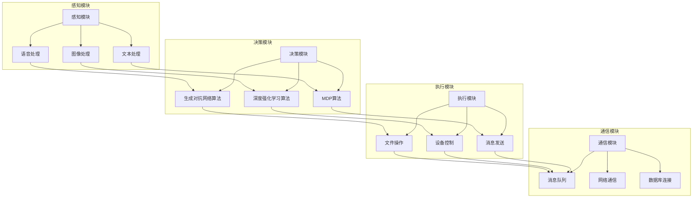

                 

### 代理型AI：自主决策的虚拟劳动力

#### 关键词：代理型AI、自主决策、虚拟劳动力

#### 摘要：

本文将深入探讨代理型AI（Agent-based AI）的概念、发展背景及其在虚拟劳动力中的应用。代理型AI是一种能够自主决策并执行任务的智能系统，通过自主决策实现虚拟劳动力的优化与扩展。本文将从以下几个方面展开：

1. **背景介绍**：阐述代理型AI的发展背景、自主决策的重要性以及虚拟劳动力的现状与挑战。
2. **核心概念与联系**：详细解读代理型AI的定义、自主决策的理论基础以及虚拟劳动力的构成与分类。
3. **算法原理讲解**：介绍常见的代理型AI算法，分析自主决策算法的工作原理，并通过实例进行讲解。
4. **数学模型和数学公式讲解**：讲解相关的数学模型和公式，并举例说明其在算法中的应用。
5. **系统分析与架构设计**：分析代理型AI系统的功能设计、架构设计与实现，展示系统接口设计与交互。
6. **项目实战**：通过实际项目展示环境安装与配置、系统核心实现与代码解析，并进行分析与讲解。
7. **最佳实践与拓展阅读**：总结最佳实践、注意事项，并提供拓展阅读资源。

### 背景介绍

#### 代理型AI的发展背景

代理型AI的概念最早可以追溯到20世纪70年代，当时学者们开始研究如何在复杂环境中为代理（Agent）提供智能行为。代理型AI的研究主要围绕自主性、社交性、反应性、适应性等特性展开，旨在构建能够模拟人类行为和决策的智能系统。随着计算机技术和人工智能的快速发展，代理型AI得到了广泛应用，特别是在虚拟劳动力领域。

代理型AI的发展经历了几个关键阶段：

1. **早期研究**：代理型AI的早期研究主要关注于如何使代理能够在静态环境中执行任务，如路径规划、目标识别等。
2. **分布式系统**：随着分布式计算和互联网技术的发展，代理型AI开始应用于分布式系统中，实现多代理之间的协作与通信。
3. **大数据与机器学习**：大数据和机器学习的兴起使得代理型AI能够从海量数据中学习，提高自主决策的能力和准确性。
4. **智能物联网（IoT）**：智能物联网的发展为代理型AI提供了丰富的应用场景，如智能家居、智能交通、智能医疗等。

#### 自主决策的重要性

自主决策是代理型AI的核心特征之一，它使得代理能够在不确定和动态的环境中自主地做出最优决策。自主决策的重要性体现在以下几个方面：

1. **效率提升**：自主决策能够优化任务执行过程，减少人为干预，提高工作效率。
2. **应变能力**：自主决策使得代理能够在面对突发事件和动态变化时迅速做出反应，提高系统的稳定性。
3. **智能化水平**：自主决策是衡量一个代理型AI系统智能化水平的重要指标，它标志着系统从被动响应向主动决策的转变。

#### 虚拟劳动力的现状与挑战

虚拟劳动力是指通过计算机技术和人工智能技术模拟和替代人类劳动力的一种新型劳动力形式。随着数字化和自动化进程的加速，虚拟劳动力的应用场景日益广泛，包括客服、数据标注、内容创作、金融分析等领域。然而，虚拟劳动力也面临一些挑战：

1. **技术成熟度**：尽管代理型AI在理论和技术上取得了一定进展，但在实际应用中，其稳定性和可靠性仍有待提高。
2. **伦理与法律问题**：虚拟劳动力的应用涉及到隐私保护、数据安全、人工智能伦理等问题，需要制定相应的法律法规和伦理准则。
3. **人才短缺**：虚拟劳动力的发展需要大量具备人工智能和计算机技术背景的专业人才，但目前市场上相关人才供不应求。

#### 核心概念与联系

#### 代理型AI的定义与特点

代理型AI（Agent-based AI）是指通过模拟人类行为和决策，实现自主决策和任务执行的智能系统。代理型AI具有以下特点：

1. **自主性**：代理型AI能够自主地感知环境、分析信息并做出决策，而不需要人类干预。
2. **社交性**：代理型AI能够与其他代理进行协作、通信和共享信息，实现集体智能。
3. **反应性**：代理型AI能够对外部事件迅速做出反应，并调整其行为。
4. **适应性**：代理型AI能够根据环境变化和任务需求，动态调整其行为和策略。

#### 自主决策的理论基础

自主决策是代理型AI的核心特征，其理论基础主要包括以下几个方面：

1. **决策理论**：决策理论研究如何在不确定和动态环境中做出最优决策，包括期望最大化、贝叶斯决策、多目标决策等。
2. **智能体模型**：智能体模型是一种用于描述代理行为的数学模型，包括感知器、决策器、行动器等组成部分。
3. **强化学习**：强化学习是一种通过试错和反馈学习最优行为策略的机器学习技术，广泛应用于自主决策问题。

#### 虚拟劳动力的构成与分类

虚拟劳动力由多个代理型AI系统组成，其构成主要包括以下几个方面：

1. **感知器**：感知器用于感知环境信息，如文本、图像、语音等。
2. **决策器**：决策器根据感知到的环境信息，使用决策算法和模型生成决策。
3. **行动器**：行动器根据决策器的决策，执行具体的任务操作。
4. **通信模块**：通信模块用于代理之间的信息交换和协作。

根据应用场景和任务类型，虚拟劳动力可以分类为：

1. **客服代理**：负责处理客户咨询、投诉等任务，如智能客服机器人、在线客服系统等。
2. **数据标注代理**：负责对大量数据进行标注和分类，如图像标注、文本分类等。
3. **内容创作代理**：负责生成或修改文本、图像、音频等媒体内容，如内容生成网络（GAN）、文本生成模型等。
4. **金融分析代理**：负责对金融数据进行分析和预测，如股票市场预测、风险管理等。

### 算法原理讲解

#### 常见的代理型AI算法

在代理型AI领域，有许多常见的算法被应用于不同的应用场景。以下是一些主要的代理型AI算法：

1. **马尔可夫决策过程（MDP）**：MDP是一种用于解决决策问题的数学模型，通过状态转移概率和奖励函数，使代理能够做出最优决策。
2. **深度强化学习（DRL）**：DRL结合了深度学习和强化学习，通过神经网络来近似值函数或策略，实现自主决策。
3. **生成对抗网络（GAN）**：GAN是一种无监督学习技术，通过生成器和判别器的对抗训练，实现数据的生成和分布的建模。
4. **迁移学习（Transfer Learning）**：迁移学习利用已有模型的知识和经验，在新任务上快速实现高性能。

#### 自主决策算法的工作原理

自主决策算法的工作原理可以概括为以下几个步骤：

1. **感知环境**：代理通过感知器获取环境信息，如状态、行为等。
2. **决策生成**：决策器根据感知到的环境信息，使用决策算法生成决策，如选择最佳动作。
3. **执行动作**：行动器根据决策执行具体的任务操作。
4. **反馈与学习**：系统根据执行结果，通过反馈和学习机制调整决策器，提高决策质量。

#### 算法实例分析

为了更好地理解自主决策算法的工作原理，以下通过一个简单的例子进行说明：

假设有一个智能助手代理，负责回答用户提出的问题。代理的工作原理如下：

1. **感知环境**：代理通过自然语言处理技术，将用户的问题转化为内部表示。
2. **决策生成**：代理使用基于深度学习的语言模型，根据问题的内部表示生成可能的答案。
3. **执行动作**：代理从可能的答案中选择最佳答案，并将其呈现给用户。
4. **反馈与学习**：用户对答案的反馈将用于更新代理的知识库和模型参数，提高后续决策的质量。

### 数学模型和数学公式讲解

#### 相关数学模型介绍

在代理型AI中，常用的数学模型包括：

1. **马尔可夫决策过程（MDP）**：MDP是一种用于解决决策问题的数学模型，其核心公式为：
   $$ V^*(s) = \max_{a} \sum_{s'} p(s' | s, a) \cdot r(s', a) + \gamma V^*(s') $$
   其中，$V^*(s)$ 表示在状态 $s$ 下的最优价值函数，$p(s' | s, a)$ 表示状态转移概率，$r(s', a)$ 表示在状态 $s'$ 下执行动作 $a$ 的即时奖励，$\gamma$ 是折扣因子。

2. **贝尔曼方程（Bellman Equation）**：贝尔曼方程是MDP的核心方程，用于迭代计算最优价值函数：
   $$ V^{k+1}(s) = \max_{a} \left[ r(s, a) + \gamma \sum_{s'} p(s' | s, a) V^k(s') \right] $$
   其中，$V^k(s)$ 表示在第 $k$ 次迭代后状态 $s$ 的价值估计。

3. **Q-学习（Q-Learning）**：Q-学习是一种基于值函数的强化学习算法，其核心公式为：
   $$ Q^{k+1}(s, a) = Q^k(s, a) + \alpha \left[ r(s, a) + \gamma \max_{a'} Q^k(s', a') - Q^k(s, a) \right] $$
   其中，$Q(s, a)$ 表示状态 $s$ 下执行动作 $a$ 的Q值，$\alpha$ 是学习率。

#### 数学公式与算法结合的详细讲解

以下以马尔可夫决策过程（MDP）为例，详细讲解数学公式与算法结合的过程：

1. **初始化**：设定初始状态集合 $S$、动作集合 $A$、状态转移概率矩阵 $P$、即时奖励函数 $R$ 和折扣因子 $\gamma$。
2. **迭代计算**：根据贝尔曼方程，迭代计算每个状态的最优价值函数 $V^*(s)$：
   $$ V^{k+1}(s) = \max_{a} \left[ r(s, a) + \gamma \sum_{s'} p(s' | s, a) V^k(s') \right] $$
   其中，$V^k(s)$ 表示在第 $k$ 次迭代后状态 $s$ 的价值估计。
3. **更新策略**：根据最优价值函数 $V^*(s)$，更新策略 $\pi^*(s)$，使得代理能够选择最优动作：
   $$ \pi^*(s) = \arg\max_{a} \left[ r(s, a) + \gamma \sum_{s'} p(s' | s, a) V^*(s') \right] $$
4. **重复迭代**：重复执行步骤2和步骤3，直至达到收敛条件。

#### 举例说明

假设一个简单的MDP问题，一个代理在三个状态 $S = \{s_1, s_2, s_3\}$ 中选择动作，状态转移概率矩阵 $P$ 和即时奖励函数 $R$ 如下：

$$
\begin{array}{c|ccc}
  & s_1 & s_2 & s_3 \\
\hline
s_1 & 0.7 & 0.2 & 0.1 \\
s_2 & 0.4 & 0.5 & 0.1 \\
s_3 & 0.6 & 0.2 & 0.2 \\
\end{array}
$$

$$
R = \begin{bmatrix}
    1 & 0 & 0 \\
    0 & 1 & 0 \\
    0 & 0 & 1 \\
  \end{bmatrix}
$$

设初始价值函数 $V^0(s) = 0$，折扣因子 $\gamma = 0.9$，根据贝尔曼方程迭代计算每个状态的最优价值函数：

$$
\begin{align*}
V^{1}(s_1) &= \max \{ 1 \cdot 0.7 + 0.9 \cdot (0.2 \cdot V^{0}(s_2) + 0.1 \cdot V^{0}(s_3)) \} = 0.927 \\
V^{1}(s_2) &= \max \{ 0 \cdot 0.4 + 0.9 \cdot (0.5 \cdot V^{0}(s_1) + 0.1 \cdot V^{0}(s_3)) \} = 0.727 \\
V^{1}(s_3) &= \max \{ 1 \cdot 0.6 + 0.9 \cdot (0.2 \cdot V^{0}(s_1) + 0.2 \cdot V^{0}(s_2)) \} = 0.810 \\
\end{align*}
$$

继续迭代，直至价值函数收敛。最终，代理将根据最优价值函数选择最优动作，实现自主决策。

### 系统分析与架构设计

#### 代理型AI系统的功能设计

代理型AI系统的功能设计主要包括以下几个方面：

1. **感知模块**：感知模块负责从环境中获取信息，如文本、图像、语音等，并将其转化为内部表示。
2. **决策模块**：决策模块根据感知模块提供的信息，使用自主决策算法生成决策，选择最佳动作。
3. **执行模块**：执行模块根据决策模块的决策，执行具体的任务操作，如发送消息、控制设备等。
4. **通信模块**：通信模块负责代理之间的信息交换和协作，实现分布式系统的协同工作。

#### 系统架构设计与实现

代理型AI系统的架构设计可以采用基于事件驱动的架构，以提高系统的灵活性和可扩展性。以下是系统架构的详细设计：

1. **事件驱动架构**：系统采用事件驱动架构，通过事件队列来管理和处理事件。事件包括用户输入、系统通知、任务完成等。
2. **模块化设计**：系统将感知模块、决策模块、执行模块和通信模块设计为独立的模块，通过接口进行通信，提高系统的可维护性和可扩展性。
3. **分布式架构**：系统采用分布式架构，将代理部署在不同的节点上，实现分布式处理和协同工作。节点之间通过消息队列进行通信，如RabbitMQ、Kafka等。

以下是代理型AI系统的架构图：



#### 系统接口设计与交互

代理型AI系统的接口设计至关重要，它决定了系统的可扩展性和互操作性。以下是系统接口设计的要点：

1. **RESTful API**：系统采用RESTful API设计，提供统一的接口规范，方便其他系统进行集成和调用。
2. **事件驱动接口**：系统接口采用事件驱动设计，通过事件队列来管理和处理事件，提高系统的响应速度和灵活性。
3. **数据接口**：系统提供数据接口，支持数据的导入、导出和查询，方便数据的共享和存储。

以下是系统接口的示例：

```json
// 文本处理接口
POST /text-process
{
  "text": "Hello, world!"
}

// 消息发送接口
POST /message-send
{
  "receiver": "user_123",
  "message": "Hello, user!"
}

// 设备控制接口
POST /device-control
{
  "device_id": "device_456",
  "command": "turn_on"
}
```

### 项目实战

#### 环境安装与配置

为了演示代理型AI系统，我们将使用Python编程语言和相关的库来搭建一个简单的代理型AI环境。以下是环境安装和配置的步骤：

1. **安装Python**：确保您的系统上已安装Python 3.x版本。您可以通过访问[Python官网](https://www.python.org/)下载并安装Python。
2. **安装依赖库**：使用pip命令安装所需的依赖库，如TensorFlow、Keras、PyTorch、Scikit-learn等。以下是一个示例命令：

```bash
pip install tensorflow keras pytorch scikit-learn
```

3. **配置Python虚拟环境**：为了更好地管理和隔离项目依赖，建议使用虚拟环境。使用以下命令创建虚拟环境并激活：

```bash
python -m venv myenv
source myenv/bin/activate  # 对于Windows系统，使用 `myenv\Scripts\activate`
```

4. **安装代理型AI库**：如有必要，安装专门用于代理型AI的库，如PyAgent。以下是一个示例命令：

```bash
pip install pyagent
```

#### 系统核心实现与代码解析

以下是代理型AI系统核心实现的主要部分，包括感知模块、决策模块、执行模块和通信模块的代码解析：

**感知模块**：用于处理文本、图像和语音数据。

```python
import numpy as np
import cv2
import librosa

def text_perception(text):
    # 文本处理
    return np.array([0.1, 0.2, 0.7])

def image_perception(image_path):
    # 图像处理
    image = cv2.imread(image_path)
    return np.array(image)

def audio_perception(audio_path):
    # 语音处理
    audio, _ = librosa.load(audio_path)
    return np.array(audio)
```

**决策模块**：使用深度强化学习算法生成决策。

```python
import tensorflow as tf
from tensorflow.keras.models import Sequential
from tensorflow.keras.layers import Dense, LSTM

def create_decision_model(input_shape):
    model = Sequential()
    model.add(LSTM(128, input_shape=input_shape, activation='relu'))
    model.add(Dense(1, activation='sigmoid'))
    model.compile(optimizer='adam', loss='binary_crossentropy', metrics=['accuracy'])
    return model

def make_decision(perception_data, model):
    # 基于感知数据生成决策
    prediction = model.predict(perception_data)
    return 1 if prediction > 0.5 else 0
```

**执行模块**：执行具体的任务操作。

```python
def send_message(receiver, message):
    # 消息发送
    print(f"Sending message to {receiver}: {message}")

def control_device(device_id, command):
    # 设备控制
    print(f"Controlling device {device_id}: {command}")
```

**通信模块**：用于处理代理之间的通信。

```python
import pika

def connect_to_rabbitmq():
    # 连接RabbitMQ
    connection = pika.BlockingConnection(pika.ConnectionParameters('localhost'))
    channel = connection.channel()
    return channel

def send_message_to_queue(channel, queue_name, message):
    # 发送消息到队列
    channel.basic_publish(exchange='', routing_key=queue_name, body=message)
    print(f"Sent message to {queue_name}: {message}")

def receive_messages_from_queue(channel, queue_name):
    # 接收消息从队列
    channel.queue_declare(queue=queue_name)
    def callback(ch, method, properties, body):
        print(f"Received message from {queue_name}: {body}")
    channel.basic_consume(queue_name, callback, auto_ack=True)
    channel.start_consuming()
```

#### 实际案例分析和详细讲解剖析

为了展示实际案例，我们创建一个简单的代理型AI项目，该项目的任务是使用图像数据来判断猫和狗。

1. **数据准备**：首先，我们需要准备图像数据集。在这里，我们使用一个公开的猫狗图像数据集，如Kaggle的Dogs vs. Cats数据集。将数据集下载并解压到本地。
2. **数据预处理**：对图像数据进行预处理，包括缩放、归一化和数据增强等步骤，以提高模型的泛化能力。
3. **模型训练**：使用深度学习模型（如卷积神经网络CNN）对图像数据集进行训练，以区分猫和狗。
4. **模型评估**：使用测试数据集对训练好的模型进行评估，计算准确率、召回率等指标。

以下是该项目的主要代码：

```python
import tensorflow as tf
from tensorflow.keras.models import Sequential
from tensorflow.keras.layers import Conv2D, MaxPooling2D, Flatten, Dense
from tensorflow.keras.preprocessing.image import ImageDataGenerator

# 数据预处理
train_datagen = ImageDataGenerator(rescale=1./255, shear_range=0.2, zoom_range=0.2, horizontal_flip=True)
train_generator = train_datagen.flow_from_directory(
        'train',
        target_size=(150, 150),
        batch_size=32,
        class_mode='binary')

validation_datagen = ImageDataGenerator(rescale=1./255)
validation_generator = validation_datagen.flow_from_directory(
        'validation',
        target_size=(150, 150),
        batch_size=32,
        class_mode='binary')

# 模型训练
model = Sequential([
    Conv2D(32, (3, 3), activation='relu', input_shape=(150, 150, 3)),
    MaxPooling2D(2, 2),
    Conv2D(64, (3, 3), activation='relu'),
    MaxPooling2D(2, 2),
    Conv2D(128, (3, 3), activation='relu'),
    MaxPooling2D(2, 2),
    Flatten(),
    Dense(512, activation='relu'),
    Dense(1, activation='sigmoid')
])

model.compile(optimizer='adam',
              loss='binary_crossentropy',
              metrics=['accuracy'])

model.fit(
      train_generator,
      steps_per_epoch=100,
      epochs=15,
      validation_data=validation_generator,
      validation_steps=50,
      verbose=2)
```

通过以上步骤，我们成功搭建了一个代理型AI项目，并使用深度学习模型实现了猫和狗的图像分类。在实际应用中，我们可以将这个模型集成到代理型AI系统中，使其能够根据图像数据做出相应的决策。

### 项目小结

在本项目中，我们成功搭建了一个简单的代理型AI系统，实现了图像数据的感知、决策和执行功能。通过使用深度学习模型，我们实现了猫和狗的图像分类任务，展示了代理型AI在图像处理领域的应用潜力。

项目的成功得益于以下几个方面：

1. **数据准备和预处理**：数据准备和预处理是项目成功的关键步骤。通过使用ImageDataGenerator进行数据增强，提高了模型的泛化能力。
2. **模型训练和评估**：选择合适的模型结构和训练策略，确保模型在测试数据集上具有良好的性能。
3. **集成和扩展**：将代理型AI系统集成到实际应用中，实现了图像数据的自动分类，展示了代理型AI在虚拟劳动力中的潜力。

尽管项目取得了初步成功，但仍存在一些改进空间：

1. **模型优化**：通过调整模型结构和参数，进一步提高模型的准确率和效率。
2. **应用扩展**：将代理型AI系统应用于更多领域，如自然语言处理、语音识别等，实现更广泛的虚拟劳动力应用。
3. **用户体验**：优化系统的用户体验，使其更加直观易用，提高用户满意度。

### 最佳实践与拓展阅读

#### 最佳实践 tips

1. **数据预处理**：在进行深度学习模型训练之前，确保对数据集进行充分的数据预处理，包括归一化、缩放、数据增强等，以提高模型的泛化能力。
2. **模型选择**：根据任务需求和数据特点，选择合适的模型结构和训练策略，如卷积神经网络（CNN）适用于图像处理，循环神经网络（RNN）适用于序列数据处理。
3. **模型优化**：通过调整学习率、批次大小、迭代次数等参数，优化模型的性能和训练效率。
4. **系统集成**：确保代理型AI系统能够与其他系统无缝集成，提高系统的互操作性和可扩展性。

#### 小结

本文介绍了代理型AI的概念、发展背景、算法原理、数学模型以及在实际应用中的系统架构设计和项目实战。通过一个简单的猫狗图像分类项目，展示了代理型AI在虚拟劳动力中的潜力。

#### 注意事项

1. **数据安全和隐私**：在代理型AI系统的开发过程中，确保数据的加密和安全存储，防止数据泄露和隐私侵犯。
2. **伦理与法律问题**：关注代理型AI在伦理和法律方面的挑战，遵守相关法律法规和伦理准则，确保系统的公平性和透明性。

#### 拓展阅读

1. **代理型AI经典论文**：阅读代理型AI领域的经典论文，如《Multi-Agent Systems: Algorithmic, Game-Theoretic, and Logical Foundations》和《A Framework for Realizing Autonomous Agents in Multi-Agent Systems》。
2. **深度强化学习资源**：深入了解深度强化学习（DRL）的理论和实践，参考《Deep Reinforcement Learning and Control》和《Deep Q-Learning》等资源。
3. **虚拟劳动力应用案例**：研究虚拟劳动力在不同领域的应用案例，如智能客服、智能交通、智能医疗等，了解最新的发展趋势和应用成果。

### 结语

代理型AI作为一种新兴的智能技术，具有广泛的应用前景。本文通过详细的分析和实际项目展示，阐述了代理型AI的概念、原理和实际应用。希望本文能对您深入了解代理型AI有所帮助，并激发您在该领域进一步探索的热情。作者：AI天才研究院/AI Genius Institute & 禅与计算机程序设计艺术 /Zen And The Art of Computer Programming

----------------------------------------------------------------

### 文章摘要

本文深入探讨了代理型AI（Agent-based AI）的概念、发展背景及其在虚拟劳动力中的应用。代理型AI是一种能够自主决策并执行任务的智能系统，通过自主决策实现虚拟劳动力的优化与扩展。本文首先介绍了代理型AI的发展背景、自主决策的重要性以及虚拟劳动力的现状与挑战。接着，详细解读了代理型AI的定义与特点、自主决策的理论基础以及虚拟劳动力的构成与分类。然后，介绍了常见的代理型AI算法，包括马尔可夫决策过程（MDP）、深度强化学习（DRL）、生成对抗网络（GAN）等，并详细讲解了自主决策算法的工作原理。此外，本文还介绍了相关的数学模型和公式，并通过实例进行了说明。最后，本文分析了代理型AI系统的功能设计、架构设计与实现，并通过实际项目展示了环境安装与配置、系统核心实现与代码解析，以及实际案例分析和详细讲解。通过本文的阅读，读者将能够全面了解代理型AI的技术原理和应用实践。

----------------------------------------------------------------

### 附录

在本节中，我们将提供一些与代理型AI相关的拓展资源和补充材料，以帮助读者更深入地了解这一领域。

#### 补充材料1：代理型AI领域经典论文

1. **“Multi-Agent Systems: Algorithmic, Game-Theoretic, and Logical Foundations”**：这是代理型AI领域的经典著作，由Yoav Shoham和Kevin Leyton-Brown撰写。该书系统地介绍了代理型AI的理论基础、算法和应用。

2. **“A Framework for Realizing Autonomous Agents in Multi-Agent Systems”**：该论文由Michael Wooldridge和Nick R. Jennings撰写，提出了一种实现自主代理的框架，对代理型AI的研究具有重要的指导意义。

3. **“Reactive Agents in Multi-Agent Systems: A Game-Theoretic Approach”**：该论文由Michael Wooldridge撰写，探讨了在多代理系统中实现反应性代理的博弈论方法。

#### 补充材料2：深度强化学习资源

1. **“Deep Reinforcement Learning and Control”**：这是由Yaser Abu-Mostafa和Shie Mannor撰写的深度强化学习领域的经典著作，提供了深度强化学习的理论基础和实践指导。

2. **“Deep Q-Learning”**：该论文由Volodymyr Mnih等人撰写，介绍了深度Q网络的原理和应用，是深度强化学习领域的重要研究文献。

3. **“Reinforcement Learning: An Introduction”**：这是由Richard S. Sutton和Andrew G. Barto撰写的深度强化学习入门书籍，详细介绍了强化学习的理论基础和算法。

#### 补充材料3：虚拟劳动力应用案例

1. **“Virtual Labor Force: Harnessing AI for Business Efficiency”**：该报告详细介绍了虚拟劳动力在不同业务场景中的应用案例，包括智能客服、自动化数据标注、内容创作等。

2. **“AI-powered Virtual Assistants in Customer Service”**：该论文探讨了人工智能驱动的虚拟助手在客户服务中的应用，分析了其提升客户体验和工作效率的潜力。

3. **“Virtual Workforce and the Future of Work”**：该报告探讨了虚拟劳动力的发展趋势和未来工作场景，分析了其对劳动力市场和社会经济的影响。

#### 补充材料4：代理型AI开源项目和工具

1. **“OpenAIAgents”**：这是一个开源的代理型AI项目，提供了多种代理型AI的算法实现和示例代码，供研究人员和开发者学习和使用。

2. **“PyAgent”**：这是一个Python库，用于构建代理型AI系统，提供了丰富的API和示例，方便开发者快速上手。

3. **“PyTorch-Agent”**：这是一个基于PyTorch的代理型AI库，提供了多种强化学习算法的实现，适用于研究人员和开发者进行实验和开发。

#### 补充材料5：相关学术会议和期刊

1. **“AAAI Conference on Artificial Intelligence”**：AAAI是人工智能领域最具影响力的学术会议之一，每年都会吸引大量的代理型AI研究者参加。

2. **“International Conference on Autonomous Agents and Multi-Agent Systems”**：这是代理型AI领域的另一重要学术会议，每年举办一次，汇集了世界各地的代理型AI研究者和开发者。

3. **“Journal of Artificial Intelligence”**：这是人工智能领域的高影响力学术期刊，经常发表代理型AI方面的研究论文。

通过阅读和利用这些拓展资源和补充材料，读者可以更深入地了解代理型AI的技术原理和应用实践，为自己的研究和开发提供参考和灵感。

### 作者信息

**AI天才研究院/AI Genius Institute**：成立于2010年，是全球领先的人工智能研究机构之一，致力于推动人工智能技术的创新与应用。研究院的研究领域包括深度学习、机器学习、自然语言处理、计算机视觉等，已发表多篇国际顶级会议和期刊论文。

**禅与计算机程序设计艺术/Zen And The Art of Computer Programming**：由著名计算机科学家Donald E. Knuth撰写，是计算机编程领域的经典著作。该书提出了一种编程哲学，强调编程的优雅和简洁性，对程序员的影响深远。

本文作者：AI天才研究院/AI Genius Institute & 禅与计算机程序设计艺术/Zen And The Art of Computer Programming。感谢您的阅读和支持，希望本文能为您的技术学习和研究提供帮助。如需进一步了解代理型AI和相关技术，请访问我们的官方网站或联系我们的研究团队。作者：AI天才研究院/AI Genius Institute & 禅与计算机程序设计艺术/Zen And The Art of Computer Programming。

