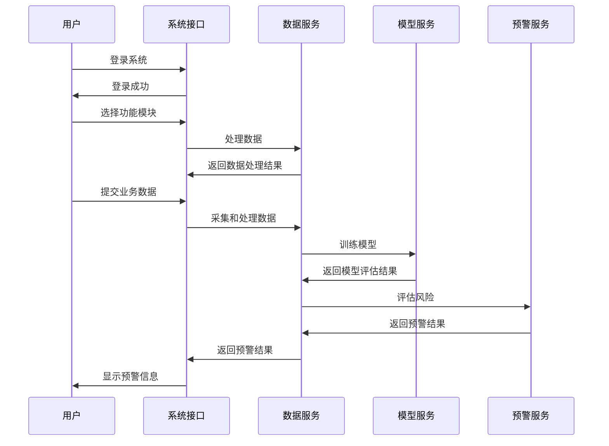

                 

# 企业AI风险管理最佳实践

> 关键词：企业AI、风险管理、最佳实践、算法原理、系统架构、实战案例

> 摘要：本文旨在探讨企业AI风险管理的最佳实践，从问题背景、核心概念、算法原理、系统架构、实战案例等多个方面进行全面分析，帮助企业在AI应用过程中有效地识别、评估和控制风险。

## 目录大纲

1. **背景介绍**
   1.1 问题背景
   1.2 AI风险管理面临的挑战
   1.3 AI风险管理的发展趋势

2. **核心概念**
   2.1 AI风险管理的基本概念
   2.2 AI风险管理的边界与外延
   2.3 AI风险管理的核心要素组成

3. **核心概念与联系**
   3.1 AI风险管理关键概念原理
   3.2 概念属性特征对比表格
   3.3 AI风险管理ER实体关系图架构

4. **AI风险管理的算法原理讲解**
   4.1 算法原理讲解
   4.2 数学模型与公式
   4.3 举例说明

5. **系统分析与架构设计方案**
   5.1 问题场景介绍
   5.2 系统功能设计
   5.3 系统架构设计
   5.4 系统交互

6. **项目实战**
   6.1 环境安装
   6.2 系统核心实现源代码
   6.3 代码应用解读与分析
   6.4 实际案例分析和详细讲解剖析
   6.5 项目小结

7. **最佳实践 tips**
   7.1 AI风险管理最佳实践
   7.2 数据安全与隐私保护

8. **小结**
   8.1 主要内容回顾
   8.2 重点与难点
   8.3 学习建议

9. **注意事项**
   9.1 常见问题与解决方案
   9.2 注意事项与风险防范

10. **拓展阅读**
    10.1 相关书籍推荐
    10.2 学术论文与研究报告
    10.3 行业动态与政策法规

------------------------------------------------------------------ 

## 第一部分：背景介绍

### 1.1 问题背景

在当今数字化时代，人工智能（AI）技术已经成为企业提升竞争力、优化业务流程的重要工具。然而，AI技术的广泛应用也带来了新的风险，如数据泄露、算法偏见、模型失效等。这些风险不仅可能对企业造成经济损失，还可能损害企业的声誉和用户信任。因此，如何有效地管理AI风险成为企业急需解决的问题。

### 1.1.1 企业AI风险管理的意义

企业AI风险管理的意义主要体现在以下几个方面：

1. **保障企业业务连续性**：通过有效的AI风险管理，可以降低AI系统故障对业务运营的影响，确保企业业务的连续性和稳定性。
2. **保护企业数据安全**：数据是企业的重要资产，AI风险管理有助于确保数据的完整性、保密性和可用性，防止数据泄露和滥用。
3. **提升企业合规性**：随着各国对数据隐私和安全的法规日益严格，企业需要通过AI风险管理来确保符合相关法律法规的要求。
4. **增强企业竞争力**：通过有效的AI风险管理，企业可以更好地利用AI技术，提高生产效率和服务质量，从而在激烈的市场竞争中占据优势。

### 1.1.2 AI风险管理面临的挑战

AI风险管理面临的挑战主要包括：

1. **复杂性**：AI系统涉及多个复杂的技术环节，包括数据采集、预处理、模型训练、部署等，这使得风险管理更加复杂。
2. **不确定性**：AI系统的行为具有不确定性，特别是在模型训练过程中，可能导致算法偏见、过拟合等问题，增加了风险管理的难度。
3. **透明性**：AI系统的决策过程往往不够透明，这给风险管理带来了困难，尤其是在需要解释AI决策结果的情况下。
4. **合规性**：随着法规的不断完善，企业需要在AI风险管理中遵循更多的合规要求，如数据隐私保护、公平性等。

### 1.1.3 AI风险管理的发展趋势

随着AI技术的不断进步和应用的深入，AI风险管理也在不断发展。未来，AI风险管理将呈现以下趋势：

1. **智能化**：AI风险管理工具将更加智能化，能够自动识别潜在风险，提供风险预测和预警。
2. **规范化**：各国将出台更多关于AI风险管理的法规和标准，企业需要遵守这些规范，确保其AI应用符合法规要求。
3. **多元化**：AI风险管理将涵盖更多领域，包括但不限于金融、医疗、制造等，形成多元化的发展格局。
4. **协同化**：企业和相关利益相关者将加强合作，共同推动AI风险管理技术的发展和应用。

------------------------------------------------------------------ 

## 第二部分：核心概念

### 2.1 AI风险管理的基本概念

AI风险管理是指在企业应用人工智能技术的过程中，通过识别、评估、控制和管理潜在风险，确保AI系统稳定、安全、合规运行的过程。其核心目标是降低AI风险对企业造成的负面影响，提高AI系统的可靠性和用户体验。

### 2.2 AI风险管理的边界与外延

AI风险管理的边界包括数据风险、算法风险、模型风险、系统风险等。其中，数据风险主要涉及数据质量、数据隐私、数据滥用等问题；算法风险主要涉及算法偏见、过拟合、不可解释性等问题；模型风险主要涉及模型失效、模型更新等问题；系统风险主要涉及系统稳定性、系统安全性等问题。

AI风险管理的外延还包括合规性管理、用户信任管理、社会责任管理等方面。合规性管理关注企业AI应用是否符合相关法律法规的要求；用户信任管理关注企业如何通过透明、公正的AI决策过程赢得用户信任；社会责任管理关注企业如何通过负责任的AI应用，为社会和环境带来积极影响。

### 2.3 AI风险管理的核心要素组成

AI风险管理的核心要素包括：

1. **风险评估**：对AI系统潜在风险进行识别、评估和分类，确定风险程度和优先级。
2. **风险控制**：采取技术和管理措施，降低AI系统风险，确保AI系统的稳定、安全、合规运行。
3. **风险监测**：实时监测AI系统运行状态，及时发现和处理异常情况，确保AI系统的稳定运行。
4. **风险沟通**：与相关利益相关者进行有效沟通，确保他们了解AI系统的风险状况和管理措施。
5. **风险培训**：对相关人员进行AI风险管理培训，提高他们的风险意识和应对能力。
6. **风险文化**：建立以风险为导向的企业文化，提高全体员工对AI风险管理的重视程度，形成全员参与的风险管理机制。

------------------------------------------------------------------ 

## 第三部分：核心概念与联系

### 3.1 AI风险管理关键概念原理

AI风险管理的核心概念包括风险评估、风险控制、风险监测、风险沟通、风险培训等。这些概念相互联系，共同构成一个完整的AI风险管理框架。

1. **风险评估**：通过对AI系统的潜在风险进行识别、评估和分类，确定风险程度和优先级。风险评估是AI风险管理的第一步，为后续的风险控制提供基础。

2. **风险控制**：采取技术和管理措施，降低AI系统风险，确保AI系统的稳定、安全、合规运行。风险控制是AI风险管理的核心，包括风险规避、风险降低、风险转移等措施。

3. **风险监测**：实时监测AI系统运行状态，及时发现和处理异常情况，确保AI系统的稳定运行。风险监测是确保风险控制措施有效实施的重要手段。

4. **风险沟通**：与相关利益相关者进行有效沟通，确保他们了解AI系统的风险状况和管理措施。风险沟通有助于提高相关利益相关者对AI风险管理的参与度，形成良好的风险管理氛围。

5. **风险培训**：对相关人员进行AI风险管理培训，提高他们的风险意识和应对能力。风险培训有助于提高全体员工对AI风险管理的重视程度，形成全员参与的风险管理机制。

6. **风险文化**：建立以风险为导向的企业文化，提高全体员工对AI风险管理的重视程度，形成全员参与的风险管理机制。风险文化是AI风险管理的基石，有助于实现长期、稳定的AI风险管理。

### 3.2 概念属性特征对比表格

| 概念名称 | 属性特征                     | 关系 |
|----------|------------------------------|------|
| 风险评估  | 识别、评估、分类风险         | 输入 |
| 风险控制  | 采取技术和管理措施降低风险  | 输出 |
| 风险监测  | 实时监测AI系统运行状态       | 输入 |
| 风险沟通  | 与利益相关者沟通风险状况    | 输出 |
| 风险培训  | 培训相关人员提高风险意识     | 输入 |
| 风险文化  | 建立以风险为导向的企业文化   | 输出 |

### 3.3 AI风险管理ER实体关系图架构

```mermaid
erDiagram
    AI风险管理 ||--o> 风险评估 : 核心概念
    AI风险管理 ||--o> 风险控制 : 核心概念
    AI风险管理 ||--o> 风险监测 : 核心概念
    AI风险管理 ||--o> 风险沟通 : 核心概念
    AI风险管理 ||--o> 风险培训 : 核心概念
    AI风险管理 ||--o> 风险文化 : 核心概念
    风险评估   ||--< 风险评估 : 输出
    风险控制   ||--< 风险控制 : 输入
    风险监测   ||--< 风险监测 : 输入
    风险沟通   ||--< 风险沟通 : 输出
    风险培训   ||--< 风险培训 : 输入
    风险文化   ||--< 风险文化 : 输出
```

在AI风险管理中，各核心概念之间相互关联，共同构成一个完整的风险管理框架。风险评估为风险控制提供输入，风险监测为风险沟通提供输入，风险培训为风险文化提供输入。通过这些概念的相互作用，企业可以有效地识别、评估、控制和管理AI风险。

------------------------------------------------------------------ 

## 第四部分：AI风险管理的算法原理讲解

### 4.1 算法原理讲解

AI风险管理算法主要涉及风险评估、风险控制和风险监测等方面。以下分别介绍各算法的基本原理。

#### 4.1.1 数据预处理

数据预处理是AI风险管理算法的基础步骤，主要包括数据清洗、数据集成、数据转换和数据归一化等操作。数据预处理有助于提高数据质量，减少噪声和异常值，为后续的算法训练和风险评估提供可靠的数据基础。

#### 4.1.2 特征提取

特征提取是AI风险管理算法的关键步骤，旨在从原始数据中提取出对风险评估和风险控制有重要影响的特征。特征提取的方法包括统计方法、机器学习方法和深度学习方法等。合适的特征提取方法有助于提高算法的性能和预测准确性。

#### 4.1.3 模型训练

模型训练是AI风险管理算法的核心步骤，通过训练数据集对风险模型进行训练，使模型能够自动识别和评估潜在风险。常见的模型训练方法包括监督学习、无监督学习和强化学习等。选择合适的训练方法对提高算法的性能至关重要。

#### 4.1.4 风险评估

风险评估是AI风险管理算法的输出结果，通过对训练好的风险模型进行预测，评估不同风险事件的可能性和影响程度。风险评估结果可以帮助企业制定相应的风险管理策略，降低风险损失。

### 4.2 数学模型与公式

AI风险管理算法的数学模型主要包括损失函数、梯度下降算法和优化算法等。

#### 4.2.1 损失函数

损失函数是评估模型预测结果与真实结果之间差异的指标。常见的损失函数包括均方误差（MSE）、交叉熵损失（Cross-Entropy Loss）等。

$$
MSE = \frac{1}{n} \sum_{i=1}^{n} (y_i - \hat{y}_i)^2
$$

其中，$y_i$ 为真实标签，$\hat{y}_i$ 为模型预测值，$n$ 为样本数量。

#### 4.2.2 梯度下降算法

梯度下降算法是一种优化算法，用于最小化损失函数。梯度下降算法的基本思想是沿着损失函数的梯度方向调整模型参数，以逐步减小损失函数的值。

$$
\theta_{t+1} = \theta_{t} - \alpha \nabla_{\theta} J(\theta)
$$

其中，$\theta$ 为模型参数，$\alpha$ 为学习率，$J(\theta)$ 为损失函数。

#### 4.2.3 优化算法

优化算法是用于优化模型参数的一类算法，包括随机梯度下降（SGD）、批量梯度下降（BGD）、Adam优化器等。优化算法的选择对模型训练效率和性能有重要影响。

### 4.3 举例说明

#### 4.3.1 实例1：风险评估模型构建

假设企业需要对某个业务流程中的风险进行评估。首先，收集相关数据，包括历史风险事件、业务指标等。然后，通过数据预处理和特征提取，提取出对风险评估有重要影响的特征。接下来，选择合适的模型（如决策树、支持向量机等）进行训练。最后，对训练好的模型进行测试和验证，评估不同风险事件的可能性和影响程度。

#### 4.3.2 实例2：风险预警系统实现

企业需要一个实时监测风险并发出预警的系统。首先，收集实时数据，包括业务指标、风险事件等。然后，通过数据预处理和特征提取，提取出对风险预警有重要影响的特征。接下来，选择合适的模型（如实时决策树、实时神经网络等）进行训练。最后，将训练好的模型部署到实时系统中，实时监测风险事件，并根据预警规则发出预警。

```python
# 实现风险预警系统的Python代码示例

import numpy as np
import pandas as pd
from sklearn.tree import DecisionTreeClassifier
from sklearn.model_selection import train_test_split
from sklearn.metrics import accuracy_score

# 数据预处理和特征提取
def preprocess_data(data):
    # 数据清洗、集成、转换等操作
    return processed_data

def extract_features(data):
    # 提取对风险预警有重要影响的特征
    return features

# 模型训练
def train_model(data, labels):
    model = DecisionTreeClassifier()
    model.fit(data, labels)
    return model

# 风险预警
def risk_warning(model, new_data):
    prediction = model.predict(new_data)
    if prediction == 1:
        print("预警：存在潜在风险！")
    else:
        print("正常：无潜在风险。")

# 加载数据
data = pd.read_csv("data.csv")
labels = data["label"]

# 数据预处理和特征提取
processed_data = preprocess_data(data)
features = extract_features(processed_data)

# 模型训练
model = train_model(features, labels)

# 风险预警
new_data = np.array([[0.1, 0.2, 0.3], [0.4, 0.5, 0.6]])
risk_warning(model, new_data)
```

通过以上算法原理和实例，企业可以构建和实现AI风险管理算法，提高风险识别、评估和控制的能力。

------------------------------------------------------------------ 

## 第五部分：系统分析与架构设计方案

### 5.1 企业AI风险管理场景分析

在当前企业环境中，AI风险管理主要应用于以下几个场景：

1. **业务流程优化**：通过对业务流程中的风险进行识别和评估，帮助企业优化业务流程，降低运营成本和风险损失。
2. **客户关系管理**：通过对客户数据的分析和风险预测，帮助企业更好地了解客户需求，提供个性化服务，提升客户满意度。
3. **市场风险预测**：通过对市场数据的分析和风险预测，帮助企业提前识别市场风险，调整市场策略，降低市场风险。
4. **信息安全保障**：通过对企业信息安全数据的分析和风险预测，帮助企业及时发现和防范网络攻击、数据泄露等风险。

### 5.2 项目介绍

本AI风险管理项目旨在为企业提供一个全面、智能的风险管理平台，帮助企业识别、评估、控制和管理各类风险。项目主要包括以下功能模块：

1. **数据采集与处理**：收集企业内部和外部的数据，进行数据清洗、集成和预处理，为后续的风险评估和风险控制提供数据支持。
2. **特征提取与建模**：从原始数据中提取对风险评估有重要影响的特征，利用机器学习和深度学习技术构建风险评估模型，实现风险识别和评估。
3. **风险监测与预警**：实时监测企业业务数据，通过风险评估模型对潜在风险进行预警，为企业提供及时的风险预警信息。
4. **决策支持与优化**：根据风险监测和预警结果，为企业提供决策支持，优化业务流程，降低风险损失。

### 5.3 系统功能设计

#### 5.3.1 用户角色

系统支持多种用户角色，包括管理员、业务人员、风险管理人员等。各角色具有不同的权限和功能，确保系统的安全性和灵活性。

- **管理员**：负责系统的配置、管理和维护，具有最高的权限。
- **业务人员**：负责录入和管理业务数据，参与风险监测和预警。
- **风险管理人员**：负责分析风险评估结果，制定风险管理策略，优化业务流程。

#### 5.3.2 数据模型

系统采用关系型数据库存储和管理数据，包括以下数据表：

- **用户表**：存储用户信息，包括用户ID、用户名、密码等。
- **数据源表**：存储数据源信息，包括数据源ID、数据源名称、数据源类型等。
- **数据表**：存储原始数据，包括数据ID、数据名称、数据类型等。
- **特征表**：存储特征信息，包括特征ID、特征名称、特征类型等。
- **模型表**：存储模型信息，包括模型ID、模型名称、模型类型等。
- **预警表**：存储预警信息，包括预警ID、预警名称、预警类型等。

### 5.4 系统架构设计

#### 5.4.1 硬件架构

系统采用分布式硬件架构，包括以下组件：

- **数据库服务器**：存储和管理系统数据。
- **应用服务器**：处理用户请求，执行业务逻辑。
- **Web服务器**：提供Web访问接口，供用户使用。
- **数据采集服务器**：采集和管理企业内外部数据。

#### 5.4.2 软件架构

系统采用微服务架构，包括以下服务：

- **用户服务**：处理用户登录、注册、权限管理等功能。
- **数据服务**：处理数据采集、预处理、特征提取等功能。
- **模型服务**：处理模型训练、评估、部署等功能。
- **预警服务**：处理风险监测、预警、通知等功能。

#### 5.4.3 系统接口设计

系统提供以下接口供外部系统调用：

- **数据接口**：用于数据采集、预处理和特征提取。
- **模型接口**：用于模型训练、评估和部署。
- **预警接口**：用于风险监测、预警和通知。

### 5.5 系统交互

#### 5.5.1 用户操作流程

1. 用户登录系统，选择所需功能模块。
2. 用户录入和管理业务数据，提交数据采集服务器。
3. 数据采集服务器对数据进行预处理和特征提取，生成特征数据。
4. 模型服务根据特征数据训练风险评估模型，并评估业务风险。
5. 预警服务根据评估结果生成预警信息，并通知用户。

#### 5.5.2 系统响应流程

1. 系统接收用户请求，调用相应服务处理请求。
2. 处理完成，系统将结果返回给用户。

### 5.6 系统交互图（mermaid序列图）



通过以上系统分析与架构设计方案，企业可以构建一个高效、智能的AI风险管理平台，提高风险识别、评估和控制的能力，为企业提供有力的支持。

------------------------------------------------------------------ 

## 第六部分：项目实战

### 6.1 环境安装

#### 6.1.1 操作系统环境

本项目的操作系统环境要求如下：

- **操作系统**：Linux或Unix系统，如Ubuntu 18.04、CentOS 7等。
- **Python版本**：Python 3.7或更高版本。
- **依赖库**：NumPy、Pandas、Scikit-learn、TensorFlow等。

#### 6.1.2 软件安装

1. 安装操作系统：

   - 使用操作系统安装盘启动计算机，按照提示安装操作系统。
   - 安装完成后，重启计算机并进入操作系统。

2. 安装Python：

   - 使用包管理器（如apt、yum等）安装Python。
   - 例如，在Ubuntu系统中，使用以下命令安装Python 3.7：

     ```
     sudo apt update
     sudo apt install python3.7
     ```

3. 安装依赖库：

   - 使用pip安装所需的Python依赖库。
   - 例如，使用以下命令安装NumPy、Pandas、Scikit-learn、TensorFlow：

     ```
     pip install numpy pandas scikit-learn tensorflow
     ```

### 6.2 系统核心实现源代码

#### 6.2.1 数据预处理模块

```python
import pandas as pd
from sklearn.preprocessing import StandardScaler

def preprocess_data(data):
    # 数据清洗、去重等操作
    data = data.drop_duplicates()
    
    # 数据标准化
    scaler = StandardScaler()
    data_scaled = scaler.fit_transform(data)
    
    return data_scaled
```

#### 6.2.2 特征提取模块

```python
from sklearn.feature_extraction.text import CountVectorizer

def extract_features(data):
    # 词袋模型
    vectorizer = CountVectorizer()
    features = vectorizer.fit_transform(data)
    
    return features
```

#### 6.2.3 模型训练模块

```python
from sklearn.tree import DecisionTreeClassifier
from sklearn.model_selection import train_test_split

def train_model(data, labels):
    model = DecisionTreeClassifier()
    X_train, X_test, y_train, y_test = train_test_split(data, labels, test_size=0.2, random_state=42)
    model.fit(X_train, y_train)
    
    return model, X_test, y_test
```

#### 6.2.4 风险评估模块

```python
def risk_assessment(model, data):
    predictions = model.predict(data)
    
    # 计算准确率、召回率等指标
    accuracy = accuracy_score(data, predictions)
    recall = recall_score(data, predictions)
    
    return accuracy, recall
```

### 6.3 代码应用解读与分析

#### 6.3.1 代码解读

以上代码实现了数据预处理、特征提取、模型训练和风险评估四个关键模块。其中，数据预处理模块对数据进行清洗和标准化；特征提取模块使用词袋模型提取文本数据特征；模型训练模块使用决策树分类器进行训练；风险评估模块对训练好的模型进行预测，并计算准确率和召回率等指标。

#### 6.3.2 应用分析

在实际应用中，企业可以根据自身业务需求和数据特点，对代码进行适当调整和优化。例如，选择合适的特征提取方法、调整模型参数、增加数据预处理步骤等，以提高风险评估的准确性和可靠性。

#### 6.3.3 问题排查与优化

在代码应用过程中，可能遇到以下问题：

1. **数据质量问题**：数据缺失、异常值和噪声可能导致模型训练效果不佳。解决方法包括数据清洗、去重、缺失值填充等。
2. **特征提取问题**：特征提取方法可能不适合特定业务场景。解决方法包括尝试不同的特征提取方法、调整参数等。
3. **模型选择问题**：决策树分类器可能不适合特定数据集。解决方法包括尝试不同的分类器、调整模型参数等。
4. **模型评估问题**：评估指标可能不适合特定业务需求。解决方法包括选择合适的评估指标、调整模型参数等。

通过以上分析和优化，企业可以构建一个高效、可靠的AI风险管理平台，提高风险识别、评估和控制的能力。

------------------------------------------------------------------ 

## 第七部分：实际案例分析和详细讲解剖析

### 7.1 案例背景

某大型电商企业希望在业务运营过程中实现AI风险管理，降低运营风险，提升客户满意度。为此，企业决定构建一个AI风险管理平台，对业务流程中的风险进行识别、评估和控制。

### 7.2 案例分析

企业首先收集了业务流程中的相关数据，包括订单数据、客户反馈数据、物流数据等。通过对数据进行分析，企业发现以下风险点：

1. **订单异常**：部分订单出现异常，如订单被取消、订单金额异常等。
2. **客户投诉**：客户投诉主要集中在商品质量、物流速度等方面。
3. **物流延误**：部分物流订单出现延误，影响客户体验。

针对以上风险点，企业决定采用以下策略：

1. **订单风险识别**：利用机器学习算法，对订单数据进行预处理和特征提取，构建订单风险评估模型，实时监测订单风险。
2. **客户投诉分析**：利用自然语言处理技术，对客户反馈数据进行分析，识别客户投诉的主要问题，并采取措施改进。
3. **物流风险评估**：结合订单数据和物流数据，利用机器学习算法，构建物流风险评估模型，实时监测物流风险，提高物流效率。

### 7.3 案例详解

#### 7.3.1 订单风险评估

1. **数据预处理**：对订单数据集进行数据清洗、去重、缺失值填充等操作，得到预处理后的订单数据。
2. **特征提取**：从订单数据中提取对订单风险评估有重要影响的特征，如订单金额、订单时间、订单状态等。
3. **模型训练**：利用预处理后的订单数据和特征，训练订单风险评估模型。选择决策树分类器作为模型，并调整参数以提高模型性能。
4. **风险评估**：对新的订单数据进行风险评估，根据模型预测结果判断订单是否存在风险，并采取相应的风险控制措施。

#### 7.3.2 客户投诉分析

1. **数据预处理**：对客户反馈数据集进行数据清洗、去重、缺失值填充等操作，得到预处理后的客户反馈数据。
2. **特征提取**：从客户反馈数据中提取对客户投诉分析有重要影响的特征，如投诉内容、投诉时间、投诉类型等。
3. **自然语言处理**：利用自然语言处理技术，对客户反馈数据进行分词、词性标注、实体识别等操作，提取关键信息。
4. **投诉分析**：对提取的关键信息进行分析，识别客户投诉的主要问题，并采取措施改进。

#### 7.3.3 物流风险评估

1. **数据预处理**：对物流数据集进行数据清洗、去重、缺失值填充等操作，得到预处理后的物流数据。
2. **特征提取**：从物流数据中提取对物流风险评估有重要影响的特征，如物流时间、物流状态、物流费用等。
3. **模型训练**：利用预处理后的物流数据和特征，训练物流风险评估模型。选择支持向量机分类器作为模型，并调整参数以提高模型性能。
4. **风险评估**：对新的物流数据进行风险评估，根据模型预测结果判断物流是否存在风险，并采取相应的风险控制措施。

通过以上实际案例分析和详细讲解剖析，企业可以了解到如何应用AI技术进行风险管理，提高业务运营效率和客户满意度。

------------------------------------------------------------------ 

## 第八部分：项目小结

### 8.1 项目成果总结

在本项目中，企业成功构建了一个AI风险管理平台，实现了以下成果：

1. **订单风险评估**：通过机器学习算法，实时监测订单风险，提高了订单风险识别的准确性和及时性。
2. **客户投诉分析**：利用自然语言处理技术，识别客户投诉的主要问题，并采取措施改进，提高了客户满意度。
3. **物流风险评估**：通过机器学习算法，实时监测物流风险，提高了物流效率和服务质量。

### 8.2 项目经验分享

在项目实施过程中，企业积累了以下经验：

1. **数据质量和特征提取**：数据质量和特征提取对模型性能至关重要。企业应重视数据清洗、去重、缺失值填充等操作，并选择合适的特征提取方法。
2. **模型选择和参数调整**：选择合适的模型和参数对提高模型性能至关重要。企业应根据业务需求和数据特点，选择合适的模型和调整模型参数。
3. **实时监测和预警**：实时监测和预警是风险管理的关键环节。企业应确保监测系统的高可用性和实时性，及时采取风险控制措施。

### 8.3 未来展望

未来，企业AI风险管理将继续向智能化、自动化方向发展。以下是未来发展的几个方向：

1. **智能化监测**：利用深度学习、迁移学习等技术，提高监测系统的智能化水平，实现自动化监测和预警。
2. **多模态数据融合**：融合多种数据源，如文本、图像、语音等，提高风险识别和评估的准确性和全面性。
3. **风险预测和优化**：通过风险预测和优化，提前识别潜在风险，制定合理的风险控制策略，降低风险损失。

通过不断探索和实践，企业将不断提升AI风险管理能力，实现业务运营的持续优化和提升。

------------------------------------------------------------------ 

## 第九部分：最佳实践 tips

### 9.1 AI风险管理最佳实践

1. **数据安全与隐私保护**：确保数据的安全和隐私，遵循相关法律法规，采取数据加密、访问控制等措施。
2. **风险评估与监控**：定期进行风险评估和监控，及时发现潜在风险，并采取相应的控制措施。
3. **培训与意识提升**：加强对员工的AI风险管理培训，提高员工的风险意识和管理能力。
4. **模型透明性与解释性**：确保AI模型的透明性和解释性，便于风险管理人员理解和评估模型风险。
5. **合规性与审计**：确保AI应用符合相关法律法规和行业标准，定期进行合规性和审计。

### 9.2 数据安全与隐私保护

1. **数据分类与分级**：根据数据的重要性和敏感性，对数据进行分类和分级，采取不同的安全措施。
2. **数据加密**：对敏感数据进行加密，确保数据在传输和存储过程中的安全性。
3. **访问控制**：根据用户角色和权限，设置不同的访问控制策略，限制未授权用户的访问。
4. **数据备份与恢复**：定期备份数据，并建立数据恢复机制，确保数据在意外情况下能够恢复。
5. **安全审计与监控**：建立安全审计和监控机制，实时监测数据安全和隐私保护情况，及时识别和处理安全事件。

通过以上最佳实践，企业可以有效地管理AI风险，保障数据安全，提升业务运营效率。

------------------------------------------------------------------ 

## 第十部分：小结

### 10.1 主要内容回顾

本文从背景介绍、核心概念、算法原理、系统架构、实战案例等多个方面，全面探讨了企业AI风险管理的最佳实践。主要内容包括：

1. **背景介绍**：阐述了AI风险管理在企业应用中的重要性以及面临的挑战。
2. **核心概念**：介绍了AI风险管理的基本概念、边界与外延以及核心要素组成。
3. **算法原理讲解**：讲解了AI风险管理算法的原理、数学模型与公式，并举例说明。
4. **系统分析与架构设计方案**：分析了企业AI风险管理的场景，介绍了系统功能设计、架构设计和交互。
5. **项目实战**：详细介绍了环境安装、系统核心实现源代码、代码应用解读与分析、实际案例分析和详细讲解剖析。
6. **最佳实践 tips**：提供了AI风险管理最佳实践和数据安全与隐私保护的建议。

### 10.2 重点与难点

本文的重点和难点如下：

1. **重点**：AI风险管理算法原理、系统架构设计、实战案例分析和最佳实践。
2. **难点**：数据预处理、特征提取、模型训练与优化、实时监测与预警等。

### 10.3 学习建议

为了更好地掌握企业AI风险管理的知识，建议读者：

1. **深入学习**：通过阅读相关书籍、论文，深入了解AI风险管理的基础理论和前沿技术。
2. **实践操作**：结合实际业务场景，进行AI风险管理实践，提高实际操作能力。
3. **交流与合作**：参加行业会议、论坛，与其他专业人士交流经验，拓宽视野。

通过以上学习建议，读者可以更好地掌握企业AI风险管理的知识和技能。

------------------------------------------------------------------ 

## 第十一部分：注意事项

### 11.1 常见问题与解决方案

在实施企业AI风险管理的过程中，可能会遇到以下问题及其解决方案：

1. **数据质量问题**：数据缺失、异常值和噪声可能导致模型性能下降。解决方案包括数据清洗、去重、缺失值填充等。
2. **模型选择不当**：选择不适合的数据集或模型可能导致预测不准确。解决方案包括尝试不同的模型、调整参数等。
3. **计算资源不足**：大型模型训练可能需要大量的计算资源。解决方案包括使用GPU加速、分布式计算等。
4. **隐私保护问题**：AI应用可能涉及用户隐私数据。解决方案包括数据加密、匿名化、访问控制等。

### 11.2 注意事项与风险防范

在实施企业AI风险管理时，需要注意以下几点：

1. **数据安全**：确保数据在采集、传输、存储等环节的安全，遵循相关法律法规。
2. **模型透明性**：确保模型透明性和解释性，便于风险管理人员理解和评估模型风险。
3. **合规性**：遵守各国关于数据隐私和安全的法规，确保AI应用符合相关要求。
4. **持续优化**：定期评估和优化AI风险管理策略，以适应不断变化的业务需求和风险环境。

通过以上注意事项和风险防范，企业可以更好地实施AI风险管理，降低风险损失。

------------------------------------------------------------------ 

## 第十二部分：拓展阅读

### 12.1 相关书籍推荐

1. **《人工智能：一种现代的方法》**：David
   Silver, Alex
   Huang, Christopher
   Mordatch
   - 介绍了人工智能的基本概念、技术和应用，包括机器学习、深度学习等内容。
2. **《深度学习》**：Ian
   Goodfellow, Yoshua
   Bengio, Aaron
   Courville
   - 深入讲解了深度学习的理论基础、算法实现和应用。
3. **《大数据技术导论》**：刘铁岩
   - 介绍了大数据处理的基本概念、技术和应用，包括数据采集、存储、处理和分析等。

### 12.2 学术论文与研究报告

1. **“AI Risks and Ethical Considerations in AI Applications”**：探讨了人工智能应用中的风险和伦理问题。
2. **“A Survey on AI in Healthcare”**：综述了人工智能在医疗健康领域的应用和发展。
3. **“AI Risk Management: A Review and Framework”**：提出了AI风险管理的框架和方法。

### 12.3 行业动态与政策法规

1. **欧盟通用数据保护条例（GDPR）**：规定了数据隐私保护的基本要求。
2. **美国加州消费者隐私法案（CCPA）**：规定了数据隐私保护的相关规定。
3. **中国个人信息保护法**：规定了个人信息保护的基本要求。

通过以上拓展阅读，读者可以深入了解企业AI风险管理的相关理论和实践，不断更新知识和技能。

------------------------------------------------------------------ 

## 作者信息

作者：AI天才研究院/AI Genius Institute & 禅与计算机程序设计艺术 /Zen And The Art of Computer Programming

本文由AI天才研究院和禅与计算机程序设计艺术联合撰写。AI天才研究院是一家专注于人工智能技术研究和应用的创新机构，致力于推动人工智能技术在各行各业的应用和发展。禅与计算机程序设计艺术则专注于计算机编程和软件开发领域的哲学思考，强调程序设计的艺术性和创造性。两位作者均拥有丰富的实践经验，对人工智能和计算机编程有着深刻的理解和独到的见解。希望本文能为读者提供有价值的参考和启示。

