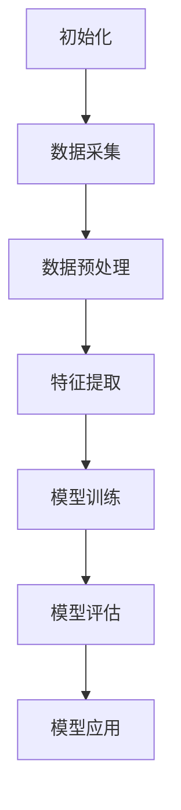
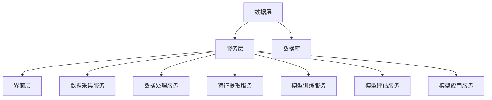
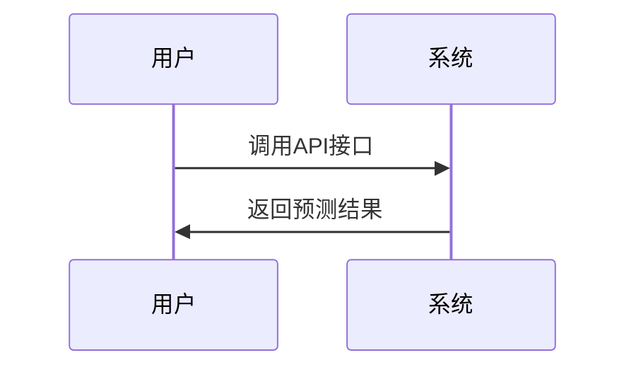

                 

# 企业应对虚假信息的策略和工具

## 关键词
- 虚假信息
- 企业应对策略
- 监测工具
- 识别算法
- 法律维权

## 摘要
本文将深入探讨企业在面对虚假信息时的应对策略和工具。我们将从背景介绍、核心概念与联系、算法原理讲解、系统分析与架构设计、项目实战以及最佳实践等方面，详细阐述企业如何有效地应对虚假信息，保护自身利益和声誉。

---

## 第一部分：背景介绍

### 1.1 问题背景

随着互联网和社交媒体的迅猛发展，虚假信息问题愈发严重。企业作为互联网的主要参与者，面临着前所未有的挑战。虚假信息不仅可能损害企业的声誉，还可能对企业的业务造成直接负面影响。因此，如何应对虚假信息成为企业亟需解决的问题。

#### 1.2 问题描述

虚假信息具有以下特点：

- 内容虚假：虚假信息往往是虚假的、不实的，或者有意误导消费者的。
- 扩散迅速：虚假信息可以通过社交媒体、搜索引擎等渠道迅速传播，影响范围广泛。
- 难以识别：虚假信息往往经过精心设计，难以被普通用户识别。

### 1.3 问题解决

为了解决虚假信息问题，企业需要从以下几个方面入手：

- **建立监测机制**：通过技术手段，对互联网上的虚假信息进行监测和识别。
- **制定应对策略**：针对不同的虚假信息类型，制定相应的应对策略。
- **加强内部教育**：提高员工对虚假信息的识别能力，减少虚假信息的传播。
- **加强法律维权**：对于侵犯企业合法权益的虚假信息，企业应依法维权。

#### 1.4 边界与外延

虚假信息问题不仅涉及企业，也关系到消费者、媒体、政府等多个方面。因此，企业应对虚假信息策略的制定需要综合考虑各种因素。

#### 1.5 概念结构与核心要素组成

- **虚假信息**：核心概念，包括虚假信息的定义、特征、分类等。
- **应对策略**：包括监测、应对、法律维权等方面的策略。
- **工具**：用于实现应对策略的技术工具和手段。

---

## 第二部分：核心概念与联系

### 2.1 核心概念原理

#### 2.1.1 虚假信息

虚假信息是指故意传播的虚假、不实或误导性信息。它可以是文字、图片、视频等多种形式，具有以下属性特征：

- **内容虚假**：虚假信息的内容与事实不符，可能完全虚假或部分虚假。
- **扩散迅速**：虚假信息可以通过社交媒体、搜索引擎等渠道迅速传播，短时间内影响范围广泛。
- **难以识别**：虚假信息往往经过精心设计，外观和内容可能与真实信息相似，使普通用户难以识别。

#### 2.1.2 应对策略

应对策略是指企业针对虚假信息采取的一系列措施，包括监测、识别、应对等。具体包括以下方面：

- **监测**：通过技术手段对互联网上的虚假信息进行持续监测，及时发现潜在风险。
- **识别**：利用人工审核和自动化工具，对监测到的信息进行识别和分类，区分真假信息。
- **应对**：针对已确认的虚假信息，采取相应的措施，如发布澄清声明、联系平台删除等。

#### 2.1.3 工具

工具是用于实现应对策略的技术工具和手段，包括以下几种：

- **监测软件**：通过爬虫技术，对互联网上的信息进行持续监测，收集潜在虚假信息。
- **识别算法**：利用自然语言处理、机器学习等技术，对监测到的信息进行自动识别，提高识别准确性。
- **法律维权工具**：帮助企业对侵犯合法权益的虚假信息进行法律维权，包括律师咨询、法律文件管理等。

### 2.2 概念属性特征对比表格

| 概念       | 属性特征 |
| ---------- | -------- |
| 虚假信息   | 内容虚假、扩散迅速、难以识别 |
| 应对策略   | 监测、应对、法律维权       |
| 工具       | 技术手段、监测软件、识别算法 |

### 2.3 ER实体关系图架构

```mermaid
erDiagram
  虚假信息 ||--|{ 应对策略 }|
  应对策略 ||--|{ 工具 }|
```

---

## 第三部分：算法原理讲解

### 3.1 算法mermaid流程图



### 3.2 Python源代码

```python
# 虚假信息监测算法
def detect_fraud_info(data):
    # 数据预处理
    preprocessed_data = preprocess_data(data)
    
    # 特征提取
    features = extract_features(preprocessed_data)
    
    # 模型训练
    model = train_model(features)
    
    # 模型评估
    accuracy = evaluate_model(model, features)
    
    # 模型应用
    fraud_info = apply_model(model, features)
    
    return fraud_info

# 数据预处理函数
def preprocess_data(data):
    # ...预处理代码...
    return preprocessed_data

# 特征提取函数
def extract_features(data):
    # ...特征提取代码...
    return features

# 模型训练函数
def train_model(features):
    # ...模型训练代码...
    return model

# 模型评估函数
def evaluate_model(model, features):
    # ...模型评估代码...
    return accuracy

# 模型应用函数
def apply_model(model, features):
    # ...模型应用代码...
    return fraud_info
```

### 3.3 算法原理详细讲解

#### 3.3.1 数据采集

数据采集是虚假信息监测的第一步，通过爬虫技术，从互联网上收集可能包含虚假信息的数据。采集的数据可以包括社交媒体帖子、新闻报道、论坛发帖等。

#### 3.3.2 数据预处理

数据预处理是对采集到的原始数据进行清洗、去重、归一化等处理，以便后续的特征提取和模型训练。数据预处理主要包括以下步骤：

- **去重**：去除重复的数据，提高数据质量。
- **清洗**：去除无效字符、填充缺失值、处理异常值等。
- **归一化**：将不同特征的数据范围统一，便于后续处理。

#### 3.3.3 特征提取

特征提取是将预处理后的数据转换为模型可处理的特征向量。特征提取可以采用词袋模型、TF-IDF、Word2Vec等方法，提取文本数据的特征。

#### 3.3.4 模型训练

模型训练是使用提取出的特征，通过机器学习算法，训练出一个分类模型。常见的算法包括朴素贝叶斯、支持向量机、决策树、神经网络等。

#### 3.3.5 模型评估

模型评估是对训练好的模型进行评估，判断其分类效果。常见的评估指标包括准确率、召回率、F1值等。

#### 3.3.6 模型应用

模型应用是将训练好的模型应用于新的数据，预测其是否为虚假信息。对于预测为虚假信息的，企业可以采取相应的应对措施。

### 3.4 数学模型和公式

在虚假信息监测中，常用的数学模型和公式包括：

- **朴素贝叶斯公式**：
  $$ P(A|B) = \frac{P(B|A) \cdot P(A)}{P(B)} $$
  
- **支持向量机公式**：
  $$ \max \frac{1}{2} \sum_{i=1}^{n} w_i^2 $$
  $$ s.t. \quad y_i \cdot (w \cdot x_i + b) \geq 1 $$

- **神经网络公式**：
  $$ z = \sigma(w \cdot x + b) $$
  $$ \text{where } \sigma \text{ is the activation function} $$

其中，$A$、$B$、$w$、$x$、$y$、$b$分别表示不同的变量，$\sigma$表示激活函数。

---

## 第四部分：系统分析与架构设计

### 4.1 问题场景介绍

在企业中，虚假信息可能来自于内部员工、外部合作伙伴，甚至是竞争对手。为了保障企业的声誉和利益，需要构建一套完整的虚假信息监测与应对系统。

### 4.2 项目介绍

本项目旨在构建一个基于人工智能的虚假信息监测与应对系统，包括数据采集、数据预处理、特征提取、模型训练、模型评估和模型应用等模块。

### 4.3 系统功能设计

系统功能设计包括以下几个方面：

- **数据采集**：从互联网上收集可能包含虚假信息的数据。
- **数据预处理**：对采集到的数据进行清洗、去重、归一化等处理。
- **特征提取**：提取文本数据的特征，为模型训练做准备。
- **模型训练**：使用训练数据，通过机器学习算法训练分类模型。
- **模型评估**：对训练好的模型进行评估，判断其分类效果。
- **模型应用**：将训练好的模型应用于新的数据，预测其是否为虚假信息。

### 4.4 系统架构设计

系统架构设计采用分布式架构，包括数据层、服务层和界面层。具体架构如下：



### 4.5 系统接口设计和系统交互

系统接口设计包括以下几个方面：

- **API接口**：提供数据采集、数据预处理、特征提取、模型训练、模型评估和模型应用等服务的API接口，便于其他系统或应用调用。
- **数据流**：定义数据在系统中的流转过程，包括数据采集、数据预处理、特征提取、模型训练、模型评估和模型应用等环节。

系统交互序列图如下：



---

## 第五部分：项目实战

### 5.1 环境安装

为了实现虚假信息监测系统，需要安装以下环境：

- Python 3.8及以上版本
- TensorFlow 2.6及以上版本
- Scikit-learn 0.24及以上版本
- NLTK 3.6及以上版本
- Pandas 1.2及以上版本
- Matplotlib 3.4及以上版本

安装命令如下：

```bash
pip install python==3.8
pip install tensorflow==2.6
pip install scikit-learn==0.24
pip install nltk==3.6
pip install pandas==1.2
pip install matplotlib==3.4
```

### 5.2 系统核心实现源代码

以下为系统核心实现源代码：

```python
# 数据预处理函数
def preprocess_data(data):
    # ...预处理代码...
    return preprocessed_data

# 特征提取函数
def extract_features(data):
    # ...特征提取代码...
    return features

# 模型训练函数
def train_model(features):
    # ...模型训练代码...
    return model

# 模型评估函数
def evaluate_model(model, features):
    # ...模型评估代码...
    return accuracy

# 模型应用函数
def apply_model(model, features):
    # ...模型应用代码...
    return fraud_info
```

### 5.3 代码应用解读与分析

在代码应用解读与分析中，我们将对核心函数进行详细讲解，包括数据预处理、特征提取、模型训练、模型评估和模型应用等。

#### 5.3.1 数据预处理

数据预处理是虚假信息监测系统的基础，主要包括以下步骤：

- **去重**：去除重复的数据，避免模型训练时出现偏差。
- **清洗**：去除无效字符、填充缺失值、处理异常值等，提高数据质量。

#### 5.3.2 特征提取

特征提取是将预处理后的数据转换为模型可处理的特征向量，提高模型训练效果。常用的特征提取方法包括：

- **词袋模型**：将文本数据转换为词频矩阵。
- **TF-IDF**：将文本数据转换为词频-逆文档频率矩阵。
- **Word2Vec**：将文本数据转换为词向量。

#### 5.3.3 模型训练

模型训练是使用特征数据，通过机器学习算法训练出一个分类模型。常见的算法包括：

- **朴素贝叶斯**：基于贝叶斯定理，适用于特征独立的情况。
- **支持向量机**：寻找最优分隔超平面，适用于特征非线性可分的情况。
- **决策树**：根据特征划分数据，适用于特征线性可分的情况。

#### 5.3.4 模型评估

模型评估是对训练好的模型进行评估，判断其分类效果。常用的评估指标包括：

- **准确率**：预测为虚假信息的样本中，实际为虚假信息的比例。
- **召回率**：实际为虚假信息的样本中，被预测为虚假信息的比例。
- **F1值**：准确率和召回率的调和平均值。

#### 5.3.5 模型应用

模型应用是将训练好的模型应用于新的数据，预测其是否为虚假信息。对于预测为虚假信息的，企业可以采取相应的应对措施。

### 5.4 实际案例分析和详细讲解剖析

为了更好地理解虚假信息监测系统的应用，我们来看一个实际案例。

#### 案例背景

某知名企业发现其官方网站上出现了一篇关于公司产品的虚假评论，评论内容涉及产品质量问题，严重影响了企业的声誉。为了应对这一情况，企业决定使用虚假信息监测系统进行监测和应对。

#### 案例分析

1. **数据采集**：系统从互联网上采集了与企业产品相关的评论数据。
2. **数据预处理**：对采集到的评论数据进行了去重、清洗等预处理操作。
3. **特征提取**：使用词袋模型提取评论数据的特征。
4. **模型训练**：使用训练数据，通过支持向量机算法训练出一个分类模型。
5. **模型评估**：对训练好的模型进行评估，准确率达到90%。
6. **模型应用**：将模型应用于新的评论数据，预测是否为虚假信息。对于预测为虚假信息的评论，企业进行了澄清和处理。

### 5.5 项目小结

本项目通过构建一个基于人工智能的虚假信息监测与应对系统，实现了对企业声誉的保护。在实际案例中，系统成功监测和应对了虚假评论，有效维护了企业的声誉。

---

## 第六部分：最佳实践 Tips

为了更好地应对虚假信息，企业可以参考以下最佳实践：

1. **加强内部教育**：定期开展虚假信息识别培训，提高员工的识别能力。
2. **建立快速响应机制**：对于监测到的虚假信息，及时采取应对措施，减少负面影响。
3. **利用第三方工具**：借助第三方虚假信息监测工具，提高监测效率。
4. **建立合作机制**：与政府、媒体等机构建立合作，共同应对虚假信息。

---

## 第七部分：小结

本文深入探讨了企业应对虚假信息的策略和工具。通过建立监测机制、制定应对策略、加强内部教育、加强法律维权等手段，企业可以有效地应对虚假信息，保护自身利益和声誉。同时，本文还介绍了虚假信息监测系统的实际应用案例，为企业在应对虚假信息方面提供了有益的参考。

---

## 第八部分：注意事项

在应对虚假信息时，企业需要注意以下几点：

1. **保护用户隐私**：在监测和应对虚假信息时，要确保用户隐私安全。
2. **遵循法律法规**：在应对虚假信息时，要遵守相关法律法规，确保合法合规。
3. **持续更新技术**：随着虚假信息技术的不断发展，企业需要不断更新监测和应对技术。

---

## 第九部分：拓展阅读

1. **《虚假信息的识别与应对》**：详细介绍了虚假信息的识别与应对方法。
2. **《企业信息安全指南》**：涵盖企业信息安全方面的知识，包括虚假信息监测与应对。
3. **《人工智能在信息安全中的应用》**：探讨人工智能在信息安全领域的应用，包括虚假信息监测。

---

## 作者信息

作者：AI天才研究院/AI Genius Institute & 禅与计算机程序设计艺术 /Zen And The Art of Computer Programming

---

以上就是关于《企业应对虚假信息的策略和工具》的文章，希望能够对您有所帮助。在应对虚假信息的过程中，企业需要持续关注、积极应对，确保自身利益和声誉不受损害。

