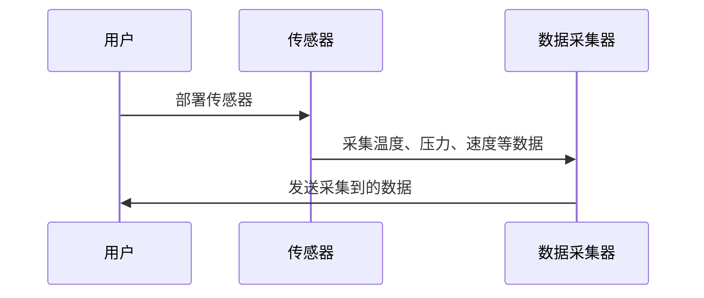
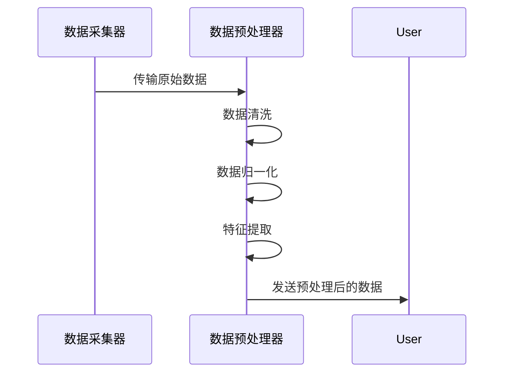
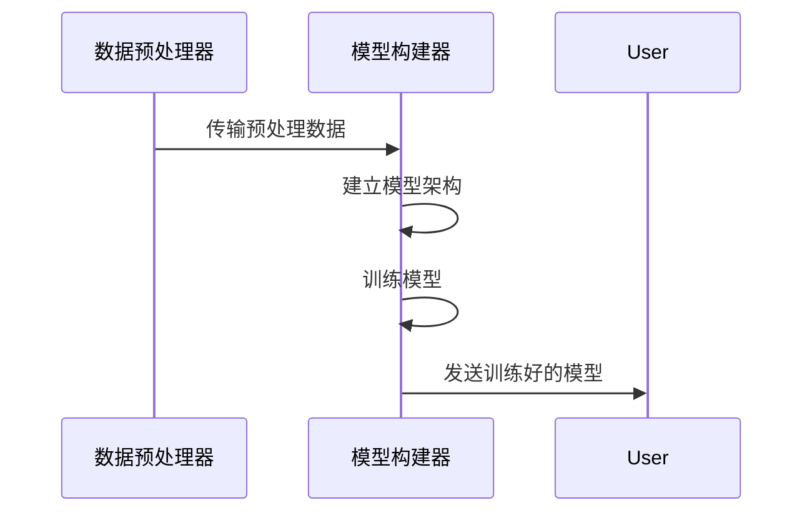
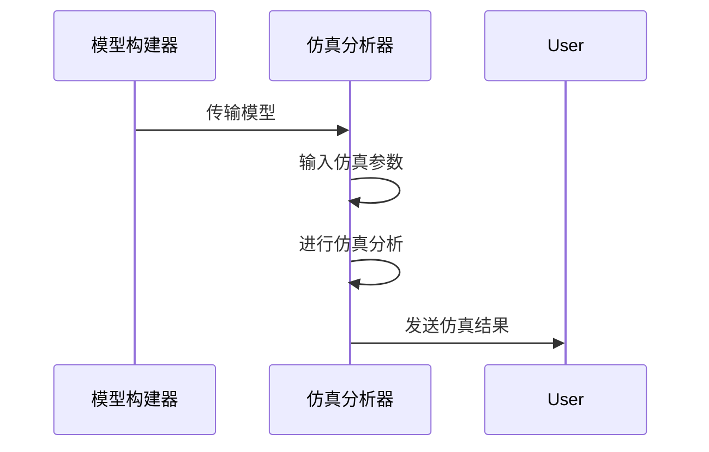
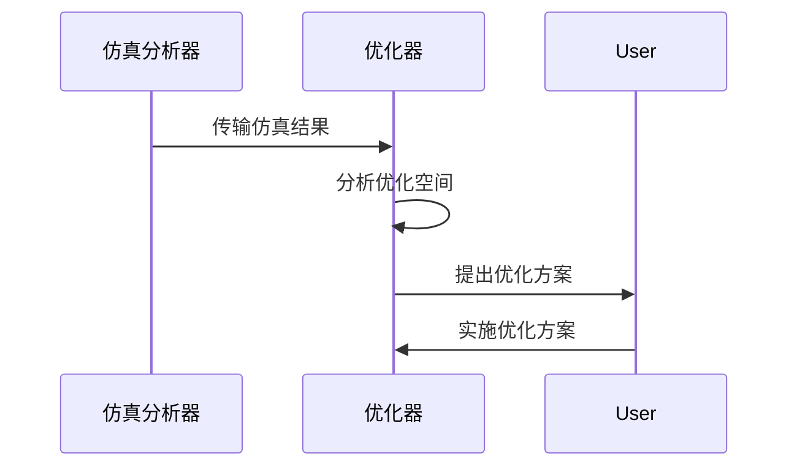
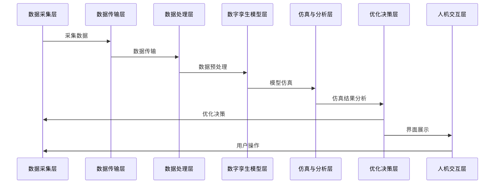

                 

### 第一部分：背景介绍

#### 第1章：数字孪生与业务流程优化的概述

##### 1.1.1 问题背景

数字孪生（Digital Twin）是近年来在工业、医疗、建筑和制造业等领域迅速崛起的一种技术。它通过创建一个物理实体的虚拟副本，实现对实际物体或系统的实时监控、模拟和优化。随着企业数字化转型步伐的加快，数字孪生技术在提高生产效率、降低成本、提升产品质量和增强安全性方面展示了巨大的潜力。

在业务流程优化方面，传统的优化方法往往依赖于经验和静态数据分析，难以适应快速变化的市场需求和复杂多变的业务场景。而数字孪生技术的引入，通过动态模拟和实时数据反馈，为企业提供了一种全新的优化手段，可以更精准地识别流程中的瓶颈和优化空间。

##### 1.1.2 问题描述

现有业务流程模拟与优化面临的主要瓶颈包括：

- **数据孤岛问题**：企业内部不同系统之间的数据无法有效集成和共享，导致业务流程的断裂和重复工作。
- **优化效率低**：传统的优化方法依赖于人工分析和试错，效率低下，难以应对复杂多变的业务环境。
- **实时性不足**：现有优化方法难以实现对业务流程的实时监控和调整，导致优化效果滞后。

数字孪生技术在解决这些瓶颈中具有显著的潜力。通过创建一个虚拟的数字副本，数字孪生可以实时捕捉和分析实际业务流程中的数据，模拟各种优化方案，提供精准的优化建议，从而提高业务流程的效率和质量。

##### 1.1.3 问题解决

数字孪生技术的核心原理在于：

- **数据采集与集成**：通过传感器、物联网（IoT）设备和数据集成平台，实时采集业务流程中的各种数据。
- **数据建模与仿真**：基于采集到的数据，建立数字孪生模型，进行仿真分析和预测。
- **实时反馈与优化**：通过实时数据反馈，动态调整和优化业务流程，提高其效率和性能。

构建数字孪生系统的基本步骤包括：

1. **需求分析**：明确数字孪生系统的目标和需求，包括业务流程的模拟、监控和优化。
2. **数据采集**：部署传感器和IoT设备，收集业务流程中的数据。
3. **数据预处理**：对采集到的数据进行分析、清洗和预处理，以便后续建模和仿真。
4. **模型构建**：基于预处理后的数据，建立数字孪生模型，进行仿真和预测。
5. **系统集成**：将数字孪生系统与企业的其他信息系统进行集成，实现数据的共享和交互。
6. **优化与反馈**：通过实时数据反馈，动态调整和优化业务流程，持续提升其性能。

##### 1.1.4 边界与外延

数字孪生技术的适用范围广泛，包括但不限于以下几个方面：

- **生产制造**：通过数字孪生技术，实现对生产线的实时监控和优化，提高生产效率和质量。
- **供应链管理**：利用数字孪生技术，实现供应链各环节的实时监控和优化，降低库存成本和提高供应链响应速度。
- **建筑设计**：通过数字孪生技术，模拟建筑设计过程，优化建筑结构设计，提高建筑质量和安全性。

数字孪生与业务流程优化的区别与联系在于：

- **区别**：数字孪生是一种技术手段，用于创建物理实体的虚拟副本，实现对实际系统的监控和优化。而业务流程优化是一种管理策略，旨在提高业务流程的效率和质量。
- **联系**：数字孪生技术为业务流程优化提供了强有力的技术支持，通过实时数据反馈和仿真分析，帮助识别流程中的瓶颈和优化空间，实现更精准、高效的业务流程优化。

##### 1.1.5 概念结构与核心要素组成

数字孪生生态系统由以下几个关键要素组成：

- **物理实体**：作为数字孪生的基础，代表实际存在的物体或系统。
- **数据采集与集成**：通过传感器、IoT设备和数据集成平台，实时采集和整合业务流程中的各种数据。
- **数字孪生模型**：基于采集到的数据，建立的虚拟副本，用于模拟、分析和优化实际业务流程。
- **仿真与分析**：利用数字孪生模型，进行业务流程的仿真分析和预测，为优化提供依据。
- **优化与反馈**：通过实时数据反馈，动态调整和优化业务流程，实现持续的性能提升。

业务流程优化的关键要素包括：

- **流程分析**：通过对现有业务流程的分析，识别其中的瓶颈和优化空间。
- **数据驱动**：基于实时数据分析和反馈，为优化提供科学依据。
- **持续改进**：通过持续的数据分析和流程调整，实现业务流程的持续优化和提升。

#### 1.1.6 总结

数字孪生与业务流程优化相结合，为企业提供了一种全新的优化手段。通过创建物理实体的虚拟副本，实时监控和优化业务流程，数字孪生技术有助于提高生产效率、降低成本、提升产品质量和增强安全性。在接下来的章节中，我们将深入探讨数字孪生的基础概念、构建方法以及在实际业务流程优化中的应用，为企业数字化转型提供有力支持。### 第2章：数字孪生的基础概念与特性

##### 2.1.1 数字孪生的定义

数字孪生（Digital Twin）是一种新兴技术，旨在创建物理实体的虚拟副本，通过对实际物体或系统的实时监控、模拟和优化，实现对其更深入的理解和管理。这个虚拟副本不仅是一个静态的模型，还具备动态更新的能力，能够实时反映物理实体的状态和变化。

数字孪生可以看作是物联网（IoT）和大数据技术的升华，通过整合传感器数据、模拟仿真和人工智能（AI）技术，实现对物理实体的全方位监控和智能优化。它广泛应用于工业制造、建筑设计、医疗健康、交通运输和能源管理等多个领域，为提升企业生产效率、降低运营成本和优化业务流程提供了强有力的支持。

##### 2.1.2 数字孪生的形式与类型

数字孪生的形式多种多样，可以根据应用场景和目标需求进行分类：

- **按应用领域分类**：
  - 工业制造：通过数字孪生技术，实现生产设备的实时监控、故障预测和性能优化。
  - 建筑设计：利用数字孪生技术，模拟建筑结构设计和施工过程，优化建筑性能和安全性。
  - 医疗健康：通过数字孪生，实现对病人的实时监控和个性化治疗，提高医疗服务质量和效率。
  - 交通运输：利用数字孪生技术，优化交通流量管理，提高交通运输系统的运行效率和安全性。

- **按实现技术分类**：
  - 实时监控型：通过传感器和IoT设备，实时采集物理实体的状态数据，实现对其的实时监控。
  - 模拟仿真型：基于物理实体数据，建立仿真模型，进行模拟分析和预测，优化业务流程。
  - 智能决策型：结合大数据和人工智能技术，通过实时数据分析和决策算法，实现智能优化和自主调整。

##### 2.1.3 数字孪生的核心特性

数字孪生具有以下几个核心特性，使其在业务流程优化中具有独特优势：

- **实时性**：数字孪生系统能够实时捕捉物理实体的状态变化，提供实时监控和反馈，支持快速响应和调整。
- **可扩展性**：数字孪生技术可以灵活扩展，适应不同规模和复杂度的业务流程，支持系统的持续优化和升级。
- **互操作性**：数字孪生系统可以与企业内部的其他信息系统进行集成，实现数据共享和协同工作，提高整体系统的效率。
- **智能化**：通过大数据和人工智能技术，数字孪生系统能够进行智能分析和决策，优化业务流程，降低运营成本，提高生产效率。

##### 2.1.4 数字孪生在业务流程优化中的应用

数字孪生技术在业务流程优化中的应用主要体现在以下几个方面：

- **实时监控**：通过数字孪生系统，实时监控业务流程的各个环节，识别潜在的瓶颈和异常情况，及时进行调整和优化。
- **仿真分析**：利用数字孪生模型，对业务流程进行仿真分析，预测不同优化方案的效果，为决策提供科学依据。
- **智能优化**：结合大数据和人工智能技术，通过数字孪生系统实现业务流程的自动优化，降低运营成本，提高生产效率。
- **预测性维护**：通过对设备运行状态的实时监控和数据分析，预测设备故障和性能问题，提前进行维护和优化，减少停机时间和维修成本。

##### 2.1.5 业务流程优化对数字孪生的需求

业务流程优化对数字孪生技术提出了以下几个方面的需求：

- **数据采集与集成**：需要高效的数据采集和集成技术，确保数字孪生系统能够实时获取业务流程中的关键数据。
- **建模与仿真能力**：需要强大的建模和仿真能力，能够准确反映业务流程的特点和规律，为优化提供可靠的数据支持。
- **智能分析与决策**：需要借助大数据和人工智能技术，实现智能分析和决策，提高业务流程优化的效果和效率。
- **可扩展性与灵活性**：数字孪生系统需要具备良好的可扩展性和灵活性，能够适应不同业务场景和需求的变化，实现持续优化。

通过满足这些需求，数字孪生技术将成为企业业务流程优化的重要工具，助力企业实现数字化转型和智能化升级。

#### 2.1.6 概念属性特征对比表格

为了更直观地理解数字孪生与其他相关技术的区别，下面提供了一个概念属性特征对比表格：

| 特性             | 数字孪生       | 物联网          | 大数据          | 人工智能        |
|------------------|----------------|----------------|-----------------|-----------------|
| 定义             | 物理实体的虚拟副本 | 物理设备与网络连接 | 大规模数据集合   | 模仿人类智能行为 |
| 核心功能         | 实时监控、仿真优化 | 数据采集、设备控制 | 数据存储、分析   | 学习、决策       |
| 技术依赖         | 传感器、IoT、AI   | 传感器、网络     | 数据库、计算资源 | 算法、计算资源   |
| 应用场景         | 生产制造、建筑设计 | 家居自动化、智能城市 | 营销分析、风险控制 | 语音识别、自动驾驶 |
| 主要优势         | 实时性、智能化   | 广泛连接、低成本 | 数据洞察、决策支持 | 自主学习、高精度 |
| 需求与挑战       | 数据集成与建模   | 安全与隐私保护   | 数据质量与分析   | 算法优化与落地   |

通过这个表格，我们可以更清晰地看到数字孪生在实时监控、仿真优化方面的优势，以及其在数据集成和建模方面的挑战。

#### 2.1.7 ER实体关系图架构

为了进一步理解数字孪生系统的架构和组成部分，下面提供了一个ER实体关系图，展示数字孪生系统中的关键实体及其关系：

```mermaid
erDiagram
    PhysicalEntity ||--|{ DataCollection }||>
    DataCollection ||--|{ DataIntegration }||>
    DataIntegration ||--|{ DigitalTwinModel }||>
    DigitalTwinModel ||--|{ SimulationAnalysis }||>
    SimulationAnalysis ||--|{ OptimizationDecision }||>
    PhysicalEntity ..|.. DecisionSupport
```

在这个ER图中：

- **PhysicalEntity（物理实体）**：代表实际存在的物体或系统，是数字孪生的基础。
- **DataCollection（数据采集）**：负责从物理实体中采集各种数据。
- **DataIntegration（数据集成）**：将分散的数据进行整合和预处理。
- **DigitalTwinModel（数字孪生模型）**：基于整合后的数据建立的虚拟副本。
- **SimulationAnalysis（仿真分析）**：利用数字孪生模型进行仿真分析和预测。
- **OptimizationDecision（优化决策）**：基于仿真分析结果进行优化决策。
- **DecisionSupport（决策支持）**：提供决策支持，辅助业务流程的优化。

通过这个ER图，我们可以更清晰地了解数字孪生系统的架构和各组成部分之间的关系，为后续的深入分析打下基础。

### 2.1.8 算法原理讲解

数字孪生系统的核心在于对物理实体的状态进行实时监控和仿真分析，进而实现业务流程的优化。下面我们将详细讲解数字孪生系统中的关键算法原理，并使用mermaid画出相关流程图。

#### 数据采集算法

数据采集是数字孪生系统的第一步，其核心在于从物理实体中实时获取各种数据。以下是一个典型的数据采集算法原理：

```python
def data_collection():
    # 部署传感器和IoT设备，获取物理实体的状态数据
    sensor_data = get_sensor_data()
    return sensor_data

def get_sensor_data():
    # 具体实现传感器数据的采集，例如温度、压力、速度等
    temperature = sensor1.read()
    pressure = sensor2.read()
    velocity = sensor3.read()
    return {
        'temperature': temperature,
        'pressure': pressure,
        'velocity': velocity
    }
```

#### 数据预处理算法

数据预处理是确保数据质量和一致性的重要步骤，其核心在于对采集到的数据进行清洗、归一化和特征提取。以下是一个简化的数据预处理算法原理：

```python
def data_preprocessing(data):
    # 数据清洗：去除无效数据、异常值处理
    cleaned_data = clean_data(data)
    # 数据归一化：将不同特征的数据进行归一化处理
    normalized_data = normalize_data(cleaned_data)
    # 特征提取：提取关键特征，用于后续建模和仿真
    features = extract_features(normalized_data)
    return features

def clean_data(data):
    # 具体实现数据清洗逻辑
    filtered_data = filter_invalid_values(data)
    return filtered_data

def normalize_data(data):
    # 具体实现数据归一化逻辑
    normalized_data = (data - min(data)) / (max(data) - min(data))
    return normalized_data

def extract_features(data):
    # 具体实现特征提取逻辑
    temperature_feature = data['temperature']
    pressure_feature = data['pressure']
    velocity_feature = data['velocity']
    return {
        'temperature': temperature_feature,
        'pressure': pressure_feature,
        'velocity': velocity_feature
    }
```

#### 数字孪生模型构建算法

数字孪生模型构建是基于预处理后的数据进行建模和仿真分析的关键步骤。以下是一个简单的数字孪生模型构建算法原理：

```python
def build_digital_twin_model(features):
    # 建立数字孪生模型
    model = create_model()
    # 训练模型
    trained_model = train_model(model, features)
    return trained_model

def create_model():
    # 创建模型架构，例如使用神经网络模型
    model = NeuralNetwork()
    return model

def train_model(model, features):
    # 使用训练数据训练模型
    training_data = get_training_data(features)
    model.train(training_data)
    return model
```

#### 仿真分析算法

仿真分析是基于数字孪生模型进行预测和优化的重要环节。以下是一个简化的仿真分析算法原理：

```python
def simulation_analysis(trained_model, target_data):
    # 使用训练好的模型进行仿真分析
    prediction = trained_model.predict(target_data)
    return prediction

def get_target_data():
    # 获取待仿真分析的数据
    temperature = sensor1.read()
    pressure = sensor2.read()
    velocity = sensor3.read()
    return {
        'temperature': temperature,
        'pressure': pressure,
        'velocity': velocity
    }
```

通过上述算法原理讲解，我们可以看到数字孪生系统中的数据采集、预处理、模型构建和仿真分析等核心步骤。这些步骤共同构成了数字孪生系统的技术框架，为企业业务流程的实时监控和优化提供了坚实基础。

### 2.1.9 数学公式与原理

在数字孪生系统中，数学模型和公式是理解和分析系统行为的关键。以下我们将介绍几个核心的数学公式及其应用场景。

#### 1. 数据归一化公式

数据归一化是确保不同特征数据在同一尺度上的重要步骤。常用的归一化方法有最小-最大缩放和Z分数缩放。

$$
x_{\text{normalized}} = \frac{x - x_{\text{min}}}{x_{\text{max}} - x_{\text{min}}}
$$

$$
x_{\text{normalized}} = \frac{x - \mu}{\sigma}
$$

其中，$x$ 为原始数据值，$x_{\text{min}}$ 和 $x_{\text{max}}$ 分别为数据集的最小值和最大值，$\mu$ 为平均值，$\sigma$ 为标准差。

#### 2. 神经网络训练公式

神经网络训练是数字孪生模型构建的核心步骤，常用的损失函数有均方误差（MSE）和交叉熵损失（Cross-Entropy Loss）。

$$
\text{MSE} = \frac{1}{m} \sum_{i=1}^{m} (y_i - \hat{y}_i)^2
$$

$$
\text{Cross-Entropy Loss} = -\frac{1}{m} \sum_{i=1}^{m} y_i \log(\hat{y}_i)
$$

其中，$m$ 为样本数量，$y_i$ 为实际输出值，$\hat{y}_i$ 为预测输出值。

#### 3. 预测公式

基于训练好的模型，我们可以使用以下公式进行预测：

$$
\hat{y} = \sigma(z)
$$

其中，$z$ 为模型的输入特征向量，$\sigma$ 为激活函数，常用的有Sigmoid、ReLU和Tanh等。

#### 4. 数据流公式

在数字孪生系统中，数据流是理解和优化系统性能的重要指标。以下是一个简化的数据流公式：

$$
\text{DataFlow} = \text{DataCollection} + \text{DataIntegration} + \text{DataProcessing}
$$

$$
\text{Performance} = \frac{\text{DataFlow}}{\text{ProcessingTime}}
$$

其中，$\text{DataCollection}$ 为数据采集过程，$\text{DataIntegration}$ 为数据集成过程，$\text{DataProcessing}$ 为数据处理过程，$\text{ProcessingTime}$ 为处理时间。

通过这些数学公式和原理，我们可以更好地理解和分析数字孪生系统的工作机制，为业务流程的优化提供科学依据。

### 2.1.10 举例说明

为了更直观地理解数字孪生系统的工作原理，我们通过一个具体的例子来说明。

假设我们希望使用数字孪生技术优化一家制造工厂的生产流程。具体步骤如下：

#### 1. 数据采集

首先，在工厂的关键位置部署传感器和IoT设备，用于实时采集生产设备的状态数据，如温度、压力、速度和能耗等。



#### 2. 数据预处理

接下来，对采集到的数据进行清洗、归一化和特征提取，以便后续建模和仿真。



#### 3. 模型构建

基于预处理后的数据，构建数字孪生模型，并进行训练，以模拟工厂的生产流程。



#### 4. 仿真分析

利用训练好的模型，对生产流程进行仿真分析，预测不同操作条件下的生产效率。



#### 5. 优化决策

根据仿真分析结果，对生产流程进行优化，以提高生产效率和降低成本。



通过这个例子，我们可以看到数字孪生技术在生产流程优化中的应用流程，包括数据采集、预处理、模型构建、仿真分析和优化决策等步骤。这些步骤共同构成了一个闭环系统，持续优化生产流程，提高企业竞争力。

### 2.1.11 数学模型与公式解释

在本节中，我们将进一步深入探讨数字孪生系统中常用的数学模型和公式，并通过具体的解释和示例，帮助读者更好地理解这些概念。

#### 1. 线性回归模型

线性回归模型是一种常用的预测方法，用于分析自变量和因变量之间的线性关系。其数学公式如下：

$$
y = \beta_0 + \beta_1 \cdot x
$$

其中，$y$ 是因变量，$x$ 是自变量，$\beta_0$ 是截距，$\beta_1$ 是斜率。

**解释**：这个公式表示因变量 $y$ 与自变量 $x$ 之间存在线性关系，可以通过斜率 $\beta_1$ 和截距 $\beta_0$ 来描述。

**示例**：假设我们想要预测一家公司的销售量 $y$（因变量）与广告支出 $x$（自变量）之间的关系。通过收集历史数据，我们可以使用线性回归模型来建立预测模型。

- **数据集**：包含 $n$ 个样本的数据集，每个样本包含广告支出 $x_i$ 和对应的销售量 $y_i$。
- **目标**：找到最佳的 $\beta_0$ 和 $\beta_1$，使得预测误差最小。

**公式**：

$$
\min_{\beta_0, \beta_1} \sum_{i=1}^{n} (y_i - (\beta_0 + \beta_1 \cdot x_i))^2
$$

通过求解这个最小化问题，我们可以得到最佳拟合直线，从而进行销售量的预测。

#### 2. 逻辑回归模型

逻辑回归模型是一种广义线性模型，用于分类问题。其目标是将连续的输出转换为概率值。逻辑回归的数学公式如下：

$$
\ln\left(\frac{p}{1-p}\right) = \beta_0 + \beta_1 \cdot x
$$

其中，$p$ 是正类（例如成功或阳性）的概率，$\beta_0$ 是截距，$\beta_1$ 是斜率。

**解释**：这个公式表示输入特征 $x$ 与输出概率 $p$ 之间的对数线性关系。

**示例**：假设我们想要预测一家公司的客户是否会在下个月购买产品。我们可以使用逻辑回归模型来建立预测模型。

- **数据集**：包含 $n$ 个样本的数据集，每个样本包含客户的历史购买行为和其他相关特征，以及是否购买（成功或失败）的结果。
- **目标**：找到最佳的 $\beta_0$ 和 $\beta_1$，使得预测的概率值最接近实际的结果。

**公式**：

$$
p = \frac{1}{1 + \exp{(-(\beta_0 + \beta_1 \cdot x))}}
$$

通过这个公式，我们可以将逻辑回归模型输出转换为概率值，从而进行分类预测。

#### 3. 支持向量机（SVM）模型

支持向量机是一种强大的分类方法，其目标是在特征空间中找到一个最佳的超平面，将不同类别的数据点分开。SVM的数学公式如下：

$$
f(x) = \omega \cdot x + b
$$

其中，$f(x)$ 是决策函数，$\omega$ 是权重向量，$b$ 是偏置。

**解释**：这个公式表示在特征空间中，通过权重向量 $\omega$ 和偏置 $b$ 定义的超平面。

**示例**：假设我们有两个类别的数据点，红色和蓝色。我们可以使用SVM模型来找到最佳的超平面，将这两类数据点分开。

- **数据集**：包含 $n$ 个样本的数据集，每个样本有两个特征，以及对应的标签（红色或蓝色）。
- **目标**：找到最佳的 $\omega$ 和 $b$，使得分类边界最清晰。

**公式**：

$$
\min_{\omega, b} \frac{1}{2} ||\omega||^2
$$

$$
\text{subject to} \quad y_i (\omega \cdot x_i + b) \geq 1
$$

通过求解这个优化问题，我们可以得到最佳的超平面，从而进行分类预测。

#### 4. 人工神经网络（ANN）模型

人工神经网络是一种模仿人脑神经元连接和活动的计算模型。其数学公式如下：

$$
a_{\text{layer}} = \sigma(\beta_{\text{weights}} \cdot a_{\text{prev_layer}} + \beta_{\text{bias}})
$$

其中，$a_{\text{layer}}$ 是当前层的激活值，$\sigma$ 是激活函数，$\beta_{\text{weights}}$ 是权重，$\beta_{\text{bias}}$ 是偏置。

**解释**：这个公式表示当前层的激活值是通过前一层激活值与权重和偏置的乘积，然后通过激活函数处理得到的。

**示例**：假设我们有一个多层感知器（MLP）神经网络，用于分类任务。

- **数据集**：包含 $n$ 个样本的数据集，每个样本有多个特征，以及对应的标签。
- **目标**：训练神经网络，使其能够准确分类。

**公式**：

$$
\min_{\beta_{\text{weights}}, \beta_{\text{bias}}} \sum_{i=1}^{n} \sum_{j=1}^{m} (\hat{y}_i^j - y_i^j)^2
$$

通过反向传播算法，我们可以更新权重和偏置，最小化损失函数，从而训练出性能良好的神经网络。

通过以上对线性回归、逻辑回归、支持向量机和人工神经网络等数学模型和公式的详细解释和示例，我们可以更好地理解数字孪生系统中的关键算法原理。这些模型和公式在数字孪生系统的建模、仿真和预测中扮演着至关重要的角色，为业务流程的优化提供了强有力的技术支持。

### 第3章：数字孪生系统的构建方法

#### 3.1.1 数字孪生系统的架构设计

数字孪生系统的架构设计是构建高效、可扩展和可靠系统的关键。一个典型的数字孪生系统架构通常包括以下几个核心组件：

1. **数据采集层**：负责从物理实体中收集实时数据，如温度、压力、速度、能耗等。常用的数据采集设备包括传感器、IoT设备、工业控制系统等。

2. **数据传输层**：确保数据从采集层传输到数据处理层的安全、可靠和高效。常用的传输技术包括有线网络（如以太网）、无线网络（如Wi-Fi、Zigbee）和卫星通信等。

3. **数据处理层**：对采集到的原始数据进行清洗、去噪、归一化、特征提取等预处理操作，为后续建模和仿真提供高质量的数据。

4. **数字孪生模型层**：基于预处理后的数据，构建数字孪生模型，用于模拟、分析和预测物理实体的行为。常用的建模工具包括仿真软件、机器学习库和定制开发工具等。

5. **仿真与分析层**：利用数字孪生模型进行仿真分析，评估不同操作条件下的性能和效果，为业务流程优化提供科学依据。

6. **优化决策层**：基于仿真分析结果，提出优化策略和决策，调整物理实体的操作参数，实现业务流程的优化。

7. **人机交互层**：提供用户界面，使操作人员能够直观地监控物理实体状态、分析仿真结果和执行优化决策。

以下是一个简化的数字孪生系统架构图，展示各组件之间的关系：



#### 3.1.2 数据采集与处理

数据采集与处理是数字孪生系统的关键环节，直接影响模型的质量和仿真分析的效果。以下是一些关键步骤和注意事项：

1. **数据采集**：

   - **传感器选择**：根据物理实体的特性选择合适的传感器，如温度传感器、压力传感器、流量传感器等。
   - **数据频率**：根据业务需求设置合适的采集频率，确保数据的实时性和准确性。
   - **数据质量**：确保采集到的数据质量，避免噪声和异常值。

2. **数据传输**：

   - **传输方式**：根据现场环境和需求选择合适的传输方式，如有线传输、无线传输等。
   - **数据加密**：确保数据在传输过程中的安全性和隐私性，采用加密技术和认证机制。

3. **数据处理**：

   - **数据清洗**：去除无效数据、异常值和噪声，保证数据的一致性和完整性。
   - **数据归一化**：将不同特征的数据进行归一化处理，使其在同一尺度上进行比较和分析。
   - **特征提取**：提取关键特征，用于建模和仿真分析，如时间序列特征、统计特征等。

4. **数据存储**：

   - **数据库选择**：根据数据量和访问频率选择合适的数据库系统，如关系型数据库（如MySQL、PostgreSQL）或NoSQL数据库（如MongoDB、Cassandra）。
   - **数据备份与恢复**：定期备份数据，确保数据的安全性和可恢复性。

#### 3.1.3 模型构建与仿真

数字孪生模型是数字孪生系统的核心，其构建和仿真过程直接影响系统的性能和效果。以下是一些关键步骤和注意事项：

1. **模型构建**：

   - **模型选择**：根据业务需求和数据特点选择合适的模型类型，如物理模型、统计模型、机器学习模型等。
   - **模型参数**：确定模型的参数，如输入特征、隐藏层单元数、激活函数等。
   - **模型验证**：通过交叉验证等方法验证模型的性能和稳定性。

2. **仿真分析**：

   - **仿真环境**：构建与物理实体相似的仿真环境，模拟实际操作条件。
   - **仿真参数**：设置合适的仿真参数，如时间步长、仿真时长等。
   - **仿真结果**：分析仿真结果，评估模型在不同条件下的性能和效果。

3. **优化策略**：

   - **优化目标**：明确优化的目标和指标，如最小化成本、最大化收益、提高效率等。
   - **优化算法**：选择合适的优化算法，如遗传算法、粒子群算法、梯度下降算法等。
   - **优化过程**：根据仿真结果调整模型参数和操作策略，实现业务流程的优化。

#### 3.1.4 实时反馈与优化

实时反馈与优化是数字孪生系统的核心功能之一，通过实时数据反馈和动态调整，实现业务流程的持续优化。以下是一些关键步骤和注意事项：

1. **实时监控**：

   - **监控指标**：明确实时监控的指标，如设备状态、性能指标、能耗指标等。
   - **监控系统**：构建实时监控系统，实时捕捉物理实体的状态变化。
   - **报警机制**：设置报警机制，及时发现和处理异常情况。

2. **动态调整**：

   - **调整策略**：根据实时监控数据和仿真分析结果，制定动态调整策略。
   - **调整过程**：实时调整操作参数和业务流程，实现业务流程的优化。
   - **反馈机制**：建立反馈机制，持续收集和评估优化效果，为下一步调整提供依据。

3. **持续优化**：

   - **优化循环**：通过实时反馈和动态调整，构建优化循环，持续提升业务流程的效率和质量。
   - **数据积累**：积累实时数据和优化经验，为后续的优化提供数据支持。
   - **迭代改进**：基于数据分析和反馈，不断迭代和改进优化策略和模型。

通过以上步骤和注意事项，我们可以构建一个高效、可靠的数字孪生系统，实现业务流程的实时监控和持续优化，为企业数字化转型提供有力支持。### 第4章：业务流程模拟原理与技术

#### 4.1.1 业务流程模拟的基本原理

业务流程模拟（Business Process Simulation，BPS）是一种通过创建虚拟模型来模拟实际业务流程的方法，旨在预测和分析业务流程的性能、效率和可行性。基本原理包括以下几个方面：

1. **流程建模**：通过分析和抽象业务流程，创建一个结构化的流程模型。这个模型包括业务流程的各个环节、参与者、资源以及它们之间的相互关系。

2. **数据驱动**：利用实际业务数据驱动模拟过程，确保模拟过程能够反映现实业务环境中的真实情况。这些数据包括业务规则、操作时间、资源利用率、需求波动等。

3. **仿真运行**：在模拟环境中运行流程模型，模拟业务流程的实际运行过程。这个过程可以实时进行，也可以在一定时间段内完成，以便分析业务流程在不同条件下的表现。

4. **结果分析**：对模拟结果进行分析，评估业务流程的性能指标，如响应时间、吞吐量、资源利用率、成本等。通过分析结果，发现业务流程中的瓶颈和优化空间，提出改进建议。

#### 4.1.2 业务流程模拟的关键技术

业务流程模拟的关键技术包括以下几个方面：

1. **建模技术**：

   - **流程图建模**：使用图形化工具（如BPMN、EPC等）创建业务流程模型，直观地表示业务流程的各个环节和参与者。
   - **数据建模**：通过数据模型（如关系型数据库、NoSQL数据库等）存储和管理业务流程所需的数据，包括业务规则、操作时间、资源信息等。

2. **仿真技术**：

   - **离散事件仿真**：通过模拟业务流程中的事件（如任务开始、任务完成、资源分配等）来驱动模拟过程。这种技术适用于具有明确时间序列的业务流程。
   - **过程交互仿真**：模拟业务流程中的参与者、资源以及它们之间的交互关系，分析业务流程的整体性能。这种技术适用于涉及复杂交互关系的业务流程。

3. **优化技术**：

   - **统计分析**：利用统计分析方法（如回归分析、时间序列分析等）对模拟结果进行分析，识别业务流程中的瓶颈和优化空间。
   - **优化算法**：应用优化算法（如遗传算法、粒子群算法、线性规划等）对业务流程进行调整和优化，以提高其性能和效率。

4. **可视化技术**：

   - **模拟可视化**：通过图形化界面（如3D模拟、动画等）展示业务流程的模拟过程，帮助用户理解和分析业务流程的行为。
   - **结果可视化**：通过图表、报表等形式展示模拟结果，便于用户评估业务流程的性能和优化效果。

#### 4.1.3 业务流程模拟的应用场景

业务流程模拟广泛应用于各种业务场景，以下是一些典型的应用场景：

1. **生产制造**：

   - **生产线优化**：模拟生产线的运行过程，识别瓶颈和优化生产流程，提高生产效率。
   - **生产调度**：模拟生产任务调度，优化资源分配和任务优先级，减少生产延误。

2. **供应链管理**：

   - **供应链网络优化**：模拟供应链各环节的运行情况，优化供应链网络布局，提高供应链响应速度和可靠性。
   - **库存管理**：模拟库存管理流程，优化库存策略，降低库存成本，提高库存周转率。

3. **金融服务**：

   - **业务流程优化**：模拟金融服务中的业务流程，如开户、贷款审批等，优化流程设计，提高客户满意度。
   - **风险控制**：模拟业务流程中的潜在风险，识别风险点和风险来源，提出风险控制措施。

4. **物流与运输**：

   - **运输调度**：模拟运输任务调度，优化运输路线和资源分配，提高运输效率。
   - **仓储管理**：模拟仓储管理流程，优化仓储布局和库存管理，提高仓储效率。

通过业务流程模拟，企业可以在实际投入资源之前，对业务流程进行评估和优化，降低风险和成本，提高业务流程的效率和灵活性。

### 第5章：业务流程优化策略与实践

#### 5.1.1 业务流程优化的策略

业务流程优化是提升企业竞争力、降低运营成本、提高服务质量的重要手段。以下是一些常用的业务流程优化策略：

1. **目标明确**：首先，明确业务流程优化的目标和关键指标，如生产效率、库存周转率、客户满意度等。

2. **流程分析**：对现有业务流程进行详细分析，识别其中的瓶颈、冗余环节和优化空间。可以使用流程图、时间序列分析等方法进行流程分析。

3. **数据驱动**：利用实时数据和历史数据，驱动业务流程优化。通过数据分析和预测，制定科学的优化方案。

4. **精益生产**：采用精益生产（Lean Manufacturing）理念，消除浪费，优化资源配置。常见的精益生产工具包括5S、看板管理、持续改进等。

5. **流程重构**：在某些情况下，对现有业务流程进行彻底重构，以消除深层次问题，提高流程效率。流程重构需要综合考虑技术、管理、组织等多个方面。

6. **自动化与智能化**：引入自动化和智能化技术，如数字孪生、人工智能、物联网等，实现业务流程的自动化和智能化，提高流程的效率和准确性。

7. **持续改进**：建立持续改进机制，定期评估业务流程的优化效果，并根据反馈进行调整和改进。

#### 5.1.2 业务流程优化实践

以下是三个实际业务流程优化案例，展示不同类型企业在实施业务流程优化过程中的具体做法和效果。

##### 案例1：供应链优化

某大型制造企业在供应链管理中面临着库存成本高、交货不及时等问题。为了解决这些问题，企业采取以下措施：

1. **需求预测**：利用大数据和机器学习技术，对市场需求进行预测，优化采购计划和生产计划，减少库存积压。

2. **供应商管理**：与关键供应商建立长期合作关系，共享数据和资源，提高供应链的协同效率。

3. **物流优化**：采用智能调度系统，优化运输路线和资源分配，降低运输成本，提高配送效率。

4. **库存管理**：实施精准库存管理，通过实时监控库存水平，合理调整库存策略，减少库存成本。

通过以上措施，该企业实现了库存周转率提高20%、交货及时率提高15%的目标，显著降低了运营成本。

##### 案例2：生产流程优化

某电子产品制造企业生产流程复杂，生产周期长，质量不稳定。为了提升生产效率和质量，企业采取以下措施：

1. **精益生产**：实施5S管理，清理现场，提高生产环境的整洁度；实施看板管理，优化生产流程，减少浪费。

2. **自动化设备**：引入自动化设备，如机器人、自动化装配线等，减少人工操作，提高生产效率和稳定性。

3. **质量监控**：建立质量监控系统，实时监控生产过程中的质量指标，及时发现和解决质量问题。

4. **持续改进**：建立持续改进机制，定期组织员工进行培训，鼓励员工提出改进建议，并实施改进措施。

通过以上措施，该企业实现了生产周期缩短30%、产品质量合格率提高10%的目标，生产效率显著提升。

##### 案例3：服务流程优化

某金融服务企业在服务流程中面临着客户满意度低、服务效率差等问题。为了提升客户满意度和服务效率，企业采取以下措施：

1. **客户关系管理**：实施客户关系管理（CRM）系统，全面了解客户需求，提供个性化服务。

2. **服务流程优化**：对服务流程进行优化，简化操作步骤，减少客户等待时间。

3. **智能客服**：引入智能客服系统，通过自然语言处理和机器学习技术，自动处理客户咨询，提高服务效率。

4. **员工培训**：定期对员工进行培训，提高服务技能和客户沟通能力。

通过以上措施，该企业实现了客户满意度提高20%、服务效率提高30%的目标，客户体验显著改善。

通过这些实际案例，我们可以看到，业务流程优化需要根据企业的具体情况进行有针对性的策略和实践，通过数据驱动、精益生产、自动化与智能化等手段，不断提升业务流程的效率和质量。

### 第6章：数字孪生系统在企业中的应用实践

#### 6.1.1 企业数字孪生系统的构建实践

为了更好地理解数字孪生系统在企业中的实际应用，我们将以某制造企业为例，详细说明其数字孪生系统的构建过程。

##### 1. 需求分析

首先，企业对现有的生产流程进行了全面的需求分析，明确了数字孪生系统的目标和需求。主要需求包括：

- **实时监控**：实现对生产设备的实时监控，包括温度、压力、能耗等关键参数。
- **故障预测**：通过数据分析和预测，提前识别和预防设备故障，减少停机时间。
- **生产优化**：利用仿真分析和优化算法，优化生产流程，提高生产效率和降低成本。
- **质量监控**：实时监控产品质量，确保产品符合质量标准。

##### 2. 数据采集

接下来，企业部署了多种传感器和IoT设备，对生产设备进行实时数据采集。这些传感器包括温度传感器、压力传感器、振动传感器、能耗监测仪等。数据采集频率根据设备的重要性和业务需求进行设置，确保数据实时性和准确性。

##### 3. 数据预处理

采集到的原始数据通过数据预处理模块进行清洗、去噪、归一化和特征提取。这一步确保数据的质量和一致性，为后续建模和仿真提供可靠的数据支持。预处理后的数据存储在分布式数据库中，以便快速查询和分析。

##### 4. 数字孪生模型构建

基于预处理后的数据，企业构建了数字孪生模型。该模型包括物理实体（如生产设备）的虚拟副本，以及模拟生产流程的仿真模型。模型构建过程包括以下步骤：

- **模型设计**：根据生产设备的特性和业务需求，设计数字孪生模型的结构和功能。
- **数据建模**：使用机器学习和数据挖掘技术，建立物理实体和仿真模型的数学模型。
- **模型训练**：使用历史数据对模型进行训练，使其能够准确模拟生产流程。

##### 5. 仿真与优化

数字孪生模型构建完成后，企业利用仿真技术对生产流程进行模拟和分析。通过仿真，企业可以预测不同操作条件下的生产效率和产品质量，评估优化方案的可行性。仿真过程包括：

- **场景设定**：根据实际生产条件，设定仿真场景，如不同的生产速度、物料供应情况等。
- **结果分析**：分析仿真结果，识别生产流程中的瓶颈和优化空间。
- **优化方案**：根据仿真结果，制定和实施优化方案，如调整生产参数、改进设备维护策略等。

##### 6. 实时监控与反馈

在数字孪生系统的运行过程中，企业通过实时监控模块，对生产设备的状态进行实时监控。实时监控包括：

- **数据收集**：实时收集生产设备的关键数据，如温度、压力、能耗等。
- **状态监测**：实时监测设备状态，识别异常情况，触发报警机制。
- **反馈调整**：根据实时监控数据，动态调整生产参数和操作策略，确保生产流程的稳定和高效。

##### 7. 集成与扩展

数字孪生系统与企业现有的信息系统进行集成，实现数据的共享和协同工作。集成内容包括：

- **ERP系统**：与企业的ERP系统集成，实现生产计划和物料管理的数据同步。
- **MES系统**：与企业的制造执行系统（MES）集成，实现生产过程的数据采集和监控。
- **CRM系统**：与企业的客户关系管理系统（CRM）集成，实现客户需求和订单管理的数据同步。

数字孪生系统还具有良好的扩展性，可以根据企业的需求进行功能扩展和升级，如引入新的仿真工具、优化算法等。

通过以上构建实践，企业成功实现了对生产流程的实时监控、故障预测和生产优化，显著提高了生产效率和产品质量，降低了运营成本。

#### 6.1.2 数字孪生系统在业务流程优化中的应用

数字孪生系统在企业中的实际应用不仅限于生产流程的优化，还可以广泛应用于其他业务流程，如下文所述的供应链优化和生产流程优化。

##### 1. 供应链优化

供应链优化是数字孪生系统在企业管理中的一项重要应用。通过数字孪生技术，企业可以实时监控供应链各环节的状态，优化供应链网络布局，提高供应链的响应速度和可靠性。以下是一个具体的供应链优化案例：

- **需求预测**：利用数字孪生系统中的大数据分析和机器学习技术，对市场需求进行预测，优化采购计划和生产计划。例如，某电子产品制造企业通过数字孪生系统预测市场需求，调整生产计划和库存策略，避免了库存积压和供应不足的问题。
- **供应商管理**：数字孪生系统可以与企业外部供应商的数字孪生系统进行集成，实现供应链上下游的信息共享和协同工作。例如，某汽车制造企业通过数字孪生系统与供应商实时共享生产计划和库存数据，优化供应商配送时间和路线，提高了供应链的效率和响应速度。
- **物流优化**：数字孪生系统可以帮助企业优化物流流程，减少运输成本和提高运输效率。例如，某物流公司通过数字孪生系统模拟不同的运输路线和配送策略，选择最优的配送方案，减少了运输时间和成本。

##### 2. 生产流程优化

数字孪生系统在优化生产流程方面具有显著优势。通过实时监控和生产仿真，企业可以识别生产流程中的瓶颈和优化空间，采取相应的优化措施。以下是一个生产流程优化的具体案例：

- **精益生产**：数字孪生系统可以帮助企业实施精益生产（Lean Manufacturing）理念，消除生产流程中的浪费。例如，某电子制造企业通过数字孪生系统实施5S管理和看板管理，优化生产现场管理，提高了生产效率。
- **自动化设备**：数字孪生系统可以与企业自动化设备（如机器人、自动化生产线等）集成，实现生产流程的自动化和智能化。例如，某汽车制造企业通过数字孪生系统与自动化设备集成，优化生产任务调度和设备维护策略，提高了生产效率和设备利用率。
- **质量监控**：数字孪生系统可以实时监控生产过程中的质量数据，确保产品符合质量标准。例如，某制药企业通过数字孪生系统监控生产过程中的温度、压力、湿度等参数，及时发现并解决质量问题，确保产品质量稳定。

##### 3. 应用效果评估

通过数字孪生系统的应用，企业在供应链优化和生产流程优化方面取得了显著的效果。以下是一些具体的应用效果评估指标：

- **库存周转率**：通过优化采购计划和库存策略，企业显著提高了库存周转率，降低了库存成本。
- **生产效率**：通过优化生产流程和自动化设备，企业提高了生产效率和设备利用率，减少了生产周期。
- **供应链响应速度**：通过数字孪生系统优化供应链布局和物流流程，企业提高了供应链的响应速度和可靠性，增强了市场竞争力。

总之，数字孪生系统在供应链优化和生产流程优化中的应用，为企业提供了强有力的技术支持，显著提升了企业的运营效率和竞争力。

### 第7章：未来展望与趋势分析

#### 7.1.1 数字孪生技术的发展趋势

随着科技的不断进步和数字化转型需求的增加，数字孪生技术正迎来前所未有的发展机遇。未来，数字孪生技术将在以下几个方面持续发展：

1. **更加智能化**：随着人工智能技术的不断发展，数字孪生系统将更加智能化，具备自我学习和自适应能力。通过引入机器学习和深度学习算法，数字孪生系统能够更好地理解物理实体的行为，提供更精准的预测和优化建议。

2. **更加互联化**：物联网和5G技术的普及，使得数字孪生系统可以更加便捷地接入各种设备和传感器，实现全产业链的数字化和智能化。这不仅提高了数据采集的实时性和准确性，也增强了数字孪生系统的应用范围和影响力。

3. **更加生态化**：未来，数字孪生技术将形成更加完善的生态系统，包括传感器、IoT设备、云计算平台、大数据平台等。各个环节之间的紧密协作，将使得数字孪生系统更加高效和可靠，为企业提供全面的支持。

4. **更加个性化**：随着用户需求的多样化和个性化，数字孪生技术将更加注重用户个性化需求的满足。通过数据分析和机器学习，数字孪生系统可以为每个用户提供定制化的服务方案，提高用户体验和满意度。

#### 7.1.2 业务流程优化的发展方向

随着数字孪生技术的不断发展，业务流程优化也将迎来新的发展方向：

1. **自动化与智能化**：通过引入人工智能和机器学习技术，业务流程将实现更高程度的自动化和智能化。自动化系统将能够自主完成复杂的业务流程，智能化系统将能够实时分析和调整业务流程，提高效率和质量。

2. **流程再造**：业务流程优化将不再局限于对现有流程的改进，而是更加注重流程的再造。通过重新设计和构建业务流程，企业将能够彻底摆脱传统的流程瓶颈，实现业务流程的彻底优化和提升。

3. **数据驱动的决策**：未来，业务流程优化将更加依赖实时数据分析和预测。数据驱动的决策将使得企业能够更加准确地识别业务流程中的瓶颈和优化空间，制定更加科学的优化策略。

4. **集成与协同**：随着企业内部和外部的信息系统不断整合，业务流程优化将实现更高程度的集成和协同。各个业务流程将能够无缝衔接，实现数据的共享和资源的优化配置，提高整体运营效率。

总之，数字孪生技术和业务流程优化将共同推动企业数字化转型，提高企业的竞争力。未来，企业需要紧跟技术发展趋势，积极探索和创新，以实现业务流程的全面优化和提升。

### 总结

本文通过详细的章节结构和深入的技术分析，系统性地介绍了数字孪生生态系统在业务流程优化中的应用。从背景介绍、核心概念、构建方法到实际应用，我们逐步揭示了数字孪生技术的优势和应用场景，并通过具体的案例和实践，展示了其在提升生产效率、降低成本、优化供应链和改进服务流程等方面的显著效果。

展望未来，随着人工智能、物联网和5G技术的不断发展，数字孪生生态系统将进一步智能化、互联化和生态化，为企业提供更加全面和高效的技术支持。同时，业务流程优化也将朝着自动化、数据驱动和集成协同的方向发展，为企业带来更加精准和高效的优化方案。

在数字化转型的大潮中，企业应积极拥抱数字孪生技术，探索业务流程优化的新路径，以实现持续的创新和竞争优势。通过本文的阅读，希望读者能够对数字孪生生态系统和业务流程优化有更深入的理解，为企业的数字化转型提供有益的启示。

### 最佳实践 Tips

1. **数据质量保障**：在构建数字孪生系统时，确保数据采集、处理和存储的质量，避免噪声和异常值影响模型精度。

2. **持续优化迭代**：数字孪生系统和业务流程优化是一个持续迭代的过程，定期评估和改进优化策略，以适应业务需求的变化。

3. **跨部门协作**：数字孪生系统和业务流程优化需要跨部门的紧密协作，确保数据共享和资源整合，提高整体效率。

4. **人员培训**：加强员工对数字孪生技术和业务流程优化的培训，提高他们的技术能力和操作熟练度，确保系统能够有效运行。

5. **风险管理**：在实施数字孪生系统和业务流程优化时，充分考虑潜在风险，制定相应的风险管理和应对策略，确保项目顺利推进。

### 注意事项

1. **数据隐私与安全**：在数字孪生系统的数据采集和传输过程中，要严格保护数据隐私和安全，遵循相关法律法规和标准。

2. **系统稳定性**：确保数字孪生系统和业务流程优化系统的稳定性，避免因系统故障导致业务中断。

3. **技术选型**：根据业务需求和资源条件，选择合适的技术和工具，确保系统能够高效稳定地运行。

4. **持续监控**：在系统运行过程中，持续监控系统的性能和效果，及时发现和解决潜在问题。

### 拓展阅读

1. **《数字孪生：定义、原理与应用》**：详细介绍了数字孪生的基本概念、技术原理和应用案例，适合初学者深入了解数字孪生技术。
2. **《业务流程管理：理论与实践》**：探讨了业务流程管理的核心概念、方法和工具，有助于读者掌握业务流程优化的理论和方法。
3. **《人工智能：一种现代方法》**：介绍了人工智能的基本原理和应用技术，适合对人工智能技术感兴趣的专业人士进一步学习。
4. **《物联网技术与应用》**：全面介绍了物联网的基本概念、技术和应用，为数字孪生系统的研究和实践提供了丰富的技术背景。

### 作者信息

作者：AI天才研究院/AI Genius Institute & 禅与计算机程序设计艺术 /Zen And The Art of Computer Programming

AI天才研究院（AI Genius Institute）是一家专注于人工智能领域的研究机构，致力于推动人工智能技术的创新和应用。研究院的研究领域包括机器学习、深度学习、自然语言处理和计算机视觉等。同时，研究院还专注于计算机程序设计艺术的探索，致力于将哲学与计算机编程相结合，创造更加智能和高效的计算机系统。

《禅与计算机程序设计艺术》（Zen And The Art of Computer Programming）是作者在计算机科学领域的代表作之一，该系列书籍被誉为计算机科学的经典之作，对计算机科学的发展产生了深远的影响。作者以其深厚的哲学功底和编程经验，深入探讨了计算机程序设计中的艺术和科学，为读者提供了独特的编程思维和设计方法。

