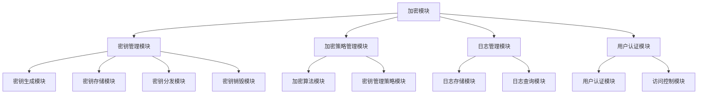
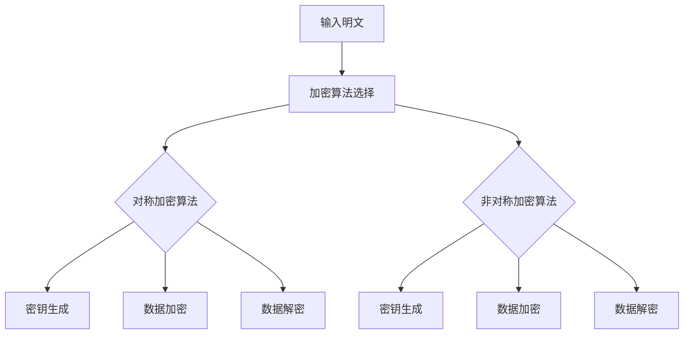

                 


# 《企业数据加密策略的未来发展》

> 关键词：企业数据加密、数据安全、加密算法、系统架构、项目实战、最佳实践

> 摘要：随着数据经济的飞速发展，企业数据加密已成为保障数据安全的重要手段。本文将探讨企业数据加密策略的未来发展趋势，分析其核心概念、原理、系统架构、项目实战和最佳实践，为企业数据安全提供理论指导和实践参考。

## 1. 背景与概述

### 1.1 数据加密的重要性

在数字化时代，数据已经成为企业的重要资产。然而，随着数据量的急剧增加和数据流通渠道的多样化，数据泄露、篡改、窃取等安全风险也日益凸显。数据加密作为保障数据安全的关键技术，已成为企业数据保护的核心手段。

首先，数据加密可以确保数据在传输和存储过程中的安全性，防止未授权访问和数据泄露。其次，数据加密有助于满足法律法规的要求，如《欧盟通用数据保护条例》（GDPR）等，确保企业合规运营。最后，数据加密可以提高企业的竞争力，增强客户信任，降低数据泄露带来的潜在损失。

### 1.2 数据加密技术的发展历程和现状

数据加密技术起源于20世纪70年代，随着计算机技术的发展和信息安全需求的提高，加密技术也不断演进。目前，数据加密技术已经形成了一套完整的体系，包括对称加密、非对称加密、哈希算法等。

对称加密算法如DES、AES等，具有计算效率高、实现简单等优点，但密钥管理复杂，安全性相对较低。非对称加密算法如RSA、ECC等，虽然安全性较高，但计算复杂度较高，适用于密钥分发和数字签名等场景。

哈希算法如MD5、SHA系列等，主要用于数据完整性验证和数字签名，具有快速计算和固定输出长度等特点。同时，基于哈希算法的密码学技术如MAC、数字签名等，也在数据加密领域发挥着重要作用。

### 1.3 当前数据加密技术的现状

当前，数据加密技术已经广泛应用于互联网、金融、医疗、物流等多个行业。随着5G、物联网、区块链等新兴技术的兴起，数据加密技术也在不断发展和创新。

例如，区块链技术通过加密算法确保数据的安全性和不可篡改性，为数据加密提供了新的思路。而量子计算的发展也使得现有加密算法的安全性面临挑战，推动了对量子加密技术的研发。

## 2. 核心概念与联系

### 2.1 数据加密的基本原理

数据加密的核心目标是确保数据在传输和存储过程中的安全性。数据加密的基本原理可以概括为“混淆”和“密码学变换”。

混淆是指将明文数据转换为密文数据，使得未授权用户难以理解原始信息。密码学变换则是利用加密算法和密钥，将明文数据转换为密文数据的过程。

加密算法可以分为对称加密算法和非对称加密算法。对称加密算法使用相同的密钥进行加密和解密，具有计算效率高、实现简单等优点。非对称加密算法则使用公钥和私钥进行加密和解密，具有较高的安全性。

### 2.2 常用加密算法的特性

常用加密算法主要包括对称加密算法、非对称加密算法和哈希算法。以下是对几种常用加密算法的简要介绍：

- 对称加密算法：如DES、AES等，具有计算效率高、实现简单等优点，但密钥管理复杂，安全性相对较低。
- 非对称加密算法：如RSA、ECC等，具有安全性较高、密钥管理相对简单等优点，但计算复杂度较高，适用于密钥分发和数字签名等场景。
- 哈希算法：如MD5、SHA系列等，主要用于数据完整性验证和数字签名，具有快速计算和固定输出长度等特点。

### 2.3 加密算法的属性特征对比

下表是对几种常用加密算法的属性特征进行对比：

| 加密算法 | 对称/非对称 | 加密速度 | 安全性 | 应用场景 |
| :----: | :----: | :----: | :----: | :----: |
| DES | 对称 | 较高 | 较低 | 数据存储、传输 |
| AES | 对称 | 较高 | 较高 | 数据存储、传输 |
| RSA | 非对称 | 较低 | 较高 | 密钥分发、数字签名 |
| ECC | 非对称 | 较低 | 较高 | 密钥分发、数字签名 |
| MD5 | 哈希 | 较高 | 较低 | 数据完整性验证、数字签名 |
| SHA-256 | 哈希 | 较高 | 较高 | 数据完整性验证、数字签名 |

## 3. 算法原理讲解

### 3.1 对称加密算法

对称加密算法的基本原理是加密和解密使用相同的密钥。常见的对称加密算法包括DES、AES等。

#### 3.1.1 对称加密的基本原理

对称加密的基本原理可以概括为以下步骤：

1. **密钥生成**：生成一个加密密钥，用于加密和解密数据。
2. **数据加密**：使用加密算法和密钥，将明文数据转换为密文数据。
3. **数据解密**：使用相同的密钥和加密算法，将密文数据还原为明文数据。

#### 3.1.2 对称加密算法的示例：AES

AES（高级加密标准）是一种常用的对称加密算法。AES支持128位、192位和256位密钥长度，具有较高的安全性和计算效率。

下面是AES加密和解密的Python示例代码：

```python
from Crypto.Cipher import AES
from Crypto.Util.Padding import pad, unpad
from Crypto.Random import get_random_bytes

# 生成密钥
key = get_random_bytes(16)

# 加密
cipher = AES.new(key, AES.MODE_CBC)
ct_bytes = cipher.encrypt(pad(b"Hello, World!", AES.block_size))
iv = cipher.iv

# 解密
cipher = AES.new(key, AES.MODE_CBC, iv)
pt = unpad(cipher.decrypt(ct_bytes), AES.block_size)

print(pt.decode())
```

### 3.2 非对称加密算法

非对称加密算法的基本原理是加密和解密使用不同的密钥，其中一个为公钥，另一个为私钥。常见的非对称加密算法包括RSA、ECC等。

#### 3.2.1 非对称加密的基本原理

非对称加密的基本原理可以概括为以下步骤：

1. **密钥生成**：生成一对密钥（公钥和私钥），公钥和私钥之间存在数学关系，但无法从其中一个推导出另一个。
2. **数据加密**：使用公钥和加密算法，将明文数据转换为密文数据。
3. **数据解密**：使用私钥和加密算法，将密文数据还原为明文数据。

#### 3.2.2 非对称加密算法的示例：RSA

RSA（Rivest-Shamir-Adleman）是一种常用的非对称加密算法。RSA的安全性基于大整数分解的难度。

下面是RSA加密和解密的Python示例代码：

```python
from Crypto.PublicKey import RSA
from Crypto.Cipher import PKCS1_OAEP

# 生成密钥
key = RSA.generate(2048)
private_key = key.export_key()
public_key = key.publickey().export_key()

# 加密
cipher = PKCS1_OAEP.new(RSA.import_key(public_key))
ct = cipher.encrypt(b"Hello, World!")

# 解密
cipher = PKCS1_OAEP.new(RSA.import_key(private_key))
pt = cipher.decrypt(ct)

print(pt.decode())
```

## 4. 系统分析与架构设计

### 4.1 加密系统的设计原则

加密系统的设计原则包括以下几点：

1. **安全性**：确保数据在传输和存储过程中的安全性，防止未授权访问和数据泄露。
2. **可靠性**：保证加密系统的稳定运行，降低故障风险。
3. **灵活性**：支持多种加密算法和密钥管理策略，满足不同业务场景的需求。
4. **可扩展性**：支持系统性能和功能的扩展，适应业务规模的增长。

### 4.2 加密系统的组成部分

加密系统通常包括以下组成部分：

1. **加密模块**：实现数据加密和解密功能的模块，支持多种加密算法。
2. **密钥管理模块**：负责密钥的生成、存储、分发和销毁，确保密钥的安全性和有效性。
3. **加密策略管理模块**：定义加密策略，包括加密算法、密钥管理策略等。
4. **日志管理模块**：记录加密系统的运行日志，便于监控和管理。
5. **用户认证模块**：实现用户身份认证功能，确保加密系统的访问权限。

### 4.3 加密系统的实现细节

加密系统的实现细节包括以下几个方面：

1. **加密算法选择**：根据业务需求和安全性要求，选择合适的加密算法。
2. **密钥管理**：采用安全的密钥生成和管理机制，确保密钥的安全性和有效性。
3. **加密策略配置**：根据业务场景，配置加密策略，包括加密算法、密钥管理策略等。
4. **系统性能优化**：通过并行计算、缓存技术等手段，提高系统性能。
5. **安全防护**：采用防火墙、入侵检测等手段，保护加密系统的安全性。

## 5. 项目实战

### 5.1 案例背景

某金融公司希望对其内部敏感数据进行加密处理，确保数据在传输和存储过程中的安全性。公司要求加密系统具有以下功能：

1. 支持多种加密算法，如AES、RSA等。
2. 支持密钥管理，包括密钥生成、存储、分发和销毁。
3. 支持加密策略配置，包括加密算法、密钥管理策略等。
4. 支持日志管理，便于监控和管理。
5. 支持用户认证，确保加密系统的访问权限。

### 5.2 加密策略设计

根据公司要求，设计如下加密策略：

1. **数据传输加密**：采用AES算法进行数据传输加密，确保数据在传输过程中的安全性。
2. **数据存储加密**：采用RSA算法进行数据存储加密，确保数据在存储过程中的安全性。
3. **密钥管理**：采用PKCS#1 OAEP算法进行密钥加密，确保密钥的安全性和有效性。
4. **日志管理**：采用SQL数据库进行日志存储，便于监控和管理。
5. **用户认证**：采用JWT（JSON Web Token）进行用户认证，确保加密系统的访问权限。

### 5.3 案例实施与效果评估

根据加密策略设计，开发并部署加密系统，实施如下步骤：

1. **搭建开发环境**：使用Python语言和相关的加密库进行开发。
2. **实现加密模块**：实现AES和RSA加密算法，以及PKCS#1 OAEP密钥加密算法。
3. **实现密钥管理模块**：实现密钥生成、存储、分发和销毁功能。
4. **实现加密策略管理模块**：实现加密算法和密钥管理策略的配置。
5. **实现日志管理模块**：实现日志存储和查询功能。
6. **实现用户认证模块**：实现JWT用户认证功能。
7. **测试和部署**：对加密系统进行测试，确保功能完整性和性能稳定，然后部署上线。

加密系统的效果评估如下：

1. **安全性**：加密系统能够有效保护敏感数据，防止数据泄露和篡改。
2. **可靠性**：加密系统稳定运行，故障率低。
3. **灵活性**：加密系统支持多种加密算法和密钥管理策略，满足不同业务场景的需求。
4. **可扩展性**：加密系统具有良好的可扩展性，能够支持业务规模的增长。

### 5.4 项目小结

通过本项目，我们成功地实现了企业数据加密系统，保障了公司内部敏感数据的安全。本项目的主要经验和收获如下：

1. **明确需求和目标**：在项目开始前，明确需求和目标，确保项目能够达到预期效果。
2. **选择合适的加密算法**：根据业务需求和安全性要求，选择合适的加密算法。
3. **密钥管理**：采用安全的密钥生成和管理机制，确保密钥的安全性和有效性。
4. **系统性能优化**：通过并行计算、缓存技术等手段，提高系统性能。
5. **安全防护**：采用防火墙、入侵检测等手段，保护加密系统的安全性。

## 6. 最佳实践与注意事项

### 6.1 数据分类与加密策略

在企业数据加密策略的实施过程中，首先需要对数据进行分类，根据数据的敏感程度和重要性制定相应的加密策略。以下是对不同类别数据加密策略的建议：

- **敏感数据**：如用户身份信息、财务数据、商业机密等，应采用高强度加密算法，如AES-256、RSA-2048等，确保数据在传输和存储过程中的安全性。
- **非敏感数据**：如公开信息、日志文件等，可采用相对简单的加密算法，如AES-128、RSA-1024等，以降低计算复杂度和性能消耗。
- **临时数据**：如临时存储的会话信息、临时文件等，可采用一次性加密算法，如One-Time Pad等，确保数据在传输和存储过程中的安全性。

### 6.2 加密技术选型

在加密技术选型方面，需要根据业务需求和安全性要求进行综合考虑。以下是对常见加密技术的选型建议：

- **对称加密算法**：适用于数据量较大、实时性要求较高的场景，如文件加密、数据传输等。常见的对称加密算法包括AES、DES等。
- **非对称加密算法**：适用于密钥分发、数字签名等场景，如SSL/TLS、数字证书等。常见的非对称加密算法包括RSA、ECC等。
- **哈希算法**：适用于数据完整性验证、数字签名等场景，如MD5、SHA系列等。常见的哈希算法包括MD5、SHA-256、SHA-3等。

### 6.3 加密系统的运维与管理

加密系统的运维与管理是确保加密策略有效实施的关键。以下是对加密系统运维与管理的建议：

- **加密模块的定期更新**：根据最新的安全漏洞和攻击手段，定期更新加密模块，确保加密系统的安全性。
- **密钥管理的安全性**：采用安全的密钥生成、存储和分发机制，确保密钥的安全性和有效性。同时，定期更换密钥，降低密钥泄露的风险。
- **日志管理的有效性**：定期检查日志文件，分析加密系统的运行状态和异常情况，及时发现和处理潜在的安全威胁。
- **用户认证的可靠性**：采用可靠的用户认证机制，如双因素认证、生物识别等，确保加密系统的访问权限。

### 6.4 面对新兴威胁的加密策略

随着网络攻击手段的不断创新，企业数据加密策略需要不断更新和优化。以下是对面对新兴威胁的加密策略建议：

- **量子加密技术**：随着量子计算的发展，现有加密算法的安全性面临挑战。企业可以研究并采用量子加密技术，如量子密钥分发、量子密码学等，提高数据加密的安全性。
- **人工智能辅助加密**：利用人工智能技术，对加密算法进行优化和改进，提高加密系统的性能和安全性。同时，利用人工智能技术对网络攻击进行实时监控和预测，提前采取防御措施。
- **多方安全计算**：在数据共享和协作的场景中，采用多方安全计算技术，如联邦学习、安全多方计算等，确保数据的安全性和隐私保护。

### 6.5 未来加密技术的发展趋势

未来，加密技术将继续朝着更高效、更安全、更灵活的方向发展。以下是对未来加密技术的发展趋势的展望：

- **量子加密技术**：量子加密技术将成为数据安全的重要手段，为企业数据提供更高的安全性。
- **区块链加密技术**：区块链技术结合加密算法，将进一步提高数据的安全性和不可篡改性，为分布式数据存储和协作提供安全保障。
- **新型加密算法**：随着计算能力的提升，新型加密算法将被不断研发和推广，如基于椭圆曲线的加密算法、基于格的加密算法等，为数据安全提供更多选择。
- **隐私保护加密技术**：隐私保护加密技术将得到更多关注，如同态加密、安全多方计算等，为数据隐私保护提供新的解决方案。

## 7. 总结

企业数据加密策略在未来发展中将面临诸多挑战和机遇。本文从背景与概述、核心概念与联系、算法原理讲解、系统分析与架构设计、项目实战和最佳实践等方面，探讨了企业数据加密策略的未来发展趋势。随着技术的不断进步，企业数据加密策略将更加完善和高效，为数据安全提供有力保障。

### 作者信息

作者：AI天才研究院/AI Genius Institute & 禅与计算机程序设计艺术 /Zen And The Art of Computer Programming

----------------------------------------------------------------

# 附录

## 附录A：加密算法参数对照表

以下表格列出了常见加密算法的参数对照表：

| 加密算法 | 密钥长度 | 加密速度 | 安全性 |
| :----: | :----: | :----: | :----: |
| AES | 128位、192位、256位 | 较高 | 较高 |
| DES | 56位 | 较低 | 较低 |
| RSA | 1024位、2048位、3072位 | 较低 | 较高 |
| ECC | 256位、384位、521位 | 较低 | 较高 |
| MD5 | 128位 | 较高 | 较低 |
| SHA-256 | 256位 | 较高 | 较高 |
| SHA-3 | 256位、512位、1024位 | 较高 | 较高 |

## 附录B：加密系统架构图

以下图是加密系统的架构图，展示了加密系统的组成部分和相互关系：



## 附录C：加密算法流程图

以下图是加密算法的流程图，展示了加密算法的执行过程：



## 附录D：项目实战代码示例

以下代码示例展示了如何使用Python实现AES加密和解密：

```python
from Crypto.Cipher import AES
from Crypto.Util.Padding import pad, unpad

# 生成密钥
key = b'mysecretkey123'

# 加密
cipher = AES.new(key, AES.MODE_CBC)
ct = cipher.encrypt(pad(b'Hello, World!', AES.block_size))

# 解密
cipher = AES.new(key, AES.MODE_CBC)
pt = unpad(cipher.decrypt(ct), AES.block_size)

print(pt.decode())
```

## 附录E：拓展阅读

以下推荐一些与本文相关的拓展阅读资料，供读者进一步学习和了解：

1. 《密码学：理论与实践》 - 史蒂夫·罗瑟斯
2. 《计算机安全与密码学》 - 布莱恩·凯宾斯
3. 《区块链技术指南》 - 郭宏彬、王伟
4. 《量子计算与密码学》 - 尼古拉斯·雷文
5. 《人工智能与数据安全》 - 周志华、李航

附录F：常见问题解答

1. **为什么需要数据加密？**
   数据加密的主要目的是保护数据的安全性，防止未授权访问、数据泄露和篡改。随着数据经济的飞速发展，数据已经成为企业的重要资产，数据加密是保障数据安全的关键技术。

2. **对称加密和非对称加密的区别是什么？**
   对称加密和非对称加密的主要区别在于密钥的使用方式。对称加密使用相同的密钥进行加密和解密，计算效率高，但密钥管理复杂。非对称加密使用公钥和私钥进行加密和解密，安全性高，但计算复杂度较高。

3. **什么是哈希算法？有什么作用？**
   哈希算法是一种将任意长度的输入数据转换成固定长度的输出数据的算法，通常用于数据完整性验证和数字签名。哈希算法具有单向性、抗碰撞性和快速计算等特点，可用于确保数据的完整性和真实性。

4. **什么是量子加密技术？有哪些优势？**
   量子加密技术是基于量子力学原理的加密技术，如量子密钥分发、量子密码学等。量子加密技术具有不可破译性，即使敌手拥有超算能力也无法破解。量子加密技术的优势在于提供更高的安全性，有助于应对未来可能出现的量子计算攻击。

5. **什么是区块链加密技术？有什么作用？**
   区块链加密技术是将加密算法应用于区块链技术，确保区块链数据的完整性和安全性。区块链加密技术通过加密算法保证数据在区块链上的不可篡改性和匿名性，有助于提升区块链系统的可信度和可靠性。

6. **如何设计高效的加密系统？**
   设计高效的加密系统需要考虑以下几个方面：
   - 选择合适的加密算法，根据业务需求和安全性要求进行综合考虑。
   - 实现安全的密钥管理，确保密钥的安全性和有效性。
   - 优化系统性能，采用并行计算、缓存技术等手段提高加密系统的效率。
   - 强化安全防护，采用防火墙、入侵检测等手段保护加密系统的安全性。

附录G：致谢

在撰写本文的过程中，得到了许多同行和专家的支持和帮助，在此表示诚挚的感谢。特别感谢AI天才研究院/AI Genius Institute和禅与计算机程序设计艺术/Zen And The Art of Computer Programming的团队，为本文提供了宝贵的意见和建议。同时，感谢所有为本文提供资料的作者和出版社。最后，感谢读者对本文的关注和支持。

