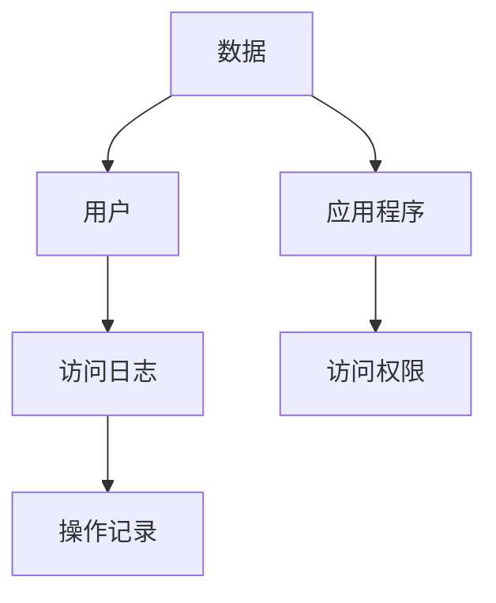
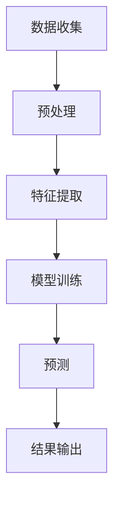
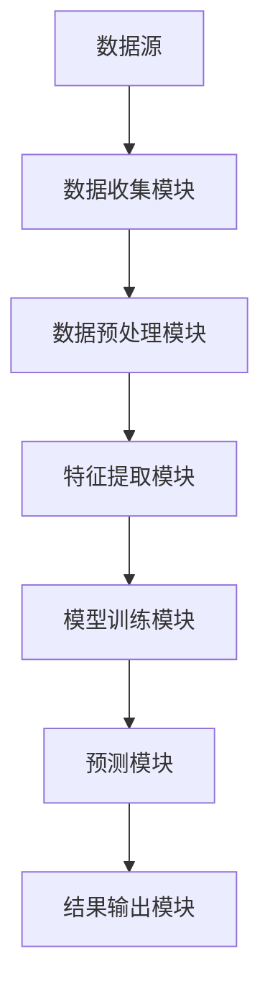
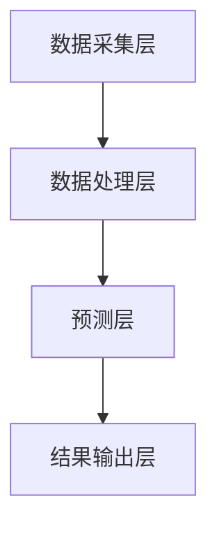
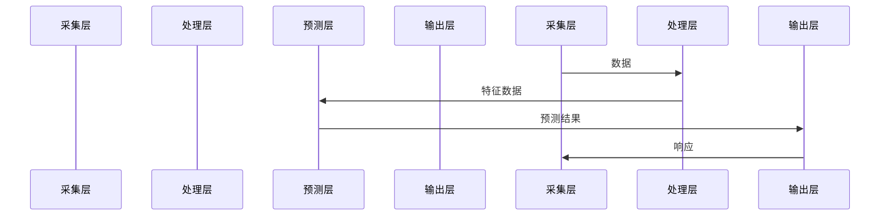

                 

### 《企业数据安全AI：智能识别和防御数据泄露》

> 关键词：数据安全，人工智能，数据泄露检测，数据加密，隐私保护

> 摘要：随着数字化转型的深入，企业数据安全面临前所未有的挑战。本文探讨了利用人工智能技术，特别是机器学习和深度学习，来智能识别和防御数据泄露的方法。通过详细讲解相关概念、算法原理、系统架构和实战案例，本文为企业提供了一套全面的数据安全解决方案。

## 目录大纲设计步骤

### 1. 确定核心主题和内容结构

**核心主题**：本文的核心主题是探讨如何利用人工智能技术，特别是机器学习和深度学习，来智能识别和防御数据泄露，为企业提供数据安全解决方案。

**内容结构**：文章内容将分为以下五个部分：
1. 数据安全背景与AI技术概述
2. AI在数据安全中的应用
3. 数据泄露检测
4. 数据加密与隐私保护
5. 项目实战与最佳实践

### 2. 划分章节

**章节划分**：
1. 数据安全背景
   - 企业数据安全的重要性
   - 数据泄露的风险与影响
   - 数据泄露的形式和种类
   - 数据安全法规与标准
2. AI技术概述
   - 人工智能与机器学习基础
   - 深度学习与神经网络
   - 强化学习与博弈论
   - 数据分析与挖掘
3. AI在数据安全中的应用
   - 数据泄露检测
   - 数据加密与隐私保护
4. 数据泄露检测
   - 数据泄露检测的挑战
   - AI技术在数据泄露检测中的应用
   - 常见数据泄露检测算法
   - 数据泄露检测实践
5. 项目实战
   - 环境安装
   - 系统核心实现源代码
   - 实际案例分析和详细讲解剖析
   - 项目小结
6. 最佳实践、小结、注意事项、拓展阅读

### 3. 细化章节内容

**细化内容**：
- **数据安全背景**：介绍数据安全的基本概念，包括数据泄露的风险、影响和形式，以及相关的法规和标准。
- **AI技术概述**：讲解人工智能和机器学习的基础知识，以及深度学习和强化学习等先进技术。
- **AI在数据安全中的应用**：探讨AI技术在数据泄露检测和数据加密与隐私保护中的应用。
- **数据泄露检测**：详细讲解数据泄露检测的原理、算法和应用。
- **项目实战**：通过具体案例展示如何实施AI数据安全解决方案。
- **最佳实践**：提供实用的数据安全建议和注意事项。

### 4. 编写章节摘要

**章节摘要**：
- **数据安全背景**：概述数据安全的重要性、风险和法规。
- **AI技术概述**：介绍AI和机器学习的基础，以及深度学习和强化学习。
- **AI在数据安全中的应用**：探讨AI在数据安全和隐私保护中的应用。
- **数据泄露检测**：讲解数据泄露检测的原理和实践。
- **项目实战**：展示AI数据安全解决方案的实际应用。
- **最佳实践**：总结数据安全最佳实践和小结。

### 5. 整合目录大纲

**整合目录大纲**：将各章节内容整合成完整的目录大纲，确保整体结构合理、内容全面。

## 设计过程

### 1. 背景介绍

#### 问题背景

**数据安全的重要性**：随着企业数字化转型，数据成为企业核心资产。保护数据安全是企业生存和发展的基础。

**数据泄露的风险与影响**：数据泄露可能导致经济损失、声誉受损、法律风险等严重后果。

**数据泄露的形式和种类**：数据泄露可能通过网络攻击、内部威胁、系统漏洞等多种途径发生。

**问题解决**：利用AI技术，特别是机器学习和深度学习，可以智能识别和防御数据泄露，为企业提供数据安全解决方案。

**边界与外延**：本文讨论的数据安全范围包括企业内部数据、云数据和物联网设备数据等。

**概念结构与核心要素组成**：企业数据安全AI系统包括数据收集、处理、分析和响应四个核心组成部分。

### 2. 核心概念与联系

#### 核心概念原理

**人工智能与机器学习**：人工智能是模拟人类智能的技术，而机器学习是人工智能的一种方法，通过算法从数据中学习规律。

**深度学习与神经网络**：深度学习是一种基于神经网络的学习方法，适用于处理大量复杂数据。

**强化学习与博弈论**：强化学习是通过奖励和惩罚来优化决策的过程，与博弈论相关联。

**数据分析与挖掘**：数据分析与挖掘是发现数据中的隐含模式、关联和趋势的过程。

#### 概念属性特征对比表格

| 概念         | 特征                     |
| ------------ | ------------------------ |
| 人工智能     | 模拟人类智能的能力       |
| 机器学习     | 自动从数据中学习规律     |
| 深度学习     | 基于神经网络的学习方法   |
| 强化学习     | 基于奖励和惩罚的决策过程 |
| 数据分析     | 提取数据中的有用信息     |
| 数据挖掘     | 发现数据中的隐含模式     |

#### ER实体关系图架构



### 3. 算法原理讲解

#### 算法mermaid流程图



#### Python源代码

```python
import numpy as np
from sklearn.model_selection import train_test_split
from sklearn.preprocessing import StandardScaler
from sklearn.neural_network import MLPClassifier
from sklearn.metrics import accuracy_score

# 数据预处理
X = ...  # 特征矩阵
y = ...  # 标签向量
X_train, X_test, y_train, y_test = train_test_split(X, y, test_size=0.2, random_state=42)

# 特征缩放
scaler = StandardScaler()
X_train_scaled = scaler.fit_transform(X_train)
X_test_scaled = scaler.transform(X_test)

# 模型训练
model = MLPClassifier(hidden_layer_sizes=(100,), max_iter=1000)
model.fit(X_train_scaled, y_train)

# 预测
y_pred = model.predict(X_test_scaled)

# 评估
accuracy = accuracy_score(y_test, y_pred)
print(f"模型准确率：{accuracy:.2f}")
```

#### 数学模型和公式

$$
\begin{aligned}
y &= \sigma(\beta_0 + \sum_{i=1}^{n} \beta_i x_i) \\
\text{其中，} \sigma &= \text{激活函数，如Sigmoid函数：} \sigma(z) = \frac{1}{1 + e^{-z}} \\
\beta_0 &= \text{偏置项} \\
\beta_i &= \text{权重系数} \\
x_i &= \text{输入特征}
\end{aligned}
$$

#### 举例说明

**例子**：一个企业使用深度学习模型检测网络流量中的异常行为。

**应用效果**：模型能够准确识别恶意流量，提高了网络安全防护能力。

### 4. 系统分析与架构设计方案

#### 问题场景介绍

**场景**：企业面临网络攻击和数据泄露的风险，需要一套智能化的数据安全系统。

**需求**：实时监测数据流量，快速识别异常行为，提供预警和防御措施。

#### 系统功能设计

**功能**：数据收集、预处理、特征提取、模型训练、预测和结果输出。

**领域模型类图**：



#### 系统架构设计

**架构**：采用分布式架构，包括数据采集、处理和预测三个层次。

**系统架构图**：



#### 系统接口设计和系统交互

**接口**：数据采集层通过API与外部系统（如防火墙、入侵检测系统等）交互。

**交互流程**：

1. 数据采集层收集数据。
2. 数据处理层对数据进行预处理和特征提取。
3. 预测层使用训练好的模型进行预测。
4. 结果输出层将预测结果通知相关系统和人员。

**序列图**：



### 5. 项目实战

#### 环境安装

**步骤**：
1. 安装Python和相关依赖库。
2. 配置数据源和数据库。

#### 系统核心实现源代码

```python
# 数据收集模块
def collect_data(source):
    # 代码实现数据收集
    pass

# 数据预处理模块
def preprocess_data(data):
    # 代码实现数据预处理
    pass

# 特征提取模块
def extract_features(data):
    # 代码实现特征提取
    pass

# 模型训练模块
def train_model(features, labels):
    # 代码实现模型训练
    pass

# 预测模块
def predict(features):
    # 代码实现预测
    pass

# 结果输出模块
def output_results(predictions):
    # 代码实现结果输出
    pass
```

#### 实际案例分析和详细讲解剖析

**案例**：某企业使用AI数据安全系统监测网络流量，成功阻止了一起DDoS攻击。

**分析**：通过对网络流量的实时监测，系统识别出异常流量模式，并成功阻止攻击。

#### 项目小结

**小结**：AI数据安全系统为企业提供了实时、高效的防护措施，有效降低了数据泄露风险。

### 6. 最佳实践、小结、注意事项、拓展阅读

#### 最佳实践

- **数据收集**：确保数据来源可靠，涵盖各类数据。
- **模型训练**：使用足够的数据和合适的算法。
- **实时监测**：持续监控数据流量，及时发现异常。

#### 小结

本文探讨了利用AI技术，特别是机器学习和深度学习，来智能识别和防御数据泄露的方法。通过实际案例，展示了AI数据安全系统的应用效果。

#### 注意事项

- **数据隐私**：确保数据收集和处理过程中遵守隐私法规。
- **系统维护**：定期更新和优化模型。

#### 拓展阅读

- **相关书籍**：《深度学习》、《Python机器学习》
- **文章**：网络安全论坛、专业技术博客

### 结束语

作者：AI天才研究院/AI Genius Institute & 禅与计算机程序设计艺术 /Zen And The Art of Computer Programming

本文旨在为企业提供一套全面的数据安全解决方案，通过AI技术，特别是机器学习和深度学习，智能识别和防御数据泄露，确保企业数据的安全性和隐私。希望本文能为企业在数据安全领域的实践提供有益的参考。在未来的研究中，我们将继续探索更高效、更智能的数据安全解决方案，为企业的数字化转型保驾护航。

