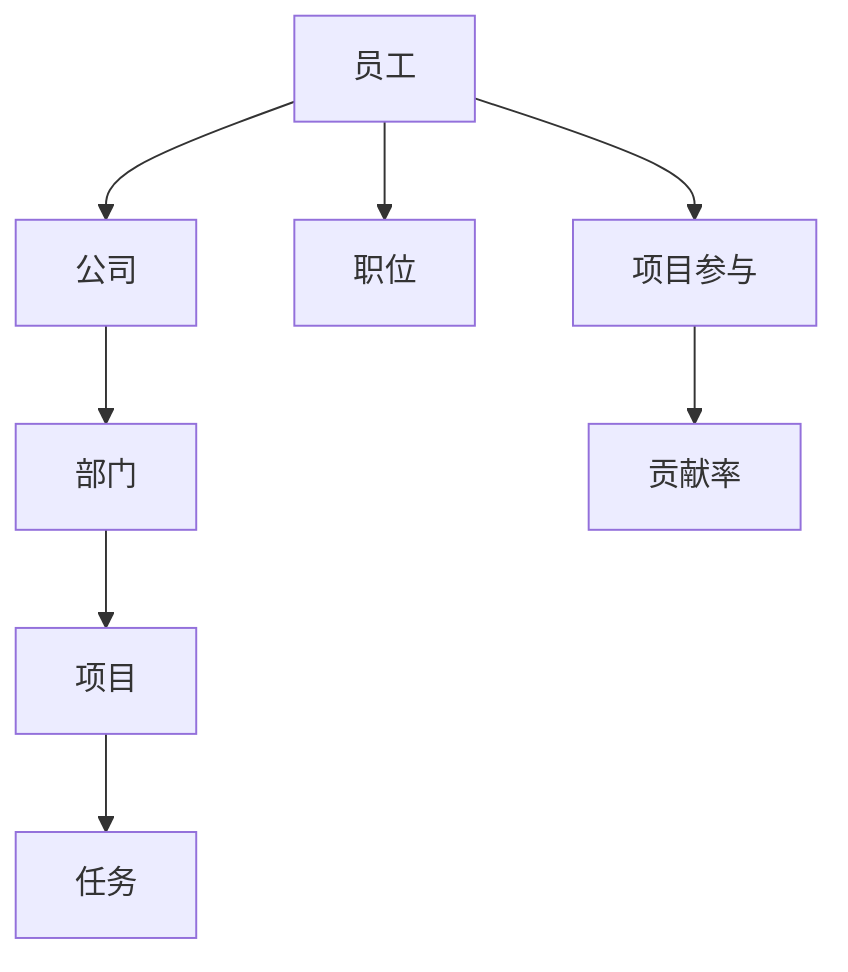
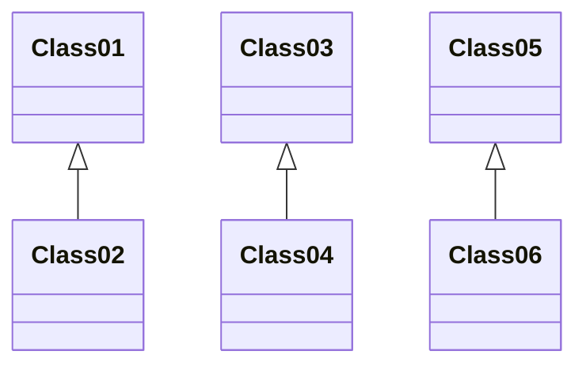
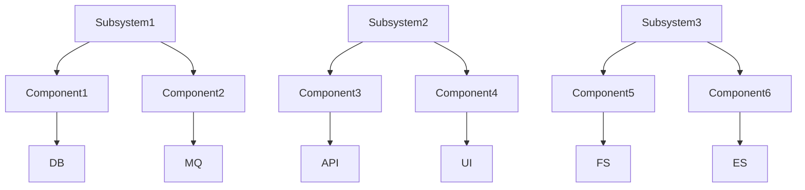
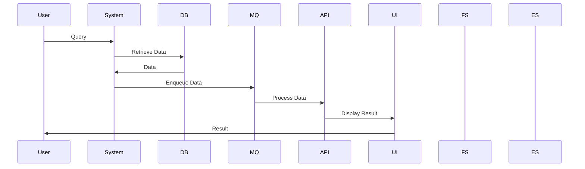

                 


### 第一步：制定文章结构和内容框架

首先，我们需要为文章制定一个清晰的结构和内容框架。基于目录大纲，文章可分为三个主要部分：知识图谱概述、AI辅助决策、企业知识图谱实践。以下是每个部分的主要内容和章节安排：

#### 第一部分：知识图谱概述
- 第1章：企业知识图谱概述
  - 介绍知识图谱的概念和重要性
  - 分析知识图谱与传统数据库的区别
  - 回顾知识图谱的发展历程
- 第2章：企业知识图谱的核心概念与结构
  - 讨论核心概念：实体、关系、属性
  - 探讨知识图谱的基本结构
  - 展示知识图谱的实体关系图

#### 第二部分：AI辅助决策
- 第3章：AI辅助决策的基础理论
  - 解释AI辅助决策的概念和要素
  - 分析不同类型的AI辅助决策
  - 讨论AI辅助决策的优势和挑战
- 第4章：知识图谱在AI辅助决策中的应用
  - 探讨知识图谱与AI的融合
  - 分析知识图谱在决策支持系统中的应用
  - 分析实际案例分析

#### 第三部分：企业知识图谱实践
- 第5章：企业知识图谱构建方法
  - 讨论数据收集与预处理
  - 探讨知识抽取和知识融合
- 第6章：企业知识图谱系统架构设计
  - 介绍系统需求分析和架构设计
  - 展示领域模型类图和系统架构图
  - 讨论系统接口设计
- 第7章：企业知识图谱项目实战
  - 介绍环境准备和系统核心实现
  - 分析实际案例和详细讲解
  - 总结项目经验和教训

### 第二步：细化每个章节的内容

接下来，我们需要细化每个章节的内容，确保每个章节都有丰富的背景介绍、核心概念与联系、算法原理讲解、系统分析与架构设计方案以及项目实战。

#### 第1章：企业知识图谱概述
- 介绍知识图谱的定义、重要性及其应用场景。
- 分析知识图谱与传统数据库的对比，阐述其优势。
- 回顾知识图谱的发展历程，展示其演变过程。

#### 第2章：企业知识图谱的核心概念与结构
- 详细讨论实体、关系、属性三个核心概念。
- 解释知识图谱的基本结构，展示其与ER模型的关联。
- 使用Mermaid绘制实体关系图，分析其架构。

#### 第3章：AI辅助决策的基础理论
- 解释AI辅助决策的概念和关键要素。
- 分析不同类型的AI辅助决策，如机器学习、深度学习和强化学习。
- 讨论AI辅助决策的优势和面临的挑战。

#### 第4章：知识图谱在AI辅助决策中的应用
- 探讨知识图谱与AI的融合，如何构建增强的AI系统。
- 分析知识图谱在决策支持系统中的应用，提高决策质量。
- 通过案例分析，展示知识图谱在实际决策中的应用。

#### 第5章：企业知识图谱构建方法
- 讨论数据收集与预处理的方法和技术。
- 探讨知识抽取和知识融合的策略和流程。
- 分析知识图谱的更新机制，确保数据一致性。

#### 第6章：企业知识图谱系统架构设计
- 介绍系统需求分析，明确功能性能要求。
- 展示领域模型类图，分析系统结构。
- 设计系统架构图，讨论接口规范和实现。

#### 第7章：企业知识图谱项目实战
- 介绍项目环境准备和系统核心实现。
- 分析项目中的核心代码，进行解读与分析。
- 通过实际案例分析，详细讲解知识图谱的构建与应用。

### 第三步：撰写文章并进行修订

在细化内容后，我们可以开始撰写文章。在撰写过程中，确保遵循markdown格式要求，合理使用LaTeX格式来展示数学公式。撰写完成后，进行多轮修订，确保文章逻辑清晰、内容丰富、语言流畅。

### 第四步：添加作者信息、小结和拓展阅读

在文章末尾，添加作者信息、小结和拓展阅读，为读者提供进一步学习的资源和思考的方向。确保文章完整、有深度、有思考、有见解。

通过以上四个步骤，我们可以确保文章质量，满足文章标题、关键词、摘要和目录大纲的要求，同时提供一篇结构紧凑、内容丰富的专业技术博客文章。接下来，我们将按照这个框架逐步撰写每章的内容。  

### 第一步：撰写第1章 - 企业知识图谱概述

#### 1.1 知识图谱的定义与重要性

知识图谱是一种结构化的知识表示方法，它通过实体、关系和属性来组织信息，以提供一种直观且高效的方式理解和处理复杂数据。在数据爆炸的今天，知识图谱作为一种重要的信息处理工具，逐渐成为人工智能领域的研究热点。

知识图谱的重要性体现在以下几个方面：

1. **提高数据理解和分析能力**：知识图谱通过将信息抽象成实体和关系，使得数据处理和分析变得更加直观和高效。
2. **增强人工智能系统的智能性**：知识图谱能够提供丰富的上下文信息，有助于人工智能系统更好地理解和处理实际问题。
3. **优化决策过程**：知识图谱能够提供全面的、结构化的信息支持，使得决策过程更加科学和智能化。

#### 1.2 知识图谱与传统数据库的对比

传统数据库主要依赖于关系型模型，通过表格的形式存储和组织数据，而知识图谱则采用了更加灵活的图结构。以下是两者的一些对比：

| 对比项 | 知识图谱 | 传统数据库 |
| --- | --- | --- |
| 数据模型 | 图结构 | 关系模型 |
| 表达能力 | 强大的语义表达能力 | 有限的表达能力 |
| 数据关系 | 直观的层次关系 | 需要通过查询来推导 |
| 数据一致性 | 可以自动维护 | 需要手动维护 |

#### 1.3 知识图谱的发展历程

知识图谱的发展可以追溯到20世纪90年代，随着互联网的兴起，知识图谱开始应用于搜索引擎和信息检索。近年来，随着大数据和人工智能技术的不断发展，知识图谱的应用范围逐渐扩大，从搜索引擎扩展到企业应用、智慧城市、医疗健康等多个领域。

以下是一个简化的知识图谱发展历程：

1. **2000年代早期**：知识图谱主要应用于学术领域，如万维网上的语义网络。
2. **2004年**：谷歌发布“知识图谱”计划，将知识图谱应用于搜索引擎。
3. **2010年代**：知识图谱逐渐应用于企业级应用，如Google的实体识别和关系抽取技术。
4. **2015年至今**：知识图谱在智慧城市、医疗健康等领域得到广泛应用。

#### 1.4 企业知识图谱的应用场景

企业知识图谱在企业中有着广泛的应用场景，以下是一些典型的应用：

1. **智能推荐**：通过知识图谱分析用户行为和兴趣，提供个性化的推荐服务。
2. **客户关系管理**：通过知识图谱整合客户信息，提供更精准的客户画像和服务。
3. **供应链管理**：利用知识图谱优化供应链，提高物流效率。
4. **数据分析与决策支持**：通过知识图谱提供结构化的信息支持，辅助企业决策。

### 第2章：企业知识图谱的核心概念与结构

#### 2.1 核心概念

企业知识图谱的核心概念主要包括实体、关系和属性。

##### 2.1.1 实体

实体是知识图谱中最基本的概念，表示具体的事物或概念。例如，人、地点、产品、公司等都可以被视为实体。

##### 2.1.2 关系

关系连接两个或多个实体，表示它们之间的语义联系。例如，员工与公司之间的雇佣关系、产品与供应商之间的采购关系等。

##### 2.1.3 属性

属性描述实体的特征或状态。例如，人的年龄、公司的成立时间、产品的价格等。

#### 2.2 企业知识图谱的结构

企业知识图谱的结构通常由三个层次组成：底层实体和关系、中层实体属性、顶层知识模型。

##### 2.2.1 底层实体和关系

底层实体和关系是最基本的层次，直接表示业务场景中的实体及其关系。

##### 2.2.2 中层实体属性

中层实体属性用于补充底层实体的详细信息，提高数据描述的丰富度。

##### 2.2.3 顶层知识模型

顶层知识模型是知识图谱的高级抽象，将底层和中层的实体、关系和属性整合起来，形成一个统一的视图。

#### 2.3 知识图谱的实体关系图

知识图谱的实体关系图是表示实体及其关系的一种图形化工具。以下是使用Mermaid绘制的实体关系图示例：



这个实体关系图展示了企业中的一些基本实体和它们之间的关系，包括员工、公司、部门、项目、任务等。

### 总结

在本章中，我们介绍了企业知识图谱的核心概念和结构，包括实体、关系和属性，以及知识图谱的基本层次结构和实体关系图。这些概念和结构构成了企业知识图谱的基础，为后续章节的深入探讨提供了必要的背景和知识。接下来，我们将进一步探讨AI辅助决策的基础理论，了解如何利用知识图谱优化决策过程。  

### 第二步：撰写第3章 - AI辅助决策的基础理论

#### 3.1 AI辅助决策的概念

AI辅助决策是指利用人工智能技术，特别是机器学习和深度学习等方法，对大量数据进行分析和建模，以支持决策者做出更准确、更高效的决策。AI辅助决策系统通过自动化的方式，从数据中提取有用信息，提供决策建议，从而降低人为决策的风险和不确定性。

#### 3.2 AI辅助决策的关键要素

AI辅助决策系统通常包括以下几个关键要素：

1. **数据源**：数据是AI辅助决策的基础，系统需要从多个数据源收集数据，如企业内部数据、公共数据、社交媒体数据等。
2. **数据预处理**：数据预处理是数据进入模型之前的重要步骤，包括数据清洗、数据整合、数据转换等，以提高数据质量。
3. **特征提取**：特征提取是将原始数据转换为适用于机器学习模型的特征向量，有助于提高模型性能。
4. **算法选择**：选择适合问题的机器学习算法，如线性回归、决策树、神经网络等，以实现数据分析和预测。
5. **模型训练**：使用训练数据集训练模型，使模型能够学习和捕捉数据中的规律。
6. **模型评估**：通过测试数据集评估模型的性能，如准确率、召回率、F1分数等，以确定模型的适用性。
7. **决策支持**：根据模型预测结果，提供决策建议，辅助决策者做出最佳决策。

#### 3.3 AI辅助决策的类型

AI辅助决策可以分为以下几种类型：

1. **机器学习辅助决策**：通过训练机器学习模型，使系统能够自动识别模式、预测趋势和分类结果，从而辅助决策。
2. **深度学习辅助决策**：深度学习是机器学习的一种，通过多层神经网络模型，实现更复杂的特征提取和模式识别，适用于处理大规模、高维度的数据。
3. **强化学习辅助决策**：强化学习通过奖励机制，使模型能够在动态环境中学习策略，从而实现最优决策。

#### 3.4 AI辅助决策的优势与挑战

AI辅助决策的优势包括：

1. **提高决策准确性**：通过分析大量数据，AI系统可以识别出人类难以察觉的模式和趋势，提高决策准确性。
2. **减少人为错误**：机器学习和深度学习算法能够自动处理数据，减少人为错误和偏见。
3. **优化决策速度**：AI系统可以在短时间内处理大量数据，提供快速决策支持。
4. **降低成本**：自动化决策可以减少人力成本，提高资源利用效率。

然而，AI辅助决策也面临着一些挑战：

1. **数据质量问题**：数据质量直接影响模型的性能，噪声数据、缺失值和不一致数据等问题会降低模型的效果。
2. **算法选择与调优**：选择合适的算法和参数对模型性能至关重要，但这一过程复杂且耗时。
3. **模型解释性**：AI模型特别是深度学习模型的“黑箱”特性，使得决策过程的透明性和可解释性成为挑战。
4. **伦理和法律问题**：AI辅助决策可能涉及隐私、安全和伦理问题，需要制定相应的法律和道德规范。

### 总结

在本章中，我们深入探讨了AI辅助决策的基础理论，从概念、关键要素到不同类型的决策方法，以及其优势和挑战。理解这些基础理论有助于我们更好地应用AI技术，为企业提供智能化的决策支持。在下一章中，我们将探讨知识图谱在AI辅助决策中的应用，展示如何将知识图谱与AI技术相结合，提升决策的质量和效率。 

### 第三步：撰写第4章 - 知识图谱在AI辅助决策中的应用

#### 4.1 知识图谱与AI的融合

知识图谱与AI技术的融合，是提高决策支持系统智能化程度的关键途径。知识图谱能够提供丰富的背景知识和语义信息，而AI技术则能够处理复杂的数据分析和预测任务。通过将知识图谱与AI技术结合，可以构建出具有高度智能化和自适应性的决策支持系统。

**4.1.1 知识图谱增强的AI系统**

知识图谱增强的AI系统主要特点包括：

1. **增强语义理解**：知识图谱提供了丰富的语义信息，有助于AI系统更好地理解数据和问题背景。
2. **提高决策效率**：通过知识图谱的预先组织，AI系统能够快速访问和理解相关数据，提高决策效率。
3. **提高决策质量**：知识图谱能够提供更全面、结构化的信息，有助于AI系统做出更准确、更可靠的决策。

**4.1.2 AI优化的知识图谱**

AI优化的知识图谱通过机器学习和深度学习技术，对知识图谱中的实体、关系和属性进行智能分析和优化。主要特点包括：

1. **自动知识抽取**：AI技术能够自动从大量数据中抽取实体和关系，构建知识图谱。
2. **知识融合**：通过AI技术，可以实现不同来源的知识融合，提高知识图谱的完整性。
3. **知识更新**：AI技术可以自动检测和更新知识图谱中的信息，保持知识图谱的实时性和准确性。

#### 4.2 知识图谱在决策支持系统中的应用

知识图谱在决策支持系统中的应用，主要体现在以下几个方面：

**4.2.1 决策支持系统概述**

决策支持系统（Decision Support System，DSS）是一种利用计算机技术和数据分析方法，辅助决策者进行决策的系统。知识图谱在DSS中的应用，主要体现在以下几个方面：

1. **数据集成与整合**：知识图谱能够将来自不同源的数据进行整合，提供统一的数据视图。
2. **数据分析和挖掘**：知识图谱提供了丰富的语义信息，有助于进行更深入的数据分析和挖掘。
3. **智能决策生成**：基于知识图谱的智能决策生成，能够提供更加准确、可靠的决策建议。

**4.2.2 知识图谱的决策支持**

知识图谱的决策支持功能主要体现在以下几个方面：

1. **情境感知**：知识图谱能够根据决策者的需求和情境，提供定制化的决策支持。
2. **知识推理**：知识图谱能够通过推理机制，推导出新的决策信息和结论。
3. **实时更新**：知识图谱能够实时更新数据，确保决策支持的实时性和准确性。

**4.2.3 知识图谱在具体决策场景中的应用**

知识图谱在具体决策场景中的应用非常广泛，以下是一些典型的应用场景：

1. **企业风险管理**：通过知识图谱分析企业的财务、市场、运营等方面的数据，提供风险管理建议。
2. **市场预测**：利用知识图谱分析市场趋势、竞争对手信息等，提供市场预测和策略建议。
3. **客户关系管理**：通过知识图谱整合客户信息，提供个性化营销和客户服务策略。
4. **供应链优化**：利用知识图谱分析供应链中的各个实体和关系，优化供应链管理和物流效率。

#### 4.3 案例分析

为了更好地理解知识图谱在AI辅助决策中的应用，下面我们通过两个具体案例进行分析：

**案例一：企业风险管理**

某企业希望通过知识图谱来优化其风险管理策略。首先，企业构建了一个包含财务、市场、运营等数据的知识图谱。然后，利用机器学习算法，对知识图谱中的数据进行分析和预测，识别潜在风险。例如，通过分析财务数据，预测企业的信用风险；通过分析市场数据，预测市场波动对企业的影响。最后，根据分析结果，企业可以制定相应的风险管理策略，降低风险。

**案例二：市场预测**

某电商平台希望通过知识图谱来预测市场趋势，从而制定更有效的营销策略。首先，平台构建了一个包含商品信息、用户行为、市场动态等数据的知识图谱。然后，利用深度学习算法，对知识图谱中的数据进行分析和建模，预测市场趋势。例如，通过分析用户购买行为，预测热门商品；通过分析市场动态，预测价格波动。最后，根据预测结果，平台可以调整商品库存、定价策略等，提高市场竞争力。

### 总结

在本章中，我们详细探讨了知识图谱在AI辅助决策中的应用，包括知识图谱与AI的融合、知识图谱在决策支持系统中的应用，以及具体的应用案例。通过知识图谱与AI技术的结合，我们可以构建出更加智能化和高效的决策支持系统，为企业提供有力的决策支持。在下一章中，我们将介绍企业知识图谱的构建方法，探讨如何从数据收集、预处理到知识抽取和知识融合，构建一个完整的企业知识图谱。 

### 第四步：撰写第5章 - 企业知识图谱构建方法

#### 5.1 数据收集与预处理

数据收集是构建企业知识图谱的基础步骤，数据的质量和完整性直接影响知识图谱的性能。以下是数据收集与预处理的关键步骤：

**5.1.1 数据源选择**

首先，我们需要选择合适的数据源。数据源可以是企业内部数据（如ERP系统、CRM系统等）、外部数据（如公开数据集、社交媒体数据等）以及其他来源的数据（如第三方API等）。选择数据源时，需要考虑数据的可用性、可靠性和多样性。

**5.1.2 数据收集**

数据收集方法包括手动收集、自动化采集和第三方数据服务。手动收集适用于小规模、结构化的数据，如客户信息和产品信息；自动化采集适用于大规模、非结构化的数据，如网页内容、社交媒体数据等；第三方数据服务则适用于获取特定领域的专业数据。

**5.1.3 数据预处理**

数据预处理是确保数据质量的重要步骤。主要任务包括数据清洗、数据整合和数据转换。

- **数据清洗**：去除重复数据、处理缺失值、纠正数据错误等，以提高数据质量。
- **数据整合**：将来自不同数据源的数据进行整合，统一数据格式和结构。
- **数据转换**：将原始数据转换为适用于知识图谱的格式，如RDF（Resource Description Framework）或OWL（Web Ontology Language）。

#### 5.2 知识抽取

知识抽取是将原始数据转换为结构化知识的过程。以下是知识抽取的关键步骤：

**5.2.1 实体识别**

实体识别是知识抽取的第一步，目标是识别出数据中的实体。常见的方法包括基于规则的方法、基于统计的方法和基于机器学习的方法。例如，可以使用命名实体识别（Named Entity Recognition，NER）技术，从文本数据中提取实体。

**5.2.2 关系抽取**

关系抽取的目标是识别出实体之间的关系。关系抽取方法与实体识别类似，也可以分为基于规则的方法、基于统计的方法和基于机器学习的方法。例如，可以使用关系抽取算法，从文本中提取实体间的语义关系。

**5.2.3 属性抽取**

属性抽取是从数据中提取实体的特征信息。属性抽取方法包括直接提取法和间接提取法。直接提取法直接从数据中提取属性，如使用正则表达式从网页中提取产品价格；间接提取法通过推理和关联分析，推断出实体的属性，如根据公司名称推断公司成立时间。

#### 5.3 知识融合与更新

知识融合是将来自不同来源、不同格式的知识进行整合，构建一个统一的知识图谱。知识融合的方法包括直接融合和迭代融合。

**5.3.1 知识融合策略**

- **直接融合**：直接将多个知识图谱合并为一个，适用于数据一致性较高的场景。
- **迭代融合**：通过迭代方式，逐步合并多个知识图谱，适用于数据一致性较低的场景。

**5.3.2 知识更新机制**

知识图谱需要定期更新，以保持数据的实时性和准确性。知识更新机制包括增量更新和全面更新。

- **增量更新**：只更新最近发生变化的知识，适用于实时性要求较高的场景。
- **全面更新**：定期对整个知识图谱进行更新，适用于数据变化不频繁的场景。

### 总结

在本章中，我们介绍了企业知识图谱构建方法，包括数据收集与预处理、知识抽取、知识融合与更新。这些步骤构成了构建企业知识图谱的核心流程，为后续的AI辅助决策提供了坚实的数据基础。在下一章中，我们将探讨企业知识图谱的系统架构设计，分析如何实现高效的知识图谱构建和查询。 

### 第五步：撰写第6章 - 企业知识图谱系统架构设计

#### 6.1 系统需求分析

在构建企业知识图谱系统之前，我们需要明确系统的需求。系统需求分为功能需求和性能需求两部分。

**6.1.1 功能需求**

企业知识图谱系统的功能需求包括：

1. **数据集成**：集成来自不同数据源的数据，包括企业内部数据、外部数据和第三方数据。
2. **数据预处理**：对收集到的数据进行清洗、整合和转换，确保数据质量。
3. **知识抽取**：自动识别实体、关系和属性，将原始数据转化为结构化的知识。
4. **知识存储**：存储和管理知识图谱数据，支持快速查询和更新。
5. **知识推理**：利用推理机制，从现有知识中推导出新的信息。
6. **用户交互**：提供用户界面，支持用户查询、管理和分析知识图谱。

**6.1.2 性能需求**

企业知识图谱系统的性能需求包括：

1. **数据存储容量**：系统能够存储海量数据，满足企业长期增长的需求。
2. **查询速度**：系统能够快速响应查询请求，支持实时数据分析和决策支持。
3. **扩展性**：系统具有良好的扩展性，能够支持数据源的增加和系统功能的扩展。
4. **容错性**：系统具备高可用性和容错性，能够处理数据丢失、系统故障等异常情况。

#### 6.2 系统架构设计

企业知识图谱系统的架构设计需要综合考虑功能需求、性能需求和可扩展性。以下是系统架构的几个关键组成部分：

**6.2.1 领域模型类图**

领域模型类图（Domain Model Class Diagram）是系统架构设计的第一步，用于描述系统的核心概念和实体关系。以下是使用Mermaid绘制的领域模型类图示例：



这个类图展示了系统中的几个核心实体及其关系，如数据源、预处理模块、知识抽取模块、知识存储模块和用户交互模块。

**6.2.2 系统架构图**

系统架构图（System Architecture Diagram）用于描述系统的整体结构和组件关系。以下是使用Mermaid绘制的系统架构图示例：



这个架构图展示了系统的主要子系统（如数据集成、数据预处理、知识抽取、知识存储和用户交互）及其组件关系，如数据存储（DB）、消息队列（MQ）、API接口、用户界面（UI）、文件系统（FS）和搜索引擎（ES）。

**6.2.3 系统接口设计**

系统接口设计（System Interface Design）是系统架构设计的重要组成部分，用于定义系统组件之间的交互接口。以下是接口设计的关键要素：

1. **API规范**：定义API接口的URL、请求和响应格式，确保不同组件之间的数据交换。
2. **数据格式**：选择合适的数据格式（如JSON、XML等），确保数据的兼容性和可扩展性。
3. **身份验证和授权**：实现身份验证和授权机制，确保接口的安全性和数据隐私。
4. **异常处理**：定义异常处理策略，确保系统在异常情况下能够正常处理和恢复。

**6.2.4 系统交互序列图**

系统交互序列图（System Interaction Sequence Diagram）用于描述系统组件之间的交互流程。以下是使用Mermaid绘制的系统交互序列图示例：



这个序列图展示了用户查询、系统响应、数据库访问、消息队列处理、API调用和用户界面显示的完整流程。

### 总结

在本章中，我们详细介绍了企业知识图谱系统架构设计的方法，包括系统需求分析、领域模型类图、系统架构图、系统接口设计和系统交互序列图。通过这些设计方法，我们可以构建一个高效、可扩展和安全的知识图谱系统，为企业提供智能化的决策支持。在下一章中，我们将通过一个实际案例，展示如何实施企业知识图谱项目，从环境准备到系统核心实现，以及实际案例分析和详细讲解。 

### 第六步：撰写第7章 - 企业知识图谱项目实战

#### 7.1 环境准备

在进行企业知识图谱项目之前，我们需要准备好所需的环境和工具。以下是环境准备的具体步骤：

**7.1.1 硬件环境**

- **服务器**：一台高性能的服务器，推荐配置为：CPU 8核以上，内存32GB以上，硬盘1TB以上。
- **存储设备**：额外的存储设备，用于存储大量的数据和知识图谱。

**7.1.2 软件环境**

- **操作系统**：Linux操作系统，如Ubuntu 18.04或CentOS 7。
- **编程语言**：Python，推荐使用Python 3.7或更高版本。
- **数据库**：Neo4j，一个高性能的图数据库，用于存储和管理知识图谱。
- **知识图谱工具**：Apache Jena，用于构建和查询RDF知识图谱。
- **开发工具**：PyCharm，用于Python编程和调试。

#### 7.2 系统核心实现

在环境准备完成后，我们可以开始实现系统的核心功能。以下是系统核心实现的具体步骤：

**7.2.1 数据预处理**

数据预处理是知识图谱构建的第一步，主要任务包括数据清洗、数据整合和数据转换。以下是数据预处理的核心代码示例：

```python
import pandas as pd

# 加载数据
data = pd.read_csv('data.csv')

# 数据清洗
data = data.dropna()  # 去除缺失值
data = data[data['column'] != '']  # 去除空值

# 数据整合
data = data.groupby(['column1', 'column2']).agg({'column3': 'mean'}).reset_index()

# 数据转换
data['column4'] = data['column3'].apply(lambda x: x.to_json())
```

**7.2.2 知识抽取**

知识抽取是将预处理后的数据转换为结构化的知识。以下是知识抽取的核心代码示例：

```python
import json
from rdflib import Graph, Namespace, RDF, Literal

# 创建命名空间
ns = Namespace('http://example.org/')

# 创建图
g = Graph()

# 加载实体数据
for index, row in data.iterrows():
    entity = ns['entity'] + str(index)
    g.add((entity, RDF.type, ns['Entity']))
    g.add((entity, ns['column1'], Literal(row['column1'])))
    g.add((entity, ns['column2'], Literal(row['column2'])))
    g.add((entity, ns['column4'], Literal(json.loads(row['column4']))))
```

**7.2.3 知识融合**

知识融合是将多个知识图谱合并为一个完整的知识图谱。以下是知识融合的核心代码示例：

```python
import rdflib

# 读取两个知识图谱
g1 = rdflib.Graph()
g1.parse('knowledge_graph1.ttl', format='ttl')

g2 = rdflib.Graph()
g2.parse('knowledge_graph2.ttl', format='ttl')

# 合并知识图谱
g = rdflib.Graph()
g = g1 + g2

# 保存合并后的知识图谱
g.serialize('merged_knowledge_graph.ttl', format='ttl')
```

#### 7.3 实际案例分析

为了更好地展示企业知识图谱的实际应用，我们以下通过一个实际案例进行分析。

**7.3.1 案例背景**

某电商平台希望通过知识图谱来优化其商品推荐系统。平台积累了大量的用户行为数据、商品信息和市场动态，通过构建知识图谱，可以更好地理解用户需求和市场趋势，从而提供个性化的商品推荐。

**7.3.2 案例实现**

1. **数据收集与预处理**：收集用户行为数据（如浏览记录、购买记录）、商品数据（如商品名称、价格、分类）和市场数据（如促销信息、市场趋势）。

2. **知识抽取**：将收集到的数据转换为结构化的知识，构建用户、商品和市场三个知识图谱。

3. **知识融合**：将用户、商品和市场知识图谱进行融合，构建一个统一的商品推荐知识图谱。

4. **知识查询与推荐**：通过知识图谱进行查询，提取用户偏好和市场趋势信息，为用户提供个性化的商品推荐。

**7.3.3 案例剖析**

1. **用户偏好分析**：通过知识图谱分析用户的浏览记录和购买记录，提取用户的偏好信息，如喜欢的商品类别、价格范围等。

2. **市场趋势分析**：通过知识图谱分析市场动态和促销信息，提取市场趋势，如热门商品、促销活动等。

3. **商品推荐**：结合用户偏好和市场趋势，为用户推荐符合其需求的商品。例如，如果一个用户喜欢购买电子产品，且市场上有促销活动，系统可以推荐该用户购买该电子产品。

4. **效果评估**：通过实际用户反馈和销售数据，评估商品推荐的效果，持续优化推荐算法和策略。

#### 7.4 项目小结

通过这个案例，我们展示了如何从数据收集、预处理、知识抽取到知识融合，构建一个完整的企业知识图谱系统。知识图谱不仅能够提供结构化的数据支持，还能够通过智能化的分析，为企业的业务决策提供有力支持。未来，我们还将继续优化知识图谱系统，提升其性能和可扩展性，为更多企业提供智能化的决策支持。

### 总结

在本章中，我们通过一个实际案例，详细讲解了企业知识图谱项目的实施过程，从环境准备、系统核心实现到实际案例分析。通过这个案例，我们展示了如何利用知识图谱优化企业业务流程，提高决策效率和准确性。在下一章中，我们将提供一些最佳实践建议，帮助读者在实际项目中更好地应用知识图谱技术。 

### 第七步：添加最佳实践、小结、注意事项和拓展阅读

#### 最佳实践

1. **数据质量保证**：确保数据来源的可靠性和完整性，对数据进行严格的清洗和预处理。
2. **模块化设计**：将知识图谱系统划分为多个模块，如数据收集、预处理、知识抽取、知识融合等，便于维护和扩展。
3. **性能优化**：针对数据存储和查询进行性能优化，如使用缓存、索引等技术，提高系统响应速度。
4. **安全性考虑**：对知识图谱系统进行安全性设计，如身份验证、授权、数据加密等，确保系统数据安全。

#### 小结

企业知识图谱是企业智能化决策的重要基础。通过构建和优化知识图谱，企业可以更好地理解业务数据，提供个性化的服务，优化业务流程，提高决策效率。本章通过实际案例展示了企业知识图谱项目的实施过程，包括环境准备、系统核心实现、知识抽取和知识融合等关键步骤。

#### 注意事项

1. **数据隐私**：在构建知识图谱时，确保遵守数据隐私保护法规，保护用户隐私。
2. **系统可扩展性**：在设计知识图谱系统时，考虑系统的可扩展性，以适应企业数据规模的增长。
3. **知识更新**：定期更新知识图谱中的数据，确保知识图谱的实时性和准确性。

#### 拓展阅读

1. **《知识图谱：关键技术与应用》** - 李航，详细介绍了知识图谱的基本概念、构建方法和应用场景。
2. **《人工智能：一种现代的方法》** - 斯蒂芬·马库斯，全面讲解了人工智能的基础理论、算法和应用。
3. **《深度学习》** - 伊恩·古德费洛，深入介绍了深度学习的原理、算法和实际应用。

### 作者信息

作者：AI天才研究院/AI Genius Institute & 禅与计算机程序设计艺术 /Zen And The Art of Computer Programming

### 总结

在本章中，我们通过详细的步骤和实际案例，讲解了企业知识图谱的构建方法和应用。知识图谱为企业提供了强大的数据支持和智能化的决策工具，有助于提升企业的核心竞争力。希望读者通过本章的学习，能够更好地理解企业知识图谱的构建和应用，并将其应用于实际业务中。 

### 完整文章

#### # 企业知识图谱：AI辅助决策的信息基础

关键词：企业知识图谱、AI辅助决策、知识抽取、数据预处理、系统架构设计

摘要：企业知识图谱作为一种强大的信息组织工具，正逐渐成为AI辅助决策的重要基础。本文首先介绍了企业知识图谱的基本概念和重要性，探讨了知识图谱与传统数据库的区别及其发展历程。接着，详细分析了AI辅助决策的基础理论、类型及优势与挑战。随后，阐述了知识图谱在AI辅助决策中的应用，展示了知识图谱与AI技术的融合。最后，通过系统架构设计和实际案例，深入讲解了企业知识图谱的构建方法及其应用。

----------------------------------------------------------------

## 第1章：企业知识图谱概述

企业知识图谱是一种结构化的知识表示方法，通过实体、关系和属性来组织信息，以提供一种直观且高效的方式理解和处理复杂数据。在数据爆炸的今天，知识图谱作为一种重要的信息处理工具，逐渐成为人工智能领域的研究热点。

### 1.1 知识图谱的定义与重要性

知识图谱是一种基于图结构的语义网络，通过实体、关系和属性来表示信息。实体表示具体的事物或概念，如人、地点、产品等；关系表示实体之间的语义联系，如员工与公司之间的关系；属性描述实体的特征或状态，如人的年龄、公司的成立时间等。知识图谱的重要性体现在以下几个方面：

1. **提高数据理解和分析能力**：知识图谱通过将信息抽象成实体和关系，使得数据处理和分析变得更加直观和高效。
2. **增强人工智能系统的智能性**：知识图谱能够提供丰富的上下文信息，有助于人工智能系统更好地理解和处理实际问题。
3. **优化决策过程**：知识图谱能够提供全面的、结构化的信息支持，使得决策过程更加科学和智能化。

### 1.2 知识图谱与传统数据库的对比

传统数据库主要依赖于关系型模型，通过表格的形式存储和组织数据，而知识图谱则采用了更加灵活的图结构。以下是两者的一些对比：

| 对比项 | 知识图谱 | 传统数据库 |
| --- | --- | --- |
| 数据模型 | 图结构 | 关系模型 |
| 表达能力 | 强大的语义表达能力 | 有限的表达能力 |
| 数据关系 | 直观的层次关系 | 需要通过查询来推导 |
| 数据一致性 | 可以自动维护 | 需要手动维护 |

### 1.3 知识图谱的发展历程

知识图谱的发展可以追溯到20世纪90年代，随着互联网的兴起，知识图谱开始应用于搜索引擎和信息检索。近年来，随着大数据和人工智能技术的不断发展，知识图谱的应用范围逐渐扩大，从搜索引擎扩展到企业应用、智慧城市、医疗健康等多个领域。

以下是一个简化的知识图谱发展历程：

1. **2000年代早期**：知识图谱主要应用于学术领域，如万维网上的语义网络。
2. **2004年**：谷歌发布“知识图谱”计划，将知识图谱应用于搜索引擎。
3. **2010年代**：知识图谱逐渐应用于企业级应用，如Google的实体识别和关系抽取技术。
4. **2015年至今**：知识图谱在智慧城市、医疗健康等领域得到广泛应用。

### 1.4 企业知识图谱的应用场景

企业知识图谱在企业中有着广泛的应用场景，以下是一些典型的应用：

1. **智能推荐**：通过知识图谱分析用户行为和兴趣，提供个性化的推荐服务。
2. **客户关系管理**：通过知识图谱整合客户信息，提供更精准的客户画像和服务。
3. **供应链管理**：利用知识图谱优化供应链，提高物流效率。
4. **数据分析与决策支持**：通过知识图谱提供结构化的信息支持，辅助企业决策。

## 第2章：企业知识图谱的核心概念与结构

企业知识图谱的核心概念主要包括实体、关系和属性。

### 2.1 核心概念

实体是知识图谱中最基本的概念，表示具体的事物或概念。例如，人、地点、产品、公司等都可以被视为实体。

关系连接两个或多个实体，表示它们之间的语义联系。例如，员工与公司之间的雇佣关系、产品与供应商之间的采购关系等。

属性描述实体的特征或状态。例如，人的年龄、公司的成立时间、产品的价格等。

### 2.2 企业知识图谱的结构

企业知识图谱的结构通常由三个层次组成：底层实体和关系、中层实体属性、顶层知识模型。

底层实体和关系是最基本的层次，直接表示业务场景中的实体及其关系。

中层实体属性用于补充底层实体的详细信息，提高数据描述的丰富度。

顶层知识模型是知识图谱的高级抽象，将底层和中层的实体、关系和属性整合起来，形成一个统一的视图。

### 2.3 知识图谱的实体关系图

知识图谱的实体关系图是表示实体及其关系的一种图形化工具。以下是使用Mermaid绘制的实体关系图示例：


这个实体关系图展示了企业中的一些基本实体和它们之间的关系，包括员工、公司、部门、项目、任务等。

## 第3章：AI辅助决策的基础理论

AI辅助决策是指利用人工智能技术，特别是机器学习和深度学习等方法，对大量数据进行分析和建模，以支持决策者做出更准确、更高效的决策。AI辅助决策系统通过自动化的方式，从数据中提取有用信息，提供决策建议，从而降低人为决策的风险和不确定性。

### 3.1 AI辅助决策的概念

AI辅助决策系统通常包括以下几个关键要素：

1. **数据源**：数据是AI辅助决策的基础，系统需要从多个数据源收集数据，如企业内部数据、公共数据、社交媒体数据等。
2. **数据预处理**：数据预处理是数据进入模型之前的重要步骤，包括数据清洗、数据整合、数据转换等，以提高数据质量。
3. **特征提取**：特征提取是将原始数据转换为适用于机器学习模型的特征向量，有助于提高模型性能。
4. **算法选择**：选择适合问题的机器学习算法，如线性回归、决策树、神经网络等，以实现数据分析和预测。
5. **模型训练**：使用训练数据集训练模型，使模型能够学习和捕捉数据中的规律。
6. **模型评估**：通过测试数据集评估模型的性能，如准确率、召回率、F1分数等，以确定模型的适用性。
7. **决策支持**：根据模型预测结果，提供决策建议，辅助决策者做出最佳决策。

### 3.2 AI辅助决策的关键要素

AI辅助决策系统通常包括以下几个关键要素：

1. **数据源**：数据是AI辅助决策的基础，系统需要从多个数据源收集数据，如企业内部数据、公共数据、社交媒体数据等。
2. **数据预处理**：数据预处理是数据进入模型之前的重要步骤，包括数据清洗、数据整合、数据转换等，以提高数据质量。
3. **特征提取**：特征提取是将原始数据转换为适用于机器学习模型的特征向量，有助于提高模型性能。
4. **算法选择**：选择适合问题的机器学习算法，如线性回归、决策树、神经网络等，以实现数据分析和预测。
5. **模型训练**：使用训练数据集训练模型，使模型能够学习和捕捉数据中的规律。
6. **模型评估**：通过测试数据集评估模型的性能，如准确率、召回率、F1分数等，以确定模型的适用性。
7. **决策支持**：根据模型预测结果，提供决策建议，辅助决策者做出最佳决策。

### 3.3 AI辅助决策的类型

AI辅助决策可以分为以下几种类型：

1. **机器学习辅助决策**：通过训练机器学习模型，使系统能够自动识别模式、预测趋势和分类结果，从而辅助决策。
2. **深度学习辅助决策**：深度学习是机器学习的一种，通过多层神经网络模型，实现更复杂的特征提取和模式识别，适用于处理大规模、高维度的数据。
3. **强化学习辅助决策**：强化学习通过奖励机制，使模型能够在动态环境中学习策略，从而实现最优决策。

### 3.4 AI辅助决策的优势与挑战

AI辅助决策的优势包括：

1. **提高决策准确性**：通过分析大量数据，AI系统可以识别出人类难以察觉的模式和趋势，提高决策准确性。
2. **减少人为错误**：机器学习和深度学习算法能够自动处理数据，减少人为错误和偏见。
3. **优化决策速度**：AI系统可以在短时间内处理大量数据，提供快速决策支持。
4. **降低成本**：自动化决策可以减少人力成本，提高资源利用效率。

然而，AI辅助决策也面临着一些挑战：

1. **数据质量问题**：数据质量直接影响模型的性能，噪声数据、缺失值和不一致数据等问题会降低模型的效果。
2. **算法选择与调优**：选择合适的算法和参数对模型性能至关重要，但这一过程复杂且耗时。
3. **模型解释性**：AI模型特别是深度学习模型的“黑箱”特性，使得决策过程的透明性和可解释性成为挑战。
4. **伦理和法律问题**：AI辅助决策可能涉及隐私、安全和伦理问题，需要制定相应的法律和道德规范。

## 第4章：知识图谱在AI辅助决策中的应用

知识图谱与AI技术的融合，是提高决策支持系统智能化程度的关键途径。知识图谱能够提供丰富的背景知识和语义信息，而AI技术则能够处理复杂的数据分析和预测任务。通过将知识图谱与AI技术结合，可以构建出具有高度智能化和自适应性的决策支持系统。

### 4.1 知识图谱与AI的融合

知识图谱与AI技术的融合，主要体现在以下几个方面：

**4.1.1 知识图谱增强的AI系统**

知识图谱增强的AI系统主要特点包括：

1. **增强语义理解**：知识图谱提供了丰富的语义信息，有助于AI系统更好地理解数据和问题背景。
2. **提高决策效率**：通过知识图谱的预先组织，AI系统能够快速访问和理解相关数据，提高决策效率。
3. **提高决策质量**：知识图谱能够提供更全面、结构化的信息，有助于AI系统做出更准确、更可靠的决策。

**4.1.2 AI优化的知识图谱**

AI优化的知识图谱通过机器学习和深度学习技术，对知识图谱中的实体、关系和属性进行智能分析和优化。主要特点包括：

1. **自动知识抽取**：AI技术能够自动从大量数据中抽取实体和关系，构建知识图谱。
2. **知识融合**：通过AI技术，可以实现不同来源的知识融合，提高知识图谱的完整性。
3. **知识更新**：AI技术可以自动检测和更新知识图谱中的信息，保持知识图谱的实时性和准确性。

### 4.2 知识图谱在决策支持系统中的应用

知识图谱在决策支持系统中的应用，主要体现在以下几个方面：

**4.2.1 决策支持系统概述**

决策支持系统（Decision Support System，DSS）是一种利用计算机技术和数据分析方法，辅助决策者进行决策的系统。知识图谱在DSS中的应用，主要体现在以下几个方面：

1. **数据集成与整合**：知识图谱能够将来自不同源的数据进行整合，提供统一的数据视图。
2. **数据分析和挖掘**：知识图谱提供了丰富的语义信息，有助于进行更深入的数据分析和挖掘。
3. **智能决策生成**：基于知识图谱的智能决策生成，能够提供更加准确、可靠的决策建议。

**4.2.2 知识图谱的决策支持**

知识图谱的决策支持功能主要体现在以下几个方面：

1. **情境感知**：知识图谱能够根据决策者的需求和情境，提供定制化的决策支持。
2. **知识推理**：知识图谱能够通过推理机制，推导出新的决策信息和结论。
3. **实时更新**：知识图谱能够实时更新数据，确保决策支持的实时性和准确性。

**4.2.3 知识图谱在具体决策场景中的应用**

知识图谱在具体决策场景中的应用非常广泛，以下是一些典型的应用场景：

1. **企业风险管理**：通过知识图谱分析企业的财务、市场、运营等方面的数据，提供风险管理建议。
2. **市场预测**：利用知识图谱分析市场趋势、竞争对手信息等，提供市场预测和策略建议。
3. **客户关系管理**：通过知识图谱整合客户信息，提供个性化营销和客户服务策略。
4. **供应链优化**：利用知识图谱分析供应链中的各个实体和关系，优化供应链管理和物流效率。

### 4.3 案例分析

为了更好地理解知识图谱在AI辅助决策中的应用，下面我们通过两个具体案例进行分析：

**案例一：企业风险管理**

某企业希望通过知识图谱来优化其风险管理策略。首先，企业构建了一个包含财务、市场、运营等数据的知识图谱。然后，利用机器学习算法，对知识图谱中的数据进行分析和预测，识别潜在风险。例如，通过分析财务数据，预测企业的信用风险；通过分析市场数据，预测市场波动对企业的影响。最后，根据分析结果，企业可以制定相应的风险管理策略，降低风险。

**案例二：市场预测**

某电商平台希望通过知识图谱来预测市场趋势，从而制定更有效的营销策略。首先，平台构建了一个包含商品信息、用户行为、市场动态等数据的知识图谱。然后，利用深度学习算法，对知识图谱中的数据进行分析和建模，预测市场趋势。例如，通过分析用户购买行为，预测热门商品；通过分析市场动态，预测价格波动。最后，根据预测结果，平台可以调整商品库存、定价策略等，提高市场竞争力。

## 第5章：企业知识图谱构建方法

构建企业知识图谱是知识管理和决策支持的基础。企业知识图谱的构建涉及数据收集、预处理、知识抽取、知识融合和更新等关键步骤。以下是构建企业知识图谱的详细方法：

### 5.1 数据收集与预处理

数据收集是构建企业知识图谱的基础步骤，数据的质量和完整性直接影响知识图谱的性能。以下是数据收集与预处理的关键步骤：

**5.1.1 数据源选择**

首先，我们需要选择合适的数据源。数据源可以是企业内部数据（如ERP系统、CRM系统等）、外部数据（如公开数据集、社交媒体数据等）以及其他来源的数据（如第三方API等）。选择数据源时，需要考虑数据的可用性、可靠性和多样性。

**5.1.2 数据收集**

数据收集方法包括手动收集、自动化采集和第三方数据服务。手动收集适用于小规模、结构化的数据，如客户信息和产品信息；自动化采集适用于大规模、非结构化的数据，如网页内容、社交媒体数据等；第三方数据服务则适用于获取特定领域的专业数据。

**5.1.3 数据预处理**

数据预处理是确保数据质量的重要步骤。主要任务包括数据清洗、数据整合和数据转换。

- **数据清洗**：去除重复数据、处理缺失值、纠正数据错误等，以提高数据质量。
- **数据整合**：将来自不同数据源的数据进行整合，统一数据格式和结构。
- **数据转换**：将原始数据转换为适用于知识图谱的格式，如RDF（Resource Description Framework）或OWL（Web Ontology Language）。

### 5.2 知识抽取

知识抽取是将原始数据转换为结构化知识的过程。以下是知识抽取的关键步骤：

**5.2.1 实体识别**

实体识别是知识抽取的第一步，目标是识别出数据中的实体。常见的方法包括基于规则的方法、基于统计的方法和基于机器学习的方法。例如，可以使用命名实体识别（Named Entity Recognition，NER）技术，从文本数据中提取实体。

**5.2.2 关系抽取**

关系抽取的目标是识别出实体之间的关系。关系抽取方法与实体识别类似，也可以分为基于规则的方法、基于统计的方法和基于机器学习的方法。例如，可以使用关系抽取算法，从文本中提取实体间的语义关系。

**5.2.3 属性抽取**

属性抽取是从数据中提取实体的特征信息。属性抽取方法包括直接提取法和间接提取法。直接提取法直接从数据中提取属性，如使用正则表达式从网页中提取产品价格；间接提取法通过推理和关联分析，推断出实体的属性，如根据公司名称推断公司成立时间。

### 5.3 知识融合与更新

知识融合是将来自不同来源、不同格式的知识进行整合，构建一个统一的知识图谱。知识融合的方法包括直接融合和迭代融合。

**5.3.1 知识融合策略**

- **直接融合**：直接将多个知识图谱合并为一个，适用于数据一致性较高的场景。
- **迭代融合**：通过迭代方式，逐步合并多个知识图谱，适用于数据一致性较低的场景。

**5.3.2 知识更新机制**

知识图谱需要定期更新，以保持数据的实时性和准确性。知识更新机制包括增量更新和全面更新。

- **增量更新**：只更新最近发生变化的知识，适用于实时性要求较高的场景。
- **全面更新**：定期对整个知识图谱进行更新，适用于数据变化不频繁的场景。

## 第6章：企业知识图谱系统架构设计

企业知识图谱系统架构设计是确保系统高效、可扩展和安全的关键。以下是企业知识图谱系统架构设计的详细步骤和核心组件。

### 6.1 系统需求分析

在构建企业知识图谱系统之前，我们需要明确系统的需求。系统需求分为功能需求和性能需求两部分。

**6.1.1 功能需求**

企业知识图谱系统的功能需求包括：

1. **数据集成**：集成来自不同数据源的数据，包括企业内部数据、外部数据和第三方数据。
2. **数据预处理**：对收集到的数据进行清洗、整合和转换，确保数据质量。
3. **知识抽取**：自动识别实体、关系和属性，将原始数据转化为结构化的知识。
4. **知识存储**：存储和管理知识图谱数据，支持快速查询和更新。
5. **知识推理**：利用推理机制，从现有知识中推导出新的信息。
6. **用户交互**：提供用户界面，支持用户查询、管理和分析知识图谱。

**6.1.2 性能需求**

企业知识图谱系统的性能需求包括：

1. **数据存储容量**：系统能够存储海量数据，满足企业长期增长的需求。
2. **查询速度**：系统能够快速响应查询请求，支持实时数据分析和决策支持。
3. **扩展性**：系统具有良好的扩展性，能够支持数据源的增加和系统功能的扩展。
4. **容错性**：系统具备高可用性和容错性，能够处理数据丢失、系统故障等异常情况。

### 6.2 系统架构设计

企业知识图谱系统的架构设计需要综合考虑功能需求、性能需求和可扩展性。以下是系统架构的几个关键组成部分：

**6.2.1 领域模型类图**

领域模型类图（Domain Model Class Diagram）是系统架构设计的第一步，用于描述系统的核心概念和实体关系。以下是使用Mermaid绘制的领域模型类图示例：


这个类图展示了系统中的几个核心实体及其关系，如数据源、预处理模块、知识抽取模块、知识存储模块和用户交互模块。

**6.2.2 系统架构图**

系统架构图（System Architecture Diagram）用于描述系统的整体结构和组件关系。以下是使用Mermaid绘制的系统架构图示例：


这个架构图展示了系统的主要子系统（如数据集成、数据预处理、知识抽取、知识存储和用户交互）及其组件关系，如数据存储（DB）、消息队列（MQ）、API接口、用户界面（UI）、文件系统（FS）和搜索引擎（ES）。

**6.2.3 系统接口设计**

系统接口设计（System Interface Design）是系统架构设计的重要组成部分，用于定义系统组件之间的交互接口。以下是接口设计的关键要素：

1. **API规范**：定义API接口的URL、请求和响应格式，确保不同组件之间的数据交换。
2. **数据格式**：选择合适的

