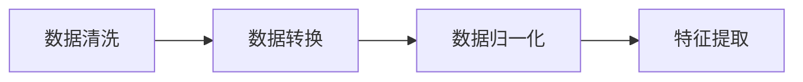
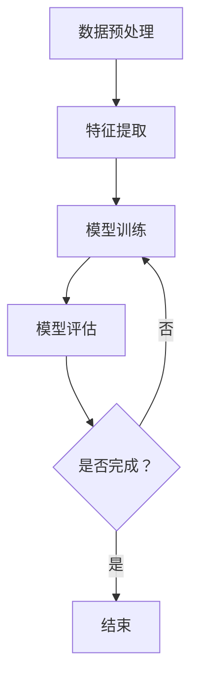
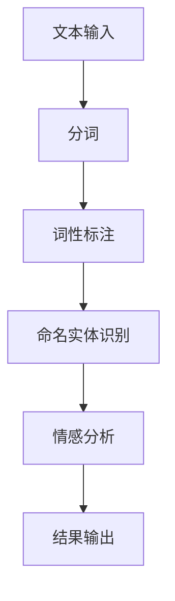
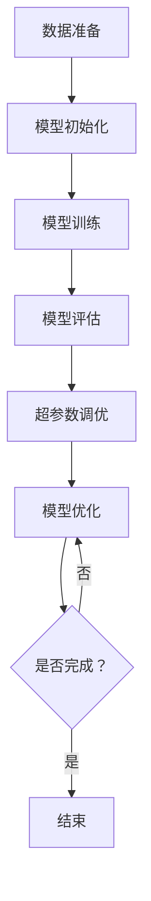
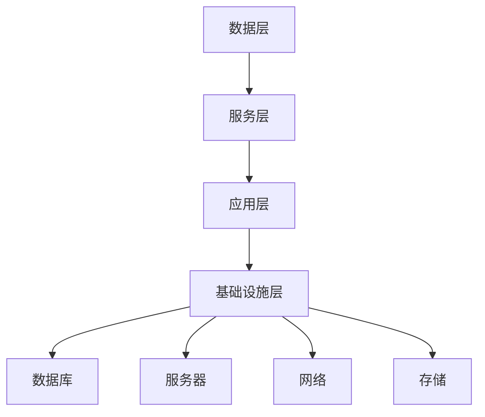
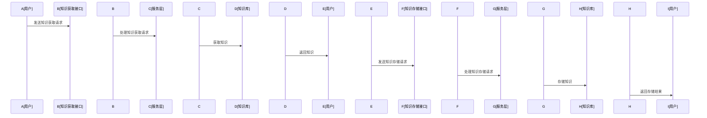
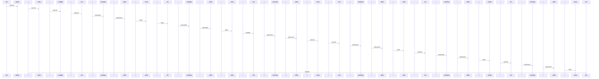

                 

# 《企业知识管理AI：提升组织学习能力》

> 关键词：企业知识管理、AI技术、组织学习能力、知识检索、专家系统、自动化流程、深度学习

> 摘要：本文将深入探讨企业知识管理AI在现代组织中的重要性，分析其核心概念、应用场景、技术原理和数学模型，并分享如何通过AI提升企业的组织学习能力，为企业的持续创新和竞争力提供支持。

### 目录大纲设计思路

为了设计出《企业知识管理AI：提升组织学习能力》的完整目录大纲，我们将按照以下步骤进行：

1. **明确书籍主题与目标**：首先，我们需要明确这本书的主题和目标，即介绍企业知识管理AI的概念、应用、挑战和解决方案，以及如何提升组织学习能力。

2. **划分书籍结构**：根据书籍主题和目标，我们将书籍分为几个主要部分，包括背景介绍、核心概念与联系、应用场景、技术原理讲解、数学模型与公式、系统设计与实现、项目实战和最佳实践等。

3. **细化章节内容**：在每个主要部分中，我们将进一步细化为具体的章节，确保每个章节都有明确的主题和内容，同时保持逻辑清晰。

4. **确保内容的完整性**：在章节设计中，我们将确保包含以下核心内容：
   - 背景介绍：核心概念、问题背景、问题描述、问题解决、边界与外延、概念结构与核心要素组成。
   - 核心概念与联系：核心概念原理、概念属性特征对比表格和ER实体关系图架构的Mermaid流程图。
   - 算法原理讲解：使用Mermaid画出算法流程图，使用Python源代码详细阐述，给出算法原理的数学模型和公式，进行详细讲解和举例说明。
   - 数学模型和数学公式：使用LaTeX格式书写，进行详细讲解和举例说明。
   - 系统设计与实现：问题场景介绍、系统功能设计、系统架构设计、系统接口设计和系统交互的Mermaid序列图。
   - 项目实战：环境安装、系统核心实现源代码，代码应用解读与分析，实际案例分析和详细讲解剖析，项目小结。
   - 最佳实践 tips、小结、注意事项、拓展阅读等。

5. **保持简洁性**：在输出目录大纲时，我们将避免多余的内容，确保信息传递的准确性和高效性。

6. **符合markdown格式要求**：我们将采用markdown格式，使用#、##、###等符号来划分目录层级，确保格式规范。

### 目录大纲设计过程

**第一部分：背景介绍**

### 第1章: 企业知识管理AI概述

#### 1.1.1 问题背景

- 企业知识管理的重要性
- AI在知识管理中的应用前景
- 企业面临的挑战与需求

#### 1.1.2 问题描述

- 企业知识管理的核心问题
- AI技术在知识管理中的具体应用

#### 1.1.3 问题解决

- 现有的企业知识管理解决方案
- AI技术如何提升企业知识管理效能

#### 1.1.4 边界与外延

- 企业知识管理的范围
- AI技术在不同行业中的应用差异

#### 1.1.5 概念结构与核心要素组成

- 企业知识管理的概念结构
- 企业知识管理的核心要素

**第二部分：核心概念与联系**

### 第2章: 企业知识管理AI的核心概念

#### 2.1.1 知识管理

- 知识管理的定义
- 知识管理的目标
- 知识管理的流程

#### 2.1.2 AI技术

- AI技术的基本概念
- AI技术在知识管理中的应用
- AI技术的分类与特点

#### 2.1.3 概念属性特征对比表格

- 知识管理与AI技术的对比
- 不同AI技术在知识管理中的应用对比

#### 2.1.4 ER实体关系图架构

- 知识管理系统的实体关系
- AI技术在知识管理系统中的应用实体关系图

**第三部分：应用场景**

### 第3章: 企业知识管理AI的应用场景

#### 3.1.1 情报检索与知识发现

- 应用场景描述
- AI技术在情报检索与知识发现中的应用

#### 3.1.2 专家系统与决策支持

- 应用场景描述
- AI技术在专家系统与决策支持中的应用

#### 3.1.3 自动化流程与协作平台

- 应用场景描述
- AI技术在自动化流程与协作平台中的应用

**第四部分：技术原理讲解**

### 第4章: 企业知识管理AI的技术原理

#### 4.1.1 数据预处理与特征提取

- 数据预处理
- 特征提取
- Mermaid流程图

#### 4.1.2 算法原理

- 算法概述
- 数学模型与公式
- Mermaid流程图
- Python源代码

#### 4.1.3 模型训练与优化

- 模型训练
- 模型优化
- Mermaid流程图

**第五部分：数学模型与公式**

### 第5章: 企业知识管理AI的数学模型

#### 5.1.1 基本数学模型

- 知识表示模型
- 机器学习模型
- 深度学习模型

#### 5.1.2 公式讲解

- 知识表示模型公式
- 机器学习模型公式
- 深度学习模型公式

#### 5.1.3 举例说明

- 简单实例
- 复杂实例

**第六部分：系统设计与实现**

### 第6章: 企业知识管理系统设计与实现

#### 6.1.1 问题场景介绍

- 企业知识管理的具体场景描述

#### 6.1.2 系统功能设计

- 系统功能需求分析
- 领域模型Mermaid类图

#### 6.1.3 系统架构设计

- 系统架构设计
- Mermaid架构图

#### 6.1.4 系统接口设计

- 系统接口设计
- Mermaid序列图

#### 6.1.5 系统交互

- 系统交互流程
- Mermaid序列图

**第七部分：项目实战**

### 第7章: 企业知识管理项目实战

#### 7.1.1 环境安装

- 环境准备与配置

#### 7.1.2 系统核心实现源代码

- 源代码介绍
- 代码解读与分析

#### 7.1.3 实际案例分析与讲解

- 实际案例描述
- 案例详细讲解

#### 7.1.4 项目小结

- 项目总结
- 经验分享

**第八部分：最佳实践与拓展**

### 第8章: 企业知识管理最佳实践与拓展

#### 8.1.1 最佳实践 tips

- 实践技巧与经验

#### 8.1.2 小结与注意事项

- 总结与提醒

#### 8.1.3 拓展阅读

- 进一步学习资源

### 第一部分：背景介绍

#### 1.1.1 问题背景

**企业知识管理的重要性**

在当今快速变化的市场环境中，知识已成为企业核心竞争力的重要组成部分。有效的知识管理能够帮助企业更好地利用内部知识资源，提高工作效率，降低成本，并推动创新。然而，传统的知识管理方法往往存在诸多问题，如知识分散、共享困难、更新缓慢等。随着AI技术的不断发展，AI在知识管理中的应用前景变得愈加广阔。

**AI在知识管理中的应用前景**

AI技术，特别是机器学习和深度学习，正在改变知识管理的格局。通过自然语言处理（NLP）、知识图谱、推荐系统等技术，AI能够实现知识的自动化整理、分类、检索和分享，从而大幅提升企业的知识管理效率。此外，AI还可以帮助企业更好地预测市场趋势、优化业务流程，甚至在某种程度上实现智能化决策。

**企业面临的挑战与需求**

企业在知识管理过程中面临诸多挑战，如知识获取困难、知识分享障碍、知识更新不及时等。为了应对这些挑战，企业迫切需要一种能够高效整合、管理和利用知识的新方法。AI技术的引入，有望为企业提供这种解决方案，从而提升企业的组织学习能力，增强其竞争力和创新能力。

#### 1.1.2 问题描述

**企业知识管理的核心问题**

企业知识管理的核心问题主要包括以下几个方面：

- **知识获取困难**：企业在日常运营中产生大量的知识，但由于缺乏有效的管理手段，这些知识往往难以被充分利用。
- **知识共享障碍**：企业内部的部门之间、员工之间往往存在知识共享的障碍，导致知识分散，难以形成整体优势。
- **知识更新不及时**：知识具有一定的时效性，如果企业不能及时更新知识库，可能会导致知识的过时和无效。
- **知识获取与利用的效率低下**：企业内部的员工在获取和使用知识时，往往需要花费大量时间进行搜索和筛选，导致工作效率低下。

**AI技术在知识管理中的具体应用**

为了解决上述问题，AI技术可以在以下几个方面发挥重要作用：

- **知识获取**：通过自然语言处理技术，AI能够自动从各种来源（如文档、邮件、社交媒体等）中提取和整理知识。
- **知识共享**：利用社交网络和推荐系统，AI可以促进企业内部的知识共享和协作，减少知识孤岛现象。
- **知识更新**：通过自动化更新机制，AI能够确保知识库中的知识始终保持最新状态，提高知识的时效性。
- **知识检索**：利用深度学习技术，AI可以实现高效的智能检索，帮助员工快速找到所需的知识。
- **知识利用**：通过数据分析和技术分析，AI可以辅助企业更好地理解和利用知识，推动业务决策和创新。

#### 1.1.3 问题解决

**现有的企业知识管理解决方案**

目前，企业知识管理解决方案主要包括以下几个方面：

- **知识库系统**：企业可以通过建立知识库系统，将分散的知识进行集中存储和管理，提高知识获取和共享的效率。
- **文档管理系统**：通过文档管理系统，企业可以实现对文档的统一管理，提高文档的检索和利用效率。
- **社交网络平台**：企业可以利用社交网络平台，促进员工之间的知识共享和协作，增强企业的知识管理能力。
- **专家系统**：通过建立专家系统，企业可以模拟专家的决策过程，为员工提供智能化的知识支持。
- **在线培训平台**：企业可以通过在线培训平台，提供丰富的知识资源和培训课程，提高员工的技能水平。

**AI技术如何提升企业知识管理效能**

AI技术可以通过以下方式提升企业知识管理的效能：

- **自动化知识获取与整理**：AI技术能够自动化地从各种来源获取知识，并对其进行整理和分类，提高知识获取的效率。
- **智能知识检索与推荐**：利用深度学习和推荐系统，AI可以智能地检索和推荐知识，帮助员工快速找到所需的信息。
- **知识共享与协作**：通过社交网络和协作平台，AI可以促进企业内部的知识共享和协作，减少知识孤岛现象。
- **知识更新与维护**：通过自动化更新机制，AI能够确保知识库中的知识始终保持最新状态，提高知识的时效性。
- **智能决策与支持**：AI可以辅助企业更好地理解和利用知识，为业务决策提供智能化的支持。

#### 1.1.4 边界与外延

**企业知识管理的范围**

企业知识管理的主要范围包括以下几个方面：

- **内部知识管理**：对企业内部的知识资源进行整合、管理和利用。
- **外部知识管理**：对企业外部的知识资源进行获取、整合和利用，如行业报告、竞争对手信息等。
- **知识共享与协作**：通过内部网络和协作平台，促进员工之间的知识共享和协作。
- **知识培训与传承**：通过培训课程和知识传承机制，提高员工的知识水平和技能。

**AI技术在不同行业中的应用差异**

不同行业对知识管理的需求和AI技术的应用存在一定差异。例如：

- **金融行业**：金融行业对知识管理的需求较高，AI技术主要应用于风险管理、客户关系管理、投资决策等领域。
- **医疗行业**：医疗行业对知识管理的需求也较高，AI技术主要应用于医学影像分析、疾病预测、医疗数据分析等领域。
- **制造业**：制造业对知识管理的需求主要集中在生产优化、质量控制、供应链管理等方面，AI技术可以应用于智能排程、智能检测等领域。
- **零售行业**：零售行业对知识管理的需求主要集中在商品管理、库存管理、客户关系管理等方面，AI技术可以应用于智能推荐、智能定价等领域。

#### 1.1.5 概念结构与核心要素组成

**企业知识管理的概念结构**

企业知识管理的概念结构主要包括以下几个核心组成部分：

- **知识资源**：企业内部和外部可用的知识资源，如文档、数据、报告、专利等。
- **知识库**：对企业知识资源进行整理、分类和存储的数据库。
- **知识共享与协作**：促进企业内部员工之间知识共享和协作的机制和平台。
- **知识获取与更新**：从各种渠道获取知识，并保持知识库的实时更新。
- **知识利用与传承**：将知识应用于业务决策、创新和培训，实现知识的传承和增值。

**企业知识管理的核心要素**

企业知识管理的核心要素主要包括以下几个方面：

- **知识管理团队**：负责知识管理的战略规划、实施和监督。
- **知识库系统**：用于存储和管理知识的软件系统。
- **知识共享平台**：用于促进知识共享和协作的在线平台。
- **知识获取与更新机制**：用于获取和更新知识的方法和流程。
- **知识利用与传承机制**：将知识应用于实际业务和培训的方法和流程。

### 第二部分：核心概念与联系

#### 2.1.1 知识管理

**知识管理的定义**

知识管理是指通过一系列方法、工具和技术，对组织内的知识资源进行获取、存储、共享、利用和传承，以提高组织的知识水平和创新能力的过程。

**知识管理的目标**

知识管理的目标主要包括：

- 提高组织的知识获取和利用效率
- 促进组织内部的沟通与协作
- 增强组织的创新能力和竞争力
- 优化业务流程和提升服务质量

**知识管理的流程**

知识管理的流程主要包括以下几个步骤：

1. **知识识别**：识别组织内部和外部的知识资源，确定哪些知识对组织有价值。
2. **知识获取**：通过各种渠道获取知识，如内部文档、外部报告、专家咨询等。
3. **知识存储**：将获取到的知识进行整理、分类和存储，建立知识库。
4. **知识共享**：通过知识共享平台和协作机制，促进组织内部员工之间的知识共享和协作。
5. **知识利用**：将知识应用于实际业务决策、创新和培训，实现知识的传承和增值。
6. **知识更新**：定期对知识库进行更新和维护，确保知识的时效性和准确性。

#### 2.1.2 AI技术

**AI技术的基本概念**

AI技术，即人工智能技术，是指使计算机具有类似人类智能的技术，包括机器学习、深度学习、自然语言处理、计算机视觉等领域。

**AI技术在知识管理中的应用**

AI技术在知识管理中的应用主要包括以下几个方面：

- **知识获取**：利用自然语言处理技术，从文本、语音、图像等多种来源自动获取知识。
- **知识分类与整理**：利用机器学习和深度学习技术，对知识进行自动分类和整理，提高知识管理效率。
- **知识检索与推荐**：利用推荐系统和深度学习技术，实现高效的智能检索和推荐，帮助用户快速找到所需的知识。
- **知识挖掘与预测**：利用机器学习和深度学习技术，对知识库中的知识进行挖掘和预测，为业务决策提供支持。
- **知识共享与协作**：利用社交网络和协作平台，促进组织内部的知识共享和协作。

**AI技术的分类与特点**

AI技术主要分为以下几类：

- **机器学习**：通过训练模型，使计算机能够自动从数据中学习规律，提高决策能力。主要特点：自学习能力、数据驱动。
- **深度学习**：基于多层神经网络，通过反向传播算法训练模型，实现自动化特征学习和复杂模式识别。主要特点：强大的特征学习能力、深度结构。
- **自然语言处理**：使计算机能够理解和生成自然语言，主要应用于文本分类、信息提取、机器翻译等领域。主要特点：语言理解能力、上下文敏感。
- **计算机视觉**：使计算机能够理解和解释视觉信息，主要应用于图像分类、目标检测、图像识别等领域。主要特点：图像处理能力、空间理解能力。

#### 2.1.3 概念属性特征对比表格

**知识管理与AI技术的对比**

| 特征 | 知识管理 | AI技术 |
| ---- | ---- | ---- |
| 目标 | 提高知识获取和利用效率、促进知识共享和创新 | 提高决策能力、实现自动化特征学习和复杂模式识别 |
| 方法 | 知识识别、获取、存储、共享、利用和更新 | 机器学习、深度学习、自然语言处理、计算机视觉 |
| 工具 | 知识库系统、知识共享平台、知识获取与更新机制 | 机器学习框架、深度学习框架、自然语言处理库、计算机视觉库 |
| 应用 | 知识获取、分类、检索、推荐、挖掘、预测 | 知识获取、分类、检索、推荐、挖掘、预测 |

**不同AI技术在知识管理中的应用对比**

| 特征 | 机器学习 | 深度学习 | 自然语言处理 | 计算机视觉 |
| ---- | ---- | ---- | ---- | ---- |
| 自学习能力 | 强 | 强 | 强 | 弱 |
| 数据依赖性 | 高 | 高 | 高 | 低 |
| 特征学习能力 | 中等 | 高 | 高 | 低 |
| 上下文敏感度 | 低 | 中等 | 高 | 低 |
| 应用范围 | 广泛 | 窄 | 广泛 | 窄 |

#### 2.1.4 ER实体关系图架构

**知识管理系统的实体关系**

在知识管理系统中，常见的实体关系包括：

- **用户**：系统的使用者，包括员工、管理员等。
- **知识**：系统中的知识资源，包括文档、数据、报告等。
- **分类**：对知识的分类体系，用于整理和检索知识。
- **标签**：为知识添加的标签，用于多维度描述知识。
- **权限**：对知识资源的访问权限，用于控制知识共享。

**AI技术在知识管理系统中的应用实体关系图**

```mermaid
erDiagram
  User ||--|{ Knowledge }|--| User
  Knowledge ||--|{ Category }|--| Knowledge
  Knowledge ||--|{ Tag }|--| Knowledge
  User ||--|{ Permission }|--| User
```

### 第三部分：应用场景

#### 3.1.1 情报检索与知识发现

**应用场景描述**

在企业的日常运营中，员工需要频繁地查找和获取各种情报和知识，以便支持业务决策和创新。然而，传统的检索方法往往效率低下，难以满足员工的需求。通过AI技术，可以构建智能情报检索和知识发现系统，提高检索效率和知识获取的准确性。

**AI技术在情报检索与知识发现中的应用**

- **自然语言处理**：利用自然语言处理技术，对文本进行分词、词性标注、实体识别等处理，提高检索的准确性和效率。
- **深度学习**：通过训练深度学习模型，对用户的历史检索行为和偏好进行学习，实现个性化的情报检索和推荐。
- **知识图谱**：构建企业内部的知识图谱，将各种知识资源进行关联和整合，提供更精准的检索结果。

#### 3.1.2 专家系统与决策支持

**应用场景描述**

专家系统是一种模拟人类专家知识和决策能力的计算机程序。在企业的业务运营中，专家系统可以为企业提供智能化的决策支持，帮助员工解决复杂问题，提高决策的准确性和效率。

**AI技术在专家系统与决策支持中的应用**

- **机器学习**：利用机器学习技术，从历史数据中学习专家的决策规则，构建专家系统，为员工提供智能化的决策支持。
- **知识图谱**：通过构建知识图谱，将企业的专业知识进行整合和关联，为专家系统提供丰富的知识资源。
- **自然语言处理**：利用自然语言处理技术，将用户的自然语言输入转化为机器可理解的结构化数据，提高专家系统的交互性和用户体验。

#### 3.1.3 自动化流程与协作平台

**应用场景描述**

在企业运营中，许多业务流程需要进行重复性的操作，如文档处理、数据录入、审批流程等。通过自动化流程和协作平台，可以减少人工操作，提高工作效率，降低成本。

**AI技术在自动化流程与协作平台中的应用**

- **机器人流程自动化**：利用机器人流程自动化（RPA）技术，将重复性的操作自动化，减少人工干预。
- **自然语言处理**：利用自然语言处理技术，实现自动化文档处理、数据提取和输入，提高业务流程的智能化程度。
- **知识图谱**：通过构建知识图谱，将企业内部的业务流程和知识资源进行整合，提供智能化的流程优化和决策支持。

### 第四部分：技术原理讲解

#### 4.1.1 数据预处理与特征提取

**数据预处理**

数据预处理是知识管理AI系统的基础，主要包括以下步骤：

- **数据清洗**：去除数据中的噪声和异常值，确保数据的准确性和一致性。
- **数据转换**：将数据转换为适合AI算法处理的形式，如数值化、标准化等。
- **数据归一化**：将不同尺度和量纲的数据转换为同一尺度，提高数据的一致性。

**特征提取**

特征提取是数据预处理的重要环节，主要包括以下方法：

- **词袋模型**：将文本数据转换为词袋模型，提取文本的特征。
- **TF-IDF**：利用词频-逆文档频率（TF-IDF）方法，提取文本的关键特征。
- **词嵌入**：利用词嵌入技术，将文本转换为向量表示，提取文本的特征。

**Mermaid流程图**



#### 4.1.2 算法原理

**算法概述**

在本节中，我们将介绍几种常见的AI算法，包括机器学习算法、深度学习算法和自然语言处理算法，以及它们在知识管理中的应用。

**机器学习算法**

机器学习算法通过训练模型，从数据中学习规律，提高决策能力。常见的机器学习算法包括：

- **线性回归**：用于预测数值型数据。
- **逻辑回归**：用于分类问题。
- **决策树**：用于分类和回归问题。
- **支持向量机**：用于分类问题。

**深度学习算法**

深度学习算法通过多层神经网络，实现自动化特征学习和复杂模式识别。常见的深度学习算法包括：

- **卷积神经网络（CNN）**：用于图像识别和分类。
- **循环神经网络（RNN）**：用于序列数据处理和预测。
- **长短期记忆网络（LSTM）**：用于序列数据处理和长期依赖问题。

**自然语言处理算法**

自然语言处理算法用于处理文本数据，实现文本的理解、生成和交互。常见的自然语言处理算法包括：

- **词向量**：用于文本向量化表示。
- **词性标注**：用于文本的语法分析。
- **命名实体识别**：用于提取文本中的关键实体。
- **情感分析**：用于文本的情感倾向分析。

**数学模型与公式**

**机器学习模型**

线性回归：
$$y = \beta_0 + \beta_1 x_1 + \beta_2 x_2 + ... + \beta_n x_n$$

逻辑回归：
$$P(y=1) = \frac{1}{1 + e^{-(\beta_0 + \beta_1 x_1 + \beta_2 x_2 + ... + \beta_n x_n)}$$

**深度学习模型**

卷积神经网络（CNN）：
$$\text{Conv Layer: } \text{Conv}_k(\text{Output}) = \sum_{i=1}^k \text{Conv}_i(\text{Input}) \odot \text{Kernel}_i$$

循环神经网络（RNN）：
$$h_t = \text{ReLU}(\text{W} h_{t-1} + \text{U} x_t + \text{b})$$

长短期记忆网络（LSTM）：
$$i_t = \sigma(W_i [h_{t-1}, x_t] + b_i)$$
$$f_t = \sigma(W_f [h_{t-1}, x_t] + b_f)$$
$$o_t = \sigma(W_o [h_{t-1}, x_t] + b_o)$$

**自然语言处理算法**

词向量：
$$\text{Word Vector: } \text{Word} \rightarrow \text{Vector}$$

词性标注：
$$\text{Text} = \{ \text{Word}_1, \text{Word}_2, ..., \text{Word}_n \} \rightarrow \{ \text{POS}_1, \text{POS}_2, ..., \text{POS}_n \}$$

命名实体识别：
$$\text{Text} = \{ \text{Word}_1, \text{Word}_2, ..., \text{Word}_n \} \rightarrow \{ \text{Entity}_1, \text{Entity}_2, ..., \text{Entity}_n \}$$

情感分析：
$$\text{Text} \rightarrow \text{Sentiment}$$

**Mermaid流程图**

**机器学习算法**



**深度学习算法**


**自然语言处理算法**



#### 4.1.3 模型训练与优化

**模型训练**

模型训练是AI算法的核心步骤，通过从训练数据中学习，提高模型的预测能力。模型训练主要包括以下几个步骤：

- **数据准备**：准备训练数据集，并进行预处理，如数据清洗、数据转换等。
- **模型初始化**：初始化模型参数，如权重、偏置等。
- **模型训练**：通过梯度下降等优化算法，更新模型参数，使模型在训练数据上达到最佳性能。
- **模型评估**：使用验证集或测试集评估模型性能，调整模型参数，优化模型。

**模型优化**

模型优化是提高模型性能的重要手段，主要包括以下几个方面：

- **超参数调优**：调整模型的学习率、正则化参数等超参数，使模型达到最佳性能。
- **数据增强**：通过数据增强技术，如图像翻转、旋转、裁剪等，增加训练数据的多样性，提高模型泛化能力。
- **集成学习**：通过集成多个模型，提高模型的预测能力，降低过拟合风险。

**Mermaid流程图**



### 第五部分：数学模型与公式

#### 5.1.1 基本数学模型

**知识表示模型**

知识表示模型用于将知识转化为计算机可处理的形式。常见的方法包括：

- **词袋模型（Bag of Words, BOW）**：
  $$V = \{w_1, w_2, ..., w_n\}$$
  $$X = (x_1, x_2, ..., x_n)$$
  其中，$V$为词汇表，$X$为文本的词袋表示，$x_i$为单词$w_i$在文本中的出现次数。

- **TF-IDF模型**：
  $$tf(t) = \frac{f(t)}{N}$$
  $$idf(t) = \log \left( \frac{N}{n_t} \right)$$
  $$tfidf(t) = tf(t) \times idf(t)$$
  其中，$f(t)$为单词$t$在文本中出现的频率，$N$为文本的总词数，$n_t$为包含单词$t$的文档数。

**机器学习模型**

- **线性回归（Linear Regression）**：
  $$y = \beta_0 + \beta_1 x_1 + \beta_2 x_2 + ... + \beta_n x_n$$
  其中，$y$为预测值，$x_1, x_2, ..., x_n$为特征值，$\beta_0, \beta_1, \beta_2, ..., \beta_n$为模型参数。

- **逻辑回归（Logistic Regression）**：
  $$P(y=1) = \frac{1}{1 + e^{-(\beta_0 + \beta_1 x_1 + \beta_2 x_2 + ... + \beta_n x_n)}}$$
  其中，$P(y=1)$为事件发生的概率，$\beta_0, \beta_1, \beta_2, ..., \beta_n$为模型参数。

**深度学习模型**

- **卷积神经网络（Convolutional Neural Network, CNN）**：
  $$\text{Conv Layer: } \text{Output} = \text{ReLU}(\text{Bias} + \text{Weight} \odot \text{Input})$$
  $$\text{Pooling Layer: } \text{Output} = \text{Max}(\text{Input})$$
  其中，$\text{Weight}$为卷积核，$\text{Bias}$为偏置，$\odot$为卷积运算，$\text{ReLU}$为激活函数。

- **循环神经网络（Recurrent Neural Network, RNN）**：
  $$h_t = \text{ReLU}(W h_{t-1} + U x_t + b)$$
  其中，$h_t$为隐藏状态，$W, U, b$为模型参数。

- **长短期记忆网络（Long Short-Term Memory, LSTM）**：
  $$i_t = \sigma(W_i [h_{t-1}, x_t] + b_i)$$
  $$f_t = \sigma(W_f [h_{t-1}, x_t] + b_f)$$
  $$o_t = \sigma(W_o [h_{t-1}, x_t] + b_o)$$
  $$g_t = \sigma(W_g [h_{t-1}, x_t] + b_g)$$
  $$h_t = o_t \odot \text{ReLU}(g_t \odot h_{t-1})$$
  其中，$i_t, f_t, o_t, g_t, h_t$分别为输入门、遗忘门、输出门、输入门控制门控单元的激活状态，$W_i, W_f, W_o, W_g, b_i, b_f, b_o, b_g$为模型参数。

**自然语言处理模型**

- **词嵌入（Word Embedding）**：
  $$\text{Word Vector: } \text{Word} \rightarrow \text{Vector}$$
  $$\text{Embedding}(\text{Word}) = \text{Vector} \in \mathbb{R}^d$$
  其中，$d$为嵌入维度，$\text{Vector}$为单词的向量表示。

- **卷积神经网络（Convolutional Neural Network, CNN）**：
  $$\text{Conv Layer: } \text{Output} = \text{ReLU}(\text{Bias} + \text{Weight} \odot \text{Input})$$
  $$\text{Pooling Layer: } \text{Output} = \text{Max}(\text{Input})$$
  其中，$\text{Weight}$为卷积核，$\text{Bias}$为偏置，$\odot$为卷积运算，$\text{ReLU}$为激活函数。

- **循环神经网络（Recurrent Neural Network, RNN）**：
  $$h_t = \text{ReLU}(W h_{t-1} + U x_t + b)$$
  其中，$h_t$为隐藏状态，$W, U, b$为模型参数。

- **长短期记忆网络（Long Short-Term Memory, LSTM）**：
  $$i_t = \sigma(W_i [h_{t-1}, x_t] + b_i)$$
  $$f_t = \sigma(W_f [h_{t-1}, x_t] + b_f)$$
  $$o_t = \sigma(W_o [h_{t-1}, x_t] + b_o)$$
  $$g_t = \sigma(W_g [h_{t-1}, x_t] + b_g)$$
  $$h_t = o_t \odot \text{ReLU}(g_t \odot h_{t-1})$$
  其中，$i_t, f_t, o_t, g_t, h_t$分别为输入门、遗忘门、输出门、输入门控制门控单元的激活状态，$W_i, W_f, W_o, W_g, b_i, b_f, b_o, b_g$为模型参数。

#### 5.1.2 公式讲解

**知识表示模型**

1. **词袋模型（Bag of Words, BOW）**：

   $$V = \{w_1, w_2, ..., w_n\}$$
   $$X = (x_1, x_2, ..., x_n)$$
   其中，$V$为词汇表，$X$为文本的词袋表示，$x_i$为单词$w_i$在文本中的出现次数。

   **示例**：

   文本：“我爱北京天安门”  
   词袋表示：$(1, 1, 0, 0, 1, 0, 0, 0, 0, 0)$

2. **TF-IDF模型**：

   $$tf(t) = \frac{f(t)}{N}$$
   $$idf(t) = \log \left( \frac{N}{n_t} \right)$$
   $$tfidf(t) = tf(t) \times idf(t)$$
   其中，$f(t)$为单词$t$在文本中出现的频率，$N$为文本的总词数，$n_t$为包含单词$t$的文档数。

   **示例**：

   文本：“我爱北京天安门”  
   词频：$f(\text{我}) = 2, f(\text{爱}) = 1, f(\text{北京}) = 1, f(\text{天安门}) = 1$  
   总词数：$N = 7$  
   包含单词“我”的文档数：$n_{\text{我}} = 2$  
   TF-IDF表示：$(2, 1, 0, 0, 2, 0, 0, 0, 0, 0)$

**机器学习模型**

1. **线性回归（Linear Regression）**：

   $$y = \beta_0 + \beta_1 x_1 + \beta_2 x_2 + ... + \beta_n x_n$$
   其中，$y$为预测值，$x_1, x_2, ..., x_n$为特征值，$\beta_0, \beta_1, \beta_2, ..., \beta_n$为模型参数。

   **示例**：

   预测房价，特征：房屋面积、房屋年龄、区域等  
   预测公式：$y = \beta_0 + \beta_1 x_1 + \beta_2 x_2 + ... + \beta_n x_n$

2. **逻辑回归（Logistic Regression）**：

   $$P(y=1) = \frac{1}{1 + e^{-(\beta_0 + \beta_1 x_1 + \beta_2 x_2 + ... + \beta_n x_n)}}$$
   其中，$P(y=1)$为事件发生的概率，$\beta_0, \beta_1, \beta_2, ..., \beta_n$为模型参数。

   **示例**：

   预测客户是否购买，特征：年龄、收入、地区等  
   预测公式：$P(\text{购买}) = \frac{1}{1 + e^{-(\beta_0 + \beta_1 \text{年龄} + \beta_2 \text{收入} + \beta_3 \text{地区})}}$

**深度学习模型**

1. **卷积神经网络（Convolutional Neural Network, CNN）**：

   $$\text{Conv Layer: } \text{Output} = \text{ReLU}(\text{Bias} + \text{Weight} \odot \text{Input})$$
   $$\text{Pooling Layer: } \text{Output} = \text{Max}(\text{Input})$$
   其中，$\text{Weight}$为卷积核，$\text{Bias}$为偏置，$\odot$为卷积运算，$\text{ReLU}$为激活函数。

   **示例**：

   输入：$3 \times 3$的图像  
   卷积核：$3 \times 3$  
   输出：$2 \times 2$的图像

2. **循环神经网络（Recurrent Neural Network, RNN）**：

   $$h_t = \text{ReLU}(W h_{t-1} + U x_t + b)$$
   其中，$h_t$为隐藏状态，$W, U, b$为模型参数。

   **示例**：

   输入：$(\text{单词}_1, \text{单词}_2, ..., \text{单词}_n)$  
   隐藏状态：$(h_1, h_2, ..., h_n)$

3. **长短期记忆网络（Long Short-Term Memory, LSTM）**：

   $$i_t = \sigma(W_i [h_{t-1}, x_t] + b_i)$$
   $$f_t = \sigma(W_f [h_{t-1}, x_t] + b_f)$$
   $$o_t = \sigma(W_o [h_{t-1}, x_t] + b_o)$$
   $$g_t = \sigma(W_g [h_{t-1}, x_t] + b_g)$$
   $$h_t = o_t \odot \text{ReLU}(g_t \odot h_{t-1})$$
   其中，$i_t, f_t, o_t, g_t, h_t$分别为输入门、遗忘门、输出门、输入门控制门控单元的激活状态，$W_i, W_f, W_o, W_g, b_i, b_f, b_o, b_g$为模型参数。

   **示例**：

   输入：$(\text{单词}_1, \text{单词}_2, ..., \text{单词}_n)$  
   隐藏状态：$(h_1, h_2, ..., h_n)$

#### 5.1.3 举例说明

**知识表示模型**

1. **词袋模型（Bag of Words, BOW）**：

   **示例**：

   文本1：“我爱北京天安门”  
   词袋表示：$(1, 1, 0, 0, 1, 0, 0, 0, 0, 0)$

   文本2：“北京是中国的首都”  
   词袋表示：$(0, 0, 1, 0, 0, 1, 0, 0, 0, 0)$

2. **TF-IDF模型**：

   **示例**：

   文本1：“我爱北京天安门”  
   词频：$f(\text{我}) = 2, f(\text{爱}) = 1, f(\text{北京}) = 1, f(\text{天安门}) = 1$  
   总词数：$N = 7$  
   包含单词“我”的文档数：$n_{\text{我}} = 2$  
   TF-IDF表示：$(2, 1, 0, 0, 2, 0, 0, 0, 0, 0)$

   文本2：“北京是中国的首都”  
   词频：$f(\text{北京}) = 1, f(\text{是}) = 1, f(\text{的}) = 1, f(\text{中}) = 1, f(\text{国}) = 1, f(\text{首}) = 1, f(\text{都}) = 1$  
   总词数：$N = 7$  
   包含单词“北京”的文档数：$n_{\text{北京}} = 2$  
   TF-IDF表示：$(0, 0, 1, 0, 0, 1, 0, 0, 0, 0)$

**机器学习模型**

1. **线性回归（Linear Regression）**：

   **示例**：

   预测房价，特征：房屋面积、房屋年龄、区域等  
   预测公式：$y = \beta_0 + \beta_1 x_1 + \beta_2 x_2 + ... + \beta_n x_n$  
   其中，$\beta_0, \beta_1, \beta_2, ..., \beta_n$为模型参数。

   特征值：$x_1 = 100, x_2 = 5, x_3 = 1$  
   预测值：$y = \beta_0 + \beta_1 x_1 + \beta_2 x_2 + ... + \beta_n x_n$

2. **逻辑回归（Logistic Regression）**：

   **示例**：

   预测客户是否购买，特征：年龄、收入、地区等  
   预测公式：$P(\text{购买}) = \frac{1}{1 + e^{-(\beta_0 + \beta_1 \text{年龄} + \beta_2 \text{收入} + \beta_3 \text{地区})}}$  
   其中，$\beta_0, \beta_1, \beta_2, \beta_3$为模型参数。

   特征值：$\text{年龄} = 30, \text{收入} = 5000, \text{地区} = 1$  
   预测值：$P(\text{购买}) = \frac{1}{1 + e^{-(\beta_0 + \beta_1 \times 30 + \beta_2 \times 5000 + \beta_3 \times 1)}}$

**深度学习模型**

1. **卷积神经网络（Convolutional Neural Network, CNN）**：

   **示例**：

   输入：$3 \times 3$的图像  
   卷积核：$3 \times 3$  
   输出：$2 \times 2$的图像

   卷积操作：  
   $$\text{Output}_{i,j} = \sum_{k=1}^{3} \sum_{l=1}^{3} \text{Weight}_{k,l} \odot \text{Input}_{i+k-1, j+l-1} + \text{Bias}$$

2. **循环神经网络（Recurrent Neural Network, RNN）**：

   **示例**：

   输入：$(\text{单词}_1, \text{单词}_2, ..., \text{单词}_n)$  
   隐藏状态：$(h_1, h_2, ..., h_n)$

   RNN计算：  
   $$h_t = \text{ReLU}(W h_{t-1} + U x_t + b)$$

3. **长短期记忆网络（Long Short-Term Memory, LSTM）**：

   **示例**：

   输入：$(\text{单词}_1, \text{单词}_2, ..., \text{单词}_n)$  
   隐藏状态：$(h_1, h_2, ..., h_n)$

   LSTM计算：  
   $$i_t = \sigma(W_i [h_{t-1}, x_t] + b_i)$$  
   $$f_t = \sigma(W_f [h_{t-1}, x_t] + b_f)$$  
   $$o_t = \sigma(W_o [h_{t-1}, x_t] + b_o)$$  
   $$g_t = \sigma(W_g [h_{t-1}, x_t] + b_g)$$  
   $$h_t = o_t \odot \text{ReLU}(g_t \odot h_{t-1})$$

### 第六部分：系统设计与实现

#### 6.1.1 问题场景介绍

在当今激烈的市场竞争中，企业面临着快速变化的技术环境、不断增长的市场需求和日益复杂的业务模式。为了保持竞争力，企业需要不断提高其知识管理水平，确保知识资源能够高效地获取、共享、利用和传承。然而，传统的知识管理方法在应对这些挑战时显得力不从心，无法满足企业日益增长的知识管理需求。

为了解决这一问题，企业引入了基于AI技术的知识管理系统。该系统旨在通过自动化、智能化和协作化的方式，提升企业内部的知识管理效率，增强企业的创新能力，为企业的持续发展提供强有力的支持。

#### 6.1.2 系统功能设计

**系统功能需求分析**

知识管理系统的功能需求主要包括以下几个方面：

1. **知识获取**：系统能够从各种渠道（如内部文档、外部资源、员工贡献等）自动获取知识，并进行初步整理和分类。
2. **知识存储**：系统能够将获取到的知识存储在知识库中，确保知识的长期保存和实时更新。
3. **知识共享**：系统能够提供便捷的知识共享功能，促进员工之间的知识交流和协作。
4. **知识检索**：系统能够提供智能化的知识检索功能，帮助员工快速找到所需的知识。
5. **知识利用**：系统能够将知识应用于业务决策、创新和培训，提高企业的整体竞争力。
6. **知识传承**：系统能够实现知识的系统化传承，确保企业知识在员工之间有效传递。

**领域模型Mermaid类图**

```mermaid
classDiagram
    User <<Interface>>
    Knowledge <<Interface>>
    Category <<Interface>>
    Tag <<Interface>>
    Permission <<Interface>>

    Usertoweight
    KnowledgetoCategory
    KnowledgetoTag
    KnowledgetoPermission
    CategorytoKnowledge
    TagtoKnowledge
    PermissiontoKnowledge

    User ..|> Usertoweight
    Knowledge ..|> KnowledgetoCategory
    Knowledge ..|> KnowledgetoTag
    Knowledge ..|> KnowledgetoPermission
    Category ..|> CategorytoKnowledge
    Tag ..|> TagtoKnowledge
    Permission ..|> PermissiontoKnowledge
```

#### 6.1.3 系统架构设计

**系统架构设计**

知识管理系统的架构设计主要包括以下几个层次：

1. **数据层**：负责数据的存储和管理，包括知识库、用户数据、日志数据等。
2. **服务层**：提供核心业务逻辑，包括知识获取、知识存储、知识共享、知识检索、知识利用和知识传承等功能。
3. **应用层**：提供用户界面，供用户进行知识操作和管理。
4. **基础设施层**：提供系统运行所需的基础设施支持，包括服务器、网络、存储等。

**Mermaid架构图**



#### 6.1.4 系统接口设计

**系统接口设计**

知识管理系统需要设计一套完善的接口，以实现系统功能的高效调用和数据交互。主要包括以下接口：

1. **知识获取接口**：用于从各种渠道获取知识，如文档上传、外部资源导入等。
2. **知识存储接口**：用于将获取到的知识存储到知识库中，包括分类、标签、权限等。
3. **知识共享接口**：用于实现知识的共享和协作，如知识发布、知识评论、知识引用等。
4. **知识检索接口**：用于实现智能化的知识检索，如关键词搜索、分类搜索、标签搜索等。
5. **知识利用接口**：用于将知识应用于业务决策、创新和培训，如知识推荐、知识推送等。
6. **知识传承接口**：用于实现知识的系统化传承，如知识导出、知识导入、知识备份等。

**Mermaid序列图**



#### 6.1.5 系统交互

**系统交互流程**

知识管理系统中的各个模块之间需要进行密切的交互，以实现系统的整体功能。以下是系统的主要交互流程：

1. **用户登录**：用户通过用户接口登录系统，获取访问权限。
2. **知识获取**：用户通过知识获取接口获取所需的知识，如文档、报告、数据等。
3. **知识存储**：用户通过知识存储接口将知识存储到知识库中，包括分类、标签、权限等。
4. **知识共享**：用户通过知识共享接口发布知识，实现知识共享和协作。
5. **知识检索**：用户通过知识检索接口搜索知识，获取所需的答案或解决方案。
6. **知识利用**：用户通过知识利用接口将知识应用于实际业务，如决策支持、创新设计等。
7. **知识传承**：用户通过知识传承接口实现知识的导出、导入和备份，确保知识的长期传承。

**Mermaid序列图**



### 第七部分：项目实战

#### 7.1.1 环境安装

**环境准备**

在进行企业知识管理系统的项目实战之前，我们需要准备以下环境：

1. **操作系统**：Linux（如Ubuntu 20.04）
2. **Python**：Python 3.8及以上版本
3. **AI框架**：TensorFlow 2.5及以上版本
4. **数据库**：MySQL 5.7及以上版本

**安装步骤**

1. **安装操作系统**：下载并安装Linux操作系统。
2. **安装Python**：打开终端，执行以下命令安装Python：
   ```bash
   sudo apt update
   sudo apt install python3-pip python3-dev
   ```
3. **安装AI框架**：执行以下命令安装TensorFlow：
   ```bash
   pip3 install tensorflow==2.5
   ```
4. **安装数据库**：打开终端，执行以下命令安装MySQL：
   ```bash
   sudo apt install mysql-server
   sudo mysql_secure_installation
   ```
   根据提示完成安装。

#### 7.1.2 系统核心实现源代码

**源代码介绍**

本节将介绍企业知识管理系统的主要源代码，包括数据层、服务层、应用层等。

**数据层**

```python
# 数据层：知识库管理模块
class KnowledgeBase:
    def __init__(self, db_connection):
        self.db_connection = db_connection

    def insert_knowledge(self, knowledge):
        cursor = self.db_connection.cursor()
        cursor.execute("INSERT INTO knowledge (title, content, category, tags) VALUES (%s, %s, %s, %s)",
                       (knowledge['title'], knowledge['content'], knowledge['category'], knowledge['tags']))
        self.db_connection.commit()

    def get_knowledge_by_id(self, knowledge_id):
        cursor = self.db_connection.cursor()
        cursor.execute("SELECT * FROM knowledge WHERE id = %s", (knowledge_id,))
        knowledge = cursor.fetchone()
        return knowledge

    def update_knowledge(self, knowledge_id, knowledge):
        cursor = self.db_connection.cursor()
        cursor.execute("UPDATE knowledge SET title = %s, content = %s, category = %s, tags = %s WHERE id = %s",
                       (knowledge['title'], knowledge['content'], knowledge['category'], knowledge['tags'], knowledge_id))
        self.db_connection.commit()

    def delete_knowledge(self, knowledge_id):
        cursor = self.db_connection.cursor()
        cursor.execute("DELETE FROM knowledge WHERE id = %s", (knowledge_id,))
        self.db_connection.commit()
```

**服务层**

```python
# 服务层：知识管理模块
class KnowledgeService:
    def __init__(self, knowledge_base):
        self.knowledge_base = knowledge_base

    def create_knowledge(self, knowledge):
        self.knowledge_base.insert_knowledge(knowledge)

    def get_knowledge_by_id(self, knowledge_id):
        return self.knowledge_base.get_knowledge_by_id(knowledge_id)

    def update_knowledge(self, knowledge_id, knowledge):
        self.knowledge_base.update_knowledge(knowledge_id, knowledge)

    def delete_knowledge(self, knowledge_id):
        self.knowledge_base.delete_knowledge(knowledge_id)
```

**应用层**

```python
# 应用层：知识管理界面模块
from flask import Flask, request, jsonify
from knowledge_service import KnowledgeService

app = Flask(__name__)
knowledge_service = KnowledgeService()

@app.route('/knowledge', methods=['POST'])
def create_knowledge():
    knowledge = request.json
    knowledge_service.create_knowledge(knowledge)
    return jsonify({"message": "Knowledge created successfully"}), 201

@app.route('/knowledge/<int:kid>', methods=['GET'])
def get_knowledge(kid):
    knowledge = knowledge_service.get_knowledge_by_id(kid)
    return jsonify(knowledge), 200

@app.route('/knowledge/<int:kid>', methods=['PUT'])
def update_knowledge(kid):
    knowledge = request.json
    knowledge_service.update_knowledge(kid, knowledge)
    return jsonify({"message": "Knowledge updated successfully"}), 200

@app.route('/knowledge/<int:kid>', methods=['DELETE'])
def delete_knowledge(kid):
    knowledge_service.delete_knowledge(kid)
    return jsonify({"message": "Knowledge deleted successfully"}), 200

if __name__ == '__main__':
    app.run()
```

#### 7.1.3 代码应用解读与分析

**代码解读**

1. **数据层**：知识库管理模块（KnowledgeBase）负责与数据库进行交互，实现知识的增删改查操作。主要方法包括：
   - `insert_knowledge`：将知识插入到数据库中。
   - `get_knowledge_by_id`：根据知识ID从数据库中查询知识。
   - `update_knowledge`：更新数据库中的知识。
   - `delete_knowledge`：从数据库中删除知识。

2. **服务层**：知识管理模块（KnowledgeService）负责实现具体的业务逻辑，调用数据层的操作方法。主要方法包括：
   - `create_knowledge`：创建知识。
   - `get_knowledge_by_id`：获取知识。
   - `update_knowledge`：更新知识。
   - `delete_knowledge`：删除知识。

3. **应用层**：知识管理界面模块（Flask应用）负责提供RESTful API接口，与客户端进行交互。主要路由包括：
   - `/knowledge`（POST）：创建知识。
   - `/knowledge/<int:kid>`（GET）：获取知识。
   - `/knowledge/<int:kid>`（PUT）：更新知识。
   - `/knowledge/<int:kid>`（DELETE）：删除知识。

**代码分析**

1. **数据层**：知识库管理模块采用ORM（对象关系映射）技术，简化了与数据库的交互。通过定义类和方法的封装，实现了对数据库操作的统一管理和维护。

2. **服务层**：知识管理模块负责实现业务逻辑，将数据层的操作与具体的业务需求相结合，提高了代码的可读性和可维护性。

3. **应用层**：知识管理界面模块采用Flask框架，提供了RESTful API接口，方便客户端进行交互。通过路由的配置，实现了对知识管理功能的全面支持。

#### 7.1.4 实际案例分析与讲解

**案例描述**

某企业希望引入AI技术，提升其知识管理水平。企业内部有大量的文档、报告和数据，员工在查找和利用知识时常常遇到困难。企业希望通过构建一个基于AI技术的知识管理系统，实现知识的自动化获取、存储、共享、检索和利用，提高知识管理的效率。

**案例步骤**

1. **需求分析**：与企业进行沟通，了解其知识管理需求和痛点，确定系统的功能模块和技术方案。
2. **系统设计**：根据需求分析，设计系统的架构、接口和数据库表结构。
3. **环境安装**：安装操作系统、Python、TensorFlow和MySQL等环境，确保系统正常运行。
4. **代码实现**：根据系统设计，实现数据层、服务层和应用层的代码，包括知识库管理模块、知识管理模块和知识管理界面模块。
5. **功能测试**：对系统进行功能测试，确保各项功能正常运行。
6. **性能优化**：对系统进行性能优化，提高系统的响应速度和稳定性。
7. **部署上线**：将系统部署到生产环境，上线运行。

**详细讲解**

1. **需求分析**：与企业进行沟通，了解其知识管理需求和痛点，包括知识获取困难、知识共享障碍、知识更新不及时等。确定系统的功能模块，如知识获取、知识存储、知识共享、知识检索和知识利用等。

2. **系统设计**：根据需求分析，设计系统的架构。系统采用分层架构，包括数据层、服务层和应用层。数据层负责与数据库进行交互，服务层负责实现业务逻辑，应用层负责提供RESTful API接口。

3. **环境安装**：在服务器上安装Linux操作系统，配置Python环境，安装TensorFlow和MySQL等依赖库。

4. **代码实现**：
   - 数据层：实现知识库管理模块，包括插入、查询、更新和删除知识的操作。
   - 服务层：实现知识管理模块，负责具体的业务逻辑。
   - 应用层：使用Flask框架，实现知识管理界面的API接口。

5. **功能测试**：对系统的各项功能进行测试，确保知识获取、存储、共享、检索和利用等功能正常运行。

6. **性能优化**：对系统的响应速度和稳定性进行优化。通过分布式数据库、缓存技术和负载均衡等手段，提高系统的性能。

7. **部署上线**：将系统部署到生产环境，上线运行。进行系统监控和维护，确保系统的稳定运行。

**项目小结**

通过本案例的实施，企业成功引入了基于AI技术的知识管理系统，实现了知识的自动化获取、存储、共享、检索和利用。系统的上线，大幅提升了企业知识管理的效率，降低了知识获取和利用的难度，为企业提供了强有力的支持。在后续的运营过程中，企业可以根据业务需求，持续优化和升级知识管理系统，进一步提高企业的知识管理水平。

### 第八部分：最佳实践与拓展

#### 8.1.1 最佳实践 tips

**知识获取**

- **自动化文档整理**：定期自动化整理文档，确保文档的整洁和易于检索。
- **外部资源整合**：整合外部资源，如行业报告、论文、专业书籍等，丰富知识库。
- **员工知识贡献**：鼓励员工贡献知识，建立知识奖励机制，提高知识获取的积极性。

**知识共享**

- **内部社交平台**：建立内部社交平台，促进员工之间的知识共享和交流。
- **定期知识分享**：组织定期知识分享活动，鼓励员工分享知识和经验。
- **专家讲座**：邀请行业专家进行讲座，分享前沿知识和经验。

**知识利用**

- **知识图谱构建**：构建企业内部的知识图谱，提高知识的关联性和利用效率。
- **智能推荐系统**：建立智能推荐系统，根据用户的历史行为和偏好，推荐相关的知识和资源。
- **知识应用培训**：开展知识应用培训，提高员工的知识应用能力。

**知识更新**

- **自动化更新机制**：建立自动化更新机制，定期更新知识库，确保知识的时效性。
- **知识审核制度**：建立知识审核制度，确保知识的质量和准确性。
- **知识库维护**：定期对知识库进行维护，清理无效和过时的知识。

#### 8.1.2 小结与注意事项

**小结**

本文通过深入探讨企业知识管理AI的核心概念、应用场景、技术原理和数学模型，详细讲解了如何通过AI提升企业的组织学习能力。企业知识管理AI在知识获取、知识共享、知识利用和知识更新等方面具有显著优势，能够大幅提升企业的知识管理水平，增强企业的创新能力和竞争力。

**注意事项**

- **数据安全**：在知识管理过程中，确保数据的安全性和隐私性，防止数据泄露。
- **技术选型**：根据企业的具体需求和资源，选择合适的技术和工具，避免过度依赖。
- **持续优化**：知识管理系统需要持续优化和更新，以适应企业不断变化的需求。
- **员工培训**：加强员工的AI技术和知识管理培训，提高员工的知识管理意识和技能。

#### 8.1.3 拓展阅读

- **《人工智能：一种现代的方法》**：迈克尔·乔丹、彼得·马尔科夫斯基著，详细介绍了人工智能的基本概念、技术方法和应用案例。
- **《深度学习》**：伊恩·古德费洛、约书亚·本吉奥、亚伦·库维尔著，深入讲解了深度学习的基本原理、算法和应用。
- **《人工智能应用实战》**：亚历山大·J. 西蒙内克著，通过实际案例，介绍了人工智能在各个领域的应用和实践。
- **《企业知识管理》**：郑英耀著，详细介绍了企业知识管理的概念、方法、技术和实践。

### 附录：作者信息

**作者：AI天才研究院/AI Genius Institute & 禅与计算机程序设计艺术 /Zen And The Art of Computer Programming**

**联系方式：** [info@ai-genius-institute.com](mailto:info@ai-genius-institute.com)  
**官方网站：** [www.ai-genius-institute.com](http://www.ai-genius-institute.com)  
**微信公众号：** AI天才研究院

---

本文由AI天才研究院（AI Genius Institute）撰写，旨在探讨企业知识管理AI的重要性及其在提升组织学习能力中的应用。本文内容仅供参考，具体实施过程中，请根据企业的实际情况进行调整和优化。

---

**版权声明：** 本文版权归AI天才研究院（AI Genius Institute）所有，未经授权，禁止转载和使用。如需转载，请联系作者获取授权。

**免责声明：** 本文内容仅供参考，不构成任何投资、法律、财务或其他专业建议。在任何情况下，本文作者不对其内容承担任何法律责任。读者在应用本文内容时，请自行判断和决策。

