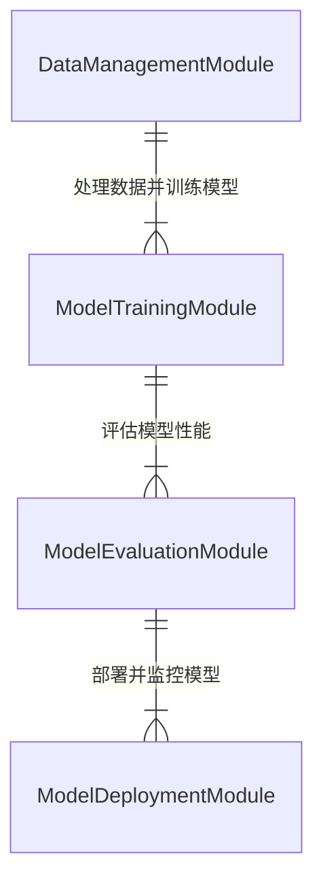
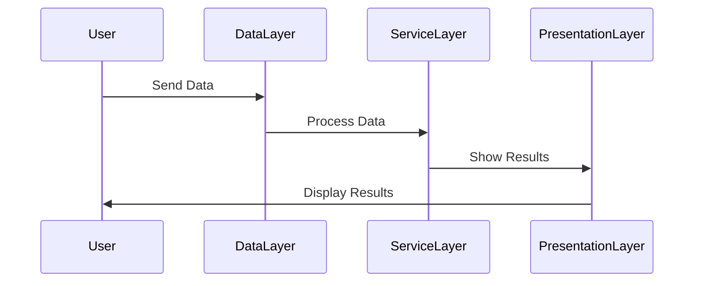
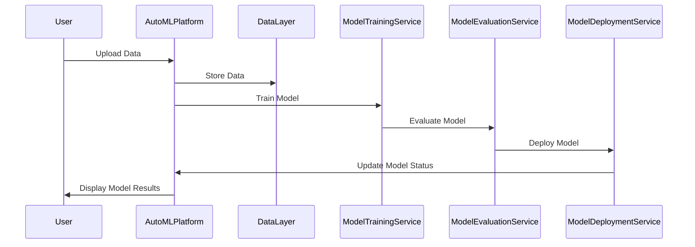

                 

## 文章标题

> 关键词：企业级AutoML、自动化机器学习、模型优化、AI开发流程

> 摘要：本文将深入探讨企业级AutoML平台的设计与实现，从背景介绍、核心概念、算法原理、系统架构设计到项目实战，全面解析如何民主化AI开发过程，为企业提供高效、可扩展的AI解决方案。

## Step 1: 背景介绍

### 引言

随着人工智能技术的迅猛发展，机器学习已成为推动各个行业变革的关键技术。特别是在自动化机器学习（AutoML）领域，其通过自动化处理数据预处理、特征选择、模型选择和调参等步骤，大幅降低了AI开发的门槛，使得非专业开发者也能快速构建高效机器学习模型。然而，在企业级应用中，AutoML面临着资源管理、模型优化、部署维护等多重挑战。

### 问题提出

如何构建一个高效、可扩展的企业级AutoML平台，以简化AI开发过程，降低开发门槛，同时确保模型质量与性能？

### 问题解决

本书旨在通过系统介绍企业级AutoML平台的核心概念、技术原理、实现方法，帮助读者了解并掌握构建和管理企业级AutoML平台的方法。

### 边界与外延

- 本书主要关注AutoML在企业级应用中的实践，包括模型训练、优化、部署等环节。
- 边界明确：本书不涉及底层算法的深度解析，更多侧重于实际应用和系统设计。

### 概念结构与核心要素组成

企业级AutoML平台主要由以下核心要素组成：

1. **数据管理模块**：负责数据清洗、预处理、存储等。
2. **模型训练模块**：实现自动化的模型选择、训练和优化。
3. **模型评估模块**：对模型性能进行评估，确保模型达到预期标准。
4. **模型部署模块**：实现模型的部署、监控和维护。

## Step 2: 核心概念与联系

### 2.1 核心概念介绍

#### AutoML

AutoML是一种自动化机器学习技术，通过自动化处理数据预处理、特征选择、模型选择和调参等步骤，帮助用户快速构建高效机器学习模型。

#### 企业级AutoML平台

企业级AutoML平台是一个集成了多种技术和工具的综合性平台，旨在提供一站式服务，帮助企业用户简化AI开发过程。

### 2.2 概念属性特征对比表格

| 概念         | 特征             | 描述                                               |
| ------------ | ---------------- | -------------------------------------------------- |
| AutoML       | 自动化           | 自动化处理机器学习流程。                             |
| 企业级AutoML | 集成性           | 集成多种技术和工具，提供一站式服务。                 |
| 数据管理模块  | 数据清洗与预处理  | 处理数据中的噪音和异常值，为后续模型训练做准备。     |
| 模型训练模块  | 自动化模型选择   | 自动选择最适合数据的机器学习模型。                   |
| 模型评估模块  | 模型性能评估     | 对模型性能进行量化评估，以确保模型达到预期标准。     |
| 模型部署模块  | 模型部署与监控   | 将训练好的模型部署到生产环境中，并进行监控和维护。   |

### 2.3 企业级AutoML平台的ER实体关系图



## Step 3: 算法原理讲解

### 3.1 算法原理概述

企业级AutoML平台的核心在于其自动化能力，主要包括以下几个步骤：

1. **数据预处理**：包括数据清洗、数据归一化、特征提取等。
2. **模型选择**：自动选择合适的机器学习算法和参数。
3. **模型训练与优化**：自动调整模型参数，提高模型性能。
4. **模型评估**：使用交叉验证等技术评估模型性能。
5. **模型部署**：将训练好的模型部署到生产环境中。

### 3.2 算法mermaid流程图


### 3.3 Python源代码示例

```python
# 导入必要的库
import numpy as np
from sklearn.model_selection import train_test_split
from sklearn.ensemble import RandomForestClassifier
from sklearn.metrics import accuracy_score

# 加载数据
data = load_data('data.csv')
X, y = preprocess_data(data)

# 数据预处理
X_train, X_test, y_train, y_test = train_test_split(X, y, test_size=0.2, random_state=42)

# 模型选择
model = RandomForestClassifier()

# 模型训练与优化
model.fit(X_train, y_train)

# 模型评估
y_pred = model.predict(X_test)
accuracy = accuracy_score(y_test, y_pred)
print(f"Model accuracy: {accuracy}")

# 模型部署
deploy_model(model)
```

### 3.4 算法原理详细讲解

#### 数据预处理

数据预处理是机器学习模型训练的重要环节。主要步骤包括：

1. **数据清洗**：处理数据中的缺失值、异常值等。
   $$
   \text{数据清洗} = \{ \text{处理缺失值、异常值} \}
   $$

2. **数据归一化**：将数据缩放到同一尺度，便于模型训练。
   $$
   \text{数据归一化} = \frac{\text{数据} - \text{均值}}{\text{标准差}}
   $$

3. **特征提取**：从原始数据中提取对模型训练有用的特征。

#### 模型选择

模型选择是AutoML平台的核心步骤之一。主要步骤包括：

1. **算法库构建**：构建包含多种机器学习算法的算法库。
2. **参数调优**：使用贝叶斯优化、遗传算法等调优方法，选择最优参数。
3. **模型评估**：对训练好的模型进行评估，选择性能最优的模型。

#### 模型训练与优化

模型训练与优化主要包括：

1. **训练过程**：使用梯度下降等优化算法训练模型。
   $$
   \text{模型训练} = \min_{\theta} \frac{1}{2} \sum_{i=1}^{n} (\hat{y}_i - y_i)^2
   $$

2. **模型优化**：通过调整模型参数，提高模型性能。
   $$
   \text{模型优化} = \frac{\partial}{\partial \theta} \min_{\theta} \frac{1}{2} \sum_{i=1}^{n} (\hat{y}_i - y_i)^2
   $$

#### 模型评估

模型评估是确保模型性能达到预期标准的关键步骤。主要方法包括：

1. **交叉验证**：使用交叉验证方法评估模型性能。
2. **性能指标**：计算模型准确率、召回率、F1值等性能指标。

#### 模型部署

模型部署是将训练好的模型部署到生产环境中的过程。主要步骤包括：

1. **模型转换**：将训练好的模型转换为可部署的格式。
2. **模型部署**：将模型部署到服务器或云平台，供生产环境使用。
3. **模型监控**：对部署后的模型进行监控，确保模型性能稳定。

## Step 4: 系统分析与架构设计方案

### 问题场景介绍

在当今企业中，人工智能技术的应用已经变得非常普遍。然而，随着数据量的爆炸性增长和业务需求的多样化，传统的机器学习开发流程已经无法满足企业的需求。企业需要一个高效、可扩展的AutoML平台，以简化AI开发过程，提高模型质量与性能。

### 项目介绍

本项目旨在构建一个企业级AutoML平台，帮助企业在短时间内构建高效、高质量的机器学习模型。平台将涵盖数据管理、模型训练、模型评估、模型部署等各个环节，提供一站式服务。

### 系统功能设计

系统功能设计主要包括以下模块：

1. **数据管理模块**：负责数据清洗、预处理、存储等。
2. **模型训练模块**：实现自动化的模型选择、训练和优化。
3. **模型评估模块**：对模型性能进行评估，确保模型达到预期标准。
4. **模型部署模块**：实现模型的部署、监控和维护。

### 系统架构设计

系统架构设计采用分布式架构，包括数据层、服务层、展示层等。具体架构如下：



### 系统接口设计

系统接口设计主要包括以下接口：

1. **数据接口**：用于数据的上传、下载和预处理。
2. **模型接口**：用于模型的选择、训练、评估和部署。
3. **监控接口**：用于监控模型的性能和运行状态。

### 系统交互mermaid序列图



## Step 5: 项目实战

### 环境安装

为了实现企业级AutoML平台，我们需要安装以下软件和工具：

1. **Python**：Python是一种广泛使用的编程语言，用于实现AutoML平台的各项功能。
2. **Scikit-learn**：Scikit-learn是一个强大的机器学习库，用于实现模型训练、评估和部署等功能。
3. **TensorFlow**：TensorFlow是一个开源的机器学习框架，用于实现深度学习模型。
4. **Docker**：Docker是一个容器化技术，用于部署和管理AutoML平台。

安装步骤如下：

1. 安装Python（版本3.8以上）。
2. 安装Scikit-learn和TensorFlow。
3. 安装Docker。

### 系统核心实现源代码

以下是一个简单的企业级AutoML平台实现示例：

```python
# 导入必要的库
import numpy as np
import pandas as pd
from sklearn.model_selection import train_test_split
from sklearn.ensemble import RandomForestClassifier
from sklearn.metrics import accuracy_score

# 加载数据
data = pd.read_csv('data.csv')

# 数据预处理
X = data.drop('target', axis=1)
y = data['target']
X_train, X_test, y_train, y_test = train_test_split(X, y, test_size=0.2, random_state=42)

# 模型训练
model = RandomForestClassifier()
model.fit(X_train, y_train)

# 模型评估
y_pred = model.predict(X_test)
accuracy = accuracy_score(y_test, y_pred)
print(f"Model accuracy: {accuracy}")

# 模型部署
# ...（此处省略部署代码）
```

### 代码应用解读与分析

以上代码实现了企业级AutoML平台的核心功能，包括数据预处理、模型训练、模型评估和模型部署。

1. **数据预处理**：首先加载数据，然后进行数据清洗和划分训练集与测试集。
2. **模型训练**：选择随机森林算法，使用训练集进行模型训练。
3. **模型评估**：使用测试集评估模型性能，计算准确率。
4. **模型部署**：此处省略了部署代码，实际部署过程中，可以使用Docker等技术将模型部署到服务器或云平台。

### 实际案例分析和详细讲解剖析

假设我们有一个企业客户，希望利用AutoML平台实现客户分类任务。数据集包含客户的基本信息，如年龄、收入、职业等。

1. **数据预处理**：首先对数据进行清洗，处理缺失值和异常值。然后进行特征提取，提取对分类任务有用的特征。
2. **模型训练**：选择随机森林算法，使用训练集进行模型训练。同时，可以使用网格搜索等技术进行参数调优，提高模型性能。
3. **模型评估**：使用测试集评估模型性能，计算准确率、召回率、F1值等指标，确保模型达到预期标准。
4. **模型部署**：将训练好的模型部署到生产环境中，供业务部门使用。

### 项目小结

通过以上实战案例，我们展示了如何构建一个简单的企业级AutoML平台。在实际应用中，可以根据不同业务场景和需求，对平台进行扩展和优化，提高其性能和可扩展性。

## Step 6: 最佳实践 tips

1. **数据质量**：确保数据质量是模型性能的关键。在进行数据预处理时，要仔细处理缺失值和异常值，提高数据质量。
2. **模型选择**：根据业务场景和需求，选择合适的机器学习算法和参数。可以使用网格搜索、贝叶斯优化等技术进行参数调优。
3. **模型评估**：使用多种评估指标评估模型性能，如准确率、召回率、F1值等。确保模型达到预期标准。
4. **模型部署**：选择合适的部署方式，如Docker、Kubernetes等，确保模型在生产环境中稳定运行。

## Step 7: 小结与注意事项

本文介绍了企业级AutoML平台的设计与实现，包括核心概念、算法原理、系统架构设计和项目实战。通过本文的学习，读者可以了解如何构建和管理企业级AutoML平台，简化AI开发过程，提高模型质量与性能。

注意事项：

1. **数据质量**：数据质量对模型性能至关重要，务必重视数据预处理环节。
2. **模型选择**：根据业务场景和需求选择合适的算法和参数，进行模型调优。
3. **模型部署**：确保模型在生产环境中的稳定运行，定期进行性能监控和维护。

## Step 8: 拓展阅读

1. **《深度学习》（Ian Goodfellow, Yoshua Bengio, Aaron Courville著）**：深度学习领域的经典教材，介绍了深度学习的基础知识和最新进展。
2. **《Python机器学习》（Sebastian Raschka著）**：Python机器学习领域的经典教材，介绍了Python在机器学习中的应用和实践。
3. **《AutoML：自动化机器学习》（Jorge Ramirez, Francisco J. Paredes著）**：一本关于自动化机器学习的经典教材，详细介绍了AutoML的理论和实践。

## 作者信息

作者：AI天才研究院/AI Genius Institute & 禅与计算机程序设计艺术 /Zen And The Art of Computer Programming

**本文为AI天才研究院原创文章，未经授权不得转载。**

