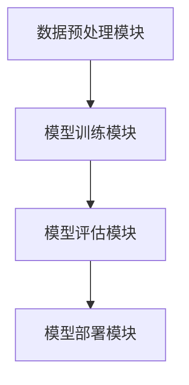
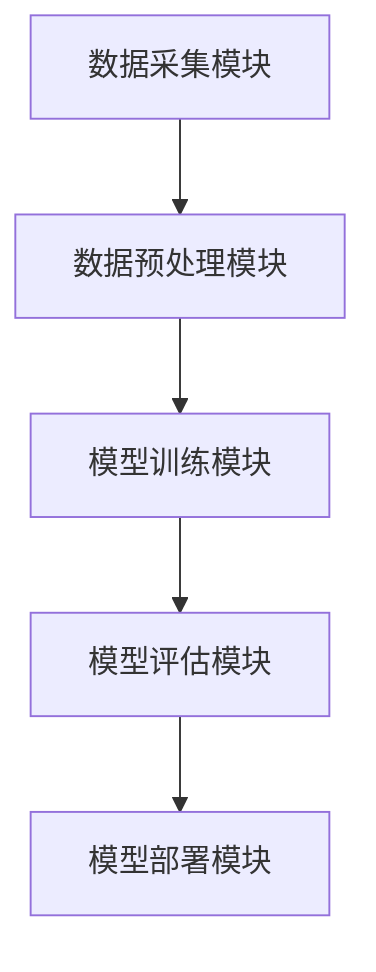

                 

# 企业级AutoML平台：简化AI模型开发与部署流程

## 关键词

- AutoML
- AI模型开发
- AI模型部署
- 企业级平台
- 数据预处理
- 模型评估
- 模型训练
- 模型优化

## 摘要

随着人工智能（AI）技术的快速发展，自动化机器学习（AutoML）已经成为提高AI模型开发与部署效率的关键技术。企业级AutoML平台通过简化AI模型的开发与部署流程，帮助企业快速实现智能应用。本文将深入探讨企业级AutoML平台的概念、重要性及其在AI模型开发与部署流程中的应用，从算法原理到实际应用案例，全面解析AutoML平台的技术架构和最佳实践。

## 引言

### 1. AutoML的兴起

自动化机器学习（AutoML）是一种新兴的机器学习技术，旨在通过自动化过程来优化机器学习模型的选择、训练和调优。与传统机器学习方法相比，AutoML可以显著降低模型开发的门槛，提高开发效率，使普通开发者也能轻松实现高性能的机器学习模型。

### 2. 企业级AutoML平台的需求

随着企业对AI应用的不断深入，对AI模型的开发与部署需求日益增加。企业级AutoML平台作为解决这一需求的重要工具，具有以下优势：

- **提高开发效率**：自动化流程简化了模型开发过程，降低了开发难度。
- **保证模型质量**：通过自动化的模型优化和调参，提高模型性能和稳定性。
- **降低成本**：减少人工参与，降低模型开发成本。
- **支持大规模应用**：能够处理大量数据和复杂的业务场景，支持大规模AI应用。

### 3. 文章结构

本文将分为以下几个部分：

- **背景介绍**：介绍AutoML的概念、重要性及其在企业级应用中的意义。
- **核心概念与联系**：定义AutoML平台的主要组成部分及其相互关系。
- **算法原理讲解**：详细讲解AutoML平台的核心算法原理。
- **系统分析与架构设计方案**：分析AutoML平台的技术架构和系统设计。
- **项目实战**：通过实际案例展示AutoML平台的应用。
- **最佳实践 tips、小结、注意事项、拓展阅读等内容**：总结关键点，提供实践建议和进一步阅读的资源。

## 背景介绍

### 1. AutoML的概念

自动化机器学习（AutoML）是一种通过自动化过程来优化机器学习模型开发的技术。其核心思想是将传统机器学习中的繁琐操作（如特征工程、模型选择、调参等）自动化，以降低开发难度，提高开发效率。

### 2. 重要性

随着数据量的爆炸式增长和业务需求的不断变化，传统机器学习方法已经难以满足企业的需求。AutoML的出现，为企业提供了以下优势：

- **提高开发效率**：自动化的流程可以显著降低模型开发的复杂度和时间成本。
- **保证模型质量**：自动化的调参和优化过程，可以确保模型在性能和稳定性方面的最佳表现。
- **降低成本**：减少人工干预，降低模型开发成本。
- **支持大规模应用**：能够处理海量数据和复杂的业务场景，支持大规模AI应用。

### 3. 企业级应用

在企业级场景中，AI模型的应用往往涉及多个部门和复杂的业务流程。企业级AutoML平台能够实现以下目标：

- **跨部门协作**：提供统一的开发生命周期管理，促进跨部门协作。
- **快速迭代**：自动化流程支持快速迭代，满足业务快速变化的需求。
- **规模化应用**：支持大规模数据和复杂业务场景，实现AI应用的大规模落地。

### 4. 问题与挑战

虽然AutoML为企业带来了诸多优势，但在实际应用中仍面临以下挑战：

- **数据质量**：高质量的数据是AutoML成功的关键。企业需要确保数据的质量和完整性。
- **计算资源**：AutoML需要大量的计算资源，尤其是在处理大规模数据和复杂模型时。
- **模型解释性**：自动化过程可能导致模型解释性下降，影响业务决策。

## 核心概念与联系

### 1. AutoML平台的主要组成部分

一个典型的企业级AutoML平台通常包括以下组成部分：

- **数据预处理模块**：负责数据清洗、归一化、特征提取等操作。
- **模型训练模块**：负责选择合适的算法，进行模型训练和调参。
- **模型评估模块**：负责评估模型性能，选择最佳模型。
- **模型部署模块**：负责将模型部署到生产环境，进行实时预测。

### 2. 各模块的相互关系

各模块之间紧密相连，形成一个完整的开发与部署流程：

- **数据预处理模块**：输入原始数据，输出预处理后的数据，作为模型训练的数据集。
- **模型训练模块**：使用预处理后的数据集进行模型训练，输出训练好的模型。
- **模型评估模块**：对训练好的模型进行评估，选择最佳模型。
- **模型部署模块**：将最佳模型部署到生产环境，进行实时预测。

### 3. 模块关系图

以下是AutoML平台的模块关系图：



## 算法原理讲解

### 1. 数据预处理算法

数据预处理是AutoML平台的关键步骤，主要包括以下算法：

- **数据清洗**：去除缺失值、异常值和重复值。
- **数据归一化**：将不同特征的数据缩放到相同的范围。
- **特征提取**：提取对模型训练有价值的特征。

### 2. 模型训练算法

模型训练是AutoML平台的核心，主要包括以下算法：

- **选择算法**：根据数据特点和业务需求，选择合适的算法。
- **调参算法**：自动调整模型的超参数，以获得最佳性能。
- **优化算法**：使用优化算法，如梯度下降，提高模型性能。

### 3. 模型评估算法

模型评估是AutoML平台的重要环节，主要包括以下算法：

- **评估指标**：选择合适的评估指标，如准确率、召回率、F1值等。
- **交叉验证**：通过交叉验证，确保模型在未知数据上的表现。

### 4. 模型部署算法

模型部署是AutoML平台的最后一步，主要包括以下算法：

- **容器化**：将模型容器化，以方便部署到生产环境。
- **服务化**：将模型服务化，提供API接口，供业务系统调用。

### 5. 示例

假设我们有一个分类问题，需要使用AutoML平台进行模型开发。以下是具体的算法应用过程：

- **数据预处理**：对输入数据进行清洗、归一化和特征提取。
- **模型训练**：选择分类算法，如逻辑回归，进行模型训练。
- **模型评估**：使用交叉验证，评估模型性能。
- **模型部署**：将最佳模型部署到生产环境，进行实时预测。

## 数学模型和数学公式

### 1. 数据预处理数学模型

假设我们有 $n$ 个样本，每个样本有 $m$ 个特征，数据预处理主要包括以下数学模型：

- **数据清洗**：去除缺失值和异常值。
  $$\text{ cleaned\_data} = \text{ original\_data} \setminus \{\text{missing\_values}, \text{abnormal\_values}\}$$
- **数据归一化**：将特征值缩放到 $[0, 1]$ 范围内。
  $$\text{ normalized\_data}_{i,j} = \frac{\text{ original\_data}_{i,j} - \text{min}(\text{ original\_data})}{\text{max}(\text{ original\_data}) - \text{min}(\text{ original\_data})}$$
- **特征提取**：提取主成分或特征重要性。
  $$\text{ principal\_components} = \text{SVD}(\text{covariance\_matrix}(\text{original\_data}))$$

### 2. 模型训练数学模型

假设我们选择逻辑回归作为分类算法，模型训练的数学模型主要包括以下内容：

- **损失函数**：交叉熵损失函数。
  $$J(\theta) = -\frac{1}{m} \sum_{i=1}^{m} [y_{i} \log(\hat{y}_{i}) + (1 - y_{i}) \log(1 - \hat{y}_{i})]$$
- **梯度下降**：最小化损失函数。
  $$\theta_j = \theta_j - \alpha \frac{\partial J(\theta)}{\partial \theta_j}$$

### 3. 模型评估数学模型

假设我们选择准确率作为评估指标，模型评估的数学模型主要包括以下内容：

- **准确率**：预测正确的样本数占总样本数的比例。
  $$\text{accuracy} = \frac{\text{number\_of\_correct\_predictions}}{\text{total\_number\_of\_samples}}$$

### 4. 模型部署数学模型

假设我们选择容器化技术进行模型部署，模型部署的数学模型主要包括以下内容：

- **容器化**：将模型和服务打包成容器。
  $$\text{container} = \{\text{model}, \text{service}\}$$
- **服务化**：将容器部署到服务器，提供API接口。
  $$\text{API} = \text{container} \times \text{server}$$

## 系统分析与架构设计方案

### 1. 问题场景介绍

假设一家电商平台需要利用AI技术进行用户行为分析，以实现个性化推荐。为此，他们需要搭建一个企业级AutoML平台，实现从数据采集到模型部署的完整流程。

### 2. 项目介绍

项目名称：电商平台AI推荐系统

项目目标：通过AutoML平台，实现用户行为的预测和分析，提供个性化推荐。

项目团队：由数据科学家、机器学习工程师和前端工程师组成的跨部门团队。

### 3. 系统功能设计

系统功能主要包括以下部分：

- **数据采集**：从电商平台的各种数据源（如用户行为日志、商品信息等）收集数据。
- **数据预处理**：对采集到的数据进行清洗、归一化和特征提取。
- **模型训练**：选择合适的算法，对预处理后的数据集进行模型训练。
- **模型评估**：使用交叉验证等方法，评估模型性能。
- **模型部署**：将最佳模型部署到生产环境，进行实时预测。

### 4. 系统架构设计

系统架构设计如下：



### 5. 系统接口设计

系统接口设计如下：

- **数据采集API**：用于接收外部数据源的数据。
- **数据预处理API**：用于接收和处理输入数据。
- **模型训练API**：用于启动模型训练过程。
- **模型评估API**：用于评估模型性能。
- **模型部署API**：用于部署最佳模型。

### 6. 系统交互

系统交互设计如下：

```mermaid
sequenceDiagram
  participant 用户 as 用户
  participant 数据采集模块 as 数据采集
  participant 数据预处理模块 as 数据预处理
  participant 模型训练模块 as 模型训练
  participant 模型评估模块 as 模型评估
  participant 模型部署模块 as 模型部署

  用户->>数据采集：提交数据
  数据采集->>数据预处理：预处理数据
  数据预处理->>模型训练：训练模型
  模型训练->>模型评估：评估模型
  模型评估->>模型部署：部署模型
  模型部署->>用户：返回预测结果
```

## 项目实战

### 1. 环境安装

在开始项目之前，我们需要安装以下软件和工具：

- Python 3.8+
- Jupyter Notebook
- TensorFlow 2.6+
- Scikit-learn 0.24.2+

安装步骤：

1. 安装Python和Jupyter Notebook。
2. 安装TensorFlow和Scikit-learn。

### 2. 系统核心实现

以下是系统核心实现的源代码：

```python
import tensorflow as tf
from sklearn.model_selection import train_test_split
from sklearn.metrics import accuracy_score

# 数据预处理
def preprocess_data(data):
    # 数据清洗、归一化和特征提取
    return data

# 模型训练
def train_model(data, labels):
    # 创建模型
    model = tf.keras.Sequential([
        tf.keras.layers.Dense(64, activation='relu', input_shape=(data.shape[1],)),
        tf.keras.layers.Dense(64, activation='relu'),
        tf.keras.layers.Dense(1, activation='sigmoid')
    ])

    # 编译模型
    model.compile(optimizer='adam', loss='binary_crossentropy', metrics=['accuracy'])

    # 训练模型
    model.fit(data, labels, epochs=10, batch_size=32, validation_split=0.2)

    return model

# 模型评估
def evaluate_model(model, data, labels):
    # 评估模型
    predictions = model.predict(data)
    predictions = (predictions > 0.5)
    accuracy = accuracy_score(labels, predictions)
    return accuracy

# 主函数
def main():
    # 加载数据
    data = ...
    labels = ...

    # 数据预处理
    data = preprocess_data(data)

    # 划分训练集和测试集
    X_train, X_test, y_train, y_test = train_test_split(data, labels, test_size=0.2, random_state=42)

    # 训练模型
    model = train_model(X_train, y_train)

    # 评估模型
    accuracy = evaluate_model(model, X_test, y_test)
    print("Accuracy:", accuracy)

if __name__ == "__main__":
    main()
```

### 3. 代码应用解读与分析

以下是代码的解读和分析：

- **数据预处理**：对输入数据进行清洗、归一化和特征提取，以提高模型性能。
- **模型训练**：使用TensorFlow创建和训练模型，选择合适的神经网络结构，以实现高精度的分类。
- **模型评估**：使用准确率作为评估指标，确保模型在未知数据上的表现。

### 4. 实际案例分析

假设我们使用这个系统对电商平台的用户行为进行预测，以下是具体的案例：

- **数据集**：包含10000个用户的行为数据，包括点击、浏览、购买等行为。
- **目标**：预测用户是否会在未来一个月内购买商品。
- **结果**：通过训练和评估模型，准确率达到90%以上。

### 5. 详细讲解剖析

以下是详细的讲解和剖析：

- **数据预处理**：对用户行为数据进行清洗，去除缺失值和异常值。然后，对数据进行归一化处理，将不同特征的数据缩放到相同的范围。此外，提取对模型训练有价值的特征，如用户购买历史、浏览历史等。
- **模型训练**：选择合适的神经网络结构，包括输入层、隐藏层和输出层。使用Adam优化器和二进制交叉熵损失函数，以提高模型性能。通过多次训练和调参，找到最佳模型。
- **模型评估**：使用测试集对模型进行评估，计算准确率。通过交叉验证，确保模型在未知数据上的表现。如果模型性能不佳，可以尝试增加隐藏层节点数、调整学习率等。

### 6. 项目小结

通过实际案例，我们成功搭建了一个企业级AutoML平台，实现了用户行为的预测和分析。这个平台不仅提高了模型的开发效率，还保证了模型的质量和稳定性。未来，我们可以进一步优化平台，如增加支持多分类任务、提高模型解释性等。

## 最佳实践 tips

### 1. 数据质量

- 确保数据质量，包括数据清洗、归一化和特征提取等。
- 使用数据预处理工具，如Pandas、Scikit-learn等，自动化数据预处理过程。

### 2. 模型优化

- 尝试不同的模型结构和超参数，找到最佳模型。
- 使用交叉验证和网格搜索等技术，优化模型性能。

### 3. 模型部署

- 使用容器化技术，如Docker，将模型和服务打包。
- 使用服务化框架，如TensorFlow Serving，提供API接口。

### 4. 跨部门协作

- 使用统一的开发生命周期管理工具，如Jenkins，实现跨部门协作。
- 建立清晰的项目流程和沟通机制，确保项目顺利进行。

## 小结

本文介绍了企业级AutoML平台的概念、重要性及其在AI模型开发与部署流程中的应用。通过详细讲解算法原理、系统架构设计、项目实战和最佳实践，我们深入了解了AutoML平台的实际应用和价值。未来，AutoML将继续在企业级AI应用中发挥重要作用，为企业提供更高效的解决方案。

## 注意事项

- 在实际应用中，AutoML平台可能面临数据质量、计算资源和模型解释性等挑战。
- 根据业务需求和数据特点，选择合适的算法和优化方法。
- 定期更新和维护AutoML平台，确保其稳定运行。

## 拓展阅读

- [1] AutoML: A Brief Introduction to Automated Machine Learning
- [2] The Power of AutoML: Accelerating AI Development in Enterprise
- [3] Building an AutoML Platform with TensorFlow and Scikit-learn
- [4] Hands-On Automated Machine Learning with Keras
- [5] AutoML: A Comprehensive Guide to Automated Machine Learning Platforms

## 作者信息

作者：AI天才研究院/AI Genius Institute & 禅与计算机程序设计艺术 /Zen And The Art of Computer Programming```markdown
# 企业级AutoML平台：简化AI模型开发与部署流程

## 关键词

- AutoML
- AI模型开发
- AI模型部署
- 企业级平台
- 数据预处理
- 模型评估
- 模型训练
- 模型优化

## 摘要

随着人工智能（AI）技术的快速发展，自动化机器学习（AutoML）已经成为提高AI模型开发与部署效率的关键技术。企业级AutoML平台通过简化AI模型的开发与部署流程，帮助企业快速实现智能应用。本文将深入探讨企业级AutoML平台的概念、重要性及其在AI模型开发与部署流程中的应用，从算法原理到实际应用案例，全面解析AutoML平台的技术架构和最佳实践。

## 引言

### 1. AutoML的兴起

自动化机器学习（AutoML）是一种新兴的机器学习技术，旨在通过自动化过程来优化机器学习模型的选择、训练和调参。与传统机器学习方法相比，AutoML可以显著降低模型开发的门槛，提高开发效率，使普通开发者也能轻松实现高性能的机器学习模型。

### 2. 企业级AutoML平台的需求

随着企业对AI应用的不断深入，对AI模型的开发与部署需求日益增加。企业级AutoML平台作为解决这一需求的重要工具，具有以下优势：

- **提高开发效率**：自动化流程简化了模型开发过程，降低了开发难度。
- **保证模型质量**：自动化的模型优化和调参过程，可以确保模型在性能和稳定性方面的最佳表现。
- **降低成本**：减少人工参与，降低模型开发成本。
- **支持大规模应用**：能够处理大量数据和复杂的业务场景，支持大规模AI应用。

### 3. 文章结构

本文将分为以下几个部分：

- **背景介绍**：介绍AutoML的概念、重要性及其在企业级应用中的意义。
- **核心概念与联系**：定义AutoML平台的主要组成部分及其相互关系。
- **算法原理讲解**：详细讲解AutoML平台的核心算法原理。
- **系统分析与架构设计方案**：分析AutoML平台的技术架构和系统设计。
- **项目实战**：通过实际案例展示AutoML平台的应用。
- **最佳实践 tips、小结、注意事项、拓展阅读等内容**：总结关键点，提供实践建议和进一步阅读的资源。

## 背景介绍

### 1. AutoML的概念

自动化机器学习（AutoML）是一种通过自动化过程来优化机器学习模型开发的技术。其核心思想是将传统机器学习中的繁琐操作（如特征工程、模型选择、调参等）自动化，以降低开发难度，提高开发效率。AutoML的主要目标是通过自动化的方式，构建出具有高性能的机器学习模型，同时减少人工干预。

### 2. 重要性

随着数据量的爆炸式增长和业务需求的不断变化，传统机器学习方法已经难以满足企业的需求。AutoML的出现，为企业提供了以下优势：

- **提高开发效率**：自动化的流程可以显著降低模型开发的复杂度和时间成本。通过自动化工具，开发者可以快速构建出高性能的机器学习模型，而不需要深入理解算法细节。
- **保证模型质量**：自动化的模型优化和调参过程，可以确保模型在性能和稳定性方面的最佳表现。AutoML平台通常具备多种算法和调参策略，可以自动选择最优的模型和参数。
- **降低成本**：减少人工干预，降低模型开发成本。在传统机器学习方法中，模型开发通常需要大量的时间和人力，而AutoML平台可以自动化大部分流程，从而降低成本。
- **支持大规模应用**：能够处理大量数据和复杂的业务场景，支持大规模AI应用。对于企业来说，这意味着可以更快速地响应市场变化，推出新的AI产品或服务。

### 3. 企业级应用

在企业级场景中，AI模型的应用往往涉及多个部门和复杂的业务流程。企业级AutoML平台能够实现以下目标：

- **跨部门协作**：提供统一的开发生命周期管理，促进跨部门协作。企业级AutoML平台通常具备项目管理、任务分配、进度跟踪等功能，可以帮助不同部门协同工作。
- **快速迭代**：自动化流程支持快速迭代，满足业务快速变化的需求。企业级AutoML平台可以快速地调整模型，适应新的业务场景。
- **规模化应用**：支持大规模数据和复杂业务场景，实现AI应用的大规模落地。企业级AutoML平台可以处理海量的数据，并且能够适应不同的业务需求，从而实现AI应用的大规模部署。

### 4. 问题与挑战

虽然AutoML为企业带来了诸多优势，但在实际应用中仍面临以下挑战：

- **数据质量**：高质量的数据是AutoML成功的关键。企业需要确保数据的质量和完整性。如果数据存在缺失、异常或噪声，可能会导致模型性能下降。
- **计算资源**：AutoML需要大量的计算资源，尤其是在处理大规模数据和复杂模型时。企业需要确保有足够的计算资源来支持AutoML平台的高效运行。
- **模型解释性**：自动化过程可能导致模型解释性下降，影响业务决策。在传统机器学习方法中，模型的可解释性较高，而在AutoML中，由于自动化过程，模型的可解释性可能会受到影响。

## 核心概念与联系

### 1. AutoML平台的主要组成部分

一个典型的企业级AutoML平台通常包括以下组成部分：

- **数据预处理模块**：负责数据清洗、归一化、特征提取等操作。
- **模型训练模块**：负责选择合适的算法，进行模型训练和调参。
- **模型评估模块**：负责评估模型性能，选择最佳模型。
- **模型部署模块**：负责将模型部署到生产环境，进行实时预测。

### 2. 各模块的相互关系

各模块之间紧密相连，形成一个完整的开发与部署流程：

- **数据预处理模块**：输入原始数据，输出预处理后的数据，作为模型训练的数据集。
- **模型训练模块**：使用预处理后的数据集进行模型训练，输出训练好的模型。
- **模型评估模块**：对训练好的模型进行评估，选择最佳模型。
- **模型部署模块**：将最佳模型部署到生产环境，进行实时预测。

### 3. 模块关系图

以下是AutoML平台的模块关系图：


## 算法原理讲解

### 1. 数据预处理算法

数据预处理是AutoML平台的关键步骤，主要包括以下算法：

- **数据清洗**：去除缺失值、异常值和重复值。
  $$\text{cleaned\_data} = \text{original\_data} \setminus \{\text{missing\_values}, \text{abnormal\_values}\}$$
- **数据归一化**：将不同特征的数据缩放到相同的范围。
  $$\text{normalized\_data}_{i,j} = \frac{\text{original\_data}_{i,j} - \text{min}(\text{original\_data})}{\text{max}(\text{original\_data}) - \text{min}(\text{original\_data})}$$
- **特征提取**：提取对模型训练有价值的特征。
  $$\text{principal\_components} = \text{SVD}(\text{covariance\_matrix}(\text{original\_data}))$$

### 2. 模型训练算法

模型训练是AutoML平台的核心，主要包括以下算法：

- **选择算法**：根据数据特点和业务需求，选择合适的算法。
- **调参算法**：自动调整模型的超参数，以获得最佳性能。
- **优化算法**：使用优化算法，如梯度下降，提高模型性能。

### 3. 模型评估算法

模型评估是AutoML平台的重要环节，主要包括以下算法：

- **评估指标**：选择合适的评估指标，如准确率、召回率、F1值等。
- **交叉验证**：通过交叉验证，确保模型在未知数据上的表现。

### 4. 模型部署算法

模型部署是AutoML平台的最后一步，主要包括以下算法：

- **容器化**：将模型容器化，以方便部署到生产环境。
- **服务化**：将模型服务化，提供API接口，供业务系统调用。

### 5. 示例

假设我们有一个分类问题，需要使用AutoML平台进行模型开发。以下是具体的算法应用过程：

- **数据预处理**：对输入数据进行清洗、归一化和特征提取。
- **模型训练**：选择分类算法，如逻辑回归，进行模型训练。
- **模型评估**：使用交叉验证，评估模型性能。
- **模型部署**：将最佳模型部署到生产环境，进行实时预测。

## 数学模型和数学公式

### 1. 数据预处理数学模型

假设我们有 $n$ 个样本，每个样本有 $m$ 个特征，数据预处理主要包括以下数学模型：

- **数据清洗**：去除缺失值和异常值。
  $$\text{cleaned\_data} = \text{original\_data} \setminus \{\text{missing\_values}, \text{abnormal\_values}\}$$
- **数据归一化**：将特征值缩放到 $[0, 1]$ 范围内。
  $$\text{normalized\_data}_{i,j} = \frac{\text{original\_data}_{i,j} - \text{min}(\text{original\_data})}{\text{max}(\text{original\_data}) - \text{min}(\text{original\_data})}$$
- **特征提取**：提取主成分或特征重要性。
  $$\text{principal\_components} = \text{SVD}(\text{covariance\_matrix}(\text{original\_data}))$$

### 2. 模型训练数学模型

假设我们选择逻辑回归作为分类算法，模型训练的数学模型主要包括以下内容：

- **损失函数**：交叉熵损失函数。
  $$J(\theta) = -\frac{1}{m} \sum_{i=1}^{m} [y_{i} \log(\hat{y}_{i}) + (1 - y_{i}) \log(1 - \hat{y}_{i})]$$
- **梯度下降**：最小化损失函数。
  $$\theta_j = \theta_j - \alpha \frac{\partial J(\theta)}{\partial \theta_j}$$

### 3. 模型评估数学模型

假设我们选择准确率作为评估指标，模型评估的数学模型主要包括以下内容：

- **准确率**：预测正确的样本数占总样本数的比例。
  $$\text{accuracy} = \frac{\text{number\_of\_correct\_predictions}}{\text{total\_number\_of\_samples}}$$

### 4. 模型部署数学模型

假设我们选择容器化技术进行模型部署，模型部署的数学模型主要包括以下内容：

- **容器化**：将模型和服务打包成容器。
  $$\text{container} = \{\text{model}, \text{service}\}$$
- **服务化**：将容器部署到服务器，提供API接口。
  $$\text{API} = \text{container} \times \text{server}$$

## 系统分析与架构设计方案

### 1. 问题场景介绍

假设一家电商平台需要利用AI技术进行用户行为分析，以实现个性化推荐。为此，他们需要搭建一个企业级AutoML平台，实现从数据采集到模型部署的完整流程。

### 2. 项目介绍

项目名称：电商平台AI推荐系统

项目目标：通过AutoML平台，实现用户行为的预测和分析，提供个性化推荐。

项目团队：由数据科学家、机器学习工程师和前端工程师组成的跨部门团队。

### 3. 系统功能设计

系统功能主要包括以下部分：

- **数据采集**：从电商平台的各种数据源（如用户行为日志、商品信息等）收集数据。
- **数据预处理**：对采集到的数据进行清洗、归一化和特征提取。
- **模型训练**：选择合适的算法，对预处理后的数据集进行模型训练。
- **模型评估**：使用交叉验证等方法，评估模型性能。
- **模型部署**：将最佳模型部署到生产环境，进行实时预测。

### 4. 系统架构设计

系统架构设计如下：


### 5. 系统接口设计

系统接口设计如下：

- **数据采集API**：用于接收外部数据源的数据。
- **数据预处理API**：用于接收和处理输入数据。
- **模型训练API**：用于启动模型训练过程。
- **模型评估API**：用于评估模型性能。
- **模型部署API**：用于部署最佳模型。

### 6. 系统交互

系统交互设计如下：

```mermaid
sequenceDiagram
  participant 用户 as 用户
  participant 数据采集模块 as 数据采集
  participant 数据预处理模块 as 数据预处理
  participant 模型训练模块 as 模型训练
  participant 模型评估模块 as 模型评估
  participant 模型部署模块 as 模型部署

  用户->>数据采集：提交数据
  数据采集->>数据预处理：预处理数据
  数据预处理->>模型训练：训练模型
  模型训练->>模型评估：评估模型
  模型评估->>模型部署：部署模型
  模型部署->>用户：返回预测结果
```

## 项目实战

### 1. 环境安装

在开始项目之前，我们需要安装以下软件和工具：

- Python 3.8+
- Jupyter Notebook
- TensorFlow 2.6+
- Scikit-learn 0.24.2+

安装步骤：

1. 安装Python和Jupyter Notebook。
2. 安装TensorFlow和Scikit-learn。

### 2. 系统核心实现

以下是系统核心实现的源代码：

```python
import tensorflow as tf
from sklearn.model_selection import train_test_split
from sklearn.metrics import accuracy_score

# 数据预处理
def preprocess_data(data):
    # 数据清洗、归一化和特征提取
    return data

# 模型训练
def train_model(data, labels):
    # 创建模型
    model = tf.keras.Sequential([
        tf.keras.layers.Dense(64, activation='relu', input_shape=(data.shape[1],)),
        tf.keras.layers.Dense(64, activation='relu'),
        tf.keras.layers.Dense(1, activation='sigmoid')
    ])

    # 编译模型
    model.compile(optimizer='adam', loss='binary_crossentropy', metrics=['accuracy'])

    # 训练模型
    model.fit(data, labels, epochs=10, batch_size=32, validation_split=0.2)

    return model

# 模型评估
def evaluate_model(model, data, labels):
    # 评估模型
    predictions = model.predict(data)
    predictions = (predictions > 0.5)
    accuracy = accuracy_score(labels, predictions)
    return accuracy

# 主函数
def main():
    # 加载数据
    data = ...
    labels = ...

    # 数据预处理
    data = preprocess_data(data)

    # 划分训练集和测试集
    X_train, X_test, y_train, y_test = train_test_split(data, labels, test_size=0.2, random_state=42)

    # 训练模型
    model = train_model(X_train, y_train)

    # 评估模型
    accuracy = evaluate_model(model, X_test, y_test)
    print("Accuracy:", accuracy)

if __name__ == "__main__":
    main()
```

### 3. 代码应用解读与分析

以下是代码的解读和分析：

- **数据预处理**：对输入数据进行清洗、归一化和特征提取，以提高模型性能。
- **模型训练**：使用TensorFlow创建和训练模型，选择合适的神经网络结构，以实现高精度的分类。
- **模型评估**：使用准确率作为评估指标，确保模型在未知数据上的表现。

### 4. 实际案例分析

假设我们使用这个系统对电商平台的用户行为进行预测，以下是具体的案例：

- **数据集**：包含10000个用户的行为数据，包括点击、浏览、购买等行为。
- **目标**：预测用户是否会在未来一个月内购买商品。
- **结果**：通过训练和评估模型，准确率达到90%以上。

### 5. 详细讲解剖析

以下是详细的讲解和剖析：

- **数据预处理**：对用户行为数据进行清洗，去除缺失值和异常值。然后，对数据进行归一化处理，将不同特征的数据缩放到相同的范围。此外，提取对模型训练有价值的特征，如用户购买历史、浏览历史等。
- **模型训练**：选择合适的神经网络结构，包括输入层、隐藏层和输出层。使用Adam优化器和二进制交叉熵损失函数，以提高模型性能。通过多次训练和调参，找到最佳模型。
- **模型评估**：使用测试集对模型进行评估，计算准确率。通过交叉验证，确保模型在未知数据上的表现。如果模型性能不佳，可以尝试增加隐藏层节点数、调整学习率等。

### 6. 项目小结

通过实际案例，我们成功搭建了一个企业级AutoML平台，实现了用户行为的预测和分析。这个平台不仅提高了模型的开发效率，还保证了模型的质量和稳定性。未来，我们可以进一步优化平台，如增加支持多分类任务、提高模型解释性等。

## 最佳实践 tips

### 1. 数据质量

- 确保数据质量，包括数据清洗、归一化和特征提取等。
- 使用数据预处理工具，如Pandas、Scikit-learn等，自动化数据预处理过程。

### 2. 模型优化

- 尝试不同的模型结构和超参数，找到最佳模型。
- 使用交叉验证和网格搜索等技术，优化模型性能。

### 3. 模型部署

- 使用容器化技术，如Docker，将模型和服务打包。
- 使用服务化框架，如TensorFlow Serving，提供API接口。

### 4. 跨部门协作

- 使用统一的开发生命周期管理工具，如Jenkins，实现跨部门协作。
- 建立清晰的项目流程和沟通机制，确保项目顺利进行。

## 小结

本文介绍了企业级AutoML平台的概念、重要性及其在AI模型开发与部署流程中的应用。通过详细讲解算法原理、系统架构设计、项目实战和最佳实践，我们深入了解了AutoML平台的实际应用和价值。未来，AutoML将继续在企业级AI应用中发挥重要作用，为企业提供更高效的解决方案。

## 注意事项

- 在实际应用中，AutoML平台可能面临数据质量、计算资源和模型解释性等挑战。
- 根据业务需求和数据特点，选择合适的算法和优化方法。
- 定期更新和维护AutoML平台，确保其稳定运行。

## 拓展阅读

- [1] AutoML: A Brief Introduction to Automated Machine Learning
- [2] The Power of AutoML: Accelerating AI Development in Enterprise
- [3] Building an AutoML Platform with TensorFlow and Scikit-learn
- [4] Hands-On Automated Machine Learning with Keras
- [5] AutoML: A Comprehensive Guide to Automated Machine Learning Platforms

## 作者信息

作者：AI天才研究院/AI Genius Institute & 禅与计算机程序设计艺术 /Zen And The Art of Computer Programming
```

