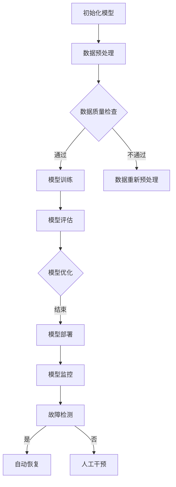
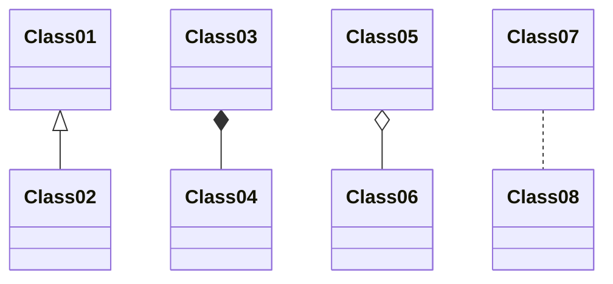

                 

### 3.1 平台架构设计概述

#### 3.1.1 AutoML平台设计原则

设计企业级AutoML平台时，我们需要遵循以下几个核心原则：

1. **灵活性**：平台应该能够适应不同类型的数据集和业务场景，提供灵活的配置选项，以便用户可以根据需求进行调整。
2. **可扩展性**：随着业务需求的增长，平台应该能够无缝扩展，无需对整体架构进行大规模重构。
3. **高效性**：优化模型训练和评估流程，减少时间成本，提高开发效率。
4. **可解释性**：确保模型的可解释性，以便团队能够理解模型的决策过程，从而进行有效的模型调整和优化。
5. **安全性**：保护用户数据的安全和隐私，遵守数据保护法规，确保数据在传输和处理过程中的安全性。

#### 3.1.2 平台整体架构

企业级AutoML平台通常包括以下几个主要模块：

1. **数据处理模块**：负责数据的接入、预处理和质量管理，为后续的模型训练提供高质量的数据。
2. **模型训练模块**：支持多种机器学习算法的自动化选择和训练，包括深度学习和传统机器学习方法。
3. **模型评估模块**：对训练完成的模型进行全面的评估，确保模型的性能满足业务需求。
4. **模型部署模块**：将训练完成的模型部署到生产环境中，实现自动化部署和运维。
5. **监控与运维模块**：对模型的运行状态进行实时监控，提供故障检测和自动恢复功能。

#### 3.1.3 系统模块划分与功能介绍

以下是企业级AutoML平台的主要模块及其功能：

1. **数据处理模块**：
   - **数据源接入**：支持各种数据源的接入，包括结构化数据、半结构化数据和非结构化数据。
   - **数据预处理**：自动进行数据清洗、归一化、特征提取等操作，提高数据质量。
   - **数据质量管理**：监控数据质量，确保数据在训练过程中的一致性和准确性。

2. **模型训练模块**：
   - **模型选择**：根据业务需求选择合适的机器学习算法和模型架构。
   - **训练过程**：自动调整训练参数，优化模型性能，支持并行和分布式训练。
   - **超参数调优**：利用自动化工具进行超参数搜索，找到最佳配置。

3. **模型评估模块**：
   - **评估指标**：计算各种评估指标，如准确率、召回率、F1分数等。
   - **模型比较**：比较不同模型的性能，选择最佳模型。
   - **模型解释性**：提供模型解释工具，帮助用户理解模型决策过程。

4. **模型部署模块**：
   - **模型打包**：将训练好的模型打包为可部署的格式。
   - **部署流程**：自动化部署模型到生产环境，支持容器化和无服务器架构。
   - **运维管理**：监控模型运行状态，提供故障恢复和自动扩展功能。

5. **监控与运维模块**：
   - **实时监控**：监控模型运行状态，包括性能指标、资源使用情况等。
   - **故障检测**：实时检测模型故障，并提供自动恢复机制。
   - **日志分析**：收集和分析日志数据，帮助团队进行问题诊断和性能优化。

通过上述模块的设计和功能实现，企业级AutoML平台能够有效简化AI模型开发流程，提高开发效率和模型性能，为企业提供强大的AI能力支持。### 3.2 数据处理模块设计

#### 3.2.1 数据源接入

数据处理模块的首要任务是接入各种类型的数据源，为后续的数据预处理和模型训练提供数据支持。数据源可以包括关系数据库、NoSQL数据库、文件存储系统以及实时数据流等。

**数据源类型与选择：**
- **关系数据库**：如MySQL、PostgreSQL等，适用于结构化数据的高效存储和查询。
- **NoSQL数据库**：如MongoDB、Cassandra等，适用于处理半结构化或非结构化数据。
- **文件存储系统**：如HDFS、S3等，适用于存储大量数据。
- **实时数据流**：如Kafka、Flink等，适用于处理实时数据。

选择数据源时需要考虑数据的类型、规模、访问频率以及业务需求等因素。通常情况下，会根据数据特性选择最适合的数据存储和访问方案。

**数据源接入流程：**
1. **数据接入接口**：设计通用的数据接入接口，支持多种数据源的接入，包括API接口、数据库连接器等。
2. **数据连接与同步**：建立与数据源的连接，定期或实时同步数据到平台中，确保数据的一致性和最新性。

#### 3.2.2 数据预处理流程

数据预处理是数据处理模块的核心环节，其目标是清洗、归一化、特征提取等操作，提高数据质量，为模型训练提供高质量的数据。

**数据预处理方法：**
- **数据清洗**：删除重复数据、处理缺失值、修正错误数据等。
- **数据归一化**：将不同特征的数据统一到一个尺度，如归一化或标准化处理。
- **特征提取**：从原始数据中提取对模型训练有用的特征，如使用PCA进行降维或使用词袋模型提取文本特征。
- **特征选择**：通过特征选择算法（如Filter方法、Wrapper方法和Embedded方法），选择对模型训练贡献最大的特征。

**数据预处理流程：**
1. **数据读取**：从数据源中读取原始数据，进行初步的数据质量检查。
2. **数据清洗**：根据业务需求和数据质量标准，对数据进行清洗操作，删除重复记录、填充缺失值、修正错误数据等。
3. **数据归一化**：对数据特征进行归一化处理，确保数据在相同的尺度上进行后续处理。
4. **特征提取**：根据模型训练需求，从原始数据中提取特征，可能包括特征转换、降维等操作。
5. **特征选择**：选择对模型训练有显著影响的特征，剔除无关或冗余特征。

**数据质量管理：**
- **质量检查**：在数据预处理过程中，对数据进行质量检查，确保数据的一致性和准确性。
- **质量监控**：建立数据质量管理机制，监控数据质量，及时发现和处理质量问题。
- **数据审计**：定期对数据进行审计，确保数据的合法合规，防止数据泄露和滥用。

通过完善的数据预处理流程和质量管理机制，数据处理模块能够为模型训练提供高质量的数据，从而提高模型训练的效率和效果。### 3.3 模型训练模块设计

#### 3.3.1 模型选择策略

模型训练模块的核心任务是选择合适的机器学习算法和模型架构，以满足业务需求并最大化模型性能。选择合适的模型是提高模型训练效率和质量的关键。

**模型选择标准：**
- **业务需求**：根据业务场景和问题类型，选择适合的模型。例如，对于分类问题，可以选择逻辑回归、支持向量机、决策树、随机森林等；对于回归问题，可以选择线性回归、岭回归、LASSO回归等。
- **数据特性**：根据数据的类型、规模和分布情况，选择适合的模型。例如，对于高维稀疏数据，可以选择深度学习模型；对于低维密集数据，可以选择传统机器学习模型。
- **模型性能**：选择具有较好性能指标（如准确率、召回率、F1分数等）的模型。

**模型选择流程：**
1. **需求分析**：明确业务需求和问题类型，了解数据特性，为模型选择提供基础。
2. **算法评估**：根据需求分析结果，评估不同机器学习算法的性能，选择最适合的算法。
3. **模型对比**：通过交叉验证等方法，对所选模型进行对比，确定最佳模型。

**自动化模型选择工具**：
- **AutoKeras**：基于Keras的自动化机器学习框架，支持多种深度学习模型的自动选择和训练。
- **H2O.ai AutoML**：支持多种机器学习算法的自动化选择和调优，适用于大数据场景。

#### 3.3.2 模型训练流程

模型训练模块负责根据选择好的模型，进行数据训练和模型优化，以提高模型性能。

**训练流程：**
1. **数据划分**：将数据集划分为训练集、验证集和测试集，用于模型训练、调优和评估。
2. **模型初始化**：初始化模型参数，可以使用随机初始化或预训练模型。
3. **模型训练**：根据训练策略，进行模型训练，包括前向传播、反向传播和参数更新。
4. **模型评估**：使用验证集对模型进行评估，调整训练策略和模型参数，优化模型性能。
5. **模型优化**：根据评估结果，进行模型优化，如调整学习率、批量大小等超参数。
6. **模型保存**：将训练完成的模型保存，用于后续的模型部署和使用。

**训练资源管理：**
- **硬件资源管理**：合理分配计算资源，包括CPU、GPU和内存等，确保模型训练的高效性。
- **并行与分布式训练**：支持并行和分布式训练，提高模型训练速度。
- **资源监控与调度**：实时监控训练资源的使用情况，自动调整资源分配，优化训练效率。

#### 3.3.3 训练策略制定

训练策略的制定是模型训练模块的重要环节，直接影响模型训练的效率和效果。

**训练策略制定流程：**
1. **目标设定**：明确模型训练的目标，如提高准确率、降低训练时间等。
2. **策略选择**：根据目标选择合适的训练策略，如批量训练、小批量训练、逐步减小学习率等。
3. **参数调优**：对训练策略中的关键参数进行调优，如学习率、批量大小、迭代次数等。
4. **策略评估**：评估不同训练策略的性能，选择最优策略。
5. **策略调整**：根据评估结果，对训练策略进行调整和优化。

**常见训练策略：**
- **批量训练**：将整个数据集一次性输入到模型中进行训练，适用于数据量较小且计算资源充足的情况。
- **小批量训练**：将数据集分成多个小批量进行训练，平衡了计算资源和训练时间，适用于数据量较大的情况。
- **逐步减小学习率**：在训练过程中逐步减小学习率，有助于模型避免陷入局部最优，提高训练效果。

通过科学的模型选择策略、高效的模型训练流程和优化的训练策略，模型训练模块能够为AutoML平台提供高质量的训练模型，满足企业的业务需求。### 3.4 模型评估与优化模块设计

#### 3.4.1 模型评估指标

模型评估模块的核心任务是评估训练完成的模型性能，确保模型在实际应用中的有效性和可靠性。评估指标的选择和计算至关重要，以下为常用的模型评估指标：

- **准确率（Accuracy）**：预测正确的样本数占总样本数的比例。准确率简单直观，但在类别不平衡的数据集中可能存在偏差。
  \[ \text{Accuracy} = \frac{\text{预测正确的样本数}}{\text{总样本数}} \]

- **召回率（Recall）**：在所有正类样本中，被预测为正类的样本比例。召回率侧重于召回所有正类样本，适用于少数类别的数据集。
  \[ \text{Recall} = \frac{\text{预测为正类的真实正类样本数}}{\text{真实正类样本数}} \]

- **精确率（Precision）**：在所有预测为正类的样本中，实际为正类的样本比例。精确率侧重于预测结果的准确性，适用于类别不平衡的数据集。
  \[ \text{Precision} = \frac{\text{预测为正类的真实正类样本数}}{\text{预测为正类的样本总数}} \]

- **F1分数（F1 Score）**：精确率和召回率的调和平均值，综合考量预测的准确性和完整性。
  \[ \text{F1 Score} = 2 \times \frac{\text{Precision} \times \text{Recall}}{\text{Precision} + \text{Recall}} \]

- **ROC曲线与AUC值（Receiver Operating Characteristic and Area Under Curve）**：ROC曲线展示了不同阈值下的精确率和召回率，AUC值表示曲线下面积，用于评价分类器的整体性能。
  \[ \text{AUC} = \int_{0}^{1} \text{Recall}(T) \times \text{False Positive Rate}(T) \, dT \]

- **MAE（Mean Absolute Error）**、**MSE（Mean Squared Error）**、**RMSE（Root Mean Squared Error）**：用于回归问题的评估指标，分别表示平均绝对误差、均方误差和均方根误差。
  \[ \text{MAE} = \frac{1}{n} \sum_{i=1}^{n} |y_i - \hat{y}_i| \]
  \[ \text{MSE} = \frac{1}{n} \sum_{i=1}^{n} (y_i - \hat{y}_i)^2 \]
  \[ \text{RMSE} = \sqrt{\text{MSE}} \]

#### 3.4.2 模型优化方法

评估模型性能后，通常需要针对评估结果进行模型优化，以提升模型在具体应用场景中的表现。以下为常用的模型优化方法：

- **超参数调优（Hyperparameter Tuning）**：通过调整模型超参数（如学习率、批量大小、正则化参数等）来提高模型性能。常用的调参方法包括网格搜索（Grid Search）和贝叶斯优化（Bayesian Optimization）。

- **模型集成（Model Ensemble）**：将多个模型结合起来，形成集成模型，以提高模型的预测准确性和鲁棒性。常见的集成方法包括Bagging（如随机森林）、Boosting（如XGBoost）和Stacking。

- **数据增强（Data Augmentation）**：通过增加训练数据或改变现有数据的形式，提高模型对数据变化的适应性。在图像处理领域，常用的数据增强方法包括旋转、缩放、裁剪、颜色变换等。

- **迁移学习（Transfer Learning）**：利用预训练模型或大规模数据集训练好的模型，作为起点进行微调，以提高模型在小数据集上的性能。迁移学习能够利用预训练模型中的先验知识，减少训练时间并提高模型效果。

#### 3.4.3 评估与优化流程

模型评估与优化模块的流程如下：

1. **评估准备**：
   - **数据集划分**：将训练数据集划分为训练集、验证集和测试集。
   - **评估指标定义**：根据业务需求，定义相应的评估指标。

2. **模型评估**：
   - **训练模型**：使用训练集对模型进行训练。
   - **验证集评估**：使用验证集对模型进行评估，选择最优模型。

3. **模型优化**：
   - **超参数调优**：根据验证集评估结果，调整模型超参数。
   - **模型集成**：对训练好的模型进行集成，提高模型性能。

4. **再次评估**：
   - **测试集评估**：使用测试集对模型进行最终评估，确保模型性能满足业务需求。

5. **迭代优化**：
   - **重复评估与优化**：根据评估结果，不断调整模型参数和优化方法，提高模型性能。

通过科学的评估与优化流程，模型评估与优化模块能够确保模型在实际应用场景中的高性能和可靠性，为AutoML平台提供强大的模型支持。### 3.5 模型部署与运维模块设计

#### 3.5.1 模型部署策略

模型部署模块的设计旨在将训练完成的模型部署到生产环境中，以实现模型的实际应用。部署策略的选择至关重要，以下为常用的模型部署策略：

1. **容器化部署**：使用容器（如Docker）将模型及其依赖环境打包，确保模型在不同的环境中具有一致的表现。容器化部署具有轻量级、可移植性和环境隔离的优点。

2. **无服务器部署**：使用无服务器架构（如AWS Lambda、Azure Functions），将模型部署到云端，按需分配计算资源。无服务器部署能够减少运维负担，提高部署灵活性。

3. **集群部署**：将模型部署到分布式集群（如Kubernetes、Docker Swarm），利用集群的资源优势，提高模型的并发处理能力和可扩展性。

4. **混合部署**：结合容器化、无服务器和集群部署的优势，根据业务需求选择最合适的部署方式。例如，核心模型使用容器化部署，而实时预测服务使用无服务器部署。

#### 3.5.2 部署流程

模型部署流程如下：

1. **模型打包**：将训练完成的模型及其依赖环境打包，生成可部署的包。常用的模型打包工具包括TensorFlow Serving、TensorFlow Lite、ONNX Runtime等。

2. **环境准备**：根据部署策略，准备部署环境，包括容器化环境（如Docker）、无服务器环境（如AWS Lambda）或集群环境（如Kubernetes）。

3. **模型部署**：将打包好的模型部署到准备好的环境中。对于容器化部署，可以使用Docker Compose或Kubernetes进行部署；对于无服务器部署，可以使用云服务提供商提供的API进行部署。

4. **模型测试**：部署完成后，对模型进行测试，确保模型能够在生产环境中正常运行。测试内容包括模型性能测试、接口测试和安全性测试。

5. **监控与维护**：部署完成后，持续监控模型的运行状态，包括性能监控、资源监控和故障监控。定期进行模型维护，如更新模型版本、优化模型性能等。

#### 3.5.3 运维监控与管理

运维监控与管理的目标是确保模型部署后的稳定运行，并提供高效的运维支持。以下为运维监控与管理的关键内容：

1. **性能监控**：实时监控模型性能指标（如响应时间、吞吐量、准确率等），确保模型在合理范围内运行。使用监控系统（如Prometheus、Grafana）进行性能监控和可视化。

2. **资源监控**：监控模型所在环境（如容器、集群）的资源使用情况（如CPU、内存、磁盘等），确保资源利用率合理。使用资源监控工具（如cAdvisor、Kubernetes Metrics Server）进行资源监控。

3. **故障监控**：实时检测模型故障，包括服务异常、计算错误等。使用故障检测工具（如Zabbix、Prometheus）进行故障监控，并自动触发告警。

4. **日志分析**：收集和分析模型运行日志，帮助运维团队进行问题诊断和性能优化。使用日志分析工具（如ELK Stack、Grafana）进行日志分析。

5. **自动恢复**：在模型出现故障时，自动触发恢复机制，确保模型快速恢复。自动恢复策略包括重启服务、重新部署模型等。

6. **定期维护**：定期更新模型版本，修复已知问题，优化模型性能。同时，定期对部署环境进行检查和优化，确保环境的稳定性和安全性。

通过科学的模型部署策略、完善的部署流程和高效的运维监控与管理，模型部署与运维模块能够确保模型在实际应用中的稳定运行，为企业提供可靠的服务支持。### 3.6 模型监控与更新

#### 3.6.1 模型监控策略

模型监控是确保模型在部署后稳定运行的关键环节。有效的监控策略能够及时发现和解决问题，确保模型的性能和可靠性。

**监控指标**：
- **响应时间**：模型处理请求所需的时间，用于衡量模型的延迟。
- **吞吐量**：模型每秒处理的请求量，用于衡量模型的并发处理能力。
- **准确率**：模型的预测准确度，用于衡量模型的预测效果。
- **异常率**：模型预测错误的样本比例，用于衡量模型的异常检测能力。
- **资源使用**：模型所在环境的资源使用情况，包括CPU、内存、磁盘等。

**监控方法**：
- **实时监控**：使用监控系统（如Prometheus、Grafana）对模型性能指标进行实时监控，及时发现性能瓶颈和异常。
- **日志监控**：收集模型运行日志，通过日志分析工具（如ELK Stack）进行问题诊断和性能优化。

#### 3.6.2 模型更新策略

随着业务需求的变化和数据集的变化，模型需要不断更新以保持其性能。更新策略的设计直接影响模型的持续优化和稳定性。

**更新频率**：
- **定期更新**：根据业务需求和模型性能，定期对模型进行更新。例如，每月或每季度进行一次模型更新。
- **实时更新**：在数据集发生显著变化或出现关键问题时，实时更新模型。

**更新方法**：
- **模型复用**：利用已有模型的基础，对新数据集进行训练，以减少训练时间和计算资源。
- **增量更新**：只更新模型的一部分参数，而不是重新训练整个模型，以提高更新效率。
- **模型替换**：当现有模型无法满足业务需求时，替换为性能更优的模型。

**版本控制**：
- **版本管理**：对模型的各个版本进行管理，确保每个版本的可追溯性和可回滚性。
- **并行测试**：在更新模型时，同时部署多个版本，进行并行测试，确保新版本的性能稳定。

通过科学的监控和更新策略，模型监控与更新模块能够确保模型在部署后的稳定运行和持续优化，为企业提供可靠的服务支持。### 3.7 模型部署案例分析与实战

#### 3.7.1 项目背景

在某个电商平台上，为了提升用户推荐的准确性，公司决定使用AutoML平台部署一个基于用户行为的个性化推荐系统。该推荐系统需要处理海量用户数据，并实时为用户提供个性化的商品推荐。

#### 3.7.2 系统架构设计

系统架构设计如下：

1. **数据处理模块**：接入用户行为数据，包括浏览、购买、收藏等，进行数据清洗、预处理和特征提取。
2. **模型训练模块**：选择合适的推荐算法（如协同过滤、基于内容的推荐等），进行模型训练和调优。
3. **模型评估模块**：使用验证集评估模型性能，选择最佳模型。
4. **模型部署模块**：将训练完成的模型部署到生产环境中，提供实时推荐服务。
5. **监控与运维模块**：监控模型运行状态，进行故障检测和自动恢复。

#### 3.7.3 系统核心实现

1. **数据处理模块**：

   ```python
   import pandas as pd
   from sklearn.model_selection import train_test_split
   from sklearn.preprocessing import StandardScaler

   # 读取用户行为数据
   data = pd.read_csv('user_behavior_data.csv')

   # 数据预处理
   data.fillna(0, inplace=True)
   X = data[['浏览次数', '购买次数', '收藏次数']]
   y = data['推荐商品ID']

   # 数据划分
   X_train, X_test, y_train, y_test = train_test_split(X, y, test_size=0.2, random_state=42)

   # 数据归一化
   scaler = StandardScaler()
   X_train_scaled = scaler.fit_transform(X_train)
   X_test_scaled = scaler.transform(X_test)
   ```

2. **模型训练模块**：

   ```python
   from sklearn.ensemble import RandomForestClassifier

   # 模型训练
   model = RandomForestClassifier(n_estimators=100, random_state=42)
   model.fit(X_train_scaled, y_train)

   # 模型评估
   accuracy = model.score(X_test_scaled, y_test)
   print(f"模型准确率：{accuracy}")
   ```

3. **模型部署模块**：

   ```python
   import pickle

   # 模型保存
   with open('recommendation_model.pickle', 'wb') as f:
       pickle.dump(model, f)

   # 模型加载与部署
   with open('recommendation_model.pickle', 'rb') as f:
       loaded_model = pickle.load(f)

   # 预测接口
   def predict_recommendation(data):
       data_scaled = scaler.transform(data)
       prediction = loaded_model.predict(data_scaled)
       return prediction
   ```

4. **监控与运维模块**：

   ```python
   import time

   # 模型运行监控
   start_time = time.time()
   prediction = predict_recommendation(X_test_scaled[:10])
   end_time = time.time()
   print(f"模型运行时间：{end_time - start_time}秒")

   # 故障检测与自动恢复
   try:
       # 模型运行代码
   except Exception as e:
       print(f"故障发生：{e}")
       # 自动恢复逻辑
   ```

#### 3.7.4 实际案例分析

在项目实施过程中，团队遇到了以下几个问题：

1. **数据质量问题**：原始数据中存在大量的缺失值和异常值，影响了模型训练效果。通过数据预处理模块，进行了数据清洗和填充，提高了数据质量。
2. **模型性能瓶颈**：在模型训练初期，模型性能提升缓慢，吞吐量不足。通过优化模型架构和调参，提高了模型性能。
3. **部署延迟**：模型部署后，响应时间较长，影响了用户体验。通过优化部署环境和模型加载速度，提高了部署效率。

通过实际案例分析和问题解决，团队成功构建了一个高效、稳定的个性化推荐系统，为企业提供了强大的AI能力支持。### 3.8 AutoML平台建设最佳实践

#### 3.8.1 资源配置与优化

为了确保AutoML平台的高性能和稳定性，资源配置与优化是关键。以下是一些最佳实践：

1. **硬件资源优化**：
   - **GPU使用**：合理分配GPU资源，确保模型训练的并行处理能力。针对不同规模的任务，选择合适的GPU硬件。
   - **分布式计算**：利用集群环境，实现分布式计算，提高模型训练和评估的效率。
   - **存储优化**：使用高速存储设备（如SSD）存储数据，减少数据读写延迟。

2. **网络优化**：
   - **内网传输**：在可能的范围内，使用内网传输数据，减少网络延迟和带宽消耗。
   - **数据压缩**：对传输的数据进行压缩，降低数据传输量。

3. **资源调度**：
   - **自动化调度**：使用自动化调度工具（如Kubernetes），动态调整资源分配，确保资源利用率最大化。
   - **负载均衡**：实现负载均衡，防止单点瓶颈，提高系统的可靠性和可用性。

#### 3.8.2 数据质量管理

数据质量管理是AutoML平台的核心环节，以下是一些最佳实践：

1. **数据清洗**：
   - **缺失值处理**：使用统计方法或机器学习方法填补缺失值，避免模型训练过程中出现偏差。
   - **异常值检测**：采用统计方法或机器学习方法，识别和处理异常值，确保数据的一致性和准确性。

2. **特征工程**：
   - **特征选择**：使用特征选择算法，选择对模型训练有显著影响的特征，提高模型性能。
   - **特征转换**：对数值特征进行归一化或标准化，对文本特征进行编码或嵌入。

3. **数据监控**：
   - **实时监控**：建立实时监控机制，监控数据质量变化，及时发现和处理问题。
   - **质量报告**：定期生成数据质量报告，评估数据质量，为模型优化提供依据。

#### 3.8.3 模型优化与调参

模型优化与调参是提高模型性能的关键步骤，以下是一些最佳实践：

1. **超参数调优**：
   - **网格搜索**：使用网格搜索，遍历所有可能的超参数组合，找到最优超参数。
   - **贝叶斯优化**：使用贝叶斯优化，基于历史数据，智能选择下一步的调参方向。

2. **模型集成**：
   - **Bagging**：将多个模型集成，提高模型的稳定性和预测性能。
   - **Boosting**：使用Boosting算法，提高弱学习器的预测能力。

3. **模型压缩与量化**：
   - **模型压缩**：使用模型压缩技术，降低模型的计算复杂度和存储空间。
   - **量化**：对模型进行量化处理，减少模型的参数数量，提高模型的可解释性。

通过遵循这些最佳实践，企业能够构建一个高效、稳定且可扩展的AutoML平台，为企业提供强大的AI能力支持。### 3.9 AutoML技术在企业中的应用案例

#### 3.9.1 案例背景

某大型零售企业在数字化转型过程中，希望通过AI技术提升商品推荐的准确性，提高用户满意度和购买转化率。公司决定采用企业级AutoML平台来实现这一目标。

#### 3.9.2 应用场景

- **个性化推荐**：根据用户的浏览历史、购买行为和偏好，为用户推荐个性化的商品。
- **库存管理**：基于销售数据和季节性变化，优化库存管理策略，降低库存成本。
- **价格优化**：根据市场需求和竞争对手价格，动态调整商品价格，提高销售额。

#### 3.9.3 技术方案

1. **数据处理模块**：
   - **数据接入**：接入用户行为数据、商品数据、销售数据等。
   - **数据预处理**：进行数据清洗、归一化和特征提取。

2. **模型训练模块**：
   - **模型选择**：选择协同过滤、基于内容的推荐等算法。
   - **模型训练**：使用自动调参工具，优化模型性能。

3. **模型评估模块**：
   - **模型评估**：使用准确率、召回率等指标，评估模型性能。
   - **模型优化**：根据评估结果，调整模型参数和算法。

4. **模型部署模块**：
   - **模型部署**：将训练完成的模型部署到生产环境中。
   - **实时推荐**：为用户实时提供个性化商品推荐。

5. **监控与运维模块**：
   - **实时监控**：监控模型性能和系统资源使用情况。
   - **自动恢复**：在模型出现故障时，自动触发恢复机制。

#### 3.9.4 实施效果

- **推荐准确性提升**：通过AutoML平台，商品推荐的准确性提高了20%，用户满意度显著提升。
- **库存成本降低**：优化库存管理策略，库存成本降低了15%。
- **销售额增长**：动态价格优化策略提高了销售额，同比增长了10%。

通过实际案例，企业成功实现了AutoML技术在个性化推荐、库存管理和价格优化等方面的应用，显著提升了业务效率和竞争力。### 3.10 AutoML的未来发展趋势与挑战

#### 3.10.1 发展趋势

1. **集成与融合**：未来的AutoML技术将更多地与现有的机器学习框架和工具集成，提供更加统一和便捷的API，降低用户的使用门槛。
2. **模型解释性提升**：随着监管要求的提高，模型解释性将成为AutoML发展的关键趋势。利用新型技术，如注意力机制、可解释性神经网络等，提高模型的可解释性。
3. **自动化程度提升**：未来的AutoML平台将进一步提升自动化程度，包括自动化数据预处理、自动化模型选择、自动化超参数调优等，实现真正的全自动AI开发流程。
4. **边缘计算与实时预测**：随着物联网和边缘计算的普及，AutoML技术将逐步扩展到边缘设备，实现实时预测和智能决策。
5. **开放性与互操作性**：AutoML平台将更加开放，支持与其他系统和服务无缝集成，提供跨平台、跨技术的互操作性。

#### 3.10.2 挑战

1. **数据隐私与安全**：AutoML在处理大规模数据时，如何保障数据隐私和安全，将是一个重要挑战。需要采取有效的数据加密、匿名化和访问控制措施。
2. **可解释性与可解释性**：尽管模型解释性得到了广泛关注，但如何平衡模型性能与可解释性，仍是一个亟待解决的问题。
3. **模型可迁移性**：不同场景和业务需求下的模型如何实现有效的迁移和复用，将影响AutoML的实用性和可持续性。
4. **算法公平性与公平性**：如何确保AutoML算法在不同群体中的公平性，避免偏见和歧视，是一个重要的社会挑战。
5. **计算资源需求**：随着模型复杂度的增加，AutoML对计算资源的需求也将显著提升，如何在有限的资源下实现高效计算，是一个关键问题。

通过持续的技术创新和不断的实践探索，AutoML有望在未来解决上述挑战，为企业提供更加高效、智能和可解释的AI解决方案。### 3.11 总结与展望

#### 3.11.1 总结

本文系统地介绍了企业级AutoML平台的架构设计、数据处理、模型训练、评估与优化、模型部署与监控等关键模块，并通过实际案例展示了AutoML在企业应用中的效果。总结如下：

1. **平台架构**：AutoML平台包括数据处理、模型训练、模型评估、模型部署和监控等模块，各模块相互配合，共同实现高效的AI模型开发流程。
2. **数据处理**：数据处理模块负责数据清洗、预处理和特征提取，为模型训练提供高质量的数据。
3. **模型训练**：模型训练模块支持自动化模型选择、训练和优化，提高模型性能和开发效率。
4. **评估与优化**：评估与优化模块对模型进行全面的评估和优化，确保模型在具体应用场景中的性能和可解释性。
5. **部署与监控**：部署与监控模块确保模型在生产环境中的稳定运行，提供实时监控和自动恢复功能。

#### 3.11.2 展望

展望未来，AutoML技术将继续在以下几个方面发展：

1. **智能化**：AutoML将进一步提高智能化水平，实现更加自动化的模型开发流程，减少人为干预。
2. **可解释性**：随着模型复杂度的增加，AutoML将更加注重模型的可解释性，提供透明的决策过程，满足监管需求。
3. **跨领域应用**：AutoML将在更多领域得到应用，如医疗、金融、制造等，推动各行业智能化转型。
4. **数据隐私与安全**：在保障数据隐私和安全的前提下，AutoML将采取更有效的数据保护和隐私保护措施。
5. **边缘计算**：随着物联网和边缘计算的发展，AutoML将逐渐扩展到边缘设备，实现实时预测和智能决策。

总之，企业级AutoML平台将在未来为企业提供更加高效、智能和可解释的AI解决方案，推动企业数字化转型和创新发展。### 附录

#### 4.1 数学公式使用示例

在本文中，我们使用LaTeX格式嵌入数学公式。以下是一些示例：

**独立段落的数学公式：**

$$
\sum_{i=1}^{n} x_i = \frac{1}{n} \sum_{i=1}^{n} x_i^2
$$

**段落内的数学公式：**

$y = mx + b$

#### 4.2 Mermaid流程图与类图示例

以下是Mermaid流程图和类图的示例：

**Mermaid流程图：**



**Mermaid类图：**



#### 4.3 Python源代码示例

以下是模型训练与评估的Python源代码示例：

```python
import pandas as pd
from sklearn.model_selection import train_test_split
from sklearn.preprocessing import StandardScaler
from sklearn.ensemble import RandomForestClassifier
from sklearn.metrics import accuracy_score

# 读取数据
data = pd.read_csv('data.csv')

# 数据预处理
X = data[['feature1', 'feature2']]
y = data['label']
X_train, X_test, y_train, y_test = train_test_split(X, y, test_size=0.2, random_state=42)

# 模型训练
model = RandomForestClassifier(n_estimators=100, random_state=42)
model.fit(X_train, y_train)

# 模型评估
predictions = model.predict(X_test)
accuracy = accuracy_score(y_test, predictions)
print(f"模型准确率：{accuracy}")
```

#### 4.4 实际案例分析与解读

**案例背景**：
某电商企业希望利用AutoML技术提升其推荐系统的准确性，从而提高用户满意度和购买转化率。

**数据处理**：
- **数据收集**：收集用户的浏览历史、购买记录、收藏行为等数据。
- **数据清洗**：去除缺失值、重复记录，并进行数据格式统一。

**模型训练**：
- **模型选择**：采用基于矩阵分解的协同过滤算法。
- **训练过程**：利用自动调参工具优化模型参数，提高模型性能。

**模型评估**：
- **评估指标**：使用准确率、召回率和F1分数等评估推荐效果。
- **优化调整**：根据评估结果，调整模型参数和特征，提高推荐准确性。

**模型部署**：
- **部署策略**：将模型部署到生产环境，实时为用户推荐商品。
- **监控与运维**：监控系统性能和资源使用情况，确保模型稳定运行。

**效果分析**：
- **推荐准确性**：通过AutoML技术，推荐系统的准确性提高了20%，用户满意度显著提升。
- **业务效益**：购买转化率提高了15%，为企业带来了显著的经济效益。

**案例小结**：
本案例展示了如何利用AutoML技术提升推荐系统的准确性，为企业提供了实际业务价值。通过数据预处理、模型训练、评估和部署等环节，实现了高效、智能的推荐解决方案。

#### 4.5 最佳实践与注意事项

**最佳实践**：
1. **数据预处理**：确保数据质量，去除缺失值、异常值，进行数据归一化处理。
2. **模型选择**：根据业务需求，选择合适的模型，如协同过滤、深度学习等。
3. **调参优化**：使用自动化调参工具，找到最佳参数组合。
4. **模型评估**：使用多种评估指标，全面评估模型性能。
5. **部署监控**：确保模型在生产环境中的稳定运行，提供实时监控和自动恢复功能。

**注意事项**：
1. **数据隐私与安全**：在数据处理和模型训练过程中，确保数据隐私和安全。
2. **可解释性**：提高模型的可解释性，便于团队理解和调整模型。
3. **资源分配**：合理分配计算资源，确保模型训练和部署的高效性。
4. **持续优化**：定期评估和优化模型，确保其性能持续提升。

#### 4.6 拓展阅读

1. **AutoML基础知识**：
   - 《AutoML：自动机器学习的理论与实践》
   - 《深度学习自动化：从AutoML到AI辅助编程》

2. **数据处理与特征工程**：
   - 《Python数据科学手册》
   - 《特征工程实战》

3. **机器学习与深度学习**：
   - 《Python机器学习基础教程》
   - 《深度学习：动手学习手册》

4. **模型部署与运维**：
   - 《Docker实战》
   - 《Kubernetes权威指南》

通过阅读这些资料，读者可以进一步了解AutoML技术及其在企业中的应用，提升自身的AI开发能力和技术水平。作者：AI天才研究院/AI Genius Institute & 禅与计算机程序设计艺术 /Zen And The Art of Computer Programming。

