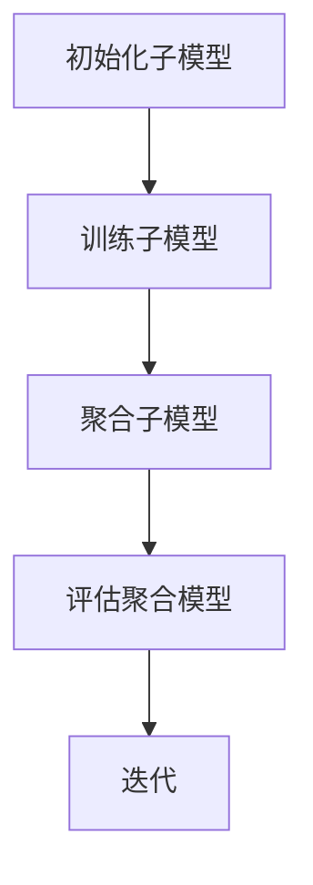
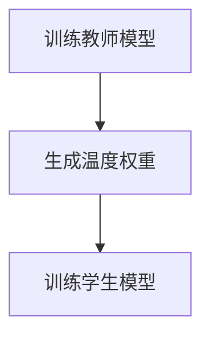
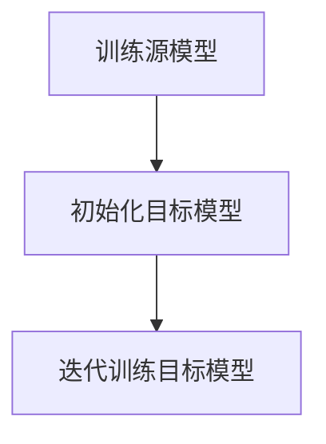
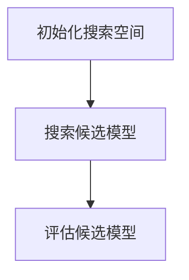
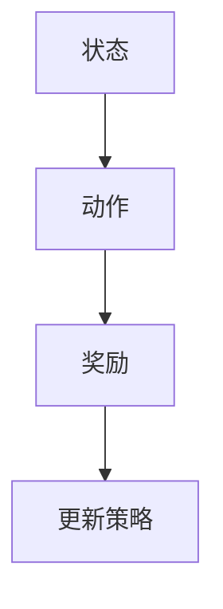

                 

# 企业级元学习框架：快速适应新业务场景

关键词：元学习，企业级应用，模型适应，样本效率，优化算法

摘要：随着业务的快速变化，企业需要机器学习模型能够快速适应新场景。元学习作为一种高效的学习方法，可以在有限的数据下快速构建适应新任务的模型。本文将探讨企业级元学习框架的构建，包括核心组件、模型与算法详解，以及其实际应用和优化方法。

## 第一部分：引论

### 第1章：背景介绍与核心概念

#### 1.1 问题描述与元学习背景

随着企业业务的不断扩展和变化，传统机器学习模型面临着新的挑战。传统机器学习模型通常依赖于大量标注数据，并且在一个固定的数据集上训练得到。这种方法在面对业务场景变化时，往往需要重新收集和标注大量数据，导致模型训练时间延长、成本增加。

为了解决这个问题，元学习（Meta-Learning）应运而生。元学习是一种让机器在学习新任务时能够快速适应和优化的方法，它通过在多个任务上进行训练，学习到一个通用的学习策略，从而在新的任务上能够迅速达到良好的性能。元学习的研究和应用，为企业级机器学习带来了新的可能。

#### 1.2 元学习的定义与特点

元学习可以定义为学习如何学习的方法。它通过在多个任务上训练，使得模型能够快速适应新的任务，而不需要重新从零开始训练。元学习的特点包括：

- **样本效率高**：元学习模型能够在较少的样本下达到良好的性能，大大减少了数据的需求。
- **泛化能力强**：元学习模型能够从多个任务中学习到通用的知识，从而在新的任务上表现出良好的泛化能力。
- **适应性强**：元学习模型能够快速适应新的任务，减少对新数据的依赖。

#### 1.3 元学习与传统机器学习的区别

传统机器学习模型通常在一个固定的数据集上训练，并且依赖于大量的标注数据。而元学习模型则是在多个任务上进行训练，学习到一个通用的学习策略，从而在新的任务上能够迅速达到良好的性能。具体区别如下：

- **数据需求**：传统机器学习需要大量的标注数据，而元学习只需要较少的数据。
- **训练时间**：传统机器学习模型训练时间较长，而元学习模型能够在较短的时间内达到良好的性能。
- **模型迁移性**：传统机器学习模型在新任务上往往需要重新训练，而元学习模型能够快速适应新任务。

#### 1.4 元学习的边界与外延

元学习的研究和应用范围非常广泛，包括但不限于以下领域：

- **自动驾驶**：元学习可以帮助自动驾驶系统快速适应不同的驾驶环境。
- **医疗诊断**：元学习可以用于快速构建适应不同疾病的诊断模型。
- **金融风控**：元学习可以帮助金融机构快速适应新的风险模式。

#### 1.5 元学习的核心要素组成

元学习的核心要素包括：

- **元学习模型**：元学习模型是元学习框架的核心，它负责在多个任务上学习到通用的学习策略。
- **元学习算法**：元学习算法是用于优化元学习模型的方法，它决定了模型在多个任务上的训练过程。
- **评估指标**：评估指标用于评估元学习模型在多个任务上的性能，常见的指标包括样本效率、泛化能力等。

### 第二部分：企业级元学习框架

#### 2.1 企业级元学习框架的必要性

在企业中，业务场景的不断变化对机器学习模型提出了更高的要求。传统机器学习模型在适应新业务场景时，往往需要重新收集和标注大量数据，导致模型训练时间延长、成本增加。而元学习框架可以解决这个问题，它通过在多个任务上进行训练，使得模型能够快速适应新的业务场景。

企业级元学习框架的必要性体现在以下几个方面：

- **降低成本**：元学习框架可以在较少的数据下快速适应新业务场景，减少数据收集和标注的成本。
- **提高效率**：元学习框架能够快速适应新业务场景，减少模型训练时间，提高工作效率。
- **增强适应性**：元学习框架使得模型能够从多个任务中学习到通用的知识，从而在新的业务场景上表现出良好的适应性。

#### 2.2 企业级元学习框架的核心组件

企业级元学习框架的核心组件包括元学习模型、元学习算法和评估指标。

- **元学习模型**：元学习模型是企业级元学习框架的核心，它负责在多个任务上学习到通用的学习策略。常见的元学习模型包括模型聚集、模型蒸馏和模型适配等。

- **元学习算法**：元学习算法是用于优化元学习模型的方法，它决定了模型在多个任务上的训练过程。常见的元学习算法包括模型搜索、强化学习和迁移学习等。

- **评估指标**：评估指标用于评估元学习模型在多个任务上的性能，常见的评估指标包括样本效率、泛化能力等。

#### 2.3 企业级元学习框架的应用场景

企业级元学习框架可以应用于多种业务场景，包括但不限于：

- **个性化推荐**：元学习框架可以帮助企业快速适应不同的用户群体，提供个性化的推荐服务。
- **图像识别**：元学习框架可以帮助企业快速适应不同的图像识别任务，提高图像识别的准确率。
- **自然语言处理**：元学习框架可以帮助企业快速适应不同的自然语言处理任务，提高自然语言处理的性能。

### 第三部分：元学习模型详解

#### 3.1 模型聚集（Model Aggregation）

模型聚集是一种常见的元学习模型，它通过聚合多个子模型来提高模型的性能。模型聚集的基本原理是将多个子模型训练在不同的数据集上，然后将这些子模型进行聚合，得到一个性能更好的模型。

#### 3.1.1 模型聚集的原理讲解

模型聚集的原理可以通过Mermaid流程图进行展示：



在模型聚集的过程中，首先初始化多个子模型，然后分别在不同的数据集上训练这些子模型。接下来，将这些子模型进行聚合，得到一个聚合模型。然后评估聚合模型在验证集上的性能，如果性能不佳，则进行迭代，重新训练子模型并进行聚合。

#### 3.1.2 模型聚集的Python代码示例

以下是一个简单的模型聚集的Python代码示例：

```python
# 导入必要的库
import torch
import torch.nn as nn
import torch.optim as optim

# 初始化子模型
model1 = nn.Linear(10, 5)
model2 = nn.Linear(10, 5)

# 训练子模型
for epoch in range(10):
    # 训练模型1
    optimizer1 = optim.SGD(model1.parameters(), lr=0.01)
    for data in data_loader1:
        optimizer1.zero_grad()
        output = model1(data)
        loss = nn.MSELoss()(output, target)
        loss.backward()
        optimizer1.step()
    
    # 训练模型2
    optimizer2 = optim.SGD(model2.parameters(), lr=0.01)
    for data in data_loader2:
        optimizer2.zero_grad()
        output = model2(data)
        loss = nn.MSELoss()(output, target)
        loss.backward()
        optimizer2.step()

# 聚合子模型
def aggregate(models):
    return sum(model(output) for model in models) / len(models)

# 评估聚合模型
output = aggregate([model1, model2])(input_data)
loss = nn.MSELoss()(output, target)

# 迭代
for epoch in range(10):
    # 重新训练子模型
    # ...
    # 重新评估聚合模型
    # ...
```

#### 3.2 模型蒸馏（Model Distillation）

模型蒸馏是一种通过将知识从一个大模型传递到一个小模型来提高小模型性能的方法。在模型蒸馏过程中，大模型通常被称为“教师模型”，小模型被称为“学生模型”。

#### 3.2.1 模型蒸馏的原理讲解

模型蒸馏的原理可以通过Mermaid流程图进行展示：



在模型蒸馏的过程中，首先训练一个大模型（教师模型），使其在任务上达到良好的性能。然后，使用教师模型的输出生成温度权重，这些权重用于指导学生模型的训练。学生模型通过模仿教师模型的输出，逐渐学习到教师模型的知识。

#### 3.2.2 模型蒸馏的Python代码示例

以下是一个简单的模型蒸馏的Python代码示例：

```python
# 导入必要的库
import torch
import torch.nn as nn
import torch.optim as optim

# 定义教师模型和学生模型
teacher_model = nn.Sequential(nn.Linear(10, 5), nn.ReLU(), nn.Linear(5, 1))
student_model = nn.Sequential(nn.Linear(10, 5), nn.ReLU(), nn.Linear(5, 1))

# 训练教师模型
optimizer_teacher = optim.SGD(teacher_model.parameters(), lr=0.01)
for epoch in range(10):
    for data in data_loader:
        optimizer_teacher.zero_grad()
        output = teacher_model(data)
        loss = nn.MSELoss()(output, target)
        loss.backward()
        optimizer_teacher.step()

# 生成温度权重
def generate_temperature_weights(output):
    temperature = 2.0
    return 1 / (temperature * torch.std(output, dim=0))

# 训练学生模型
optimizer_student = optim.SGD(student_model.parameters(), lr=0.01)
for epoch in range(10):
    for data in data_loader:
        optimizer_student.zero_grad()
        teacher_output = teacher_model(data)
        student_output = student_model(data)
        loss = nn.MSELoss()(student_output, generate_temperature_weights(teacher_output))
        loss.backward()
        optimizer_student.step()
```

#### 3.3 模型适配（Model Adaptation）

模型适配是一种通过将已有的模型应用于新任务来快速提高模型性能的方法。模型适配通常涉及将现有模型进行调整，以适应新的数据分布和任务需求。

#### 3.3.1 模型适配的原理讲解

模型适配的原理可以通过Mermaid流程图进行展示：



在模型适配的过程中，首先训练一个源模型，使其在源任务上达到良好的性能。然后，初始化一个目标模型，并将其调整为适应目标任务的模型。接下来，通过迭代训练目标模型，使其在目标任务上达到良好的性能。

#### 3.3.2 模型适配的Python代码示例

以下是一个简单的模型适配的Python代码示例：

```python
# 导入必要的库
import torch
import torch.nn as nn
import torch.optim as optim

# 定义源模型和目标模型
source_model = nn.Sequential(nn.Linear(10, 5), nn.ReLU(), nn.Linear(5, 1))
target_model = nn.Sequential(nn.Linear(10, 5), nn.ReLU(), nn.Linear(5, 1))

# 训练源模型
optimizer_source = optim.SGD(source_model.parameters(), lr=0.01)
for epoch in range(10):
    for data in data_loader_source:
        optimizer_source.zero_grad()
        output = source_model(data)
        loss = nn.MSELoss()(output, target)
        loss.backward()
        optimizer_source.step()

# 初始化目标模型
target_model.load_state_dict(source_model.state_dict())

# 迭代训练目标模型
optimizer_target = optim.SGD(target_model.parameters(), lr=0.01)
for epoch in range(10):
    for data in data_loader_target:
        optimizer_target.zero_grad()
        output = target_model(data)
        loss = nn.MSELoss()(output, target)
        loss.backward()
        optimizer_target.step()
```

### 第四部分：元学习算法与优化

#### 4.1 模型搜索算法

模型搜索算法是一种通过搜索空间中的模型来找到最优模型的方法。模型搜索算法可以分为基于随机搜索的算法和基于启发式的算法。

#### 4.1.1 模型搜索算法的原理讲解

模型搜索算法的原理可以通过Mermaid流程图进行展示：



在模型搜索算法中，首先初始化搜索空间，包括模型的结构、参数范围等。然后，从搜索空间中随机选择或基于启发式选择候选模型。接下来，评估候选模型的性能，并根据评估结果选择最优模型。

#### 4.1.2 模型搜索算法的Python代码示例

以下是一个简单的模型搜索算法的Python代码示例：

```python
# 导入必要的库
import random
import torch
import torch.nn as nn
import torch.optim as optim

# 定义搜索空间
search_space = {
    "layer_sizes": [(10, 5), (20, 10), (30, 15)],
    "activation_functions": ["relu", "tanh", "sigmoid"],
}

# 初始化搜索空间
search_space_size = len(search_space["layer_sizes"]) * len(search_space["activation_functions"])

# 搜索候选模型
best_model = None
best_loss = float("inf")
for i in range(100):
    # 随机选择模型结构
    layer_size = random.choice(search_space["layer_sizes"])
    activation_function = random.choice(search_space["activation_functions"])
    
    # 构建模型
    model = nn.Sequential(nn.Linear(10, layer_size[0]), activation_function(), nn.Linear(layer_size[0], layer_size[1]), activation_function(), nn.Linear(layer_size[1], 1))
    
    # 训练模型
    optimizer = optim.SGD(model.parameters(), lr=0.01)
    for epoch in range(10):
        for data in data_loader:
            optimizer.zero_grad()
            output = model(data)
            loss = nn.MSELoss()(output, target)
            loss.backward()
            optimizer.step()
    
    # 评估模型
    with torch.no_grad():
        loss = nn.MSELoss()(model(input_data), target)
    
    # 更新最优模型
    if loss < best_loss:
        best_loss = loss
        best_model = model
```

#### 4.2 强化学习算法

强化学习算法是一种通过试错学习来找到最优策略的方法。在元学习中，强化学习算法可以用于优化模型的策略，使其在多个任务上表现出更好的性能。

#### 4.2.1 强化学习算法的原理讲解

强化学习算法的原理可以通过Mermaid流程图进行展示：



在强化学习算法中，首先定义状态、动作和奖励。然后，模型在状态中进行动作选择，并根据动作的奖励来更新策略。通过不断试错，模型最终会找到最优策略。

#### 4.2.2 强化学习算法的Python代码示例

以下是一个简单的强化学习算法的Python代码示例：

```python
# 导入必要的库
import random
import torch
import torch.nn as nn
import torch.optim as optim

# 定义状态、动作和奖励
state_space = ["s1", "s2", "s3"]
action_space = ["a1", "a2", "a3"]
reward_function = {
    "s1": {"a1": 1, "a2": -1, "a3": -1},
    "s2": {"a1": -1, "a2": 1, "a3": -1},
    "s3": {"a1": -1, "a2": -1, "a3": 1},
}

# 定义策略网络
policy_network = nn.Sequential(nn.Linear(3, 10), nn.ReLU(), nn.Linear(10, 3))
optimizer = optim.Adam(policy_network.parameters(), lr=0.01)

# 强化学习算法
for episode in range(100):
    state = random.choice(state_space)
    action = random.choice(action_space)
    reward = reward_function[state][action]
    
    with torch.no_grad():
        state_tensor = torch.tensor([state], dtype=torch.float32)
        action_tensor = torch.tensor([action], dtype=torch.float32)
        reward_tensor = torch.tensor([reward], dtype=torch.float32)
    
    # 前向传播
    action_probabilities = policy_network(state_tensor)
    selected_action = torch.argmax(action_probabilities).item()
    
    # 反向传播
    loss = nn.MSEL

